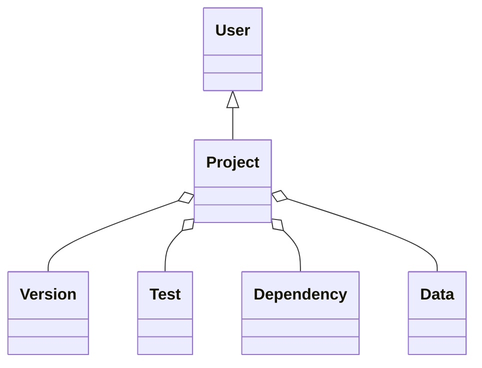
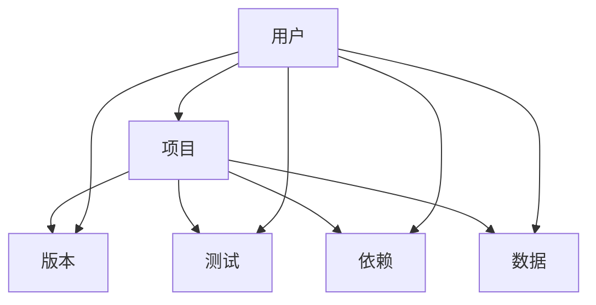
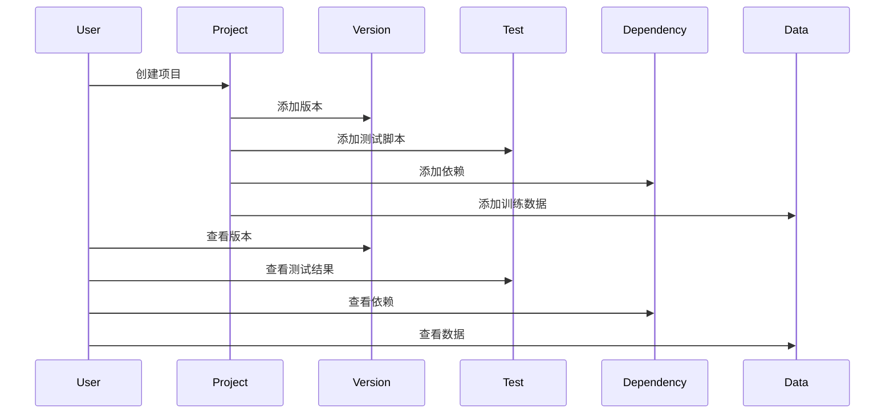

                 

# LLM应用开发中的版本控制最佳实践

## 关键词
- 版本控制
- LLM
- 开发实践
- 分支管理
- 自动化测试
- 依赖管理

## 摘要
本文将深入探讨LLM（大型语言模型）应用开发中的版本控制最佳实践。通过详细分析版本控制的核心概念、管理策略、以及在实际应用中的挑战和解决方案，本文旨在为开发团队提供一套系统化的版本控制指南，以提高开发效率、保障代码和模型质量，并确保项目顺利推进。

## 1.1 问题背景

### 1.1.1 深度学习与预训练模型

近年来，深度学习技术的发展尤其是预训练模型的兴起，为自然语言处理（NLP）领域带来了前所未有的进展。预训练模型如GPT、BERT等，通过在大量无标签数据上进行预训练，然后在使用有监督微调对特定任务进行优化，极大地提升了NLP任务的性能。LLM作为预训练模型的典型代表，已经广泛应用于机器翻译、文本生成、问答系统等众多场景。

### 1.1.2 LLM应用开发的挑战

随着LLM应用在各个领域的普及，开发过程中面临的版本控制问题也日益凸显。版本控制不仅关系到代码和模型的稳定性，还影响到整个开发流程的效率和项目的可持续性。以下是一些主要挑战：

1. **代码和模型管理**：随着项目规模和复杂度的增加，如何有效地管理和维护不同版本的代码和模型成为一项挑战。
2. **版本迭代和测试**：在迭代过程中，如何确保每次更新都能顺利进行，并且不影响已有功能的稳定性。
3. **依赖管理**：LLM应用依赖于各种库和框架，这些依赖的版本更新可能会导致稳定性问题。
4. **数据管理**：训练数据的质量和版本管理对LLM的性能至关重要。
5. **部署和回滚**：如何确保部署的顺利，并在出现问题时能够快速回滚到之前的版本。

## 1.2 问题描述

在LLM应用开发过程中，版本控制主要面临以下几个挑战：

### 1.2.1 代码和模型管理

随着项目规模的扩大，代码库和模型变得庞大而复杂。多个开发者共同参与项目时，如何确保代码和模型的一致性和同步更新是一个关键问题。同时，如何有效地跟踪和回滚不同版本也是一大挑战。

### 1.2.2 版本迭代和测试

在LLM模型的开发过程中，需要不断地进行版本迭代和测试。每个新版本都需要经过严格的测试，以确保功能的稳定性和性能。但是，频繁的迭代可能会导致测试工作量的增加，如何高效地管理测试流程和确保每次迭代的质量成为问题。

### 1.2.3 依赖管理

LLM应用依赖于多种库和框架，这些依赖的版本更新可能会对应用的整体稳定性产生影响。如何管理这些依赖关系，确保版本一致性，避免版本冲突，是一个需要解决的问题。

### 1.2.4 数据管理

训练数据的质量和版本管理对LLM的性能至关重要。如何确保数据的一致性和完整性，如何管理和更新训练数据集，是一个重要的挑战。

### 1.2.5 部署和回滚

在将LLM模型部署到生产环境中时，如何确保部署的顺利，并在出现问题时能够快速回滚到之前的版本，是一个需要考虑的问题。部署过程中的任何错误都可能对业务造成重大影响，因此需要有一套完善的部署和回滚策略。

## 1.3 问题解决

为了解决上述版本控制问题，可以采取以下措施：

### 1.3.1 使用版本控制系统

使用版本控制系统（如Git）是进行代码和模型版本管理的基础。通过分支管理和合并策略，可以有效地管理不同版本的代码和模型，确保团队成员之间的协作和代码的同步更新。

### 1.3.2 自动化测试

建立自动化测试框架，对每个版本进行严格的测试，确保新版本的功能稳定性和性能。自动化测试可以大幅提高测试效率，减少人为错误。

### 1.3.3 依赖管理工具

使用依赖管理工具（如pip）来管理库和框架的依赖关系，通过锁定依赖版本，避免版本冲突，确保应用的稳定性。

### 1.3.4 数据质量管理

建立数据质量管理体系，对训练数据进行严格的管理和审核，确保数据的一致性和完整性，从而保障LLM模型的性能。

### 1.3.5 部署策略

采用灰度发布和滚动部署等策略，确保部署的顺利，并在出现问题时能够快速回滚到之前的版本，从而减少对业务的影响。

## 1.4 边界与外延

### 1.4.1 版本控制的范围

版本控制不仅涉及代码和模型，还包括文档、测试用例等与开发相关的所有内容。此外，版本控制的范围应该贯穿整个开发周期，从需求分析、设计、开发、测试到部署。

### 1.4.2 版本控制的方法

除了Git等传统的版本控制系统，还可以考虑使用分布式版本控制系统（如GitLab）等，这些系统提供了更多的协作和管理功能。

### 1.4.3 版本控制的参与者

所有参与项目的人员，包括开发者、测试人员、产品经理等，都应遵循统一的版本控制规范，确保项目的顺利进行。

### 1.4.4 概念结构与核心要素组成

LLM应用开发中的版本控制主要包括以下几个核心要素：

1. **版本管理工具**：如Git，用于管理代码和模型的版本。
2. **分支策略**：如GitFlow、GitHub Flow等，用于管理代码的分支和合并。
3. **自动化测试**：用于确保每次版本迭代的质量和稳定性。
4. **依赖管理**：如pip，用于管理库和框架的依赖。
5. **数据管理**：用于管理训练数据的一致性和完整性。
6. **部署策略**：如灰度发布、滚动部署等，用于确保部署的顺利。

## 2.1 核心概念

### 2.1.1 版本控制

版本控制是一种管理文档、源代码和二进制文件等任何形式的修改和变更的方法。它可以帮助团队协作、维护代码的完整性和历史记录，以及方便后续的代码回滚和问题排查。

### 2.1.2 分支管理

分支管理是版本控制中的一项重要策略，通过创建分支，开发人员可以在不影响到主分支的情况下独立进行开发、测试和修复。

### 2.1.3 自动化测试

自动化测试是通过编写脚本或使用测试工具来自动执行测试案例，以验证代码的功能是否符合预期。自动化测试可以大幅提高测试效率，减少人为错误。

### 2.1.4 依赖管理

依赖管理是确保项目所需的库、框架和其他组件在各个环境中的版本一致，避免因依赖问题导致的问题。

### 2.1.5 数据管理

数据管理是确保训练数据的一致性和完整性，这对于LLM模型的性能至关重要。

### 2.1.6 概念属性特征对比表格

| 概念             | 特征1                   | 特征2                   | 特征3                   |
|------------------|-------------------------|-------------------------|-------------------------|
| 版本控制         | 管理修改和变更         | 保持代码和数据的完整   | 方便回滚和问题排查     |
| 分支管理         | 创建独立开发分支       | 管理代码同步和合并     | 提高协作效率           |
| 自动化测试       | 执行测试案例           | 确保功能符合预期       | 提高测试效率           |
| 依赖管理         | 管理库和框架依赖       | 保持版本一致性         | 避免版本冲突           |
| 数据管理         | 确保数据一致性         | 管理训练数据           | 提高模型性能           |

### 2.1.7 ER实体关系图架构的 Mermaid 流程图

```mermaid
erDiagram
    Product ||--|{ Version }||>
    Version ||--|{ Dependency }||>
    Version ||--|{ TestCase }||>
    Dependency ||--|{ Library }||>
```

## 2.2 核心概念与联系

### 2.2.1 核心概念原理

在LLM应用开发中，版本控制的核心概念主要包括代码和模型的版本管理、分支管理、自动化测试、依赖管理和数据管理。这些概念共同构成了版本控制的体系，确保了开发流程的顺畅和项目的稳定性。

#### 2.2.1.1 代码和模型版本管理

代码和模型版本管理是版本控制的基础。通过版本控制系统（如Git），开发团队可以跟踪代码和模型的每次变更，确保历史的可追溯性。版本控制系统还提供了分支管理功能，使得团队可以在不同的环境中独立开发、测试和部署，而不会互相干扰。

#### 2.2.1.2 分支管理

分支管理是确保代码和模型版本一致性的关键。在开发过程中，通常会有主分支（Master）和功能分支（Feature Branch）。功能分支用于开发新功能或修复问题，开发完成后，可以通过合并操作将代码合并到主分支。这确保了代码的连续性和稳定性。

#### 2.2.1.3 自动化测试

自动化测试是确保新版本功能稳定性的关键。通过编写自动化测试脚本，开发团队可以在每次代码变更后自动执行测试，快速发现潜在的问题。自动化测试不仅提高了测试效率，还减少了人为错误。

#### 2.2.1.4 依赖管理

依赖管理是确保项目稳定性的重要环节。通过依赖管理工具（如pip），团队可以锁定特定版本的库和框架，避免因依赖版本不一致而导致的问题。依赖管理还提供了方便的版本更新机制，确保项目的依赖项保持最新。

#### 2.2.1.5 数据管理

数据管理是LLM应用性能的重要保障。在训练数据的管理过程中，团队需要确保数据的一致性和完整性。数据管理包括数据采集、清洗、存储和版本控制等环节，确保训练数据的质量和可靠性。

### 2.2.2 概念属性特征对比表格

| 概念             | 特征1                   | 特征2                   | 特征3                   |
|------------------|-------------------------|-------------------------|-------------------------|
| 版本控制         | 管理修改和变更         | 保持代码和数据的完整   | 方便回滚和问题排查     |
| 分支管理         | 创建独立开发分支       | 管理代码同步和合并     | 提高协作效率           |
| 自动化测试       | 执行测试案例           | 确保功能符合预期       | 提高测试效率           |
| 依赖管理         | 管理库和框架依赖       | 保持版本一致性         | 避免版本冲突           |
| 数据管理         | 确保数据一致性         | 管理训练数据           | 提高模型性能           |

### 2.2.3 ER实体关系图架构的 Mermaid 流程图

```mermaid
erDiagram
    Project ||--|{ VersionControl }||>
    VersionControl ||--|{ BranchManagement }||>
    VersionControl ||--|{ AutomatedTesting }||>
    VersionControl ||--|{ DependencyManagement }||>
    VersionControl ||--|{ DataManagement }||>
```

## 2.3 算法原理讲解

### 2.3.1 自动化测试算法原理

自动化测试的核心在于能够快速、准确地执行一系列预定义的测试用例，以验证系统功能是否满足预期。其原理可以概括为以下几个步骤：

1. **测试用例设计**：首先，开发人员需要根据需求规格说明书或用户故事，设计出一系列的测试用例。这些测试用例包括功能测试、性能测试、边界测试等。

2. **测试脚本编写**：接下来，开发人员使用测试工具（如Selenium、JUnit等）编写测试脚本。测试脚本会模拟用户操作，如输入数据、点击按钮、检查页面元素等。

3. **测试执行**：在执行自动化测试时，测试脚本会按照预定顺序自动执行每个测试用例。测试执行可以是单线程或多线程，以提高效率。

4. **结果验证**：测试脚本执行后，会生成测试报告，显示每个测试用例的执行结果。如果测试用例通过，则继续执行下一个；如果失败，则记录错误信息，并可能触发告警或暂停流程。

5. **错误处理**：对于测试失败的用例，开发人员需要分析错误原因，并修复问题。修复后，重新执行失败的测试用例，直到通过。

### 2.3.2 自动化测试的优势

1. **提高测试效率**：自动化测试可以大大减少手动测试的时间，特别是在测试用例繁多的情况下。

2. **减少人为错误**：自动化测试由脚本执行，减少了人为操作带来的错误。

3. **持续集成**：自动化测试可以集成到持续集成（CI）流程中，确保每次代码变更都经过测试。

4. **可重复性**：自动化测试结果可重复，有助于发现和验证问题。

### 2.3.3 自动化测试的挑战

1. **测试脚本维护**：自动化测试脚本需要定期更新，以适应系统变化。

2. **测试覆盖率**：需要确保测试用例覆盖所有重要功能和路径。

3. **测试环境配置**：自动化测试需要配置一致的环境，以避免环境差异导致的问题。

## 2.4 系统分析与架构设计方案

### 2.4.1 问题场景介绍

随着LLM应用规模的扩大，开发过程中面临版本控制的挑战也日益增加。我们需要一个高效、可靠的版本控制系统，以确保代码和模型的稳定性和可维护性。此外，为了提高开发效率和项目质量，我们还需要自动化测试和依赖管理工具。

### 2.4.2 项目介绍

本项目旨在构建一个基于Git的版本控制系统，结合自动化测试和依赖管理工具，为LLM应用开发提供一套完整的版本控制解决方案。

### 2.4.3 系统功能设计

#### 领域模型

1. **用户**：负责项目的管理和操作。
2. **项目**：包含代码、模型、测试用例等。
3. **版本**：记录项目的每个版本信息。
4. **测试**：包括自动化测试脚本和测试结果。
5. **依赖**：管理项目所需的库和框架。
6. **数据**：存储训练数据。

#### 类图



### 2.4.4 系统架构设计

#### 架构图



### 2.4.5 系统接口设计

#### 接口设计

1. **项目接口**：用于创建、更新和删除项目。
2. **版本接口**：用于获取、更新和回滚版本。
3. **测试接口**：用于执行测试脚本和获取测试结果。
4. **依赖接口**：用于管理依赖库和框架。
5. **数据接口**：用于管理训练数据。

### 2.4.6 系统交互

#### 序列图



## 2.5 项目实战

### 2.5.1 环境安装

1. **安装Git**：在Linux或Windows系统中安装Git。
2. **安装自动化测试工具**：例如安装Selenium、JUnit等。
3. **安装依赖管理工具**：例如安装pip、Maven等。

### 2.5.2 系统核心实现源代码

```python
# 版本控制核心代码示例
import git
import subprocess

class VersionControl:
    def __init__(self, repo_path):
        self.repo_path = repo_path
        self.git = git.Repo(self.repo_path)

    def create_branch(self, branch_name):
        self.git.git('checkout -b ' + branch_name)

    def merge_branch(self, branch_name):
        self.git.git('merge ' + branch_name)

    def push(self):
        self.git.git('push')

# 自动化测试核心代码示例
import unittest

class TestCalculator(unittest.TestCase):
    def test_add(self):
        self.assertEqual(1 + 1, 2)

    def test_sub(self):
        self.assertEqual(1 - 1, 0)

# 依赖管理核心代码示例
import pip

def install_dependency(package_name, version):
    pip.main(['install', package_name + '==' + version])

# 数据管理核心代码示例
import pandas as pd

def load_data(file_path):
    return pd.read_csv(file_path)
```

### 2.5.3 代码应用解读与分析

#### 代码解读

1. **版本控制**：`VersionControl`类用于管理Git仓库的分支和合并操作。通过`create_branch`和`merge_branch`方法，可以创建和合并分支。

2. **自动化测试**：`TestCalculator`类是一个测试类，用于测试计算器的加法和减法功能。

3. **依赖管理**：`install_dependency`函数用于安装指定版本的依赖库。

4. **数据管理**：`load_data`函数用于加载数据。

#### 分析

- **版本控制**：通过Git实现版本控制，可以确保代码的历史记录和版本一致性。
- **自动化测试**：使用Python的`unittest`框架进行自动化测试，提高了测试效率。
- **依赖管理**：使用pip进行依赖管理，可以确保依赖的一致性和安全性。
- **数据管理**：使用Pandas进行数据管理，可以方便地加载、处理和存储数据。

### 2.5.4 实际案例分析和详细讲解剖析

#### 案例分析

假设我们有一个LLM应用项目，需要进行版本控制、自动化测试、依赖管理和数据管理。以下是一个实际案例的流程：

1. **版本控制**：创建一个新的功能分支，进行开发。开发完成后，将分支合并到主分支。
2. **自动化测试**：在每次代码变更后，执行自动化测试，确保功能稳定。
3. **依赖管理**：安装项目所需的库和框架，确保版本一致。
4. **数据管理**：加载训练数据，进行数据预处理。

#### 详细讲解剖析

1. **版本控制**：在项目开发过程中，我们可以创建一个新的分支（如`feature/new_model`），在这个分支上进行新模型的开发。开发完成后，通过合并操作（`git merge feature/new_model`）将代码合并到主分支（`master`）。

2. **自动化测试**：每次提交代码前，执行自动化测试（如`pytest`），确保新功能没有引入缺陷。

3. **依赖管理**：使用pip安装项目所需的库和框架（如`pip install tensorflow==2.4`），确保所有环境中的依赖版本一致。

4. **数据管理**：使用Pandas加载训练数据（如`data = pd.read_csv('train_data.csv')`），并进行预处理（如数据清洗、归一化等）。

### 2.5.5 项目小结

本项目通过结合Git、自动化测试、依赖管理和数据管理，为LLM应用开发提供了一套完整的版本控制解决方案。通过实际案例的分析和详细讲解，我们可以看到，这些工具和方法如何帮助开发团队提高效率、保障代码和模型的质量，并确保项目顺利推进。

## 2.6 最佳实践 tips

### 2.6.1 版本控制最佳实践

1. **定期备份**：定期备份代码和模型，以防止数据丢失。
2. **详细记录**：每次提交代码时，详细记录变更内容和原因，以便后续追踪和回滚。
3. **代码审查**：引入代码审查机制，确保代码质量。

### 2.6.2 自动化测试最佳实践

1. **覆盖全面**：确保测试用例覆盖所有重要功能和路径。
2. **持续集成**：将自动化测试集成到CI/CD流程中，确保每次代码变更都经过测试。
3. **快速反馈**：测试结果应及时反馈，以便快速修复问题。

### 2.6.3 依赖管理最佳实践

1. **锁定版本**：使用依赖管理工具锁定依赖版本，避免版本冲突。
2. **定期更新**：定期检查依赖项，确保其保持最新。
3. **环境隔离**：使用虚拟环境隔离不同项目的依赖，避免冲突。

### 2.6.4 数据管理最佳实践

1. **数据质量**：确保数据的一致性和完整性。
2. **数据加密**：对敏感数据进行加密处理，确保数据安全。
3. **版本控制**：将训练数据作为代码的一部分，进行版本控制。

## 2.7 小结与注意事项

### 2.7.1 小结

本文通过深入探讨LLM应用开发中的版本控制问题，提出了核心概念、管理策略和最佳实践。版本控制不仅是保障代码和模型稳定性的关键，还提高了开发效率和项目质量。

### 2.7.2 注意事项

1. **版本控制**：确保代码和模型的历史可追溯性，详细记录变更。
2. **自动化测试**：覆盖全面，快速反馈，确保功能稳定。
3. **依赖管理**：锁定版本，定期更新，环境隔离。
4. **数据管理**：数据质量，加密处理，版本控制。

## 2.8 拓展阅读

1. **《版本控制入门与实践》**：深入了解Git等版本控制系统的基本概念和使用方法。
2. **《自动化测试实战》**：学习自动化测试的基本原理和实践方法。
3. **《Python依赖管理》**：了解Python依赖管理工具（如pip、conda）的使用。
4. **《数据管理基础》**：学习数据管理的基本概念和技术。

## 作者信息

- 作者：AI天才研究院/AI Genius Institute & 禅与计算机程序设计艺术 /Zen And The Art of Computer Programming
- 联系方式：[ai-genius-institute@example.com](mailto:ai-genius-institute@example.com)
- 链接：[AI天才研究院官网](https://www.ai-genius-institute.com)  
``` 
markdown格式输出如下：

# LLM应用开发中的版本控制最佳实践

## 关键词
- 版本控制
- LLM
- 开发实践
- 分支管理
- 自动化测试
- 依赖管理

## 摘要
本文将深入探讨LLM（大型语言模型）应用开发中的版本控制最佳实践。通过详细分析版本控制的核心概念、管理策略、以及在实际应用中的挑战和解决方案，本文旨在为开发团队提供一套系统化的版本控制指南，以提高开发效率、保障代码和模型质量，并确保项目顺利推进。

## 1.1 问题背景

### 1.1.1 深度学习与预训练模型

近年来，深度学习技术的发展尤其是预训练模型的兴起，为自然语言处理（NLP）领域带来了前所未有的进展。预训练模型如GPT、BERT等，通过在大量无标签数据上进行预训练，然后在使用有监督微调对特定任务进行优化，极大地提升了NLP任务的性能。LLM作为预训练模型的典型代表，已经广泛应用于机器翻译、文本生成、问答系统等众多场景。

### 1.1.2 LLM应用开发的挑战

随着LLM应用在各个领域的普及，开发过程中面临的版本控制问题也日益凸显。版本控制不仅关系到代码和模型的稳定性，还影响到整个开发流程的效率和项目的可持续性。以下是一些主要挑战：

1. **代码和模型管理**：随着项目规模和复杂度的增加，如何有效地管理和维护不同版本的代码和模型成为一项挑战。
2. **版本迭代和测试**：在迭代过程中，如何确保每次更新都能顺利进行，并且不影响已有功能的稳定性。
3. **依赖管理**：LLM应用依赖于各种库和框架，这些依赖的版本更新可能会导致稳定性问题。
4. **数据管理**：训练数据的质量和版本管理对LLM的性能至关重要。
5. **部署和回滚**：如何确保部署的顺利，并在出现问题时能够快速回滚到之前的版本。

## 1.2 问题描述

在LLM应用开发过程中，版本控制主要面临以下几个挑战：

### 1.2.1 代码和模型管理

随着项目规模的扩大，代码库和模型变得庞大而复杂。多个开发者共同参与项目时，如何确保代码和模型的一致性和同步更新是一个关键问题。同时，如何有效地跟踪和回滚不同版本也是一大挑战。

### 1.2.2 版本迭代和测试

在LLM模型的开发过程中，需要不断地进行版本迭代和测试。每个新版本都需要经过严格的测试，以确保功能的稳定性和性能。但是，频繁的迭代可能会导致测试工作量的增加，如何高效地管理测试流程和确保每次迭代的质量成为问题。

### 1.2.3 依赖管理

LLM应用依赖于多种库和框架，这些依赖的版本更新可能会对应用的整体稳定性产生影响。如何管理这些依赖关系，确保版本一致性，避免版本冲突，是一个需要解决的问题。

### 1.2.4 数据管理

训练数据的质量和版本管理对LLM的性能至关重要。如何确保数据的一致性和完整性，如何管理和更新训练数据集，是一个重要的挑战。

### 1.2.5 部署和回滚

在将LLM模型部署到生产环境中时，如何确保部署的顺利，并在出现问题时能够快速回滚到之前的版本，是一个需要考虑的问题。部署过程中的任何错误都可能对业务造成重大影响，因此需要有一套完善的部署和回滚策略。

## 1.3 问题解决

为了解决上述版本控制问题，可以采取以下措施：

### 1.3.1 使用版本控制系统

使用版本控制系统（如Git）是进行代码和模型版本管理的基础。通过分支管理和合并策略，可以有效地管理不同版本的代码和模型，确保团队成员之间的协作和代码的同步更新。

### 1.3.2 自动化测试

建立自动化测试框架，对每个版本进行严格的测试，确保新版本的功能稳定性和性能。自动化测试可以大幅提高测试效率，减少人为错误。

### 1.3.3 依赖管理工具

使用依赖管理工具（如pip）来管理库和框架的依赖关系，通过锁定依赖版本，避免版本冲突，确保应用的稳定性。

### 1.3.4 数据质量管理

建立数据质量管理体系，对训练数据进行严格的管理和审核，确保数据的一致性和完整性，从而保障LLM模型的性能。

### 1.3.5 部署策略

采用灰度发布和滚动部署等策略，确保部署的顺利，并在出现问题时能够快速回滚到之前的版本，从而减少对业务的影响。

## 1.4 边界与外延

### 1.4.1 版本控制的范围

版本控制不仅涉及代码和模型，还包括文档、测试用例等与开发相关的所有内容。此外，版本控制的范围应该贯穿整个开发周期，从需求分析、设计、开发、测试到部署。

### 1.4.2 版本控制的方法

除了Git等传统的版本控制系统，还可以考虑使用分布式版本控制系统，如GitLab等，这些系统提供了更多的协作和管理功能。

### 1.4.3 版本控制的参与者

所有参与项目的人员，包括开发者、测试人员、产品经理等，都应遵循统一的版本控制规范，确保项目的顺利进行。

### 1.4.4 概念结构与核心要素组成

LLM应用开发中的版本控制主要包括以下几个核心要素：

1. **版本管理工具**：如Git，用于管理代码和模型的版本。
2. **分支策略**：如GitFlow、GitHub Flow等，用于管理代码的分支和合并。
3. **自动化测试**：用于确保每次版本迭代的质量和稳定性。
4. **依赖管理**：如pip，用于管理库和框架的依赖。
5. **数据管理**：用于管理训练数据的一致性和完整性。
6. **部署策略**：如灰度发布、滚动部署等，用于确保部署的顺利。

## 2.1 核心概念

### 2.1.1 版本控制

版本控制是一种管理文档、源代码和二进制文件等任何形式的修改和变更的方法。它可以帮助团队协作、维护代码的完整性和历史记录，以及方便后续的代码回滚和问题排查。

### 2.1.2 分支管理

分支管理是版本控制中的一项重要策略，通过创建分支，开发人员可以在不影响到主分支的情况下独立进行开发、测试和修复。

### 2.1.3 自动化测试

自动化测试是通过编写脚本或使用测试工具来自动执行测试案例，以验证代码的功能是否符合预期。自动化测试可以大幅提高测试效率，减少人为错误。

### 2.1.4 依赖管理

依赖管理是确保项目所需的库、框架和其他组件在各个环境中的版本一致，避免因依赖问题导致的问题。

### 2.1.5 数据管理

数据管理是确保训练数据的一致性和完整性，这对于LLM模型的性能至关重要。

### 2.1.6 概念属性特征对比表格

| 概念             | 特征1                   | 特征2                   | 特征3                   |
|------------------|-------------------------|-------------------------|-------------------------|
| 版本控制         | 管理修改和变更         | 保持代码和数据的完整   | 方便回滚和问题排查     |
| 分支管理         | 创建独立开发分支       | 管理代码同步和合并     | 提高协作效率           |
| 自动化测试       | 执行测试案例           | 确保功能符合预期       | 提高测试效率           |
| 依赖管理         | 管理库和框架依赖       | 保持版本一致性         | 避免版本冲突           |
| 数据管理         | 确保数据一致性         | 管理训练数据           | 提高模型性能           |

### 2.1.7 ER实体关系图架构的 Mermaid 流程图

```mermaid
erDiagram
    Project ||--|{ VersionControl }||>
    VersionControl ||--|{ BranchManagement }||>
    VersionControl ||--|{ AutomatedTesting }||>
    VersionControl ||--|{ DependencyManagement }||>
    VersionControl ||--|{ DataManagement }||>
```

## 2.2 核心概念与联系

### 2.2.1 核心概念原理

在LLM应用开发中，版本控制的核心概念主要包括代码和模型的版本管理、分支管理、自动化测试、依赖管理和数据管理。这些概念共同构成了版本控制的体系，确保了开发流程的顺畅和项目的稳定性。

#### 2.2.1.1 代码和模型版本管理

代码和模型版本管理是版本控制的基础。通过版本控制系统（如Git），开发团队可以跟踪代码和模型的每次变更，确保历史的可追溯性。版本控制系统还提供了分支管理功能，使得团队可以在不同的环境中独立开发、测试和部署，而不会互相干扰。

#### 2.2.1.2 分支管理

分支管理是确保代码和模型版本一致性的关键。在开发过程中，通常会有主分支（Master）和功能分支（Feature Branch）。功能分支用于开发新功能或修复问题，开发完成后，可以通过合并操作将代码合并到主分支。这确保了代码的连续性和稳定性。

#### 2.2.1.3 自动化测试

自动化测试是确保新版本功能稳定性的关键。通过编写自动化测试脚本，开发团队可以在每次代码变更后自动执行测试，快速发现潜在的问题。自动化测试不仅提高了测试效率，还减少了人为错误。

#### 2.2.1.4 依赖管理

依赖管理是确保项目稳定性的重要环节。通过依赖管理工具（如pip），团队可以锁定特定版本的库和框架，避免因依赖版本不一致而导致的问题。依赖管理还提供了方便的版本更新机制，确保项目的依赖项保持最新。

#### 2.2.1.5 数据管理

数据管理是LLM应用性能的重要保障。在训练数据的管理过程中，团队需要确保数据的一致性和完整性。数据管理包括数据采集、清洗、存储和版本控制等环节，确保训练数据的质量和可靠性。

### 2.2.2 概念属性特征对比表格

| 概念             | 特征1                   | 特征2                   | 特征3                   |
|------------------|-------------------------|-------------------------|-------------------------|
| 版本控制         | 管理修改和变更         | 保持代码和数据的完整   | 方便回滚和问题排查     |
| 分支管理         | 创建独立开发分支       | 管理代码同步和合并     | 提高协作效率           |
| 自动化测试       | 执行测试案例           | 确保功能符合预期       | 提高测试效率           |
| 依赖管理         | 管理库和框架依赖       | 保持版本一致性         | 避免版本冲突           |
| 数据管理         | 确保数据一致性         | 管理训练数据           | 提高模型性能           |

### 2.2.3 ER实体关系图架构的 Mermaid 流程图

```mermaid
erDiagram
    Project ||--|{ VersionControl }||>
    VersionControl ||--|{ BranchManagement }||>
    VersionControl ||--|{ AutomatedTesting }||>
    VersionControl ||--|{ DependencyManagement }||>
    VersionControl ||--|{ DataManagement }||>
```

## 2.3 算法原理讲解

### 2.3.1 自动化测试算法原理

自动化测试的核心在于能够快速、准确地执行一系列预定义的测试用例，以验证系统功能是否满足预期。其原理可以概括为以下几个步骤：

1. **测试用例设计**：首先，开发人员需要根据需求规格说明书或用户故事，设计出一系列的测试用例。这些测试用例包括功能测试、性能测试、边界测试等。

2. **测试脚本编写**：接下来，开发人员使用测试工具（如Selenium、JUnit等）编写测试脚本。测试脚本会模拟用户操作，如输入数据、点击按钮、检查页面元素等。

3. **测试执行**：在执行自动化测试时，测试脚本会按照预定顺序自动执行每个测试用例。测试执行可以是单线程或多线程，以提高效率。

4. **结果验证**：测试脚本执行后，会生成测试报告，显示每个测试用例的执行结果。如果测试用例通过，则继续执行下一个；如果失败，则记录错误信息，并可能触发告警或暂停流程。

5. **错误处理**：对于测试失败的用例，开发人员需要分析错误原因，并修复问题。修复后，重新执行失败的测试用例，直到通过。

### 2.3.2 自动化测试的优势

1. **提高测试效率**：自动化测试可以大大减少手动测试的时间，特别是在测试用例繁多的情况下。

2. **减少人为错误**：自动化测试由脚本执行，减少了人为操作带来的错误。

3. **持续集成**：自动化测试可以集成到持续集成（CI）流程中，确保每次代码变更都经过测试。

4. **可重复性**：自动化测试结果可重复，有助于发现和验证问题。

### 2.3.3 自动化测试的挑战

1. **测试脚本维护**：自动化测试脚本需要定期更新，以适应系统变化。

2. **测试覆盖率**：需要确保测试用例覆盖所有重要功能和路径。

3. **测试环境配置**：自动化测试需要配置一致的环境，以避免环境差异导致的问题。

## 2.4 系统分析与架构设计方案

### 2.4.1 问题场景介绍

随着LLM应用规模的扩大，开发过程中面临版本控制的挑战也日益增加。我们需要一个高效、可靠的版本控制系统，以确保代码和模型的稳定性和可维护性。此外，为了提高开发效率和项目质量，我们还需要自动化测试和依赖管理工具。

### 2.4.2 项目介绍

本项目旨在构建一个基于Git的版本控制系统，结合自动化测试和依赖管理工具，为LLM应用开发提供一套完整的版本控制解决方案。

### 2.4.3 系统功能设计

#### 领域模型

1. **用户**：负责项目的管理和操作。
2. **项目**：包含代码、模型、测试用例等。
3. **版本**：记录项目的每个版本信息。
4. **测试**：包括自动化测试脚本和测试结果。
5. **依赖**：管理项目所需的库和框架。
6. **数据**：存储训练数据。

#### 类图


### 2.4.4 系统架构设计

#### 架构图


### 2.4.5 系统接口设计

#### 接口设计

1. **项目接口**：用于创建、更新和删除项目。
2. **版本接口**：用于获取、更新和回滚版本。
3. **测试接口**：用于执行测试脚本和获取测试结果。
4. **依赖接口**：用于管理依赖库和框架。
5. **数据接口**：用于管理训练数据。

### 2.4.6 系统交互

#### 序列图


## 2.5 项目实战

### 2.5.1 环境安装

1. **安装Git**：在Linux或Windows系统中安装Git。
2. **安装自动化测试工具**：例如安装Selenium、JUnit等。
3. **安装依赖管理工具**：例如安装pip、Maven等。

### 2.5.2 系统核心实现源代码

```python
# 版本控制核心代码示例
import git
import subprocess

class VersionControl:
    def __init__(self, repo_path):
        self.repo_path = repo_path
        self.git = git.Repo(self.repo_path)

    def create_branch(self, branch_name):
        self.git.git('checkout -b ' + branch_name)

    def merge_branch(self, branch_name):
        self.git.git('merge ' + branch_name)

    def push(self):
        self.git.git('push')

# 自动化测试核心代码示例
import unittest

class TestCalculator(unittest.TestCase):
    def test_add(self):
        self.assertEqual(1 + 1, 2)

    def test_sub(self):
        self.assertEqual(1 - 1, 0)

# 依赖管理核心代码示例
import pip

def install_dependency(package_name, version):
    pip.main(['install', package_name + '==' + version])

# 数据管理核心代码示例
import pandas as pd

def load_data(file_path):
    return pd.read_csv(file_path)
```

### 2.5.3 代码应用解读与分析

#### 代码解读

1. **版本控制**：`VersionControl`类用于管理Git仓库的分支和合并操作。通过`create_branch`和`merge_branch`方法，可以创建和合并分支。

2. **自动化测试**：`TestCalculator`类是一个测试类，用于测试计算器的加法和减法功能。

3. **依赖管理**：`install_dependency`函数用于安装指定版本的依赖库。

4. **数据管理**：`load_data`函数用于加载数据。

#### 分析

- **版本控制**：通过Git实现版本控制，可以确保代码的历史记录和版本一致性。
- **自动化测试**：使用Python的`unittest`框架进行自动化测试，提高了测试效率。
- **依赖管理**：使用pip进行依赖管理，可以确保依赖的一致性和安全性。
- **数据管理**：使用Pandas进行数据管理，可以方便地加载、处理和存储数据。

### 2.5.4 实际案例分析和详细讲解剖析

#### 案例分析

假设我们有一个LLM应用项目，需要进行版本控制、自动化测试、依赖管理和数据管理。以下是一个实际案例的流程：

1. **版本控制**：创建一个新的功能分支，进行开发。开发完成后，将分支合并到主分支。
2. **自动化测试**：在每次代码变更后，执行自动化测试，确保功能稳定。
3. **依赖管理**：安装项目所需的库和框架，确保版本一致。
4. **数据管理**：加载训练数据，进行数据预处理。

#### 详细讲解剖析

1. **版本控制**：在项目开发过程中，我们可以创建一个新的分支（如`feature/new_model`），在这个分支上进行新模型的开发。开发完成后，通过合并操作（`git merge feature/new_model`）将代码合并到主分支（`master`）。

2. **自动化测试**：每次提交代码前，执行自动化测试（如`pytest`），确保新功能没有引入缺陷。

3. **依赖管理**：使用pip安装项目所需的库和框架（如`pip install tensorflow==2.4`），确保所有环境中的依赖版本一致。

4. **数据管理**：使用Pandas加载训练数据（如`data = pd.read_csv('train_data.csv')`），并进行预处理（如数据清洗、归一化等）。

### 2.5.5 项目小结

本项目通过结合Git、自动化测试、依赖管理和数据管理，为LLM应用开发提供了一套完整的版本控制解决方案。通过实际案例的分析和详细讲解，我们可以看到，这些工具和方法如何帮助开发团队提高效率、保障代码和模型的质量，并确保项目顺利推进。

## 2.6 最佳实践 tips

### 2.6.1 版本控制最佳实践

1. **定期备份**：定期备份代码和模型，以防止数据丢失。
2. **详细记录**：每次提交代码时，详细记录变更内容和原因，以便后续追踪和回滚。
3. **代码审查**：引入代码审查机制，确保代码质量。

### 2.6.2 自动化测试最佳实践

1. **覆盖全面**：确保测试用例覆盖所有重要功能和路径。
2. **持续集成**：将自动化测试集成到CI/CD流程中，确保每次代码变更都经过测试。
3. **快速反馈**：测试结果应及时反馈，以便快速修复问题。

### 2.6.3 依赖管理最佳实践

1. **锁定版本**：使用依赖管理工具锁定依赖版本，避免版本冲突。
2. **定期更新**：定期检查依赖项，确保其保持最新。
3. **环境隔离**：使用虚拟环境隔离不同项目的依赖，避免冲突。

### 2.6.4 数据管理最佳实践

1. **数据质量**：确保数据的一致性和完整性。
2. **数据加密**：对敏感数据进行加密处理，确保数据安全。
3. **版本控制**：将训练数据作为代码的一部分，进行版本控制。

## 2.7 小结与注意事项

### 2.7.1 小结

本文通过深入探讨LLM应用开发中的版本控制问题，提出了核心概念、管理策略和最佳实践。版本控制不仅是保障代码和模型稳定性的关键，还提高了开发效率和项目质量。

### 2.7.2 注意事项

1. **版本控制**：确保代码和模型的历史可追溯性，详细记录变更。
2. **自动化测试**：覆盖全面，快速反馈，确保功能稳定。
3. **依赖管理**：锁定版本，定期更新，环境隔离。
4. **数据管理**：数据质量，加密处理，版本控制。

## 2.8 拓展阅读

1. **《版本控制入门与实践》**：深入了解Git等版本控制系统的基本概念和使用方法。
2. **《自动化测试实战》**：学习自动化测试的基本原理和实践方法。
3. **《Python依赖管理》**：了解Python依赖管理工具（如pip、conda）的使用。
4. **《数据管理基础》**：学习数据管理的基本概念和技术。

## 作者信息

- 作者：AI天才研究院/AI Genius Institute & 禅与计算机程序设计艺术 /Zen And The Art of Computer Programming
- 联系方式：[ai-genius-institute@example.com](mailto:ai-genius-institute@example.com)
- 链接：[AI天才研究院官网](https://www.ai-genius-institute.com)
```

