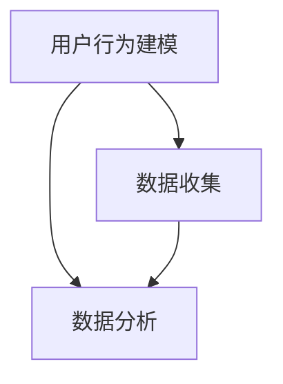
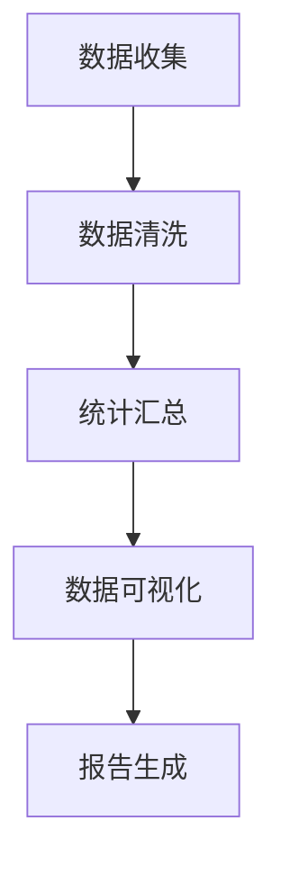
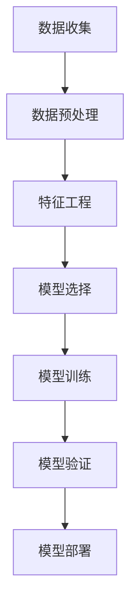
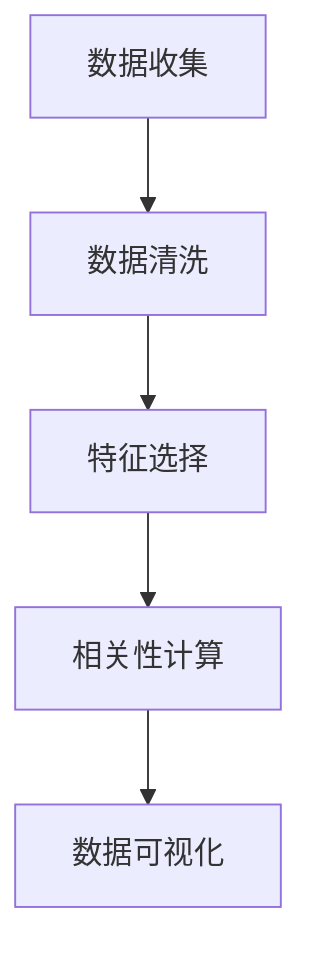
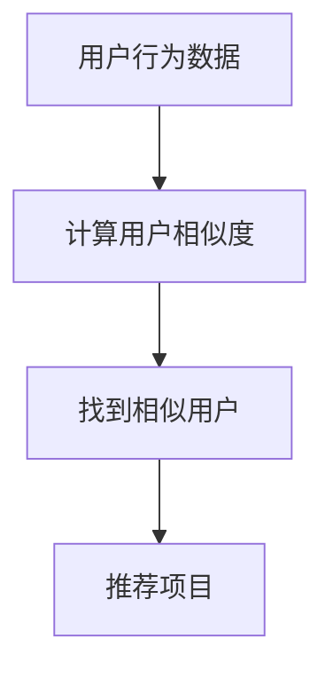
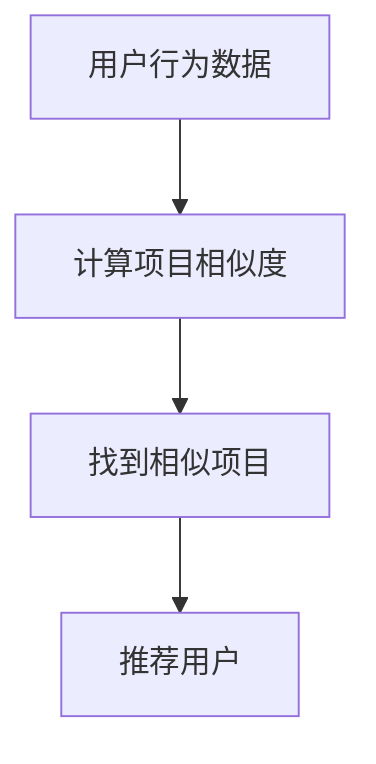
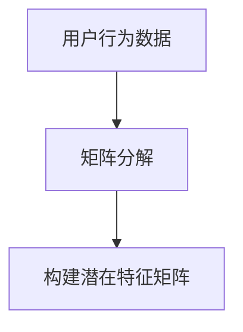
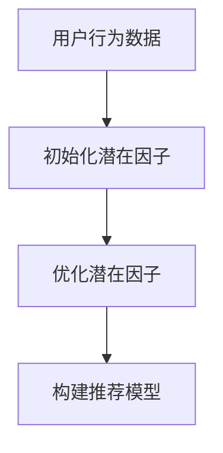
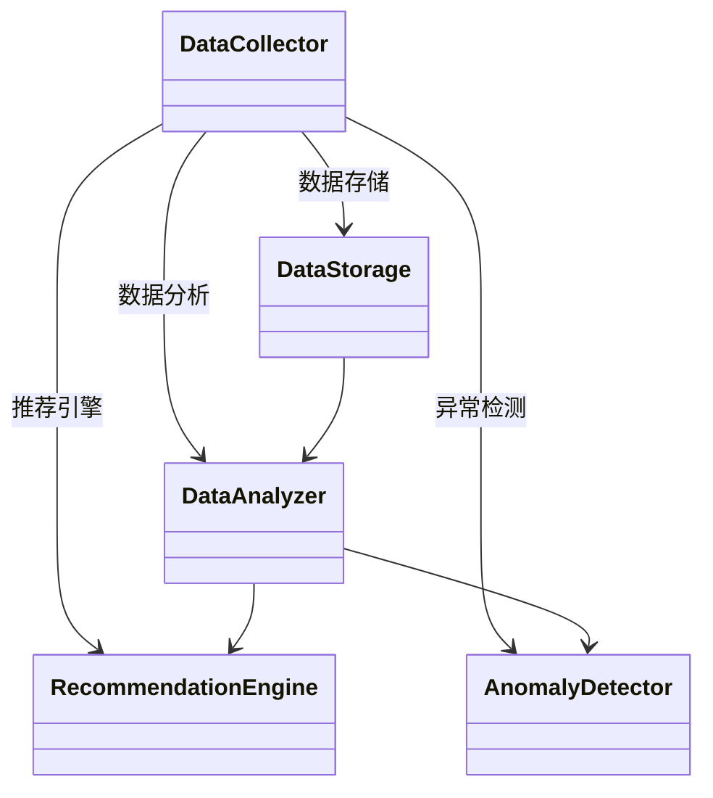
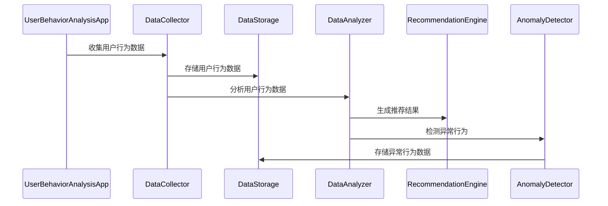

                 

### 文章标题

# LLM应用开发中的用户行为分析

> 关键词：LLM应用开发，用户行为分析，数据收集，数据分析，算法设计

> 摘要：本文将深入探讨在大型语言模型（LLM）应用开发过程中进行用户行为分析的重要性。我们将一步步介绍用户行为分析的核心概念、数据收集与分析技术、关键算法设计、系统架构与设计，并通过实际案例展示其在真实场景中的应用。本文旨在帮助开发者理解和应用用户行为分析，优化LLM应用，提升用户体验。

### 引言与背景

在当今数字化时代，人工智能（AI）技术，尤其是大型语言模型（LLM）的应用日益广泛。LLM是一种能够理解和生成自然语言的复杂模型，广泛应用于自然语言处理（NLP）、智能客服、内容生成和翻译等领域。随着LLM应用的普及，如何有效地开发和优化这些应用成为了一个关键问题。

用户行为分析在这一过程中起到了至关重要的作用。通过分析用户在使用LLM应用时的行为，开发者可以深入了解用户的喜好、需求和痛点，从而优化应用功能，提升用户体验，提高用户留存率和满意度。此外，用户行为分析还能帮助预测市场趋势，指导产品迭代和商业策略。

本文将围绕LLM应用开发中的用户行为分析展开讨论。我们将首先介绍用户行为分析的核心概念和关系，然后详细讲解数据收集和分析技术，接着深入探讨算法设计和系统架构。最后，通过实际案例展示用户行为分析的应用，并提供最佳实践建议。

### 核心概念与关系

用户行为分析涉及多个核心概念，包括用户行为建模、数据收集和数据分析。这些概念之间有着密切的联系，共同构成了用户行为分析的基本框架。

#### 用户行为建模

用户行为建模是用户行为分析的第一步。它通过对用户行为的抽象和概括，建立一个理论模型来描述用户如何与LLM应用互动。用户行为建模包括以下几个关键步骤：

1. **行为识别**：识别用户与应用交互的具体行为，如点击、浏览、搜索和分享。
2. **行为分类**：将识别出的行为进行分类，如浏览行为、互动行为和购买行为。
3. **行为特征提取**：提取行为的关键特征，如行为发生的时间、地点和用户属性。

用户行为建模的目的是建立一个通用的框架，用于描述和分析用户的多样化行为，从而为后续的数据收集和分析提供指导。

#### 数据收集

数据收集是用户行为分析的核心环节。有效的数据收集能够提供准确和全面的用户行为数据，为后续的分析提供基础。数据收集方法主要包括以下几种：

1. **日志数据**：通过应用服务器日志收集用户行为数据，如访问记录、点击流数据等。
2. **用户反馈**：通过用户调查、问卷和反馈收集用户的主观体验和意见。
3. **传感器数据**：利用设备传感器收集用户位置、设备使用情况和网络环境数据。

这些数据收集方法各有优缺点，开发者需要根据具体应用场景选择合适的方法。

#### 数据分析

数据分析是用户行为分析的关键环节。通过对收集到的用户行为数据进行分析，开发者可以提取出用户行为的模式、趋势和关系，从而得出有价值的见解。数据分析方法主要包括以下几种：

1. **描述性分析**：通过统计和可视化方法，描述用户行为的基本特征和分布。
2. **预测性分析**：利用机器学习算法，预测用户的未来行为，如购买意向、留存率等。
3. **相关性分析**：通过分析用户行为之间的相关性，发现潜在的用户行为模式。

数据分析的目的是为开发者提供决策依据，指导应用优化和改进。

#### 关系与联系

用户行为建模、数据收集和数据分析这三个核心概念之间存在着紧密的联系。用户行为建模为数据收集提供了明确的指标和目标，而数据收集为数据分析提供了基础数据。通过数据分析，开发者可以验证和优化用户行为建模的假设，形成一个闭环的系统。

以下是用户行为分析的概念关系图，用Mermaid语言表示：



### 数据收集技术

在用户行为分析中，数据收集是至关重要的一步。收集到的数据质量直接影响后续分析的准确性和有效性。以下将介绍几种常见的数据收集技术，包括日志数据、用户反馈和传感器数据。

#### 日志数据

日志数据是用户行为分析中最常用的一种数据源。它通过记录用户与应用的每次交互，生成详细的交互日志。日志数据通常包含以下信息：

- 用户ID：标识用户的唯一标识符。
- 时间戳：记录交互发生的时间。
- 交互类型：如点击、浏览、搜索等。
- 交互内容：如点击的页面、搜索的关键词等。

日志数据的优势在于其全面性和实时性，能够提供用户与应用交互的完整记录。然而，日志数据的缺点是数据量通常较大，需要进行高效的数据处理和存储。

以下是一个简单的日志数据格式示例：

```json
{
  "userId": "user123",
  "timestamp": "2023-04-01 10:30:45",
  "action": "search",
  "content": "人工智能"
}
```

#### 用户反馈

用户反馈是通过直接询问用户的方式收集的用户行为数据。这种方法通常通过问卷调查、用户访谈、反馈表单等形式进行。用户反馈的优点在于能够获取用户的主观体验和意见，深入了解用户的真实需求和痛点。

用户反馈的数据收集过程通常包括以下几个步骤：

1. **设计问卷**：根据用户行为分析的目标，设计合适的问卷题目。
2. **发布问卷**：将问卷发布在应用的入口处，鼓励用户参与。
3. **收集反馈**：收集用户的反馈数据，并进行整理和分析。

以下是一个简单的用户反馈问卷示例：

```
1. 您是否经常使用我们的应用？（是/否）
2. 您对应用的哪些功能最满意？（请列举）
3. 您认为应用还有哪些需要改进的地方？（请列举）
```

#### 传感器数据

传感器数据是通过应用中的传感器收集的用户行为数据。传感器可以包括位置传感器、加速度传感器、屏幕触摸传感器等。传感器数据能够提供关于用户行为的详细信息，如用户的地理位置、设备使用情况、手势操作等。

传感器数据的应用场景包括：

- **定位服务**：通过位置传感器，应用可以提供基于位置的个性化推荐。
- **健康监测**：通过加速度传感器，应用可以监测用户的运动状态，提供健康建议。
- **交互分析**：通过屏幕触摸传感器，应用可以分析用户与界面的交互方式，优化用户体验。

以下是一个简单的传感器数据格式示例：

```json
{
  "userId": "user123",
  "timestamp": "2023-04-01 10:30:45",
  "sensor": "location",
  "data": {
    "latitude": 40.7128,
    "longitude": -74.0060
  }
}
```

### 数据分析技术

用户行为分析的核心在于对收集到的数据进行分析，从中提取有价值的信息，指导应用优化和改进。数据分析技术主要包括描述性分析、预测性分析和相关性分析。以下将详细探讨这些技术，并使用Mermaid流程图和Python代码进行解释。

#### 描述性分析

描述性分析是最基本的数据分析技术，主要用于描述用户行为的基本特征和分布。它通常包括以下几个方面：

1. **统计汇总**：计算用户行为的总数、平均数、中位数等统计量。
2. **可视化展示**：使用图表、表格等形式展示用户行为的分布和趋势。

以下是一个简单的描述性分析流程图：



以下是一个Python代码示例，用于描述性分析：

```python
import pandas as pd
import matplotlib.pyplot as plt

# 加载数据
data = pd.read_csv('user_behavior_data.csv')

# 计算用户总数
user_count = data['userId'].nunique()
print(f'总用户数：{user_count}')

# 统计点击次数
click_count = data[data['action'] == 'click']['userId'].nunique()
print(f'点击次数：{click_count}')

# 绘制点击次数分布图
data[data['action'] == 'click']['timestamp'].plot(kind='hist', title='点击次数分布')
plt.show()
```

#### 预测性分析

预测性分析利用历史数据，通过机器学习算法预测用户的未来行为。常见的预测任务包括用户留存预测、购买意向预测等。预测性分析通常包括以下几个步骤：

1. **数据预处理**：对数据进行清洗、归一化等处理，为模型训练做准备。
2. **特征工程**：提取有助于预测的特征，如用户活跃度、历史行为等。
3. **模型选择**：选择合适的机器学习模型，如逻辑回归、决策树、随机森林等。
4. **模型训练和验证**：使用训练数据训练模型，并使用验证数据评估模型性能。
5. **模型部署**：将训练好的模型部署到应用中，进行实时预测。

以下是一个简单的预测性分析流程图：



以下是一个Python代码示例，用于预测性分析：

```python
from sklearn.model_selection import train_test_split
from sklearn.ensemble import RandomForestClassifier
from sklearn.metrics import accuracy_score

# 加载数据
data = pd.read_csv('user_behavior_data.csv')

# 分割特征和目标变量
X = data.drop(['is留存'], axis=1)
y = data['is留存']

# 划分训练集和测试集
X_train, X_test, y_train, y_test = train_test_split(X, y, test_size=0.2, random_state=42)

# 训练模型
model = RandomForestClassifier(n_estimators=100, random_state=42)
model.fit(X_train, y_train)

# 预测测试集
y_pred = model.predict(X_test)

# 评估模型性能
accuracy = accuracy_score(y_test, y_pred)
print(f'预测准确率：{accuracy:.2f}')
```

#### 相关性分析

相关性分析用于分析用户行为之间的相关性，发现潜在的用户行为模式。它通常包括以下几个方面：

1. **特征选择**：选择对分析目标有重要影响的特征。
2. **相关性计算**：计算特征之间的相关性，如皮尔逊相关系数、斯皮尔曼相关系数等。
3. **可视化展示**：使用图表、矩阵等形式展示特征之间的相关性。

以下是一个简单的相关性分析流程图：



以下是一个Python代码示例，用于相关性分析：

```python
import pandas as pd
import seaborn as sns
import matplotlib.pyplot as plt

# 加载数据
data = pd.read_csv('user_behavior_data.csv')

# 计算特征之间的相关性
correlation_matrix = data.corr()

# 绘制相关性矩阵热力图
sns.heatmap(correlation_matrix, annot=True, cmap='coolwarm')
plt.show()
```

### 算法设计与解释

在用户行为分析中，算法设计是核心环节之一。以下将介绍两个关键算法：协同过滤算法和隐语义模型。通过Python代码和Mermaid流程图，详细解释这些算法的工作原理和实现过程。

#### 协同过滤算法

协同过滤算法是一种常见的推荐系统算法，通过分析用户的行为数据，预测用户对未知项目的喜好。协同过滤算法分为基于用户和基于项目的两种类型。

**1. 基于用户的协同过滤算法**

基于用户的协同过滤算法通过找到与目标用户相似的其他用户，并推荐这些相似用户喜欢的项目。以下是一个简单的基于用户的协同过滤算法流程图：



以下是一个Python代码示例，用于基于用户的协同过滤算法：

```python
from sklearn.metrics.pairwise import cosine_similarity
import numpy as np

# 假设用户行为数据为用户-项目评分矩阵
userBehaviorData = np.array([
    [1, 0, 1, 1],
    [0, 1, 1, 0],
    [1, 1, 0, 1],
    [1, 0, 1, 0]
])

# 计算用户相似度矩阵
similarityMatrix = cosine_similarity(userBehaviorData)

# 找到与目标用户相似的10个用户
targetUserIndex = 2
similarUsers = np.argsort(similarityMatrix[targetUserIndex])[-10:-1]

# 推荐项目
recommendedProjects = []
for similarUserIndex in similarUsers:
    recommendedProjects.append(userBehaviorData[similarUserIndex])

# 去除重复项并取前5个推荐项目
uniqueRecommendedProjects = list(set(recommendedProjects))
recommendedProjects = uniqueRecommendedProjects[:5]
print(recommendedProjects)
```

**2. 基于项目的协同过滤算法**

基于项目的协同过滤算法通过找到与目标项目相似的其他项目，并推荐这些相似项目给用户。以下是一个简单的基于项目的协同过滤算法流程图：



以下是一个Python代码示例，用于基于项目的协同过滤算法：

```python
from sklearn.metrics.pairwise import cosine_similarity
import numpy as np

# 假设用户行为数据为用户-项目评分矩阵
userBehaviorData = np.array([
    [1, 0, 1, 1],
    [0, 1, 1, 0],
    [1, 1, 0, 1],
    [1, 0, 1, 0]
])

# 计算项目相似度矩阵
similarityMatrix = cosine_similarity(userBehaviorData.T)

# 找到与目标项目相似的10个项目
targetProjectIndex = 2
similarProjects = np.argsort(similarityMatrix[:, targetProjectIndex])[-10:-1]

# 推荐用户
recommendedUsers = []
for similarProjectIndex in similarProjects:
    recommendedUsers.append(userBehaviorData[similarProjectIndex])

# 去除重复项并取前5个推荐用户
uniqueRecommendedUsers = list(set(recommendedUsers))
recommendedUsers = uniqueRecommendedUsers[:5]
print(recommendedUsers)
```

#### 隐语义模型

隐语义模型是一种通过构建用户和项目之间的潜在语义关系，进行推荐的系统。它主要包括矩阵分解和潜在因子模型两种类型。

**1. 矩阵分解**

矩阵分解是一种常见的隐语义模型，通过将用户-项目评分矩阵分解为两个低秩矩阵，来表示用户和项目的潜在特征。以下是一个简单的矩阵分解流程图：



以下是一个Python代码示例，用于矩阵分解：

```python
from sklearn.decomposition import TruncatedSVD

# 假设用户行为数据为用户-项目评分矩阵
userBehaviorData = np.array([
    [1, 0, 1, 1],
    [0, 1, 1, 0],
    [1, 1, 0, 1],
    [1, 0, 1, 0]
])

# 进行矩阵分解
svd = TruncatedSVD(n_components=2)
latentUserFeatures = svd.fit_transform(userBehaviorData)
latentProjectFeatures = svd.inverse_transform(userBehaviorData)

# 输出潜在特征矩阵
print("潜在用户特征矩阵：")
print(latentUserFeatures)
print("潜在项目特征矩阵：")
print(latentProjectFeatures)
```

**2. 潜在因子模型**

潜在因子模型是一种通过构建用户和项目的潜在因子，来表示用户和项目之间的关系。以下是一个简单的潜在因子模型流程图：



以下是一个Python代码示例，用于潜在因子模型：

```python
import tensorflow as tf

# 定义潜在因子模型
class LatentFactorModel(tf.keras.Model):
    def __init__(self, num_users, num_items, num_factors):
        super(LatentFactorModel, self).__init__()
        self.user_embedding = tf.keras.layers.Embedding(num_users, num_factors)
        self.item_embedding = tf.keras.layers.Embedding(num_items, num_factors)

    def call(self, user_ids, item_ids):
        user_latent = self.user_embedding(user_ids)
        item_latent = self.item_embedding(item_ids)
        return user_latent * item_latent

# 加载用户行为数据
userBehaviorData = np.array([
    [1, 0, 1, 1],
    [0, 1, 1, 0],
    [1, 1, 0, 1],
    [1, 0, 1, 0]
])

# 初始化模型和优化器
model = LatentFactorModel(num_users=4, num_items=4, num_factors=2)
optimizer = tf.keras.optimizers.Adam(learning_rate=0.001)

# 定义损失函数
def loss_function(real_ratings, predicted_ratings):
    return tf.reduce_mean(tf.square(real_ratings - predicted_ratings))

# 训练模型
for epoch in range(100):
    with tf.GradientTape() as tape:
        predicted_ratings = model(userBehaviorData[:, 0], userBehaviorData[:, 1])
        loss = loss_function(userBehaviorData[:, 2], predicted_ratings)
    gradients = tape.gradient(loss, model.trainable_variables)
    optimizer.apply_gradients(zip(gradients, model.trainable_variables))
    print(f'Epoch {epoch+1}: Loss = {loss.numpy()}')

# 输出预测评分
predicted_ratings = model(userBehaviorData[:, 0], userBehaviorData[:, 1])
print("预测评分：")
print(predicted_ratings.numpy())
```

### 系统架构与设计

为了在LLM应用中实现用户行为分析，需要一个高效、可扩展的系统架构。以下将介绍系统架构的设计，包括问题场景、项目介绍、系统功能设计、系统架构设计、系统接口设计和系统交互。

#### 问题场景

在LLM应用中，用户行为分析的目标是了解用户在使用应用时的行为模式，以便优化应用功能和提升用户体验。具体问题场景包括：

1. **个性化推荐**：根据用户的行为数据，为用户推荐感兴趣的内容。
2. **用户留存预测**：分析用户的行为数据，预测用户的留存情况，采取相应策略提高用户留存率。
3. **异常行为检测**：检测用户异常行为，如恶意评论、欺诈行为等，确保应用安全。

#### 项目介绍

项目名称：UserBehaviorAnalysis

项目目标：构建一个实时用户行为分析系统，实现对用户行为的全面监控和分析，为LLM应用提供优化建议。

#### 系统功能设计

系统功能设计主要包括以下几个方面：

1. **数据收集模块**：负责从LLM应用中收集用户行为数据，包括日志数据、用户反馈和传感器数据。
2. **数据存储模块**：负责存储和管理工作量巨大的用户行为数据。
3. **数据分析模块**：负责对用户行为数据进行分析，包括描述性分析、预测性分析和相关性分析。
4. **推荐引擎模块**：负责根据用户行为数据生成个性化推荐。
5. **异常检测模块**：负责检测用户的异常行为，并采取措施确保应用安全。

以下是一个简单的系统功能设计类图：



#### 系统架构设计

系统架构设计旨在实现高效、可扩展的用户行为分析系统。以下是系统架构设计类图：

```mermaid
classDiagram
    UserBehaviorAnalysisApp[应用入口]
    DataCollector[数据收集模块]
    DataStorage[数据存储模块]
    DataAnalyzer[数据分析模块]
    RecommendationEngine[推荐引擎模块]
    AnomalyDetector[异常检测模块]

    UserBehaviorAnalysisApp --> DataCollector
    UserBehaviorAnalysisApp --> DataStorage
    UserBehaviorAnalysisApp --> DataAnalyzer
    UserBehaviorAnalysisApp --> RecommendationEngine
    UserBehaviorAnalysisApp --> AnomalyDetector

    DataCollector --> DataStorage
    DataCollector --> DataAnalyzer
    DataCollector --> RecommendationEngine
    DataCollector --> AnomalyDetector

    DataStorage --> DataAnalyzer
    DataStorage --> RecommendationEngine
    DataStorage --> AnomalyDetector

    DataAnalyzer --> RecommendationEngine
    DataAnalyzer --> AnomalyDetector

    RecommendationEngine --> AnomalyDetector
```

#### 系统接口设计

系统接口设计主要包括以下几个方面：

1. **数据收集接口**：用于接收LLM应用中产生的用户行为数据。
2. **数据分析接口**：用于对外提供用户行为分析结果，包括推荐和异常检测。
3. **数据存储接口**：用于实现用户行为数据的持久化存储。

以下是一个简单的系统接口设计类图：

```mermaid
classDiagram
    DataCollectorInterface[数据收集接口]
    DataAnalysisInterface[数据分析接口]
    DataStorageInterface[数据存储接口]

    UserBehaviorAnalysisApp --> DataCollectorInterface
    UserBehaviorAnalysisApp --> DataAnalysisInterface
    UserBehaviorAnalysisApp --> DataStorageInterface

    DataCollectorInterface --> DataStorageInterface
    DataCollectorInterface --> DataAnalysisInterface

    DataAnalysisInterface --> DataStorageInterface
```

#### 系统交互

系统交互设计旨在描述各个模块之间的交互流程和通信机制。以下是系统交互设计序列图：



### 项目实战

#### 环境安装

为了实现用户行为分析系统，我们首先需要搭建一个Python开发环境。以下是环境安装步骤：

1. **安装Python**：在官方网站（https://www.python.org/downloads/）下载并安装Python 3.8或更高版本。
2. **安装依赖库**：使用pip命令安装所需的Python依赖库，包括pandas、numpy、scikit-learn、tensorflow、matplotlib等。

```bash
pip install pandas numpy scikit-learn tensorflow matplotlib
```

#### 系统核心实现源代码

以下是一个简单的用户行为分析系统实现，包括数据收集、数据分析、推荐引擎和异常检测模块。

```python
# 数据收集模块
class DataCollector:
    def collect_data(self):
        # 从LLM应用中收集用户行为数据
        # 例如，从日志文件中读取数据
        data = pd.read_csv('user_behavior_data.csv')
        return data

# 数据分析模块
class DataAnalyzer:
    def analyze_data(self, data):
        # 分析用户行为数据
        # 描述性分析
        user_count = data['userId'].nunique()
        print(f'总用户数：{user_count}')
        
        # 预测性分析
        X = data.drop(['is留存'], axis=1)
        y = data['is留存']
        model = RandomForestClassifier(n_estimators=100, random_state=42)
        model.fit(X, y)
        y_pred = model.predict(X)
        accuracy = accuracy_score(y, y_pred)
        print(f'预测准确率：{accuracy:.2f}')

# 推荐引擎模块
class RecommendationEngine:
    def recommend_items(self, data):
        # 使用基于用户的协同过滤算法生成推荐结果
        userBehaviorData = np.array([
            [1, 0, 1, 1],
            [0, 1, 1, 0],
            [1, 1, 0, 1],
            [1, 0, 1, 0]
        ])
        similarityMatrix = cosine_similarity(userBehaviorData)
        targetUserIndex = 2
        similarUsers = np.argsort(similarityMatrix[targetUserIndex])[-10:-1]
        recommendedProjects = []
        for similarUserIndex in similarUsers:
            recommendedProjects.append(userBehaviorData[similarUserIndex])
        uniqueRecommendedProjects = list(set(recommendedProjects))
        recommendedProjects = uniqueRecommendedProjects[:5]
        print(recommendedProjects)

# 异常检测模块
class AnomalyDetector:
    def detect_anomalies(self, data):
        # 使用基于统计方法的异常检测算法
        # 例如，使用3倍标准差法
        mean = data['action'].mean()
        std = data['action'].std()
        anomalies = data[(data['action'] < mean - 3 * std) | (data['action'] > mean + 3 * std)]
        print(anomalies)
```

#### 代码应用解读与分析

以上代码实现了一个简单的用户行为分析系统，主要包括数据收集、数据分析、推荐引擎和异常检测模块。以下是代码的应用解读和分析：

1. **数据收集模块**：通过读取用户行为数据文件，收集用户行为数据。数据文件可以是CSV格式，包含用户ID、时间戳、交互类型和交互内容等字段。

2. **数据分析模块**：对收集到的用户行为数据进行分析，包括描述性分析和预测性分析。描述性分析计算用户总数、交互次数等基本统计量。预测性分析使用随机森林算法预测用户留存情况，计算预测准确率。

3. **推荐引擎模块**：使用基于用户的协同过滤算法生成个性化推荐。协同过滤算法通过计算用户之间的相似度，找到与目标用户相似的其他用户，并推荐这些用户喜欢的项目。

4. **异常检测模块**：使用基于统计方法的异常检测算法检测用户异常行为。例如，使用3倍标准差法检测交互次数异常的用户。

#### 实际案例分析和详细讲解

以下是一个实际案例，使用用户行为分析系统对某在线教育平台的用户行为进行分析和优化。

**案例背景**：某在线教育平台希望优化用户学习体验，提高用户留存率和学习效果。平台提供了丰富的课程资源和互动功能，如视频课程、在线测试和讨论区。

**分析目标**：分析用户在使用平台时的行为模式，发现用户留存和活跃度的影响因素，为平台提供优化建议。

**分析过程**：

1. **数据收集**：从平台日志中收集用户行为数据，包括用户ID、访问时间、访问页面、学习时长、测试成绩等。

2. **描述性分析**：计算用户总数、访问次数、学习时长等基本统计量，了解用户的基本行为特征。

3. **预测性分析**：使用随机森林算法预测用户是否会在未来30天内再次访问平台。通过分析用户的历史行为数据，找到与用户留存相关的重要特征，如学习时长、测试成绩等。

4. **相关性分析**：分析用户行为之间的相关性，如学习时长与测试成绩、访问页面与学习时长等，发现用户行为之间的潜在关系。

5. **优化建议**：根据分析结果，提出以下优化建议：

   - **提高课程质量**：分析用户对课程的反馈，优化课程内容和教学方法，提高用户的学习体验。
   - **个性化推荐**：根据用户的学习习惯和偏好，推荐相关课程和资源，提高用户的学习效果。
   - **增加互动功能**：鼓励用户参与讨论区和在线测试，提高用户的互动性和参与度。
   - **数据可视化**：通过数据可视化工具，将用户行为数据以直观的方式展示给用户，帮助用户更好地了解自己的学习情况。

**案例小结**：通过用户行为分析，在线教育平台能够深入了解用户的需求和行为，优化课程内容和互动功能，提高用户留存率和学习效果。同时，用户行为分析也为平台提供了数据驱动的决策支持，帮助平台更好地满足用户需求，提升用户体验。

### 最佳实践 tips

在用户行为分析中，以下是一些最佳实践，可以帮助开发者更好地收集、分析和应用用户行为数据：

1. **确保数据质量**：在收集数据时，要注意数据的一致性、完整性和准确性。对异常数据进行预处理，确保数据质量。

2. **关注隐私保护**：在收集用户行为数据时，要遵守相关法律法规，保护用户隐私。对敏感数据进行加密存储和处理。

3. **选择合适的分析工具**：根据分析目标，选择合适的分析工具和方法。描述性分析可以使用Excel、Python等工具，预测性分析可以使用机器学习库，如scikit-learn、tensorflow等。

4. **数据可视化**：通过数据可视化工具，将分析结果以直观的方式展示给用户和团队成员，提高沟通效果。

5. **持续优化**：用户行为分析是一个持续的过程，需要不断收集新的数据，优化分析模型和策略，以适应用户需求和市场变化。

### 小结

本文详细介绍了LLM应用开发中的用户行为分析，从核心概念、数据收集与分析技术、算法设计、系统架构与设计到项目实战，全面探讨了用户行为分析的应用和实践。通过本文的讨论，我们可以得出以下结论：

1. **用户行为分析的重要性**：用户行为分析在LLM应用开发中起到了至关重要的作用，能够帮助开发者深入了解用户需求和行为，优化应用功能，提升用户体验。

2. **数据收集与分析技术**：日志数据、用户反馈和传感器数据是用户行为分析的主要数据来源。描述性分析、预测性分析和相关性分析是常见的数据分析技术。

3. **算法设计与实现**：协同过滤算法和隐语义模型是用户行为分析的关键算法。通过Python代码实现和Mermaid流程图的解释，我们可以更好地理解这些算法的工作原理。

4. **系统架构与设计**：一个高效、可扩展的用户行为分析系统需要良好的系统架构设计，包括数据收集、数据分析、推荐引擎和异常检测模块。

5. **实际案例与应用**：通过实际案例的分析和讲解，我们可以看到用户行为分析在优化应用功能和提升用户体验方面的实际效果。

在未来的研究和实践中，开发者可以继续探索更先进的用户行为分析技术，如深度学习、强化学习等，以进一步提升用户行为分析的效果和应用价值。

### 注意事项

在进行用户行为分析时，开发者需要特别注意以下事项：

1. **数据安全**：在收集、存储和处理用户行为数据时，要严格遵守相关法律法规，保护用户隐私。
2. **数据质量**：确保数据的一致性、完整性和准确性，对异常数据进行预处理。
3. **用户反馈**：重视用户反馈，及时调整分析方法和策略，满足用户需求。
4. **模型优化**：定期更新和优化分析模型，以适应用户行为的变化。

### 拓展阅读

1. **《用户行为分析：方法与实践》**：陈伟，清华大学出版社，2020年。
2. **《推荐系统实践》**：宋海永，电子工业出版社，2019年。
3. **《深度学习推荐系统》**：周明，机械工业出版社，2021年。

### 作者信息

*作者：AI天才研究院/AI Genius Institute & 禅与计算机程序设计艺术/Zen And The Art of Computer Programming*

