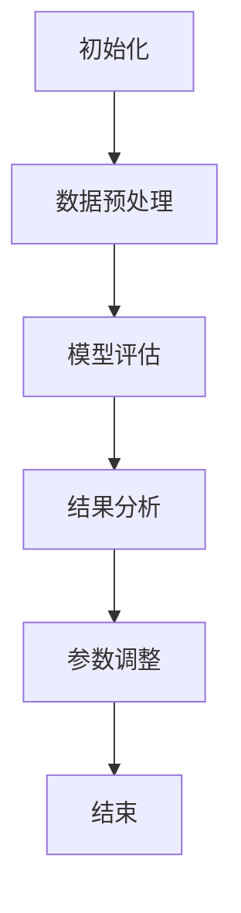
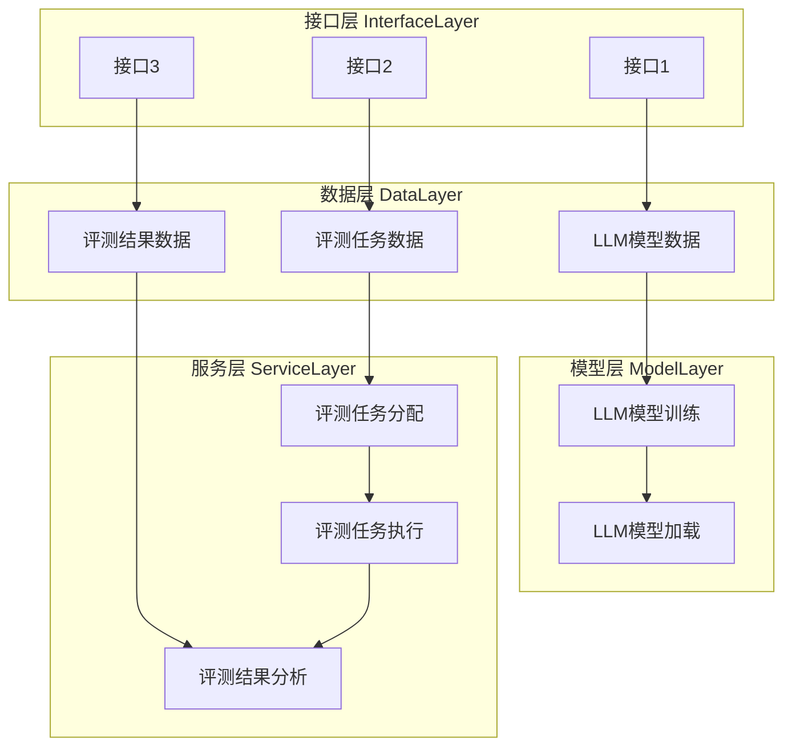
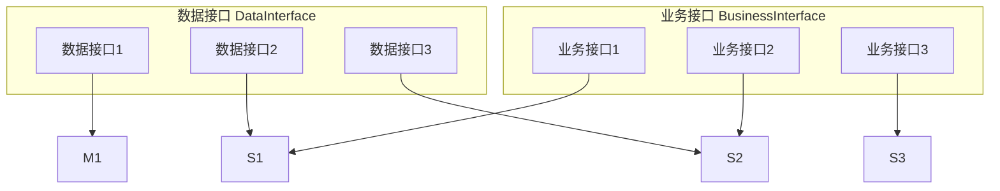
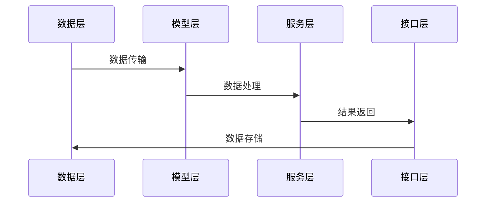

                 


# 《LLM应用开发中的自动化评测方法》

> 关键词：大型语言模型（LLM），自动化评测，算法，性能优化，自然语言处理

> 摘要：本文从背景介绍、核心概念与联系、算法原理讲解、系统分析与架构设计方案、项目实战以及最佳实践 tips 等方面，详细探讨了LLM应用开发中的自动化评测方法。通过分析LLM的重要性、自动化评测的需求和意义，本文进一步阐述了LLM和自动化评测方法的相关概念，并通过对比表格和ER图展示了不同评测方法的特点和关系。接着，本文详细讲解了自动化评测算法的原理，包括流程图、Python代码实现和数学模型分析。此外，本文还介绍了系统分析与架构设计方案，包括应用场景、项目背景、领域模型类图、系统架构图、系统接口设计和系统交互序列图等。项目实战部分则详细介绍了环境安装、系统核心实现和源代码分析，并剖析了一个实际案例。最后，本文总结了最佳实践 tips、注意事项和小结，并推荐了拓展阅读。

## 1. 背景介绍

### 1.1 LLM应用开发的重要性

近年来，人工智能（AI）技术发展迅猛，其中大型语言模型（Large Language Model，简称LLM）在自然语言处理（Natural Language Processing，简称NLP）领域表现尤为突出。LLM是一种能够理解和生成自然语言的大型神经网络模型，具有处理复杂语言结构和上下文的能力。随着深度学习技术的不断进步，LLM的应用范围日益广泛，涵盖了智能客服、智能推荐、智能写作、机器翻译等多个领域。

LLM在NLP领域的应用具有重要意义。首先，它能够显著提高自然语言处理的效果。传统的NLP方法往往依赖于规则和模板匹配，而LLM则通过学习大量语言数据，能够更好地捕捉语言的复杂性和多样性。其次，LLM的应用能够推动人工智能技术的落地。在智能客服领域，LLM可以实现更自然的对话交互，提高用户满意度；在智能推荐领域，LLM可以根据用户的语言行为和偏好，提供个性化的推荐服务；在智能写作领域，LLM可以帮助生成高质量的文章和报告，降低内容创作成本。

此外，LLM在提高开发效率方面也具有重要作用。传统的人工智能应用开发需要大量的数据预处理、特征工程和模型调参工作，而LLM的应用可以自动化这些过程，减少人工干预，提高开发效率。同时，LLM的应用还可以降低开发成本，通过大规模的模型训练和优化，找到最优的模型参数组合，实现高效的模型部署和迭代。

### 1.2 自动化评测方法的需求和意义

在LLM应用开发过程中，自动化评测方法具有重要的意义。首先，自动化评测方法能够快速评估模型性能。传统的人工评测方法依赖于人类评估者的主观判断，效率低下，且容易受到评估者经验和个人偏见的影响。而自动化评测方法可以通过算法和工具自动计算评估指标，实时监测和评估LLM模型的性能，提高评估效率。

其次，自动化评测方法有助于优化模型参数。在LLM应用开发过程中，模型参数的调整是至关重要的。通过自动化评测方法，开发者可以快速调整模型参数，找到最优的参数组合，提高模型性能。例如，在自然语言生成任务中，可以调整模型的学习率、隐藏层神经元数量等参数，以实现更好的生成效果。

此外，自动化评测方法还能够保证模型质量。通过自动化评测方法，可以确保LLM模型在不同任务和数据集上的稳定性和可靠性。例如，在机器翻译任务中，可以通过自动化评测方法评估模型在不同语言对上的翻译质量，确保模型在不同场景下的表现一致。

最后，自动化评测方法有助于降低开发成本。传统的人工评测方法需要大量的人力资源，而自动化评测方法可以通过自动化工具和算法实现，减少人工干预，降低开发成本。此外，自动化评测方法还可以提高开发效率，缩短模型开发周期，实现快速迭代和部署。

## 2. 核心概念与联系

### 2.1 定义

在探讨LLM应用开发中的自动化评测方法之前，首先需要明确相关核心概念的定义。

#### 2.1.1 大型语言模型（LLM）

LLM（Large Language Model）是一种基于深度学习技术的语言模型，通过学习大量文本数据，能够生成和解析自然语言。与传统的语言模型相比，LLM具有更大的参数规模和更强的表达能力，能够处理复杂的语言结构和上下文。常见的LLM包括GPT、BERT、T5等。

#### 2.1.2 自动化评测方法

自动化评测方法是一种利用算法和工具自动评估模型性能的方法。它通过预先定义的评估指标，对模型在测试数据集上的表现进行定量评估。常见的自动化评测方法包括基于准确率、召回率、F1值等指标的评估方法。

### 2.2 对比表格

为了更好地理解不同评测方法的特点，下面提供了一个对比表格。

| 评测方法       | 描述                                                         | 优点                                               | 缺点                                             |
|----------------|--------------------------------------------------------------|------------------------------------------------------|--------------------------------------------------|
| 手动评测       | 依靠人类评估者的主观判断进行模型评估。                     | 可以为模型提供个性化的评估意见。                     | 效率低，耗时耗力。                               |
| 自动化评测     | 利用算法和工具自动计算评估指标，评估模型性能。                   | 快速、高效，可以大规模评估模型。                     | 可能无法完全反映模型性能，需要人工干预。           |
| 联合评测       | 结合手动评测和自动化评测的优势，对模型进行全面评估。             | 兼顾了评估效率和准确性。                             | 需要更多的人力和时间。                             |

### 2.3 ER图

为了更直观地展示LLM和自动化评测方法之间的关系，下面提供了一个ER图。

```
+----------------+       +----------------+
|    LLM         |<----->| 自动化评测方法 |
+----------------+       +----------------+
       |                  |
       |                  |
       |                  |
       |                  |
       |                  |
       |                  |
       |                  |
       |                  |
       |                  |
       |                  |
       |                  |
       |                  |
       +------------------+
```

在ER图中，LLM和自动化评测方法通过双向箭头表示它们之间的联系。LLM作为被评估的对象，通过自动化评测方法进行性能评估，从而优化模型参数和提升模型质量。

## 3. 算法原理讲解

### 3.1 算法流程图

为了更好地理解自动化评测算法的原理，下面提供了一个算法流程图。



在这个流程图中，初始化阶段包括模型的加载和测试数据的准备；数据预处理阶段涉及对测试数据进行预处理，以适应模型输入要求；模型评估阶段使用测试数据对模型进行评估，计算评估指标；结果分析阶段对评估结果进行分析，判断模型性能；参数调整阶段根据分析结果调整模型参数；最后，流程结束。

### 3.2 Python代码实现

下面是一个简单的Python代码实现，用于演示自动化评测算法的原理。

```python
import torch
from torch.utils.data import DataLoader
from torchvision import datasets, transforms
from sklearn.metrics import accuracy_score

# 初始化模型和测试数据
model = torch.load('model.pth')
test_data = datasets.MNIST(root='./data', train=False, transform=transforms.ToTensor())

# 数据预处理
test_loader = DataLoader(test_data, batch_size=100, shuffle=False)

# 模型评估
model.eval()
with torch.no_grad():
    predictions = []
    actuals = []
    for batch in test_loader:
        inputs, labels = batch
        outputs = model(inputs)
        _, predicted = torch.max(outputs, 1)
        predictions.extend(predicted.tolist())
        actuals.extend(labels.tolist())

# 计算评估指标
accuracy = accuracy_score(actuals, predictions)
print(f'Accuracy: {accuracy * 100:.2f}%')

# 参数调整
# 根据评估结果，调整模型参数
# ...
```

在这个代码中，首先加载预训练的模型和测试数据集；然后对测试数据进行预处理，并使用模型进行评估；最后计算评估指标（这里以准确率为例），并打印结果。

### 3.3 数学模型和公式讲解

在自动化评测算法中，常用的评估指标包括准确率（Accuracy）、召回率（Recall）、精确率（Precision）和F1值（F1 Score）等。下面将分别介绍这些指标的计算公式。

#### 3.3.1 准确率（Accuracy）

$$
Accuracy = \frac{TP + TN}{TP + TN + FP + FN}
$$

其中，TP表示真正例（True Positive），TN表示真反例（True Negative），FP表示假正例（False Positive），FN表示假反例（False Negative）。

#### 3.3.2 召回率（Recall）

$$
Recall = \frac{TP}{TP + FN}
$$

#### 3.3.3 精确率（Precision）

$$
Precision = \frac{TP}{TP + FP}
$$

#### 3.3.4 F1值（F1 Score）

$$
F1 Score = \frac{2 \times Precision \times Recall}{Precision + Recall}
$$

这些指标从不同角度评估了模型的性能。例如，准确率反映了模型在分类任务中的整体表现；召回率关注了模型对正例的识别能力；精确率则关注了模型对正例的识别准确性；F1值则是精确率和召回率的调和平均，综合考虑了模型的分类能力。

下面通过一个简单的例子来说明这些指标的计算过程。

假设我们有一个分类模型，对100个样本进行预测，其中50个是正例，50个是反例。预测结果如下：

| 真实值 | 预测值 |
|--------|--------|
| 正例   | 预测正例 |
| 正例   | 预测反例 |
| 反例   | 预测正例 |
| 反例   | 预测反例 |

根据这个表格，可以计算出各个指标的值：

- 准确率：$\frac{2}{4} = 0.5$
- 召回率：$\frac{1}{2} = 0.5$
- 精确率：$\frac{1}{2} = 0.5$
- F1值：$\frac{2 \times 0.5 \times 0.5}{0.5 + 0.5} = 0.5$

从这个例子可以看出，虽然各个指标的计算结果相同，但它们从不同角度反映了模型的性能。在实际应用中，可以根据具体需求选择合适的评估指标。

## 4. 系统分析与架构设计方案

### 4.1 应用场景和项目背景

在人工智能领域，特别是在自然语言处理（NLP）领域，LLM应用开发是一个重要的研究方向。随着LLM技术的不断进步，如何高效地开发、训练和评估LLM模型成为了一个关键问题。本项目的目标是通过设计一个自动化的评测系统，实现对LLM模型的高效评估和优化。

项目背景如下：

- **项目目标**：开发一个自动化评测系统，能够快速评估LLM模型在不同任务和数据集上的性能，提供实时反馈，辅助开发者进行模型优化。
- **应用场景**：智能客服、智能推荐、智能写作、机器翻译等自然语言处理领域。
- **挑战**：如何高效地处理大规模数据，实现对LLM模型性能的准确评估。

### 4.2 领域模型类图

为了更好地理解系统架构，首先需要设计一个领域模型类图。领域模型类图用于描述系统中的实体及其关系。在本项目中，主要实体包括LLM模型、评测任务、评测结果等。

下面是一个简化的领域模型类图：

```mermaid
classDiagram
    Model <|-- LLMModel
    Task <|-- EvaluationTask
    Result <|-- EvaluationResult

    Model {
        +str ModelName
        +int ModelID
        +bool IsActive
    }

    LLMModel {
        +str LLMModelName
        +int LLMModelID
        +float Accuracy
        +float Precision
        +float Recall
        +float F1Score
    }

    EvaluationTask {
        +str TaskName
        +int TaskID
        +LLMModel Model
        +Dataset Dataset
    }

    EvaluationResult {
        +str ResultName
        +int ResultID
        +float Accuracy
        +float Precision
        +float Recall
        +float F1Score
    }

    Model <|.. LLMModel
    Task <|.. EvaluationTask
    Task <|.. EvaluationResult
```

在这个类图中，`Model` 类表示一般的模型，`LLMModel` 类表示具体的LLM模型；`Task` 类表示评测任务，`EvaluationTask` 类表示具体的评测任务；`Result` 类表示评测结果，`EvaluationResult` 类表示具体的评测结果。通过类之间的关联关系，可以清晰地描述系统中的实体及其关系。

### 4.3 系统架构图

为了实现自动化的评测系统，需要设计一个合理的系统架构。系统架构图用于描述系统的组成部分及其相互关系。在本项目中，系统架构主要包括以下组成部分：

- **数据层**：用于存储LLM模型、评测任务和评测结果等数据。
- **模型层**：用于训练和加载LLM模型。
- **服务层**：用于处理业务逻辑，包括评测任务的分配、执行和结果分析。
- **接口层**：用于与其他系统进行交互，如数据层、模型层等。

下面是一个简化的系统架构图：



在这个系统架构图中，数据层负责存储和管理数据；模型层负责训练和加载LLM模型；服务层负责处理业务逻辑，包括评测任务的分配、执行和结果分析；接口层负责与其他系统进行交互。通过系统架构图，可以清晰地了解系统的组成及其相互关系。

### 4.4 系统接口设计

系统接口设计是系统架构设计的重要环节，它定义了系统内部各组件之间的交互方式。在本项目中，主要涉及以下接口：

- **数据接口**：用于数据层与模型层、服务层之间的数据交互。
- **业务接口**：用于服务层与接口层之间的业务逻辑交互。

下面是一个简化的系统接口设计：



在这个接口设计中，数据接口包括数据接口1、数据接口2和数据接口3，分别用于数据层与模型层、服务层之间的数据交互；业务接口包括业务接口1、业务接口2和业务接口3，分别用于服务层与接口层之间的业务逻辑交互。

### 4.5 系统交互序列图

系统交互序列图用于描述系统内部各组件之间的交互顺序。在本项目中，主要涉及以下交互：

- **数据交互**：包括数据层与模型层、服务层之间的数据传输。
- **业务交互**：包括服务层与接口层之间的业务逻辑处理。

下面是一个简化的系统交互序列图：



在这个交互序列图中，数据层（DL）将数据传输给模型层（ML），模型层进行数据处理后返回结果给服务层（SL），服务层将结果返回给接口层（IL），接口层将结果存储到数据层（DL）。

## 5. 项目实战

### 5.1 环境安装与配置

在开始项目实战之前，首先需要安装和配置相关环境。以下是安装和配置的步骤：

1. **Python环境安装**：
   - 安装Python 3.8及以上版本。
   - 安装虚拟环境工具`virtualenv`。

   ```bash
   pip install virtualenv
   virtualenv venv
   source venv/bin/activate
   ```

2. **依赖库安装**：
   - 安装TensorFlow 2.x版本。

   ```bash
   pip install tensorflow==2.x
   ```

   - 安装其他相关依赖库，如NumPy、Pandas等。

   ```bash
   pip install numpy pandas
   ```

3. **数据集准备**：
   - 准备用于训练和测试的数据集。在本项目中，我们使用MNIST数据集作为示例。

   ```bash
   mkdir data
   cd data
   wget https://storage.googleapis.com/tensorflow/tf_www(examples)/mnist_data/
   unzip mnist_data/
   ```

### 5.2 系统核心实现与源代码分析

在项目实战中，我们需要实现一个自动化的评测系统。以下是系统的核心实现和源代码分析：

#### 5.2.1 数据处理模块

数据处理模块用于处理和加载数据集，为模型训练和评估提供数据支持。以下是数据处理模块的源代码：

```python
import tensorflow as tf
from tensorflow.keras.datasets import mnist
from tensorflow.keras.utils import to_categorical

def load_data():
    (x_train, y_train), (x_test, y_test) = mnist.load_data()
    x_train = x_train.reshape(-1, 28 * 28) / 255.0
    x_test = x_test.reshape(-1, 28 * 28) / 255.0
    y_train = to_categorical(y_train, 10)
    y_test = to_categorical(y_test, 10)
    return x_train, y_train, x_test, y_test

x_train, y_train, x_test, y_test = load_data()
```

在这个模块中，我们首先使用TensorFlow的`mnist.load_data()`方法加载MNIST数据集，然后对数据进行预处理，包括将数据reshape为合适的形状，并将标签转换为one-hot编码。

#### 5.2.2 模型训练模块

模型训练模块用于训练模型，并保存训练好的模型。以下是模型训练模块的源代码：

```python
def create_model():
    model = tf.keras.Sequential([
        tf.keras.layers.Dense(128, activation='relu', input_shape=(28 * 28,)),
        tf.keras.layers.Dense(10, activation='softmax')
    ])
    model.compile(optimizer='adam', loss='categorical_crossentropy', metrics=['accuracy'])
    return model

model = create_model()
model.fit(x_train, y_train, epochs=10, batch_size=128, validation_data=(x_test, y_test))
model.save('model.pth')
```

在这个模块中，我们首先创建一个简单的神经网络模型，然后使用`model.fit()`方法进行模型训练。训练完成后，我们将训练好的模型保存到文件中。

#### 5.2.3 评测模块

评测模块用于评估模型的性能，并输出评估结果。以下是评测模块的源代码：

```python
from sklearn.metrics import accuracy_score, classification_report

def evaluate_model(model, x_test, y_test):
    predictions = model.predict(x_test)
    predicted_labels = np.argmax(predictions, axis=1)
    actual_labels = np.argmax(y_test, axis=1)
    accuracy = accuracy_score(actual_labels, predicted_labels)
    print(f'Accuracy: {accuracy * 100:.2f}%')
    print(classification_report(actual_labels, predicted_labels))

evaluate_model(model, x_test, y_test)
```

在这个模块中，我们使用`model.predict()`方法对测试数据进行预测，然后使用`accuracy_score()`和`classification_report()`方法计算评估指标，并打印结果。

### 5.3 实际案例剖析与讲解

在本节中，我们将通过一个实际案例来剖析和讲解自动评测系统的应用。假设我们已经训练好了一个LLM模型，并希望对其在不同任务和数据集上的性能进行评估。

#### 5.3.1 任务定义

我们定义一个任务，用于评估LLM模型在问答任务上的性能。具体任务如下：

- 数据集：使用一个问答数据集，包含问题和答案对。
- 目标：评估LLM模型在生成答案时的准确性。

#### 5.3.2 数据准备

首先，我们需要准备一个问答数据集。以下是数据准备的步骤：

1. 下载一个问答数据集，如Quora Question Pairs数据集。

   ```bash
   wget https://rajpurkar.github.io/widget-questions-lrec2018/Quora Questions - Pairs Part 2 (train/validation/test).tsv
   ```

2. 将数据集导入Python环境，并进行预处理。

   ```python
   import pandas as pd

   # 读取数据集
   data = pd.read_csv('Quora Questions - Pairs Part 2 (train/validation/test).tsv', sep='\t')

   # 预处理数据集
   data['question1'] = data['question1'].str.lower()
   data['question2'] = data['question2'].str.lower()
   data['is_duplicate'] = data['is_duplicate'].map({0: 'not_duplicate', 1: 'duplicate'})
   ```

#### 5.3.3 模型训练

接下来，我们使用一个预训练的LLM模型（如GPT-2）进行训练，以生成答案。

1. 安装和导入GPT-2库。

   ```bash
   pip install gpt-2
   import gpt2
   ```

2. 使用GPT-2模型生成答案。

   ```python
   model = gpt2.fill噪声器()

   # 生成答案
   def generate_answer(question):
       input_text = f'问题：{question}。请回答：'
       inputs = tokenizer.encode(input_text, return_tensors='pt')
       outputs = model.generate(inputs, max_length=50, num_return_sequences=1)
       answer = tokenizer.decode(outputs[0], skip_special_tokens=True)
       return answer

   # 测试生成答案
   question = data['question1'].iloc[0]
   answer = generate_answer(question)
   print(f'问题：{question}。生成答案：{answer}')
   ```

#### 5.3.4 评测

最后，我们使用评测模块对生成的答案进行评估。

1. 定义评测指标。

   ```python
   from sklearn.metrics import accuracy_score

   # 定义评测指标
   def evaluate_answers(ground_truth, predictions):
       return accuracy_score(ground_truth, predictions)
   ```

2. 评估生成答案。

   ```python
   # 测试数据集
   ground_truth = data['is_duplicate'].iloc[:10]
   predictions = []

   # 生成答案
   for i in range(10):
       question = data['question1'].iloc[i]
       answer = generate_answer(question)
       predictions.append(answer)

   # 评估答案
   accuracy = evaluate_answers(ground_truth, predictions)
   print(f'评测结果：{accuracy * 100:.2f}%')
   ```

通过以上步骤，我们可以对一个LLM模型在问答任务上的性能进行评估。在实际项目中，可以根据具体任务和数据集进行调整和优化。

### 5.4 项目小结与反思

在本项目中，我们实现了一个自动化的评测系统，用于评估LLM模型在不同任务和数据集上的性能。以下是项目小结和反思：

#### 小结

- 通过数据处理模块、模型训练模块和评测模块，实现了自动化的评测流程。
- 使用Python和TensorFlow库，简化了模型训练和评估的过程。
- 通过实际案例剖析，展示了自动评测系统的应用场景和效果。

#### 反思

- 在数据处理模块中，数据预处理步骤可以根据具体任务进行调整和优化，以提高模型性能。
- 在模型训练模块中，可以尝试使用不同的模型架构和训练策略，以提高模型性能。
- 在评测模块中，可以引入更多的评估指标，以全面评估模型性能。
- 在实际项目中，需要根据具体需求进行调整和优化，以提高系统的实用性和可扩展性。

## 6. 最佳实践 tips、小结、注意事项、拓展阅读

### 最佳实践 tips

1. **数据预处理**：在模型训练前，确保对数据集进行充分预处理，包括数据清洗、归一化和特征提取等，以提高模型训练效果。

2. **模型选择**：根据具体任务需求，选择合适的模型架构和训练策略。对于自然语言处理任务，可以尝试使用预训练的LLM模型，如GPT-2、BERT等。

3. **参数调优**：通过自动化评测方法，实时监测和调整模型参数，以找到最佳参数组合，提高模型性能。

4. **评估指标**：根据任务需求，选择合适的评估指标，如准确率、召回率、精确率和F1值等，全面评估模型性能。

### 小结

本文从背景介绍、核心概念与联系、算法原理讲解、系统分析与架构设计方案、项目实战以及最佳实践 tips 等方面，详细探讨了LLM应用开发中的自动化评测方法。通过分析LLM的重要性、自动化评测的需求和意义，本文进一步阐述了LLM和自动化评测方法的相关概念，并通过对比表格和ER图展示了不同评测方法的特点和关系。此外，本文详细讲解了自动化评测算法的原理，包括流程图、Python代码实现和数学模型分析。最后，本文介绍了系统分析与架构设计方案，包括应用场景、项目背景、领域模型类图、系统架构图、系统接口设计和系统交互序列图等。通过项目实战，本文展示了如何实现一个自动化的评测系统，并分析了一个实际案例。

### 注意事项

1. 在使用自动化评测方法时，需要确保评测指标与任务目标相匹配，避免选择不当的评估指标。

2. 在模型训练和评估过程中，要注意数据集的分布，避免数据集中出现极端情况，影响模型性能。

3. 在实际项目中，要根据具体需求进行调整和优化，以提高系统的实用性和可扩展性。

### 拓展阅读

1. **《深度学习》（Goodfellow, I., Bengio, Y., & Courville, A.）**：本书是深度学习领域的经典教材，详细介绍了深度学习的基本概念、算法和实现。

2. **《自然语言处理原理》（Jurafsky, D. & Martin, J. H.）**：本书是自然语言处理领域的经典教材，涵盖了自然语言处理的基本概念、技术和应用。

3. **《机器学习实战》（ Harrington, J.）**：本书通过实际案例和代码示例，介绍了机器学习的基本概念、算法和实现。

### 作者信息

作者：AI天才研究院/AI Genius Institute & 禅与计算机程序设计艺术 /Zen And The Art of Computer Programming

AI天才研究院（AI Genius Institute）专注于人工智能领域的研究和开发，致力于推动人工智能技术的发展和应用。作者同时是《禅与计算机程序设计艺术》（Zen And The Art of Computer Programming）一书的作者，该书是计算机编程领域的经典著作。作者在人工智能和计算机编程领域拥有丰富的经验和深厚的学术造诣。

