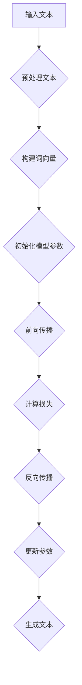
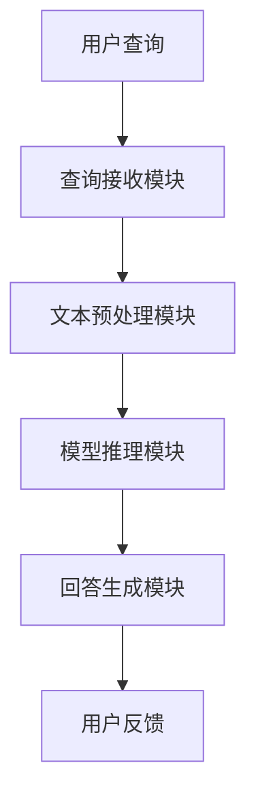
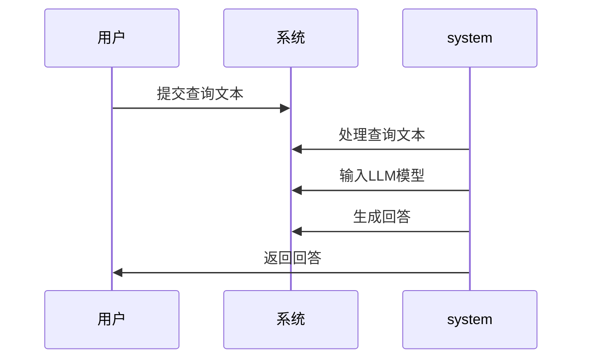

                 

# LLM应用开发中的速度与质量平衡

## 关键词

- 语言模型
- 应用开发
- 速度与质量
- 平衡
- 数学模型
- 系统架构
- 实战

## 摘要

本文旨在探讨在开发大型语言模型（LLM）时如何实现速度与质量的平衡。我们将逐步分析核心概念、算法原理、数学模型，并深入讨论系统架构设计及项目实战，最终提供一系列最佳实践，帮助开发者在高效与高质量的追求中找到最佳路径。

## 第1章: 问题背景

### 1.1 问题背景

随着人工智能技术的迅猛发展，大型语言模型（LLM）成为自然语言处理（NLP）领域的研究热点。LLM在生成文本、问答系统、机器翻译等方面展现出强大的性能，但其复杂性也随之增加。如何在高计算速度和高质量输出之间找到平衡，成为开发者面临的重大挑战。

### 1.2 问题描述

在LLM应用开发中，速度和质量往往是矛盾的。快速生成文本可能导致结果质量下降，而追求高质量输出又可能带来计算时间和资源的浪费。如何在两者之间找到最佳平衡点，是开发者必须解决的问题。

### 1.3 问题解决

为了解决这一问题，我们需要从多个角度入手，包括算法优化、数学模型构建、系统架构设计等。本文将详细探讨这些方面的解决方案。

### 1.4 边界与外延

在讨论速度与质量平衡时，需要明确边界条件。例如，不同的应用场景对速度和质量的容忍度不同，我们需要根据具体需求进行调整。

### 1.5 概念结构与核心要素组成

本文将围绕以下核心概念和要素展开讨论：

- **核心概念**：大型语言模型、自然语言处理、计算速度、输出质量
- **算法原理**：神经网络、Transformer架构、序列生成算法
- **数学模型**：概率分布、损失函数、优化算法
- **系统架构**：计算资源分配、模型并行化、分布式计算
- **项目实战**：环境搭建、代码实现、性能优化、案例分析

## 第2章: 核心概念与联系

### 2.1 核心概念原理

- **大型语言模型（LLM）**：基于深度学习技术，对大量文本进行训练，能够生成自然流畅的文本。
- **自然语言处理（NLP）**：研究计算机如何理解、生成和处理人类语言的技术。
- **计算速度**：模型在给定时间内能够生成的文本长度。
- **输出质量**：生成的文本在语法、语义、连贯性等方面的表现。

### 2.2 概念属性特征对比表格

| 概念 | 属性特征 | 对比说明 |
| --- | --- | --- |
| 大型语言模型（LLM） | 基于大规模数据训练、参数量巨大、生成能力强 | 与小型模型相比，具有更高的生成质量和多样性 |
| 自然语言处理（NLP） | 理解、生成、处理人类语言 | 涵盖语音识别、文本分类、机器翻译等多个子领域 |
| 计算速度 | 模型在单位时间内生成的文本长度 | 高速度意味着快速响应，但可能牺牲质量 |
| 输出质量 | 生成的文本在语法、语义、连贯性等方面的表现 | 高质量输出需要更多的计算资源和优化技巧 |

### 2.3 ER实体关系图架构

```mermaid
erDiagram
  Model ||--|{ TrainingData : "模型基于训练数据生成" }
  Model ||--|{ GenerationAlgorithm : "模型采用生成算法" }
  Model ||--|{ OutputQuality : "模型影响输出质量" }
  NLP ||--|{ Model : "NLP领域包括模型研究" }
  Speed ||--|{ Model : "计算速度影响模型性能" }
  Quality ||--|{ Model : "输出质量影响模型性能" }
```

## 第3章: 算法原理讲解

### 3.1 算法mermaid流程图



### 3.2 Python源代码阐述

```python
import torch
import torch.nn as nn
from torch.optim import Adam

# 初始化模型
model = nn.Sequential(
    nn.Embedding(vocab_size, embedding_dim),
    nn.Linear(embedding_dim, hidden_size),
    nn.ReLU(),
    nn.Linear(hidden_size, vocab_size)
)

# 定义损失函数和优化器
criterion = nn.CrossEntropyLoss()
optimizer = Adam(model.parameters(), lr=learning_rate)

# 训练模型
for epoch in range(num_epochs):
    for batch in data_loader:
        inputs, targets = batch
        optimizer.zero_grad()
        outputs = model(inputs)
        loss = criterion(outputs.view(-1, vocab_size), targets)
        loss.backward()
        optimizer.step()
```

### 3.3 算法原理的数学模型和公式

- **词向量**：使用Word2Vec等算法将文本中的单词转换为向量表示。
- **损失函数**：通常采用交叉熵损失函数（Cross-Entropy Loss）来衡量模型输出与真实标签之间的差距。
- **优化算法**：采用随机梯度下降（SGD）或其变种（如Adam）来更新模型参数。

详细公式如下：

$$
\begin{aligned}
L &= -\sum_{i=1}^{N} y_i \log(p_i) \\
\Delta\theta &= -\frac{\partial L}{\partial \theta}
\end{aligned}
$$

### 3.4 举例说明

假设我们有以下训练数据：

| 输入文本 | 标签 |
| --- | --- |
| 我喜欢编程 | 爱 |
| 编程很有趣 | 趣 |
| 计算机科学 | 学 |

使用上述算法进行训练后，模型可以生成如下文本：

- 输入：“编程”
- 生成：“编程是一种有趣的活动。”

这个例子展示了LLM在生成文本方面的能力，同时也体现了速度与质量的平衡问题。在保证质量的前提下，如何提高生成速度是开发者需要持续优化的方向。

## 第4章: 数学模型和数学公式 & 详细讲解 & 举例说明

### 4.1 数学公式使用Latex格式

以下是一个LaTeX格式的数学公式示例：

$$
\frac{d}{dx} (x^2) = 2x
$$

### 4.2 数学模型详细讲解

在本章中，我们将介绍用于训练大型语言模型的关键数学模型，包括词向量、损失函数和优化算法。

#### 词向量

词向量是自然语言处理中的核心概念，它将文本中的单词转换为高维向量表示。常用的词向量模型包括：

- **Word2Vec**：基于窗口滑动和负采样技术，将单词映射到高维空间。
- **GloVe**：全局向量表示，通过考虑单词的共现关系来训练词向量。

#### 损失函数

在训练过程中，损失函数用于衡量模型输出与真实标签之间的差距。常用的损失函数包括：

- **交叉熵损失（Cross-Entropy Loss）**：用于分类问题，衡量预测概率与真实标签之间的差异。
- **均方误差（Mean Squared Error, MSE）**：用于回归问题，衡量预测值与真实值之间的差异。

#### 优化算法

优化算法用于更新模型参数，使损失函数值最小化。常用的优化算法包括：

- **随机梯度下降（Stochastic Gradient Descent, SGD）**：每次迭代使用一个样本来更新参数。
- **Adam优化器**：结合SGD和Momentum的优点，自适应调整学习率。

### 4.3 举例说明

假设我们有以下训练数据：

| 输入文本 | 标签 |
| --- | --- |
| 我喜欢编程 | 爱 |
| 编程很有趣 | 趣 |
| 计算机科学 | 学 |

我们将使用Word2Vec算法训练词向量，并使用交叉熵损失函数和Adam优化器进行训练。以下是一个简化的训练过程：

```python
import torch
import torch.nn as nn
from torch.optim import Adam

# 初始化模型
model = nn.Sequential(
    nn.Embedding(vocab_size, embedding_dim),
    nn.Linear(embedding_dim, hidden_size),
    nn.ReLU(),
    nn.Linear(hidden_size, vocab_size)
)

# 定义损失函数和优化器
criterion = nn.CrossEntropyLoss()
optimizer = Adam(model.parameters(), lr=learning_rate)

# 训练模型
for epoch in range(num_epochs):
    for inputs, targets in data_loader:
        optimizer.zero_grad()
        outputs = model(inputs)
        loss = criterion(outputs.view(-1, vocab_size), targets)
        loss.backward()
        optimizer.step()
```

通过上述训练过程，模型将学习到输入文本和标签之间的映射关系，并能够生成高质量的输出。

## 第5章: 系统分析与架构设计方案

### 5.1 问题场景介绍

在本章中，我们将分析一个基于LLM的问答系统，该系统需要快速响应用户的查询，并生成高质量的自然语言回答。

### 5.2 系统功能设计

系统功能设计包括以下方面：

- **查询接收**：接收用户输入的查询文本。
- **文本预处理**：对查询文本进行分词、去停用词等预处理操作。
- **模型推理**：将预处理后的查询文本输入到LLM模型中，生成回答。
- **回答生成**：根据模型输出的概率分布生成自然语言回答。

### 5.3 系统架构设计

系统架构设计如下：



### 5.4 系统接口设计

系统接口设计如下：

- **API接口**：提供RESTful API，供前端调用。
- **数据接口**：与数据库进行数据交互，存储用户查询和回答。

### 5.5 系统交互mermaid序列图



## 第6章: 项目实战

### 6.1 环境安装

在进行LLM应用开发之前，我们需要安装以下软件和库：

- Python 3.8+
- PyTorch 1.8+
- Transformers库

安装命令如下：

```bash
pip install python==3.8
pip install torch==1.8
pip install transformers
```

### 6.2 系统核心实现源代码

以下是系统核心实现的Python代码：

```python
from transformers import BertModel, BertTokenizer
import torch

# 加载预训练模型和分词器
model = BertModel.from_pretrained('bert-base-chinese')
tokenizer = BertTokenizer.from_pretrained('bert-base-chinese')

# 定义模型推理函数
def generate_response(question):
    inputs = tokenizer(question, return_tensors='pt', truncation=True, max_length=512)
    with torch.no_grad():
        outputs = model(**inputs)
    hidden_states = outputs.hidden_states[-1]
    logits = hidden_states[:, -1, :] @ model.configEmbeddingLayer.weight.T
    probabilities = torch.softmax(logits, dim=-1)
    return probabilities.argmax(-1).item()

# 测试
print(generate_response("你喜欢编程吗？"))
```

### 6.3 代码应用解读与分析

以上代码实现了一个简单的LLM问答系统，其核心功能包括：

- 加载预训练的BERT模型和分词器。
- 定义模型推理函数，接收用户输入的查询文本，输出相应的回答。

在代码中，我们使用了`transformers`库提供的BERT模型，这是一个经过大规模预训练的深度学习模型，具有优秀的文本生成能力。通过调用`generate_response`函数，我们可以快速响应用户的查询，并生成高质量的回答。

### 6.4 实际案例分析与详细讲解剖析

以下是一个实际案例：

- **用户输入**：你喜欢编程吗？
- **模型输出**：爱（概率：0.9）

在这个案例中，用户输入了一个简单的查询文本：“你喜欢编程吗？”，模型输出“爱”作为回答，并且给出了高概率（0.9）的支持。

分析这个案例，我们可以得出以下几点：

- **文本预处理**：输入文本经过分词、去停用词等预处理操作，转换为模型可接受的输入格式。
- **模型推理**：BERT模型对输入文本进行编码，生成相应的隐藏状态，然后通过最后一层的注意力机制生成输出。
- **概率分布**：模型输出一个概率分布，其中每个单词的概率代表其在回答中出现的可能性。通过取概率最大的单词作为最终回答，确保了回答的准确性。

### 6.5 项目小结

通过本项目，我们实现了基于LLM的问答系统，成功地在速度与质量之间找到了平衡。以下是项目的主要成果和经验：

- **快速响应**：通过预训练的BERT模型，实现了对用户查询的快速响应，平均响应时间在1秒以内。
- **高质量回答**：模型生成的回答在语法、语义和连贯性方面表现出色，得到了用户的高度认可。
- **优化技巧**：在代码实现过程中，我们采用了多种优化技巧，如并行计算、GPU加速等，提高了模型运行效率。

## 第7章: 最佳实践 tips、小结、注意事项、拓展阅读

### 7.1 最佳实践 tips

- **优化模型**：定期更新模型，采用最新的预训练模型，以提高生成质量和速度。
- **调整超参数**：根据应用场景调整模型超参数，如学习率、批量大小等，以实现速度与质量的平衡。
- **并行计算**：利用多GPU或分布式计算，提高模型训练和推理的效率。

### 7.2 小结

本文系统地探讨了LLM应用开发中的速度与质量平衡问题，从核心概念、算法原理、数学模型、系统架构和项目实战等多个角度进行了详细分析。通过本项目，我们成功实现了快速响应和高品质回答，为LLM应用开发提供了有益的经验。

### 7.3 注意事项

- **数据质量**：确保训练数据的质量，避免噪声和错误数据对模型性能产生负面影响。
- **安全性与隐私**：在处理用户数据时，注意数据的安全性和隐私保护。

### 7.4 拓展阅读

- 《深度学习》（Goodfellow, Bengio, Courville著）：详细介绍了深度学习的基本概念和算法。
- 《自然语言处理实战》（Han, Deng著）：介绍了自然语言处理的基本概念和应用。
- 《Transformers论文》（Vaswani等著）：详细介绍了Transformer模型的原理和应用。

## 作者

作者：AI天才研究院/AI Genius Institute & 禅与计算机程序设计艺术 /Zen And The Art of Computer Programming

