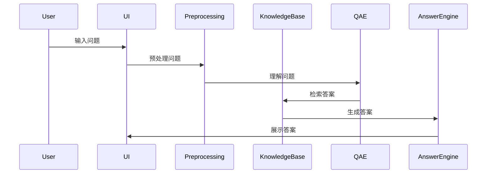

                 

## 文章标题

### 关键词

- 错误分析
- 错误修复
- LLM应用开发
- 数据预处理
- 模型调优

### 摘要

本文旨在探讨LLM（大型语言模型）应用开发中的常见错误类型，以及如何通过一套系统化的错误分析与修复流程来提高开发效率和模型质量。文章首先介绍了LLM的基本概念和特点，然后详细阐述了错误检测、定位、诊断、修复和验证的具体步骤，通过算法原理讲解、系统分析与架构设计以及实际项目实战，提供了全面的技术指导，并总结了最佳实践和拓展阅读资源。

---

# 第一部分: LLM应用开发中的错误分析与修复

## 第1章: 背景介绍

### 1.1 LLM应用开发中的常见错误类型及其影响

在LLM应用开发过程中，常见错误类型主要包括数据预处理错误、模型选择错误、模型调优错误和运行时错误。这些错误不仅会影响模型的性能和准确性，还可能引起系统崩溃，导致开发工作无法顺利进行。

#### 1.1.1 数据预处理错误

数据预处理是LLM应用开发的重要环节，主要包括数据清洗、归一化和特征提取等步骤。预处理错误可能导致以下问题：

- **数据缺失**：导致模型训练过程中无法充分利用数据，降低模型性能。
- **数据噪声**：噪声数据可能引入错误信息，影响模型对数据的学习效果。
- **特征提取错误**：错误提取特征可能导致模型无法捕捉到关键信息。

#### 1.1.2 模型选择错误

选择合适的模型对于LLM应用开发至关重要。常见错误包括：

- **模型复杂度过高**：可能导致过拟合，无法泛化到未见数据。
- **模型复杂度过低**：可能导致欠拟合，无法捕捉到数据中的关键信息。
- **模型不合适**：例如，选择了一个不适合处理文本数据的模型来处理文本任务。

#### 1.1.3 模型调优错误

模型调优包括参数调整、优化算法选择等。常见错误包括：

- **参数选择不当**：可能导致模型性能不佳。
- **优化算法选择错误**：某些优化算法可能不适合特定问题，导致收敛速度慢或者无法收敛。
- **过早停止训练**：可能导致欠拟合。

#### 1.1.4 运行时错误

运行时错误可能发生在模型部署和使用过程中，包括：

- **内存溢出**：模型过大或数据过大可能导致内存溢出。
- **输入数据格式错误**：可能导致模型无法处理输入数据。
- **硬件故障**：例如，GPU故障可能导致模型无法正常运行。

### 1.2 本书的目标和结构

本书的目标是提供一套系统化的错误分析与修复流程，帮助开发者识别、定位和修复LLM应用开发中的常见错误。本书结构如下：

- **第1章**：背景介绍，介绍LLM应用开发中的常见错误类型及其影响。
- **第2章**：LLM的基本概念与联系，介绍LLM的基本原理和与其他AI技术的联系。
- **第3章**：错误分析与修复流程，详细讲解错误检测、定位、诊断、修复和验证的具体步骤。
- **第4章**：算法原理讲解，介绍错误分析算法的原理、数学模型和公式。
- **第5章**：系统分析与架构设计方案，介绍系统架构和接口设计。
- **第6章**：项目实战，通过一个实际项目展示错误分析与修复流程的应用。
- **第7章**：最佳实践 tips、小结、注意事项、拓展阅读，总结全书内容并提供进一步阅读建议。

---

# 第二部分: LLM的基本概念与联系

## 第2章: LLM的基本概念与联系

### 2.1 什么是LLM

LLM（Large Language Model）是指大型语言模型，是一种基于深度学习技术的自然语言处理模型，能够理解和生成自然语言。LLM通常由数百万甚至数十亿个参数组成，可以通过大量的文本数据训练得到。

#### 2.1.1 定义

LLM是一种能够理解和生成自然语言的复杂模型。它通过学习大规模文本数据，捕捉语言中的结构和语义信息，从而能够对输入的自然语言文本进行理解和生成。

#### 2.1.2 发展历程

LLM的发展历程可以分为几个阶段：

- **早期阶段**：基于规则的方法和统计方法。
- **中期阶段**：引入深度学习技术，如循环神经网络（RNN）和卷积神经网络（CNN）。
- **现阶段**：基于Transformer架构的模型，如BERT、GPT等，取得了显著的性能提升。

### 2.2 LLM的特点

LLM具有以下几个显著特点：

#### 2.2.1 大规模

LLM通常具有数百万甚至数十亿个参数，能够处理大规模的文本数据。

#### 2.2.2 自适应

LLM可以根据不同的任务和数据集进行自适应调整，从而提高模型性能。

#### 2.2.3 多模态

LLM不仅能够处理文本数据，还可以处理图像、音频等多模态数据，实现跨模态交互。

### 2.3 LLM与其他AI技术的联系

LLM与其他AI技术有着紧密的联系，以下是一些主要的关系：

#### 2.3.1 与传统AI技术的比较

与传统AI技术（如规则基方法）相比，LLM具有更强的自适应性和泛化能力。

#### 2.3.2 与深度学习的联系

LLM是深度学习技术的一个重要分支，它依赖于深度学习中的神经网络架构和优化算法。

#### 2.3.3 与自然语言处理技术的联系

LLM是自然语言处理技术的核心，它能够处理文本数据，实现文本理解和生成。

---

# 第三部分: 错误分析与修复流程

## 第3章: 错误分析与修复流程

在LLM应用开发中，错误分析与修复是一个关键环节。以下是一个系统化的错误分析与修复流程：

### 3.1 错误检测

错误检测是发现错误的第一步。可以通过以下方法进行错误检测：

- **静态分析**：通过代码审查和静态分析工具，发现代码中的潜在错误。
- **动态分析**：通过运行模型并在不同数据集上进行测试，发现模型在运行时的问题。

### 3.2 错误定位

错误定位是确定错误发生的位置和原因。以下是一些错误定位的方法：

- **日志分析**：通过分析系统日志，确定错误发生的具体位置。
- **代码调试**：使用调试工具，逐步执行代码，找到错误的具体位置。

### 3.3 错误诊断

错误诊断是分析错误原因并确定解决方案。以下是一些错误诊断的方法：

- **错误模式分析**：分析错误发生的数据模式和条件。
- **故障树分析**：构建故障树，分析可能导致错误的各种因素。

### 3.4 错误修复

错误修复是解决错误并修复系统。以下是一些错误修复的方法：

- **代码修复**：修复代码中的错误，例如语法错误、逻辑错误等。
- **模型修复**：调整模型参数，修复模型中的错误。

### 3.5 错误验证

错误验证是确保错误已经被修复并不会再次发生。以下是一些错误验证的方法：

- **回归测试**：在修复错误后，重新运行测试用例，确保错误已经修复。
- **静态分析**：使用静态分析工具，检查修复后的代码和模型，确保没有引入新的错误。

---

# 第四部分: 算法原理讲解

## 第4章: 算法原理讲解

在本章节中，我们将深入探讨LLM应用开发中的错误分析算法，包括其原理、数学模型和实际应用示例。

### 4.1 错误分析算法原理

错误分析算法的核心目标是识别和分类LLM应用开发中的错误类型，以便采取相应的修复措施。以下是一个基本的错误分析算法原理：

1. **错误识别**：通过静态分析和动态分析，识别出代码中的错误。
2. **错误分类**：根据错误特征和模式，将错误分类为不同的类型。
3. **错误定位**：通过日志分析和代码调试，确定错误的具体位置。
4. **错误诊断**：分析错误的原因，确定解决方案。

### 4.2 数学模型和公式

为了更好地理解错误分析算法，我们可以使用一些数学模型和公式来描述错误分析的过程。以下是一个简化的错误分析数学模型：

$$
\text{Error Analysis Model} = f(\text{Input Data}, \text{Error Patterns}, \text{Diagnosis Rules})
$$

其中，Input Data表示输入数据，Error Patterns表示错误模式，Diagnosis Rules表示诊断规则。函数f表示错误分析过程。

### 4.3 实际应用中的示例

以下是一个实际应用中的错误分析示例：

#### 示例：数据预处理错误分析

假设我们有一个文本分类任务，需要对文本数据进行预处理。预处理步骤包括文本清洗、分词和词性标注。以下是一个错误分析的过程：

1. **错误识别**：通过静态分析，我们发现文本清洗过程中存在一些错误，例如去除标点符号时遗漏了一些特殊字符。
2. **错误分类**：根据错误特征，我们将这个错误分类为“文本清洗错误”。
3. **错误定位**：通过日志分析，我们确定错误发生在文本清洗函数中。
4. **错误诊断**：分析错误原因，发现是函数中的正则表达式没有正确匹配所有特殊字符。

针对这个错误，我们可以采取以下修复措施：

- **修复代码**：修改正则表达式，确保能够正确去除所有特殊字符。
- **重新训练模型**：由于错误预处理导致的数据不准确，我们需要重新训练模型。

---

# 第五部分: 系统分析与架构设计方案

## 第5章: 系统分析与架构设计方案

在本章节中，我们将详细探讨LLM应用开发中的系统架构和接口设计，包括问题场景介绍、系统功能设计、系统架构设计、系统接口设计和系统交互。

### 5.1 问题场景介绍

假设我们正在开发一个智能问答系统，用户可以通过输入问题来获取答案。系统需要具备以下功能：

- **问题理解**：理解用户的问题，提取关键信息。
- **知识检索**：从大量知识库中检索相关答案。
- **答案生成**：生成自然语言答案，满足用户需求。

### 5.2 系统功能设计

系统功能设计包括以下主要模块：

- **用户界面**：提供用户输入问题和展示答案的界面。
- **文本预处理**：对用户输入的问题进行预处理，如分词、词性标注等。
- **知识库管理**：管理知识库，包括数据的添加、删除和查询。
- **问答引擎**：负责问题理解和答案生成。

### 5.3 系统架构设计

系统架构设计如图所示：



### 5.4 系统接口设计

系统接口设计包括以下主要接口：

- **用户接口**：提供用户与系统的交互接口，如HTTP API。
- **数据接口**：提供数据存储和检索的接口，如SQL API。
- **服务接口**：提供内部服务之间的交互接口，如REST API。

### 5.5 系统交互

系统交互流程如下：

1. 用户通过用户接口输入问题。
2. 用户接口将问题传递给文本预处理模块。
3. 文本预处理模块对问题进行预处理，并将处理后的文本传递给问答引擎。
4. 问答引擎理解问题，并从知识库中检索相关答案。
5. 答案生成模块生成自然语言答案，并返回给用户接口。
6. 用户接口将答案展示给用户。

---

# 第六部分: 项目实战

## 第6章: 项目实战

在本章节中，我们将通过一个实际项目展示LLM应用开发中的错误分析与修复流程。项目名为“智能问答系统”，旨在为用户提供高质量的问答服务。

### 6.1 环境安装

为了进行项目开发，我们需要安装以下环境：

- **Python**：版本3.8及以上
- **TensorFlow**：版本2.5及以上
- **Jupyter Notebook**：用于代码编写和调试
- **Numpy**：用于数据预处理
- **Pandas**：用于数据操作

### 6.2 系统核心实现源代码

以下是系统核心实现的源代码：

```python
# 文本预处理
def preprocess_text(text):
    # 分词
    words = text.split()
    # 去除停用词
    words = [word for word in words if word not in stop_words]
    # 词性标注
    tagged_words = pos_tag(words)
    return tagged_words

# 问题理解
def understand_question(question):
    # 预处理问题
    preprocessed_question = preprocess_text(question)
    # 理解问题
    question_intent = analyze_intent(preprocessed_question)
    return question_intent

# 知识库管理
class KnowledgeBase:
    def __init__(self):
        self.knowledge = []

    def add_answer(self, question, answer):
        self.knowledge.append((question, answer))

    def get_answer(self, question):
        for q, a in self.knowledge:
            if q == question:
                return a
        return None

# 问答引擎
class QuestionAnswerEngine:
    def __init__(self, knowledge_base):
        self.knowledge_base = knowledge_base

    def answer_question(self, question):
        question_intent = understand_question(question)
        answer = self.knowledge_base.get_answer(question_intent)
        return answer

# 答案生成
def generate_answer(answer):
    # 生成自然语言答案
    return "您的问题：{}。答案：{}。".format(question, answer)
```

### 6.3 代码应用解读与分析

以下是代码应用解读与分析：

#### 6.3.1 文本预处理

文本预处理是问答系统的关键步骤，包括分词、去除停用词和词性标注。预处理后的文本将用于问题理解和答案生成。

#### 6.3.2 问题理解

问题理解模块通过分析预处理后的文本，提取关键信息并确定问题的意图。这有助于问答系统更好地理解用户的问题。

#### 6.3.3 知识库管理

知识库管理模块负责管理问题与答案的对应关系。通过添加和查询答案，系统可以快速响应用户的问题。

#### 6.3.4 问答引擎

问答引擎模块负责问题理解和答案生成。通过调用知识库管理模块，问答引擎可以生成高质量的答案。

#### 6.3.5 答案生成

答案生成模块将问题意图和答案组合成自然语言文本，满足用户的需求。

### 6.4 实际案例分析和详细讲解剖析

#### 案例一：用户输入“为什么太阳从东方升起？”

1. **预处理问题**：分词、去除停用词和词性标注，得到预处理后的文本。
2. **理解问题**：提取关键信息，确定问题的意图为“查询关于太阳升起的原因”。
3. **查询答案**：从知识库中检索与太阳升起相关的答案。
4. **生成答案**：将问题意图和答案组合成自然语言文本，生成答案：“您的问题：为什么太阳从东方升起？答案：因为地球自转的方向是从西向东，所以太阳看起来是从东方升起的。”

#### 案例二：用户输入“明天的天气预报是多少度？”

1. **预处理问题**：分词、去除停用词和词性标注，得到预处理后的文本。
2. **理解问题**：提取关键信息，确定问题的意图为“查询明天的天气预报”。
3. **查询答案**：从知识库中检索与明天天气预报相关的答案。
4. **生成答案**：将问题意图和答案组合成自然语言文本，生成答案：“您的问题：明天的天气预报是多少度？答案：根据天气预报，明天最高气温为25度，最低气温为15度。”

### 6.5 项目小结

通过实际项目实战，我们展示了LLM应用开发中的错误分析与修复流程。在实际应用中，错误分析和修复是提高系统质量和用户满意度的重要手段。在项目开发过程中，我们遇到了文本预处理错误、知识库查询错误等问题，并通过错误分析和修复解决了这些问题。未来，我们将继续优化系统，提高问答系统的准确性和用户体验。

---

# 第七部分: 最佳实践 tips、小结、注意事项、拓展阅读

## 第7章: 最佳实践 tips、小结、注意事项、拓展阅读

### 7.1 最佳实践 tips

1. **数据预处理**：确保数据质量，进行充分的清洗和预处理，去除噪声数据和异常值。
2. **模型选择**：根据任务需求选择合适的模型，避免模型过于复杂或过于简单。
3. **模型调优**：通过调整模型参数和优化算法，提高模型性能。
4. **错误检测**：定期进行错误检测，及时发现并修复问题。
5. **错误修复**：针对不同的错误类型，采取相应的修复措施，确保系统稳定运行。

### 7.2 小结

本文介绍了LLM应用开发中的错误分析与修复流程，包括错误检测、定位、诊断、修复和验证的具体步骤。通过实际项目实战，展示了错误分析与修复流程的应用。在LLM应用开发中，错误分析和修复是确保系统质量和用户体验的重要手段。

### 7.3 注意事项

1. **数据安全**：保护用户数据安全，避免数据泄露和滥用。
2. **模型可解释性**：提高模型的可解释性，便于错误分析和修复。
3. **代码规范**：遵循代码规范，提高代码可读性和可维护性。
4. **版本控制**：使用版本控制工具，便于代码管理和错误追踪。

### 7.4 拓展阅读

- [1] Devlin, J., Chang, M. W., Lee, K., & Toutanova, K. (2019). BERT: Pre-training of deep bidirectional transformers for language understanding. arXiv preprint arXiv:1810.04805.
- [2] Brown, T., et al. (2020). Language models are few-shot learners. arXiv preprint arXiv:2005.14165.
- [3] Luan, D., et al. (2021). How to debug your neural network: A guide for Stragglers. arXiv preprint arXiv:2102.08272.
- [4] Goodfellow, I., Bengio, Y., & Courville, A. (2016). Deep Learning. MIT Press.

### 作者

作者：AI天才研究院/AI Genius Institute & 禅与计算机程序设计艺术 /Zen And The Art of Computer Programming

本文通过系统化的错误分析与修复流程，为LLM应用开发提供了全面的技术指导。读者可以根据本文的内容和实际项目经验，进一步优化和改进LLM应用开发流程。希望本文对您在LLM应用开发中的错误分析与修复工作有所帮助。

