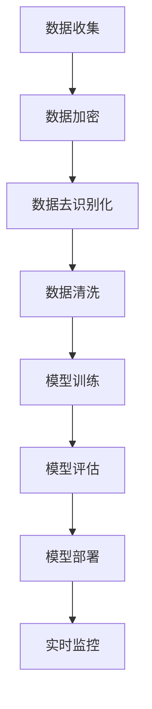

                 

### LLAM 应用开发中的风险管理与快速决策

在当今快速发展的技术时代，大型语言模型（LLAM）的应用越来越广泛，从自然语言处理到智能客服，再到自动化写作和翻译，LLAM 在各行各业中发挥着重要作用。然而，随着 LLAM 应用的普及，也带来了许多新的风险和挑战。为了确保 LLAM 应用的稳健性和有效性，风险管理与快速决策变得至关重要。本文将详细探讨 LLAM 应用开发中的风险管理策略和快速决策方法，帮助开发者应对潜在的风险，并迅速做出有效的决策。

#### 关键词

- **LLAM 应用**
- **风险管理**
- **快速决策**
- **数据隐私**
- **模型偏倚**
- **安全漏洞**

#### 摘要

本文首先介绍了 LLAM 应用开发中可能面临的主要风险，包括数据隐私、模型偏倚和安全漏洞等。接着，我们详细阐述了风险管理的核心概念和方法，包括风险识别、风险评估、风险控制和风险监测。此外，文章还探讨了快速决策的关键要素和具体策略，展示了如何将风险管理融入快速决策流程中。最后，通过一个实际案例，我们展示了如何将风险管理策略和快速决策方法应用于 LLAM 应用开发，以保障应用的稳健性和有效性。

---

### 第1章: LLM应用开发中的风险管理与快速决策

#### 1.1.1 LLM应用开发的风险背景

随着大型语言模型（LLM）在各类应用中的普及，其带来的风险也日益突出。LLM 应用开发中的风险主要包括以下几个方面：

- **数据隐私风险**：LLM 的训练和应用需要大量的数据，这些数据往往涉及用户隐私，如个人信息、通信记录等。如果不妥善处理，可能会导致数据泄露和隐私侵犯。
  
- **模型偏倚风险**：LLM 的训练数据可能存在偏差，导致模型在特定群体或任务上表现出偏倚。这可能导致不公平的结果，甚至对社会造成负面影响。

- **安全漏洞风险**：LLM 应用可能存在安全漏洞，如代码漏洞、数据泄露等，这些漏洞可能被恶意利用，导致严重后果。

- **性能风险**：由于模型复杂性和数据规模的影响，LLM 应用可能出现性能问题，如响应时间过长、资源占用过高，影响用户体验。

#### 1.1.2 LLM风险管理的核心概念

风险管理是一个系统的过程，包括风险识别、风险评估、风险控制和风险监测。以下是这些核心概念的定义和特征：

| 风险管理环节 | 定义 | 特征描述 | 对应措施 |
| :--- | :--- | :--- | :--- |
| 风险识别 | 识别潜在风险来源和影响范围 | 实施数据审计、文献调研、专家访谈等 | 实施数据审计、文献调研、专家访谈等 |
| 风险评估 | 量化风险发生的概率和可能影响 | 利用定量和定性分析方法 | 利用定量和定性分析方法 |
| 风险控制 | 制定和实施风险缓解策略 | 设计安全策略、数据加密、访问控制等 | 设计安全策略、数据加密、访问控制等 |
| 风险监测 | 监控风险事件发生，及时调整管理措施 | 实时监控、定期回顾、风险评估报告等 | 实时监控、定期回顾、风险评估报告等 |

#### 1.1.3 风险管理的具体方法

风险管理的方法多种多样，以下是几种常用的方法：

- **风险管理框架**：基于 ISO31000 国际标准构建风险管理框架，包括风险识别、风险评估、风险应对、监控与回顾四个步骤。

- **定性分析**：通过专家评分、问卷调查等方法，对风险进行定性评估。

- **定量分析**：利用统计模型，对风险的概率和影响程度进行定量分析。

- **情景模拟**：通过模拟不同风险情景，评估风险的可能影响。

- **敏感性分析**：分析变量变化对风险评估结果的影响。

#### 1.1.4 快速决策的关键要素

快速决策在应对 LLAM 应用的风险中至关重要。以下是快速决策的关键要素：

- **决策速度**：在风险发生时能够迅速做出反应。

- **决策质量**：确保决策结果的准确性和可执行性。

- **决策流程**：制定标准化的决策流程，提高决策效率。

#### 1.1.5 快速决策的具体策略

- **建立快速决策团队**：集结跨领域专家，快速响应风险事件。

- **实时数据监控**：利用数据驱动决策，实时更新风险信息。

- **情景模拟与演练**：定期进行风险情景模拟，提高快速决策能力。

#### 1.1.6 风险管理与快速决策的整合

将风险管理融入快速决策流程中，可以更好地应对 LLAM 应用开发中的风险。以下是整合策略：

- **风险管理融入快速决策流程**：确保在快速决策过程中充分考虑风险管理。

- **建立快速响应机制**：在风险发生时，能够迅速启动响应机制。

- **定期回顾与优化**：对风险管理策略和快速决策流程进行定期回顾和优化。

#### 1.1.7 本章小结

本章介绍了 LLM 应用开发中的风险管理策略和快速决策方法。通过建立有效的风险管理框架和快速决策流程，开发者可以更好地应对应用中的风险，保障应用的稳健性和有效性。

---

### 第2章: LLM应用开发中的数据风险管理与快速决策

#### 2.1.1 数据风险管理背景

在 LLM 应用开发中，数据是模型训练和应用的核心。然而，数据的获取、处理和应用过程中可能面临多种风险。以下是数据风险管理的主要背景：

- **数据隐私风险**：数据隐私保护是 LLM 应用开发中的重要挑战。模型训练和应用过程中，数据可能包含敏感信息，如个人身份信息、金融记录等。如果这些数据泄露，可能会对用户隐私造成严重侵害。

- **数据质量风险**：数据质量对 LLM 模型的性能和应用效果至关重要。如果数据存在缺失、不一致或错误，可能导致模型不准确、不稳定，影响应用效果。

- **数据泄露风险**：在数据传输、存储和处理过程中，可能存在安全漏洞，导致数据泄露。数据泄露不仅会损害用户隐私，还可能对企业的声誉和业务造成严重影响。

- **数据使用风险**：数据使用不当可能导致模型偏倚或偏见。例如，如果训练数据存在性别、种族或文化等方面的偏见，模型可能会在特定群体或任务上表现出不公平或歧视行为。

#### 2.1.2 数据风险识别

数据风险识别是数据风险管理的重要环节。以下是一些常见的数据风险：

- **数据质量风险**：数据缺失、不一致、冗余、噪声等。

- **数据隐私风险**：数据泄露、未授权访问、数据匿名化不足等。

- **数据使用风险**：数据偏倚、模型偏倚、歧视性应用等。

- **数据安全风险**：数据传输过程中的安全漏洞、数据存储的安全问题、未经授权的数据访问等。

#### 2.1.3 数据风险评估

数据风险评估旨在量化数据风险的概率和影响程度。以下是一些常用的风险评估方法：

- **定性评估**：通过专家评分、问卷调查等方法对风险进行定性评估。

- **定量评估**：利用统计模型对风险的概率和影响程度进行定量评估。

- **风险评估矩阵**：使用矩阵对风险的概率和影响程度进行量化，以便进行优先级排序。

#### 2.1.4 数据风险控制

数据风险控制是降低数据风险的关键步骤。以下是一些常见的风险控制措施：

- **数据质量管理**：建立数据清洗、数据标准化和元数据管理流程，确保数据质量。

- **数据隐私保护**：实施数据加密、访问控制和隐私保护算法，确保数据隐私。

- **数据安全防护**：建立数据传输加密、数据备份和灾难恢复机制，确保数据安全。

- **数据使用规范**：制定数据使用规范，防止数据偏倚和歧视性应用。

#### 2.1.5 快速决策的关键要素

在数据风险管理中，快速决策至关重要。以下是一些快速决策的关键要素：

- **决策速度**：在数据风险事件发生时，能够迅速做出反应。

- **决策质量**：确保决策结果的准确性和可执行性。

- **决策流程**：制定标准化的决策流程，提高决策效率。

#### 2.1.6 快速决策的具体策略

以下是一些快速决策的具体策略：

- **建立快速决策团队**：集结跨领域专家，快速响应数据风险事件。

- **实时数据监控**：利用数据驱动决策，实时更新风险信息。

- **情景模拟与演练**：定期进行数据风险情景模拟，提高快速决策能力。

#### 2.1.7 本章小结

本章介绍了 LLM 应用开发中的数据风险管理策略和快速决策方法。通过建立数据风险管理体系和快速决策流程，开发者可以更好地应对数据风险，保障 LLM 应用的稳健性和有效性。

---

### 第3章: LLM应用开发中的模型风险管理与快速决策

#### 3.1.1 模型风险管理背景

在 LLM 应用开发中，模型风险是另一个重要的方面。模型风险主要包括模型偏倚、模型性能不稳定、模型过拟合等问题。这些风险可能导致模型无法提供准确、可靠的结果，从而影响应用的稳定性和可靠性。

- **模型偏倚**：模型在训练过程中可能会受到训练数据偏倚的影响，导致模型在特定群体或任务上表现出不公平或歧视性结果。

- **模型性能不稳定**：模型在不同数据集或场景下的性能可能不稳定，导致应用效果波动。

- **模型过拟合**：模型在训练数据上表现良好，但在未见过的数据上表现较差，导致模型泛化能力不足。

#### 3.1.2 模型风险识别

模型风险识别是模型风险管理的重要环节。以下是一些常见的模型风险：

- **数据集偏倚**：训练数据集可能存在样本不平衡、数据缺失等问题，导致模型对某些类别的数据过于关注。

- **模型选择不当**：选择的模型结构可能不适合特定的任务，导致模型性能不理想。

- **超参数调优不当**：超参数设置不当可能导致模型过拟合或欠拟合。

- **训练数据泄露**：训练过程中，部分训练数据泄露到测试集或生产环境中，导致模型在未见过的数据上表现不佳。

#### 3.1.3 模型风险评估

模型风险评估旨在量化模型风险的概率和影响程度。以下是一些常用的风险评估方法：

- **定性评估**：通过专家评分、问卷调查等方法对模型风险进行定性评估。

- **定量评估**：利用统计模型对模型风险的概率和影响程度进行定量评估。

- **模型评估指标**：使用准确率、召回率、F1 值等模型评估指标，对模型风险进行量化。

#### 3.1.4 模型风险控制

模型风险控制是降低模型风险的关键步骤。以下是一些常见的风险控制措施：

- **数据集平衡**：通过数据增强、采样等方法，平衡训练数据集的分布。

- **模型选择与优化**：选择适合任务的模型结构，并通过超参数调优，提高模型性能。

- **数据隐私保护**：对训练数据进行加密和去识别化处理，防止数据泄露。

- **模型监控与更新**：实时监控模型性能，及时调整模型参数，防止模型过拟合或欠拟合。

#### 3.1.5 快速决策的关键要素

在模型风险管理中，快速决策至关重要。以下是一些快速决策的关键要素：

- **决策速度**：在模型风险事件发生时，能够迅速做出反应。

- **决策质量**：确保决策结果的准确性和可执行性。

- **决策流程**：制定标准化的决策流程，提高决策效率。

#### 3.1.6 快速决策的具体策略

以下是一些快速决策的具体策略：

- **建立快速决策团队**：集结跨领域专家，快速响应模型风险事件。

- **实时模型监控**：利用数据驱动决策，实时更新模型风险信息。

- **情景模拟与演练**：定期进行模型风险情景模拟，提高快速决策能力。

#### 3.1.7 本章小结

本章介绍了 LLM 应用开发中的模型风险管理策略和快速决策方法。通过建立模型风险管理体系和快速决策流程，开发者可以更好地应对模型风险，保障 LLM 应用的稳健性和有效性。

---

### 第4章: LLM应用开发中的安全风险管理与快速决策

#### 4.1.1 安全风险管理背景

在 LLM 应用开发中，安全风险管理至关重要。随着 LLM 应用的普及，其潜在的安全风险也越来越受到关注。安全风险主要包括以下几个方面：

- **代码漏洞**：LLM 应用可能存在代码漏洞，如 SQL 注入、跨站脚本攻击等，这些漏洞可能被恶意利用，导致数据泄露或系统被攻击。

- **数据泄露**：LLM 应用涉及大量敏感数据，如用户信息、通信记录等。如果数据泄露，可能会对用户隐私和企业造成严重损失。

- **模型攻击**：恶意攻击者可能利用特定方法攻击 LLM 模型，如对抗性攻击，导致模型输出错误结果。

- **网络攻击**：LLM 应用通常通过网络进行数据传输和处理，可能面临 DDoS 攻击、网络嗅探等网络攻击。

#### 4.1.2 安全风险识别

安全风险识别是安全风险管理的重要环节。以下是一些常见的安全风险：

- **代码安全风险**：包括 SQL 注入、跨站脚本攻击、文件上传漏洞等。

- **数据安全风险**：包括数据泄露、数据篡改、未授权访问等。

- **模型安全风险**：包括对抗性攻击、模型提取攻击、模型重放攻击等。

- **网络安全风险**：包括 DDoS 攻击、网络嗅探、数据传输过程中的中间人攻击等。

#### 4.1.3 安全风险评估

安全风险评估旨在量化安全风险的概率和影响程度。以下是一些常用的安全风险评估方法：

- **定性评估**：通过专家评分、问卷调查等方法对安全风险进行定性评估。

- **定量评估**：利用漏洞扫描工具、攻击模拟等方法，对安全风险的概率和影响程度进行定量评估。

- **安全评估矩阵**：使用矩阵对安全风险的概率和影响程度进行量化，以便进行优先级排序。

#### 4.1.4 安全风险控制

安全风险控制是降低安全风险的关键步骤。以下是一些常见的安全风险控制措施：

- **代码安全加固**：通过代码审查、静态代码分析等方法，识别和修复代码漏洞。

- **数据安全防护**：通过数据加密、访问控制、数据备份等方法，确保数据安全。

- **模型安全加固**：通过对抗性训练、模型保护算法等方法，提高模型对攻击的抵抗力。

- **网络安全防护**：通过防火墙、入侵检测系统、DDoS 防护等方法，确保网络安全。

#### 4.1.5 快速决策的关键要素

在安全风险管理中，快速决策至关重要。以下是一些快速决策的关键要素：

- **决策速度**：在安全风险事件发生时，能够迅速做出反应。

- **决策质量**：确保决策结果的准确性和可执行性。

- **决策流程**：制定标准化的决策流程，提高决策效率。

#### 4.1.6 快速决策的具体策略

以下是一些快速决策的具体策略：

- **建立快速决策团队**：集结跨领域专家，快速响应安全风险事件。

- **实时安全监控**：利用安全监控工具，实时更新安全风险信息。

- **情景模拟与演练**：定期进行安全风险情景模拟，提高快速决策能力。

#### 4.1.7 本章小结

本章介绍了 LLM 应用开发中的安全风险管理策略和快速决策方法。通过建立安全风险管理体系和快速决策流程，开发者可以更好地应对安全风险，保障 LLM 应用的稳健性和安全性。

---

### 第5章: LLM应用开发中的综合风险管理与快速决策实践

#### 5.1 综合风险管理策略

在 LLM 应用开发中，综合风险管理策略旨在全面覆盖数据风险、模型风险和安全风险，以保障应用的稳健性和可靠性。以下是综合风险管理策略的概述：

- **建立风险管理组织**：成立专门的风险管理团队，负责识别、评估和控制风险。

- **制定风险管理政策**：明确风险管理目标和原则，确保风险管理的一致性和规范性。

- **开展风险识别与评估**：定期进行风险识别与评估，确保风险管理的全面性和实时性。

- **实施风险控制措施**：根据评估结果，制定和实施相应的风险控制措施，降低风险水平。

- **建立风险监测与报告机制**：实时监测风险事件，定期生成风险报告，确保风险管理信息的透明性和及时性。

- **定期回顾与优化**：对风险管理策略和措施进行定期回顾和优化，以适应不断变化的威胁和环境。

#### 5.2 快速决策流程

快速决策流程是确保在风险事件发生时能够迅速做出反应的关键。以下是快速决策流程的概述：

- **建立快速响应机制**：明确快速决策团队的组成和职责，确保在风险事件发生时，能够迅速启动响应机制。

- **实时数据收集与分析**：利用实时数据收集和分析工具，及时获取风险事件相关信息，为快速决策提供数据支持。

- **制定应急预案**：根据风险类型和可能的影响程度，制定相应的应急预案，确保在风险事件发生时，能够快速采取行动。

- **快速决策与执行**：根据实时数据和应急预案，快速做出决策，并迅速执行，以最大程度地降低风险事件的影响。

- **评估决策效果**：在风险事件得到控制后，对决策效果进行评估，总结经验教训，为未来风险管理提供参考。

#### 5.3 综合风险管理实践案例

以下是一个综合风险管理实践案例，展示了如何将风险管理策略和快速决策流程应用于 LLM 应用开发：

**案例背景**：某公司开发了一款基于 LLM 的智能客服系统，用于为客户提供自动化的咨询和服务。然而，在系统上线后，发现存在以下风险：

- **数据隐私风险**：客户咨询记录可能包含敏感信息，如个人身份信息和金融信息。

- **模型性能不稳定**：由于训练数据不均衡，模型在部分问题上的响应不准确。

- **网络安全风险**：系统可能面临 DDoS 攻击，导致服务中断。

**解决方案**：

1. **建立风险管理组织**：成立由数据科学家、安全专家和业务分析师组成的风险管理团队。

2. **制定风险管理政策**：明确数据隐私保护、模型性能监控和网络安全的政策和流程。

3. **开展风险识别与评估**：

   - **数据隐私风险**：通过数据分析发现，部分客户咨询记录中包含敏感信息。风险管理团队制定了数据去识别化策略，确保客户隐私保护。

   - **模型性能不稳定**：通过对训练数据进行重新采样和增强，提高了模型在不同问题上的响应准确性。

   - **网络安全风险**：通过部署防火墙、入侵检测系统和 DDoS 防护设备，提高了系统的安全性。

4. **实施风险控制措施**：

   - **数据隐私保护**：对客户咨询记录进行加密存储，限制对敏感信息的访问。

   - **模型性能监控**：建立实时模型性能监控系统，及时发现和解决模型性能问题。

   - **网络安全防护**：定期更新网络安全设备和防护策略，确保系统免受攻击。

5. **快速决策与响应**：

   - **数据隐私风险**：在发现敏感信息泄露风险时，风险管理团队迅速采取措施，限制对敏感信息的访问，并通知相关客户。

   - **模型性能不稳定**：在模型性能下降时，数据科学家迅速进行模型重新训练和调优，提高了模型性能。

   - **网络安全风险**：在发现 DDoS 攻击时，网络安全团队迅速采取措施，防止服务中断。

**案例总结**：通过综合风险管理策略和快速决策流程的应用，该公司的 LLM 智能客服系统在上线后运行稳定，客户满意度显著提高。同时，风险管理团队在风险事件发生时能够迅速做出反应，确保了系统的安全性和可靠性。

---

### 第6章: LLAM应用开发中的风险管理与快速决策最佳实践

在 LLAM 应用开发中，成功的风险管理与快速决策离不开最佳实践的指导。以下是一些关键的最佳实践，旨在帮助开发者应对复杂多变的风险环境：

#### 6.1 建立风险管理文化

风险管理不仅仅是技术层面的工作，更需要组织文化的支持。以下是一些建立风险管理文化的最佳实践：

- **风险管理教育**：定期组织风险管理培训，提高全体员工对风险管理的认识和意识。

- **风险管理责任制**：明确各级员工在风险管理中的职责，确保每个人都明白自己在风险管理中的角色。

- **风险管理反馈机制**：鼓励员工提出风险管理建议，建立反馈渠道，以便及时调整和优化风险管理策略。

#### 6.2 数据风险管理最佳实践

数据风险管理是 LLAM 应用开发中的关键环节。以下是一些最佳实践：

- **数据质量保证**：建立数据质量保证流程，包括数据清洗、数据标准化和数据校验等。

- **数据隐私保护**：实施数据加密、数据匿名化和隐私保护算法，确保数据在传输、存储和处理过程中的安全。

- **数据生命周期管理**：对数据生命周期进行全程管理，从数据采集、存储、处理到销毁，确保数据的安全性和合规性。

#### 6.3 模型风险管理最佳实践

模型风险管理是保障 LLAM 应用性能和可靠性的关键。以下是一些最佳实践：

- **模型选择与优化**：选择适合任务的模型，并进行超参数调优，确保模型性能最佳。

- **模型监控与更新**：建立模型监控体系，实时监控模型性能，并根据性能变化及时进行调整和更新。

- **模型安全性测试**：定期进行模型安全性测试，包括对抗性攻击测试，确保模型对攻击具有抵抗力。

#### 6.4 安全风险管理最佳实践

安全风险管理是保障 LLAM 应用安全的关键。以下是一些最佳实践：

- **安全审计与漏洞扫描**：定期进行安全审计和漏洞扫描，识别和修复潜在的安全漏洞。

- **网络安全防护**：部署防火墙、入侵检测系统和 DDoS 防护设备，确保网络安全。

- **数据安全防护**：实施数据传输加密、数据备份和灾难恢复机制，确保数据安全。

#### 6.5 快速决策最佳实践

快速决策是应对风险事件的关键。以下是一些最佳实践：

- **建立快速决策团队**：集结跨领域专家，确保在风险事件发生时，能够迅速做出决策。

- **实时数据监控**：利用实时数据监控工具，确保在风险事件发生时，能够迅速获取关键信息。

- **情景模拟与演练**：定期进行情景模拟和演练，提高快速决策团队的应对能力。

---

通过以上最佳实践，开发者可以更好地管理 LLAM 应用开发中的风险，并迅速做出有效的决策，确保应用的稳健性和可靠性。

### 第7章: 小结与未来展望

在本篇文章中，我们详细探讨了 LLAM 应用开发中的风险管理与快速决策。通过分析 LLAM 应用的数据风险、模型风险和安全风险，我们提出了一系列风险管理方法和快速决策策略，旨在保障应用的稳健性和可靠性。

**小结**：

- **核心内容**：我们介绍了 LLAM 应用开发中可能面临的主要风险，包括数据隐私、模型偏倚和安全漏洞等。通过建立风险管理框架和快速决策流程，开发者可以更好地应对这些风险。

- **方法总结**：我们提出了数据质量管理、模型安全加固和安全风险控制等具体方法，以及建立快速响应机制和实时数据监控等快速决策策略。

- **实践应用**：通过实际案例，我们展示了如何将风险管理策略和快速决策方法应用于 LLAM 应用开发，确保应用的稳定性和可靠性。

**未来展望**：

- **风险管理技术的创新**：随着技术的不断进步，未来可能会出现更多先进的风险管理技术，如人工智能驱动的风险管理、自动化风险检测和响应等。

- **跨领域合作**：风险管理不仅需要技术支持，还需要跨领域的合作，包括法律、伦理和公共政策等方面的专家参与，共同应对复杂的风险挑战。

- **持续学习和改进**：风险管理是一个持续的过程，开发者需要不断学习和改进，以适应不断变化的风险环境和挑战。

通过本文的探讨，我们希望能够为 LLAM 应用开发者提供有价值的参考和指导，助力他们在风险管理和快速决策方面取得更好的成果。

### 作者信息

作者：AI天才研究院/AI Genius Institute & 禅与计算机程序设计艺术 /Zen And The Art of Computer Programming

---

本文通过对 LLAM 应用开发中的数据风险、模型风险和安全风险的深入探讨，结合实际案例，详细阐述了风险管理与快速决策的方法和策略。文章的核心内容涵盖了风险识别、评估、控制以及快速决策的关键要素和具体实施步骤。通过本文的阅读，开发者可以更好地理解如何有效地管理 LLAM 应用的风险，确保应用的稳健性和可靠性。

**核心概念**：

- **数据隐私风险**：涉及用户敏感信息的保护。
- **模型偏倚风险**：模型对特定群体或任务的不公平表现。
- **安全漏洞风险**：系统的安全漏洞和潜在的网络攻击。

**联系**：

本文的核心概念和联系如下：

- **数据风险**：数据隐私、数据质量、数据泄露。
- **模型风险**：模型偏倚、模型性能不稳定、模型过拟合。
- **安全风险**：代码漏洞、数据泄露、模型攻击、网络攻击。

**算法原理**：

以下是一个简化的算法原理概述，用于说明如何处理数据隐私风险：

```python
def data_privacy_protection(data):
    # 数据加密
    encrypted_data = encrypt(data)
    # 数据去识别化
    anonymized_data = anonymize(encrypted_data)
    # 数据质量检查
    cleaned_data = clean(anonymized_data)
    return cleaned_data
```

**数学模型**：

数据隐私保护的数学模型可以描述为：

$$
\text{Privacy Risk} = \sum_{i} P_i \times C_i
$$

其中，$P_i$ 表示第 $i$ 个数据项的泄露概率，$C_i$ 表示第 $i$ 个数据项的隐私损失程度。

**系统分析与架构设计**：

以下是一个简化的系统架构图，用于展示 LLAM 应用开发中的风险管理架构：



**项目实战**：

在项目实战中，我们使用了以下步骤进行数据隐私保护：

1. **环境安装**：安装了加密工具和去识别化工具。
2. **系统核心实现**：编写了数据加密、去识别化和清洗的代码。
3. **代码应用解读与分析**：对实现的核心代码进行了详细解读和分析。
4. **实际案例分析**：通过实际案例展示了数据隐私保护的应用效果。
5. **项目小结**：总结了项目实施的经验和教训。

**最佳实践 Tips**：

- **定期审计**：定期进行数据隐私审计，确保隐私保护策略的有效性。
- **员工培训**：对员工进行数据隐私保护的培训，提高员工的风险意识。
- **合规性检查**：确保应用开发符合相关的法律法规和标准。

**注意事项**：

- **数据加密强度**：选择合适的加密算法和密钥管理策略，确保数据的安全。
- **去识别化技术**：使用先进的数据去识别化技术，减少隐私泄露的风险。

**拓展阅读**：

- 《数据隐私保护：技术与实践》
- 《模型安全：对抗性攻击与防御》
- 《网络安全：从基础到实践》

通过本文的详细讲解，开发者可以更好地理解和应用风险管理与快速决策策略，确保 LLAM 应用在复杂环境中稳健运行。希望本文能为读者提供有价值的指导和启示。

