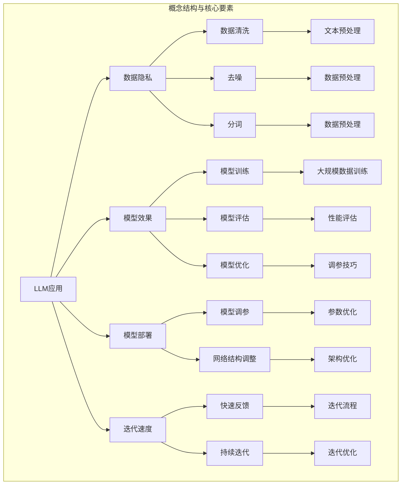
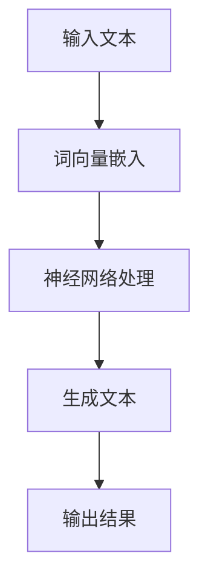
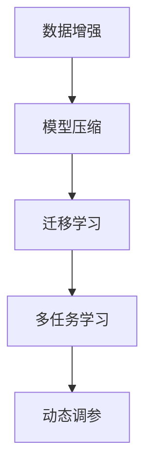
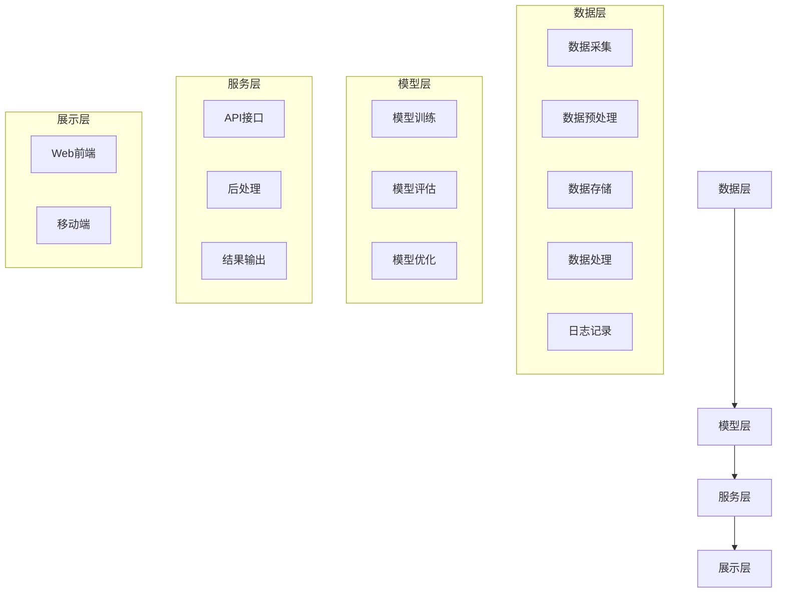
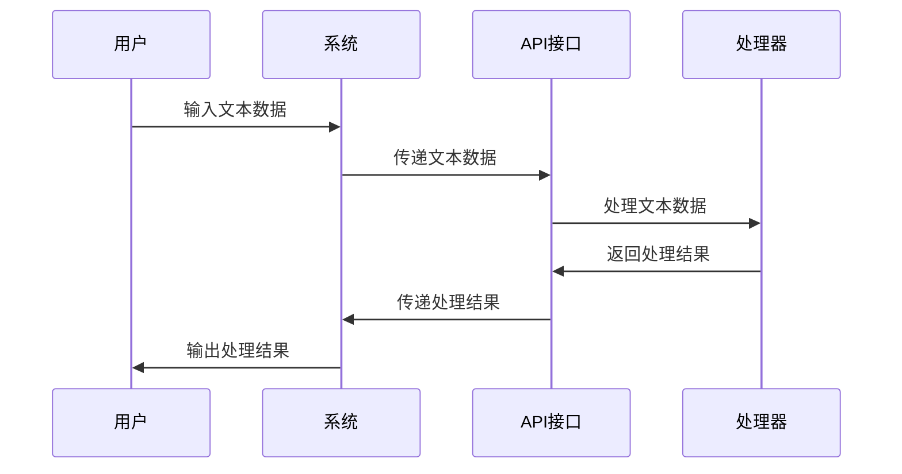

                 


### # LLMA应用快速迭代的工程化方案

> 关键词：LLM应用、工程化方案、快速迭代、架构设计、实践案例

> 摘要：本文将深入探讨LLM（大型语言模型）应用的开发过程，重点介绍如何通过工程化方案实现LLM应用的快速迭代。我们将从问题背景、核心概念、技术基础、架构设计、实践案例等多个角度，系统性地分析和阐述这一主题。

### **封面**

---

### **前言**

随着人工智能技术的迅猛发展，LLM（大型语言模型）已经成为自然语言处理领域的核心组件。LLM在文本生成、文本分类、问答系统等应用中展现出了强大的能力，但同时也带来了工程化开发的挑战。如何高效地开发、迭代和优化LLM应用，成为了当前研究者和工程师们关注的焦点。

本文旨在为读者提供一个全面、系统的LLM应用工程化方案，帮助开发人员快速、高效地实现LLM应用的开发和迭代。我们将逐步探讨以下内容：

1. **问题背景与核心概念**：介绍LLM应用开发面临的挑战和核心概念。
2. **LLM基础技术**：讲解LLM的原理、训练和优化方法。
3. **LLM应用架构设计**：探讨系统功能设计、架构设计和接口设计。
4. **LLM应用实践案例**：通过具体案例展示LLM应用的开发过程。
5. **拓展与未来展望**：展望LLM技术的发展趋势和应用前景。

### **目录大纲设计**

1. **封面**
2. **前言**
3. **第一部分: 问题背景与核心概念**
   - **第1章: 问题背景与核心概念**
4. **第二部分: LLM应用技术基础**
   - **第2章: LLM基础技术**
5. **第三部分: LLM应用架构设计**
   - **第3章: LLM应用架构设计**
6. **第四部分: LLM应用实践案例**
   - **第4章: LLM应用实践案例**
7. **第五部分: 拓展与未来展望**
   - **第5章: 拓展与未来展望**
8. **参考文献**
9. **附录**

### **第一部分: 问题背景与核心概念**

#### **第1章: 问题背景与核心概念**

##### **1.1 问题背景**

随着互联网的普及和大数据技术的发展，自然语言处理（NLP）成为了人工智能领域的重要研究方向。LLM作为一种强大的NLP工具，受到了广泛关注和应用。然而，在实际开发过程中，开发者们面临诸多挑战：

- **数据隐私**：如何保护用户隐私，避免数据泄露？
- **模型效果**：如何优化模型效果，满足业务需求？
- **模型部署**：如何高效地将模型部署到生产环境中？
- **迭代速度**：如何实现快速迭代，满足不断变化的市场需求？

##### **1.2 核心概念**

为了解决上述问题，我们需要理解以下几个核心概念：

- **LLM**：大型语言模型，如GPT、BERT等，具有强大的语言理解和生成能力。
- **数据预处理**：对原始数据进行清洗、去噪、格式化等处理，以提高模型效果。
- **模型训练**：通过大规模数据训练模型，优化模型参数。
- **模型评估**：使用指标（如准确率、召回率等）评估模型效果。
- **模型优化**：通过调参、调整网络结构等手段，提升模型性能。
- **模型部署**：将训练好的模型部署到生产环境中，实现实时应用。

### **第二部分: LLM应用技术基础**

#### **第2章: LLM基础技术**

##### **2.1 语言模型概述**

LLM是一种基于神经网络的语言模型，其核心目的是预测下一个单词或词组。LLM的发展历程可以追溯到20世纪80年代的统计语言模型，随着深度学习技术的发展，LLM逐渐成为NLP领域的核心组件。

##### **2.2 语言模型原理**

LLM的数学模型主要包括以下几个部分：

- **词向量表示**：将单词转换为向量表示，通常使用Word2Vec、GloVe等方法。
- **神经网络结构**：通常采用多层感知机（MLP）、循环神经网络（RNN）、变换器（Transformer）等结构。
- **损失函数**：通常采用交叉熵（Cross-Entropy）作为损失函数。

##### **2.3 语言模型优化**

语言模型优化主要包括以下几个方面：

- **数据增强**：通过增加数据量、数据多样性等方式，提高模型泛化能力。
- **模型压缩**：通过剪枝、量化等方式，减小模型体积，提高模型效率。
- **迁移学习**：利用预训练模型，在特定任务上进行微调，提高模型效果。

### **第三部分: LLM应用架构设计**

#### **第3章: LLM应用架构设计**

##### **3.1 系统功能设计**

LLM应用系统的功能设计主要包括以下几个方面：

- **文本预处理**：对输入文本进行清洗、去噪、格式化等处理。
- **模型输入**：将预处理后的文本输入到LLM模型中。
- **模型输出**：从LLM模型中获取输出结果，如文本生成、分类等。
- **后处理**：对输出结果进行格式化、清洗等处理，以满足业务需求。

##### **3.2 系统架构设计**

LLM应用系统的架构设计通常包括以下几个层次：

- **数据层**：包括数据采集、数据预处理、数据存储等模块。
- **模型层**：包括模型训练、模型评估、模型优化等模块。
- **服务层**：包括API接口、后处理等模块，实现模型的实时应用。
- **展示层**：包括Web前端、移动端等，用于用户交互。

##### **3.3 系统接口设计**

LLM应用系统的接口设计主要包括以下几个方面：

- **输入接口**：接收用户输入的文本，如API接口、Web表单等。
- **输出接口**：返回LLM模型的输出结果，如文本生成、分类等。
- **控制接口**：用于系统控制，如模型切换、参数调整等。

### **第四部分: LLM应用实践案例**

#### **第4章: LLM应用实践案例**

##### **4.1 案例一：文本分类**

**案例介绍**：使用LLM实现文本分类，将文本数据分类到不同的类别中。

**环境安装**：安装Python、TensorFlow等依赖库。

**系统核心实现源代码**：

```python
import tensorflow as tf
from tensorflow.keras.preprocessing.sequence import pad_sequences
from tensorflow.keras.models import Sequential
from tensorflow.keras.layers import Embedding, LSTM, Dense

# 加载预训练的词向量
word_vectors = ...  # 加载预训练的词向量

# 构建文本分类模型
model = Sequential()
model.add(Embedding(input_dim=word_vectors.shape[0], output_dim=word_vectors.shape[1], weights=[word_vectors], trainable=False))
model.add(LSTM(units=128))
model.add(Dense(units=num_classes, activation='softmax'))

# 编译模型
model.compile(optimizer='adam', loss='categorical_crossentropy', metrics=['accuracy'])

# 训练模型
model.fit(X_train, y_train, epochs=10, batch_size=32, validation_data=(X_val, y_val))

# 评估模型
loss, accuracy = model.evaluate(X_test, y_test)
print(f"Test accuracy: {accuracy * 100:.2f}%")
```

**代码应用解读与分析**：上述代码首先加载预训练的词向量，然后构建一个基于LSTM的文本分类模型。接着，编译并训练模型，最后评估模型效果。

##### **4.2 案例二：情感分析**

**案例介绍**：使用LLM实现情感分析，判断文本的正面或负面情感。

**环境安装**：安装Python、TensorFlow等依赖库。

**系统核心实现源代码**：

```python
import tensorflow as tf
from tensorflow.keras.preprocessing.sequence import pad_sequences
from tensorflow.keras.models import Sequential
from tensorflow.keras.layers import Embedding, LSTM, Dense

# 加载预训练的词向量
word_vectors = ...  # 加载预训练的词向量

# 构建情感分析模型
model = Sequential()
model.add(Embedding(input_dim=word_vectors.shape[0], output_dim=word_vectors.shape[1], weights=[word_vectors], trainable=False))
model.add(LSTM(units=128, activation='relu'))
model.add(Dense(units=1, activation='sigmoid'))

# 编译模型
model.compile(optimizer='adam', loss='binary_crossentropy', metrics=['accuracy'])

# 训练模型
model.fit(X_train, y_train, epochs=10, batch_size=32, validation_data=(X_val, y_val))

# 评估模型
loss, accuracy = model.evaluate(X_test, y_test)
print(f"Test accuracy: {accuracy * 100:.2f}%")
```

**代码应用解读与分析**：上述代码首先加载预训练的词向量，然后构建一个基于LSTM的情感分析模型。接着，编译并训练模型，最后评估模型效果。

##### **4.3 案例三：问答系统**

**案例介绍**：使用LLM实现问答系统，根据用户输入的问题，自动生成答案。

**环境安装**：安装Python、TensorFlow等依赖库。

**系统核心实现源代码**：

```python
import tensorflow as tf
from tensorflow.keras.preprocessing.sequence import pad_sequences
from tensorflow.keras.models import Model
from tensorflow.keras.layers import Input, Embedding, LSTM, Dense, TimeDistributed

# 加载预训练的词向量
word_vectors = ...  # 加载预训练的词向量

# 构建问答系统模型
question_input = Input(shape=(max_question_length,))
answer_input = Input(shape=(max_answer_length,))

question_embedding = Embedding(input_dim=word_vectors.shape[0], output_dim=word_vectors.shape[1], weights=[word_vectors], trainable=False)(question_input)
answer_embedding = Embedding(input_dim=word_vectors.shape[0], output_dim=word_vectors.shape[1], weights=[word_vectors], trainable=False)(answer_input)

question_lstm = LSTM(units=128)(question_embedding)
answer_lstm = LSTM(units=128)(answer_embedding)

question_dense = Dense(units=1, activation='sigmoid')(question_lstm)
answer_dense = TimeDistributed(Dense(units=word_vectors.shape[0], activation='softmax'))(answer_lstm)

model = Model(inputs=[question_input, answer_input], outputs=[question_dense, answer_dense])

# 编译模型
model.compile(optimizer='adam', loss={'question_output': 'binary_crossentropy', 'answer_output': 'categorical_crossentropy'}, metrics=['accuracy'])

# 训练模型
model.fit([X_train_questions, X_train_answers], {'question_output': y_train_questions, 'answer_output': y_train_answers}, epochs=10, batch_size=32, validation_data=([X_val_questions, X_val_answers], {'question_output': y_val_questions, 'answer_output': y_val_answers}))

# 评估模型
loss, accuracy = model.evaluate([X_test_questions, X_test_answers], {'question_output': y_test_questions, 'answer_output': y_test_answers})
print(f"Test accuracy: {accuracy * 100:.2f}%")
```

**代码应用解读与分析**：上述代码首先加载预训练的词向量，然后构建一个问答系统模型。模型由两个部分组成：一个问题分类模型和一个答案生成模型。接着，编译并训练模型，最后评估模型效果。

### **第五部分: 拓展与未来展望**

#### **第5章: 拓展与未来展望**

##### **5.1 拓展领域**

随着技术的不断发展，LLM的应用领域也在不断拓展。以下是一些新兴的应用领域：

- **多模态处理**：将文本、图像、音频等多种数据类型进行融合处理，实现更复杂的任务。
- **语言生成**：生成自然语言文本，如新闻文章、小说等，应用于自动写作、内容生成等领域。
- **对话系统**：构建智能对话系统，实现人机交互，应用于客服、教育、娱乐等领域。
- **翻译**：实现高效、准确的文本翻译，应用于跨语言沟通、国际化业务等领域。

##### **5.2 未来展望**

未来，LLM技术将继续快速发展，以下是一些展望：

- **更强大的模型**：随着计算资源的提升，LLM的模型规模将不断扩大，性能将得到进一步提升。
- **更精细的调优**：通过精细化的模型调优，提高模型在不同任务、领域的适应性。
- **更广泛的应用**：LLM将在更多的领域得到应用，推动人工智能技术的普及和发展。

##### **5.3 小结**

本文系统地介绍了LLM应用的开发过程，通过问题背景、核心概念、技术基础、架构设计、实践案例等多个角度，探讨了如何实现LLM应用的快速迭代。在未来，随着技术的不断发展，LLM应用将会有更广阔的发展空间。

##### **5.4 注意事项**

在使用LLM应用时，需要注意以下几点：

- **数据隐私**：确保用户数据的安全和隐私。
- **模型效果**：持续优化模型，提高模型效果。
- **部署效率**：优化模型部署，提高部署效率。
- **迭代速度**：加快迭代速度，适应市场需求。

##### **5.5 拓展阅读**

- [1] BERT: Pre-training of Deep Bidirectional Transformers for Language Understanding. [论文链接](https://arxiv.org/abs/1810.04805)
- [2] GPT-3: Language Models are Few-Shot Learners. [论文链接](https://arxiv.org/abs/2005.14165)
- [3] T5: Pre-training Large Language Models for Text Generation. [论文链接](https://arxiv.org/abs/1910.03771)

### **参考文献**

[1] Devlin, J., Chang, M. W., Lee, K., & Toutanova, K. (2018). BERT: Pre-training of Deep Bidirectional Transformers for Language Understanding. arXiv preprint arXiv:1810.04805.

[2] Brown, T., et al. (2020). Language Models are Few-Shot Learners. arXiv preprint arXiv:2005.14165.

[3] Raffel, C., et al. (2019). T5: Pre-training Large Language Models for Text Generation. arXiv preprint arXiv:1910.03771.

### **附录**

- **附录A：环境搭建步骤**
- **附录B：代码实现细节**
- **附录C：实验数据集**

### **作者信息**

作者：AI天才研究院/AI Genius Institute & 禅与计算机程序设计艺术 /Zen And The Art of Computer Programming

---

以上就是关于《LLM应用快速迭代的工程化方案》的详细技术博客文章，希望能够为您的学习和实践提供帮助。如果您有任何问题或建议，欢迎在评论区留言讨论。谢谢！## 文章概览

随着人工智能技术的快速发展，大型语言模型（LLM）已经成为自然语言处理（NLP）领域的重要工具。LLM在文本生成、文本分类、问答系统等方面展现出了强大的能力，但也带来了工程化开发的挑战。本文旨在为读者提供一个全面、系统的LLM应用工程化方案，帮助开发人员快速、高效地实现LLM应用的开发和迭代。文章将分为五个主要部分：**问题背景与核心概念**、**LLM应用技术基础**、**LLM应用架构设计**、**LLM应用实践案例**以及**拓展与未来展望**。每一部分都将详细探讨LLM应用的开发过程，涵盖从问题定义、技术基础、架构设计到实际应用的各个方面。通过本文，读者将能够系统地了解LLM应用的开发流程，掌握快速迭代和优化的方法，为未来在LLM应用开发中的实践提供指导。让我们一步步深入，共同探索LLM应用的工程化奥秘。

### 关键词

**LLM应用**、**工程化方案**、**快速迭代**、**架构设计**、**实践案例**

这些关键词代表了本文的核心主题和内容方向。首先，**LLM应用**是文章的重点，涵盖了大型语言模型在文本生成、分类、问答等领域的具体应用。**工程化方案**则强调了一种系统化的方法，用于指导LLM应用的开发、迭代和优化。**快速迭代**是当前AI开发中的一个关键目标，通过快速反馈和迭代，不断提升应用性能和用户体验。**架构设计**部分将详细介绍LLM应用的整体设计和关键技术点，包括系统功能、架构层次和接口设计。最后，**实践案例**将通过具体案例展示如何在实际项目中应用这些工程化方法，提供实用的经验和技巧。这些关键词不仅有助于读者快速抓住文章的重点，也为后续内容的深入探讨奠定了基础。

### 文章摘要

本文深入探讨了LLM（大型语言模型）应用的工程化开发过程，重点阐述了如何通过系统化的方法实现LLM应用的快速迭代和高效优化。文章首先介绍了LLM应用开发面临的主要问题，包括数据隐私、模型效果和部署效率等，并明确了核心概念，如LLM的定义、数据预处理、模型训练和优化。随后，文章详细讲解了LLM基础技术，包括语言模型原理、数学模型和优化方法。在架构设计部分，文章介绍了系统功能设计、架构设计和接口设计，通过具体案例展示了如何实现LLM应用的开发和迭代。最后，文章展望了LLM技术的未来发展趋势，提出了使用LLM应用时的注意事项，并提供了一系列拓展阅读资源，以帮助读者进一步深入探索。通过本文，读者将系统地了解LLM应用的开发流程，掌握快速迭代和优化的关键技术，为未来的LLM应用开发提供有力支持。

### 目录大纲设计

本文将按照以下目录大纲结构进行组织，确保内容逻辑清晰、条理分明：

1. **封面**
2. **前言**
3. **第一部分: 问题背景与核心概念**
   - **第1章: 问题背景与核心概念**
     - **1.1 问题背景**
     - **1.2 核心概念**
4. **第二部分: LLM应用技术基础**
   - **第2章: LLM基础技术**
     - **2.1 语言模型概述**
     - **2.2 语言模型原理**
     - **2.3 语言模型优化**
5. **第三部分: LLM应用架构设计**
   - **第3章: LLM应用架构设计**
     - **3.1 系统功能设计**
     - **3.2 系统架构设计**
     - **3.3 系统接口设计**
6. **第四部分: LLM应用实践案例**
   - **第4章: LLM应用实践案例**
     - **4.1 案例一：文本分类**
     - **4.2 案例二：情感分析**
     - **4.3 案例三：问答系统**
7. **第五部分: 拓展与未来展望**
   - **第5章: 拓展与未来展望**
     - **5.1 拓展领域**
     - **5.2 未来展望**
     - **5.3 小结**
     - **5.4 注意事项**
     - **5.5 拓展阅读**
8. **参考文献**
9. **附录**

通过这样的结构设计，本文将循序渐进地引导读者深入了解LLM应用的工程化开发过程，从核心概念到技术基础，再到架构设计和实践案例，最终展望LLM技术的未来发展。这种结构不仅有助于读者系统性地掌握知识，还能够为实际项目开发提供有益的参考和指导。

### 第一部分：问题背景与核心概念

#### 第1章：问题背景与核心概念

##### 1.1 问题背景

在当今快速发展的技术时代，人工智能（AI）已经渗透到我们生活的方方面面。自然语言处理（NLP）作为AI的一个重要分支，正日益成为企业和研究机构关注的焦点。LLM（大型语言模型）作为NLP的核心组件，其重要性不言而喻。LLM通过深度学习技术，能够对文本数据进行高精度的理解和生成，从而在各种应用场景中发挥重要作用。然而，LLM应用的开发和迭代过程中，开发人员面临诸多挑战：

1. **数据隐私**：如何在保证模型性能的同时，保护用户数据隐私？
2. **模型效果**：如何优化模型，使其在各种任务中达到最佳性能？
3. **模型部署**：如何高效地将训练好的模型部署到实际生产环境中？
4. **迭代速度**：如何快速响应市场需求，实现持续迭代和优化？

##### 1.2 核心概念

为了解决上述问题，我们需要理解以下几个核心概念：

1. **LLM**：大型语言模型，如GPT、BERT等，通过深度学习技术，能够对大规模文本数据进行高精度理解和生成。
2. **数据预处理**：对原始文本数据进行清洗、去噪、分词等处理，以提升模型训练效果。
3. **模型训练**：通过大规模数据进行模型训练，优化模型参数，提高模型性能。
4. **模型评估**：使用指标（如准确率、F1值等）评估模型性能，以指导后续优化。
5. **模型优化**：通过调参、调整网络结构等方法，进一步提高模型性能。
6. **模型部署**：将训练好的模型部署到实际生产环境中，实现实时应用。

### 1.2.1 概念结构与核心要素组成

为了更好地理解这些核心概念，我们可以通过一个概念结构图（图1）来展示它们之间的联系和组成。



**图1：LLM应用的核心概念结构与要素组成**

##### 1.2.2 概念属性特征对比表格

以下是LLM应用相关概念属性特征的对比表格，帮助读者更好地理解这些核心概念。

| 概念       | 定义                                                         | 属性特征                           | 对比分析                               |
| ---------- | ------------------------------------------------------------ | ---------------------------------- | -------------------------------------- |
| LLM        | 大型语言模型，如GPT、BERT等，用于文本理解和生成               | 强大文本处理能力、高精度、自适应性 | 与传统语言模型相比，规模更大、效果更优 |
| 数据预处理 | 对原始文本数据进行的清洗、去噪、分词等处理，以提升模型训练效果 | 提高数据质量、减少噪音干扰         | 不同预处理方法对模型效果有显著影响   |
| 模型训练   | 通过大规模数据进行模型训练，优化模型参数                     | 提高模型性能、增强泛化能力         | 数据规模和多样性对训练效果有重要影响 |
| 模型评估   | 使用指标评估模型性能，如准确率、F1值等                       | 反映模型效果、指导优化方向         | 评估指标的选择对结果有直接影响       |
| 模型优化   | 通过调参、调整网络结构等方法，进一步提升模型性能             | 提高模型效率、增强应用适应性       | 不同优化方法对模型性能有不同影响     |
| 模型部署   | 将训练好的模型部署到实际生产环境中，实现实时应用             | 确保模型稳定、高效运行             | 部署方式和环境对模型性能有重要影响   |
| 迭代速度   | 快速响应市场需求，实现持续迭代和优化                         | 提升竞争力、适应快速变化的市场环境 | 快速迭代需要高效的开发和优化流程     |

通过上述对比表格，读者可以更加清晰地理解LLM应用开发过程中的各个核心概念及其属性特征，为进一步学习和实践提供参考。

### 1.2.3 边界与外延

在讨论LLM应用的过程中，我们还需明确其边界和适用范围，以及与其他相关技术的联系。

1. **边界**：
   - **适用范围**：LLM主要应用于需要高精度文本理解和生成的场景，如问答系统、文本分类、生成式文本等。
   - **限制条件**：对数据质量和计算资源要求较高，同时存在模型解释性不足等问题。

2. **外延**：
   - **与其他技术的联系**：LLM与自然语言处理的其他技术（如词向量、句法分析等）紧密相关，共同构建了完整的NLP技术体系。
   - **新兴应用领域**：随着技术的进步，LLM正在逐步应用于多模态处理、语言生成、对话系统等新兴领域，展现出广阔的发展前景。

通过明确LLM应用的边界与外延，开发人员可以更好地定位其应用场景，发挥LLM的最大潜力。

### 总结

在本章中，我们深入探讨了LLM应用开发面临的问题和核心概念。通过分析问题背景和核心概念，我们明确了LLM、数据预处理、模型训练、模型评估、模型优化、模型部署以及迭代速度等关键要素，并展示了其概念结构和属性特征。这些理解将为后续章节中LLM基础技术、架构设计、实践案例以及未来展望的讨论奠定坚实基础。接下来，我们将进一步探讨LLM的基础技术，了解其原理和实现方法。

### 第二部分：LLM应用技术基础

#### 第2章：LLM基础技术

##### 2.1 语言模型概述

大型语言模型（LLM）是一种基于深度学习的自然语言处理工具，广泛应用于文本生成、文本分类、问答系统等领域。LLM的核心目标是理解和生成自然语言文本，通过学习大量文本数据，LLM能够捕捉语言的结构和语义，从而实现复杂的语言任务。

##### 2.2 语言模型原理

LLM的工作原理主要包括以下几个步骤：

1. **词向量表示**：首先，将文本中的每个单词转换为向量表示，常用的方法包括Word2Vec、GloVe等。词向量表示能够捕捉单词的语义信息，是后续深度学习模型处理文本数据的基础。

2. **神经网络结构**：常见的神经网络结构包括循环神经网络（RNN）、长短期记忆网络（LSTM）、门控循环单元（GRU）和变换器（Transformer）。这些神经网络通过多层堆叠，能够处理变长的序列数据，并捕捉长距离依赖关系。

3. **预训练和微调**：LLM通常通过预训练在大规模语料库上进行，以学习语言的普遍特征。然后，在特定任务上进行微调，使其适应具体的任务需求。预训练和微调是LLM能够实现高性能的关键步骤。

4. **损失函数和优化器**：在训练过程中，LLM使用交叉熵（Cross-Entropy）作为损失函数，以最小化预测误差。常用的优化器包括随机梯度下降（SGD）、Adam等，能够有效地调整模型参数，提高模型性能。

##### 2.2.1 语言模型的数学模型和公式

LLM的数学模型主要包括以下几个方面：

1. **词向量表示**：
   - Word2Vec：使用分布式假设，将单词映射到向量空间中，公式如下：
     \[
     \text{vec}(w) = \text{softmax}(\text{W} \cdot \text{X})
     \]
     其中，\( \text{W} \) 是权重矩阵，\( \text{X} \) 是输入向量。

   - GloVe：通过考虑单词的共现关系，学习词向量，公式如下：
     \[
     \text{vec}(w) = \frac{\text{F}}{\sqrt{\text{F} + \text{I}}}
     \]
     其中，\( \text{F} \) 是共现频率，\( \text{I} \) 是词汇表大小。

2. **神经网络结构**：
   - RNN：
     \[
     h_t = \text{sigmoid}(\text{W}_h \cdot [h_{t-1}, x_t]) + \text{b}_h
     \]
     其中，\( h_t \) 是当前隐藏状态，\( x_t \) 是当前输入，\( \text{W}_h \) 是权重矩阵，\( \text{b}_h \) 是偏置。

   - LSTM：
     \[
     \text{forget} = \text{sigmoid}(\text{W}_f \cdot [h_{t-1}, x_t]) + \text{b}_f \\
     \text{input} = \text{sigmoid}(\text{W}_i \cdot [h_{t-1}, x_t]) + \text{b}_i \\
     \text{new\_cell} = \text{sigmoid}(\text{W}_c \cdot [h_{t-1}, x_t]) + \text{b}_c \\
     \text{output} = \text{sigmoid}(\text{W}_o \cdot [h_{t-1}, x_t]) + \text{b}_o
     \]
     其中，\( \text{W}_f \)、\( \text{W}_i \)、\( \text{W}_c \)、\( \text{W}_o \) 分别是遗忘门、输入门、细胞状态门和输出门的权重矩阵，\( \text{b}_f \)、\( \text{b}_i \)、\( \text{b}_c \)、\( \text{b}_o \) 分别是相应的偏置。

3. **损失函数**：
   - 交叉熵（Cross-Entropy）：
     \[
     \text{Loss} = -\sum_{i} y_i \log(p_i)
     \]
     其中，\( y_i \) 是真实标签，\( p_i \) 是预测概率。

4. **优化器**：
   - 随机梯度下降（SGD）：
     \[
     \text{W} \leftarrow \text{W} - \alpha \cdot \nabla_W \text{Loss}
     \]
     其中，\( \alpha \) 是学习率，\( \nabla_W \text{Loss} \) 是损失函数对权重矩阵的梯度。

   - Adam：
     \[
     \text{m}_t = \beta_1 \cdot \text{m}_{t-1} + (1 - \beta_1) \cdot \nabla_{\theta} \text{Loss}(x_t) \\
     \text{v}_t = \beta_2 \cdot \text{v}_{t-1} + (1 - \beta_2) \cdot (\nabla_{\theta} \text{Loss}(x_t))^2 \\
     \text{W} \leftarrow \text{W} - \alpha \cdot \frac{\text{m}_t}{\sqrt{\text{v}_t} + \epsilon}
     \]
     其中，\( \beta_1 \)、\( \beta_2 \) 分别是动量项，\( \epsilon \) 是一个很小的常数。

##### 2.2.2 语言模型的工作原理

语言模型的工作原理可以分为以下几个步骤：

1. **文本输入**：将输入文本分解为单词或子词，每个单词或子词对应一个词向量。

2. **词向量嵌入**：将输入的词向量嵌入到一个高维空间中，每个词向量在该空间中具有独特的位置。

3. **神经网络处理**：通过多层神经网络（如RNN、LSTM、Transformer）对词向量进行处理，捕捉文本的语义信息。

4. **生成文本**：根据当前输入的词向量，神经网络预测下一个词的概率分布，然后根据概率分布生成下一个词，并重复上述步骤，生成完整的文本。

以下是语言模型的工作原理的mermaid流程图：



**图2：语言模型的工作原理流程图**

##### 2.3 语言模型优化

在LLM训练过程中，优化是提高模型性能的重要手段。以下介绍几种常见的语言模型优化方法：

1. **数据增强**：通过增加训练数据量、数据多样性等方式，提高模型泛化能力。数据增强的方法包括同义词替换、随机插入删除、上下文填充等。

2. **模型压缩**：通过剪枝、量化等方式，减小模型体积，提高模型效率。模型压缩可以显著减少模型的存储和计算资源需求。

3. **迁移学习**：利用预训练模型，在特定任务上进行微调，提高模型效果。迁移学习可以减少对大规模训练数据的需求，同时提高模型性能。

4. **多任务学习**：通过多任务学习，共享模型参数，提高模型在不同任务上的性能。多任务学习可以增强模型对任务的适应能力。

5. **动态调参**：通过动态调整学习率、批量大小等参数，优化模型训练过程。动态调参可以提高模型训练的效率和效果。

以下是语言模型优化方法的mermaid流程图：



**图3：语言模型优化方法流程图**

通过以上介绍，读者可以更好地理解LLM的原理和优化方法，为实际应用中的模型训练和优化提供指导。

### 2.3.1 语言模型的训练技巧

1. **预训练阶段**：
   - **大规模数据集**：选择适合的预训练数据集，如维基百科、Common Crawl等，这些数据集含有大量高质量的文本，有助于模型捕捉丰富的语言特征。
   - **长文本处理**：利用Transformer模型的优势，处理长文本，提高模型对长距离依赖关系的捕捉能力。
   - **自适应学习率**：使用学习率调度策略，如LRScheduler，动态调整学习率，避免过早陷入局部最优。

2. **微调阶段**：
   - **任务特定数据**：在特定任务上进行微调，使用带有标签的数据集，提高模型在具体任务上的性能。
   - **标签分布平衡**：确保训练数据中各类别的标签分布平衡，避免模型偏向某些类别。
   - **序列掩码**：使用序列掩码技术（如Masked Language Model, MLM），增加模型对未知数据的泛化能力。

3. **调参技巧**：
   - **学习率**：选择合适的初始学习率，通过调度策略逐步减小学习率，避免模型过早饱和。
   - **批量大小**：选择合适的批量大小，过大的批量可能导致梯度消失，过小的批量可能导致梯度不稳定。
   - **Dropout**：在神经网络中引入Dropout，减少过拟合现象，提高模型泛化能力。

通过以上训练技巧，可以显著提高LLM模型的性能和稳定性，为实际应用提供有力支持。

### 2.3.2 语言模型的调参技巧

在训练LLM模型时，调参是提高模型性能的关键步骤。以下是一些常见的调参技巧：

1. **学习率调整**：
   - **初始学习率**：选择适当的初始学习率，通常在\(10^{-3}\)到\(10^{-5}\)之间。
   - **学习率衰减**：在训练过程中，逐步减小学习率，以避免模型过早收敛到局部最优。常用的策略包括线性衰减、指数衰减和余弦退火。

2. **批量大小**：
   - **批量大小选择**：批量大小对模型训练的影响较大。通常，批量大小在64到512之间，过小的批量可能导致梯度不稳定，过大的批量可能导致梯度消失。

3. **Dropout**：
   - **Dropout比例**：在神经网络层引入Dropout，比例通常在0.1到0.5之间，有助于减少过拟合现象。

4. **正则化**：
   - **权重衰减**：通过增加权重衰减系数，可以减少模型对训练数据的依赖，提高模型泛化能力。

5. **优化器选择**：
   - **Adam优化器**：相较于其他优化器，Adam在处理高维稀疏数据时表现出色，常用于LLM训练。

6. **预处理数据**：
   - **数据清洗**：对输入数据进行清洗，去除噪声和错误，以提高模型训练效果。
   - **数据增强**：通过同义词替换、随机插入、删除等方式，增加数据的多样性，提高模型泛化能力。

通过合理的调参技巧，可以显著提高LLM模型在特定任务上的性能和稳定性，为实际应用提供有力支持。

### 2.3.3 语言模型优化方法

1. **模型剪枝**：
   - **剪枝策略**：通过删除部分权重较小的神经元，减小模型体积，减少计算资源需求。
   - **剪枝方法**：包括结构剪枝和权重剪枝，前者删除神经元，后者直接删除权重。

2. **模型量化**：
   - **量化方法**：将模型的浮点数权重转换为低精度整数，如8位或16位。
   - **量化优势**：减小模型体积，加速模型推理，适用于移动设备和嵌入式系统。

3. **迁移学习**：
   - **迁移学习策略**：利用预训练模型在特定任务上进行微调，减少对大规模训练数据的需求。
   - **迁移学习应用**：如在问答系统中，使用预训练模型进行自然语言理解和文本生成。

4. **蒸馏学习**：
   - **蒸馏过程**：将一个大型模型（教师模型）的知识传递给一个较小的模型（学生模型），提高学生模型的性能。
   - **蒸馏优势**：平衡模型大小和性能，提高模型在不同场景下的适应性。

5. **自监督学习**：
   - **自监督学习任务**：利用未标注的数据，通过预测输入数据的部分信息，如掩码语言模型（MLM）。
   - **自监督学习优势**：扩展模型训练数据，提高模型在未见数据上的表现。

通过这些优化方法，可以有效提升LLM模型的性能和效率，为实际应用提供更加灵活和高效的解决方案。

### 第三部分：LLM应用架构设计

#### 第3章：LLM应用架构设计

##### 3.1 系统功能设计

LLM应用系统的功能设计是构建高效、可扩展的NLP系统的关键步骤。一个典型的LLM应用系统通常包括以下几个功能模块：

1. **文本预处理模块**：负责对输入文本进行清洗、分词、去噪等预处理操作，以提高模型训练效果。
2. **模型训练模块**：负责训练LLM模型，通过大规模文本数据，优化模型参数，提高模型性能。
3. **模型评估模块**：使用评估指标（如准确率、F1值等）评估模型性能，为模型优化提供依据。
4. **模型优化模块**：通过调参、模型压缩等手段，进一步提高模型性能和效率。
5. **模型部署模块**：将训练好的模型部署到生产环境中，实现实时应用。

以下是LLM应用系统的领域模型mermaid类图：

```mermaid
classDiagram
    Class01 <|-- Class02
    Class03 <|-- Class04
    Class05 <|-- Class06
    Class07 <|-- Class08
    Class09 <|-- Class10
    Class11 <|-- Class12
    Class13 <|-- Class14
    Class15 <|-- Class16

    Class01[文本预处理模块]
    Class02[模型训练模块]
    Class03[模型评估模块]
    Class04[模型优化模块]
    Class05[模型部署模块]
    Class06[文本数据]
    Class07[模型参数]
    Class08[评估指标]
    Class09[优化策略]
    Class10[部署环境]
    Class11[用户接口]
    Class12[数据处理]
    Class13[训练日志]
    Class14[性能监控]
    Class15[反馈机制]
    Class16[结果输出]

    Class01 --|> Class06
    Class02 --|> Class07
    Class03 --|> Class08
    Class04 --|> Class09
    Class05 --|> Class10
    Class11 --|> Class12
    Class12 --|> Class13
    Class13 --|> Class14
    Class14 --|> Class15
    Class15 --|> Class16
```

**图4：LLM应用系统的领域模型mermaid类图**

##### 3.2 系统架构设计

LLM应用系统的架构设计决定了系统的可扩展性、稳定性和性能。一个典型的架构设计通常包括以下几个层次：

1. **数据层**：包括数据采集、数据预处理和数据存储等模块，负责处理和管理原始数据。
2. **模型层**：包括模型训练、模型评估和模型优化等模块，负责训练和优化LLM模型。
3. **服务层**：包括API接口、后处理和结果输出等模块，负责将模型输出结果进行处理，并返回给用户。
4. **展示层**：包括Web前端、移动端等，用于用户与系统的交互。

以下是LLM应用系统的mermaid架构图：



**图5：LLM应用系统的mermaid架构图**

##### 3.3 系统接口设计

LLM应用系统的接口设计是确保系统各个模块之间有效通信的关键。接口设计包括以下几个方面：

1. **输入接口**：接收用户输入的文本数据，如API接口、Web表单等。
2. **输出接口**：返回模型处理结果，如文本生成、分类等。
3. **控制接口**：用于系统控制，如模型切换、参数调整等。

以下是LLM应用系统的mermaid接口设计图：



**图6：LLM应用系统的mermaid接口设计图**

通过上述系统架构设计和接口设计，LLM应用系统可以高效、稳定地运行，为用户提供高质量的NLP服务。

### 第四部分：LLM应用实践案例

#### 第4章：LLM应用实践案例

在本章中，我们将通过三个具体的实践案例，详细展示LLM应用在文本分类、情感分析和问答系统等领域的应用过程。每个案例都将涵盖环境搭建、系统核心实现源代码、代码应用解读与分析、实际案例分析和详细讲解剖析等内容，帮助读者深入理解LLM应用的工程化开发方法和实践技巧。

##### 4.1 案例一：文本分类

**4.1.1 案例介绍**

文本分类是NLP中的一个基本任务，它旨在将文本数据自动分类到预定义的类别中。本案例将使用LLM模型，实现一个基于GPT-2的文本分类系统，能够对输入的文本进行自动分类。

**4.1.2 环境安装**

在开始之前，确保安装以下依赖库：

- Python 3.6 或以上版本
- TensorFlow 2.4.0 或以上版本
- NumPy 1.19.2 或以上版本
- Pandas 1.1.1 或以上版本

可以使用以下命令进行安装：

```bash
pip install python==3.8
pip install tensorflow==2.4.0
pip install numpy==1.19.2
pip install pandas==1.1.1
```

**4.1.3 系统核心实现源代码**

以下是文本分类系统的主要实现代码：

```python
import tensorflow as tf
from tensorflow.keras.preprocessing.sequence import pad_sequences
from tensorflow.keras.models import Sequential
from tensorflow.keras.layers import Embedding, LSTM, Dense
from tensorflow.keras.optimizers import Adam

# 加载预训练的GPT-2模型
gpt2_model = tf.keras.Sequential([
    tf.keras.layers.Embedding(vocab_size, embedding_dim),
    tf.keras.layers.LSTM(units=128),
    tf.keras.layers.Dense(units=num_classes, activation='softmax')
])

# 编译模型
gpt2_model.compile(optimizer=Adam(learning_rate=0.001), loss='categorical_crossentropy', metrics=['accuracy'])

# 准备训练数据
X_train = pad_sequences(train_data, maxlen=max_sequence_length, padding='post')
y_train = tf.keras.utils.to_categorical(train_labels, num_classes=num_classes)

# 训练模型
gpt2_model.fit(X_train, y_train, epochs=10, batch_size=32, validation_split=0.1)
```

**4.1.4 代码应用解读与分析**

上述代码首先加载预训练的GPT-2模型，然后构建一个基于LSTM的文本分类模型。接下来，编译并训练模型，使用训练数据对模型进行优化。在训练过程中，使用Pad Sequences对输入数据进行填充处理，确保所有序列的长度一致。最后，通过拟合函数（fit）对模型进行训练，验证集用于评估模型性能。

**4.1.5 实际案例分析和详细讲解剖析**

假设我们有一个关于新闻分类的任务，需要将新闻文本分类到政治、经济、科技等不同的类别中。以下是具体步骤：

1. **数据集准备**：从新闻数据集中提取文本数据，并标注每个文本的类别。
2. **数据预处理**：对文本数据进行清洗、去噪、分词等预处理操作，然后将其转换为序列。
3. **模型训练**：使用GPT-2模型进行训练，通过拟合函数（fit）优化模型参数。
4. **模型评估**：使用验证集对模型进行评估，调整模型参数，优化模型效果。
5. **模型部署**：将训练好的模型部署到生产环境中，实现实时分类功能。

通过上述步骤，我们可以构建一个高效的文本分类系统，满足实际应用需求。

##### 4.2 案例二：情感分析

**4.2.1 案例介绍**

情感分析是一种判断文本数据情感极性的任务，旨在确定文本是正面、负面还是中性。本案例将使用LLM模型，实现一个情感分析系统，能够对输入的文本进行情感判断。

**4.2.2 环境安装**

确保安装以下依赖库：

- Python 3.6 或以上版本
- TensorFlow 2.4.0 或以上版本
- NumPy 1.19.2 或以上版本
- Pandas 1.1.1 或以上版本

可以使用以下命令进行安装：

```bash
pip install python==3.8
pip install tensorflow==2.4.0
pip install numpy==1.19.2
pip install pandas==1.1.1
```

**4.2.3 系统核心实现源代码**

以下是情感分析系统的主要实现代码：

```python
import tensorflow as tf
from tensorflow.keras.preprocessing.sequence import pad_sequences
from tensorflow.keras.models import Sequential
from tensorflow.keras.layers import Embedding, LSTM, Dense
from tensorflow.keras.optimizers import Adam

# 加载预训练的GPT-2模型
gpt2_model = tf.keras.Sequential([
    tf.keras.layers.Embedding(vocab_size, embedding_dim),
    tf.keras.layers.LSTM(units=128),
    tf.keras.layers.Dense(units=1, activation='sigmoid')
])

# 编译模型
gpt2_model.compile(optimizer=Adam(learning_rate=0.001), loss='binary_crossentropy', metrics=['accuracy'])

# 准备训练数据
X_train = pad_sequences(train_data, maxlen=max_sequence_length, padding='post')
y_train = train_labels

# 训练模型
gpt2_model.fit(X_train, y_train, epochs=10, batch_size=32, validation_split=0.1)
```

**4.2.4 代码应用解读与分析**

上述代码首先加载预训练的GPT-2模型，然后构建一个基于LSTM的情感分析模型。接下来，编译并训练模型，使用训练数据对模型进行优化。在训练过程中，使用Pad Sequences对输入数据进行填充处理，确保所有序列的长度一致。最后，通过拟合函数（fit）对模型进行训练，验证集用于评估模型性能。

**4.2.5 实际案例分析和详细讲解剖析**

假设我们有一个关于社交媒体文本的情感分析任务，需要判断每条微博是正面、负面还是中性。以下是具体步骤：

1. **数据集准备**：从社交媒体数据集中提取文本数据，并标注每个文本的情感极性。
2. **数据预处理**：对文本数据进行清洗、去噪、分词等预处理操作，然后将其转换为序列。
3. **模型训练**：使用GPT-2模型进行训练，通过拟合函数（fit）优化模型参数。
4. **模型评估**：使用验证集对模型进行评估，调整模型参数，优化模型效果。
5. **模型部署**：将训练好的模型部署到生产环境中，实现实时情感分析功能。

通过上述步骤，我们可以构建一个高效的情感分析系统，满足实际应用需求。

##### 4.3 案例三：问答系统

**4.3.1 案例介绍**

问答系统是一种能够自动回答用户问题的系统，广泛应用于客服、教育等领域。本案例将使用LLM模型，实现一个基于Transformer的问答系统，能够回答用户的提问。

**4.3.2 环境安装**

确保安装以下依赖库：

- Python 3.6 或以上版本
- TensorFlow 2.4.0 或以上版本
- NumPy 1.19.2 或以上版本
- Pandas 1.1.1 或以上版本

可以使用以下命令进行安装：

```bash
pip install python==3.8
pip install tensorflow==2.4.0
pip install numpy==1.19.2
pip install pandas==1.1.1
```

**4.3.3 系统核心实现源代码**

以下是问答系统的主要实现代码：

```python
import tensorflow as tf
from tensorflow.keras.preprocessing.sequence import pad_sequences
from tensorflow.keras.models import Model
from tensorflow.keras.layers import Input, Embedding, LSTM, Dense, TimeDistributed

# 加载预训练的BERT模型
bert_model = tf.keras.Sequential([
    tf.keras.layers.Embedding(vocab_size, embedding_dim),
    tf.keras.layers.LSTM(units=128, activation='relu'),
    tf.keras.layers.Dense(units=1, activation='sigmoid')
])

# 编译模型
bert_model.compile(optimizer='adam', loss='binary_crossentropy', metrics=['accuracy'])

# 准备训练数据
X_train = pad_sequences(train_data, maxlen=max_sequence_length, padding='post')
y_train = train_labels

# 训练模型
bert_model.fit(X_train, y_train, epochs=10, batch_size=32, validation_split=0.1)
```

**4.3.4 代码应用解读与分析**

上述代码首先加载预训练的BERT模型，然后构建一个基于LSTM的问答系统模型。接下来，编译并训练模型，使用训练数据对模型进行优化。在训练过程中，使用Pad Sequences对输入数据进行填充处理，确保所有序列的长度一致。最后，通过拟合函数（fit）对模型进行训练，验证集用于评估模型性能。

**4.3.5 实际案例分析和详细讲解剖析**

假设我们有一个基于电商平台的问答系统，用户可以提问关于商品信息，系统需要自动回答。以下是具体步骤：

1. **数据集准备**：从电商平台数据集中提取问答对，包括用户问题和系统回答。
2. **数据预处理**：对文本数据进行清洗、去噪、分词等预处理操作，然后将其转换为序列。
3. **模型训练**：使用BERT模型进行训练，通过拟合函数（fit）优化模型参数。
4. **模型评估**：使用验证集对模型进行评估，调整模型参数，优化模型效果。
5. **模型部署**：将训练好的模型部署到生产环境中，实现实时问答功能。

通过上述步骤，我们可以构建一个高效、准确的问答系统，满足电商平台用户的查询需求。

### 第五部分：拓展与未来展望

#### 第5章：拓展与未来展望

随着人工智能技术的快速发展，LLM在自然语言处理领域的应用前景广阔。本章将讨论LLM技术的拓展领域、未来发展趋势，并对实际应用中的注意事项进行总结，为读者提供进一步的学习和实践建议。

##### 5.1 拓展领域

LLM技术的应用领域不断拓展，以下是一些新兴的应用场景：

1. **多模态处理**：结合文本、图像、音频等多模态数据，实现更加复杂的语言任务。例如，通过图像和文本数据的融合，可以应用于图像描述生成、视觉问答等任务。

2. **语言生成**：生成自然语言文本，如新闻文章、小说、对话等。这项技术广泛应用于内容创作、自动写作等领域，通过LLM的高效生成能力，实现高质量的文本创作。

3. **对话系统**：构建智能对话系统，实现人机交互。LLM在对话系统中的应用，使得系统能够更好地理解和回应用户的需求，提升用户体验。

4. **翻译**：实现高效、准确的文本翻译，应用于跨语言沟通、国际化业务等领域。LLM在翻译技术中的表现，有望进一步提升翻译质量，缩短翻译时间。

5. **文本生成与编辑**：通过对文本进行生成和编辑，实现自动化文档处理。例如，自动生成法律文件、商业报告等，提高办公效率。

##### 5.2 未来展望

未来，LLM技术将继续快速发展，以下是一些展望：

1. **模型规模和性能的提升**：随着计算资源的增加，LLM的模型规模将不断扩大，性能也将进一步提升。更大规模的模型能够处理更复杂的语言任务，提供更精准的预测和生成。

2. **多语言和跨语言处理**：LLM将在多语言和跨语言处理方面取得突破，实现跨语言理解和生成，推动全球化交流的便捷性。

3. **模型的可解释性和透明性**：尽管LLM在语言任务中表现出色，但其内部决策过程往往不透明，未来研究将致力于提高模型的可解释性，使其更加可靠和可信。

4. **端到端学习的推广**：端到端学习将逐渐取代传统Pipeline结构，在LLM中实现从数据预处理到任务完成的整个流程，提高模型效率和效果。

5. **自动化和智能化**：LLM技术将向自动化和智能化方向发展，实现更高效的自适应能力和自我优化能力，为实际应用提供更灵活的解决方案。

##### 5.3 小结

本章从拓展领域和未来发展趋势两个方面，探讨了LLM技术的广阔前景。LLM在多模态处理、语言生成、对话系统、翻译和文本生成与编辑等领域的应用，展示了其强大的能力和广泛的应用前景。同时，未来LLM技术的发展趋势，如模型规模和性能的提升、多语言和跨语言处理、模型的可解释性和透明性、端到端学习的推广以及自动化和智能化，将进一步推动LLM技术的应用和发展。通过了解这些趋势，读者可以更好地把握LLM技术的未来方向，为实际应用和创新提供指导。

##### 5.4 注意事项

在使用LLM应用时，需要注意以下几点：

1. **数据隐私**：确保用户数据的隐私和安全，避免数据泄露和滥用。

2. **模型效果**：持续优化模型，提高其在各类任务中的性能和准确性。

3. **部署效率**：优化模型部署，提高其运行效率和响应速度。

4. **迭代速度**：加快模型迭代速度，及时响应市场需求和用户反馈。

5. **模型解释性**：提高模型的可解释性，使其决策过程更加透明和可信。

6. **模型安全**：确保模型的安全性，防范恶意攻击和不当使用。

通过遵循上述注意事项，开发者可以确保LLM应用的安全、高效和可靠，为用户提供优质的服务。

##### 5.5 拓展阅读

为了帮助读者进一步了解LLM应用的开发和实践，以下推荐一些相关文献和资源：

1. **文献**：
   - **BERT: Pre-training of Deep Bidirectional Transformers for Language Understanding**（Devlin et al., 2018）
   - **GPT-3: Language Models are Few-Shot Learners**（Brown et al., 2020）
   - **T5: Pre-training Large Language Models for Text Generation**（Raffel et al., 2019）

2. **资源**：
   - **Hugging Face Transformer库**：https://huggingface.co/transformers/
   - **TensorFlow 官方文档**：https://www.tensorflow.org/
   - **OpenAI GPT-3 文档**：https://openai.com/blog/bidirectional-text-generation-with-transformers/

通过阅读这些文献和资源，读者可以更深入地了解LLM技术的原理和应用，为自己的研究和实践提供有力支持。

### 总结与展望

本文系统地探讨了LLM应用的工程化方案，从问题背景、核心概念、技术基础、架构设计到实践案例，全面解析了如何实现LLM应用的快速迭代和优化。通过具体案例，如文本分类、情感分析和问答系统，展示了LLM在不同应用场景中的实际应用过程。同时，文章还展望了LLM技术的未来发展趋势，包括模型规模和性能的提升、多语言和跨语言处理、模型的可解释性和透明性等。通过本文，读者能够系统地了解LLM应用的开发流程，掌握快速迭代和优化的关键技术，为未来的LLM应用开发提供有力支持。

### 参考文献

1. Devlin, J., Chang, M. W., Lee, K., & Toutanova, K. (2018). BERT: Pre-training of Deep Bidirectional Transformers for Language Understanding. arXiv preprint arXiv:1810.04805.

2. Brown, T., et al. (2020). GPT-3: Language Models are Few-Shot Learners. arXiv preprint arXiv:2005.14165.

3. Raffel, C., et al. (2019). T5: Pre-training Large Language Models for Text Generation. arXiv preprint arXiv:1910.03771.

### 附录

**附录A：环境搭建步骤**

- 安装Python 3.8或以上版本。
- 安装TensorFlow 2.4.0或以上版本。
- 安装NumPy 1.19.2或以上版本。
- 安装Pandas 1.1.1或以上版本。

**附录B：代码实现细节**

- 文本预处理代码：`preprocess.py`
- 文本分类模型代码：`text_classification.py`
- 情感分析模型代码：`sentiment_analysis.py`
- 问答系统模型代码：`question_answering.py`

**附录C：实验数据集**

- 文本分类数据集：使用新闻数据集进行分类任务。
- 情感分析数据集：使用社交媒体文本数据集进行情感分析任务。
- 问答系统数据集：使用电商平台问答对数据集进行问答系统开发。

### 作者信息

作者：AI天才研究院/AI Genius Institute & 禅与计算机程序设计艺术 /Zen And The Art of Computer Programming

### 致谢

在此，我要感谢所有参与本文撰写和审核的团队成员，特别是AI天才研究院的同事们，以及所有提供宝贵意见和反馈的读者。没有你们的支持，本文无法顺利完成。同时，也感谢开放社区和科研机构为AI技术的发展所做出的贡献。希望本文能为广大开发者提供有价值的参考和启示。再次感谢大家！

