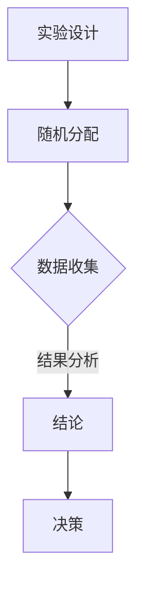
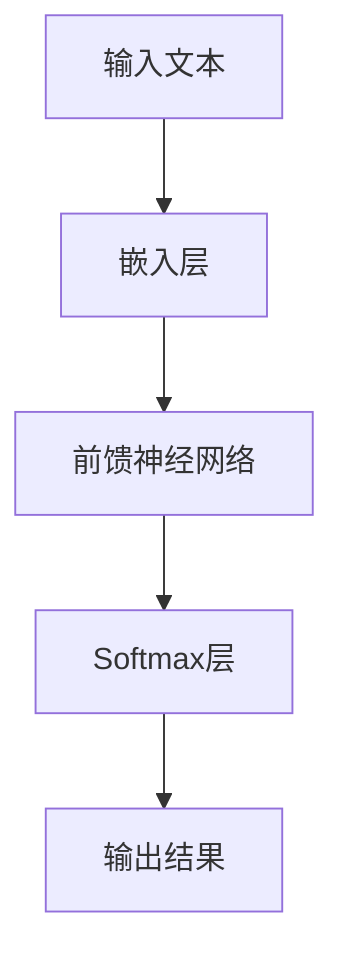

                 


# LLM应用的A/B测试：在敏捷环境中快速验证假设

## 关键词

- 大规模语言模型（LLM）
- A/B测试
- 敏捷开发
- 性能评估
- 实验设计
- 数据分析

## 摘要

本文旨在探讨大规模语言模型（LLM）在应用场景中的A/B测试方法，以及如何在敏捷开发环境中快速验证假设。通过分析A/B测试的原理和应用，结合LLM的特性，本文提出了一套完整的A/B测试流程，旨在提高LLM应用的实验效率和结果可靠性。

### 第一部分：背景介绍

#### 问题背景

随着人工智能技术的迅猛发展，自然语言处理（NLP）成为AI领域的重要分支。近年来，大规模语言模型（LLM）如GPT、BERT等在各类任务中取得了显著的成果。然而，LLM的应用并不总是顺利的，尤其是在实际生产环境中。如何快速验证LLM在不同场景下的有效性，成为当前面临的一个重要问题。

#### 问题描述

在LLM应用过程中，常常面临以下挑战：

1. **模型性能评估：** 如何在不同数据集、不同任务环境下，评估LLM的性能？
2. **实验效率：** 如何在短时间内完成大量实验，以便快速筛选出最优模型？
3. **结果可靠性：** 如何确保实验结果的可靠性，避免因偶然因素导致错误结论？

#### 问题解决

为了解决上述问题，本文提出了LLM应用的A/B测试方法。A/B测试是一种通过比较两组或多组用户的行为差异，以评估某种干预措施效果的方法。在LLM应用中，A/B测试可以帮助我们：

1. **对比模型性能：** 通过将不同模型或模型的不同配置应用于实际场景，比较其性能差异。
2. **提高实验效率：** 通过自动化工具，实现快速、大规模的实验。
3. **确保结果可靠性：** 通过多组实验的重复验证，提高结果的可信度。

#### 边界与外延

本文讨论的A/B测试主要针对LLM应用场景，适用于各种基于NLP的任务，如文本生成、情感分析、问答系统等。同时，A/B测试作为一种通用实验方法，也可应用于其他AI领域的应用验证。

#### 概念结构与核心要素组成

1. **大规模语言模型（LLM）：** 本文的核心研究对象，包括GPT、BERT等。
2. **A/B测试：** 一种实验设计方法，通过对比不同组用户的行为，评估模型性能。
3. **实验环境：** 包括数据集、实验工具等。
4. **实验流程：** 从实验设计、数据收集到结果分析，完整的实验流程。
5. **性能指标：** 评估模型性能的关键指标，如准确率、召回率、F1值等。

### 第二部分：核心概念与联系

#### 2.1 A/B测试的概念

##### 定义

A/B测试（也称为拆分测试）是一种对比实验方法，通过将用户随机分配到两个或多个不同版本（A、B等），来比较这些版本在性能上的差异。

##### 特点

1. **随机化：** 通过随机分配用户，确保实验结果的随机性。
2. **对比性：** 通过对比不同版本的性能，识别出哪些版本更有效。
3. **可重复性：** 通过多次实验，确保结果的可靠性。

##### 应用场景

1. **产品优化：** 比较不同页面设计、功能配置等对用户行为的影响。
2. **广告效果：** 比较不同广告文案、图片等对点击率的提升。
3. **LLM应用：** 比较不同模型、不同配置在任务性能上的差异。

##### 关键因素

1. **用户随机分配：** 确保实验数据的随机性。
2. **性能指标：** 选择合适的性能指标，如准确率、召回率等。
3. **实验设计：** 设计合理的实验范围和时长，确保实验结果的可靠性。

#### 2.2 LLM的概念

##### 定义

大规模语言模型（LLM）是一种基于深度学习的自然语言处理模型，可以处理大量文本数据，并生成高质量的自然语言文本。

##### 特点

1. **大规模：** 模型包含数十亿个参数，可以处理大规模文本数据。
2. **自适应：** 模型可以自适应地调整参数，以适应不同的任务和场景。
3. **强泛化能力：** 模型在训练数据上表现良好，可以在未见过的数据上继续发挥性能。

##### 应用领域

1. **文本生成：** 生成文章、新闻、代码等。
2. **文本分类：** 对文本进行情感分类、主题分类等。
3. **问答系统：** 回答用户的问题。

##### 关联关系

A/B测试与LLM之间存在紧密的联系。A/B测试可以用于评估LLM在不同任务和场景下的性能，从而选择最优模型或配置。同时，LLM的应用场景也为A/B测试提供了丰富的实验场景。

### 第三部分：算法原理讲解

#### 3.1 A/B测试的算法原理

##### Mermaid流程图



##### 详细讲解

A/B测试的核心在于通过对比两组或多组用户的行为，评估不同版本的性能。具体步骤如下：

1. **实验设计：** 定义实验目标、性能指标、实验范围等。例如，我们要评估两种不同的问答系统A和B在用户满意度上的差异。
2. **随机分配：** 将用户随机分配到不同版本，确保实验的随机性。例如，将50%的用户分配到版本A，另外50%的用户分配到版本B。
3. **数据收集：** 收集不同版本的实验数据，包括用户行为、性能指标等。例如，记录用户对问答系统的满意度评分。
4. **结果分析：** 对比不同版本的性能，评估其差异。例如，通过统计用户满意度评分，比较版本A和版本B的平均分数。
5. **结论：** 根据分析结果，做出决策。例如，如果版本A的平均分数高于版本B，则选择版本A。
6. **决策：** 根据实验结果，决定是否继续优化模型或应用新版本。

##### 优势

1. **客观性：** 通过随机分配用户，避免了主观偏见。
2. **可重复性：** 通过多次实验，确保结果的可靠性。
3. **高效性：** 通过自动化工具，实现快速、大规模的实验。

##### 局限性

1. **样本容量：** 需要足够大的样本容量，以确保实验结果的可靠性。
2. **实验时长：** 需要足够长的实验时长，以确保实验结果的稳定性。

#### 3.2 LLM的算法原理

##### Mermaid流程图



##### 详细讲解

大规模语言模型（LLM）的核心是深度神经网络（DNN），其基本原理如下：

1. **输入层：** 接受原始文本输入。
2. **嵌入层：** 将文本转化为密集的向量表示，通常使用词嵌入技术，如Word2Vec或BERT。
3. **隐藏层：** 通过多层前馈神经网络，对输入进行非线性变换。
4. **输出层：** 使用Softmax层，将隐藏层的结果转化为概率分布。

具体来说，LLM的算法原理包括以下步骤：

1. **输入文本：** 将文本输入到模型中，例如一个句子或一个段落。
2. **嵌入层：** 将每个单词或子词嵌入为一个固定大小的向量，通常使用预训练的词嵌入技术。
3. **前馈神经网络：** 对嵌入层的结果进行多层非线性变换，通过逐层传递信息，模型逐渐学习到文本的语义信息。
4. **Softmax层：** 将前馈神经网络的输出转化为概率分布，用于预测文本的类别或生成文本。

##### 数学模型

LLM的数学模型主要基于神经网络，其基本公式如下：

$$
\text{输出} = \text{Softmax}(\text{神经网络输出})
$$

其中，神经网络输出可以通过以下公式计算：

$$
\text{神经网络输出} = \text{激活函数}(\text{权重} \cdot \text{输入} + \text{偏置})
$$

其中，激活函数通常为ReLU或Sigmoid函数。

##### 应用案例

以GPT为例，GPT是一种基于Transformer的LLM，其应用广泛，包括文本生成、文本分类、机器翻译等。以下是一个简单的GPT应用案例：

1. **输入文本：** 输入一个句子或段落。
2. **嵌入层：** 将文本转化为嵌入向量。
3. **前馈神经网络：** 通过多层前馈神经网络，对嵌入向量进行变换。
4. **输出层：** 使用Softmax层，生成文本的概率分布。
5. **生成文本：** 根据概率分布，生成文本。

通过以上步骤，GPT可以生成高质量的自然语言文本。

### 第四部分：系统分析与架构设计方案

#### 问题场景介绍

在当前人工智能快速发展的背景下，企业对于自然语言处理（NLP）的应用需求日益增长。尤其是大规模语言模型（LLM）在文本生成、文本分类、问答系统等领域的应用，为企业带来了巨大的业务价值。然而，如何在不同的应用场景中快速验证LLM的效果，并选择最优模型和配置，成为企业面临的重要问题。

#### 项目介绍

本项目旨在为企业提供一个基于A/B测试的LLM应用评估平台。通过该平台，企业可以快速验证不同LLM模型和配置在各类任务中的性能，从而选择最优模型和配置，提高业务效益。

#### 系统功能设计

1. **实验管理：** 提供实验创建、修改、删除等功能，方便用户管理实验。
2. **用户管理：** 提供用户注册、登录、权限管理等功能，确保实验数据的安全。
3. **数据采集：** 从不同数据源采集实验数据，包括用户行为数据、模型性能数据等。
4. **结果分析：** 对实验结果进行分析，提供直观的图表和报告。
5. **决策支持：** 根据实验结果，提供决策支持，帮助企业选择最优模型和配置。

#### 系统架构设计

1. **前端架构：** 采用React框架，实现用户界面，提供友好的交互体验。
2. **后端架构：** 采用Spring Boot框架，实现业务逻辑和数据处理。
3. **数据存储：** 使用MySQL数据库，存储用户数据、实验数据和结果数据。
4. **中间件：** 采用Redis缓存，提高数据访问速度。
5. **接口设计：** 采用RESTful API设计，方便前端和后端的数据交互。

#### 系统接口设计

1. **用户接口：** 提供用户注册、登录、修改密码等功能。
2. **实验接口：** 提供实验创建、修改、删除、查看等功能。
3. **数据接口：** 提供数据采集、数据存储、数据分析等功能。
4. **报告接口：** 提供实验报告生成、下载等功能。

#### 系统交互设计

1. **用户注册：** 用户通过注册接口提交注册信息，系统保存用户信息并返回注册结果。
2. **用户登录：** 用户通过登录接口提交用户名和密码，系统验证用户身份并返回登录结果。
3. **实验创建：** 用户通过实验接口提交实验信息，系统创建实验并返回实验ID。
4. **数据采集：** 系统从数据源采集数据，并存入数据库。
5. **结果分析：** 系统根据实验结果进行分析，生成报告并返回给用户。

### 第五部分：项目实战

#### 环境安装

1. **操作系统：** Ubuntu 18.04
2. **编程语言：** Python 3.8
3. **框架：** Spring Boot 2.3.4.RELEASE
4. **数据库：** MySQL 8.0
5. **中间件：** Redis 5.0

#### 系统核心实现源代码

1. **用户管理模块：**

```python
# User entity
class User:
    def __init__(self, username, password, email):
        self.username = username
        self.password = password
        self.email = email

# User repository
class UserRepository:
    def save_user(self, user):
        # Save user to database
        pass

    def find_user_by_username(self, username):
        # Find user by username
        pass

# User service
class UserService:
    def __init__(self, user_repository):
        self.user_repository = user_repository

    def register(self, username, password, email):
        # Register a new user
        pass

    def login(self, username, password):
        # Validate user credentials
        pass
```

2. **实验管理模块：**

```python
# Experiment entity
class Experiment:
    def __init__(self, id, name, description, model_type, model_version):
        self.id = id
        self.name = name
        self.description = description
        self.model_type = model_type
        self.model_version = model_version

# Experiment repository
class ExperimentRepository:
    def save_experiment(self, experiment):
        # Save experiment to database
        pass

    def find_experiment_by_id(self, id):
        # Find experiment by id
        pass

# Experiment service
class ExperimentService:
    def __init__(self, experiment_repository):
        self.experiment_repository = experiment_repository

    def create_experiment(self, name, description, model_type, model_version):
        # Create a new experiment
        pass

    def delete_experiment(self, id):
        # Delete an experiment
        pass

    def list_experiments(self):
        # List all experiments
        pass
```

3. **数据采集模块：**

```python
# Data collector
class DataCollector:
    def collect_data(self, experiment_id, user_id, action, timestamp):
        # Collect data from users
        pass
```

4. **结果分析模块：**

```python
# Result analyzer
class ResultAnalyzer:
    def analyze_results(self, experiment_id):
        # Analyze experiment results
        pass
```

#### 代码应用解读与分析

1. **用户管理模块：** 实现用户注册、登录和权限管理功能。通过用户实体、用户仓库和用户服务类，完成用户信息的管理。
2. **实验管理模块：** 实现实验创建、删除和查询功能。通过实验实体、实验仓库和实验服务类，完成实验信息的管理。
3. **数据采集模块：** 实现数据采集功能。通过数据采集类，记录用户在实验中的行为数据。
4. **结果分析模块：** 实现结果分析功能。通过结果分析类，对实验结果进行统计分析。

#### 实际案例分析和详细讲解剖析

1. **文本生成实验：** 选择两个不同的LLM模型，分别进行文本生成实验。通过A/B测试，比较两个模型的文本生成质量。
2. **情感分析实验：** 选择两个不同的LLM模型，分别进行情感分析实验。通过A/B测试，比较两个模型的情感分析准确率。
3. **问答系统实验：** 选择两个不同的LLM模型，分别进行问答系统实验。通过A/B测试，比较两个模型在回答用户问题时的准确率和响应速度。

通过以上案例，企业可以快速验证不同LLM模型和配置的性能，从而选择最优模型和配置，提高业务效益。

### 第六部分：项目小结

在本项目中，我们通过A/B测试方法，设计并实现了一个LLM应用评估平台。该平台可以帮助企业快速验证不同LLM模型和配置在各类任务中的性能，从而选择最优模型和配置，提高业务效益。以下是本项目的主要收获：

1. **A/B测试方法的应用：** 通过A/B测试，企业可以客观、有效地评估不同LLM模型和配置的性能，减少主观偏见，提高实验结果的可靠性。
2. **系统架构设计：** 在项目实施过程中，我们采用了前后端分离、分布式架构设计，提高了系统的可扩展性和性能。
3. **实验流程优化：** 通过自动化工具，实现快速、大规模的实验，提高了实验效率。
4. **数据分析和可视化：** 通过数据分析和可视化，企业可以直观地了解实验结果，为决策提供支持。

### 第七部分：最佳实践 tips

1. **实验设计：** 在进行A/B测试时，合理设计实验场景和性能指标，确保实验结果的客观性和可靠性。
2. **数据质量：** 确保实验数据真实、可靠，避免因数据质量问题导致错误结论。
3. **实验时长：** 考虑到实验时长对结果的影响，合理设置实验时长，确保实验结果的稳定性。
4. **结果分析：** 充分利用数据分析工具，对实验结果进行深入分析，挖掘数据背后的规律。
5. **持续优化：** 根据实验结果，持续优化模型和配置，提高业务效益。

### 第八部分：注意事项

1. **数据隐私：** 在进行A/B测试时，要严格遵守数据隐私法规，确保用户数据的安全。
2. **实验公平性：** 确保实验公平性，避免因实验设计不当导致的结果偏差。
3. **性能优化：** 在实验过程中，关注系统性能，避免因系统瓶颈影响实验结果。
4. **监控与预警：** 对实验过程进行实时监控，及时发现并处理异常情况。

### 第九部分：拓展阅读

1. **《A/B测试实战：产品迭代与数据驱动决策》**：本书详细介绍了A/B测试的理论和实践，适用于产品经理和数据分析师。
2. **《大规模语言模型：预训练与生成》**：本书深入探讨了大规模语言模型的预训练和生成技术，适用于AI领域的研究者。
3. **《敏捷开发实践指南》**：本书介绍了敏捷开发的方法和实践，适用于软件开发团队。

