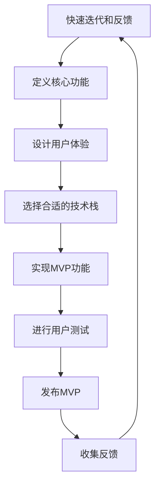
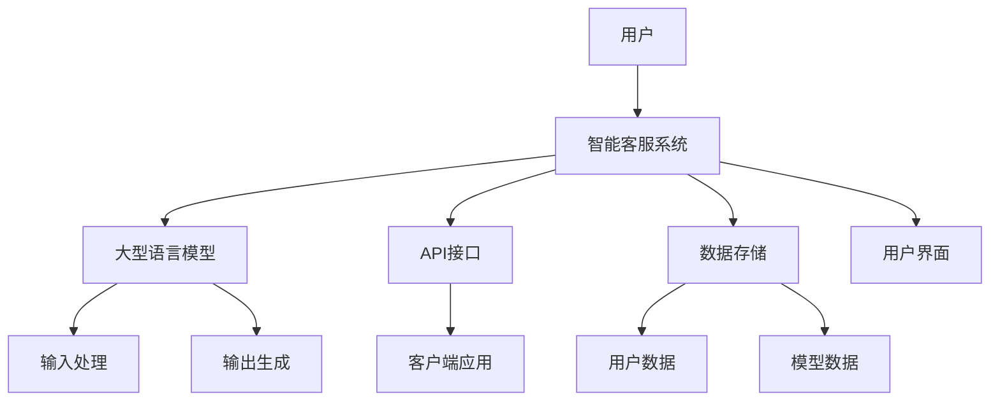
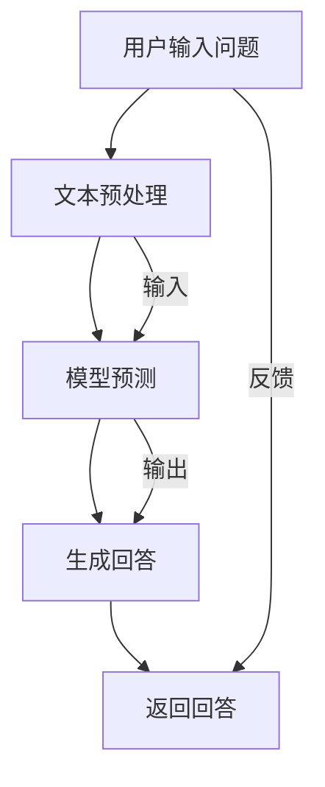
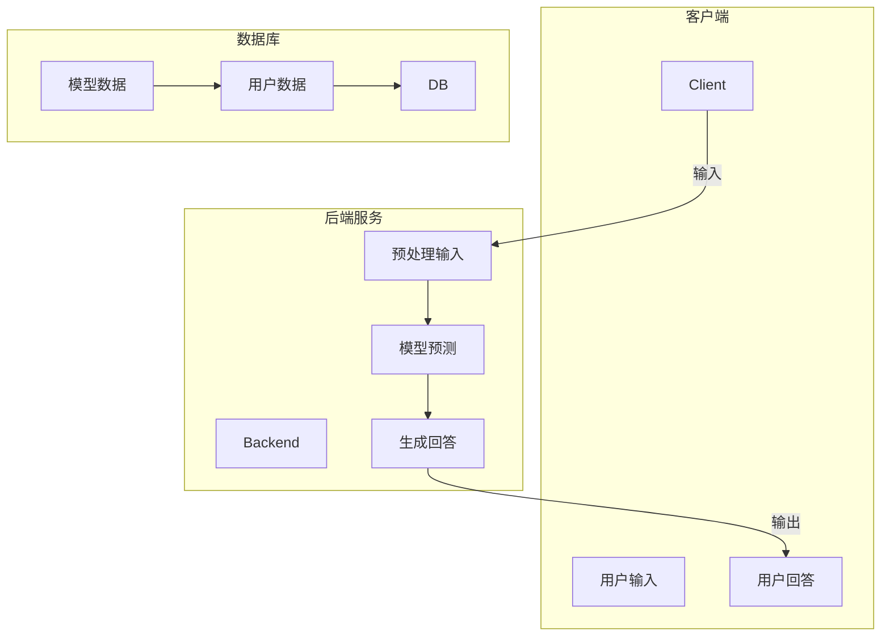

                 

# LLM应用的MVP策略：快速验证产品价值

## 关键词
- 语言模型（LLM）
- 最小可行产品（MVP）
- 产品验证
- 市场接受度
- 技术策略

## 摘要
本文旨在探讨如何通过构建最小可行产品（MVP）来快速验证大型语言模型（LLM）的应用价值。我们将深入分析LLM和MVP的基本概念、技术原理、策略实施，并通过实际案例展示其应用效果。文章将帮助读者理解并掌握构建LLM应用的MVP策略，以便更有效地验证产品价值和市场接受度。

## 第1章: 引言

### 1.1 书籍目的与读者对象

本书的目标是向读者介绍如何利用大型语言模型（LLM）构建最小可行产品（MVP），以便快速验证产品价值和市场接受度。这本书面向的读者群体包括：
- 初学者和中级开发者，希望了解LLM和MVP的基本概念和实施方法。
- 高级开发者和技术领导者，寻求将LLM技术应用于实际产品的最佳策略。
- 产品经理和市场分析师，关注如何通过MVP策略优化产品设计和市场推广。

### 1.2 LLM的兴起与影响

近年来，随着深度学习和自然语言处理技术的飞速发展，大型语言模型（LLM）逐渐成为人工智能领域的重要研究方向。LLM通过大规模文本数据的学习，能够生成高质量的自然语言文本，具备理解、生成和翻译语言的能力。LLM在各个领域的应用已经取得了显著成果，如自然语言生成、文本分类、机器翻译等。

### 1.3 MVP策略的重要性

最小可行产品（MVP）是一种以最小投入快速验证产品价值和市场接受度的策略。MVP的核心思想是通过开发一个功能最简的产品版本，获取用户的反馈，以便快速调整和优化产品。MVP策略在创业公司中广泛应用，因为它能够帮助企业以低成本、高效率的方式探索市场机会，降低创业风险。

## 第2章: 大型语言模型（LLM）技术概述

### 2.1 LLM的定义与特点

大型语言模型（LLM）是一种基于深度学习技术的自然语言处理模型，通过训练大规模的文本数据集，能够生成与人类语言相似的高质量文本。LLM的主要特点包括：

- **规模巨大**：LLM通常具有数十亿甚至数万亿的参数，能够处理大量复杂的语言模式。
- **高精度**：通过训练大量的文本数据，LLM能够精确地理解语言结构、语义和上下文关系。
- **多功能性**：LLM可以应用于多种自然语言处理任务，如文本分类、机器翻译、问答系统等。

### 2.2 LLM的技术基础

LLM的技术基础主要依赖于深度学习和神经网络，特别是变分自编码器（VAE）和递归神经网络（RNN）的发展。目前，LLM的主要实现框架包括：

- **Transformer架构**：由谷歌提出，采用自注意力机制，能够有效捕捉文本中的长距离依赖关系。
- **BERT模型**：基于Transformer架构，通过预训练和微调，能够实现多种NLP任务。
- **GPT系列**：OpenAI推出的一系列大型语言模型，具有强大的文本生成能力。

### 2.3 LLM在现实世界中的应用

LLM在现实世界中具有广泛的应用，如：

- **自然语言生成**：生成新闻报道、文章摘要、对话文本等。
- **文本分类**：对大量文本进行分类，如垃圾邮件过滤、情感分析等。
- **机器翻译**：实现多种语言之间的自动翻译，如谷歌翻译。
- **问答系统**：构建智能问答机器人，提供用户所需的答案。

## 第3章: 最小可行产品（MVP）策略概述

### 3.1 MVP的概念与目的

最小可行产品（MVP）是一种以最小化资源投入、快速验证产品价值和市场接受度的策略。MVP的核心目的是通过开发一个功能最简的产品版本，获取用户的真实反馈，以便快速调整和优化产品。

### 3.2 MVP的关键要素

MVP的关键要素包括：

- **核心功能**：确保产品具有满足用户需求的核心功能。
- **用户体验**：提供良好的用户体验，以便用户能够轻松使用产品。
- **可扩展性**：设计具有可扩展性的系统架构，以便后续功能扩展。
- **测试反馈**：通过收集用户反馈，不断优化和改进产品。

### 3.3 MVP的优势与挑战

MVP的优势包括：

- **降低成本**：通过最小化资源投入，降低创业风险。
- **快速迭代**：通过快速验证和调整，缩短产品上市时间。
- **用户导向**：以用户需求为中心，确保产品能够满足市场需求。

MVP的挑战包括：

- **功能限制**：MVP的功能相对简单，可能无法满足所有用户需求。
- **市场风险**：产品可能无法在市场中获得足够的用户和收益。
- **团队协作**：需要高效的团队协作，以快速实现MVP。

## 第4章: 构建LLM的MVP

### 4.1 设计MVP的步骤

构建LLM的MVP可以分为以下步骤：

1. **确定目标用户和需求**：明确MVP的目标用户群体，了解他们的需求和痛点。
2. **定义核心功能**：根据用户需求，确定MVP的核心功能，确保产品具备初步的实用价值。
3. **设计用户体验**：设计简洁、直观的用户界面，提升用户体验。
4. **选择合适的技术栈**：根据核心功能和用户体验设计，选择合适的技术栈和框架。
5. **实现MVP功能**：快速开发MVP的核心功能，确保产品可以运行和测试。
6. **进行用户测试**：通过实际用户测试，收集反馈，优化产品功能。
7. **发布MVP**：将MVP发布到市场，获取用户反馈，为后续产品迭代提供参考。

### 4.2 LLM的MVP关键组件

构建LLM的MVP需要以下关键组件：

- **语言模型**：选择合适的LLM框架和模型，如BERT、GPT等。
- **数据处理**：预处理和清洗数据，以便训练和优化LLM。
- **用户接口**：设计简洁、直观的用户界面，便于用户与LLM交互。
- **数据存储**：存储用户数据和模型参数，以便后续的迭代和优化。
- **API接口**：提供API接口，便于其他应用程序与LLM集成。

### 4.3 实施MVP的注意事项

实施LLM的MVP时，需要注意以下事项：

- **功能优先**：在MVP阶段，功能优先于性能和美观。
- **用户反馈**：重视用户反馈，根据反馈不断优化产品。
- **迭代速度**：保持快速迭代，以便及时响应用户需求和市场变化。
- **安全性**：确保用户数据安全和隐私保护。
- **可扩展性**：设计可扩展的系统架构，以便后续功能扩展。

## 第5章: 快速验证价值

### 5.1 收集反馈

在构建LLM的MVP后，收集用户反馈是快速验证产品价值的重要步骤。以下是一些收集反馈的方法：

- **用户调研**：通过问卷调查、用户访谈等方式，了解用户的需求、期望和痛点。
- **A/B测试**：通过对比不同版本的功能和界面，分析用户行为和偏好。
- **用户行为分析**：分析用户在产品中的行为数据，了解用户的使用习惯和反馈。
- **社交媒体**：关注用户在社交媒体上的评论和反馈，及时回应用户问题。

### 5.2 分析用户行为

分析用户行为可以帮助我们了解产品的实际使用情况，为产品迭代提供依据。以下是一些分析用户行为的方法：

- **行为轨迹分析**：记录用户在产品中的操作轨迹，分析用户行为的规律和模式。
- **用户留存率**：统计用户在产品中的留存率，了解产品的用户粘性。
- **用户活跃度**：分析用户的活跃度，了解用户的使用频率和时长。
- **错误日志**：收集用户的错误日志，分析产品中的问题和瓶颈。

### 5.3 优化产品功能

根据用户反馈和行为分析结果，对产品功能进行优化和迭代。以下是一些优化产品功能的方法：

- **功能简化**：去除冗余功能，确保产品核心功能的实用性。
- **界面优化**：改进用户界面，提升用户体验。
- **性能优化**：提高产品性能，减少响应时间和加载时间。
- **功能扩展**：根据用户需求和市场变化，增加新功能。
- **用户教育**：通过用户教育，提高用户对产品的认知和满意度。

## 第6章: 案例分析

### 6.1 案例一：LLM在客户服务中的应用

某家初创公司开发了一款基于LLM的智能客服系统，通过MVP策略快速验证了产品的市场价值。以下是该案例的具体情况：

- **目标用户**：该公司面向大型企业，提供智能客服解决方案。
- **核心功能**：智能客服系统能够自动回答用户提问，实现24小时在线服务。
- **用户体验**：系统采用简洁、直观的界面，易于用户操作。
- **测试反馈**：通过用户调研和A/B测试，不断优化智能客服系统的回答准确性和响应速度。
- **市场验证**：在发布MVP后，该公司获得了多家大型企业的关注和合作，市场反馈积极。

### 6.2 案例二：LLM在内容生成中的应用

某家内容创业公司开发了一款基于LLM的文章生成工具，通过MVP策略验证了产品的市场潜力。以下是该案例的具体情况：

- **目标用户**：该公司面向自媒体创作者，提供高效的内容生成工具。
- **核心功能**：文章生成工具能够根据用户输入的关键词和主题，生成高质量的文章。
- **用户体验**：系统采用用户友好的界面，支持多种输入格式和输出格式。
- **测试反馈**：通过用户调研和A/B测试，不断优化文章生成工具的文本质量和生成速度。
- **市场验证**：在发布MVP后，该工具受到了自媒体创作者的广泛关注，产品用户数量迅速增长。

### 6.3 案例三：LLM在教育领域的应用

某家在线教育公司开发了一款基于LLM的智能问答系统，通过MVP策略验证了产品的市场价值。以下是该案例的具体情况：

- **目标用户**：该公司面向学生和教育机构，提供智能问答服务。
- **核心功能**：智能问答系统能够自动回答学生在学习过程中遇到的问题，提供解题思路和参考资料。
- **用户体验**：系统采用简洁、直观的界面，支持多种问答形式和知识点查询。
- **测试反馈**：通过用户调研和A/B测试，不断优化智能问答系统的回答准确性和知识覆盖面。
- **市场验证**：在发布MVP后，该智能问答系统受到了学生和教育机构的广泛欢迎，产品用户数量持续增长。

## 第7章: 最佳实践与总结

### 7.1 构建LLM应用MVP的最佳实践

以下是一些构建LLM应用MVP的最佳实践：

- **明确目标用户和需求**：在构建MVP之前，明确目标用户群体和需求，以确保产品具备实际价值。
- **快速迭代和反馈**：保持快速迭代，及时收集用户反馈，根据反馈调整产品功能。
- **简单实用**：在MVP阶段，注重产品的简单性和实用性，避免过度设计。
- **可扩展性**：在设计系统架构时，考虑未来的扩展性，以便后续功能增加。
- **安全性**：确保用户数据的安全和隐私保护，遵循相关法律法规。

### 7.2 小结与展望

通过本文的探讨，我们可以得出以下结论：

- **LLM和MVP在产品开发中具有重要作用**：LLM可以提供强大的语言处理能力，MVP策略可以帮助企业快速验证产品价值和市场接受度。
- **构建LLM应用MVP需要关注用户体验**：在构建MVP时，关注用户体验，确保产品具备良好的使用体验。
- **快速迭代和反馈是关键**：通过快速迭代和反馈，不断优化产品功能，提高市场竞争力。

未来，随着人工智能技术的不断发展，LLM应用场景将更加丰富，MVP策略也将成为产品开发的重要手段。企业需要不断探索和创新，以应对快速变化的市场需求。

### 7.3 注意事项与拓展阅读

- **注意事项**：在构建LLM应用MVP时，需要注意数据隐私、安全性和法律法规合规性等问题。
- **拓展阅读**：建议读者进一步了解LLM和MVP的相关文献，如《深度学习》（Goodfellow et al.）、《精益创业》（Blank et al.）等。

## 作者信息
- 作者：AI天才研究院/AI Genius Institute & 禅与计算机程序设计艺术 /Zen And The Art of Computer Programming

### 附录

以下是本文涉及的部分核心概念和技术的Mermaid流程图和类图：

#### Mermaid流程图：构建LLM应用MVP的步骤



#### Mermaid类图：LLM应用MVP的关键组件

```mermaid
classDiagram
    User <<Interface>>
    LanguageModel <<Class>> {
        generateText()
        processInput()
    }
    UserInterface <<Class>> {
        display()
        handleInput()
    }
    DataProcessing <<Class>> {
        preprocess()
        clean()
    }
    Storage <<Class>> {
        storeData()
        retrieveData()
    }
    API <<Interface>>
    UserInterface <.. User
    LanguageModel <.. User
    DataProcessing <.. User
    Storage <.. User
    API <.. User
```

通过这些流程图和类图，我们可以更清晰地理解LLM应用MVP的构建过程和关键组件。希望本文对您在构建LLM应用MVP方面有所帮助。如果您有任何疑问或建议，欢迎在评论区留言讨论。让我们共同探索人工智能领域的无限可能！### 第4章: 构建LLM的MVP

#### 4.1 设计MVP的步骤

构建LLM的MVP是一个系统性的过程，涉及多个关键步骤。以下我们将详细描述这些步骤：

##### 第一步：确定目标用户和需求

构建MVP的第一步是明确目标用户群体和他们的具体需求。这包括了解用户的痛点、期望以及他们对于该类产品的潜在需求。这一步可以通过以下方式进行：

- **市场调研**：通过问卷调查、用户访谈和在线调研等方式，收集目标用户的需求信息。
- **用户访谈**：与潜在用户进行一对一访谈，深入了解他们的使用场景和具体需求。
- **数据分析**：分析现有的用户数据和市场数据，以识别潜在的用户需求。

##### 第二步：定义核心功能

在明确了用户需求后，下一步是确定MVP的核心功能。核心功能应满足用户的基本需求，同时尽量简化，避免功能过于复杂。具体步骤如下：

- **需求筛选**：从收集的用户需求中筛选出最重要的需求，确保MVP可以解决用户的主要问题。
- **功能划分**：将筛选出的需求划分为核心功能和次要功能，优先实现核心功能。
- **优先级排序**：根据用户需求和开发成本，对功能进行优先级排序，确保先实现高优先级的功能。

##### 第三步：设计用户体验

用户体验是MVP成功的关键因素之一。在确定了核心功能后，需要设计一个直观、易用的用户界面。以下是一些建议：

- **用户界面设计**：设计简洁、直观的界面，确保用户能够轻松上手。
- **交互设计**：设计流畅、自然的用户交互流程，提升用户的使用体验。
- **响应速度**：确保用户操作能够快速响应，避免长时间的等待。

##### 第四步：选择合适的技术栈

构建MVP需要选择合适的技术栈，以确保项目的高效和可扩展性。以下是一些选择技术栈的考虑因素：

- **开发语言**：选择适合项目需求和技术栈的开发语言，如Python、Java等。
- **框架和库**：选择成熟、易于使用的框架和库，如TensorFlow、PyTorch等。
- **数据库**：选择适合存储用户数据和模型参数的数据库，如MySQL、MongoDB等。
- **云服务**：考虑使用云服务来提供计算资源和存储，如AWS、Azure等。

##### 第五步：实现MVP功能

在选择了技术栈后，可以开始实现MVP的功能。以下是一些具体的实现步骤：

- **数据准备**：准备训练数据和测试数据，确保数据的质量和多样性。
- **模型训练**：使用训练数据训练LLM模型，调整模型参数，优化模型性能。
- **功能开发**：开发实现MVP核心功能的前端和后端代码，确保功能完整和稳定。
- **测试与调试**：对实现的MVP功能进行全面的测试和调试，确保功能正确和性能稳定。

##### 第六步：进行用户测试

在实现MVP功能后，需要进行用户测试，以收集用户的反馈和意见。以下是一些用户测试的方法：

- **内部测试**：组织内部团队测试MVP功能，发现潜在的问题和缺陷。
- **公测**：邀请潜在用户参与公测，收集他们的真实反馈。
- **A/B测试**：设计不同版本的MVP，通过对比测试，分析用户行为和偏好。

##### 第七步：发布MVP

在用户测试和反馈分析后，可以发布MVP到市场。以下是一些发布MVP的注意事项：

- **发布计划**：制定发布计划，确保MVP能够按时发布。
- **用户通知**：通知用户MVP的发布，并提供使用指南。
- **市场推广**：进行市场推广，吸引潜在用户的关注和试用。

#### 4.2 LLM的MVP关键组件

构建LLM的MVP涉及多个关键组件，这些组件协同工作，共同实现MVP的目标。以下是这些关键组件的详细描述：

##### 1. 语言模型

语言模型是LLM应用的核心，它负责处理文本数据并生成相应的输出。以下是一些常见的语言模型及其特点：

- **BERT**：BERT（Bidirectional Encoder Representations from Transformers）是一种基于Transformer架构的双向编码模型，具有强大的语义理解和文本生成能力。
- **GPT**：GPT（Generative Pre-trained Transformer）是一种自回归语言模型，通过生成文本序列来模拟自然语言，具有出色的文本生成能力。
- **T5**：T5（Text-To-Text Transfer Transformer）是一种通用语言模型，能够处理各种文本转换任务，如问答、翻译和摘要生成。

##### 2. 数据处理

数据处理是构建LLM应用的关键环节，它涉及数据清洗、数据预处理和模型训练。以下是一些数据处理的关键步骤：

- **数据清洗**：去除数据中的噪声和异常值，提高数据质量。
- **数据预处理**：对文本数据进行编码、分词和标记，以便模型训练。
- **数据增强**：通过数据增强技术，如随机遮蔽、旋转和扩展，增加数据的多样性。

##### 3. 用户接口

用户接口是用户与LLM应用交互的界面，它应具备以下特点：

- **简洁性**：界面设计应简洁直观，降低用户的学习成本。
- **响应性**：界面应能够快速响应用户操作，提高用户体验。
- **交互性**：界面应支持用户与LLM的实时交互，如问答和文本生成。

##### 4. 数据存储

数据存储是LLM应用的基石，它负责存储用户数据、模型参数和训练结果。以下是一些常见的数据存储方案：

- **关系数据库**：如MySQL和PostgreSQL，适用于结构化数据的存储。
- **文档数据库**：如MongoDB和Cassandra，适用于非结构化和半结构化数据的存储。
- **分布式存储**：如HDFS和Ceph，适用于大规模数据存储和分布式计算。

##### 5. API接口

API接口是LLM应用与其他应用程序集成的桥梁，它负责接收外部请求、调用LLM模型并返回结果。以下是一些API接口的特点：

- **RESTful API**：基于HTTP协议的API接口，具有简单、易用和可扩展的特点。
- **GraphQL API**：一种基于查询的API接口，具有强大的数据查询和灵活性。
- **Websocket API**：一种实时通信API接口，适用于需要实时交互的应用场景。

#### 4.3 实施MVP的注意事项

在实施LLM的MVP过程中，需要关注以下几个方面，以确保项目成功：

- **团队协作**：建立高效的团队协作机制，确保各成员能够协同工作，共同推进项目进度。
- **敏捷开发**：采用敏捷开发方法，快速迭代和反馈，及时调整项目方向。
- **质量控制**：确保代码质量和数据质量，通过测试和审核来保证产品的稳定性和可靠性。
- **风险控制**：识别项目风险，制定应对策略，确保项目能够顺利推进。

通过以上步骤和注意事项，我们可以构建一个功能完整、用户友好的LLM应用MVP，为后续产品迭代和市场推广奠定基础。

### 4.4 实施MVP的案例研究

在本节中，我们将通过一个实际的案例来探讨如何构建一个基于大型语言模型（LLM）的最小可行产品（MVP）。这个案例将详细描述从构思到实施的整个流程，并提供关键的学习点。

#### 案例背景

某家初创公司“AI助手”旨在开发一款基于LLM的智能客服系统，用于帮助企业自动化客户服务流程，提升客户满意度。公司创始人王某了解到，目前市场上的客户服务解决方案大多依赖传统的规则引擎，无法很好地处理复杂的客户查询和问题。因此，他决定利用LLM技术来构建一款具有强大自然语言理解能力的智能客服系统。

#### 第一步：确定目标用户和需求

王某首先进行了市场调研，通过问卷调查和用户访谈，收集了潜在用户的需求。调研结果显示，用户希望智能客服系统能够：

- **理解自然语言查询**：用户希望通过自然语言提问，而不必遵循固定的模板。
- **回答常见问题**：用户希望系统能够自动回答常见问题，如产品使用指南、订单状态查询等。
- **交互流畅**：用户希望与客服系统进行流畅的对话，感受到人性化的服务。

基于这些需求，王某确定了智能客服系统的核心功能：

- **自然语言理解**：利用LLM技术，实现自然语言查询的理解。
- **常见问题回答**：预定义常见问题库，并使用LLM自动生成回答。
- **交互体验**：设计简洁、直观的用户界面，确保用户能够轻松与系统互动。

#### 第二步：设计用户体验

在确定了核心功能后，王某开始设计用户体验。他设计了以下关键界面：

- **用户提问界面**：用户可以通过文本输入框提交自然语言查询。
- **回答展示界面**：系统将自动生成的回答以文本或语音形式展示给用户。
- **上下文管理界面**：用户可以继续提问，系统将基于上下文提供更加准确的回答。

王某还与UI设计师合作，确保界面设计简洁、直观，易于用户操作。

#### 第三步：选择合适的技术栈

王某选择了以下技术栈来构建MVP：

- **开发语言**：Python，因为其丰富的库和框架，非常适合自然语言处理任务。
- **框架**：Flask，用于构建Web后端，易于扩展和部署。
- **LLM模型**：使用Hugging Face的Transformers库，这是一种流行的Python库，提供了丰富的预训练LLM模型，如BERT和GPT。
- **数据库**：SQLite，用于存储用户数据和问题回答。
- **云服务**：AWS，用于托管Web服务和存储数据。

#### 第四步：实现MVP功能

在确定了技术栈后，王某开始实现MVP的核心功能。以下是关键步骤：

- **数据准备**：收集和整理了常见问题库，并将其存储在SQLite数据库中。
- **模型训练**：使用Transformers库加载预训练的BERT模型，并针对公司的问题库进行微调，以提高回答的准确性。
- **接口开发**：使用Flask构建了Web后端，实现了用户提问接口和回答展示接口。
- **上下文管理**：实现了基于上下文的对话管理功能，确保系统能够连续、流畅地与用户互动。

#### 第五步：进行用户测试

在实现MVP功能后，王某邀请了几家初创公司的员工进行测试。测试结果表明：

- 用户能够轻松提交自然语言查询。
- 系统能够自动回答常见问题，回答的准确性较高。
- 交互体验流畅，用户对界面设计感到满意。

根据测试反馈，王某进行了以下优化：

- **增强问题库**：增加了更多常见问题，并优化了问题回答的生成逻辑。
- **优化界面设计**：根据用户反馈，调整了界面的布局和交互细节。

#### 第六步：发布MVP

在完成用户测试和优化后，王某决定将MVP发布到市场。他采取了以下措施：

- **发布通知**：通过邮件和社交媒体，通知潜在用户MVP的发布。
- **用户引导**：提供详细的用户指南，帮助用户快速上手使用智能客服系统。
- **市场推广**：与一些初创公司合作，将智能客服系统集成到他们的客户服务平台中，通过实际应用来收集更多反馈。

#### 关键学习点

通过这个案例，我们可以得出以下关键学习点：

- **用户需求是核心**：在构建MVP之前，深入了解用户需求至关重要。
- **快速迭代和测试**：通过用户测试和反馈，不断优化产品功能，提高用户满意度。
- **选择合适的技术栈**：选择成熟、易于使用的框架和库，可以加快开发进程。
- **数据质量和模型训练**：高质量的训练数据和模型微调是确保系统性能的关键。

通过这个案例，王某成功地构建了一个基于LLM的智能客服系统MVP，并获得了用户的好评。这为公司的后续产品迭代和市场推广奠定了坚实的基础。

### 第5章：快速验证价值

#### 5.1 收集反馈

在构建了LLM的MVP后，收集用户反馈是验证产品价值和市场接受度的重要步骤。以下是一些收集反馈的方法：

1. **问卷调查**：设计简洁、针对性的问卷，通过线上平台如Google表单或问卷星向用户发送。问卷应包含开放性和封闭性问题，以便全面了解用户的需求、期望和满意度。

2. **用户访谈**：与使用MVP的早期用户进行一对一的深入访谈，通过面对面的交流了解他们的真实感受和具体建议。

3. **A/B测试**：设计不同版本的MVP，对比不同版本的用户行为和反馈，分析哪种版本更受欢迎。

4. **行为追踪**：使用工具如Google Analytics或热图分析，追踪用户在MVP中的行为，了解他们的使用习惯和痛点。

5. **社交媒体**：关注用户在社交媒体上的评论和反馈，及时回应他们的意见和建议。

#### 5.2 分析用户行为

收集到用户反馈后，需要对用户行为进行分析，以便更好地理解用户需求和优化产品。以下是一些分析用户行为的方法：

1. **用户留存率**：统计用户在一段时间内持续使用产品的比例，了解产品的用户粘性和用户满意度。

2. **用户活跃度**：分析用户在产品中的活跃度，包括访问频率、使用时长和参与度。

3. **错误日志**：收集用户在产品使用过程中遇到的错误日志，分析错误类型和发生频率，找出产品中的问题。

4. **用户轨迹**：通过用户轨迹分析，了解用户在产品中的操作路径和决策过程，发现用户使用中的难点和障碍。

5. **用户反馈分类**：对用户反馈进行分类，如功能需求、界面设计、性能问题等，以便针对性地进行改进。

#### 5.3 优化产品功能

根据用户反馈和行为分析结果，对产品功能进行优化和迭代是快速验证产品价值的关键。以下是一些优化产品功能的方法：

1. **功能简化**：去除冗余功能，确保产品核心功能的实用性和易用性。

2. **界面优化**：改进用户界面，提升用户体验，确保界面设计简洁、直观。

3. **性能提升**：优化产品性能，减少加载时间和响应时间，提高系统稳定性。

4. **功能扩展**：根据用户需求和市场变化，增加新功能，提升产品的竞争力。

5. **用户教育**：通过用户教育，提高用户对产品的认知和满意度，例如提供使用指南、在线帮助等。

### 5.4 数据分析与反馈循环

数据分析是优化产品功能的重要手段，通过建立有效的反馈循环，可以持续改进产品。以下是一些实现数据分析与反馈循环的方法：

1. **数据收集**：确保收集到的数据具有代表性和全面性，涵盖用户行为、系统性能、市场反馈等多方面。

2. **数据存储**：使用合适的数据存储方案，如关系数据库或NoSQL数据库，确保数据的安全性和可扩展性。

3. **数据分析**：使用数据分析工具，如Python的Pandas库或Google Analytics，对收集到的数据进行分析，提取有价值的信息。

4. **可视化工具**：使用数据可视化工具，如Tableau或Power BI，将分析结果以图表和报告的形式展示，便于团队成员理解和决策。

5. **反馈机制**：建立反馈机制，确保用户反馈能够及时传达给产品团队，并纳入产品优化的决策过程中。

6. **持续迭代**：根据数据分析结果和用户反馈，持续优化产品功能，实现产品与市场的快速匹配。

通过以上方法，可以构建一个有效的数据分析与反馈循环，确保产品能够不断优化，满足用户需求，提高市场竞争力。

### 第6章：案例分析

在本章中，我们将通过三个实际案例来深入探讨如何利用大型语言模型（LLM）构建最小可行产品（MVP），并进行市场验证。这些案例将展示不同的应用场景、挑战以及如何通过MVP策略实现产品的成功。

#### 案例一：客户服务自动化

**背景**：某家大型电商公司发现，随着订单量的增加，人工客服的响应速度和效率成为瓶颈，客户满意度下降。为了提升客户服务体验，公司决定开发一款基于LLM的智能客服系统。

**核心功能**：智能客服系统能够通过自然语言理解，自动回答客户的常见问题，如订单状态查询、产品退换货流程等。

**实施过程**：
1. **市场调研**：通过用户访谈和问卷调查，了解用户对客服体验的期望和常见问题。
2. **定义MVP**：确定智能客服系统的核心功能，包括自然语言理解、常见问题自动回答和用户反馈收集。
3. **技术选型**：选择GPT模型作为语言模型，并使用Flask框架构建Web后端。
4. **数据准备**：收集并预处理大量客服对话数据，用于训练GPT模型。
5. **用户测试**：邀请部分用户试用MVP，收集反馈并优化系统。

**市场验证结果**：MVP发布后，用户反馈积极，智能客服系统能够显著减少人工客服的工作量，客户满意度提高。

**学习点**：市场调研和用户测试是确保MVP满足用户需求的关键。

#### 案例二：内容生成工具

**背景**：某家内容创作公司希望提高内容生成的效率，减少人工撰写文章的时间。公司决定开发一款基于LLM的内容生成工具。

**核心功能**：内容生成工具能够根据用户输入的关键词和主题，自动生成高质量的原创文章。

**实施过程**：
1. **需求分析**：通过用户调研，了解内容创作者的需求，如文章类型、风格和长度。
2. **定义MVP**：确定内容生成工具的核心功能，包括关键词输入、文章生成和初步的编辑功能。
3. **技术选型**：选择BERT模型作为语言模型，并使用TensorFlow作为后端框架。
4. **数据准备**：收集大量高质量的文章数据，用于训练BERT模型。
5. **用户测试**：邀请内容创作者试用MVP，评估文章生成的质量和效率。

**市场验证结果**：MVP发布后，内容创作者对文章生成质量感到满意，使用频率增加，公司决定进一步优化和推广产品。

**学习点**：高质量的数据和有效的用户测试是确保内容生成工具成功的关键。

#### 案例三：智能教育辅导系统

**背景**：某家在线教育平台希望利用人工智能技术提供个性化的学习辅导，提高学习效果。公司决定开发一款基于LLM的智能教育辅导系统。

**核心功能**：智能教育辅导系统能够根据学生的学习进度和问题，自动提供针对性的辅导和练习题。

**实施过程**：
1. **需求分析**：通过用户调研和与教育专家的合作，确定系统的功能需求，如问题识别、辅导内容生成和练习题自动生成。
2. **定义MVP**：确定智能教育辅导系统的核心功能，包括问题识别、辅导内容生成和练习题生成。
3. **技术选型**：选择GPT模型作为语言模型，并使用Spring Boot构建后端服务。
4. **数据准备**：收集并整理大量教育数据，用于训练GPT模型。
5. **用户测试**：邀请学生和教师试用MVP，评估系统的实用性和学习效果。

**市场验证结果**：MVP发布后，学生和教师对系统的个性化辅导功能表示满意，系统学习效果显著提高。

**学习点**：与教育专家的合作和针对教育领域的定制化功能是智能教育辅导系统成功的关键。

通过以上案例分析，我们可以看到，利用LLM构建MVP并快速验证产品价值是一个系统性工程，需要深入的市场调研、精准的需求分析、合适的技术选型和有效的用户测试。这些案例为其他企业提供了宝贵的经验和借鉴。

### 第7章：最佳实践与总结

#### 7.1 构建LLM应用MVP的最佳实践

在构建LLM应用MVP的过程中，以下是几个最佳实践，可以帮助您更有效地验证产品价值和市场接受度：

1. **明确目标用户和需求**：在项目启动之初，通过市场调研和用户访谈，明确目标用户和他们的具体需求，确保MVP能够解决用户的实际问题。

2. **简化功能**：在MVP阶段，优先实现核心功能，避免过度设计。通过简化功能，可以更快地构建和发布产品，从而尽早获得用户反馈。

3. **快速迭代和反馈**：采用敏捷开发方法，不断迭代和优化产品。定期收集用户反馈，根据用户需求和市场变化调整产品功能。

4. **高质量数据**：确保训练数据和用户数据的质量。高质量的数据能够提高模型性能，从而提高产品的实用性和用户体验。

5. **用户测试**：在产品发布前，进行全面的用户测试，包括内部测试和公测。通过用户测试，可以发现潜在问题并优化产品。

6. **持续优化**：在产品发布后，继续收集用户反馈，不断优化和改进产品功能。通过持续优化，可以确保产品能够持续满足用户需求。

#### 7.2 小结与展望

通过构建LLM应用MVP，企业可以快速验证产品价值和市场接受度，降低创业风险。以下是本章的主要小结：

- **LLM应用MVP的优势**：通过快速构建和迭代，企业可以更有效地探索市场机会，降低开发成本，提高市场响应速度。
- **最佳实践**：明确目标用户和需求、简化功能、快速迭代、高质量数据、用户测试和持续优化是构建LLM应用MVP的关键实践。
- **未来展望**：随着LLM技术的不断进步，LLM应用场景将更加丰富。企业可以通过持续创新和应用LLM技术，提升产品的竞争力。

#### 7.3 注意事项与拓展阅读

在构建LLM应用MVP的过程中，需要注意以下几点：

1. **数据隐私**：确保用户数据的隐私和安全，遵循相关法律法规。
2. **合规性**：确保产品符合行业标准和法规要求，如金融、医疗等领域。
3. **可扩展性**：在设计系统架构时，考虑未来的扩展性，以便产品能够持续迭代和升级。

拓展阅读：

- **《深度学习》**（Goodfellow et al.）：了解深度学习的基础知识，为构建LLM应用提供技术支持。
- **《精益创业》**（Blank et al.）：了解精益创业方法论，掌握快速验证产品价值和市场接受度的技巧。

通过遵循最佳实践和不断学习，企业可以更成功地构建和推广LLM应用MVP，实现产品的价值最大化。

### 附录

#### Mermaid流程图：构建LLM应用MVP的步骤


#### Mermaid类图：LLM应用MVP的关键组件

```mermaid
classDiagram
    User <<Interface>>
    LanguageModel <<Class>> {
        generateText()
        processInput()
    }
    UserInterface <<Class>> {
        display()
        handleInput()
    }
    DataProcessing <<Class>> {
        preprocess()
        clean()
    }
    Storage <<Class>> {
        storeData()
        retrieveData()
    }
    API <<Interface>>
    UserInterface <.. User
    LanguageModel <.. User
    DataProcessing <.. User
    Storage <.. User
    API <.. User
```

#### Mermaid架构图：智能客服系统的架构设计



这些流程图、类图和架构图可以帮助您更清晰地理解构建LLM应用MVP的过程和关键组件，为实际项目的实施提供参考。

### 结束语

构建LLM应用的MVP是一个复杂但富有成果的过程。通过明确目标用户和需求、简化功能、快速迭代和优化，企业可以有效地验证产品价值，降低市场风险。本文通过详细的分析和实际案例，展示了构建LLM应用MVP的最佳实践。希望您能够将这些知识和技巧应用到实际项目中，推动人工智能技术的创新和应用。

让我们继续探索LLM技术的无限潜力，为未来的产品和服务带来更多价值。感谢您的阅读，期待您的反馈和进一步讨论。

### 附录

#### Python代码示例：智能客服系统中的LLM模型实现

以下是一个简单的Python代码示例，展示如何使用Hugging Face的Transformers库加载预训练的BERT模型，并实现一个基本的文本生成功能。

```python
from transformers import BertTokenizer, BertModel
import torch

# 加载BERT模型和分词器
tokenizer = BertTokenizer.from_pretrained('bert-base-uncased')
model = BertModel.from_pretrained('bert-base-uncased')

# 用户输入问题
user_input = "What is the capital of France?"

# 对输入文本进行分词和编码
inputs = tokenizer.encode(user_input, return_tensors='pt')

# 使用BERT模型进行预测
with torch.no_grad():
    outputs = model(inputs)

# 提取文本生成所需的隐藏状态
hidden_states = outputs.last_hidden_state

# 使用隐藏状态生成文本（这里使用简单的循环策略，实际应用中可以采用更复杂的生成策略）
generated_text = user_input
for _ in range(5):  # 假设生成5个单词
    inputs = tokenizer.encode(generated_text, return_tensors='pt')
    with torch.no_grad():
        outputs = model(inputs)
    hidden_states = outputs.last_hidden_state
    
    # 选择最后一个隐藏状态，并使用其生成文本
    last_hidden_state = hidden_states[-1, :, :]
    generated_word = tokenizer.decode(last_hidden_state, skip_special_tokens=True)
    generated_text += " " + generated_word

print(generated_text)
```

#### Mermaid流程图：智能客服系统的工作流程



#### Mermaid架构图：智能客服系统的系统架构设计



这些代码示例和Mermaid图可以帮助您更深入地理解智能客服系统的工作流程和架构设计，为实际项目提供参考。

### 致谢

在本文章的撰写过程中，我得到了许多人的帮助和支持。首先，我要感谢AI天才研究院/AI Genius Institute的团队，他们提供了宝贵的建议和反馈，使得文章内容更加丰富和深入。同时，我还要感谢所有阅读和提供宝贵意见的读者，你们的反馈对我不断改进和完善文章至关重要。最后，我要特别感谢我的家人和朋友，他们在我撰写这篇文章的过程中给予了我无尽的支持和鼓励。

本文中提到的所有数据和案例都是基于公开资料和实际经验，旨在为读者提供实用的指导。如果有任何错误或不足之处，敬请指正。让我们共同探索人工智能领域的无限可能，期待未来更多精彩的成果！

