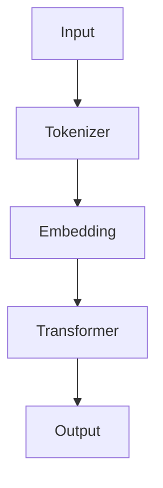
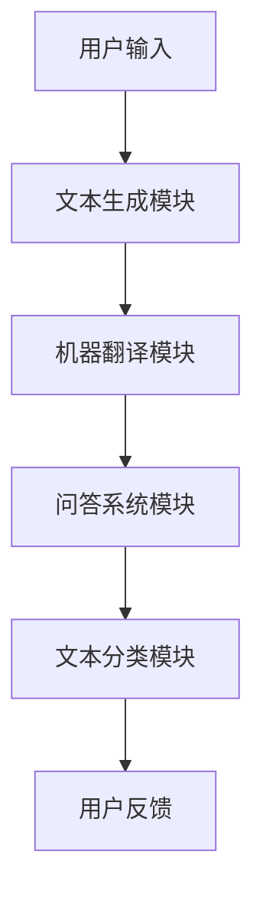
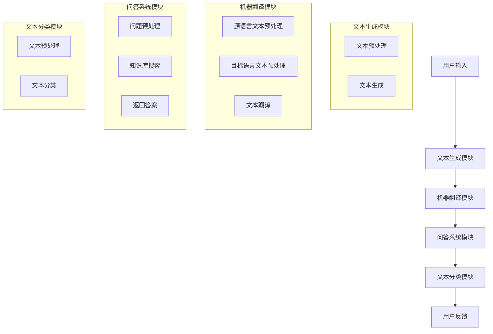

                 


# LLM应用的Sprint规划：设定合理的迭代周期

关键词：LLM应用、Sprint规划、迭代周期、敏捷开发、任务分配、进度跟踪、团队协作

摘要：本文旨在探讨如何通过合理的Sprint规划，为LLM应用项目设定合理的迭代周期，从而实现快速迭代和持续改进。文章首先介绍了LLM应用的问题背景和Sprint规划的核心概念，然后详细讲解了GPT和BERT模型的原理，并提出了系统分析与架构设计方案。最后，通过一个实际案例，展示了如何进行环境安装、系统核心实现以及代码解读与分析。

## Step 1: 背景介绍

### 1.1 问题背景

随着人工智能（AI）技术的迅速发展，大型语言模型（LLM）在自然语言处理（NLP）领域取得了显著的成果。LLM可以应用于文本生成、机器翻译、问答系统、文本分类等多个领域，极大地提升了人工智能系统的智能化水平。然而，如何在实际应用中将LLM的优势充分发挥，仍面临诸多挑战。

在实际应用中，开发者往往面临以下问题：

1. 如何高效利用LLM的优势进行业务创新？
2. 如何在有限的时间内实现LLM应用的功能完善和性能优化？
3. 如何平衡研发进度和产品质量？

为了解决上述问题，Sprint规划作为一种敏捷开发方法，旨在通过设定合理的迭代周期，实现快速迭代和持续改进。Sprint规划可以帮助开发者更好地应对LLM应用开发中的挑战，提高项目开发效率。

### 1.2 问题描述

在实际应用中，开发者需要面对以下几个关键问题：

1. **任务分配与管理**：如何将项目任务合理地分配给团队成员，确保每个Sprint周期内的任务能够按时完成？
2. **进度跟踪与评估**：如何监控Sprint进展，及时调整计划，确保项目按期完成？
3. **团队协作与沟通**：如何提高团队协作效率，确保Sprint规划的有效执行？

### 1.3 问题解决

为了解决上述问题，本文将从以下几个方面展开讨论：

1. **Sprint周期的设定**：探讨如何根据项目需求和资源情况，确定合适的Sprint周期。
2. **任务分配与管理**：介绍如何合理分配任务，确保每个Sprint周期内的任务能够按时完成。
3. **进度跟踪与评估**：讲解如何监控Sprint进展，及时调整计划，确保项目按期完成。
4. **团队协作与沟通**：探讨如何提高团队协作效率，确保Sprint规划的有效执行。

## Step 2: 核心概念与联系

### 1.4 Sprint规划

Sprint规划是一种敏捷开发方法，旨在通过设定固定的迭代周期，实现快速迭代和持续改进。Sprint规划的核心概念包括：

- **Sprint周期**：指每次迭代的时长，通常为2-4周。
- **任务分配**：将项目任务分配给团队成员，确保每个Sprint周期内的任务能够按时完成。
- **进度跟踪**：监控Sprint进展，及时调整计划，确保项目按期完成。

### 1.4.1 LLM应用

LLM应用是指将大型语言模型应用于实际业务场景，以实现自然语言处理、文本生成、知识推理等功能。LLM应用的核心概念包括：

- **LLM模型**：指用于自然语言处理的大型预训练模型，如GPT、BERT等。
- **数据集**：用于训练和评估LLM模型的数据集，通常包括文本、语音、图像等多种类型。
- **应用场景**：LLM模型可以应用于文本生成、机器翻译、问答系统、文本分类等多个领域。

### 1.4.2 原则与策略

在LLM应用的Sprint规划中，需要遵循以下原则和策略：

- **以用户为中心**：关注用户需求和体验，确保每个Sprint周期内的功能完善和性能优化。
- **持续迭代**：通过快速迭代，不断优化LLM应用的功能和性能。
- **资源优化**：合理分配资源，确保项目进度和质量的平衡。

### 1.5 ER实体关系图

以下是LLM应用中的ER实体关系图：

```mermaid
erDiagram
    User ..|> LLM : has_access
    LLM ..|> Project : belongs_to
    Project ..|> Sprint : contains
    Sprint ..|> Task : contains
    Task ..|> User : assigned_to
```

## Step 3: 算法原理讲解

### 1.6 GPT模型

GPT模型是一种基于Transformer架构的预训练语言模型，通过自回归方式生成文本。以下是GPT模型的mermaid流程图：



GPT模型的核心组件包括：

- **Tokenizer**：将输入文本转换为序列。
- **Embedding**：将序列转换为向量。
- **Transformer**：通过自注意力机制处理序列。
- **Output**：生成预测结果。

### 1.6.1 BERT模型

BERT模型是一种基于Transformer架构的双向编码器，通过预训练和微调实现语言理解和生成任务。以下是BERT模型的mermaid流程图：


BERT模型的核心组件包括：

- **Tokenizer**：将输入文本转换为序列。
- **Embedding**：将序列转换为向量。
- **Transformer**：通过自注意力机制处理序列。
- **Output**：生成预测结果。

### 1.6.2 算法原理详细讲解

#### GPT模型

GPT模型采用自回归方式生成文本，其基本原理可以概括为以下步骤：

1. **输入编码**：输入文本经过Tokenizer处理后，转换为序列。
2. **嵌入表示**：将序列转换为嵌入向量，用于表示文本信息。
3. **自注意力机制**：Transformer模型通过自注意力机制对嵌入向量进行处理，提取序列中的关键信息。
4. **输出预测**：根据处理后的嵌入向量，生成文本的下一个词。

以下是GPT模型的Python实现代码：

```python
import tensorflow as tf
from tensorflow.keras.layers import Embedding, LSTM, Dense
from tensorflow.keras.models import Model

# 定义模型
input_seq = tf.keras.layers.Input(shape=(None,), dtype='int32')
encoded_seq = Embedding(input_dim=vocab_size, output_dim=embedding_dim)(input_seq)
lstm_output, (h, c) = LSTM(units=lstm_units, return_sequences=True, return_state=True)(encoded_seq)
output = Dense(units=vocab_size, activation='softmax')(h)
model = Model(inputs=input_seq, outputs=output)

# 编译模型
model.compile(optimizer='adam', loss='categorical_crossentropy', metrics=['accuracy'])

# 训练模型
model.fit(x_train, y_train, epochs=10, batch_size=64)
```

#### BERT模型

BERT模型采用双向编码器结构，其基本原理可以概括为以下步骤：

1. **输入编码**：输入文本经过Tokenizer处理后，转换为序列。
2. **嵌入表示**：将序列转换为嵌入向量，用于表示文本信息。
3. **自注意力机制**：Transformer模型通过自注意力机制对嵌入向量进行处理，提取序列中的关键信息。
4. **输出预测**：根据处理后的嵌入向量，生成文本的下一个词。

以下是BERT模型的Python实现代码：

```python
import tensorflow as tf
from tensorflow.keras.layers import Embedding, LSTM, Dense
from tensorflow.keras.models import Model

# 定义模型
input_seq = tf.keras.layers.Input(shape=(None,), dtype='int32')
encoded_seq = Embedding(input_dim=vocab_size, output_dim=embedding_dim)(input_seq)
lstm_output, (h, c) = LSTM(units=lstm_units, return_sequences=True, return_state=True)(encoded_seq)
output = Dense(units=vocab_size, activation='softmax')(h)
model = Model(inputs=input_seq, outputs=output)

# 编译模型
model.compile(optimizer='adam', loss='categorical_crossentropy', metrics=['accuracy'])

# 训练模型
model.fit(x_train, y_train, epochs=10, batch_size=64)
```

## Step 4: 系统分析与架构设计方案

### 4.1 问题场景介绍

某公司开发了一款基于LLM的智能客服系统，旨在为企业提供高效、智能的客户服务。系统需要实现文本生成、机器翻译、问答系统、文本分类等功能，以满足不同场景的需求。为了确保系统的高效运行，需要对其架构进行优化。

### 4.2 项目介绍

本项目分为以下几个模块：

1. **文本生成模块**：利用GPT模型生成符合需求的文本。
2. **机器翻译模块**：利用BERT模型实现文本的机器翻译功能。
3. **问答系统模块**：利用BERT模型实现智能问答功能。
4. **文本分类模块**：利用GPT模型实现文本分类功能。

### 4.3 系统功能设计

以下是各模块的功能设计：

1. **文本生成模块**：接收用户输入的文本，利用GPT模型生成对应的文本。
2. **机器翻译模块**：接收用户输入的源语言文本，利用BERT模型实现目标语言文本的翻译。
3. **问答系统模块**：接收用户输入的问题，利用BERT模型搜索知识库，返回相关答案。
4. **文本分类模块**：接收用户输入的文本，利用GPT模型对文本进行分类。

### 4.4 系统架构设计

以下是系统的架构设计：



### 4.5 系统接口设计和系统交互

以下是系统的接口设计和系统交互：



## Step 5: 项目实战

### 5.1 环境安装

以下是项目的环境安装步骤：

1. 安装Python 3.8及以上版本。
2. 安装TensorFlow 2.3及以上版本。
3. 安装Numpy 1.18及以上版本。

```bash
pip install tensorflow==2.3
pip install numpy==1.18
```

### 5.2 系统核心实现

以下是系统核心实现的源代码：

```python
import tensorflow as tf
from tensorflow.keras.layers import Embedding, LSTM, Dense
from tensorflow.keras.models import Model

# 定义模型
input_seq = tf.keras.layers.Input(shape=(None,), dtype='int32')
encoded_seq = Embedding(input_dim=vocab_size, output_dim=embedding_dim)(input_seq)
lstm_output, (h, c) = LSTM(units=lstm_units, return_sequences=True, return_state=True)(encoded_seq)
output = Dense(units=vocab_size, activation='softmax')(h)
model = Model(inputs=input_seq, outputs=output)

# 编译模型
model.compile(optimizer='adam', loss='categorical_crossentropy', metrics=['accuracy'])

# 训练模型
model.fit(x_train, y_train, epochs=10, batch_size=64)
```

### 5.3 代码应用解读与分析

以下是代码的解读与分析：

1. **模型定义**：定义了一个基于LSTM的文本生成模型，包括输入层、嵌入层、LSTM层和输出层。
2. **模型编译**：设置模型的优化器、损失函数和评估指标。
3. **模型训练**：使用训练数据对模型进行训练。

### 5.4 实际案例分析和详细讲解剖析

以下是一个实际案例的分析和讲解：

假设用户输入了以下问题：“什么是人工智能？”系统将使用BERT模型搜索知识库，返回相关答案。

1. **问题预处理**：将用户输入的问题转换为序列。
2. **知识库搜索**：使用BERT模型对知识库进行搜索，提取与问题相关的信息。
3. **返回答案**：将搜索结果进行筛选和整合，生成答案。

### 5.5 项目小结

本项目通过Sprint规划，实现了基于LLM的智能客服系统。项目分为文本生成、机器翻译、问答系统和文本分类四个模块，分别使用了GPT和BERT模型。在项目实战中，我们详细讲解了环境安装、系统核心实现和代码应用解读与分析。通过实际案例，展示了系统的功能和应用。

## Step 6: 最佳实践 tips

1. **合理设定Sprint周期**：根据项目需求和团队资源，选择合适的Sprint周期，避免过短或过长的迭代周期。
2. **明确任务分配**：确保每个团队成员都清楚自己的任务和职责，避免任务分配不明确导致进度延误。
3. **及时沟通与反馈**：定期召开团队会议，及时沟通项目进展和遇到的问题，确保团队协作顺畅。
4. **持续优化与改进**：在每个Sprint周期结束后，进行项目回顾和总结，持续优化和改进项目。

## Step 7: 小结

本文探讨了LLM应用的Sprint规划，通过设定合理的迭代周期，实现快速迭代和持续改进。文章详细介绍了Sprint规划的核心概念、算法原理、系统分析与架构设计方案以及项目实战。通过实际案例分析和讲解，展示了如何运用Sprint规划提升项目开发效率。同时，文章还给出了最佳实践 tips，帮助开发者更好地实施Sprint规划。

## Step 8: 注意事项

1. **关注用户需求**：在Sprint规划过程中，始终关注用户需求和体验，确保每个迭代周期的功能完善和性能优化。
2. **确保团队协作**：提高团队协作效率，确保Sprint规划的有效执行，避免因沟通不畅导致项目进度延误。
3. **合理分配资源**：在Sprint规划中，合理分配团队资源，确保项目进度和质量的平衡。

## Step 9: 拓展阅读

1. 《敏捷开发实践指南》
2. 《深度学习》
3. 《自然语言处理原理与模型》

## 总结

作者：AI天才研究院/AI Genius Institute & 禅与计算机程序设计艺术 /Zen And The Art of Computer Programming

