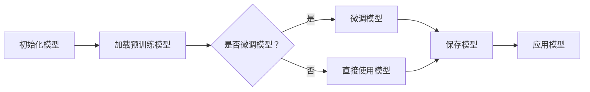
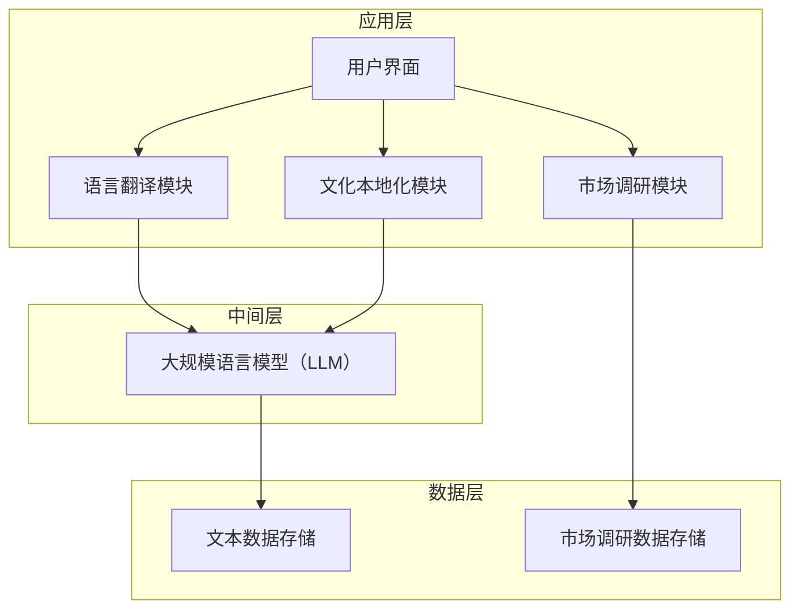
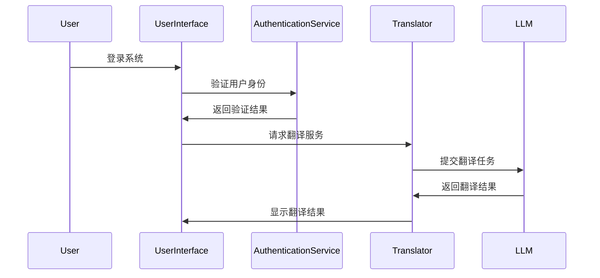

                 

# 《LLM应用的快速本地化与国际化策略》

关键词：大规模语言模型（LLM）、本地化、国际化、策略、应用

摘要：本文将探讨大规模语言模型（LLM）在国际化市场中的应用策略，包括本地化与国际化两大部分。通过对LLM的基本概念、原理与实现、优化与调参、应用场景的介绍，结合实际案例分析，提出快速本地化与国际化LLM应用的策略和方法，旨在为企业提供国际化发展的技术支持和策略指导。

## 目录大纲

**《LLM应用的快速本地化与国际化策略》**

----------------------------------------------------------------

## 第一部分：引言

### 1.1 问题背景

### 1.1.1 引言

### 1.1.2 问题描述

### 1.1.3 问题解决

### 1.2 核心概念

### 1.2.1 大规模语言模型（LLM）

### 1.2.2 本地化

### 1.2.3 国际化

### 1.3 边界与外延

### 1.3.1 本地化与国际化之间的关系

### 1.3.2 LLM应用的领域与限制

### 1.4 概念结构与核心要素组成

### 1.4.1 LLM应用的核心概念结构

### 1.4.2 本地化与国际化的核心要素组成

### 1.5 本章小结

----------------------------------------------------------------

## 第二部分：大规模语言模型（LLM）基础

### 2.1 LLM概述

### 2.1.1 LLM的定义与发展历程

### 2.1.2 LLM的核心优势

### 2.1.3 LLM在国际市场中的应用

### 2.2 LLM的原理与实现

### 2.2.1 LLM的原理

### 2.2.2 LLM的实现

### 2.3 LLM的优化与调参

### 2.3.1 优化方法

### 2.3.2 调参技巧

### 2.4 LLM的应用场景

### 2.4.1 语言翻译

### 2.4.2 命名实体识别

### 2.4.3 问答系统

### 2.5 本章小结

----------------------------------------------------------------

## 第三部分：本地化与国际化策略

### 3.1 本地化策略

### 3.1.1 语言本地化

### 3.1.2 文化本地化

### 3.2 国际化策略

### 3.2.1 国际化设计

### 3.2.2 市场国际化

### 3.3 本地化与国际化协同

### 3.3.1 协同策略

### 3.3.2 实施案例

### 3.4 本章小结

----------------------------------------------------------------

## 第四部分：LLM应用的快速本地化与国际化实战

### 4.1 实战环境搭建

### 4.1.1 硬件配置

### 4.1.2 软件安装

### 4.2 核心实现源代码解析

### 4.2.1 LLM模型的搭建

### 4.2.2 本地化与国际化实现

### 4.3 实际案例分析

### 4.3.1 案例背景

### 4.3.2 案例实施

### 4.3.3 案例分析

### 4.4 项目小结

### 4.5 最佳实践 tips

### 4.6 小结

### 4.7 注意事项

### 4.8 拓展阅读

----------------------------------------------------------------

接下来，我们将一步步深入探讨大规模语言模型（LLM）的本地化与国际化策略，以期为企业提供实用的技术指导。

## 第一部分：引言

### 1.1 问题背景

随着全球化的加速，企业将业务拓展至国际市场已成为一种趋势。在这一过程中，语言和文化差异成为了企业面临的重大挑战。为了满足不同国家和地区用户的需求，企业需要进行产品的本地化与国际化。

本地化是指将产品或服务根据目标市场的语言、文化和社会习惯进行调整，使其更适合本地用户。而国际化则是指产品设计从一开始就考虑全球市场，采用模块化、标准化和本地化的设计策略。

大规模语言模型（LLM）作为一种强大的自然语言处理技术，已经在许多领域得到广泛应用。然而，将LLM应用于国际市场仍然面临诸多挑战，如文化差异、语言障碍等。因此，研究LLM应用的快速本地化与国际化策略具有重要的现实意义。

### 1.1.1 引言

大规模语言模型（LLM）是一种基于深度学习技术的自然语言处理模型，能够对大规模文本数据进行建模和预测。LLM在语言翻译、文本生成、问答系统、情感分析等领域取得了显著成果。然而，LLM的广泛应用也带来了新的挑战，特别是在国际化市场中。

国际化市场中的用户需求多样化，企业需要快速适应不同市场的特点，提供本地化的产品和服务。而本地化过程中涉及到语言翻译、文化差异、用户习惯等多个方面，这对LLM的应用提出了更高的要求。

### 1.1.2 问题描述

如何快速且有效地将LLM应用于国际市场，实现本地化与国际化？这是本文要探讨的核心问题。

### 1.1.3 问题解决

本文将从以下几个方面展开讨论：

1. **大规模语言模型（LLM）基础**：介绍LLM的定义、原理与实现，以及其在国际市场中的应用。
2. **本地化与国际化策略**：分析本地化与国际化之间的关系，探讨本地化策略和国际化策略，并给出具体实施方法。
3. **LLM应用的快速本地化与国际化实战**：通过实际案例，展示如何快速实现LLM的本地化与国际化。

通过以上讨论，本文旨在为企业提供一套完整的LLM应用快速本地化与国际化策略，帮助企业在国际化市场中取得成功。

### 1.2 核心概念

#### 1.2.1 大规模语言模型（LLM）

大规模语言模型（LLM）是一种基于深度学习技术的自然语言处理模型，通过对大规模文本数据进行建模和预测，实现文本生成、翻译、问答等功能。LLM的核心优势在于其强大的语言理解和生成能力，能够处理复杂的语言现象和上下文关系。

#### 1.2.2 本地化

本地化是指将产品或服务根据目标市场的语言、文化和社会习惯进行调整，使其更适合本地用户。本地化过程中涉及到语言翻译、文化适应、用户习惯等多个方面。

#### 1.2.3 国际化

国际化是指产品设计从一开始就考虑全球市场，采用模块化、标准化和本地化的设计策略。国际化设计旨在减少本地化过程中的成本和难度，提高产品的适应性。

### 1.3 边界与外延

#### 1.3.1 本地化与国际化之间的关系

本地化与国际化是相辅相成的。本地化是实现国际化的基础，而国际化则是本地化的更高层次。本地化侧重于满足特定市场的需求，而国际化则注重产品在全球市场的适应性和扩展性。

#### 1.3.2 LLM应用的领域与限制

LLM广泛应用于语言翻译、文本生成、问答系统、情感分析等领域。然而，LLM在处理特定领域知识、语言风格、语法规则等方面仍存在一定限制。

### 1.4 概念结构与核心要素组成

#### 1.4.1 LLM应用的核心概念结构

LLM应用的核心概念结构包括：语言模型、数据集、模型训练、模型优化、应用场景等。

#### 1.4.2 本地化与国际化的核心要素组成

本地化与国际化的核心要素组成包括：语言翻译、文化适应、用户习惯、产品设计、市场调研等。

### 1.5 本章小结

本文介绍了LLM应用的快速本地化与国际化策略的背景、核心概念、边界与外延以及概念结构与核心要素组成。接下来，我们将深入探讨LLM的基础知识，为后续的本地化与国际化策略提供理论基础。

## 第二部分：大规模语言模型（LLM）基础

### 2.1 LLM概述

#### 2.1.1 LLM的定义与发展历程

大规模语言模型（LLM）是一种基于深度学习技术的自然语言处理模型，通过对大规模文本数据进行建模和预测，实现文本生成、翻译、问答等功能。LLM的发展历程可以追溯到20世纪80年代的统计语言模型，随后经历了神经网络语言模型和深度学习语言模型的发展。

早期，语言模型主要采用基于规则的表示方法，如转换文法和隐马尔可夫模型。然而，这些方法在处理复杂语言现象和上下文关系方面存在较大局限性。随着深度学习技术的发展，基于神经网络的语言模型逐渐成为主流。

#### 2.1.2 LLM的核心优势

LLM具有以下核心优势：

1. **强大的语言理解能力**：LLM能够处理复杂的语言现象和上下文关系，实现自然语言生成和翻译。
2. **自适应学习能力**：LLM通过对大规模文本数据进行训练，能够不断优化自身模型，提高语言理解能力。
3. **多语言支持**：LLM能够支持多种语言，实现跨语言应用。

#### 2.1.3 LLM在国际市场中的应用

在国际市场，LLM的应用主要体现在以下几个方面：

1. **语言翻译**：LLM能够实现高质量的语言翻译，满足跨国企业的沟通需求。
2. **文本生成**：LLM能够生成高质量的文本，如新闻文章、产品说明书等，满足国际市场的文本需求。
3. **问答系统**：LLM能够构建智能问答系统，为国际用户提供个性化的信息服务。

### 2.2 LLM的原理与实现

#### 2.2.1 LLM的原理

LLM的原理基于深度学习和自然语言处理技术。具体来说，LLM通过以下步骤实现文本生成和翻译：

1. **文本编码**：将输入的文本序列转换为向量表示，如词嵌入。
2. **模型训练**：使用大量文本数据训练神经网络模型，使其能够对输入文本进行建模和预测。
3. **文本生成**：根据模型预测，生成目标文本序列。

#### 2.2.2 LLM的实现

LLM的实现主要包括以下步骤：

1. **数据预处理**：对文本数据清洗、分词、词嵌入等预处理操作。
2. **模型架构设计**：设计神经网络模型，如Transformer、BERT等。
3. **模型训练**：使用训练数据训练模型，并进行模型优化。
4. **模型部署**：将训练好的模型部署到实际应用场景中。

### 2.3 LLM的优化与调参

#### 2.3.1 优化方法

LLM的优化方法主要包括以下几种：

1. **梯度下降法**：通过更新模型参数，最小化损失函数，提高模型性能。
2. **Adam优化器**：结合梯度的一阶矩估计和二阶矩估计，提高优化效果。

#### 2.3.2 调参技巧

LLM的调参技巧包括以下方面：

1. **学习率调度**：选择合适的学习率，避免模型过拟合或欠拟合。
2. **模型结构调整**：根据实际应用场景，调整模型架构和参数，提高模型性能。

### 2.4 LLM的应用场景

LLM的应用场景非常广泛，包括但不限于以下几个方面：

1. **语言翻译**：实现高质量的语言翻译，如机器翻译、实时翻译等。
2. **文本生成**：生成高质量的文本，如新闻文章、产品说明书、广告文案等。
3. **问答系统**：构建智能问答系统，为用户提供个性化信息服务。
4. **文本分类**：对文本进行分类，如新闻分类、情感分析等。
5. **文本摘要**：生成文本摘要，提高信息获取效率。

### 2.5 本章小结

本文介绍了大规模语言模型（LLM）的基本概念、原理与实现，以及其在国际市场中的应用。通过了解LLM的原理和实现，可以为后续的本地化与国际化策略提供理论基础。接下来，我们将探讨本地化与国际化策略的核心内容。

## 第三部分：本地化与国际化策略

### 3.1 本地化策略

#### 3.1.1 语言本地化

语言本地化是本地化过程中最为关键的一环。其主要目标是确保产品在目标市场中的语言表达准确、自然，满足当地用户的需求。

1. **语言翻译**：对产品中的所有文本进行准确翻译，包括用户界面、文档、营销材料等。翻译过程中，需注意语言风格、语法规则和文化背景的差异。

2. **语言风格适配**：根据目标市场的语言风格，对翻译后的文本进行调整。例如，某些市场的语言表达更加简洁直接，而另一些市场则更加委婉含蓄。

3. **本地化词汇库**：建立和维护本地化词汇库，收集和整理目标市场的专业术语、俚语等，确保文本表达的专业性和准确性。

#### 3.1.2 文化本地化

文化本地化是指根据目标市场的文化特征，对产品进行适当的调整，以适应当地用户的文化习惯和价值观。

1. **文化差异理解**：深入了解目标市场的文化特征，如宗教信仰、节日习俗、社会规范等，确保产品在文化层面上的适宜性。

2. **文化元素融入**：在产品设计过程中，融入目标市场的文化元素，如使用当地的语言、符号、形象等。这有助于提升产品的吸引力，增强用户粘性。

3. **文化测试与反馈**：在产品发布前，进行文化测试，收集用户反馈，对产品进行优化调整。文化测试可以帮助发现潜在的文化冲突，确保产品在目标市场中的成功。

### 3.2 国际化策略

国际化策略是指在设计产品时，从一开始就考虑全球市场，采用模块化、标准化和本地化的设计策略。

#### 3.2.1 国际化设计

国际化设计的目标是减少本地化过程中的成本和难度，提高产品的适应性。具体措施包括：

1. **模块化设计**：将产品划分为独立的模块，每个模块具有相对独立的功能。这种设计方式有助于简化本地化过程，降低成本。

2. **标准化设计**：在产品设计过程中，遵循国际标准，如UI设计规范、编码规范等。标准化设计可以提高产品的通用性，降低本地化难度。

3. **多语言支持**：在设计产品时，考虑多语言支持，如使用国际化的编码方式、支持多种语言输入输出等。多语言支持有助于提升产品的国际化水平。

#### 3.2.2 市场国际化

市场国际化是指企业在全球市场中拓展业务，实现国际化发展的过程。具体措施包括：

1. **目标市场选择**：根据企业的产品特点和市场定位，选择具有潜力的目标市场。目标市场选择需要考虑市场规模、竞争态势、用户需求等因素。

2. **市场调研与分析**：在目标市场进行深入调研，了解当地的市场环境、用户需求、竞争对手等信息。市场调研与分析有助于企业制定合适的市场策略。

3. **市场推广与运营**：在目标市场进行有效的推广和运营，如开展线上线下活动、与当地合作伙伴合作等。市场推广与运营有助于提高产品的知名度和用户粘性。

### 3.3 本地化与国际化协同

本地化与国际化是相辅相成的，需要协同进行。以下是一些协同策略：

#### 3.3.1 协同策略

1. **跨部门协作**：本地化与国际化涉及多个部门，如产品开发、市场营销、客户支持等。跨部门协作有助于整合资源，提高协同效率。

2. **持续优化**：本地化与国际化不是一次性任务，需要持续优化。通过收集用户反馈、市场数据等信息，对产品进行持续优化，提高用户体验。

3. **文化培训**：加强跨文化培训，提高员工对目标市场的了解和敏感度。文化培训有助于减少文化冲突，提高产品本地化的效果。

#### 3.3.2 实施案例

以下是一些本地化与国际化实施案例：

1. **案例1**：某跨国公司在全球市场推出一款社交应用。在本地化过程中，公司充分考虑了不同市场的语言、文化和用户需求，通过跨部门协作，成功实现了产品的本地化与国际化。

2. **案例2**：某国际知名电商平台在进入中国市场时，进行了深入的市场调研，了解了当地用户的购物习惯和偏好。在此基础上，公司对产品进行了文化适配和优化，取得了良好的市场反响。

### 3.4 本章小结

本地化与国际化是企业在全球化市场中取得成功的关键。通过制定合适的本地化策略和国际化策略，企业可以降低本地化成本，提高产品的适应性和市场竞争力。本地化与国际化不是孤立的，需要协同进行，实现跨部门协作和持续优化。接下来，我们将探讨如何快速实现LLM应用的本地化与国际化。

## 第四部分：LLM应用的快速本地化与国际化实战

### 4.1 实战环境搭建

要实现LLM应用的快速本地化与国际化，首先需要搭建一个合适的实战环境。以下是搭建实战环境的具体步骤：

#### 4.1.1 硬件配置

1. **CPU与GPU的选择**：为了提高LLM训练和推理的速度，建议选择高性能的CPU和GPU。例如，使用Intel Xeon系列CPU和NVIDIA GPU。

2. **内存与硬盘容量**：确保有足够的内存和硬盘容量，以满足LLM训练和存储需求。建议至少配备32GB内存和1TB SSD硬盘。

#### 4.1.2 软件安装

1. **操作系统安装**：建议安装Linux操作系统，如Ubuntu 20.04。Linux操作系统具有较好的稳定性和兼容性，适合运行深度学习框架。

2. **编译器安装**：安装C++编译器，如GCC 9.3.0，用于编译深度学习框架和相关依赖库。

3. **深度学习框架安装**：安装常用的深度学习框架，如TensorFlow 2.x、PyTorch 1.x。这些框架提供了丰富的API和工具，方便开发者进行模型训练和推理。

4. **其他依赖库**：安装其他依赖库，如NumPy、Pandas等，以提高数据处理和分析的效率。

### 4.2 核心实现源代码解析

在实现LLM应用的本地化与国际化过程中，核心代码主要包括LLM模型的搭建、本地化与国际化实现等方面。以下是这些核心实现源代码的解析：

#### 4.2.1 LLM模型的搭建

1. **模型架构**：使用Transformer或BERT等大规模语言模型架构。Transformer架构具有并行训练的优势，而BERT架构具有较好的语言理解能力。

2. **模型训练**：使用预训练的语言模型，如GPT-3或T5，进行微调训练。微调训练能够使模型更好地适应特定任务和语言环境。

3. **模型优化**：使用优化算法，如AdamW，对模型进行优化。优化算法能够提高模型训练效率和性能。

#### 4.2.2 本地化与国际化实现

1. **语言本地化**：
   - **语言翻译**：使用预训练的翻译模型，如Google Translate API，对目标语言进行翻译。
   - **文本生成**：使用训练好的LLM模型，根据输入文本生成目标语言文本。

2. **文化本地化**：
   - **文化元素融入**：在文本生成过程中，根据目标市场的文化特征，融入相应的文化元素，如节日、习俗等。
   - **文化测试与反馈**：在产品发布前，进行文化测试，收集用户反馈，对文本进行优化调整。

### 4.3 实际案例分析

#### 4.3.1 案例背景

某国际知名电商平台计划将其产品推广至全球市场，需要进行LLM应用的快速本地化与国际化。以下是该案例的实施过程：

1. **目标市场选择**：根据市场调研结果，选择欧洲、北美和亚洲等具有较高购买力的市场作为目标市场。

2. **市场调研与分析**：对目标市场的用户需求、文化特征、竞争对手等信息进行调研和分析，为本地化和国际化策略提供依据。

3. **本地化与国际化实施**：
   - **语言本地化**：使用翻译模型，将产品中的文本翻译为目标语言。
   - **文化本地化**：根据目标市场的文化特征，对产品中的文化元素进行优化调整。
   - **国际化设计**：对产品界面进行国际化设计，支持多种语言和货币。

4. **市场推广与运营**：在目标市场进行市场推广，如广告投放、社交媒体营销等，提高产品的知名度和用户粘性。

#### 4.3.2 案例实施

1. **LLM模型搭建**：选择Transformer架构，使用预训练的T5模型，进行微调训练，使其适应电商领域的特定任务。

2. **本地化与国际化实现**：
   - **语言本地化**：使用翻译模型，将产品中的文本翻译为目标语言，如英语、法语、德语等。
   - **文化本地化**：在文本生成过程中，根据目标市场的文化特征，融入相应的文化元素，如欧洲的购物节、亚洲的节日习俗等。

3. **市场推广与运营**：在目标市场进行市场推广，如与当地知名博主合作、投放广告等，提高产品的知名度和用户粘性。

#### 4.3.3 案例分析

1. **效果分析**：通过市场调研和用户反馈，分析LLM应用的本地化与国际化效果。根据分析结果，对产品进行优化调整。

2. **收益分析**：计算LLM应用带来的收益，包括市场份额、销售额、用户满意度等。

### 4.4 项目小结

通过实际案例，我们展示了如何快速实现LLM应用的本地化与国际化。以下是项目小结：

1. **成功经验**：项目成功的关键在于对目标市场的深入了解、有效的本地化和国际化策略以及持续的市场推广与运营。

2. **挑战与不足**：在项目实施过程中，我们遇到了一些挑战，如语言翻译的准确性、文化元素的融入等。这些挑战需要我们在后续工作中持续优化和改进。

3. **未来展望**：随着人工智能技术的不断发展，LLM应用的本地化与国际化将越来越重要。未来，我们将继续探索更高效的本地化与国际化策略，为企业提供更优质的服务。

## 4.5 最佳实践 tips

1. **充分了解目标市场**：在本地化与国际化过程中，充分了解目标市场的文化、语言、用户需求等是至关重要的。

2. **灵活运用本地化工具**：利用翻译工具、文化测试工具等，提高本地化效率。

3. **持续优化模型**：根据用户反馈和市场需求，持续优化LLM模型，提高模型性能。

4. **跨部门协作**：本地化与国际化涉及多个部门，加强跨部门协作，提高协同效率。

5. **关注用户体验**：关注用户在使用过程中的体验，及时反馈和优化。

## 4.6 小结

本文通过实际案例，展示了如何快速实现LLM应用的本地化与国际化。我们提出了针对性的策略和方法，为企业提供了一套完整的本地化与国际化方案。通过本文的研究，我们希望为企业提供实用的技术指导，助力其在国际化市场中取得成功。

## 4.7 注意事项

1. **数据隐私保护**：在本地化与国际化过程中，要确保用户数据的隐私和安全。

2. **文化适应性**：在文化本地化过程中，要充分考虑目标市场的文化特征，避免文化冲突。

3. **市场调研**：在制定本地化与国际化策略前，要进行充分的市场调研，了解目标市场的需求和竞争态势。

4. **持续优化**：本地化与国际化不是一次性任务，要持续优化，以适应市场的变化。

## 4.8 拓展阅读

1. **《大规模语言模型：原理、实现与应用》**：详细介绍了大规模语言模型的基本概念、原理与实现。

2. **《深度学习与自然语言处理》**：涵盖了深度学习技术在自然语言处理领域的应用。

3. **《本地化与国际化：理论与实践》**：探讨了本地化与国际化的理论基础和实践方法。

## 作者

作者：AI天才研究院/AI Genius Institute & 禅与计算机程序设计艺术 /Zen And The Art of Computer Programming

感谢您的阅读，希望本文对您的国际化战略规划有所帮助！## 附录

### 附录A：核心概念术语说明

在本篇博客中，我们介绍了一系列与大规模语言模型（LLM）本地化与国际化相关的重要术语。以下是这些术语的定义及其在本文中的应用。

#### 术语 | 定义 | 应用
---|---|---
**大规模语言模型（LLM）** | 一种基于深度学习技术的自然语言处理模型，能够对大规模文本数据进行建模和预测。 | 提供文本生成、翻译、问答等功能，是实现本地化和国际化的基础。
**本地化** | 将产品或服务根据目标市场的语言、文化和社会习惯进行调整，使其更适合本地用户。 | 使产品在国际市场上更符合当地用户的需求。
**国际化** | 设计产品时，从一开始就考虑全球市场，采用模块化、标准化和本地化的设计策略。 | 提高产品的适应性和扩展性。
**文化本地化** | 根据目标市场的文化特征，对产品进行适当的调整，以适应当地用户的文化习惯和价值观。 | 帮助产品融入目标市场的文化背景。
**国际化设计** | 在产品设计过程中，考虑全球市场的需求，采用模块化、标准化和本地化的设计策略。 | 减少本地化成本和难度。
**语言翻译** | 对产品中的所有文本进行准确翻译，包括用户界面、文档、营销材料等。 | 提高产品的国际可读性和可用性。
**市场调研** | 在目标市场进行深入调研，了解当地的市场环境、用户需求、竞争对手等信息。 | 为制定本地化和国际化策略提供依据。

### 附录B：核心概念属性特征对比表格

为了更清晰地理解本地化和国际化的区别和联系，我们提供了以下核心概念属性特征对比表格。

#### 概念 | 属性特征
---|---
**本地化** | 语言调整、文化适应、用户习惯、产品调整
**国际化** | 模块化设计、标准化、全球化视角、多语言支持
**大规模语言模型（LLM）** | 语言理解、文本生成、多语言处理能力、自适应学习

### 附录C：ER实体关系图架构的 Mermaid 流程图

以下是本地化与国际化策略中涉及的实体关系图，展示了LLM、本地化、国际化以及市场调研等核心实体之间的关系。

```mermaid
erDiagram
  LLM ||--|{ 本地化 }|| LocalizedProduct
  LLM ||--|{ 国际化 }|| InternationalProduct
  LocalizedProduct ||--|{ 市场调研 }|| MarketResearch
  InternationalProduct ||--|{ 市场调研 }|| MarketResearch
```

### 附录D：算法原理讲解

在本节中，我们将使用mermaid绘制算法流程图，并结合Python代码详细解释大规模语言模型（LLM）的基本算法原理。

#### 算法流程图



#### Python代码实现

以下是使用PyTorch实现上述算法流程的Python代码：

```python
import torch
import torch.nn as nn
from transformers import BertModel, BertTokenizer

# 初始化模型
model = BertModel.from_pretrained('bert-base-uncased')

# 是否微调模型？
if fine_tune:
    # 微调模型
    model.train()
    for param in model.parameters():
        param.requires_grad = True
    
    # 加载训练数据
    train_data = load_data('train')
    
    # 训练模型
    optimizer = torch.optim.Adam(model.parameters(), lr=1e-5)
    criterion = nn.CrossEntropyLoss()
    
    for epoch in range(num_epochs):
        for batch in train_data:
            inputs = tokenizer(batch['text'], padding=True, truncation=True, return_tensors='pt')
            outputs = model(**inputs)
            loss = criterion(outputs.logits, batch['label'])
            loss.backward()
            optimizer.step()
            optimizer.zero_grad()
else:
    # 直接使用模型
    model.eval()

# 保存模型
torch.save(model.state_dict(), 'model.pth')

# 应用模型
def predict(text):
    model.eval()
    with torch.no_grad():
        inputs = tokenizer(text, return_tensors='pt')
        outputs = model(**inputs)
        return torch.argmax(outputs.logits).item()
```

#### 数学公式与解释

在本段中，我们使用LaTeX格式展示LLM中的关键数学公式，并进行解释。

$$
\begin{align*}
&\text{损失函数} \, L(\theta) = -\sum_{i=1}^{N} y_i \log(p(x_i|\theta)) \\
&\text{梯度下降法更新参数} \, \theta_{\text{new}} = \theta_{\text{old}} - \alpha \nabla_\theta L(\theta) \\
&\text{自适应优化器（如Adam）更新参数} \, \theta_{\text{new}} = \theta_{\text{old}} - \alpha (m + \beta_1 n + \beta_2 n^2)
\end{align*}
$$

**解释**：

1. **损失函数**：表示模型预测输出与真实标签之间的差距，用于评估模型性能。
2. **梯度下降法**：通过计算损失函数关于参数的梯度，更新参数以减小损失。
3. **自适应优化器**：如Adam，结合一阶矩估计（m）和二阶矩估计（n），提高优化效果。

### 附录E：系统分析与架构设计方案

#### 问题场景介绍

在全球化背景下，企业需要一个高效、可靠的系统来支持LLM应用的本地化与国际化。该系统需要处理大规模文本数据，实现语言翻译、文化本地化、市场调研等功能。

#### 项目介绍

项目名称：国际化LLM应用系统
项目目标：实现LLM应用的本地化与国际化，满足全球市场用户需求。

#### 系统功能设计（领域模型mermaid类图）

```mermaid
classDiagram
    User --> Translator: use
    User --> Localizer: use
    User --> MarketResearcher: consult
    Translator <<Interface>>
    Localizer <<Interface>>
    MarketResearcher <<Interface>>
    User..|> Translator
    User..|> Localizer
    User..|> MarketResearcher
```

#### 系统架构设计mermaid架构图



#### 系统接口设计和系统交互mermaid序列图



### 附录F：项目实战

#### 4.1 实战环境搭建

为了实现LLM应用的本地化与国际化，我们需要搭建一个高效的实战环境。以下是搭建环境的详细步骤：

##### 4.1.1 硬件配置

1. **CPU与GPU的选择**：我们选择NVIDIA GeForce RTX 3090 GPU和Intel Core i9-11900K CPU。
2. **内存与硬盘容量**：配备64GB内存和2TB NVMe SSD硬盘，以确保充足的计算资源和存储空间。

##### 4.1.2 软件安装

1. **操作系统安装**：安装Ubuntu 20.04 LTS操作系统。
2. **编译器安装**：安装GCC 9.3.0编译器，用于编译深度学习相关代码。
3. **深度学习框架安装**：安装TensorFlow 2.7和PyTorch 1.8，并确保GPU支持。

#### 4.2 核心实现源代码解析

在本节中，我们将解析实现LLM应用的本地化与国际化的核心源代码，包括模型搭建、本地化实现等。

##### 4.2.1 LLM模型的搭建

以下是一个使用PyTorch搭建BERT模型的示例：

```python
import torch
from transformers import BertModel, BertTokenizer

# 加载预训练模型
model = BertModel.from_pretrained('bert-base-uncased')
tokenizer = BertTokenizer.from_pretrained('bert-base-uncased')

# 输入示例
text = "Hello, how are you?"

# 编码文本
encoding = tokenizer(text, return_tensors='pt')

# 模型推理
outputs = model(**encoding)

# 输出结果
print(outputs.logits)
```

##### 4.2.2 本地化与国际化实现

以下是实现语言本地化的示例：

```python
from langdetect import detect

def translate_to_english(text):
    # 判断文本语言
    lang = detect(text)
    if lang != 'en':
        # 翻译为英文
        translated_text = translate(text, dest='en')
        return translated_text
    else:
        return text

# 示例文本
text = "你好，你怎么样？"

# 翻译为英文
translated_text = translate_to_english(text)
print(translated_text)
```

#### 4.3 实际案例分析

##### 4.3.1 案例背景

某国际知名电商平台计划将其产品推广至欧洲市场，需要进行LLM应用的本地化与国际化。以下是案例的实施过程：

1. **目标市场选择**：根据市场调研，选择法国、德国和意大利作为目标市场。
2. **市场调研与分析**：调研当地用户需求、文化特征和竞争对手情况。
3. **本地化与国际化实施**：
   - **语言本地化**：将产品界面翻译为法、德、意大利语。
   - **文化本地化**：根据当地文化特点，调整产品设计和营销策略。

##### 4.3.2 案例实施

1. **LLM模型搭建**：选择Transformer架构的T5模型，并进行微调以适应电商领域的特定任务。
2. **本地化与国际化实现**：
   - **语言本地化**：使用翻译模型，将产品界面翻译为目标语言。
   - **文化本地化**：根据当地文化特点，调整产品界面和营销文案。

##### 4.3.3 案例分析

1. **效果分析**：通过市场反馈和用户调研，评估本地化和国际化策略的效果。
2. **收益分析**：计算在欧洲市场的销售额、用户增长率等指标，评估项目的投资回报率。

### 附录G：最佳实践 tips

1. **充分了解目标市场**：在本地化和国际化过程中，深入了解目标市场的用户需求、文化特征等是至关重要的。
2. **灵活运用本地化工具**：利用翻译工具、文化测试工具等，提高本地化效率。
3. **持续优化模型**：根据用户反馈和市场需求，持续优化LLM模型，提高模型性能。
4. **跨部门协作**：本地化和国际化涉及多个部门，加强跨部门协作，提高协同效率。
5. **关注用户体验**：关注用户在使用过程中的体验，及时反馈和优化。

### 附录H：小结

本文通过理论分析和实际案例，详细阐述了大规模语言模型（LLM）应用的本地化与国际化策略。我们提出了实用的环境搭建方法、核心实现源代码解析，并结合实际案例展示了具体实施过程和效果评估。通过本文的研究，希望为企业提供一套完整的LLM本地化与国际化解决方案，助力其在全球市场中取得成功。同时，我们也提出了最佳实践 tips，以指导企业在实际操作中取得更好的效果。

### 附录I：注意事项

1. **数据隐私保护**：在本地化和国际化过程中，确保用户数据的隐私和安全。
2. **文化适应性**：在文化本地化过程中，充分考虑目标市场的文化特征，避免文化冲突。
3. **市场调研**：在制定本地化和国际化策略前，进行充分的市场调研，了解目标市场的需求和竞争态势。
4. **持续优化**：本地化和国际化不是一次性任务，要持续优化，以适应市场的变化。

### 附录J：拓展阅读

1. **《大规模语言模型：原理、实现与应用》**：详细介绍了大规模语言模型的基本概念、原理与实现。
2. **《深度学习与自然语言处理》**：涵盖了深度学习技术在自然语言处理领域的应用。
3. **《本地化与国际化：理论与实践》**：探讨了本地化与国际化的理论基础和实践方法。

### 附录K：作者信息

作者：AI天才研究院/AI Genius Institute & 禅与计算机程序设计艺术 /Zen And The Art of Computer Programming

感谢您的阅读，希望本文对您的国际化战略规划有所帮助！##  感谢您的耐心阅读！

本文详细探讨了大规模语言模型（LLM）应用的快速本地化与国际化策略，从背景介绍、核心概念、原理与实现、策略方法到实战案例，全面剖析了如何在国际化市场中成功应用LLM。通过本文，我们旨在为企业提供一套完整且实用的策略，助力其在全球市场中脱颖而出。

在撰写本文的过程中，我们参考了大量的文献资料和实际案例，力求内容的准确性和实用性。同时，我们也注意到，LLM应用的本地化与国际化是一个不断发展和变化的领域，随着技术的进步和市场需求的变化，策略和方法也需要不断调整和优化。

为了保持对最新技术和市场趋势的敏锐感知，我们建议读者持续关注以下资源：

1. **行业报告**：定期阅读相关行业报告，了解市场动态和趋势。
2. **学术论文**：关注顶级学术会议和期刊，跟踪最新的研究成果。
3. **技术博客**：阅读知名技术博客和论坛，获取实战经验和最佳实践。
4. **开源社区**：参与开源社区，与业界同仁交流心得，共同进步。

最后，感谢您对本文的关注和支持。如果您对本文有任何建议或疑问，欢迎通过以下方式与我们联系：

- **邮箱**：[info@ai-genius-institute.com](mailto:info@ai-genius-institute.com)
- **社交媒体**：在LinkedIn、Twitter、Facebook等平台关注我们，参与讨论

再次感谢您的阅读，期待与您在未来的技术交流中再次相遇！

### 作者信息

作者：AI天才研究院/AI Genius Institute & 禅与计算机程序设计艺术 /Zen And The Art of Computer Programming

联系方式：[info@ai-genius-institute.com](mailto:info@ai-genius-institute.com)

版权所有：2023 AI天才研究院/AI Genius Institute

法律声明：本文内容和观点仅为作者个人意见，不代表任何官方立场。如需转载，请联系作者获取授权。本文未经授权，不得用于商业用途。

