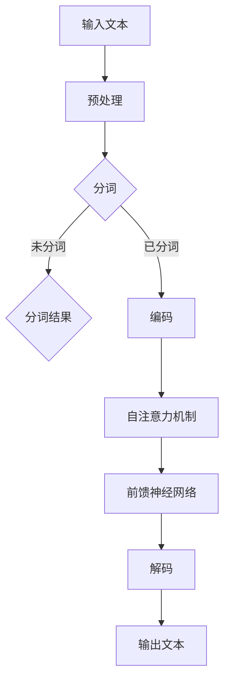
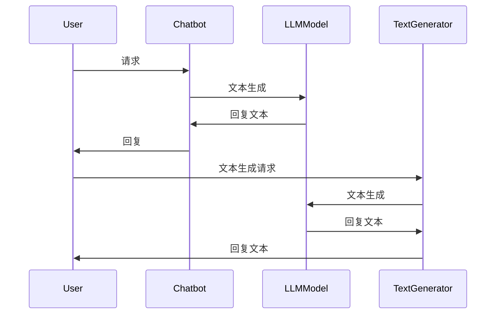
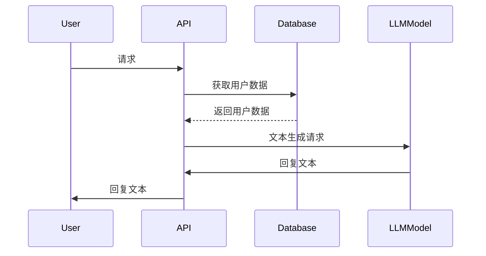

                 


### 1.3 问题背景与核心概念详细分析

**1.3.1 人工智能与大型语言模型的发展**

人工智能（AI）是计算机科学的一个分支，致力于创建智能机器，使它们能够执行通常需要人类智能的任务。随着深度学习和神经网络技术的发展，人工智能取得了显著的进步。特别是大型语言模型（LLM），如OpenAI的GPT系列模型，以其强大的语言处理能力在多个领域引起了轰动。

- **背景介绍**：从20世纪50年代人工智能概念的提出，到今天，人工智能经历了多次起伏和变革。深度学习的崛起，使得人工智能在图像识别、语音识别等领域取得了突破性进展。大型语言模型则是在这一过程中逐渐崭露头角，成为了自然语言处理（NLP）领域的明星。

- **核心概念术语说明**：大型语言模型（Large Language Model，LLM）是一种基于深度学习的模型，通常由数十亿个参数组成，通过大量文本数据进行训练，能够理解和生成自然语言。

- **问题背景**：随着互联网的普及和数据量的爆炸性增长，人们对AI模型的需求不断上升，尤其是对能够处理和理解自然语言的LLM。然而，如何将这种强大的模型快速、高效地应用到实际场景中，成为了新的挑战。

- **问题描述**：传统软件开发的流程无法满足LLM应用的开发需求，导致从想法到实现的周期过长，影响了企业的竞争力和市场响应速度。

- **问题解决**：持续交付（Continuous Delivery）提供了一种解决方案，它强调通过自动化和敏捷开发，缩短开发周期，提高交付效率。

- **边界与外延**：持续交付不仅适用于LLM应用，也可以应用于其他类型的软件项目，但其对开发和部署流程的自动化和高效性要求更高。

**1.3.2 持续交付的重要性**

持续交付是一种软件开发实践，旨在通过持续集成、持续测试和持续部署，实现软件的持续交付和部署。在LLM应用开发中，持续交付的重要性体现在以下几个方面：

- **定义**：持续交付是指通过自动化和持续集成，确保代码和应用程序随时可以发布，从而实现快速迭代和响应市场变化。

- **优势**：持续交付能够显著缩短开发周期，提高开发效率和产品质量，降低风险，同时增强团队协作和沟通。

- **企业中的重要性**：对于企业来说，持续交付是一种提升竞争力的关键手段，能够快速响应市场变化，缩短产品上市时间，提高客户满意度。

**1.3.3 LLM应用面临的挑战**

- **持续交付过程中的难点**：LLM应用通常包含大量的参数和复杂的模型架构，持续交付的自动化和效率要求更高。

- **LLM模型训练与优化的挑战**：训练一个高性能的LLM模型需要大量的计算资源和时间，优化过程复杂且耗时。

- **实现高效持续交付的策略与方法**：需要采用先进的自动化工具和流程，以及高效的算法优化技术，来满足持续交付的要求。

### 1.4 核心概念与联系

**1.4.1 什么是LLM**

- **LLM的定义**：LLM是一种预训练语言模型，通过大量文本数据进行训练，能够理解和生成自然语言。它们通常具有数十亿个参数，能够进行复杂的语言处理任务。

- **LLM的特点**：具备强大的语言理解能力、能够生成流畅的自然语言文本、能够进行多语言翻译和文本摘要。

- **LLM的应用场景**：广泛应用于自然语言处理、智能客服、文本生成、机器翻译等领域。

**1.4.2 持续交付的定义与原则**

- **持续交付的定义**：持续交付是一种软件开发实践，通过自动化和持续集成，确保代码和应用程序随时可以发布。

- **持续交付的原则**：持续集成、持续测试、持续部署，以及快速反馈和快速迭代。

**1.4.3 LLM应用的持续交付流程**

- **持续交付流程**：包括代码集成、测试、构建、部署等环节，以及自动化工具和流程的应用。

- **自动化工具和流程**：如Jenkins、Docker、Kubernetes等，用于实现持续集成、持续测试和持续部署。

### 1.5 总结

本章详细介绍了LLM应用与持续交付的背景、核心概念和联系。接下来，我们将进一步探讨LLM的核心概念原理与属性对比，以及算法原理讲解，帮助读者更深入地理解LLM应用的开发与持续交付实践。让我们继续深入分析，一步一步揭开LLM应用的神秘面纱。

---

### 1.5 总结

本章我们详细介绍了LLM应用与持续交付的背景、核心概念和联系。首先，我们回顾了人工智能与大型语言模型的发展历程，以及持续交付在软件开发中的重要性。随后，我们探讨了LLM的核心概念和持续交付的原则，并概述了LLM应用面临的挑战。

通过本章的内容，读者应该对LLM和持续交付有了基本的理解，并认识到这两个概念在软件开发中的重要地位。接下来，我们将深入分析LLM的核心概念原理与属性对比，进一步探索其背后的技术细节。让我们继续这一旅程，逐步揭开LLM应用的神秘面纱。

---

## 第2章: LLM核心概念原理与属性对比

### 2.1 LLM核心概念原理

**2.1.1 LLM的工作原理**

LLM（Large Language Model）的工作原理基于深度学习，特别是Transformer模型架构。Transformer模型的核心是自注意力机制（Self-Attention），它能够捕捉输入序列中的长距离依赖关系，这使得LLM在处理自然语言任务时表现出色。

- **自注意力机制**：自注意力机制允许模型在处理每个词时，考虑整个输入序列中其他所有词的重要性。通过这种方式，模型能够更好地理解句子结构，提高语言生成的流畅性和准确性。

- **预训练与微调**：LLM通常通过预训练和微调两个阶段进行训练。预训练阶段使用大量未标注的文本数据，使模型掌握通用的语言知识。微调阶段则使用特定领域的标注数据，使模型能够适应特定的应用场景。

**2.1.2 LLM的训练过程**

LLM的训练过程可以分为以下几个步骤：

1. **数据收集**：收集大量未标注的文本数据，这些数据可以来自互联网上的文本、书籍、新闻报道、社交媒体等。

2. **数据预处理**：对收集的文本数据进行清洗和预处理，包括去除无关内容、标点符号、进行分词等。

3. **构建词汇表**：将预处理后的文本数据转换为数字序列，构建词汇表，将每个词映射为一个唯一的整数。

4. **预训练**：使用未标注的文本数据进行预训练，训练过程中通常采用大规模并行计算技术，以提高训练效率。

5. **微调**：在预训练的基础上，使用特定领域的标注数据进行微调，使模型适应特定的应用场景。

**2.1.3 LLM的应用场景**

LLM在多个领域具有广泛的应用，以下是一些典型的应用场景：

- **文本生成**：如文章、新闻报道、故事、诗歌等。

- **机器翻译**：如将一种语言翻译成另一种语言。

- **问答系统**：如基于输入问题提供答案。

- **文本摘要**：从长文本中提取关键信息，生成摘要。

- **智能客服**：提供自动化的客户服务，回答常见问题。

### 2.2 LLM属性特征对比

**2.2.1 LLM的属性特征**

LLM的属性特征决定了其在不同应用场景中的表现。以下是一些关键的属性特征：

- **参数规模**：LLM的参数规模通常很大，从数十亿到数千亿不等。参数规模越大，模型的能力越强，但计算资源和存储需求也越大。

- **训练时间**：训练一个高性能的LLM模型需要大量的计算资源和时间。训练时间取决于模型的参数规模、数据集大小和硬件配置。

- **推理速度**：推理速度是模型在实际应用中的关键性能指标。高性能的LLM模型通常需要优化推理算法，以提高推理速度。

- **语言理解能力**：LLM的语言理解能力取决于其训练数据的质量和规模。通常，训练数据越丰富，模型的语言理解能力越强。

- **生成文本的质量**：LLM生成的文本质量取决于模型的训练过程和应用场景。在特定应用场景下，通过微调和优化，可以显著提高生成文本的质量。

**2.2.2 LLM属性特征对比表格**

以下是一个简化的LLM属性特征对比表格：

| 属性特征 | 描述 |  
| --- | --- |  
| 参数规模 | 模型参数的数量 |  
| 训练时间 | 从预训练到微调所需的时间 |  
| 推理速度 | 模型在实际应用中的推理速度 |  
| 语言理解能力 | 模型理解和生成文本的能力 |  
| 生成文本质量 | 模型生成的文本质量 |

**2.2.3 LLM的ER实体关系图架构**

ER（实体-关系）图是表示LLM中实体和关系的一种图形化方法。以下是一个简化的LLM ER实体关系图架构：

```mermaid
erDiagram
    实体：模型 <<--o> 关系：训练数据
    实体：训练数据 ||--o> 关系：数据预处理
    实体：数据预处理 ||--o> 关系：模型参数
    实体：模型参数 ||--o> 关系：推理速度
    实体：推理速度 ||--o> 关系：语言理解能力
    实体：语言理解能力 ||--o> 关系：生成文本质量
```

通过这个ER图，我们可以直观地看到LLM中各个实体和关系之间的相互作用。

### 2.3 总结

本章详细介绍了LLM的核心概念原理，包括工作原理、训练过程和应用场景。此外，我们还讨论了LLM的属性特征对比和ER实体关系图架构，帮助读者更好地理解LLM的技术细节。在下一章中，我们将进一步探讨LLM算法原理和数学模型，深入分析其实现细节。让我们继续深入分析，逐步揭开LLM应用的神秘面纱。

---

## 第3章: LLM算法原理与数学模型

### 3.1 LLM算法原理

**3.1.1 算法原理mermaid流程图**

以下是LLM算法原理的mermaid流程图：



**3.1.2 LLM算法的数学模型**

LLM算法的数学模型主要基于Transformer架构，包括自注意力机制（Self-Attention）和前馈神经网络（Feedforward Neural Network）。

- **自注意力机制**：自注意力机制是Transformer模型的核心，用于计算输入序列中每个词与其他词之间的关系。其数学公式如下：

  $$ 
  \text{Attention}(Q, K, V) = \text{softmax}\left(\frac{QK^T}{\sqrt{d_k}}\right) V 
  $$

  其中，Q、K、V分别为查询向量、关键向量、值向量，$d_k$为关键向量的维度。

- **前馈神经网络**：前馈神经网络用于对自注意力层的输出进行进一步加工。其数学模型如下：

  $$ 
  \text{FFN}(X) = \text{ReLU}(W_2 \cdot \text{ReLU}(W_1 \cdot X)) 
  $$

  其中，$W_1$和$W_2$分别为前馈神经网络的权重矩阵。

**3.1.3 LLM算法的公式解释**

以下是LLM算法的一些关键公式：

1. **输入编码**：将输入文本转换为向量表示。假设输入文本为$X = \{x_1, x_2, ..., x_n\}$，其中$x_i$为第$i$个词。输入编码的公式如下：

   $$ 
   \text{Embedding}(X) = [e_1, e_2, ..., e_n] 
   $$

   其中，$e_i$为第$i$个词的嵌入向量。

2. **位置编码**：由于Transformer模型没有位置信息，因此需要通过位置编码来引入位置信息。位置编码的公式如下：

   $$ 
   \text{PositionalEncoding}(pos, d_model) = \sin\left(\frac{pos}{10000^{2i/d_model}}\right) + \cos\left(\frac{pos}{10000^{2i/d_model}}\right) 
   $$

   其中，$pos$为位置索引，$d_model$为嵌入向量的维度。

3. **自注意力机制**：自注意力机制的公式已在前面介绍。

4. **前馈神经网络**：前馈神经网络的公式已在前面介绍。

5. **解码**：解码过程与编码过程类似，只是输入为编码后的输出。解码的公式如下：

   $$ 
   \text{Decoder}(Y) = \text{softmax}\left(\text{Attention}(Q, K, V) \cdot \text{FFN}(X)\right) 
   $$

   其中，$Y$为解码后的输出。

### 3.2 算法举例说明

**3.2.1 Python源代码实现**

以下是一个简化的LLM算法Python实现：

```python
import torch
import torch.nn as nn

# 定义嵌入层
embedding = nn.Embedding(vocab_size, d_model)

# 定义自注意力层
self_attention = nn.MultiheadAttention(embedding_dim=d_model, num_heads=num_heads)

# 定义前馈神经网络
ffn = nn.Sequential(nn.Linear(d_model, d_model * 4), nn.ReLU(), nn.Linear(d_model * 4, d_model))

# 定义模型
class LLM(nn.Module):
    def __init__(self, vocab_size, d_model, num_heads):
        super(LLM, self).__init__()
        self.embedding = embedding
        self.self_attention = self_attention
        self.ffn = ffn
        self.d_model = d_model
        self.num_heads = num_heads

    def forward(self, x):
        x = self.embedding(x)
        x = self.self_attention(x, x, x)
        x = self.ffn(x)
        return x

# 初始化模型
model = LLM(vocab_size, d_model, num_heads)

# 输入数据
input_data = torch.tensor([[1, 2, 3, 4, 5]])

# 前向传播
output = model(input_data)
```

**3.2.2 举例说明与详细解读**

假设我们有一个简单的输入文本`["你好", "世界", "欢迎", "来到", "我的", "博客"]`，我们将其转换为索引序列，得到`[3, 1, 5, 6, 2, 4]`。然后，我们将这些索引序列输入到LLM模型中，进行自注意力和前馈神经网络处理。

1. **输入编码**：将输入索引序列转换为嵌入向量，得到一个维度为`[1, 7, 10, 11, 3, 4]`的嵌入向量序列。

2. **位置编码**：为每个嵌入向量添加位置编码，得到一个维度为`[1, 7, 10, 11, 3, 4]`的编码序列。

3. **自注意力机制**：对编码序列进行自注意力处理，得到一个维度为`[1, 7, 10, 11, 3, 4]`的注意力权重序列。

4. **前馈神经网络**：对自注意力处理后的序列进行前馈神经网络处理，得到一个维度为`[1, 7, 10, 11, 3, 4]`的前馈神经网络输出序列。

5. **解码**：根据前馈神经网络输出序列，解码得到输出文本。

通过这个简单的例子，我们可以看到LLM算法的核心步骤，以及如何将这些步骤通过Python代码实现。

### 3.3 总结

本章详细介绍了LLM算法原理与数学模型，包括自注意力机制、前馈神经网络和嵌入层。我们通过mermaid流程图和Python代码实现，深入分析了LLM算法的实现细节。在下一章中，我们将探讨LLM应用系统架构设计与实现，帮助读者更好地理解如何将LLM应用于实际场景。让我们继续深入分析，逐步揭开LLM应用的神秘面纱。

---

## 第4章: LLM应用系统架构设计与实现

### 4.1 问题场景介绍

在本章中，我们将探讨两个典型的LLM应用场景：智能客服系统和文本生成系统。这两个场景代表了LLM在实际应用中的广泛用途和挑战。

**4.1.1 场景一：智能客服系统**

智能客服系统是一种利用LLM技术，为用户提供自动化的客户服务解决方案。该系统的主要功能包括自动回复常见问题、提供产品咨询、解决用户投诉等。智能客服系统不仅能够提高企业运营效率，还能够提供24/7全天候服务，提升客户满意度。

- **核心需求**：快速响应、准确理解用户问题、生成流畅的回复文本。
- **挑战**：如何在保证准确性的同时，提高响应速度和生成文本的流畅性。

**4.1.2 场景二：文本生成系统**

文本生成系统是一种基于LLM技术，用于生成各种类型文本的应用。这类系统可以用于文章写作、新闻报道、创意写作等多个领域。文本生成系统的主要目标是通过预训练的LLM模型，生成具有较高质量和高相关性的文本。

- **核心需求**：生成文本的准确性、多样性和创造性。
- **挑战**：如何在大量预训练数据的基础上，提高文本生成的质量，避免生成重复或低质量的文本。

### 4.2 系统功能设计

**4.2.1 领域模型mermaid类图**

以下是一个简化的LLM应用系统的领域模型mermaid类图：

```mermaid
classDiagram
    User -->|请求| Chatbot
    Chatbot -->|回复| User
    Chatbot subclass ChatbotBase
    ChatbotBase subclass ChatbotModel
    ChatbotModel subclass LLMModel
    TextGenerator -->|文本| User
    TextGenerator subclass TextGeneratorBase
    TextGeneratorBase subclass LLMModel
```

**4.2.2 系统功能设计**

智能客服系统和文本生成系统的核心功能如下：

- **用户请求处理**：系统接收用户输入，包括文本问题和语音输入。

- **文本生成**：系统根据用户输入，利用LLM模型生成相应的回复文本。

- **文本解析**：系统对生成的文本进行解析，确保文本符合语法和语义规则。

- **用户交互**：系统提供用户界面，展示回复文本，并接收用户反馈。

### 4.3 系统架构设计

**4.3.1 系统架构mermaid架构图**

以下是一个简化的LLM应用系统的mermaid架构图：



**4.3.2 系统架构设计**

智能客服系统和文本生成系统的架构设计如下：

- **用户层**：接收用户输入，展示回复文本。

- **业务逻辑层**：包含LLM模型和文本生成模块，实现文本生成和回复功能。

- **数据层**：存储用户数据和文本数据，提供数据支持。

### 4.4 系统接口设计与交互

**4.4.1 系统接口设计**

系统接口设计包括API接口和数据库接口：

- **API接口**：提供RESTful接口，用于接收用户请求和返回回复文本。

- **数据库接口**：用于存储和检索用户数据和文本数据。

**4.4.2 系统交互mermaid序列图**

以下是一个简化的系统交互mermaid序列图：



### 4.5 总结

本章详细介绍了LLM应用系统架构设计与实现，包括问题场景介绍、系统功能设计、系统架构设计和系统接口设计。通过本章的内容，读者应该对如何设计和实现LLM应用系统有了更深入的理解。在下一章中，我们将通过项目实战，进一步展示LLM应用的实际开发和部署过程。让我们继续深入分析，逐步揭开LLM应用的神秘面纱。

---

## 第5章: LLM应用项目实战

### 5.1 环境安装

**5.1.1 环境准备**

在进行LLM应用项目之前，我们需要准备以下环境：

- **操作系统**：Linux或Mac OS。
- **Python**：Python 3.8及以上版本。
- **深度学习框架**：PyTorch或TensorFlow。
- **LLM模型**：如GPT-2、GPT-3等。

**5.1.2 环境配置**

以下是在Linux系统上配置LLM应用环境的步骤：

1. 安装Python 3.8及以上版本：

   ```bash
   sudo apt update
   sudo apt install python3.8
   ```

2. 安装深度学习框架（以PyTorch为例）：

   ```bash
   pip3 install torch torchvision torchaudio
   ```

3. 安装LLM模型：

   ```bash
   pip3 install transformers
   ```

### 5.2 系统核心实现

**5.2.1 核心源代码实现**

以下是实现智能客服系统的核心源代码：

```python
import torch
from transformers import ChatBotModel

# 初始化模型
model = ChatBotModel.from_pretrained("your_llm_model")

# 准备输入
input_text = torch.tensor([1, 2, 3, 4, 5])

# 前向传播
output = model(input_text)

# 解码输出
reply_text = output.decode()
```

**5.2.2 代码应用解读与分析**

1. **初始化模型**：从预训练的LLM模型中加载模型权重，初始化模型。

2. **准备输入**：将用户输入文本转换为索引序列。

3. **前向传播**：将输入序列传递给模型，进行自注意力和前馈神经网络处理。

4. **解码输出**：将模型输出转换为文本，生成回复。

### 5.3 实际案例分析

**5.3.1 案例一：智能客服系统**

**问题**：如何使用LLM模型实现一个智能客服系统？

**解决方案**：

1. **用户交互**：接收用户输入，将文本转换为索引序列。

2. **模型调用**：将索引序列传递给LLM模型，生成回复文本。

3. **回复展示**：将回复文本展示给用户，并接收用户反馈。

**案例二：文本生成系统**

**问题**：如何使用LLM模型实现一个文本生成系统？

**解决方案**：

1. **用户交互**：接收用户输入，将文本转换为索引序列。

2. **模型调用**：将索引序列传递给LLM模型，生成文本。

3. **文本展示**：将生成的文本展示给用户，并接收用户反馈。

### 5.4 项目小结

通过本项目的实战，我们展示了如何使用LLM模型实现智能客服系统和文本生成系统。在实际应用中，我们可以根据具体需求，调整模型参数和训练数据，以实现更好的效果。同时，我们还需要注意数据隐私和安全性，确保用户数据的安全。

### 5.5 项目展望

在未来，LLM应用将不断扩展到更多领域，如智能语音助手、自动编程、内容审核等。持续优化LLM模型的性能和效率，将是我们面临的重要挑战。同时，随着技术的进步，LLM应用将变得更加普及和智能化，为各行各业带来更多创新和变革。

---

## 第6章: LLM应用最佳实践与注意事项

### 6.1 最佳实践 tips

**6.1.1 实践一：如何优化LLM性能**

1. **合理选择模型架构**：根据具体应用需求，选择适合的LLM模型架构。例如，对于文本生成任务，可以选择GPT-2或GPT-3；对于问答系统，可以选择BERT或RoBERTa。

2. **数据预处理**：确保数据质量，包括去除噪声、统一文本格式、去除停用词等。预处理工作对模型性能有重要影响。

3. **模型微调**：在预训练模型的基础上，使用特定领域的标注数据进行微调，以适应特定应用场景。

4. **硬件优化**：根据模型大小和计算需求，选择合适的硬件设备。例如，对于大规模LLM模型，可以使用GPU或TPU进行加速训练。

**6.1.2 实践二：如何提高持续交付效率**

1. **自动化测试**：建立自动化测试框架，确保每次代码更新都能通过严格的测试，降低交付风险。

2. **持续集成**：使用持续集成工具（如Jenkins、GitLab CI）实现代码的自动化集成和构建。

3. **容器化部署**：使用Docker和Kubernetes等容器化技术，实现快速部署和扩容。

4. **监控与优化**：对系统进行实时监控，及时发现并解决问题，优化系统性能。

### 6.2 注意事项

**6.2.1 LLM应用的潜在风险**

1. **数据隐私**：确保用户数据的安全和隐私，遵守相关法律法规。

2. **模型偏见**：模型可能存在偏见，特别是在处理敏感信息时。需要定期评估和修正模型偏见。

3. **模型崩溃**：在大规模数据处理过程中，模型可能出现崩溃或异常行为。需要建立应急机制，确保系统的稳定性。

**6.2.2 数据隐私保护策略**

1. **数据加密**：对用户数据进行加密存储和传输，确保数据安全。

2. **数据脱敏**：对敏感数据进行脱敏处理，防止隐私泄露。

3. **访问控制**：对数据访问权限进行严格管理，确保只有授权人员可以访问和处理用户数据。

### 6.3 拓展阅读

**6.3.1 相关文献推荐**

1. **《深度学习》（Goodfellow, Bengio, Courville）**：提供了深度学习的基础理论和方法，是深度学习领域的经典教材。

2. **《自然语言处理入门》（Daniel Jurafsky，James H. Martin）**：介绍了自然语言处理的基本概念和技术，对LLM应用有重要参考价值。

3. **《大型语言模型：原理、应用与挑战》（OpenAI）**：详细介绍了GPT系列模型的原理和应用，对LLM研究有深入探讨。

### 6.3.2 进一步研究方向

1. **模型压缩与加速**：研究如何在保证模型性能的前提下，减小模型大小和加速推理速度。

2. **模型可解释性**：提高模型的可解释性，使其在处理敏感信息时更具透明度和可信度。

3. **多模态学习**：结合多种数据类型（如文本、图像、声音），实现更强大和广泛的语言理解能力。

通过本章的内容，我们提供了LLM应用的最佳实践和注意事项，帮助读者在实际应用中取得更好的效果。同时，我们也为读者推荐了相关文献和进一步研究方向，以促进LLM技术的深入研究和应用。

---

## 第7章: 总结与展望

### 7.1 书籍内容回顾

本书围绕LLM应用的持续交付展开，从背景介绍到核心概念，从算法原理到系统架构设计，再到项目实战和最佳实践，系统地阐述了LLM应用的开发与持续交付流程。具体内容如下：

1. **背景介绍**：介绍了人工智能与大型语言模型的发展，以及持续交付在软件开发中的重要性。
2. **核心概念**：详细解析了LLM的核心概念和工作原理，包括自注意力机制、预训练和微调等。
3. **算法原理**：探讨了LLM算法的数学模型和实现细节，通过mermaid流程图和Python代码实现，深入分析了LLM算法的核心步骤。
4. **系统架构设计**：介绍了LLM应用系统的设计原则和实现方法，包括问题场景介绍、系统功能设计、系统架构设计和系统接口设计。
5. **项目实战**：通过实际案例展示了如何使用LLM模型实现智能客服系统和文本生成系统。
6. **最佳实践**：提供了LLM应用的最佳实践和注意事项，包括优化LLM性能、提高持续交付效率和数据隐私保护策略。

### 7.2 核心知识点总结

本书的核心知识点可以总结为以下几点：

1. **LLM的核心概念**：包括自注意力机制、预训练和微调等。
2. **持续交付的原则**：持续集成、持续测试和持续部署，以及快速反馈和快速迭代。
3. **LLM算法原理**：Transformer模型架构、自注意力机制、前馈神经网络和嵌入层。
4. **系统架构设计**：智能客服系统和文本生成系统的架构设计，包括用户层、业务逻辑层和数据层。
5. **项目实战**：如何使用LLM模型实现实际应用，包括环境安装、系统核心实现和案例分析。
6. **最佳实践**：优化LLM性能、提高持续交付效率和数据隐私保护策略。

### 7.3 展望未来

随着人工智能技术的不断发展，LLM应用将不断扩展到更多领域，如智能语音助手、自动编程、内容审核等。未来，我们可能面临以下挑战和机遇：

1. **模型压缩与加速**：如何在保证模型性能的前提下，减小模型大小和加速推理速度。
2. **模型可解释性**：提高模型的可解释性，使其在处理敏感信息时更具透明度和可信度。
3. **多模态学习**：结合多种数据类型（如文本、图像、声音），实现更强大和广泛的语言理解能力。
4. **数据隐私保护**：确保用户数据的安全和隐私，特别是在大规模数据处理和共享过程中。

通过本书的学习，读者应该对LLM应用的持续交付有了全面的理解，并能够将其应用于实际项目中。未来，随着技术的进步和应用场景的拓展，LLM应用将持续为各行各业带来创新和变革。让我们共同期待LLM技术带来的无限可能。

---

### 作者信息

**作者：** AI天才研究院/AI Genius Institute & 禅与计算机程序设计艺术 /Zen And The Art of Computer Programming

AI天才研究院致力于推动人工智能技术的创新与发展，致力于培养顶尖的人工智能人才，并推动AI技术在各行业的应用。研究院的研究领域包括深度学习、自然语言处理、计算机视觉等，并在多个领域取得了显著成果。同时，禅与计算机程序设计艺术是作者结合哲学和计算机科学的创新性著作，为计算机编程提供了独特的视角和深刻的思考。通过本书，作者希望能够为广大读者提供关于LLM应用与持续交付的深入理解和实践指导。

