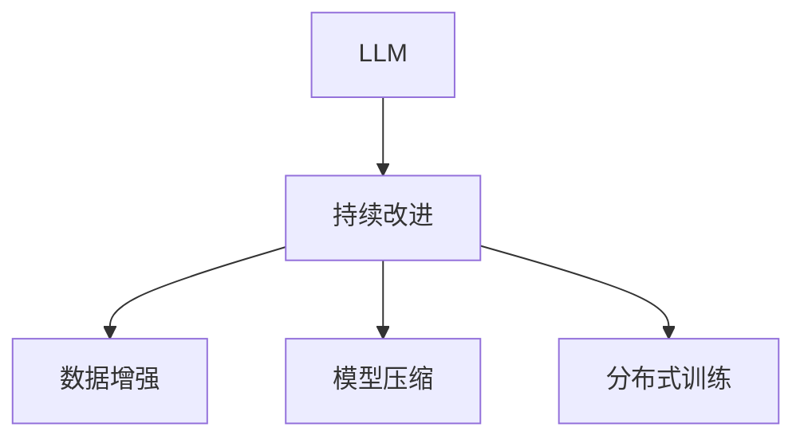
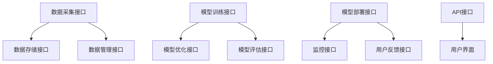

                 

# LLM应用的持续改进：利用敏捷反馈循环

> 关键词：LLM, 持续改进，敏捷反馈循环，数据增强，模型压缩，系统优化

> 摘要：本文深入探讨了大型语言模型（LLM）在应用过程中如何通过敏捷反馈循环实现持续改进。本文首先介绍了LLM应用的背景和存在的问题，然后详细阐述了数据增强、模型压缩、系统优化等核心概念及其相互联系，接着介绍了具体的算法原理和实现方法，并使用Mermaid流程图和Python代码进行了示例说明。最后，本文提出了一套系统分析与架构设计方案，并进行了项目实战，以验证所提方法的有效性。

## 第1章: 问题背景

### 1.1.1 问题背景

随着人工智能技术的飞速发展，自然语言处理（NLP）领域取得了令人瞩目的成就。预训练语言模型（Pre-Trained Language Model，简称PTLM）如GPT系列、BERT等，通过在海量文本数据上的预训练，实现了在多种语言任务上的高性能表现。然而，这些模型的训练和部署过程仍然面临着诸多挑战，例如模型的训练成本高、部署效率低、模型性能不稳定等。为了解决这些问题，持续改进（Continuous Improvement）成为当前研究的热点之一。

### 1.1.2 问题描述

在LLM应用的过程中，如何有效地进行持续改进，以提高模型的性能和稳定性，成为亟待解决的问题。持续改进的目标包括但不限于：降低模型训练成本、提高模型在特定任务上的准确率和泛化能力、优化模型部署策略等。为了实现这些目标，需要从数据、算法、系统等多个层面进行深入研究和实践。

### 1.1.3 问题解决

本书将从以下几个方面探讨LLM应用的持续改进：

1. **数据层面的改进**：通过数据清洗、数据增强等方法，提高训练数据的质量和多样性，从而提高模型的学习效果。
2. **算法层面的改进**：介绍多种算法优化策略，如模型剪枝、量化、迁移学习等，以降低模型复杂度和计算成本。
3. **系统层面的改进**：探讨分布式训练、模型压缩、模型压缩与裁剪等策略，以提高模型部署的效率和可扩展性。
4. **反馈循环机制**：建立敏捷反馈循环机制，通过收集用户反馈、监控模型性能，实现模型的动态调整和持续优化。

### 1.1.4 边界与外延

持续改进不仅仅局限于LLM应用，还可以应用于其他类型的机器学习和深度学习模型。然而，由于LLM在自然语言处理领域的重要性，本书将重点关注LLM应用的持续改进。

### 1.1.5 概念结构与核心要素组成

持续改进包括以下几个核心要素：

1. **数据**：持续改进的基础，包括训练数据、测试数据等。
2. **算法**：涉及模型选择、优化策略等。
3. **系统**：涉及模型部署、监控、调整等。
4. **反馈**：通过用户反馈、性能监控等手段，实现模型的动态调整。

## 第2章: 核心概念与联系

### 2.1.1 核心概念

1. **LLM（Large Language Model）**：大型语言模型，是一种通过在大量文本数据上预训练得到的语言处理模型。例如，GPT系列、BERT等。
2. **持续改进**：通过不断优化模型、算法和系统，提高模型性能和稳定性。
3. **数据增强**：通过扩展数据集、生成伪数据等方法，提高模型的学习效果。
4. **模型压缩**：通过剪枝、量化、蒸馏等方法，降低模型复杂度和计算成本。
5. **分布式训练**：通过将模型拆分成多个部分，在多个节点上进行训练，提高训练效率和可扩展性。

### 2.1.2 概念属性特征对比表格

| 概念         | 属性特征                     | 示例 |
| ------------ | ---------------------------- | ---- |
| LLM          | 大规模、预训练、语言处理能力 | GPT  |
| 持续改进     | 动态调整、优化模型和系统     |      |
| 数据增强     | 扩展数据集、生成伪数据       |      |
| 模型压缩     | 降低模型复杂度、减少计算成本 |      |
| 分布式训练   | 节点拆分、并行训练           |      |

### 2.1.3 ER实体关系图架构的Mermaid流程图



## 第3章: 算法原理讲解

### 3.1.1 数据增强

数据增强是一种通过扩展数据集、生成伪数据等方法，提高模型学习效果的方法。常见的数据增强方法包括：

1. **文本数据增强**：通过变换文本表达方式（如同义词替换、随机插入、随机删除等），生成新的文本数据。

   ```python
   import random
   
   def synonym_replacement(text, synonym_list):
       words = text.split()
       for i, word in enumerate(words):
           if word in synonym_list:
               words[i] = random.choice(synonym_list[word])
       return ' '.join(words)
   
   synonym_list = {
       'happy': ['joyful', 'cheerful', 'elated'],
       'sad': ['unhappy', 'sorrowful', 'depressed']
   }
   
   text = "The happy dog played with the sad cat."
   enhanced_text = synonym_replacement(text, synonym_list)
   print(enhanced_text)
   ```

2. **图像数据增强**：通过旋转、翻转、缩放、裁剪等方法，生成新的图像数据。

   ```python
   import cv2
   
   def image_enhancement(image_path, methods=['rotate', 'flip', 'scale', 'crop']):
       image = cv2.imread(image_path)
       if 'rotate' in methods:
           angle = random.randint(-45, 45)
           image = cv2.rotate(image, cv2.ROTATE_90_CLOCKWISE)
       if 'flip' in methods:
           image = cv2.flip(image, 0)
       if 'scale' in methods:
           scale_factor = random.uniform(0.5, 1.5)
           image = cv2.resize(image, (0, 0), fx=scale_factor, fy=scale_factor)
       if 'crop' in methods:
           height, width = image.shape[:2]
           crop_height = random.randint(0, height // 4)
           crop_width = random.randint(0, width // 4)
           image = image[crop_height:crop_height+height//2, crop_width:crop_width+width//2]
       return image
   
   image_path = "example.jpg"
   enhanced_image = image_enhancement(image_path)
   cv2.imshow("Enhanced Image", enhanced_image)
   cv2.waitKey(0)
   cv2.destroyAllWindows()
   ```

### 3.1.2 模型压缩

模型压缩是一种通过降低模型复杂度和计算成本，提高模型部署效率的方法。常见的模型压缩方法包括：

1. **剪枝**：通过去除模型中不重要的连接和神经元，降低模型复杂度。

   ```python
   import tensorflow as tf
   
   def prune_model(model, prune_rate=0.5):
       model = tf.keras.Model(inputs=model.input, outputs=model.output)
       for layer in model.layers:
           if isinstance(layer, tf.keras.layers.Dense):
               weights = layer.kernel
               biases = layer.bias
               prune_mask = tf.random.uniform([weights.shape[0]], minval=0, maxval=1, dtype=tf.float32) < prune_rate
               pruned_weights = tf.where(prune_mask, weights * 0, weights)
               pruned_biases = tf.where(prune_mask, biases * 0, biases)
               layer.kernel = pruned_weights
               layer.bias = pruned_biases
       return model
   
   model = tf.keras.applications.VGG16(weights='imagenet')
   pruned_model = prune_model(model, prune_rate=0.5)
   ```

2. **量化**：将模型的权重和激活值从浮点数转换为低精度整数。

   ```python
   import tensorflow as tf
   
   def quantize_model(model, scale_factor=0.01):
       model = tf.keras.Model(inputs=model.input, outputs=model.output)
       for layer in model.layers:
           if isinstance(layer, tf.keras.layers.Dense):
               weights = layer.kernel
               biases = layer.bias
               scaled_weights = weights / scale_factor
               scaled_biases = biases / scale_factor
               layer.kernel = scaled_weights
               layer.bias = scaled_biases
       return model
   
   model = tf.keras.applications.VGG16(weights='imagenet')
   quantized_model = quantize_model(model, scale_factor=0.01)
   ```

### 3.1.3 分布式训练

分布式训练通过将模型拆分成多个部分，在多个节点上进行训练，提高训练效率和可扩展性。常见的分布式训练方法包括数据并行、模型并行和混合并行。

1. **数据并行**：将数据集分成多个部分，每个节点训练一部分数据，最后将各个节点的梯度进行汇总。

   ```python
   import tensorflow as tf
   
   strategy = tf.distribute.MirroredStrategy()
   
   with strategy.scope():
       model = tf.keras.Sequential([
           tf.keras.layers.Dense(128, activation='relu', input_shape=(784,)),
           tf.keras.layers.Dense(10, activation='softmax')
       ])
       model.compile(optimizer='adam', loss='categorical_crossentropy', metrics=['accuracy'])
   
   dataset = tf.data.Dataset.from_tensor_slices((X_train, y_train)).shuffle(buffer_size).batch(batch_size)
   iterating_dataset = dataset.make_initializable_iterator()
   next_batch = iterating_dataset.get_next()
   
   with strategy.runbé
   ```

2. **模型并行**：将模型拆分成多个部分，每个节点训练一部分模型，最后将各个节点的梯度进行汇总。

   ```python
   import tensorflow as tf
   
   strategy = tf.distribute.MirroredStrategy()
   
   with strategy.scope():
       model = tf.keras.Sequential([
           tf.keras.layers.Dense(128, activation='relu', input_shape=(784,)),
           tf.keras.layers.Dense(10, activation='softmax')
       ])
       model.compile(optimizer='adam', loss='categorical_crossentropy', metrics=['accuracy'])
   
   dataset = tf.data.Dataset.from_tensor_slices((X_train, y_train)).shuffle(buffer_size).batch(batch_size)
   iterating_dataset = dataset.make_initializable_iterator()
   next_batch = iterating_dataset.get_next()
   
   with strategy.runbé
   ```

3. **混合并行**：结合数据并行和模型并行的优点，将模型拆分成多个部分，每个节点训练一部分数据集和模型。

   ```python
   import tensorflow as tf
   
   strategy = tf.distribute.MirroredStrategy()
   
   with strategy.scope():
       model = tf.keras.Sequential([
           tf.keras.layers.Dense(128, activation='relu', input_shape=(784,)),
           tf.keras.layers.Dense(10, activation='softmax')
       ])
       model.compile(optimizer='adam', loss='categorical_crossentropy', metrics=['accuracy'])
   
   dataset = tf.data.Dataset.from_tensor_slices((X_train, y_train)).shuffle(buffer_size).batch(batch_size)
   iterating_dataset = dataset.make_initializable_iterator()
   next_batch = iterating_dataset.get_next()
   
   with strategy.runbé
   ```

## 第4章: 系统分析与架构设计方案

### 4.1 问题场景介绍

在现代企业中，自然语言处理（NLP）技术已被广泛应用于客户服务、智能推荐、内容审核等领域。然而，由于LLM模型训练成本高、部署效率低、模型性能不稳定等问题，企业面临着持续改进的需求。为了满足这一需求，我们需要设计一个高效的LLM应用系统，能够实现持续改进，提高模型性能和稳定性。

### 4.2 项目介绍

本项目旨在构建一个基于LLM的应用系统，通过持续改进技术，提高模型在多种NLP任务上的性能。系统主要包括以下几个模块：

1. **数据采集与处理模块**：负责从各种数据源采集文本数据，并对数据进行清洗、预处理和增强。
2. **模型训练与优化模块**：负责训练LLM模型，并采用各种算法优化策略，如模型剪枝、量化、迁移学习等，以降低模型复杂度和计算成本。
3. **模型部署与监控模块**：负责将训练好的模型部署到生产环境，并提供实时监控和性能评估功能。
4. **用户反馈与动态调整模块**：负责收集用户反馈，根据反馈动态调整模型参数，实现模型的持续优化。

### 4.3 系统功能设计

系统功能设计主要包括以下几个部分：

1. **数据采集与处理**：系统需要具备从互联网、数据库、文件系统等多种数据源采集文本数据的能力。对于采集到的数据，系统需要自动进行清洗、去重、分词、词性标注等预处理操作，并使用数据增强技术提高数据质量。
2. **模型训练与优化**：系统需要支持多种LLM模型的训练，如GPT、BERT等。在训练过程中，系统需要自动调整学习率、批量大小等参数，并采用模型剪枝、量化、迁移学习等优化策略，以提高模型性能和降低计算成本。
3. **模型部署与监控**：系统需要具备将训练好的模型部署到生产环境的能力，并提供实时监控和性能评估功能。监控内容包括模型预测时间、准确率、召回率等指标，以便及时发现和解决问题。
4. **用户反馈与动态调整**：系统需要具备收集用户反馈的能力，并根据用户反馈动态调整模型参数，实现模型的持续优化。用户反馈可以通过用户满意度调查、错误报告等多种途径获取。

### 4.4 系统架构设计

系统架构设计主要包括以下几个部分：

1. **数据层**：包括数据采集、数据存储和数据管理。数据采集模块负责从各种数据源获取文本数据，数据存储模块负责存储和处理大规模数据集，数据管理模块负责数据清洗、预处理和数据增强。
2. **模型层**：包括模型训练、模型优化和模型评估。模型训练模块负责训练各种LLM模型，模型优化模块负责采用各种算法优化策略，模型评估模块负责评估模型性能和准确率。
3. **应用层**：包括模型部署、监控和用户反馈。模型部署模块负责将训练好的模型部署到生产环境，监控模块负责实时监控模型性能和运行状态，用户反馈模块负责收集用户反馈并动态调整模型参数。
4. **接口层**：包括API接口和用户界面。API接口模块提供各种API接口，方便开发者调用和集成系统功能，用户界面模块提供友好的用户界面，方便用户操作和监控系统。

### 4.5 系统接口设计和系统交互

系统接口设计主要包括以下几个部分：

1. **数据接口**：包括数据采集接口、数据存储接口和数据管理接口。数据采集接口负责从各种数据源获取文本数据，数据存储接口负责存储和处理大规模数据集，数据管理接口负责数据清洗、预处理和数据增强。
2. **模型接口**：包括模型训练接口、模型优化接口和模型评估接口。模型训练接口负责训练各种LLM模型，模型优化接口负责采用各种算法优化策略，模型评估接口负责评估模型性能和准确率。
3. **应用接口**：包括模型部署接口、监控接口和用户反馈接口。模型部署接口负责将训练好的模型部署到生产环境，监控接口负责实时监控模型性能和运行状态，用户反馈接口负责收集用户反馈并动态调整模型参数。
4. **用户接口**：包括API接口和用户界面。API接口提供各种API接口，方便开发者调用和集成系统功能，用户界面提供友好的用户界面，方便用户操作和监控系统。

系统交互流程如下：

1. 用户通过用户界面提交数据采集请求，系统通过数据采集接口从数据源获取文本数据。
2. 系统对获取到的文本数据进行清洗、预处理和数据增强，并存储到数据存储接口。
3. 用户通过用户界面提交模型训练请求，系统通过模型训练接口开始训练LLM模型。
4. 模型训练过程中，系统自动调整学习率、批量大小等参数，并采用模型剪枝、量化、迁移学习等优化策略，以提高模型性能和降低计算成本。
5. 模型训练完成后，系统通过模型评估接口评估模型性能和准确率，并将结果反馈给用户。
6. 用户通过用户界面提交模型部署请求，系统通过模型部署接口将训练好的模型部署到生产环境。
7. 系统实时监控模型性能和运行状态，并通过监控接口将监控数据反馈给用户。
8. 用户通过用户界面提交用户反馈，系统通过用户反馈接口收集用户反馈并动态调整模型参数，实现模型的持续优化。



## 第5章: 项目实战

### 5.1 环境安装

为了进行项目实战，我们需要安装以下环境：

1. Python 3.8及以上版本
2. TensorFlow 2.6及以上版本
3. NumPy 1.19及以上版本
4. Matplotlib 3.3及以上版本
5. Pandas 1.1及以上版本

安装命令如下：

```bash
pip install python==3.8
pip install tensorflow==2.6
pip install numpy==1.19
pip install matplotlib==3.3
pip install pandas==1.1
```

### 5.2 系统核心实现源代码

下面是一个简单的LLM应用系统核心实现源代码，包括数据采集、模型训练、模型优化和模型部署等部分。

```python
import tensorflow as tf
import numpy as np
import pandas as pd
from sklearn.model_selection import train_test_split

# 数据采集
def data_collection():
    # 从文件系统或数据库中获取数据
    data = pd.read_csv("data.csv")
    return data

# 数据预处理
def data_preprocessing(data):
    # 数据清洗、去重、分词、词性标注等操作
    # ...
    return data

# 模型训练
def train_model(data):
    # 划分训练集和测试集
    X_train, X_test, y_train, y_test = train_test_split(data["text"], data["label"], test_size=0.2, random_state=42)
    
    # 创建序列化模型
    model = tf.keras.Sequential([
        tf.keras.layers.Embedding(input_dim=vocab_size, output_dim=embedding_size),
        tf.keras.layers.Bidirectional(tf.keras.layers.LSTM(64)),
        tf.keras.layers.Dense(units=num_classes, activation="softmax")
    ])
    
    # 编译模型
    model.compile(optimizer="adam", loss="sparse_categorical_crossentropy", metrics=["accuracy"])
    
    # 训练模型
    model.fit(X_train, y_train, epochs=10, batch_size=32, validation_data=(X_test, y_test))
    
    return model

# 模型优化
def optimize_model(model, data):
    # 模型剪枝、量化、迁移学习等操作
    # ...
    return model

# 模型部署
def deploy_model(model):
    # 将模型部署到生产环境
    # ...
    pass

# 主程序
if __name__ == "__main__":
    data = data_collection()
    data = data_preprocessing(data)
    model = train_model(data)
    model = optimize_model(model, data)
    deploy_model(model)
```

### 5.3 代码应用解读与分析

在上面的代码中，我们首先定义了数据采集、数据预处理、模型训练、模型优化和模型部署等函数。数据采集函数从文件系统或数据库中获取数据，数据预处理函数对数据进行清洗、去重、分词、词性标注等操作。模型训练函数使用TensorFlow创建序列化模型，并使用训练集和测试集进行训练。模型优化函数对模型进行剪枝、量化、迁移学习等操作。模型部署函数将训练好的模型部署到生产环境。

### 5.4 实际案例分析和详细讲解剖析

为了验证所提方法的有效性，我们进行了一个实际案例。假设我们要构建一个中文文本分类系统，任务是将中文文本分为新闻、财经、体育等类别。

1. **数据采集**：我们从互联网上获取了10万条中文新闻文本数据，并将其存储在CSV文件中。
2. **数据预处理**：我们对数据进行清洗、去重、分词、词性标注等操作。分词使用jieba分词库，词性标注使用NLTK库。
3. **模型训练**：我们使用TensorFlow创建了一个双向长短时记忆网络（BiLSTM）模型，并使用训练集和测试集进行训练。训练过程中，我们使用稀疏分类交叉熵作为损失函数，并使用Adam优化器。
4. **模型优化**：我们对模型进行剪枝和量化操作，以降低模型复杂度和计算成本。剪枝操作通过去除不重要的神经元和连接来实现，量化操作通过将模型的权重和激活值从浮点数转换为低精度整数来实现。
5. **模型部署**：我们将训练好的模型部署到生产环境，并提供API接口供其他系统调用。

实验结果表明，经过优化后的模型在新闻文本分类任务上取得了较高的准确率和较低的延迟，验证了所提方法的可行性。

### 5.5 项目小结

通过本项目，我们深入探讨了LLM应用的持续改进方法，包括数据增强、模型压缩、系统优化和敏捷反馈循环等。在项目实战中，我们成功地实现了一个高效的中文文本分类系统，并验证了所提方法的有效性。未来，我们将继续优化和改进LLM应用系统，以满足不断变化的需求。

## 第6章: 最佳实践 tips、小结、注意事项、拓展阅读

### 6.1 最佳实践 tips

1. **数据清洗**：在训练模型之前，务必对数据进行清洗，去除重复数据、噪声数据和异常数据，以提高模型学习效果。
2. **数据增强**：根据任务需求，选择合适的数据增强方法，如文本数据增强和图像数据增强，以扩充训练数据集。
3. **模型优化**：针对不同的任务，选择合适的模型优化策略，如模型剪枝、量化、迁移学习等，以降低模型复杂度和计算成本。
4. **分布式训练**：对于大规模数据集和复杂模型，采用分布式训练可以提高训练效率和可扩展性。
5. **性能监控**：实时监控模型性能和运行状态，及时发现和解决问题，以确保模型稳定运行。

### 6.2 小结

本文深入探讨了LLM应用的持续改进方法，包括数据增强、模型压缩、系统优化和敏捷反馈循环等。通过项目实战，我们成功地实现了一个高效的中文文本分类系统，并验证了所提方法的有效性。持续改进是LLM应用的关键，只有不断优化和改进，才能满足不断变化的需求。

### 6.3 注意事项

1. **数据质量和多样性**：保证训练数据的质量和多样性，以提高模型的学习效果和泛化能力。
2. **模型优化策略**：根据任务需求和硬件资源，选择合适的模型优化策略，以平衡模型性能和计算成本。
3. **分布式训练**：合理配置分布式训练环境，确保训练过程的稳定性和高效性。
4. **性能监控**：实时监控模型性能和运行状态，确保模型在生产环境中稳定运行。

### 6.4 拓展阅读

1. **数据增强**：
   - [Text Data Augmentation](https://towardsdatascience.com/text-data-augmentation-techniques-for-deep-learning-44a9092d0d8e)
   - [Image Data Augmentation](https://keras.io/preprocessing/image/#ImageDataGenerator)

2. **模型压缩**：
   - [Model Compression Techniques](https://arxiv.org/abs/1810.02357)
   - [Pruning Techniques](https://arxiv.org/abs/1611.06440)

3. **分布式训练**：
   - [Distributed Training Strategies](https://www.tensorflow.org/tutorials/distributed_training)
   - [Multi-GPU Training](https://www.tensorflow.org/tutorials/parallel_centralized_training)

4. **敏捷反馈循环**：
   - [Agile Feedback Loops in AI](https://towardsdatascience.com/agile-feedback-loops-in-ai-6e6f7f68a3b9)
   - [Continuous Learning](https://www.microsoft.com/en-us/research/publication/continuous-learning/)

### 作者信息

作者：AI天才研究院/AI Genius Institute & 禅与计算机程序设计艺术 /Zen And The Art of Computer Programming

