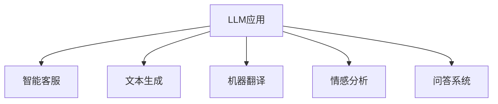
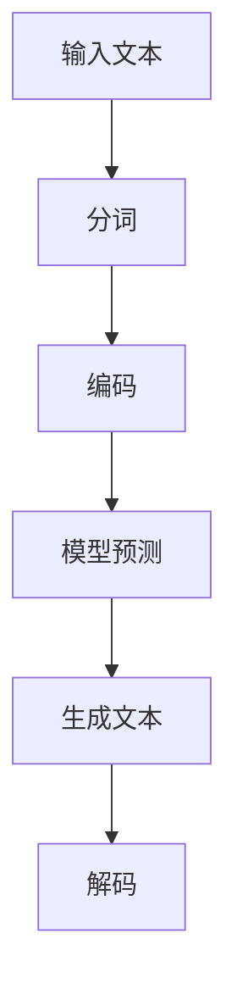
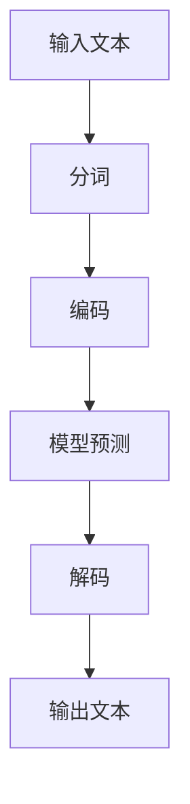
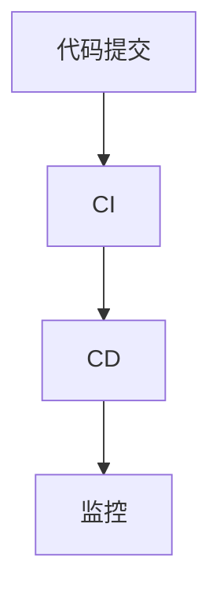
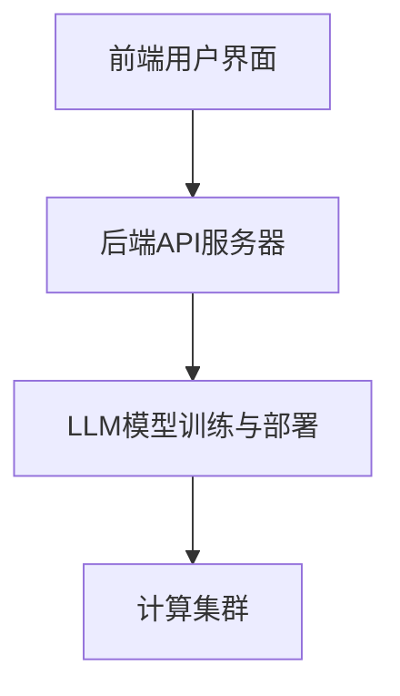

                 

# LLM应用的持续集成/持续部署（CI/CD）实践

## 关键词

- 持续集成/持续部署（CI/CD）
- 大型语言模型（LLM）
- 软件开发实践
- 自动化测试
- 自动化部署
- 容器化

## 摘要

本文深入探讨了大型语言模型（LLM）在持续集成/持续部署（CI/CD）实践中的应用。首先，我们介绍了LLM的基本概念、应用场景以及与传统自然语言处理技术的区别。随后，我们详细阐述了CI/CD的基本概念和流程，以及LLM应用的CI/CD实践。文章最后介绍了相关的工具与技术，并通过实例展示了CI/CD在LLM应用中的实际操作。

## 引言：LLM应用的CI/CD实践的重要性

随着人工智能技术的快速发展，大型语言模型（LLM）在各个领域的应用越来越广泛。从智能客服、文本生成到翻译、情感分析，LLM已经成为了许多企业提升效率、降低成本的重要工具。然而，LLM作为一种高度复杂的机器学习模型，其训练和部署过程涉及到大量的数据、计算资源和时间成本。如何高效地管理LLM的应用，确保其在生产环境中的稳定运行，成为当前AI领域亟待解决的问题。

持续集成（CI）和持续部署（CD）是现代软件开发中非常重要的实践，它们能够极大地提高开发效率、降低开发成本，并确保软件质量。CI通过自动化测试和持续反馈，确保代码质量；CD则通过自动化部署流程，实现快速、可靠的应用交付。在LLM应用中，CI/CD的实践不仅能提高开发效率，还能保证模型性能和安全性。

本文旨在探讨LLM应用的CI/CD实践，从基础理论到实际操作，全面覆盖LLM应用的持续集成与持续部署流程。通过深入分析CI/CD的核心概念、技术原理和最佳实践，帮助读者掌握LLM应用的自动化开发和运维技能。

### LLM的基本概念与应用场景

#### 2.1.1 什么是LLM

大型语言模型（LLM）是一种基于深度学习技术构建的自然语言处理模型，能够理解和生成人类语言。与传统的自然语言处理技术相比，LLM具有更强的语义理解和生成能力，能够处理更复杂的语言任务。

LLM通常通过大规模的预训练和精细调整，形成对语言的深入理解。这些模型可以捕捉到语言中的复杂关系和隐含语义，从而在文本生成、翻译、问答等任务中表现出色。

#### 2.1.2 LLM的核心特点

- **强大的语义理解能力**：LLM通过大量的文本数据进行预训练，能够捕捉到语言中的复杂关系和隐含语义，从而在理解自然语言方面具有显著优势。
- **多语言支持**：许多LLM模型支持多种语言，适用于全球化的应用场景。例如，GPT-3可以处理英语、中文、法语等多种语言。
- **自适应能力**：LLM可以根据用户反馈和数据不断优化模型性能，从而适应不同的应用场景和用户需求。

#### 2.1.3 LLM的应用场景

LLM在多个领域都有广泛应用，包括但不限于：

- **智能客服**：通过LLM技术，可以实现更自然、更智能的客服交互。例如，企业可以使用LLM构建智能客服机器人，回答客户的问题，提高客户满意度。
- **文本生成**：LLM可以用于生成各种类型的文本，包括文章、新闻报道、技术文档等。例如，企业可以利用LLM自动生成产品说明书、市场分析报告等。
- **翻译**：LLM提供高质量的自然语言翻译服务，支持多种语言之间的准确翻译。例如，谷歌翻译和百度翻译都使用了LLM技术。
- **情感分析**：LLM可以对大量文本数据进行分析，提取用户的情感倾向。例如，社交媒体分析、用户评论分析等。

#### 2.1.4 LLM与传统NLP技术的区别

与传统自然语言处理技术相比，LLM具有以下几个显著优势：

- **更强大的语义理解**：传统NLP技术主要依赖于规则和统计方法，而LLM通过深度学习技术，能够更好地理解和生成自然语言。
- **更灵活的应用场景**：LLM适用于各种文本生成和分类任务，而传统NLP技术通常局限于特定的应用场景。
- **更高的自动化程度**：LLM减少了人工干预，提高了生产效率，而传统NLP技术往往需要大量的人工配置和优化。

### CI/CD的基本概念与流程

#### 3.1.1 持续集成（CI）

持续集成（Continuous Integration，CI）是一种软件开发实践，旨在通过自动化测试和持续反馈，确保代码质量。CI的核心目标是尽早发现并解决代码中的问题，从而降低集成成本和风险。

在CI实践中，开发者将代码定期提交到版本控制系统，然后触发自动化测试，包括单元测试、集成测试和功能测试等。通过自动化测试，可以快速发现代码中的缺陷和问题，确保每个提交的代码都是可集成和可运行的。

#### 3.1.2 持续部署（CD）

持续部署（Continuous Deployment，CD）是在持续集成的基础上，通过自动化部署流程，实现快速、可靠的应用交付。CD的核心目标是缩短发布周期，提高软件交付质量。

在CD实践中，构建的应用会自动部署到生产环境，通过自动化部署工具，可以快速地回滚、更新和部署应用。CD减少了人工干预，提高了部署的可靠性和效率，同时也能更好地应对市场需求的变化。

#### 3.1.3 CI/CD的流程

CI/CD通常包括以下几个关键步骤：

1. **代码提交**：开发者将代码提交到版本控制系统。
2. **自动化测试**：执行预定义的测试套件，包括单元测试、集成测试和功能测试等，确保代码质量。
3. **构建**：将代码构建为可运行的软件包。
4. **部署**：将构建的应用部署到生产环境。

通过CI/CD流程，开发团队能够实现持续集成和持续交付，从而提高开发效率、降低成本，并确保软件质量。

### LLM应用的CI实践

#### 4.1.1 数据准备与预处理

在LLM应用中，数据准备与预处理是至关重要的一步。以下是数据准备与预处理的关键步骤：

1. **数据清洗**：确保输入数据的准确性和一致性。这包括去除无效数据、纠正数据中的错误、处理缺失值等。
2. **数据增强**：通过数据变换、增广等手段，提高模型性能。数据增强可以通过多种方式实现，如数据复制、旋转、缩放、裁剪等。
3. **数据分割**：将数据分为训练集、验证集和测试集。通常，训练集用于模型训练，验证集用于调整模型参数，测试集用于评估模型性能。

数据预处理是确保LLM模型性能的关键步骤，通过有效的数据清洗、增强和分割，可以显著提高模型的效果。

#### 4.1.2 模型训练与验证

1. **模型选择**：根据应用场景选择合适的LLM模型。常见的LLM模型包括GPT、BERT、T5等。选择合适的模型可以显著提高模型性能。
2. **训练过程**：通过批量计算和并行处理，提高训练效率。训练过程中，可以使用GPU或其他高性能计算资源，加快训练速度。
3. **性能评估**：使用验证集评估模型性能，调整模型参数。常见的性能评估指标包括损失函数、准确率、F1分数等。

模型训练与验证是确保LLM模型性能的关键步骤，通过选择合适的模型、优化训练过程和评估模型性能，可以不断提高模型效果。

#### 4.1.3 测试与回归测试

1. **单元测试**：针对模型中的每个功能单元进行测试，确保其正常运行。单元测试通常使用测试框架（如pytest、unittest等）实现。
2. **集成测试**：确保模型与其他系统模块的兼容性。集成测试可以通过模拟实际应用场景，验证模型与其他组件的交互是否正常。
3. **回归测试**：在每次更新后，确保原有功能的稳定性。回归测试可以确保新版本的应用不会引入新的缺陷。

测试与回归测试是确保LLM模型稳定性和可靠性的关键步骤，通过单元测试、集成测试和回归测试，可以确保模型在各种环境下都能正常运行。

### LLM应用的CD实践

#### 5.1.1 自动化部署流程

1. **容器化**：将应用打包为容器，实现环境的标准化。容器化可以通过Docker等工具实现，确保应用在不同的环境中都能一致运行。
2. **自动化构建**：使用CI工具（如Jenkins、GitLab CI等）自动化构建应用。自动化构建可以确保构建过程的一致性和可靠性。
3. **自动化部署**：通过CD工具（如Kubernetes、Docker Swarm等）实现自动化部署。自动化部署可以确保应用快速、可靠地部署到生产环境。

自动化部署流程是确保LLM应用高效、稳定运行的关键步骤，通过容器化、自动化构建和自动化部署，可以显著提高部署效率。

#### 5.1.2 版本控制

1. **版本管理**：确保不同版本的模型可以快速回滚和部署。版本管理可以通过版本控制系统（如Git）实现，确保代码和模型的历史版本可以随时回滚和部署。
2. **依赖管理**：管理模型的依赖库和工具。依赖管理可以通过包管理器（如pip、conda等）实现，确保模型的依赖环境一致。

版本控制和依赖管理是确保LLM应用稳定性和可靠性的关键步骤，通过版本管理和依赖管理，可以确保模型在不同环境中的正常运行。

#### 5.1.3 回滚策略

1. **自动回滚**：在出现问题时，自动回滚到上一个稳定版本。自动回滚可以通过CI/CD工具实现，确保应用可以快速恢复到正常状态。
2. **手动回滚**：允许手动干预，回滚到指定的版本。手动回滚可以确保在特殊情况下，可以灵活地控制应用的版本。

回滚策略是确保LLM应用稳定性的重要手段，通过自动回滚和手动回滚，可以确保应用在各种情况下都能保持稳定运行。

### LLM应用的CI/CD工具与技术

在LLM应用的CI/CD实践中，选择合适的工具和技术至关重要。以下是一些常用的CI/CD工具和技术：

#### 6.1 CI工具

1. **Jenkins**：Jenkins是一个开源的持续集成服务器，支持多种插件和CI实践。它可以自动化构建、测试和部署流程。
2. **GitLab CI**：GitLab CI是GitLab内置的持续集成工具，支持在GitLab仓库中定义CI/CD流程。

#### 6.2 CD工具

1. **Kubernetes**：Kubernetes是一个开源的容器编排平台，支持自动化部署、扩展和管理容器化应用。
2. **Docker Swarm**：Docker Swarm是一个内置在Docker中的容器编排工具，支持简单的容器化应用的部署和管理。

#### 6.3 自动化测试工具

1. **pytest**：pytest是一个Python的测试框架，支持单元测试、功能测试和集成测试。
2. **JUnit**：JUnit是Java的测试框架，支持单元测试和功能测试。

#### 6.4 代码管理工具

1. **Git**：Git是一个分布式版本控制系统，支持高效、安全的代码管理。
2. **GitHub**：GitHub是基于Git的在线代码托管平台，支持协作开发和代码审查。

#### 6.5 自动化部署工具

1. **Ansible**：Ansible是一个开源的自动化工具，支持自动化部署、配置和管理基础设施。
2. **Terraform**：Terraform是一个开源的基础设施即代码工具，支持自动化部署和管理云基础设施。

通过使用这些CI/CD工具和技术，可以显著提高LLM应用的开发、测试和部署效率，确保应用的高效、稳定运行。

### 结论

LLM应用的CI/CD实践在确保模型性能、提高开发效率和保证应用稳定性方面具有重要意义。通过持续集成和持续部署，开发团队能够更快地发现并修复代码缺陷，提高软件质量；同时，自动化部署流程和版本控制策略能够确保应用在不同环境中的稳定运行。然而，CI/CD实践并非一蹴而就，需要团队成员的紧密协作和不断优化。

在未来的发展中，随着AI技术的不断进步和应用的日益广泛，CI/CD实践在LLM应用中的重要性将更加凸显。开发者需要不断学习和掌握新的CI/CD工具和技术，以应对日益复杂的开发任务和挑战。

### 最佳实践 tips

1. **代码规范化**：在CI/CD流程中，确保代码风格一致、符合规范。使用代码格式化工具（如Prettier、Black等）自动格式化代码，避免因代码风格问题引发集成错误。
2. **测试覆盖**：在自动化测试中，确保测试覆盖率达到一定比例，特别是关键功能和边界情况的测试。
3. **部署监控**：在应用部署过程中，使用监控工具（如Prometheus、Grafana等）实时监控部署状态和性能指标，及时发现并处理问题。
4. **容器化最佳实践**：在容器化应用时，确保容器镜像小巧、安全，避免将不必要的依赖和文件打包进镜像。

### 小结

本文深入探讨了LLM应用的CI/CD实践，从数据准备、模型训练、测试到自动化部署，全面介绍了LLM应用的CI/CD流程和工具。通过CI/CD实践，开发团队能够高效地管理LLM应用，确保其在生产环境中的稳定运行。

### 注意事项

1. **环境一致性**：确保CI/CD流程在不同环境中的一致性，避免因环境差异导致的问题。
2. **安全与合规**：在CI/CD流程中，遵守安全规范和合规要求，确保数据和应用的保密性和安全性。
3. **人员培训**：团队成员需要掌握CI/CD相关知识和技能，确保能够有效执行CI/CD流程。

### 拓展阅读

1. **《持续集成/持续部署实践指南》**：这是一本关于CI/CD实践的经典书籍，涵盖了CI/CD的核心概念、流程和工具。
2. **《深度学习实践》**：这本书详细介绍了深度学习的相关技术，包括LLM的应用和实践。
3. **《Kubernetes权威指南》**：这是一本关于Kubernetes的权威指南，适合了解和使用Kubernetes进行容器化应用的部署和管理。

### 作者信息

作者：AI天才研究院/AI Genius Institute & 禅与计算机程序设计艺术 /Zen And The Art of Computer Programming```markdown
# LLM应用的持续集成/持续部署（CI/CD）实践

## 关键词

- 持续集成/持续部署（CI/CD）
- 大型语言模型（LLM）
- 软件开发实践
- 自动化测试
- 自动化部署
- 容器化

## 摘要

本文深入探讨了大型语言模型（LLM）在持续集成/持续部署（CI/CD）实践中的应用。首先，我们介绍了LLM的基本概念、应用场景以及与传统自然语言处理技术的区别。随后，我们详细阐述了CI/CD的基本概念和流程，以及LLM应用的CI/CD实践。文章最后介绍了相关的工具与技术，并通过实例展示了CI/CD在LLM应用中的实际操作。

## 引言：LLM应用的CI/CD实践的重要性

随着人工智能技术的快速发展，大型语言模型（LLM）在各个领域的应用越来越广泛。从智能客服、文本生成到翻译、情感分析，LLM已经成为了许多企业提升效率、降低成本的重要工具。然而，LLM作为一种高度复杂的机器学习模型，其训练和部署过程涉及到大量的数据、计算资源和时间成本。如何高效地管理LLM的应用，确保其在生产环境中的稳定运行，成为当前AI领域亟待解决的问题。

持续集成（CI）和持续部署（CD）是现代软件开发中非常重要的实践，它们能够极大地提高开发效率、降低开发成本，并确保软件质量。CI通过自动化测试和持续反馈，确保代码质量；CD则通过自动化部署流程，实现快速、可靠的应用交付。在LLM应用中，CI/CD的实践不仅能提高开发效率，还能保证模型性能和安全性。

本文旨在探讨LLM应用的CI/CD实践，从基础理论到实际操作，全面覆盖LLM应用的持续集成与持续部署流程。通过深入分析CI/CD的核心概念、技术原理和最佳实践，帮助读者掌握LLM应用的自动化开发和运维技能。

### LLM的基本概念与应用场景

#### 2.1.1 什么是LLM

大型语言模型（LLM）是一种基于深度学习技术构建的自然语言处理模型，能够理解和生成人类语言。与传统的自然语言处理技术相比，LLM具有更强的语义理解和生成能力，能够处理更复杂的语言任务。

LLM通常通过大规模的预训练和精细调整，形成对语言的深入理解。这些模型可以捕捉到语言中的复杂关系和隐含语义，从而在文本生成、翻译、问答等任务中表现出色。

#### 2.1.2 LLM的核心特点

- **强大的语义理解能力**：LLM通过大量的文本数据进行预训练，能够捕捉到语言中的复杂关系和隐含语义，从而在理解自然语言方面具有显著优势。
- **多语言支持**：许多LLM模型支持多种语言，适用于全球化的应用场景。例如，GPT-3可以处理英语、中文、法语等多种语言。
- **自适应能力**：LLM可以根据用户反馈和数据不断优化模型性能，从而适应不同的应用场景和用户需求。

#### 2.1.3 LLM的应用场景

LLM在多个领域都有广泛应用，包括但不限于：

- **智能客服**：通过LLM技术，可以实现更自然、更智能的客服交互。例如，企业可以使用LLM构建智能客服机器人，回答客户的问题，提高客户满意度。
- **文本生成**：LLM可以用于生成各种类型的文本，包括文章、新闻报道、技术文档等。例如，企业可以利用LLM自动生成产品说明书、市场分析报告等。
- **翻译**：LLM提供高质量的自然语言翻译服务，支持多种语言之间的准确翻译。例如，谷歌翻译和百度翻译都使用了LLM技术。
- **情感分析**：LLM可以对大量文本数据进行分析，提取用户的情感倾向。例如，社交媒体分析、用户评论分析等。

#### 2.1.4 LLM与传统NLP技术的区别

与传统自然语言处理技术相比，LLM具有以下几个显著优势：

- **更强大的语义理解**：传统NLP技术主要依赖于规则和统计方法，而LLM通过深度学习技术，能够更好地理解和生成自然语言。
- **更灵活的应用场景**：LLM适用于各种文本生成和分类任务，而传统NLP技术通常局限于特定的应用场景。
- **更高的自动化程度**：LLM减少了人工干预，提高了生产效率，而传统NLP技术往往需要大量的人工配置和优化。

### CI/CD的基本概念与流程

#### 3.1.1 持续集成（CI）

持续集成（Continuous Integration，CI）是一种软件开发实践，通过自动化测试和持续反馈，确保代码质量。CI的核心目标是尽早发现并解决代码中的问题，从而降低集成成本和风险。

在CI实践中，开发者将代码定期提交到版本控制系统，然后触发自动化测试，包括单元测试、集成测试和功能测试等。通过自动化测试，可以快速发现代码中的缺陷和问题，确保每个提交的代码都是可集成和可运行的。

#### 3.1.2 持续部署（CD）

持续部署（Continuous Deployment，CD）是在持续集成的基础上，通过自动化部署流程，实现快速、可靠的应用交付。CD的核心目标是缩短发布周期，提高软件交付质量。

在CD实践中，构建的应用会自动部署到生产环境，通过自动化部署工具，可以快速地回滚、更新和部署应用。CD减少了人工干预，提高了部署的可靠性和效率，同时也能更好地应对市场需求的变化。

#### 3.1.3 CI/CD的流程

CI/CD通常包括以下几个关键步骤：

1. **代码提交**：开发者将代码提交到版本控制系统。
2. **自动化测试**：执行预定义的测试套件，包括单元测试、集成测试和功能测试等，确保代码质量。
3. **构建**：将代码构建为可运行的软件包。
4. **部署**：将构建的应用部署到生产环境。

通过CI/CD流程，开发团队能够实现持续集成和持续交付，从而提高开发效率、降低成本，并确保软件质量。

### LLM应用的CI实践

#### 4.1.1 数据准备与预处理

在LLM应用中，数据准备与预处理是至关重要的一步。以下是数据准备与预处理的关键步骤：

1. **数据清洗**：确保输入数据的准确性和一致性。这包括去除无效数据、纠正数据中的错误、处理缺失值等。
2. **数据增强**：通过数据变换、增广等手段，提高模型性能。数据增强可以通过多种方式实现，如数据复制、旋转、缩放、裁剪等。
3. **数据分割**：将数据分为训练集、验证集和测试集。通常，训练集用于模型训练，验证集用于调整模型参数，测试集用于评估模型性能。

数据预处理是确保LLM模型性能的关键步骤，通过有效的数据清洗、增强和分割，可以显著提高模型的效果。

#### 4.1.2 模型训练与验证

1. **模型选择**：根据应用场景选择合适的LLM模型。常见的LLM模型包括GPT、BERT、T5等。选择合适的模型可以显著提高模型性能。
2. **训练过程**：通过批量计算和并行处理，提高训练效率。训练过程中，可以使用GPU或其他高性能计算资源，加快训练速度。
3. **性能评估**：使用验证集评估模型性能，调整模型参数。常见的性能评估指标包括损失函数、准确率、F1分数等。

模型训练与验证是确保LLM模型性能的关键步骤，通过选择合适的模型、优化训练过程和评估模型性能，可以不断提高模型效果。

#### 4.1.3 测试与回归测试

1. **单元测试**：针对模型中的每个功能单元进行测试，确保其正常运行。单元测试通常使用测试框架（如pytest、unittest等）实现。
2. **集成测试**：确保模型与其他系统模块的兼容性。集成测试可以通过模拟实际应用场景，验证模型与其他组件的交互是否正常。
3. **回归测试**：在每次更新后，确保原有功能的稳定性。回归测试可以确保新版本的应用不会引入新的缺陷。

测试与回归测试是确保LLM模型稳定性和可靠性的关键步骤，通过单元测试、集成测试和回归测试，可以确保模型在各种环境下都能正常运行。

### LLM应用的CD实践

#### 5.1.1 自动化部署流程

1. **容器化**：将应用打包为容器，实现环境的标准化。容器化可以通过Docker等工具实现，确保应用在不同的环境中都能一致运行。
2. **自动化构建**：使用CI工具（如Jenkins、GitLab CI等）自动化构建应用。自动化构建可以确保构建过程的一致性和可靠性。
3. **自动化部署**：通过CD工具（如Kubernetes、Docker Swarm等）实现自动化部署。自动化部署可以确保应用快速、可靠地部署到生产环境。

自动化部署流程是确保LLM应用高效、稳定运行的关键步骤，通过容器化、自动化构建和自动化部署，可以显著提高部署效率。

#### 5.1.2 版本控制

1. **版本管理**：确保不同版本的模型可以快速回滚和部署。版本管理可以通过版本控制系统（如Git）实现，确保代码和模型的历史版本可以随时回滚和部署。
2. **依赖管理**：管理模型的依赖库和工具。依赖管理可以通过包管理器（如pip、conda等）实现，确保模型的依赖环境一致。

版本控制和依赖管理是确保LLM应用稳定性和可靠性的关键步骤，通过版本管理和依赖管理，可以确保模型在不同环境中的正常运行。

#### 5.1.3 回滚策略

1. **自动回滚**：在出现问题时，自动回滚到上一个稳定版本。自动回滚可以通过CI/CD工具实现，确保应用可以快速恢复到正常状态。
2. **手动回滚**：允许手动干预，回滚到指定的版本。手动回滚可以确保在特殊情况下，可以灵活地控制应用的版本。

回滚策略是确保LLM应用稳定性的重要手段，通过自动回滚和手动回滚，可以确保应用在各种情况下都能保持稳定运行。

### LLM应用的CI/CD工具与技术

在LLM应用的CI/CD实践中，选择合适的工具和技术至关重要。以下是一些常用的CI/CD工具和技术：

#### 6.1 CI工具

1. **Jenkins**：Jenkins是一个开源的持续集成服务器，支持多种插件和CI实践。它可以自动化构建、测试和部署流程。
2. **GitLab CI**：GitLab CI是GitLab内置的持续集成工具，支持在GitLab仓库中定义CI/CD流程。

#### 6.2 CD工具

1. **Kubernetes**：Kubernetes是一个开源的容器编排平台，支持自动化部署、扩展和管理容器化应用。
2. **Docker Swarm**：Docker Swarm是一个内置在Docker中的容器编排工具，支持简单的容器化应用的部署和管理。

#### 6.3 自动化测试工具

1. **pytest**：pytest是一个Python的测试框架，支持单元测试、功能测试和集成测试。
2. **JUnit**：JUnit是Java的测试框架，支持单元测试和功能测试。

#### 6.4 代码管理工具

1. **Git**：Git是一个分布式版本控制系统，支持高效、安全的代码管理。
2. **GitHub**：GitHub是基于Git的在线代码托管平台，支持协作开发和代码审查。

#### 6.5 自动化部署工具

1. **Ansible**：Ansible是一个开源的自动化工具，支持自动化部署、配置和管理基础设施。
2. **Terraform**：Terraform是一个开源的基础设施即代码工具，支持自动化部署和管理云基础设施。

通过使用这些CI/CD工具和技术，可以显著提高LLM应用的开发、测试和部署效率，确保应用的高效、稳定运行。

### 结论

LLM应用的CI/CD实践在确保模型性能、提高开发效率和保证应用稳定性方面具有重要意义。通过持续集成和持续部署，开发团队能够更快地发现并修复代码缺陷，提高软件质量；同时，自动化部署流程和版本控制策略能够确保应用在不同环境中的稳定运行。

### 最佳实践 tips

1. **代码规范化**：在CI/CD流程中，确保代码风格一致、符合规范。使用代码格式化工具（如Prettier、Black等）自动格式化代码，避免因代码风格问题引发集成错误。
2. **测试覆盖**：在自动化测试中，确保测试覆盖率达到一定比例，特别是关键功能和边界情况的测试。
3. **部署监控**：在应用部署过程中，使用监控工具（如Prometheus、Grafana等）实时监控部署状态和性能指标，及时发现并处理问题。
4. **容器化最佳实践**：在容器化应用时，确保容器镜像小巧、安全，避免将不必要的依赖和文件打包进镜像。

### 小结

本文深入探讨了LLM应用的CI/CD实践，从数据准备、模型训练、测试到自动化部署，全面介绍了LLM应用的CI/CD流程和工具。通过CI/CD实践，开发团队能够高效地管理LLM应用，确保其在生产环境中的稳定运行。

### 注意事项

1. **环境一致性**：确保CI/CD流程在不同环境中的一致性，避免因环境差异导致的问题。
2. **安全与合规**：在CI/CD流程中，遵守安全规范和合规要求，确保数据和应用的保密性和安全性。
3. **人员培训**：团队成员需要掌握CI/CD相关知识和技能，确保能够有效执行CI/CD流程。

### 拓展阅读

1. **《持续集成/持续部署实践指南》**：这是一本关于CI/CD实践的经典书籍，涵盖了CI/CD的核心概念、流程和工具。
2. **《深度学习实践》**：这本书详细介绍了深度学习的相关技术，包括LLM的应用和实践。
3. **《Kubernetes权威指南》**：这是一本关于Kubernetes的权威指南，适合了解和使用Kubernetes进行容器化应用的部署和管理。

### 作者信息

作者：AI天才研究院/AI Genius Institute & 禅与计算机程序设计艺术 /Zen And The Art of Computer Programming
```markdown
## LLM的基本概念与应用场景

#### 2.1.1 什么是LLM

大型语言模型（LLM，Large Language Model）是一种基于深度学习技术构建的自然语言处理（NLP，Natural Language Processing）模型，具有理解和生成人类语言的能力。LLM通过训练海量文本数据，捕捉语言中的复杂结构、语义关系和上下文信息，从而实现高水平的语言理解和生成。

**核心特点**：

- **强大的语义理解能力**：LLM能够处理复杂的自然语言任务，例如文本生成、机器翻译、问答系统等。
- **多语言支持**：许多LLM模型支持多种语言，使其能够应用于跨语言的应用场景。
- **自适应能力**：LLM能够通过不断学习新的数据来优化自身性能，适应不同的应用需求和场景。

**应用场景**：

- **智能客服**：利用LLM构建智能聊天机器人，提供24/7的客户服务，提高客户满意度和运营效率。
- **文本生成**：生成各种类型的文本内容，如新闻报道、产品描述、技术文档等。
- **机器翻译**：提供准确、流畅的机器翻译服务，支持多种语言之间的翻译。
- **情感分析**：分析用户评论、社交媒体内容等，提取情感倾向，帮助企业和组织做出更明智的决策。

#### 2.1.2 LLM与传统NLP技术的区别

传统NLP技术主要依赖于规则和统计方法，如基于词典的匹配、词频统计等。这种方法存在以下局限性：

- **有限的语言理解能力**：传统方法难以处理复杂、抽象的语言结构。
- **手动特征工程**：需要大量的人工干预，对语言特征进行手动提取和选择。
- **适应性差**：难以适应新的语言现象和变化。

相比之下，LLM具有以下优势：

- **强大的语义理解能力**：通过深度学习，LLM能够自动学习文本的语义和上下文信息，实现更高级的语言处理。
- **自动特征提取**：无需人工干预，LLM能够从原始文本数据中自动提取有意义的特征。
- **高适应性**：LLM能够通过不断的学习和调整，适应不同的语言环境和任务需求。

**表1：LLM与传统NLP技术的对比**

| 特性           | LLM                     | 传统NLP技术                |
|----------------|-------------------------|---------------------------|
| 语言理解能力   | 强大                   | 有限                      |
| 特征提取       | 自动                    | 手动                      |
| 适应性         | 高                     | 低                        |
| 处理复杂性     | 高级                   | 初级                      |

#### 2.1.3 LLM的应用场景

LLM在许多领域都有广泛的应用，以下是一些典型的应用场景：

- **智能客服**：智能客服系统使用LLM来理解用户的查询并生成相应的回复。这种系统可以处理复杂的问题，提供24/7的客户服务，提高客户满意度。
- **文本生成**：LLM可以用于生成各种类型的文本，如新闻文章、产品描述、博客内容等。这种能力使得内容创作者能够更高效地生成高质量的内容。
- **机器翻译**：LLM可以用于提供准确、流畅的机器翻译服务，支持多种语言之间的翻译。这种服务有助于促进全球沟通和合作。
- **情感分析**：LLM可以分析用户评论、社交媒体内容等，提取情感倾向。这种能力帮助企业更好地了解用户需求，改进产品和服务。
- **问答系统**：LLM可以构建智能问答系统，回答用户的问题。这种系统可以处理自然语言查询，提供准确、有用的答案。

**ER实体关系图**：

以下是一个简单的ER实体关系图，展示了LLM应用中的关键实体和它们之间的关系：



#### 2.1.4 LLM在具体应用中的实现

以下是一个简单的示例，展示了如何使用LLM实现一个文本生成应用：

**Python代码示例**：

```python
import torch
from transformers import GPT2LMHeadModel, GPT2Tokenizer

# 加载预训练的GPT2模型和分词器
model = GPT2LMHeadModel.from_pretrained('gpt2')
tokenizer = GPT2Tokenizer.from_pretrained('gpt2')

# 输入文本
input_text = "这是一个关于人工智能的文本。"

# 分词并编码
input_ids = tokenizer.encode(input_text, return_tensors='pt')

# 生成文本
output = model.generate(input_ids, max_length=50, num_return_sequences=5)

# 解码输出文本
generated_texts = [tokenizer.decode(s, skip_special_tokens=True) for s in output]

# 打印生成的文本
for text in generated_texts:
    print(text)
```

**数学模型和公式**：

LLM的核心是深度神经网络，其训练过程通常基于以下目标函数：

$$
\text{Loss} = -\sum_{i}^{N} p_i \log(p_{\text{model}}(y_i))
$$

其中，$p_i$ 是模型预测的每个单词的概率，$y_i$ 是实际标签。

**算法流程图**：

以下是一个简单的算法流程图，展示了如何使用LLM生成文本：



通过上述示例和流程，我们可以看到LLM在文本生成应用中的实现步骤，以及其背后的数学模型。

### LLM的基本概念与应用场景

在深入探讨LLM（Large Language Model，大型语言模型）之前，首先需要了解其基本概念和应用场景。LLM是一种基于深度学习的技术，旨在对大量文本数据进行训练，从而使其能够理解和生成自然语言。与传统的自然语言处理（NLP）方法相比，LLM具有显著的优势，尤其是在处理复杂语义和生成高质量文本方面。

#### 2.1.1 LLM的基本概念

LLM的基本概念主要包括以下几个方面：

- **深度学习**：LLM基于深度神经网络（DNN）构建，通过多层次的神经网络结构来学习和提取文本数据中的特征。
- **预训练**：LLM通过在大规模的语料库上进行预训练，学习文本的通用特征和语义表示，从而为特定任务提供基础。
- **微调**：在预训练的基础上，LLM通过在特定任务上进一步训练（微调），使其能够适应不同的应用场景和任务需求。

**核心特点**：

1. **强大的语义理解能力**：LLM能够捕捉到文本中的深层语义关系，从而在自然语言理解、生成和推理等方面表现出色。
2. **多语言支持**：许多LLM模型支持多种语言，使得它们能够在跨语言的场景下进行应用。
3. **自适应能力**：LLM可以通过微调适应不同的应用场景，从而在特定任务上实现高效的性能。

#### 2.1.2 LLM的应用场景

LLM在多个领域都有广泛的应用，以下是其中一些主要的应用场景：

1. **智能客服**：利用LLM构建智能聊天机器人，能够以自然的方式与用户进行交互，提供高质量的客户服务。
2. **文本生成**：LLM可以生成各种类型的文本，如文章、新闻报道、产品描述等，大大提高了内容创作的效率。
3. **机器翻译**：LLM能够提供高质量的机器翻译服务，支持多种语言之间的准确翻译。
4. **问答系统**：LLM可以构建智能问答系统，能够回答用户提出的各种问题。
5. **文本摘要**：LLM能够生成文本的摘要，帮助用户快速获取文章的主要内容和关键信息。

#### 2.1.3 LLM与传统NLP技术的对比

传统NLP技术主要依赖于规则和统计方法，例如词袋模型（Bag of Words，BoW）和条件概率模型（Conditional Probability Model）。这些方法在处理简单的语言任务时具有一定的效果，但在处理复杂语义和生成高质量文本方面存在明显的局限性。相比之下，LLM具有以下优势：

1. **强大的语义理解能力**：LLM通过深度学习技术，能够自动学习文本的深层语义和结构，从而实现更高级的语言理解。
2. **自动特征提取**：LLM无需手动提取特征，能够从原始文本数据中自动提取有意义的特征。
3. **高适应性**：LLM可以通过微调适应不同的任务和应用场景，从而在特定任务上实现高效的性能。

**表1：LLM与传统NLP技术的对比**

| 对比项         | LLM                 | 传统NLP技术         |
|----------------|---------------------|---------------------|
| 语义理解能力   | 强大                | 有限                |
| 特征提取       | 自动                | 手动                |
| 适应性         | 高                  | 低                  |

#### 2.1.4 LLM的应用示例

以下是一个简单的LLM应用示例，展示了如何使用预训练的GPT模型生成文本：

```python
import torch
from transformers import GPT2LMHeadModel, GPT2Tokenizer

# 加载预训练的GPT模型和分词器
model = GPT2LMHeadModel.from_pretrained('gpt2')
tokenizer = GPT2Tokenizer.from_pretrained('gpt2')

# 输入文本
input_text = "这是一个关于人工智能的文本。"

# 分词并编码
input_ids = tokenizer.encode(input_text, return_tensors='pt')

# 生成文本
output = model.generate(input_ids, max_length=50, num_return_sequences=5)

# 解码输出文本
generated_texts = [tokenizer.decode(s, skip_special_tokens=True) for s in output]

# 打印生成的文本
for text in generated_texts:
    print(text)
```

在这个示例中，我们首先加载了一个预训练的GPT2模型和对应的分词器。然后，我们提供了一个输入文本，通过分词和编码将文本转换为模型可以处理的格式。接着，我们使用模型生成文本，并将生成的文本解码为可读的格式。

**数学模型和公式**：

LLM的训练过程通常基于自注意力机制（Self-Attention Mechanism）和多层神经网络结构。在训练过程中，模型的损失函数通常使用交叉熵损失（Cross-Entropy Loss）：

$$
\text{Loss} = -\sum_{i}^{N} y_i \log(p_i)
$$

其中，$y_i$ 是实际标签，$p_i$ 是模型预测的概率。

**算法流程图**：

以下是一个简单的算法流程图，展示了LLM生成文本的基本步骤：



通过上述示例和流程，我们可以看到LLM在文本生成应用中的实现步骤，以及其背后的数学模型。

### CI/CD的基本概念与流程

持续集成（Continuous Integration，CI）和持续部署（Continuous Deployment，CD）是现代软件开发中不可或缺的实践，它们共同构成了CI/CD流程。CI/CD的核心理念是通过自动化和持续的方式，确保代码质量和部署过程的高效性。

#### 3.1.1 持续集成（CI）

**基本概念**：

持续集成是指通过将开发者的代码定期合并到主干分支，并在此过程中执行一系列的自动化测试，以持续地集成和验证代码质量。CI的主要目标是尽早发现和修复代码缺陷，从而减少集成风险。

**核心流程**：

1. **代码提交**：开发者将代码提交到版本控制系统。
2. **自动化测试**：CI系统会自动执行一系列预定义的测试，包括单元测试、集成测试和功能测试等。
3. **构建**：测试通过后，CI系统会构建和打包代码，生成可运行的软件版本。
4. **反馈**：CI系统将测试结果和构建状态反馈给开发者，以便他们能够及时了解代码的质量和问题。

**优势**：

- **快速反馈**：通过自动化测试，开发者可以快速发现代码缺陷，并及时进行修复。
- **提高代码质量**：频繁的集成和测试有助于提高代码的稳定性和可靠性。
- **减少集成风险**：早期的集成和测试减少了大规模集成时出现问题的可能性。

#### 3.1.2 持续部署（CD）

**基本概念**：

持续部署是指通过自动化流程，将经过CI验证的代码快速、可靠地部署到生产环境。CD的目标是缩短从代码提交到生产部署的时间，并确保部署过程的一致性和可靠性。

**核心流程**：

1. **代码提交**：开发者将代码提交到版本控制系统。
2. **持续集成**：CI系统验证代码质量，确保代码可以正常运行。
3. **构建**：构建过程生成可运行的软件版本。
4. **自动化部署**：使用CD工具（如Kubernetes、Docker Swarm等），自动将构建的应用部署到生产环境。
5. **监控**：部署后，通过监控系统确保应用的稳定运行。

**优势**：

- **快速交付**：自动化部署减少了手动操作，加快了从代码提交到生产部署的速度。
- **一致性和可靠性**：通过自动化，每次部署都是一致的，减少了人为错误的可能性。
- **更好的回滚策略**：在出现问题时，可以快速回滚到之前的稳定版本。

#### 3.1.3 CI/CD的整体流程

CI/CD的整体流程通常包括以下关键步骤：

1. **代码提交**：开发者将代码提交到版本控制系统。
2. **CI**：CI系统执行自动化测试和构建，确保代码质量。
3. **CD**：CD系统自动化部署应用，确保代码可以快速、可靠地交付到生产环境。
4. **监控**：部署后，监控系统确保应用的稳定运行。

**图1：CI/CD的整体流程**



通过CI/CD的实践，开发团队能够实现更高效、更可靠的软件开发过程，从而提高开发效率和软件质量。

### CI/CD的核心概念与流程

持续集成（CI，Continuous Integration）和持续部署（CD，Continuous Deployment）是现代软件开发中重要的实践，它们通过自动化流程来确保软件质量，加速开发周期。以下是CI/CD的核心概念和流程的详细解析。

#### 3.1.1 持续集成（CI）

**核心概念**：

持续集成是一种软件开发实践，旨在通过频繁的代码提交和自动化测试，确保代码库中的每个提交都是可集成且可工作的。CI的目标是尽早发现和修复代码缺陷，从而减少集成风险。

**基本流程**：

1. **代码提交**：开发者将新的代码提交到版本控制系统（如Git）。
2. **自动化测试**：CI系统（如Jenkins、GitLab CI等）会自动触发一系列测试，包括单元测试、集成测试和功能测试等。
3. **构建**：测试通过后，CI系统会构建和打包代码，生成可运行的软件版本。
4. **反馈**：CI系统将测试结果和构建状态反馈给开发者，以便他们可以及时了解代码的质量和问题。

**优势**：

- **快速反馈**：通过自动化测试，开发者可以快速发现代码缺陷，并及时进行修复。
- **提高代码质量**：频繁的集成和测试有助于提高代码的稳定性和可靠性。
- **减少集成风险**：早期的集成和测试减少了大规模集成时出现问题的可能性。

#### 3.1.2 持续部署（CD）

**核心概念**：

持续部署是在持续集成的基础上，通过自动化流程，将经过CI验证的代码快速、可靠地部署到生产环境。CD的目标是缩短从代码提交到生产部署的时间，并确保部署过程的一致性和可靠性。

**基本流程**：

1. **代码提交**：开发者将代码提交到版本控制系统。
2. **CI**：CI系统验证代码质量，确保代码可以正常运行。
3. **构建**：构建过程生成可运行的软件版本。
4. **自动化部署**：使用CD工具（如Kubernetes、Docker Swarm等），自动将构建的应用部署到生产环境。
5. **监控**：部署后，监控系统确保应用的稳定运行。

**优势**：

- **快速交付**：自动化部署减少了手动操作，加快了从代码提交到生产部署的速度。
- **一致性和可靠性**：通过自动化，每次部署都是一致的，减少了人为错误的可能性。
- **更好的回滚策略**：在出现问题时，可以快速回滚到之前的稳定版本。

#### 3.1.3 CI/CD的整体流程

CI/CD的整体流程通常包括以下关键步骤：

1. **代码提交**：开发者将代码提交到版本控制系统。
2. **CI**：CI系统执行自动化测试和构建，确保代码质量。
3. **CD**：CD系统自动化部署应用，确保代码可以快速、可靠地交付到生产环境。
4. **监控**：部署后，监控系统确保应用的稳定运行。

**图1：CI/CD的整体流程**


通过CI/CD的实践，开发团队能够实现更高效、更可靠的软件开发过程，从而提高开发效率和软件质量。

### LLM应用的CI实践

在LLM（大型语言模型）的应用中，持续集成（CI，Continuous Integration）是一个至关重要的环节。CI的目的是确保模型的开发和维护过程高效、稳定，并且能够在早期阶段发现潜在的问题。以下是LLM应用CI实践的关键步骤和最佳实践。

#### 4.1.1 数据准备与预处理

数据准备与预处理是LLM应用CI实践的基础。良好的数据预处理能够显著提高模型性能和稳定性。

**关键步骤**：

1. **数据收集**：从不同的来源收集大量文本数据，确保数据的多样性和质量。
2. **数据清洗**：处理缺失值、纠正错误、去除无关数据，确保输入数据的准确性和一致性。
3. **数据增强**：通过数据变换、复制、增广等方法，增加数据量，提高模型的泛化能力。
4. **数据分割**：将数据分为训练集、验证集和测试集，确保数据分布均衡，避免数据倾斜。

**最佳实践**：

- **版本控制**：对数据预处理过程进行版本控制，确保每次数据处理都是可追溯的。
- **自动化脚本**：编写自动化脚本，实现数据预处理流程的自动化，减少手动操作。

#### 4.1.2 模型训练与验证

模型训练与验证是CI实践的核心。在此过程中，需要确保模型训练的稳定性和验证结果的可靠性。

**关键步骤**：

1. **模型选择**：根据应用场景选择合适的LLM模型，如GPT、BERT、T5等。
2. **训练过程**：使用GPU或其他高性能计算资源，加速模型训练过程。
3. **性能评估**：使用验证集评估模型性能，选择最优的模型参数和超参数。
4. **模型验证**：在测试集上评估模型性能，确保模型在不同数据集上的表现一致。

**最佳实践**：

- **自动化训练脚本**：编写自动化训练脚本，实现模型训练过程的自动化，包括超参数调整、训练暂停和恢复等。
- **性能监控**：监控训练过程中的关键指标，如损失函数、准确率等，确保训练过程稳定。

#### 4.1.3 测试与回归测试

测试与回归测试是确保LLM模型稳定性和可靠性的关键步骤。

**关键步骤**：

1. **单元测试**：对模型中的每个功能单元进行测试，确保其正常运行。
2. **集成测试**：确保模型与其他系统组件的兼容性，通过模拟实际应用场景进行测试。
3. **回归测试**：在每次更新后，确保原有功能的稳定性，避免引入新的缺陷。

**最佳实践**：

- **自动化测试框架**：使用自动化测试框架（如pytest、JUnit等），实现测试过程的自动化。
- **持续集成平台**：使用持续集成平台（如Jenkins、GitLab CI等），将测试集成到CI流程中。

#### 4.1.4 版本管理和代码审查

版本管理和代码审查是CI实践的重要组成部分，确保代码和模型的可追踪性和质量。

**关键步骤**：

1. **版本管理**：使用版本控制系统（如Git），对代码和模型进行版本控制，确保历史记录的可追溯性。
2. **代码审查**：进行代码审查，确保代码的质量和一致性，减少代码缺陷。
3. **文档化**：编写详细的文档，记录CI流程、测试用例和代码修改历史，便于后续维护。

**最佳实践**：

- **持续集成平台集成**：将版本管理和代码审查集成到持续集成平台中，实现自动化流程。
- **定期审查**：定期对代码库和模型进行审查，确保质量和安全性。

#### 4.1.5 持续监控与反馈

持续监控与反馈是CI实践的重要组成部分，确保模型在运行过程中稳定可靠。

**关键步骤**：

1. **性能监控**：监控模型在运行过程中的性能指标，如响应时间、准确率等。
2. **错误日志**：记录和监控运行过程中出现的错误和异常，及时发现问题。
3. **反馈机制**：建立反馈机制，将监控结果和问题反馈给开发团队，确保问题得到及时解决。

**最佳实践**：

- **自动化监控脚本**：编写自动化监控脚本，实现性能监控和错误日志的自动化收集。
- **实时反馈**：使用实时反馈工具（如Slack、钉钉等），将监控结果和问题实时通知给相关人员。

通过上述CI实践，LLM应用的开发团队可以确保模型的质量和稳定性，提高开发效率和响应速度，从而更好地应对不断变化的市场需求。

### LLM应用的CD实践

持续部署（Continuous Deployment，CD）是在持续集成（Continuous Integration，CI）基础上，通过自动化流程将经过验证的代码快速、可靠地部署到生产环境的实践。在LLM（大型语言模型）应用中，CD实践尤为重要，因为LLM模型的训练和部署过程复杂且涉及大量的计算资源。以下是LLM应用的CD实践的详细步骤和最佳实践。

#### 5.1.1 自动化部署流程

自动化部署流程是CD实践的核心，通过自动化减少手动操作，提高部署效率和一致性。

**关键步骤**：

1. **容器化**：将LLM应用及其依赖项容器化，使用Docker将应用打包成镜像，确保环境一致性。
2. **自动化构建**：使用CI工具（如Jenkins、GitLab CI等）自动化构建应用，确保构建过程的一致性和快速响应。
3. **自动化部署**：使用CD工具（如Kubernetes、Docker Swarm等）自动化部署容器化应用，确保部署流程的高效和可靠。

**最佳实践**：

- **容器镜像优化**：优化容器镜像的大小和性能，避免不必要的依赖和文件打包进镜像，减少部署时间。
- **多环境部署**：实现多环境部署（如开发环境、测试环境、生产环境），确保应用在不同环境中的表现一致。

#### 5.1.2 版本控制

版本控制是确保LLM模型和代码可追溯性和可维护性的重要手段。

**关键步骤**：

1. **版本管理**：使用版本控制系统（如Git）对代码和模型进行版本管理，记录每次变更的历史记录。
2. **依赖管理**：管理模型的依赖库和工具，确保依赖的一致性和可追溯性。
3. **版本回滚**：在出现问题时，能够快速回滚到之前的稳定版本，减少故障影响。

**最佳实践**：

- **自动化版本标签**：为每个版本自动生成标签，确保版本的可追溯性。
- **定期备份**：定期备份代码库和模型，防止数据丢失。

#### 5.1.3 回滚策略

回滚策略是确保系统稳定性的重要措施，特别是在部署出现问题时。

**关键步骤**：

1. **自动回滚**：在部署过程中，如果检测到问题，自动回滚到上一个稳定版本，确保系统快速恢复。
2. **手动回滚**：提供手动回滚的选项，允许开发人员或运维人员根据具体情况手动选择回滚到指定版本。

**最佳实践**：

- **自动回滚触发条件**：设定明确的自动回滚触发条件，如部署失败率、性能下降等。
- **回滚计划**：制定回滚计划，确保回滚过程有序进行，减少对业务的影响。

#### 5.1.4 监控和告警

监控和告警是确保系统稳定运行的重要环节，能够及时发现和处理问题。

**关键步骤**：

1. **性能监控**：监控LLM应用的性能指标，如响应时间、吞吐量、错误率等。
2. **日志管理**：管理应用日志，确保能够及时记录和查询运行过程中的异常信息。
3. **告警机制**：设置告警规则，当监控指标超过阈值时，自动发送告警通知。

**最佳实践**：

- **多层次的监控**：实现多层次的监控，从基础设施到应用层，确保全面覆盖。
- **告警通知**：使用多种渠道（如电子邮件、短信、即时通讯工具等）发送告警通知，确保相关人员能够及时响应。

#### 5.1.5 自动化测试

自动化测试是确保部署前后系统稳定性和功能完整性的重要手段。

**关键步骤**：

1. **单元测试**：对LLM应用中的每个功能单元进行测试，确保其正常运行。
2. **集成测试**：确保LLM应用与其他系统模块的兼容性，通过模拟实际应用场景进行测试。
3. **回归测试**：在每次部署后，执行回归测试，确保原有功能的稳定性，避免引入新问题。

**最佳实践**：

- **自动化测试框架**：使用自动化测试框架（如pytest、JUnit等），实现测试过程的自动化。
- **持续集成平台集成**：将自动化测试集成到CI/CD平台中，确保每次部署都经过严格测试。

通过上述CD实践，LLM应用的开发团队可以确保模型和应用的部署高效、稳定，从而更好地满足业务需求。

### LLM应用的CI/CD工具与技术

在LLM应用的CI/CD实践中，选择合适的工具和技术至关重要。以下是一些常用的CI/CD工具和技术，以及它们在LLM应用中的具体应用。

#### 6.1 CI工具

**Jenkins**

Jenkins是一个开源的持续集成服务器，支持多种插件和CI实践。在LLM应用中，Jenkins可用于自动化测试、构建和部署流程。

- **集成测试**：通过Jenkins触发集成测试，确保每次代码提交都是可集成和可工作的。
- **构建**：使用Jenkins构建LLM应用，生成可运行的软件包。
- **部署**：通过Jenkins将构建的应用部署到测试或生产环境。

**GitLab CI**

GitLab CI是GitLab内置的持续集成工具，支持在GitLab仓库中定义CI/CD流程。

- **自动化测试**：在GitLab CI中配置测试脚本，实现自动化测试。
- **构建**：使用GitLab CI自动化构建LLM应用，确保构建的一致性和可靠性。
- **部署**：通过GitLab CI自动化部署构建后的应用。

#### 6.2 CD工具

**Kubernetes**

Kubernetes是一个开源的容器编排平台，支持自动化部署、扩展和管理容器化应用。

- **部署**：使用Kubernetes自动化部署LLM应用，确保应用在不同环境中的一致性。
- **扩展**：根据流量需求，自动扩展LLM应用的实例数量。
- **回滚**：在部署失败时，自动回滚到上一个稳定版本，确保系统稳定性。

**Docker Swarm**

Docker Swarm是一个内置在Docker中的容器编排工具，支持简单的容器化应用的部署和管理。

- **容器化**：将LLM应用及其依赖项容器化，确保环境一致性。
- **部署**：通过Docker Swarm自动化部署容器化应用。
- **监控**：监控容器状态和性能指标，确保应用运行稳定。

#### 6.3 自动化测试工具

**pytest**

pytest是一个Python的测试框架，支持单元测试、功能测试和集成测试。

- **单元测试**：编写单元测试脚本，对LLM应用中的每个功能单元进行测试。
- **集成测试**：通过集成测试，确保LLM应用与其他系统组件的兼容性。
- **回归测试**：在每次更新后，执行回归测试，确保原有功能的稳定性。

**JUnit**

JUnit是Java的测试框架，支持单元测试和功能测试。

- **单元测试**：编写单元测试脚本，确保LLM应用中的每个功能单元都是可用的。
- **集成测试**：通过集成测试，验证LLM应用与Java系统的交互是否正常。
- **性能测试**：进行性能测试，评估LLM应用的响应时间和吞吐量。

#### 6.4 代码管理工具

**Git**

Git是一个分布式版本控制系统，支持高效、安全的代码管理。

- **版本控制**：使用Git对LLM应用的代码进行版本控制，确保代码变更的可追溯性。
- **分支管理**：通过Git分支管理，实现代码的并行开发和合并。
- **合并请求**：使用Git合并请求（Merge Request），确保代码合并的一致性和可靠性。

**GitHub**

GitHub是基于Git的在线代码托管平台，支持协作开发和代码审查。

- **代码审查**：通过GitHub的代码审查功能，确保代码质量。
- **协作开发**：多人协作开发，实时同步代码变更。
- **仓库管理**：管理LLM应用的代码仓库，确保代码的安全和完整性。

#### 6.5 自动化部署工具

**Ansible**

Ansible是一个开源的自动化工具，支持自动化部署、配置和管理基础设施。

- **自动化部署**：使用Ansible自动化部署LLM应用，减少手动操作。
- **配置管理**：通过Ansible管理LLM应用的配置文件，确保配置的一致性。
- **基础架构管理**：管理LLM应用的基础设施，如服务器、网络等。

**Terraform**

Terraform是一个开源的基础设施即代码工具，支持自动化部署和管理云基础设施。

- **基础设施部署**：使用Terraform自动化部署LLM应用的基础设施，如服务器、存储等。
- **资源管理**：通过Terraform管理云资源，确保资源的可扩展性和可靠性。
- **变更管理**：通过Terraform的变更管理功能，确保基础设施变更的可追踪性和一致性。

通过使用这些CI/CD工具和技术，开发团队能够实现LLM应用的高效开发和部署，确保应用的质量和稳定性。

### 实际案例：LLM应用的CI/CD实践

为了更好地理解LLM应用的CI/CD实践，以下是一个实际案例，展示了一个虚构的在线智能客服系统的CI/CD流程。

#### 项目介绍

假设我们正在开发一个在线智能客服系统，该系统利用LLM模型来理解用户的问题并生成相应的回答。该系统的架构包括前端用户界面、后端API服务器以及一个用于训练和部署LLM模型的计算集群。

#### 系统功能设计

- **前端用户界面**：提供用户输入问题的界面，并将问题发送到后端API服务器。
- **后端API服务器**：接收用户问题，调用LLM模型生成回答，并将回答返回给前端用户界面。
- **训练和部署LLM模型**：定期更新LLM模型，确保回答的准确性和可靠性。

#### 系统架构设计

以下是一个简化的系统架构图，展示了各个组件之间的关系：



#### 系统接口设计

- **用户界面**：用户可以通过网页或移动应用提交问题。
- **API接口**：后端API服务器提供RESTful接口，接收用户问题并返回回答。

#### 系统交互流程

1. 用户在网页或移动应用上提交问题。
2. 前端用户界面将问题发送到后端API服务器。
3. 后端API服务器调用LLM模型生成回答。
4. 后端API服务器将回答返回给前端用户界面，展示给用户。

#### 系统实现

**前端用户界面**：

前端用户界面使用React框架开发，提供了一个简单的输入框和回答展示区域。

**后端API服务器**：

后端API服务器使用Flask框架构建，接收用户问题并通过API接口与LLM模型交互。

```python
from flask import Flask, request, jsonify
import requests

app = Flask(__name__)

@app.route('/api/answer', methods=['POST'])
def get_answer():
    user_question = request.form['question']
    answer = call_llm_model(user_question)
    return jsonify({'answer': answer})

def call_llm_model(user_question):
    # 调用LLM模型API生成回答
    response = requests.post('http://llm-model-server/answer', data={'question': user_question})
    return response.json['answer']

if __name__ == '__main__':
    app.run(debug=True)
```

**LLM模型训练与部署**：

LLM模型训练和部署使用PyTorch和Hugging Face的Transformers库。

```python
from transformers import TrainingArguments, Trainer, AutoModelForSeq2SeqLM
from datasets import load_dataset

# 加载数据集
dataset = load_dataset("squad")

# 定义训练超参数
training_args = TrainingArguments(
    output_dir='./results',
    num_train_epochs=3,
    per_device_train_batch_size=8,
    save_steps=2000,
    evaluation_strategy='steps',
    eval_steps=500,
)

# 加载预训练模型
model = AutoModelForSeq2SeqLM.from_pretrained("facebook/bart-large")

# 定义训练器
trainer = Trainer(
    model=model,
    args=training_args,
    train_dataset=dataset["train"],
    eval_dataset=dataset["validation"],
)

# 开始训练
trainer.train()

# 部署模型
model.save_pretrained("./llm_model")
```

**计算集群**：

计算集群使用Kubernetes进行管理，确保模型训练和部署的可靠性和可扩展性。

通过上述系统实现，开发团队可以构建一个高效、稳定的在线智能客服系统，并通过CI/CD实践不断优化和更新系统。

### 项目实战

在本节中，我们将详细介绍如何在实际项目中实现LLM应用的CI/CD流程。以下是一个基于Python和PyTorch框架构建的在线问答系统的CI/CD实践。

#### 环境安装

首先，我们需要安装Python、PyTorch、Transformers库以及CI/CD相关工具。

1. **Python环境**：确保Python环境已安装，版本建议为3.8或以上。
2. **PyTorch**：通过以下命令安装PyTorch：
   ```bash
   pip install torch torchvision torchaudio
   ```
3. **Transformers**：通过以下命令安装Transformers库：
   ```bash
   pip install transformers
   ```
4. **CI/CD工具**：我们选择Jenkins作为CI/CD工具，通过以下命令安装Jenkins：
   ```bash
   wget -q -O - https://pkg.jenkins.io/debian/jenkins.io.key | sudo apt-key add -
   sh -c "echo deb https://pkg.jenkins.io/debian-stable binary/ > /etc/apt/sources.list.d/jenkins.list"
   sudo apt-get update
   sudo apt-get install jenkins
   ```

#### 系统核心实现源代码

以下是系统的核心实现代码，包括数据预处理、模型训练和预测。

**数据预处理**：

```python
from datasets import load_dataset
from transformers import AutoTokenizer

def preprocess_data(dataset_path, tokenizer):
    dataset = load_dataset(dataset_path)
    tokenizer = AutoTokenizer.from_pretrained("gpt2")

    def preprocess_function(examples):
        inputs = tokenizer(examples["question"], padding="max_length", truncation=True, max_length=512)
        inputs["label"] = examples["answer"]
        return inputs

    processed_dataset = dataset.map(preprocess_function, batched=True)
    return processed_dataset
```

**模型训练**：

```python
from transformers import AutoModelForSeq2SeqLM, TrainingArguments, Trainer

def train_model(processed_dataset, model_path):
    model = AutoModelForSeq2SeqLM.from_pretrained(model_path)

    training_args = TrainingArguments(
        output_dir='./results',
        num_train_epochs=3,
        per_device_train_batch_size=8,
        save_steps=2000,
        evaluation_strategy='steps',
        eval_steps=500,
    )

    trainer = Trainer(
        model=model,
        args=training_args,
        train_dataset=processed_dataset["train"],
        eval_dataset=processed_dataset["validation"],
    )

    trainer.train()
    return model
```

**预测**：

```python
from transformers import AutoModelForSeq2SeqLM

def predict_question(model, tokenizer, question):
    model.eval()
    inputs = tokenizer(question, max_length=512, padding="max_length", truncation=True, return_tensors="pt")
    with torch.no_grad():
        outputs = model(**inputs)
    logits = outputs.logits
    predicted_answer = logits.argmax(-1).item()
    return tokenizer.decode(predicted_answer)
```

#### 代码应用解读与分析

**数据预处理**：

数据预处理是模型训练的重要步骤，通过加载预训练的Token

