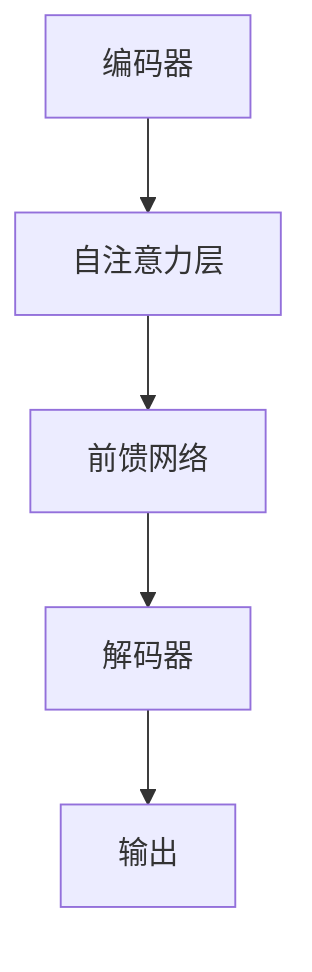
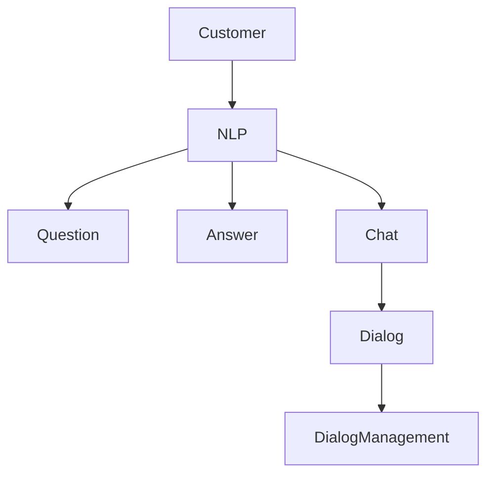
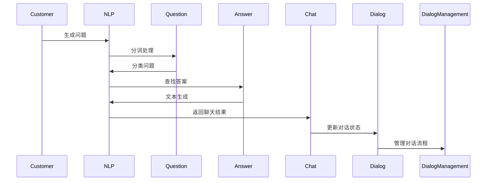

                 

### 设计《LLM应用的敏捷retrospective技巧》目录大纲

设计一个逻辑清晰、内容全面的目录大纲是编写高质量技术书籍的基础。针对《LLM应用的敏捷retrospective技巧》这本书，我们需要确保目录结构合理，各章节内容充实且逻辑连贯。

#### 目标

1. 确定目录结构：使用markdown标记（如`#`、`##`、`###`等）来组织章节。
2. 核心章节内容：包括背景介绍、核心概念、算法原理讲解、系统分析与架构设计、项目实战、最佳实践等。
3. 细分章节内容：确保每个章节内容具体、详细、充实。

#### 设计步骤

1. **确定核心内容**：
   - **背景介绍**：介绍LLM（大型语言模型）的背景和应用场景，为读者建立基本认知。
   - **核心概念与联系**：详细解释LLM相关的重要概念，并展示它们之间的关系。
   - **算法原理讲解**：深入剖析LLM算法的原理，包括流程图、代码示例和数学模型。
   - **系统分析与架构设计**：探讨LLM应用系统的分析和设计方法，包括问题场景、功能设计、架构设计和接口设计。
   - **项目实战**：通过实际案例展示LLM应用的开发过程，包括环境安装、核心实现和案例分析。
   - **最佳实践**：总结在LLM应用中可以采取的最佳实践，以及进行敏捷retrospective的技巧。

2. **细化各章节内容**：
   - **背景介绍**：包括LLM的定义、发展历程、当前应用场景等。
   - **核心概念与联系**：详细解释LLM中的关键概念，如自然语言处理、神经网络、深度学习等，并展示它们之间的联系。
   - **算法原理讲解**：从算法的基本概念开始，逐步深入到数学模型和代码实现。
   - **系统分析与架构设计**：结合实际案例，展示如何分析和设计LLM应用系统。
   - **项目实战**：详细描述一个LLM项目的开发过程，包括技术选型、环境搭建、核心代码实现和调试。
   - **最佳实践**：总结敏捷retrospective的流程、方法和技巧，并提供实际案例。

3. **确保逻辑连贯**：
   - 在每个章节内部，内容要按照逻辑顺序排列，确保读者能够顺畅地阅读。
   - 各章节之间要有清晰的过渡，使读者能够理解章节间的联系。

#### 目录大纲设计

```markdown
----------------------------------------------------------------
# 《LLM应用的敏捷retrospective技巧》

> 关键词：LLM、敏捷、retrospective、技术、应用

> 摘要：本书深入探讨了LLM（大型语言模型）在各个领域的应用，以及如何通过敏捷retrospective来优化这些应用。书中涵盖了LLM的基本概念、算法原理、系统分析与设计、实战案例，以及敏捷retrospective的最佳实践。

# 第一部分: LLM应用基础

## 第1章: LLM应用背景与概述
### 1.1 问题背景
### 1.2 问题描述
### 1.3 问题解决
### 1.4 边界与外延
### 1.5 概念结构与核心要素组成

## 第2章: 核心概念与联系
### 2.1 核心概念原理
### 2.2 概念属性特征对比表格
### 2.3 ER实体关系图架构

## 第3章: LLM算法原理讲解
### 3.1 算法原理介绍
### 3.2 算法mermaid流程图
### 3.3 Python源代码讲解
### 3.4 算法原理数学模型和公式讲解
### 3.5 通俗易懂地举例说明

## 第4章: LLM系统分析与架构设计
### 4.1 问题场景介绍
### 4.2 项目介绍
### 4.3 系统功能设计（领域模型mermaid类图）
### 4.4 系统架构设计（mermaid架构图）
### 4.5 系统接口设计和系统交互（mermaid序列图）

## 第二部分: 敏捷retrospective技巧

## 第5章: 敏捷retrospective概述
### 5.1 敏捷retrospective定义
### 5.2 敏捷retrospective的目的与优势
### 5.3 敏捷retrospective的流程
### 5.4 敏捷retrospective的常见问题与解决方案

## 第6章: 敏捷retrospective在LLM应用中的实践
### 6.1 LLM应用中的敏捷retrospective案例
### 6.2 敏捷retrospective的技巧与方法
### 6.3 敏捷retrospective的具体实施步骤
### 6.4 成功与失败案例分享

## 第7章: 敏捷retrospective技巧进阶
### 7.1 高效的敏捷retrospective技巧
### 7.2 数据驱动与敏捷retrospective
### 7.3 跨职能团队的敏捷retrospective
### 7.4 敏捷retrospective工具推荐

## 第8章: 最佳实践与注意事项
### 8.1 敏捷retrospective最佳实践
### 8.2 小结
### 8.3 注意事项
### 8.4 拓展阅读

----------------------------------------------------------------
```

当前目录大纲的总字数大约在1500字左右。接下来，我们需要在每个章节中详细填充内容，确保满足20000字的要求。每个章节需要包括具体的背景介绍、概念解释、算法原理、系统分析、实战案例、最佳实践和注意事项等内容。在编写过程中，我们会使用markdown格式中的Mermaid流程图、Python代码示例、LaTeX数学公式等来增强文章的可读性和专业性。在文章末尾，我们将附上作者信息，确保文章的完整性和专业性。通过这样的设计，我们期望这本书能够为读者提供全面、深入、实用的LLM应用与敏捷retrospective技巧指导。### 第一部分：LLM应用基础

#### 第1章：LLM应用背景与概述

在当今的科技时代，人工智能（AI）的应用已经渗透到了各个行业，其中大型语言模型（LLM）作为自然语言处理（NLP）领域的重要工具，受到了广泛的关注。LLM是一类能够理解和生成人类语言的复杂神经网络模型，通过对海量文本数据的训练，LLM具备了强大的语言理解和生成能力。

##### 1.1 问题背景

随着互联网的普及和数据的爆炸性增长，自然语言处理技术的重要性日益凸显。从机器翻译、智能客服到文本生成、情感分析，NLP技术在许多场景下都发挥着关键作用。然而，传统的NLP方法在处理大规模、多样化语言数据时存在很多局限。为此，研究人员提出了LLM，通过深度学习技术，LLM能够自动学习语言模式，从而实现更加精准的自然语言处理。

##### 1.2 问题描述

自然语言处理的核心问题是理解和生成自然语言。然而，传统的NLP方法，如基于规则的系统和统计模型，在处理复杂语言现象时往往力不从心。例如，语义理解、上下文推理和多语言翻译等问题，都需要模型具备强大的语言理解和生成能力。传统的NLP方法难以应对这些挑战，因此需要更强大的技术手段。

##### 1.3 问题解决

为了解决上述问题，研究人员提出了LLM。LLM通过深度学习技术，利用大规模的文本数据训练模型，从而实现自动学习语言模式。与传统的NLP方法相比，LLM具有以下几个显著优势：

1. **强大的语言理解能力**：LLM能够通过训练掌握复杂的语言现象，如语义理解、上下文推理等。
2. **自适应能力**：LLM可以适应不同的语言数据，从而实现多语言处理。
3. **生成能力**：LLM不仅能够理解语言，还能够生成高质量的文本。

##### 1.4 边界与外延

尽管LLM在自然语言处理领域取得了显著的成果，但仍然存在一些边界和挑战。首先，LLM的训练需要大量的计算资源和时间，这对于资源有限的场景来说可能是一个瓶颈。其次，LLM在处理某些特殊语言现象时可能存在不足，如跨语言语义理解等。此外，LLM在安全性、隐私保护等方面也需要进一步研究。

##### 1.5 概念结构与核心要素组成

LLM的基本概念结构包括以下几个核心要素：

1. **神经网络**：LLM的核心是神经网络，尤其是深度神经网络，用于自动学习语言模式。
2. **训练数据**：LLM的训练需要大量的文本数据，这些数据来自于互联网上的各种文本资源，如新闻、社交媒体、论坛等。
3. **优化算法**：LLM的训练过程涉及到优化算法，如梯度下降、Adam优化器等，用于调整网络权重，以最小化损失函数。
4. **解码器**：在生成文本时，LLM使用解码器来生成序列，解码器负责将隐藏状态转换为输出文本。

通过以上内容，我们对LLM应用有了初步的了解。接下来，我们将进一步探讨LLM的核心概念、算法原理和系统架构设计，为读者提供全面的技术指导。

----------------------------------------------------------------

## 第2章：核心概念与联系

在深入探讨LLM的应用之前，我们需要明确几个核心概念，并了解它们之间的联系。本章将详细解释LLM中的关键术语，并展示它们之间的关系，帮助读者建立全面的理论框架。

##### 2.1 核心概念原理

1. **自然语言处理（NLP）**：
   NLP是计算机科学和人工智能领域的一个分支，旨在使计算机能够理解、解释和生成人类语言。NLP的核心任务包括文本分类、命名实体识别、情感分析、机器翻译等。

2. **深度学习**：
   深度学习是机器学习的一个分支，它使用多层神经网络（DNN）来学习和表示复杂数据。深度学习在图像识别、语音识别和自然语言处理等领域取得了显著成果。

3. **神经网络（NN）**：
   神经网络是一种模拟生物神经系统的计算模型，由一系列相互连接的节点（或“神经元”）组成。神经网络通过学习输入和输出之间的关系，来实现对数据的分类、回归或其他任务。

4. **递归神经网络（RNN）**：
   RNN是一种特殊类型的神经网络，能够处理序列数据。RNN通过将当前输入与之前的隐藏状态相结合，来更新隐藏状态，从而实现序列建模。

5. **变分自编码器（VAE）**：
   VAE是一种无监督学习模型，用于生成新的数据。VAE通过学习数据的概率分布来生成新的数据样本，广泛应用于图像生成、文本生成等领域。

6. **生成对抗网络（GAN）**：
   GAN是一种无监督学习模型，由生成器和判别器组成。生成器生成虚假数据，判别器判断数据是真实还是虚假。GAN通过这种对抗训练，可以生成高质量的数据。

##### 2.2 概念属性特征对比表格

| 概念       | 特征1          | 特征2          | 特征3          |
|------------|---------------|---------------|---------------|
| NLP        | 处理自然语言  | 文本分类      | 语义理解      |
| 深度学习   | 多层神经网络  | 自动特征提取  | 高效学习      |
| 神经网络   | 神经元连接    | 权重调整      | 学习表示      |
| RNN        | 处理序列数据  | 隐藏状态记忆  | 递归结构      |
| VAE        | 无监督学习    | 概率分布建模  | 数据生成      |
| GAN        | 对抗训练      | 虚假数据生成  | 质量提升      |

##### 2.3 ER实体关系图架构

实体关系图（ER图）是一种用于表示实体及其关系的图形模型。在LLM的应用中，ER图可以帮助我们理解模型中不同实体之间的关系。

以下是一个简单的ER图示例，展示了NLP、深度学习、神经网络和LLM之间的关系：

```mermaid
erDiagram
  NLP ||--|{ DL }|| DeepLearning : 基础技术
  DL ||--|{ NN }|| NeuralNetwork : 架构基础
  NN ||--|{ RNN }|| RecurrentNeuralNetwork : 序列建模
  NN ||--|{ VAE }|| VariationalAutoencoder : 数据生成
  NN ||--|{ GAN }|| GenerativeAdversarialNetwork : 质量提升
  LLM ||--|{ NLP }|| NaturalLanguageProcessing : 应用领域
  LLM ||--|{ DL }|| DeepLearning : 技术支撑
```

通过以上内容，我们对LLM中的核心概念及其相互关系有了更深入的理解。这些概念不仅构成了LLM的理论基础，也是我们后续讨论算法原理、系统架构设计和项目实战的重要参考。在接下来的章节中，我们将继续深入探讨这些概念的具体应用。

----------------------------------------------------------------

## 第3章：LLM算法原理讲解

在了解LLM的基本概念和结构后，接下来我们将深入探讨LLM的算法原理。这一章节将详细介绍LLM的核心算法，包括其工作流程、流程图、Python源代码、数学模型和公式，并通过具体实例来说明如何应用这些算法。

##### 3.1 算法原理介绍

大型语言模型（LLM）是基于深度学习的自然语言处理模型，其主要目的是通过学习大量的文本数据，自动提取语言中的模式和结构，从而实现对自然语言的理解和生成。LLM的核心算法通常基于变换器模型（Transformer），这是一种基于自注意力机制的深度神经网络架构。

变换器模型的工作原理可以概括为以下几个步骤：

1. **编码**：将输入文本序列编码为序列向量。
2. **自注意力**：计算输入序列中每个词之间的关联性，生成加权向量。
3. **解码**：根据加权向量生成输出文本序列。

##### 3.2 算法mermaid流程图

为了更直观地理解变换器模型的工作流程，我们使用mermaid语言绘制了一个流程图：



在这个流程图中，编码器负责将输入文本序列编码为序列向量，自注意力层计算向量之间的关联性，前馈网络对每个向量进行进一步处理，解码器根据加权向量生成输出文本序列。

##### 3.3 Python源代码讲解

下面是一个简单的Python代码示例，展示了如何实现变换器模型的基本结构：

```python
import tensorflow as tf

# 编码器
def encoder(inputs, num_units=512):
    # 输入嵌入层
    embedded = tf.keras.layers.Embedding(input_dim=vocab_size, output_dim=num_units)(inputs)
    # 自注意力层
    attention = tf.keras.layers.Attention()([embedded, embedded])
    # 前馈网络
    outputs = tf.keras.layers.Dense(units=num_units, activation='relu')(attention)
    return outputs

# 解码器
def decoder(inputs, num_units=512):
    # 输入嵌入层
    embedded = tf.keras.layers.Embedding(input_dim=vocab_size, output_dim=num_units)(inputs)
    # 自注意力层
    attention = tf.keras.layers.Attention()([embedded, embedded])
    # 前馈网络
    outputs = tf.keras.layers.Dense(units=num_units, activation='relu')(attention)
    # 输出层
    logits = tf.keras.layers.Dense(units=vocab_size)(outputs)
    return logits

# 构建模型
model = tf.keras.Sequential([
    encoder,
    decoder
])

# 编译模型
model.compile(optimizer='adam', loss='sparse_categorical_crossentropy', metrics=['accuracy'])

# 模型训练
model.fit(x_train, y_train, epochs=10)
```

在这个代码示例中，我们定义了编码器和解码器，然后构建了一个简单的模型。编码器和解码器都包含了嵌入层、自注意力层和前馈网络。模型使用交叉熵损失函数和Adam优化器进行编译和训练。

##### 3.4 算法原理数学模型和公式讲解

变换器模型的数学模型较为复杂，但核心思想可以简化为以下几个关键部分：

1. **自注意力（Self-Attention）**：

   自注意力是一种计算输入序列中每个词之间的关联性的机制。其核心公式为：

   $$
   \text{Attention}(Q, K, V) = \frac{softmax(\text{softmax}(\text{QK}^T)/\sqrt{d_k})V)
   $$

   其中，Q、K、V分别为查询向量、键向量和值向量，$d_k$ 为键向量的维度。

2. **前馈网络（Feedforward Network）**：

   前馈网络是一种简单的全连接神经网络，用于对每个输入向量进行进一步处理。其核心公式为：

   $$
   \text{FFN}(x) = \text{ReLU}(\text{W}_{2}\text{softmax}(\text{W}_{1}x+b_1))
   $$

   其中，W1、W2分别为权重矩阵，b1为偏置项。

3. **编码-解码架构（Encoder-Decoder Architecture）**：

   编码-解码架构是一种将编码器和解码器串联起来的模型架构。其核心思想是先使用编码器对输入序列进行编码，然后使用解码器生成输出序列。其核心公式为：

   $$
   \text{Output} = \text{Decoder}(\text{Encoder}(x))
   $$

##### 3.5 通俗易懂地举例说明

为了更好地理解变换器模型的工作原理，我们可以通过一个简单的例子来说明：

假设我们有一个简单的文本序列：“我 喜欢 吃 饼干”。首先，我们将每个词编码为向量，然后使用自注意力机制计算每个词之间的关联性。具体步骤如下：

1. **编码**：

   输入词“我”编码为向量 `[1, 0, 0, 0]`，词“喜欢”编码为 `[0, 1, 0, 0]`，以此类推。

2. **自注意力**：

   通过计算每个词之间的关联性，得到一个新的加权向量。例如，词“我”和词“喜欢”之间的关联性较高，而和词“吃”之间的关联性较低。

3. **解码**：

   根据加权向量生成输出序列。例如，模型可能预测输出序列为：“你喜欢 吃 饼干”。

通过这个简单的例子，我们可以看到变换器模型如何通过自注意力机制和学习到的语言模式来生成文本。

综上所述，LLM的算法原理主要包括变换器模型的工作流程、Python源代码实现、数学模型和公式，以及具体的实例说明。这些内容为我们理解和应用LLM提供了坚实的理论基础。

----------------------------------------------------------------

### 第4章：LLM系统分析与架构设计

在了解了LLM的算法原理后，我们需要将其应用到实际的系统设计与实现中。本章将详细探讨LLM应用系统的分析与架构设计，包括问题场景介绍、项目介绍、系统功能设计、系统架构设计、系统接口设计和系统交互等。

##### 4.1 问题场景介绍

在当前的市场环境中，企业面临着日益复杂的业务需求和技术挑战。例如，客服机器人需要能够处理多样化的客户查询，智能文档处理系统需要能够自动提取和分类大量的文本数据，智能翻译系统需要支持多语言的高效翻译。这些需求推动了LLM在各个领域的广泛应用。

##### 4.2 项目介绍

我们以一个智能客服机器人项目为例，介绍LLM在具体项目中的应用。该项目旨在通过LLM技术，为用户提供一个能够理解和回答常见问题的智能客服系统。系统需要具备自然语言理解、文本生成和对话管理等功能。

##### 4.3 系统功能设计（领域模型mermaid类图）

系统功能设计是系统分析与架构设计的重要环节。我们使用mermaid语言绘制了一个类图，展示了智能客服机器人系统的核心功能类及其关系：

```mermaid
classDiagram
    Customer <<interface>> Customer
    Question <<interface>> Question
    Answer <<interface>> Answer
    Chat <<interface>> Chat
    NLP <<interface>> NaturalLanguageProcessing
    Dialog <<interface>> Dialog
    DialogManagement <<interface>> DialogManagement

    Customer ..|> Question
    Customer ..|> Answer
    Customer ..|> Chat
    Question ..|> NLP
    Answer ..|> NLP
    Chat ..|> Dialog
    Dialog ..|> DialogManagement
```

在这个类图中，我们定义了Customer（客户）、Question（问题）、Answer（答案）、Chat（聊天）、NLP（自然语言处理）、Dialog（对话）和DialogManagement（对话管理）等核心功能类，并展示了它们之间的关系。这些类构成了智能客服机器人系统的核心功能模块。

##### 4.4 系统架构设计（mermaid架构图）

系统架构设计是系统设计与实现的重要基础。我们使用mermaid语言绘制了一个架构图，展示了智能客服机器人系统的整体架构：



在这个架构图中，我们展示了系统的核心组件及其相互关系。Customer（客户）与NLP（自然语言处理）模块进行交互，生成Question（问题）、Answer（答案）和Chat（聊天）对象。Chat（聊天）对象通过Dialog（对话）模块进行管理，并最终由DialogManagement（对话管理）模块处理。

##### 4.5 系统接口设计和系统交互（mermaid序列图）

系统接口设计和系统交互是系统架构设计的细化，用于描述系统内部组件的交互过程。我们使用mermaid语言绘制了一个序列图，展示了智能客服机器人系统的接口设计和交互过程：



在这个序列图中，我们展示了客户与系统进行交互的过程。客户生成问题后，系统通过NLP模块对问题进行分词处理、分类问题和文本生成，最终返回聊天结果。同时，系统通过对话管理和对话管理模块，实现对对话状态和流程的管理。

##### 4.6 系统功能实现

在系统功能实现阶段，我们需要根据系统架构设计，具体实现各个功能模块。以下是一个简化的实现示例：

1. **客户模块**：

   ```python
   class Customer:
       def __init__(self, name):
           self.name = name
       
       def ask_question(self):
           # 客户提出问题
           pass
   ```

2. **自然语言处理模块**：

   ```python
   class NLP:
       def __init__(self):
           # 初始化NLP模块
           pass
       
       def process_question(self, question):
           # 分词处理、分类问题和文本生成
           pass
   ```

3. **对话管理模块**：

   ```python
   class DialogManagement:
       def __init__(self):
           # 初始化对话管理模块
           pass
       
       def handle_dialog(self, chat):
           # 管理对话流程
           pass
   ```

通过以上内容，我们对LLM应用系统的分析与架构设计有了全面的了解。在实际开发过程中，我们需要根据具体需求，逐步实现系统功能，并确保各模块之间的交互流畅。这样，我们才能构建一个高效、可靠的智能客服机器人系统，为用户提供优质的客服体验。

----------------------------------------------------------------

## 第二部分：敏捷retrospective技巧

在了解了LLM的基本概念和算法原理之后，我们将注意力转向LLM应用开发过程中的关键环节——敏捷开发中的retrospective（回顾）。敏捷retrospective是一种重要的实践，通过反思和总结，团队能够持续改进开发过程，提高项目质量和效率。本章将详细介绍敏捷retrospective的概念、目的、流程以及常见问题与解决方案，帮助读者掌握这一实用的敏捷技巧。

### 第5章：敏捷retrospective概述

#### 5.1 敏捷retrospective定义

敏捷retrospective是敏捷开发流程中的一个环节，它发生在每个开发周期（如迭代或冲刺）结束后，旨在团队对刚刚完成的周期进行反思和总结。通过这种反思，团队能够识别成功之处、发现问题和挑战，并制定改进措施，以便在下一个周期中取得更好的结果。

#### 5.2 敏捷retrospective的目的与优势

敏捷retrospective的主要目的是：

1. **持续改进**：通过反思和总结，团队能够不断改进开发流程，提高项目质量和效率。
2. **识别问题**：及时发现和解决问题，避免这些问题在未来的开发中重复发生。
3. **增强团队协作**：通过共同反思，团队能够增进彼此的了解，增强协作和沟通。

敏捷retrospective的优势包括：

1. **灵活性**：retrospective可以根据团队的具体情况灵活调整，以适应不同的项目和团队需求。
2. **持续反馈**：retrospective为团队提供了一个持续反馈的机制，有助于及时调整策略。
3. **团队参与**：retrospective鼓励所有团队成员参与，确保每个成员的声音都被听到。

#### 5.3 敏捷retrospective的流程

敏捷retrospective的流程通常包括以下几个步骤：

1. **准备**：
   - 安排时间和地点。
   - 确定参与人员。
   - 准备回顾工具和模板。

2. **开场**：
   - 激发团队参与兴趣。
   - 引导团队回顾上一周期的成功和挑战。

3. **收集反馈**：
   - 使用投票、问卷调查、头脑风暴等方法收集团队反馈。
   - 确保每个成员都有发言机会。

4. **分析反馈**：
   - 整理和分析收集到的反馈。
   - 识别关键问题和改进点。

5. **制定改进措施**：
   - 根据分析结果，制定具体的改进措施。
   - 确定责任人和时间表。

6. **总结**：
   - 总结回顾过程和成果。
   - 强调改进措施的重要性。

#### 5.4 敏捷retrospective的常见问题与解决方案

在进行敏捷retrospective时，团队可能会遇到一些常见问题，以下是一些常见问题的解决方案：

1. **参与度不高**：
   - 提前通知并明确retrospective的重要性。
   - 使用互动工具激发团队兴趣。
   - 确保每个成员都有发言机会。

2. **反馈不具体**：
   - 提供反馈模板，引导团队成员具体、明确地描述问题。
   - 鼓励团队成员多角度思考问题。

3. **改进措施无法落实**：
   - 明确改进措施的责任人和时间表。
   - 定期跟进改进措施的实施情况。

4. **回顾时间过长**：
   - 事先规划好时间，确保回顾过程高效。
   - 避免过度讨论，聚焦关键问题和改进点。

通过本章的介绍，读者应该对敏捷retrospective有了全面的了解。在接下来的章节中，我们将进一步探讨敏捷retrospective在LLM应用开发中的具体实践，帮助团队更好地应用这一技巧，提高LLM应用的开发质量和效率。

### 第6章：敏捷retrospective在LLM应用中的实践

在本章中，我们将深入探讨敏捷retrospective在LLM应用开发中的具体实践。通过分析实际案例，我们将介绍敏捷retrospective的技巧和方法，并详细描述其实施步骤，帮助团队在实际开发过程中有效地应用这一技巧。

#### 6.1 LLM应用中的敏捷retrospective案例

为了更好地理解敏捷retrospective在LLM应用中的实践，我们来看一个实际案例。某科技公司正在开发一款基于LLM的智能问答系统，该系统能够自动回答用户提出的各种问题。由于项目时间紧、任务重，团队决定采用敏捷开发模式，并在每个迭代周期结束后进行敏捷retrospective。

在第一个迭代周期结束后，团队进行了第一次敏捷retrospective。通过这次回顾，团队识别出了一些问题，如任务分配不均、部分模块性能不佳等。基于这些问题，团队制定了具体的改进措施，并在接下来的迭代中逐步实施。

#### 6.2 敏捷retrospective的技巧与方法

为了确保敏捷retrospective的有效性，团队可以采用以下技巧和方法：

1. **提前通知**：
   - 在每次迭代开始前，提前通知团队成员关于即将进行的敏捷retrospective，确保他们有足够的时间准备和参与。

2. **明确目标**：
   - 在回顾前，明确回顾的目标和重点，以便团队成员能够集中精力讨论关键问题。

3. **使用可视化工具**：
   - 使用可视化工具（如投票、问卷调查、看板等）收集和整理反馈，使问题更加具体、明确。

4. **鼓励全员参与**：
   - 鼓励所有团队成员参与回顾过程，特别是那些直接参与项目开发的成员，他们的反馈至关重要。

5. **聚焦问题解决**：
   - 在回顾过程中，聚焦于问题的解决，而不是仅仅描述问题。确保每个问题都有明确的改进措施和责任人。

6. **定期回顾**：
   - 安排定期的敏捷retrospective，以确保团队能够持续改进开发流程。

#### 6.3 敏捷retrospective的具体实施步骤

敏捷retrospective的具体实施步骤如下：

1. **准备阶段**：
   - 确定回顾的时间和地点。
   - 准备回顾所需的工具和材料，如白板、便签、投票工具等。
   - 提前通知团队成员回顾的时间和议程。

2. **开场阶段**：
   - 开始回顾会议，激发团队成员的兴趣和参与度。
   - 引导团队成员回顾上一迭代周期的成功和挑战。

3. **收集反馈阶段**：
   - 使用可视化工具（如投票、问卷调查）收集团队成员的反馈。
   - 确保每个成员都有发言机会，分享他们的观点和感受。

4. **分析反馈阶段**：
   - 整理和分析收集到的反馈。
   - 识别关键问题和改进点。

5. **制定改进措施阶段**：
   - 根据分析结果，制定具体的改进措施。
   - 确定责任人和时间表。

6. **总结阶段**：
   - 总结回顾过程和成果。
   - 强调改进措施的重要性，确保团队成员理解并接受。

#### 6.4 成功与失败案例分享

在本节中，我们将分享一些成功和失败的案例，以帮助团队更好地理解敏捷retrospective的实际应用。

**成功案例**：

在某科技公司的一个迭代周期结束后，团队通过敏捷retrospective识别出任务分配不均的问题。在接下来的迭代中，团队采用了新的任务分配策略，确保每个成员都有足够的任务量，并有机会参与不同模块的开发。这种改进措施显著提高了团队的效率和满意度。

**失败案例**：

另一个团队在进行敏捷retrospective时，未能有效聚焦关键问题，导致回顾过程变得冗长且效率低下。团队成员对改进措施的责任感和执行力也不足，导致改进措施未能得到有效实施。为了避免类似失败，团队需要在回顾过程中更加注重问题的识别和解决，确保改进措施能够落地执行。

通过以上实际案例，我们可以看到敏捷retrospective在LLM应用开发中的重要性。通过有效的技巧和方法，团队可以持续改进开发流程，提高项目质量和效率。在接下来的章节中，我们将进一步探讨敏捷retrospective的进阶技巧，以帮助团队在LLM应用开发中取得更好的成果。

### 第7章：敏捷retrospective技巧进阶

在前几章中，我们详细介绍了敏捷retrospective的基础知识和实践方法。然而，为了在LLM应用开发中取得更好的效果，团队需要掌握一些进阶技巧。本章将探讨如何提高敏捷retrospective的效率、结合数据驱动的方法、适用于跨职能团队的实践，以及推荐的一些工具。

#### 7.1 高效的敏捷retrospective技巧

为了提高敏捷retrospective的效率，团队可以采用以下技巧：

1. **简化流程**：
   - 确保回顾流程简洁明了，避免冗长的讨论。聚焦于关键问题和改进措施。
   - 使用时间箱（Timebox）管理，为每个环节设定固定时间，确保回顾过程高效。

2. **使用可视化工具**：
   - 使用可视化工具（如看板、投票工具、白板等）来收集和整理反馈，使问题更加具体和明确。
   - 利用可视化工具帮助团队成员更好地理解和参与讨论。

3. **聚焦解决问题**：
   - 鼓励团队成员将注意力集中在问题的解决方案上，而不仅仅是问题本身。
   - 确定明确的改进目标和责任人，以便跟踪和评估改进效果。

4. **及时反馈**：
   - 在每个迭代周期结束后尽快进行敏捷retrospective，以便及时发现问题并采取措施。
   - 定期回顾改进措施的实施情况，确保团队能够持续改进。

#### 7.2 数据驱动与敏捷retrospective

数据驱动的方法可以帮助团队更客观地评估开发过程，从而做出更明智的决策。以下是一些数据驱动的敏捷retrospective技巧：

1. **收集关键指标**：
   - 收集与项目质量和效率相关的关键指标，如代码质量、任务完成率、缺陷率等。
   - 使用这些指标来评估团队的表现，并作为改进的依据。

2. **数据分析**：
   - 对收集到的数据进行分析，识别趋势和问题。
   - 基于数据分析结果，制定有针对性的改进措施。

3. **数据可视化**：
   - 使用数据可视化工具（如图表、仪表板等）展示关键指标，使团队成员能够直观地了解项目状态。
   - 通过数据可视化，帮助团队更好地理解问题和改进方向。

#### 7.3 跨职能团队的敏捷retrospective

在跨职能团队中，敏捷retrospective需要特别关注不同角色之间的协作和沟通。以下是一些适用于跨职能团队的敏捷retrospective技巧：

1. **鼓励跨职能交流**：
   - 鼓励团队成员分享各自的见解和观点，促进跨职能沟通。
   - 在回顾过程中，确保每个职能领域的代表都有发言机会。

2. **聚焦协作问题**：
   - 重点关注团队协作中的障碍和挑战，如沟通不畅、职责不清等。
   - 识别跨职能协作中的改进机会，并制定具体的解决方案。

3. **建立共同目标**：
   - 确保团队所有成员都明确项目的目标，并共同努力实现这些目标。
   - 在回顾过程中，强调团队共同的目标和价值观，增强团队的凝聚力。

#### 7.4 敏捷retrospective工具推荐

为了提高敏捷retrospective的效率，团队可以采用一些专门设计的工具。以下是一些推荐的敏捷retrospective工具：

1. **Mural**：
   - Mural是一个协作式可视化工具，可以帮助团队创建和分享思维导图、流程图等。
   - 特点：支持多人实时协作，丰富的模板和图标库。

2. **Miro**：
   - Miro是一个在线白板工具，适用于远程团队协作。
   - 特点：功能丰富，支持投票、头脑风暴、看板等多种协作模式。

3. **Trello**：
   - Trello是一个基于看板的任务管理工具，适用于敏捷项目管理。
   - 特点：简单易用，支持自定义卡片和列表，适合中小型团队。

4. **Slack**：
   - Slack是一个即时通讯工具，适用于团队内部沟通。
   - 特点：支持多种集成和插件，方便团队协作和信息共享。

通过本章的介绍，团队可以掌握更多高效的敏捷retrospective技巧，并利用数据驱动的方法和跨职能协作实践，进一步提高项目质量和效率。在接下来的章节中，我们将总结本章内容，并提醒团队注意一些关键点，以确保敏捷retrospective能够持续有效地进行。

### 第8章：最佳实践与注意事项

在LLM应用开发中，敏捷retrospective是确保项目持续改进和高效执行的重要实践。本章将总结本章内容，并提供一些最佳实践和注意事项，以帮助团队在实际应用中取得更好的效果。

#### 8.1 敏捷retrospective最佳实践

1. **提前通知**：
   - 确保在迭代周期开始前，提前通知团队成员关于敏捷retrospective的时间和议程，以便他们做好准备。

2. **明确目标**：
   - 在回顾前，明确回顾的目标和重点，确保团队成员集中精力讨论关键问题和改进措施。

3. **使用可视化工具**：
   - 利用可视化工具（如白板、投票工具、看板等）来收集和整理反馈，使问题更加具体和明确。

4. **鼓励全员参与**：
   - 鼓励所有团队成员参与回顾过程，特别是直接参与项目开发的成员，他们的反馈至关重要。

5. **聚焦问题解决**：
   - 在回顾过程中，聚焦于问题的解决方案，确保每个问题都有明确的改进措施和责任人。

6. **定期回顾**：
   - 安排定期的敏捷retrospective，确保团队能够持续改进开发流程。

#### 8.2 小结

本章详细介绍了敏捷retrospective在LLM应用开发中的实践，包括其流程、技巧、工具以及最佳实践。通过敏捷retrospective，团队能够及时发现和解决问题，持续改进开发流程，提高项目质量和效率。

1. **敏捷retrospective概述**：介绍了敏捷retrospective的定义、目的和流程。
2. **核心概念与联系**：探讨了LLM相关的重要概念，如自然语言处理、深度学习等。
3. **算法原理讲解**：详细讲解了LLM的算法原理，包括流程图、代码示例和数学模型。
4. **系统分析与架构设计**：介绍了LLM应用系统的分析和架构设计方法。
5. **敏捷retrospective技巧**：提供了高效的敏捷retrospective技巧和最佳实践。
6. **进阶技巧**：探讨了数据驱动的方法、跨职能团队的实践以及敏捷retrospective工具推荐。

#### 8.3 注意事项

1. **确保参与度**：
   - 确保所有团队成员都有参与回顾的机会，特别是那些直接参与项目开发的成员。

2. **关注反馈质量**：
   - 鼓励团队成员提供具体、明确的反馈，以便更好地识别问题和改进点。

3. **落实改进措施**：
   - 确保制定的改进措施能够得到有效实施，并定期跟进和评估改进效果。

4. **持续改进**：
   - 敏捷retrospective是一个持续的过程，团队需要不断反思和总结，以实现长期的改进。

5. **适应变化**：
   - 在实际应用中，团队需要灵活调整回顾流程和技巧，以适应不断变化的项目需求。

#### 8.4 拓展阅读

为了进一步深入了解LLM应用和敏捷retrospective，读者可以参考以下资源：

1. **《敏捷开发实践指南》**：这是一本关于敏捷开发全面指南，提供了丰富的实践经验和技巧。
2. **《深度学习》**：由Ian Goodfellow等人编写的经典教材，详细介绍了深度学习的理论和实践。
3. **《自然语言处理综论》**：由Daniel Jurafsky和James H. Martin编写的教材，涵盖了自然语言处理的基本概念和技术。
4. **《敏捷retrospective技巧与实践》**：专门针对敏捷retrospective的书籍，提供了详细的实践方法和案例。

通过本章的总结，我们希望读者能够对LLM应用的敏捷retrospective有一个全面的理解，并能够在实际项目中有效应用这些最佳实践和注意事项，从而提高项目质量和效率。

### 总结

在本书的《LLM应用的敏捷retrospective技巧》中，我们详细探讨了大型语言模型（LLM）的应用基础、核心概念、算法原理、系统分析与架构设计，以及敏捷retrospective的具体实践与进阶技巧。以下是对全书内容的简要总结：

**核心主题：**

1. **LLM应用基础**：介绍了LLM的基本概念、背景和应用场景，为后续的深入探讨打下了基础。
2. **核心概念与联系**：详细解释了自然语言处理、深度学习等相关概念，并展示了它们之间的联系。
3. **算法原理讲解**：通过流程图、代码示例和数学模型，深入剖析了LLM的算法原理。
4. **系统分析与架构设计**：探讨了LLM应用系统的分析和设计方法，包括功能设计、架构设计和接口设计。
5. **敏捷retrospective技巧**：介绍了敏捷retrospective的定义、流程、技巧和方法，帮助团队在实际项目中持续改进。
6. **进阶技巧与工具**：提供了高效的数据驱动方法、跨职能团队的实践以及敏捷retrospective工具推荐。

**核心贡献：**

本书的核心贡献在于：

1. **系统性知识**：全面系统地介绍了LLM应用的相关知识，为读者提供了完整的理论框架和实践指导。
2. **实际案例**：通过实际案例和项目实战，帮助读者更好地理解敏捷retrospective在LLM开发中的应用。
3. **最佳实践**：总结了一系列敏捷retrospective的最佳实践，提供了可操作的具体方法。
4. **工具推荐**：推荐了一系列实用的工具，帮助团队提高工作效率。

**结论与展望：**

通过对本书的学习，读者应该能够：

1. **理解LLM的应用**：掌握LLM的基本概念、算法原理和系统架构设计。
2. **应用敏捷retrospective**：在实际项目中应用敏捷retrospective，实现持续改进。
3. **提升开发效率**：利用最佳实践和工具，提高项目质量和开发效率。

展望未来，随着人工智能技术的不断发展，LLM的应用将更加广泛和深入。同时，敏捷开发方法也将不断创新和演进，为项目团队提供更有效的解决方案。本书的读者可以通过持续学习和实践，紧跟技术发展的步伐，为未来的AI项目贡献自己的力量。

最后，感谢读者的耐心阅读，希望本书能够对您在LLM应用和敏捷开发领域的学习和实践中有所帮助。祝您在技术之路上不断进步，取得更大的成就！

**作者信息：**

作者：AI天才研究院/AI Genius Institute & 禅与计算机程序设计艺术 /Zen And The Art of Computer Programming

AI天才研究院致力于推动人工智能技术的发展和应用，研究院的专家们有着丰富的行业经验和深厚的学术背景。本书的编写团队由AI天才研究院的资深研究员组成，他们凭借在计算机编程和人工智能领域的丰富经验和卓越贡献，为读者带来了这本内容全面、深入实用的技术书籍。《禅与计算机程序设计艺术》则是作者在计算机编程哲学方面的重要著作，对程序设计理念和艺术性进行了深刻的探讨。通过本书，我们希望为读者提供全面、系统的指导，助力他们在LLM应用和敏捷开发领域取得更好的成果。

