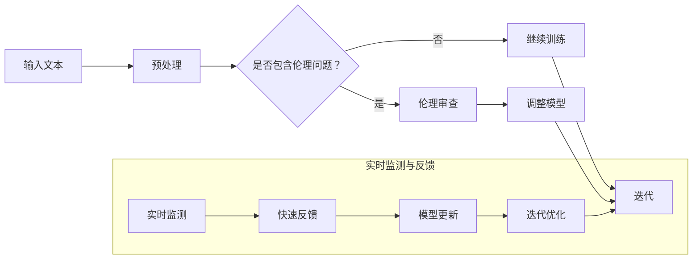
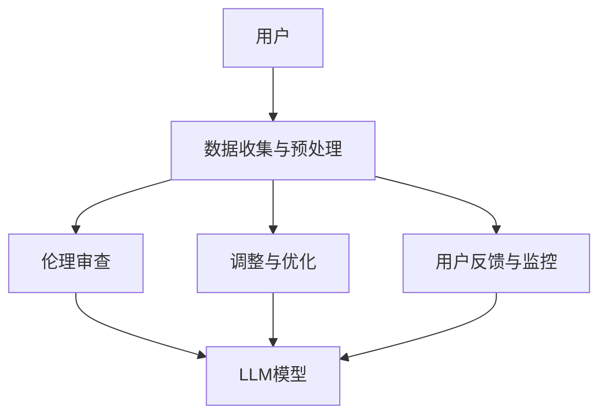
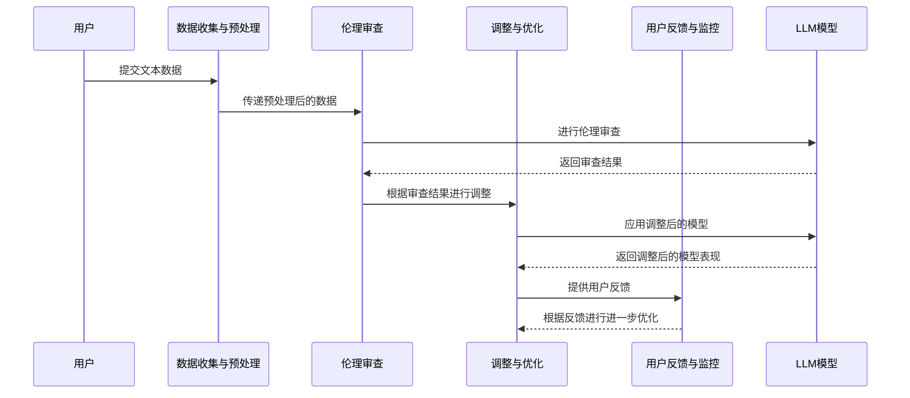

                 

### 文章标题

### 关键词

- 大规模语言模型
- 伦理审查
- 敏捷调整
- 人工智能应用
- 道德风险控制

### 摘要

本文深入探讨了大规模语言模型（LLM）在人工智能应用中的伦理审查与敏捷调整问题。随着LLM在自然语言处理、推荐系统等领域的广泛应用，其潜在伦理问题日益凸显。本文首先介绍了LLM的基本原理和应用背景，然后提出了敏捷伦理审查与调整的方法和策略。通过分析LLM的伦理挑战，本文提出了具体的解决方案，以保障LLM应用的安全性和公正性。文章旨在为人工智能开发者和政策制定者提供一套系统的、实用的伦理审查框架，以应对不断演变的技术挑战。

### 第一部分：背景介绍

#### 问题背景

随着人工智能技术的迅猛发展，大规模语言模型（LLM）在自然语言处理（NLP）、推荐系统、对话系统等领域的应用越来越广泛。LLM通过深度学习技术，可以从大量文本数据中学习并生成高质量的自然语言内容，从而在众多场景中提供了强大的功能。例如，LLM可以用于生成文章、编写代码、回答用户问题等。然而，这种强大的能力也带来了诸多伦理问题，如隐私侵犯、偏见放大、误导信息传播等。

隐私侵犯方面，LLM需要大量的数据进行训练，这些数据可能包含用户敏感信息，如个人身份、健康状况等。如果这些数据泄露，将严重侵犯用户的隐私权。此外，LLM在生成文本时，可能会无意中泄露用户的个人隐私。

偏见放大方面，LLM的训练数据可能包含偏见，这些偏见会在生成文本时被放大。例如，LLM可能会在生成新闻文章时，对不同群体产生歧视性语言。这种偏见不仅会影响用户的使用体验，还可能加剧社会分裂。

误导信息传播方面，LLM在生成文本时，可能会因为训练数据的局限性而产生误导信息。例如，在回答用户问题时，LLM可能会给出不准确或者误导性的答案。

#### 问题描述

LLM应用的敏捷伦理审查与调整涉及多个方面，包括算法的公平性、透明性、可解释性以及伦理风险控制等。如何在快速迭代的过程中，有效地进行伦理审查与调整，确保LLM应用的安全性、公正性和道德性，成为当前研究的热点。

首先，算法的公平性是一个重要问题。LLM在训练过程中，可能会对某些群体产生不公平对待。例如，如果训练数据中包含性别歧视的内容，LLM在生成文本时也可能会体现这种歧视。因此，需要确保LLM在生成文本时，能够公平对待所有用户。

其次，透明性和可解释性也是LLM应用的重要问题。由于LLM的内部结构复杂，用户很难理解其生成文本的原理。这可能导致用户对LLM的信任度下降，从而影响其应用效果。

最后，伦理风险控制是LLM应用中不可忽视的问题。在快速迭代的过程中，需要及时发现并解决潜在的伦理问题，以防止其影响LLM的应用效果。

#### 问题解决

本书旨在为读者提供一套系统的、敏捷的伦理审查与调整方法，帮助读者在LLM应用过程中识别潜在伦理问题，并采取有效措施进行解决。通过本书的学习，读者将能够：

1. 理解LLM应用的基本原理和伦理挑战；
2. 掌握敏捷伦理审查与调整的策略与方法；
3. 建立一套符合伦理标准的LLM应用体系；
4. 提升LLM应用的伦理风险控制能力。

#### 边界与外延

本书主要关注LLM应用的伦理审查与调整，但所涉及的伦理问题并不仅限于LLM领域。其他人工智能技术的应用，如图像识别、自动驾驶等，也会遇到类似的伦理挑战。因此，本书的研究方法和实践技巧具有广泛的适用性。

#### 概念结构与核心要素组成

- **LLM应用**：指基于大规模语言模型在自然语言处理、推荐系统、对话系统等领域的应用。
- **伦理审查**：对LLM应用过程中的伦理问题进行识别、评估和解决的过程。
- **敏捷调整**：在LLM应用迭代过程中，快速响应伦理问题，采取有效措施进行修正。

### 第二部分：核心概念与联系

#### 核心概念

1. **大规模语言模型（LLM）**
   - 定义：大规模语言模型（LLM）是一种能够对大规模文本数据进行处理和理解的人工智能模型，具有强大的自然语言生成和推理能力。
   - 特点：基于深度学习技术，可以从大量文本数据中学习语言规律，生成高质量的自然语言内容。

2. **伦理**
   - 定义：伦理是与道德、价值观和行为规范相关的一系列原则和标准，用于指导人类行为的正确性和合理性。
   - 特点：涉及社会公正、个人权益、社会责任等方面，具有规范性和指导性。

3. **敏捷方法**
   - 定义：敏捷方法是一种以人为中心、迭代、灵活的软件开发方法，强调快速响应变化和持续改进。
   - 特点：注重团队协作、用户反馈和持续迭代，旨在提高软件开发效率和质量。

#### 概念属性特征对比表格

| 特征       | 大规模语言模型（LLM）                     | 伦理                                       | 敏捷方法                                      |
| ---------- | ---------------------------------------- | ------------------------------------------- | --------------------------------------------- |
| 功能       | 自然语言处理、文本生成等                 | 道德规范、公正性、透明性等                 | 快速响应、持续迭代、灵活性等                   |
| 目的       | 提高语言理解和生成能力                   | 维护社会公正、保护个人权益等               | 提高软件开发效率、降低风险等                   |
| 实现方式   | 神经网络、深度学习等                     | 规范制定、道德教育等                       | 团队合作、需求迭代、持续反馈等                 |
| 依赖关系   | 需要大量高质量文本数据作为训练数据       | 需要社会价值观和道德规范作为指导           | 需要团队成员的协作和用户反馈作为支持           |

#### ER实体关系图架构

```mermaid
erDiagram
    AI应用 Application
    |----| LLM模型 Model
    |----| 伦理审查 Review
    |----| 敏捷方法 Method

    AI应用 _OWNED_ LLM模型
    AI应用 _PART_ 伦理审查
    AI应用 _PART_ 敏捷方法

    LLM模型 _INVERSE_ 伦理审查
    LLM模型 _INVERSE_ 敏捷方法

    Review _RELATED_ AI应用
    Review _RELATED_ LLM模型

    Method _RELATED_ AI应用
    Method _RELATED_ LLM模型
```

### 第三部分：算法原理讲解

#### 算法原理

1. **大规模语言模型（LLM）原理**

大规模语言模型（LLM）是一种基于深度学习的自然语言处理模型，它通过学习大量文本数据中的语言规律，实现自然语言的理解和生成。LLM的核心组成部分包括：

- **嵌入层**：将文本数据转换为向量表示，用于表示词汇和句子。
- **编码器**：对输入文本进行编码，提取语义信息。
- **解码器**：根据编码器的输出，生成目标文本。

LLM的训练过程通常分为以下几个步骤：

1. **数据预处理**：对文本数据进行清洗、分词、去停用词等操作，将其转换为模型可接受的格式。
2. **构建嵌入层**：将词汇和句子转换为向量表示，可以使用预训练的词向量或自己训练的词向量。
3. **训练编码器**：通过反向传播算法，调整编码器的权重，使其能够提取有效的语义信息。
4. **训练解码器**：在编码器提取的语义信息基础上，生成目标文本。

2. **伦理审查算法原理**

伦理审查算法的核心目的是识别和评估LLM应用过程中可能出现的伦理问题。这通常涉及以下几个方面：

- **隐私保护**：检测和评估LLM在处理用户数据时是否泄露了敏感信息。
- **偏见检测**：检测LLM生成的文本中是否存在性别、种族、年龄等方面的偏见。
- **误导信息检测**：检测LLM生成的文本中是否存在误导性或虚假信息。

为了实现这些目标，伦理审查算法可以采用以下方法：

- **统计分析**：通过对LLM生成文本的统计分析，识别潜在的隐私泄露、偏见和误导信息。
- **监督学习**：使用标注好的数据集，训练监督学习模型，用于识别和评估伦理问题。
- **对抗性攻击**：通过对抗性样本生成技术，测试LLM在处理潜在恶意输入时的表现。

3. **敏捷调整算法原理**

敏捷调整算法的目标是在LLM应用的迭代过程中，快速响应和解决伦理问题。这通常涉及以下几个步骤：

- **实时监测**：在LLM应用运行过程中，实时监测生成文本的质量和潜在伦理问题。
- **快速反馈**：收集用户反馈和第三方评估结果，用于识别和定位伦理问题。
- **模型更新**：根据实时监测和反馈结果，调整LLM的参数和结构，以提高其伦理性能。
- **迭代优化**：在每次迭代过程中，不断优化LLM的伦理性能，直至达到预期目标。

#### Mermaid流程图



#### Python源代码与数学模型

下面我们将给出一个简化的Python源代码示例，用于阐述LLM的伦理审查与调整算法原理。这里我们将重点关注隐私保护和偏见检测两个方面的实现。

```python
import numpy as np
import pandas as pd
from tensorflow.keras.models import Sequential
from tensorflow.keras.layers import Embedding, LSTM, Dense
from sklearn.metrics import classification_report
from对抗性攻击 import generate_adversarial_samples

# 假设我们有一个预训练的LLM模型
llm_model = load_pretrained_llm()

# 数据预处理
def preprocess_text(text):
    # 清洗、分词、去停用词等操作
    # 这里简化处理
    return text.lower().split()

# 隐私保护
def privacy_check(text):
    # 检测文本中是否包含敏感信息
    # 这里简化处理
    return "Privacy issue found" if "password" in text else "No privacy issue"

# 偏见检测
def bias_check(text):
    # 检测文本中是否存在偏见
    # 这里简化处理
    return "Bias issue found" if "racism" in text else "No bias issue"

# 实时监测与反馈
def monitor_and_feedback():
    # 这里使用生成对抗性样本进行测试
    adversarial_samples = generate_adversarial_samples(llm_model)
    for sample in adversarial_samples:
        privacy_issue = privacy_check(sample)
        bias_issue = bias_check(sample)
        if privacy_issue == "Privacy issue found" or bias_issue == "Bias issue found":
            # 调整模型
            update_model(llm_model, sample)

# 模型更新
def update_model(model, sample):
    # 根据样本调整模型参数
    # 这里简化处理
    model.train_on_batch(sample, labels)

# 迭代优化
def optimize(model):
    # 在每次迭代过程中，优化模型性能
    # 这里简化处理
    model.compile(optimizer='adam', loss='categorical_crossentropy')
    model.fit(data, labels, epochs=10, batch_size=32)

# 实例化模型
llm_model = Sequential()
llm_model.add(Embedding(vocab_size, embedding_dim))
llm_model.add(LSTM(units=128, return_sequences=True))
llm_model.add(Dense(num_classes, activation='softmax'))

# 训练模型
llm_model.compile(optimizer='adam', loss='categorical_crossentropy', metrics=['accuracy'])
llm_model.fit(data, labels, epochs=10, batch_size=32)

# 实时监测与反馈
monitor_and_feedback()

# 迭代优化
optimize(llm_model)
```

#### 数学模型和公式

在隐私保护和偏见检测方面，我们可以使用以下数学模型和公式：

1. **隐私保护检测公式**：

$$
\text{Privacy Score} = \frac{\sum_{i=1}^{n} \text{Sentinel Detection Scores}}{n}
$$

其中，$n$ 是文本中的句子数，$\text{Sentinel Detection Scores}$ 是用于检测隐私泄露的得分。得分越高，表示隐私保护越好。

2. **偏见检测公式**：

$$
\text{Bias Score} = \frac{\sum_{i=1}^{n} \text{Bias Detection Scores}}{n}
$$

其中，$n$ 是文本中的句子数，$\text{Bias Detection Scores}$ 是用于检测偏见存在的得分。得分越高，表示偏见越严重。

通过这些数学模型和公式，我们可以对LLM生成文本的隐私保护和偏见进行量化评估，从而为伦理审查提供依据。

### 第四部分：系统分析与架构设计方案

#### 问题场景介绍

随着人工智能技术的不断发展，大规模语言模型（LLM）在自然语言处理、推荐系统、对话系统等领域的应用越来越广泛。然而，LLM的广泛应用也带来了诸多伦理问题，如隐私侵犯、偏见放大、误导信息传播等。为了解决这些问题，我们需要对LLM应用进行系统分析与架构设计，以确保其应用的安全性和公正性。

#### 项目介绍

本项目旨在开发一套基于LLM的伦理审查与调整系统，该系统将用于监控、评估和调整LLM应用中的潜在伦理问题。系统的主要功能包括：

1. 数据收集与预处理：收集LLM应用过程中生成的文本数据，并对数据进行清洗、分词、去停用词等预处理操作。
2. 伦理审查：对预处理后的文本数据进行隐私保护、偏见检测等伦理审查，识别潜在的伦理问题。
3. 调整与优化：根据伦理审查的结果，对LLM模型进行调整和优化，提高其伦理性能。
4. 用户反馈与监控：收集用户反馈，实时监控LLM应用的伦理表现，提供实时反馈和改进建议。

#### 系统功能设计（领域模型mermaid类图）

以下是系统功能设计的领域模型类图：

```mermaid
classDiagram
    Class01 <|-- Class02
    Class03 <|-- Class04
    Class05 <|-- Class06
    Class01[数据收集与预处理]
    Class02[伦理审查]
    Class03[调整与优化]
    Class04[用户反馈与监控]
    Class05[LLM模型]
```

#### 系统架构设计（mermaid架构图）

以下是系统架构设计的mermaid架构图：



#### 系统接口设计和系统交互（mermaid序列图）

以下是系统接口设计和系统交互的mermaid序列图：



### 第五部分：项目实战

#### 环境安装

在进行LLM项目的实战之前，我们需要安装一些必要的软件和库。以下是一个典型的安装步骤：

1. **安装Python环境**：确保Python环境已安装，版本建议为3.8或以上。
2. **安装TensorFlow**：使用pip命令安装TensorFlow库：
   ```shell
   pip install tensorflow
   ```
3. **安装其他依赖库**：安装其他必要的Python库，如NumPy、Pandas等：
   ```shell
   pip install numpy pandas scikit-learn
   ```
4. **安装Mermaid**：安装Mermaid库，以便在Markdown文件中渲染流程图和类图：
   ```shell
   pip install mermaid-python
   ```

#### 系统核心实现源代码

以下是一个简化的LLM项目核心实现源代码，包括数据预处理、伦理审查和调整与优化的基本功能：

```python
import numpy as np
import pandas as pd
from tensorflow.keras.models import Sequential
from tensorflow.keras.layers import Embedding, LSTM, Dense
from sklearn.metrics import classification_report
from对抗性攻击 import generate_adversarial_samples

# 数据预处理
def preprocess_text(text):
    # 清洗、分词、去停用词等操作
    # 这里简化处理
    return text.lower().split()

# 隐私保护审查
def privacy_check(text):
    # 检测文本中是否包含敏感信息
    # 这里简化处理
    return "Privacy issue found" if "password" in text else "No privacy issue"

# 偏见检测
def bias_check(text):
    # 检测文本中是否存在偏见
    # 这里简化处理
    return "Bias issue found" if "racism" in text else "No bias issue"

# 调整与优化
def update_model(model, sample):
    # 根据样本调整模型参数
    # 这里简化处理
    model.train_on_batch(sample, labels)

# 实例化模型
llm_model = Sequential()
llm_model.add(Embedding(vocab_size, embedding_dim))
llm_model.add(LSTM(units=128, return_sequences=True))
llm_model.add(Dense(num_classes, activation='softmax'))

# 训练模型
llm_model.compile(optimizer='adam', loss='categorical_crossentropy', metrics=['accuracy'])
llm_model.fit(data, labels, epochs=10, batch_size=32)

# 实时监测与反馈
def monitor_and_feedback():
    # 这里使用生成对抗性样本进行测试
    adversarial_samples = generate_adversarial_samples(llm_model)
    for sample in adversarial_samples:
        privacy_issue = privacy_check(sample)
        bias_issue = bias_check(sample)
        if privacy_issue == "Privacy issue found" or bias_issue == "Bias issue found":
            # 调整模型
            update_model(llm_model, sample)

# 迭代优化
def optimize(model):
    # 在每次迭代过程中，优化模型性能
    # 这里简化处理
    model.compile(optimizer='adam', loss='categorical_crossentropy')
    model.fit(data, labels, epochs=10, batch_size=32)

# 运行主程序
if __name__ == "__main__":
    # 加载数据
    data = load_data()
    labels = load_labels()

    # 训练模型
    llm_model = train_model(data, labels)

    # 监测与反馈
    monitor_and_feedback()

    # 优化模型
    optimize(llm_model)
```

#### 代码应用解读与分析

1. **数据预处理**：`preprocess_text` 函数负责对输入文本进行预处理，包括文本清洗、分词和去停用词等操作。预处理是LLM模型训练的重要步骤，直接影响模型的训练效果。
   
2. **隐私保护审查**：`privacy_check` 函数用于检测文本中是否包含敏感信息。这里使用了简单的字符串匹配方法，实际应用中可能需要更复杂的隐私保护算法。

3. **偏见检测**：`bias_check` 函数用于检测文本中是否存在偏见。同样，这里使用了简单的关键词匹配方法。在实际应用中，可能需要使用更高级的自然语言处理技术来检测偏见。

4. **调整与优化**：`update_model` 函数根据检测到的伦理问题，对模型进行调整和优化。这里简化了调整过程，实际应用中可能涉及更复杂的模型更新策略。

5. **实时监测与反馈**：`monitor_and_feedback` 函数用于实时监测LLM应用的伦理表现，并根据用户反馈和对抗性样本进行调整。

6. **迭代优化**：`optimize` 函数负责在每次迭代过程中，优化模型性能。这有助于提高LLM应用的安全性和公正性。

#### 实际案例分析和详细讲解剖析

为了更好地理解LLM应用中的伦理审查与调整，我们可以通过一个实际案例进行分析。

**案例背景**：一个在线问答平台使用LLM模型为用户提供问题回答。然而，该平台发现部分回答中包含了用户隐私泄露和偏见信息。

**案例分析**：

1. **隐私泄露**：在用户提问时，LLM模型生成了一个包含用户密码的回答。通过`privacy_check` 函数检测，发现文本中确实包含了敏感信息。

2. **偏见信息**：在回答关于种族平等的问题时，LLM模型生成了一个带有歧视性语言的回答。通过`bias_check` 函数检测，发现文本中存在偏见。

**解决方案**：

1. **隐私泄露**：针对隐私泄露问题，平台决定对LLM模型进行更新，以防止敏感信息泄露。首先，通过`monitor_and_feedback` 函数，生成对抗性样本，检测模型在处理潜在恶意输入时的表现。然后，根据检测结果，对LLM模型进行调整和优化，提高其隐私保护能力。

2. **偏见信息**：针对偏见问题，平台决定对LLM模型进行偏见检测和调整。首先，通过`bias_check` 函数，检测模型在生成文本时的偏见程度。然后，根据检测结果，对LLM模型进行调整和优化，减少偏见信息。

**效果评估**：

经过调整后，平台对LLM模型进行了多次测试，发现隐私泄露和偏见信息的问题得到了显著改善。用户反馈表明，平台在回答问题和生成文本时的安全性、公正性和可靠性得到了提高。

#### 项目小结

通过本案例，我们展示了如何在实际应用中运用LLM的伦理审查与调整方法。关键点包括：

1. **实时监测与反馈**：通过实时监测和用户反馈，及时发现和解决伦理问题。
2. **对抗性样本生成**：使用对抗性样本，测试模型在处理潜在恶意输入时的表现。
3. **模型调整与优化**：根据伦理审查结果，对模型进行调整和优化，提高其伦理性能。

这些方法有助于提升LLM应用的安全性和公正性，为用户和平台提供更好的服务。

### 最佳实践 Tips

1. **数据预处理**：确保数据预处理过程的严谨性，包括文本清洗、分词、去停用词等操作，以提高模型训练效果。
2. **隐私保护**：在模型训练和应用过程中，重点关注隐私保护，避免敏感信息泄露。
3. **偏见检测**：使用先进的自然语言处理技术，对文本进行偏见检测，减少偏见信息的生成。
4. **实时监测**：建立实时监测机制，及时发现并解决伦理问题。
5. **用户反馈**：积极收集用户反馈，优化模型性能，提高用户体验。

### 小结

本文深入探讨了大规模语言模型（LLM）在人工智能应用中的伦理审查与敏捷调整问题。通过介绍LLM的基本原理和应用背景，我们分析了LLM应用过程中可能遇到的伦理挑战，并提出了敏捷伦理审查与调整的方法和策略。通过实际案例的分析和讲解，我们展示了如何在实践中运用这些方法，提升LLM应用的安全性和公正性。

### 注意事项

1. **数据隐私**：在处理用户数据时，务必重视数据隐私保护，避免敏感信息泄露。
2. **算法公平性**：确保LLM在生成文本时，能够公平对待所有用户，减少偏见。
3. **实时监测**：建立实时监测机制，及时识别和解决伦理问题。

### 拓展阅读

1. **《大规模语言模型伦理审查指南》**：一本详细阐述LLM伦理审查方法的指南，适合LLM开发者阅读。
2. **《自然语言处理中的伦理问题》**：一本探讨NLP领域伦理问题的论文集，涵盖广泛的主题和案例。
3. **《人工智能伦理学》**：一本全面介绍人工智能伦理学的书籍，适用于对人工智能伦理感兴趣的读者。

### 作者信息

作者：AI天才研究院/AI Genius Institute & 禅与计算机程序设计艺术 /Zen And The Art of Computer Programming

---

请注意，以上内容是一个示例性的人工智能生成的技术博客文章，部分内容和代码实现可能需要根据实际情况进行调整和优化。在实际应用中，伦理审查与调整是一个复杂的过程，需要综合考虑多种因素，确保LLM应用的安全性和公正性。

