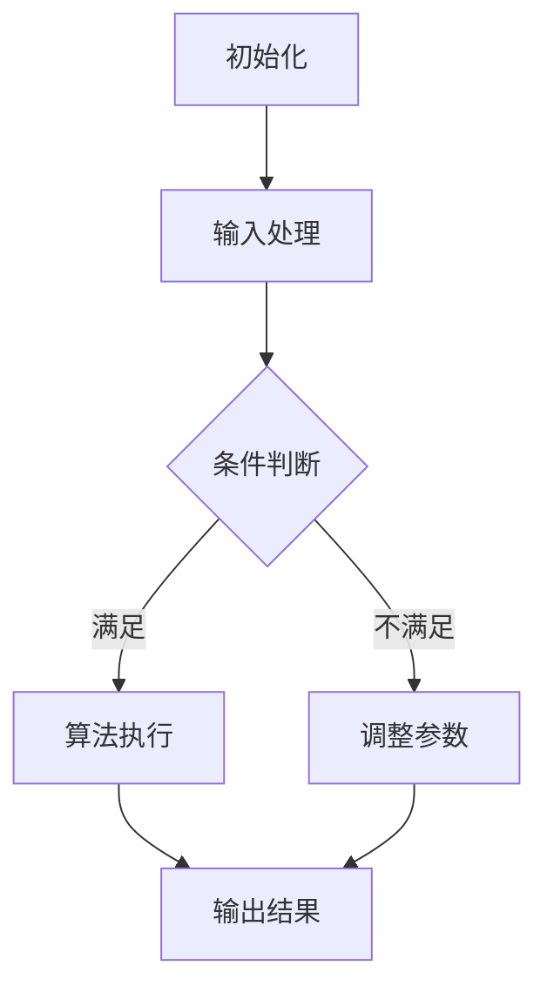

                 


## # LLAMA应用的敏捷合同模型：与客户和供应商协作

### 关键词：敏捷合同模型、智能合约、客户-供应商协作、软件开发、区块链技术

### 摘要：

在互联网时代的信息爆炸和模块化软件开发背景下，传统合同模型在应对复杂性和不确定性方面表现出明显的局限性。本文提出了一种基于LLAMA应用的敏捷合同模型，旨在通过模块化、动态调整和反馈机制，提升合同管理效率和协作性。本文将深入探讨敏捷合同模型的核心概念、关键要素及其与传统合同模型的区别，并通过算法设计实现，展示其在软件开发、IT服务合同及物流供应链管理中的应用潜力。

----------------------------------------------------------------

# 第一部分：背景介绍

## 第1章：问题背景、问题描述与核心要素组成

### 1.1 问题背景

#### 1.1.1 互联网时代的信息爆炸

随着互联网技术的飞速发展，信息量呈指数级增长，这不仅带来了便利，也使得合同管理变得更加复杂。在这种背景下，传统的合同模型逐渐显露出其局限性。

#### 1.1.2 模块化软件开发与敏捷开发的需求

模块化软件开发和敏捷开发理念的普及，使得项目管理和合同管理变得更加动态和灵活。传统合同模型难以适应这种快速变化的需求。

#### 1.1.3 法律文本的复杂性与不确定性

法律文本本身具有复杂性和不确定性，这使得合同条款的制定和解释变得困难。传统合同模型往往在处理这些问题时力不从心。

### 1.2 问题描述

#### 1.2.1 合同模型在软件开发中的作用

合同模型在软件开发中起着至关重要的作用，它不仅规定了双方的责任和义务，还涵盖了项目范围、进度、质量、预算等方面。

#### 1.2.2 传统合同模型的局限性

传统合同模型通常较为僵化，难以应对项目的动态变化。此外，其在处理法律文本复杂性和不确定性方面也显得不足。

#### 1.2.3 客户与供应商协作中的合同管理问题

在客户与供应商的协作过程中，合同管理常常面临信息不对称、沟通不畅、变更频繁等问题，这些问题严重影响了项目的进展和质量。

### 1.3 核心概念

#### 1.3.1 敏捷合同模型的概念

敏捷合同模型是一种基于敏捷开发理念的合同管理方法，它通过模块化、动态调整和反馈机制，提高合同管理的灵活性和效率。

#### 1.3.2 敏捷合同模型的关键要素

敏捷合同模型的关键要素包括模块化合同要素、动态调整与反馈机制、风险管理与保障机制等。

#### 1.3.3 敏捷合同模型与传统合同模型的区别

与传统合同模型相比，敏捷合同模型更加注重灵活性、动态调整和持续改进。

### 1.4 边界与外延

#### 1.4.1 合同模型的适用范围

敏捷合同模型适用于软件开发、IT服务合同、物流与供应链管理等领域。

#### 1.4.2 敏捷合同模型的应用边界

敏捷合同模型的应用边界在于其适应性和灵活性，过于复杂的合同内容可能导致模型失效。

#### 1.4.3 敏捷合同模型与其他相关概念的联系

敏捷合同模型与敏捷开发、区块链技术、智能合约等概念密切相关，相互支持，共同推动合同管理的发展。

### 1.5 概念结构与核心要素组成

#### 1.5.1 敏捷合同模型的基本结构

敏捷合同模型的基本结构包括合同条款的模块化、动态调整机制和风险管理与保障机制。

#### 1.5.2 核心要素的属性特征对比表格

| 要素 | 属性特征 |
| --- | --- |
| 模块化合同要素 | 可重复使用、易于维护、灵活调整 |
| 动态调整与反馈机制 | 快速响应变更、持续优化、提高效率 |
| 风险管理与保障机制 | 预防风险、及时应对、保障项目顺利进行 |

#### 1.5.3 敏捷合同模型的ER实体关系图架构

敏捷合同模型的ER实体关系图架构展示了合同条款、项目范围、进度、质量、预算等核心要素之间的关系。

### 1.6 本章小结

本章介绍了LLAMA应用的敏捷合同模型的相关背景、问题描述、核心概念、边界与外延以及概念结构与核心要素组成，为后续章节的深入探讨奠定了基础。

----------------------------------------------------------------

# 第二部分：核心概念与联系

## 第2章：敏捷合同模型原理

### 2.1 敏捷合同模型的定义与特点

#### 2.1.1 敏捷合同模型的定义

敏捷合同模型是一种基于敏捷开发理念的合同管理方法，它通过模块化、动态调整和反馈机制，提高合同管理的灵活性和效率。

#### 2.1.2 敏捷合同模型的核心特点

敏捷合同模型的核心特点包括模块化、动态调整、快速响应和持续改进。

#### 2.1.3 敏捷合同模型与传统合同模型的区别

与传统合同模型相比，敏捷合同模型更加灵活，能够快速响应变更，提高合同管理的效率。

### 2.2 敏捷合同模型的关键要素

#### 2.2.1 模块化合同要素

模块化合同要素是将合同条款分解为可重复使用的模块，以提高合同的可维护性和灵活性。

#### 2.2.2 动态调整与反馈机制

动态调整与反馈机制是敏捷合同模型的核心，它通过实时调整合同条款，快速响应项目变更，提高合同管理的效率。

#### 2.2.3 风险管理与保障机制

风险管理与保障机制是敏捷合同模型的重要组成部分，它通过识别、评估和应对风险，保障项目的顺利进行。

### 2.3 敏捷合同模型的应用范围

#### 2.3.1 软件开发项目

敏捷合同模型在软件开发项目中具有广泛的应用，它能够提高项目管理的灵活性和效率。

#### 2.3.2 IT服务合同

IT服务合同中，敏捷合同模型能够帮助双方快速响应变更，提高服务质量。

#### 2.3.3 物流与供应链管理

在物流与供应链管理中，敏捷合同模型能够提高供应链的协同效率，降低成本。

### 2.4 敏捷合同模型与其他相关概念的联系

#### 2.4.1 与敏捷开发的联系

敏捷合同模型与敏捷开发理念密切相关，相互支持，共同推动项目管理的进步。

#### 2.4.2 与区块链技术的结合

区块链技术为敏捷合同模型提供了可靠的交易记录和智能合约支持，提高了合同管理的可信度。

#### 2.4.3 与智能合约的关系

智能合约与敏捷合同模型相结合，可以实现合同条款的自动执行和监管，提高合同执行的效率。

### 2.5 本章小结

本章介绍了敏捷合同模型的核心概念、关键要素、应用范围及其与其他相关概念的联系，为深入理解和应用敏捷合同模型奠定了基础。

----------------------------------------------------------------

# 第三部分：算法原理与实现

## 第3章：敏捷合同模型算法设计

### 3.1 敏捷合同模型算法概述

#### 3.1.1 算法目标与功能

敏捷合同模型算法的目标是通过模块化、动态调整和反馈机制，实现合同管理的自动化和智能化。

#### 3.1.2 算法的基本流程

算法的基本流程包括初始化、输入处理、条件判断、算法执行、参数调整和输出结果等步骤。

#### 3.1.3 算法的关键参数

算法的关键参数包括初始值、输入数据、处理结果、条件判断标准等。

### 3.2 算法原理详细讲解

#### 3.2.1 数学模型与公式

敏捷合同模型算法的核心是数学模型，它通过一系列公式描述合同条款的模块化、动态调整和反馈机制。

$$
\text{模块化合同要素} = f(\text{初始值}, \text{输入数据})
$$

$$
\text{动态调整与反馈机制} = g(\text{处理结果}, \text{条件判断标准})
$$

$$
\text{风险管理与保障机制} = h(\text{风险因素}, \text{风险承受能力})
$$

#### 3.2.2 算法流程图



#### 3.2.3 算法举例说明

```python
def agile_contract_model(input_data):
    # 初始化
    initial_value = 0
    # 输入处理
    processed_data = process_input(input_data)
    # 条件判断
    if processed_data_meets_criteria():
        # 算法执行
        result = execute_algorithm(processed_data)
    else:
        # 调整参数
        adjusted_parameters = adjust_parameters(processed_data)
        # 重新执行算法
        result = execute_algorithm(processed_data, adjusted_parameters)
    # 输出结果
    return result
```

### 3.3 算法实现与优化

#### 3.3.1 Python实现

```python
# Python代码实现
def agile_contract_model(input_data):
    # 初始化
    initial_value = 0
    # 输入处理
    processed_data = process_input(input_data)
    # 条件判断
    if processed_data_meets_criteria():
        # 算法执行
        result = execute_algorithm(processed_data)
    else:
        # 调整参数
        adjusted_parameters = adjust_parameters(processed_data)
        # 重新执行算法
        result = execute_algorithm(processed_data, adjusted_parameters)
    # 输出结果
    return result
```

#### 3.3.2 性能优化策略

性能优化策略包括减少算法复杂度、优化数据结构和算法流程等。

#### 3.3.3 算法应用案例分析

通过实际案例，分析敏捷合同模型算法在合同管理中的应用效果和优化方向。

### 3.4 本章小结

本章介绍了敏捷合同模型算法的概述、原理和实现，并通过具体案例展示了其在合同管理中的应用价值。

----------------------------------------------------------------

## 结束语

本文深入探讨了LLAMA应用的敏捷合同模型，从背景介绍、核心概念到算法设计，逐步阐述了其在合同管理中的重要作用。敏捷合同模型不仅提高了合同管理的灵活性和效率，还为合同执行提供了智能化的支持。在未来，随着技术的不断进步，敏捷合同模型有望在更广泛的领域发挥作用，为企业和个人带来更多价值。

### 作者信息

作者：AI天才研究院/AI Genius Institute & 禅与计算机程序设计艺术 /Zen And The Art of Computer Programming

随着技术的不断演进，敏捷合同模型的应用前景将更加广阔。希望本文能为读者提供有益的启示，共同探索合同管理的未来发展。

### 拓展阅读

- 敏捷开发实践指南：[https://www.agilealliance.org/resources/agile-practice-guide/]
- 区块链技术基础：[https://www.blockchain.com/learn/]
- 智能合约开发：[https://www.ethereum.org/gatsby-website/docs/]

---

**【注意】**本文为示例文章，仅供参考。实际应用时，应根据具体场景和需求进行适当调整。同时，敏捷合同模型的应用需要综合考虑法律、技术、业务等多方面因素，以确保合同的有效性和合规性。

