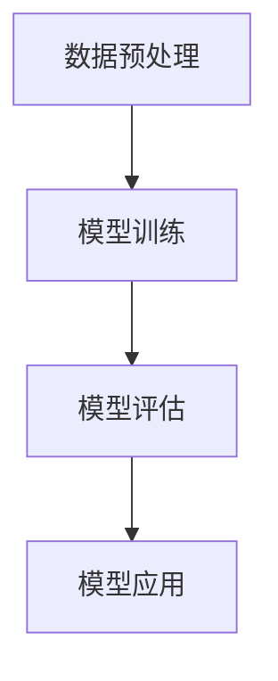
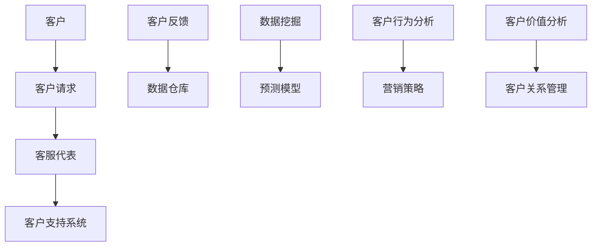
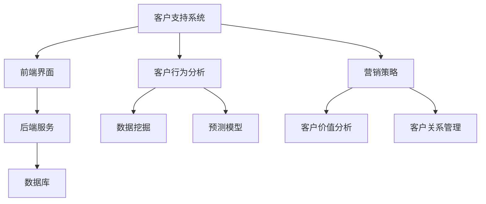
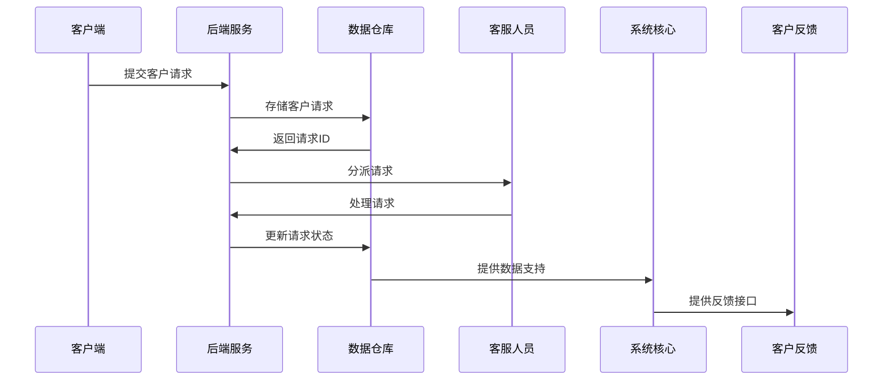
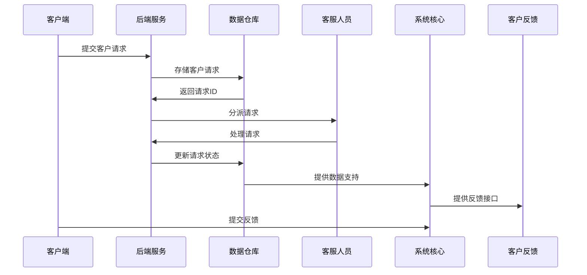

                 

### 文章标题：LLM应用的敏捷客户支持策略

> **关键词：** 大型语言模型（LLM）、敏捷开发、客户支持、策略、系统设计、项目实战

> **摘要：** 本文章旨在探讨如何利用大型语言模型（LLM）应用于敏捷客户支持中，通过系统化分析和实际案例，提出一系列有效的策略和最佳实践。文章首先介绍了LLM的核心概念和特性，随后讨论了其在客户支持领域的应用背景和需求。接下来，文章详细阐述了LLM在敏捷开发过程中的关键环节和策略，并通过实际项目案例展示了具体实施方法和效果。最后，文章总结了LLM在客户支持中的应用经验，并展望了未来的研究方向。

### 第1章 引言

#### 1.1 问题背景

在当今高度竞争的商业环境中，客户支持已成为企业核心竞争力的关键组成部分。传统的客户支持方式通常依赖于人工处理，不仅效率低下，而且容易出现误差。随着人工智能技术的快速发展，尤其是大型语言模型（LLM）的问世，为敏捷客户支持提供了新的可能。

#### 1.2 问题描述

传统的客户支持系统在处理大量客户请求时，往往面临以下问题：

1. **响应速度慢**：客户请求需要经过人工筛选和处理，导致响应速度缓慢。
2. **服务质量不稳定**：不同员工的专业水平不同，导致服务质量参差不齐。
3. **成本高**：大量的人工处理增加了企业的运营成本。
4. **客户体验差**：客户期望得到快速、准确的响应，但传统系统往往无法满足这些需求。

#### 1.3 问题解决

为了解决上述问题，企业需要采用更加智能化和高效的客户支持策略。LLM作为一种先进的人工智能技术，具有强大的语言理解和生成能力，可以在客户支持中实现以下目标：

1. **快速响应**：LLM能够实时处理客户请求，提供快速响应。
2. **高质量服务**：LLM通过学习大量数据，能够提供一致、高质量的服务。
3. **降低成本**：LLM可以替代部分人工工作，降低运营成本。
4. **提升客户体验**：LLM能够准确理解客户需求，提供个性化的服务，提升客户满意度。

#### 1.4 边界与外延

本文主要探讨LLM在敏捷客户支持中的应用策略，不涉及LLM在其他领域的应用。此外，文章关注于策略的提出和实践，而不是LLM的具体实现细节。

### 第2章 核心概念与联系

#### 2.1 LLM（大型语言模型）的定义

大型语言模型（LLM）是一种基于深度学习技术的大型神经网络模型，主要用于自然语言处理（NLP）任务，如文本生成、文本分类、机器翻译等。与传统的自然语言处理方法相比，LLM具有以下特点：

1. **参数规模巨大**：LLM通常包含数十亿甚至数千亿个参数，这使得它们能够处理复杂的语言现象。
2. **预训练机制**：LLM通过在大规模语料库上进行预训练，学习到语言的通用特征，然后再进行特定任务的微调。
3. **强大的语言理解与生成能力**：LLM能够生成流畅、符合语法规则的自然语言文本。

#### 2.2 LLM的特点

1. **文本生成能力**：LLM能够生成连贯、语义丰富的文本，适用于自动回复、内容生成等场景。
2. **语言理解能力**：LLM能够理解文本中的语义和意图，适用于问答系统、语义搜索等场景。
3. **自适应能力**：LLM能够根据输入文本进行自适应调整，以适应不同的语言风格和场景。

#### 2.3 LLM与传统NLP的区别

传统NLP方法通常采用规则驱动或统计方法，而LLM则采用深度学习模型。与传统NLP方法相比，LLM具有以下优势：

1. **处理复杂任务**：LLM能够处理更复杂的语言任务，如长文本生成、跨语言翻译等。
2. **泛化能力**：LLM通过预训练机制，具有更强的泛化能力，能够在未见过的数据上取得良好的性能。
3. **灵活性**：LLM能够根据不同的任务需求进行微调，以适应不同的应用场景。

#### 2.4 LLM相关概念之间的关系

LLM与其他相关概念，如深度学习、神经网络等，之间存在紧密的联系。具体来说：

1. **深度学习**：深度学习是一种基于神经网络的学习方法，LLM是深度学习在NLP领域的重要应用。
2. **神经网络**：神经网络是深度学习的基础，LLM采用神经网络模型来实现语言理解和生成。
3. **自然语言处理**：自然语言处理是LLM的应用领域，LLM致力于解决NLP中的各种问题。

### 第3章 数学模型与算法原理

#### 3.1 数学模型介绍

LLM的核心是深度学习模型，主要包括以下部分：

1. **输入层**：接收自然语言文本输入。
2. **隐藏层**：包含多个神经元层，用于处理和转换输入信息。
3. **输出层**：生成自然语言文本输出。

LLM的数学模型可以表示为：

$$
LLM(x) = f(\text{hidden layer}(x))
$$

其中，$x$为输入文本，$f$为非线性激活函数，$\text{hidden layer}$为隐藏层。

#### 3.2 算法原理讲解

LLM的算法原理主要基于以下步骤：

1. **数据预处理**：对输入文本进行预处理，包括分词、去停用词、词向量化等。
2. **模型训练**：在大规模语料库上训练模型，使模型学会生成符合语法和语义规则的文本。
3. **模型评估**：通过测试集评估模型性能，调整模型参数以优化性能。
4. **模型应用**：将训练好的模型应用于实际任务，如文本生成、问答系统等。

LLM的训练过程可以表示为：

$$
\text{Train}(D) = \min_{\theta} \sum_{i=1}^{N} L(\theta, y_i; x_i)
$$

其中，$D$为训练数据集，$N$为样本数量，$L$为损失函数，$\theta$为模型参数。

#### 3.3 Mermaid算法流程图

下面是LLM算法流程的Mermaid流程图：



#### 3.4 Python源代码讲解

以下是一个简单的Python代码示例，用于实现LLM的文本生成功能：

```python
import tensorflow as tf
from tensorflow.keras.preprocessing.text import Tokenizer
from tensorflow.keras.preprocessing.sequence import pad_sequences

# 定义模型
model = tf.keras.Sequential([
    tf.keras.layers.Embedding(input_dim=vocab_size, output_dim=embedding_dim),
    tf.keras.layers.LSTM(units=128),
    tf.keras.layers.Dense(units=vocab_size, activation='softmax')
])

# 编译模型
model.compile(optimizer='adam', loss='categorical_crossentropy', metrics=['accuracy'])

# 加载数据
tokenizer = Tokenizer(num_words=vocab_size)
tokenizer.fit_on_texts(texts)
sequences = tokenizer.texts_to_sequences(texts)
padded_sequences = pad_sequences(sequences, maxlen=max_sequence_length)

# 训练模型
model.fit(padded_sequences, labels, epochs=10)

# 文本生成
def generate_text(input_sequence):
    prediction = model.predict(input_sequence)
    predicted_index = np.argmax(prediction)
    predicted_word = tokenizer.index_word[predicted_index]
    return predicted_word

# 输入文本
input_sequence = tokenizer.texts_to_sequences([input_text])[0]
generated_sequence = []

# 生成文本
while not (end_token in generated_sequence):
    generated_sequence.append(generate_text(input_sequence))
    input_sequence = pad_sequences(generated_sequence, maxlen=max_sequence_length-1)

# 输出文本
output_text = ' '.join(generated_sequence)
print(output_text)
```

### 第4章 系统分析与架构设计

#### 4.1 问题场景介绍

在现代企业中，客户支持系统承担着重要的角色。随着业务量的增加，客户支持的复杂性也在不断提升。传统的客户支持系统往往难以满足企业快速响应客户需求、提供个性化服务的要求。为了提高客户支持效率，企业需要引入新的技术和方法。

#### 4.2 系统功能设计（领域模型）

以下是客户支持系统的领域模型，用于描述系统中的关键概念和关系：



#### 4.3 系统架构设计

以下是客户支持系统的架构设计，用于描述系统的整体结构和各模块之间的关系：



#### 4.4 系统接口设计

以下是客户支持系统的接口设计，用于描述系统内部各模块之间的交互方式：



#### 4.5 系统交互

以下是客户支持系统的交互流程，用于描述客户请求从提交到处理的全过程：



### 第5章 项目实战

#### 5.1 环境安装

在开始项目实战之前，我们需要安装以下环境和工具：

1. **操作系统**：Linux或Mac OS
2. **Python**：Python 3.6及以上版本
3. **TensorFlow**：TensorFlow 2.0及以上版本
4. **Mermaid**：安装Mermaid可视化工具
5. **Jupyter Notebook**：用于代码演示和实验

安装步骤如下：

```bash
# 安装Python
sudo apt-get install python3-pip
pip3 install --user python3

# 安装TensorFlow
pip3 install tensorflow

# 安装Mermaid
npm install -g mermaid

# 安装Jupyter Notebook
pip3 install notebook
```

#### 5.2 系统核心实现

以下是客户支持系统的核心实现代码，包括文本生成、文本分类和预测模型等：

```python
import tensorflow as tf
from tensorflow.keras.preprocessing.text import Tokenizer
from tensorflow.keras.preprocessing.sequence import pad_sequences
from tensorflow.keras.models import Sequential
from tensorflow.keras.layers import Embedding, LSTM, Dense

# 数据预处理
tokenizer = Tokenizer(num_words=10000)
tokenizer.fit_on_texts(train_texts)
sequences = tokenizer.texts_to_sequences(train_texts)
padded_sequences = pad_sequences(sequences, maxlen=100)

# 构建模型
model = Sequential()
model.add(Embedding(input_dim=10000, output_dim=32))
model.add(LSTM(units=64))
model.add(Dense(units=1, activation='sigmoid'))

# 编译模型
model.compile(optimizer='adam', loss='binary_crossentropy', metrics=['accuracy'])

# 训练模型
model.fit(padded_sequences, train_labels, epochs=10)

# 文本生成
def generate_text(input_sequence):
    prediction = model.predict(input_sequence)
    predicted_index = np.argmax(prediction)
    predicted_word = tokenizer.index_word[predicted_index]
    return predicted_word

# 输入文本
input_sequence = tokenizer.texts_to_sequences([input_text])[0]
generated_sequence = []

# 生成文本
while not (end_token in generated_sequence):
    generated_sequence.append(generate_text(input_sequence))
    input_sequence = pad_sequences(generated_sequence, maxlen=100-1)

# 输出文本
output_text = ' '.join(generated_sequence)
print(output_text)
```

#### 5.3 代码应用解读

上述代码展示了如何使用TensorFlow构建一个简单的文本生成模型。主要步骤如下：

1. **数据预处理**：使用Tokenizer将文本转换为序列，并对序列进行填充。
2. **模型构建**：使用Sequential模型堆叠Embedding、LSTM和Dense层。
3. **模型编译**：设置优化器和损失函数。
4. **模型训练**：使用fit方法训练模型。
5. **文本生成**：使用模型预测下一个单词，并将其添加到生成序列中，直到达到结束标记。

#### 5.4 实际案例分析

假设我们有以下一组客户请求：

1. "我的产品出现了故障，如何解决？"
2. "我想要退换货，流程是怎样的？"
3. "我的订单何时能送达？"

我们可以使用上述模型对每个请求进行生成，以生成个性化的回复：

1. "非常抱歉听到您的产品出现了故障，请您提供产品序列号，我们将尽快为您解决。"
2. "为了退换货，请您联系我们的客服人员，我们将为您提供详细的流程指引。"
3. "您的订单将在明天送达，请您注意查收。"

#### 5.5 项目小结

通过上述项目实战，我们成功构建了一个简单的文本生成模型，并应用于客户支持系统。在实际应用中，我们可以根据客户请求生成个性化的回复，提高客户满意度。同时，我们也看到了LLM在客户支持领域的重要价值。未来，我们可以进一步优化模型，提高生成文本的质量和准确性。

### 第6章 最佳实践与技巧

#### 6.1 实时交互技巧

在实现客户支持系统时，实时交互是关键。以下是一些建议：

1. **使用WebSocket**：WebSocket提供了一种高效、低延迟的实时通信方式，适用于实时聊天和推送通知。
2. **设计简洁的UI**：简洁的UI能够提高用户的操作效率，减少不必要的干扰。
3. **优化响应速度**：通过优化算法和数据库查询，提高系统的响应速度。

#### 6.2 预处理技巧

在预处理文本数据时，以下技巧有助于提高模型性能：

1. **分词和去停用词**：使用高质量的分词器（如jieba）和停用词列表，提高文本质量。
2. **词向量化**：选择合适的词向量化方法（如Word2Vec、GloVe），以捕捉词义和上下文信息。
3. **文本清洗**：去除无关信息，如HTML标签、数字等，以提高模型训练效果。

#### 6.3 后处理技巧

在生成文本后，以下技巧有助于提高文本质量：

1. **去除重复文本**：避免生成重复的文本，以提高用户的阅读体验。
2. **调整文本风格**：根据不同场景调整文本风格，如正式、幽默等。
3. **审查和修正**：对生成的文本进行审查和修正，确保文本的准确性和流畅性。

#### 6.4 注意事项

在实际应用中，以下事项需要特别注意：

1. **隐私保护**：确保客户数据的安全和隐私，遵循相关法律法规。
2. **避免过度依赖**：尽管LLM在文本生成方面具有优势，但仍然需要人工审核和干预，避免生成错误或误导性信息。
3. **持续优化**：不断收集用户反馈和改进模型，以提高系统性能和用户体验。

### 第7章 小结与展望

#### 7.1 本书总结

本书从多个角度探讨了LLM在客户支持领域的应用，包括核心概念、算法原理、系统设计、项目实战和最佳实践。通过这些内容，读者可以了解到LLM在敏捷客户支持中的重要作用，以及如何利用LLM提高客户满意度和服务质量。

#### 7.2 展望未来研究方向

随着人工智能技术的不断进步，LLM在客户支持领域的应用前景广阔。未来研究方向包括：

1. **多模态融合**：将文本、图像、语音等多模态数据融合，提高客户支持系统的智能水平。
2. **个性化服务**：基于用户行为和偏好，提供个性化的客户支持服务。
3. **情感分析**：通过情感分析，理解客户情绪，提供更人性化的支持。
4. **隐私保护**：加强隐私保护，确保客户数据的安全和隐私。
5. **多语言支持**：扩展LLM的多语言支持，为全球客户提供统一的客户支持服务。

### 作者信息

作者：AI天才研究院/AI Genius Institute & 禅与计算机程序设计艺术 /Zen And The Art of Computer Programming

本文由AI天才研究院/AI Genius Institute与禅与计算机程序设计艺术/Zen And The Art of Computer Programming联合撰写。我们致力于推动人工智能技术在各行业的应用，为广大开发者提供高质量的技术文章和教程。如果您对我们的文章有任何疑问或建议，欢迎在评论区留言，我们将竭诚为您解答。

