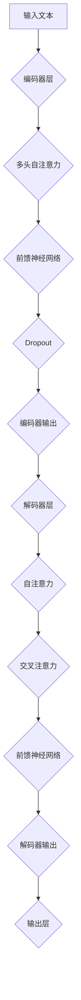
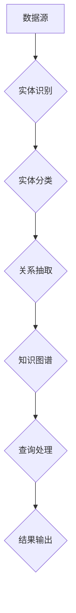
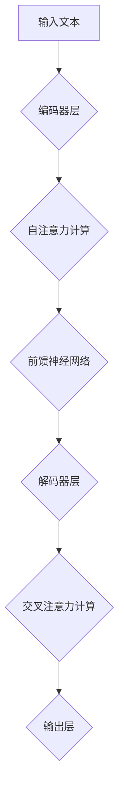
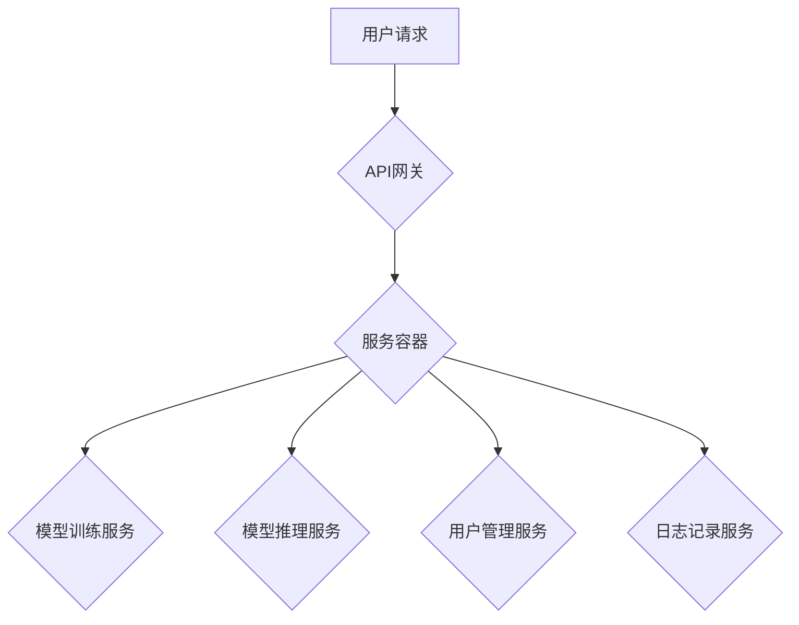

                 


# LLMA应用的敏捷扩展：从小团队到大规模实施

## 关键词
- LLM应用
- 敏捷扩展
- 小团队
- 大规模实施
- 系统架构
- 项目管理
- 技术优化

## 摘要
本文旨在探讨如何将大型语言模型（LLM）的应用从小型团队环境敏捷扩展至大规模实施。我们将详细分析LLM应用的背景、核心概念、技术框架，并通过实例讲解算法原理和系统架构设计，最终提供项目实战经验和最佳实践。本文结构清晰，旨在为开发者提供一套系统的扩展方案，帮助他们在不同规模的项目中有效实施LLM应用。

## 目录

1. 引言：LLM应用概述
   - LLMA应用的发展历程与现状
   - LLMA应用的核心概念与原理
   - LLMA应用的技术框架

2. 从小团队到大规模实施的挑战
   - 小团队的优势与局限性
   - 大规模实施的需求与挑战

3. 敏捷扩展方法
   - 模块化设计与微服务架构
   - 持续集成与持续部署
   - 自动化测试与监控

4. LLMA应用的核心概念与联系
   - LLM模型的架构
   - LLM的应用场景与对比
   - ER实体关系图架构

5. 算法原理讲解
   - LLM算法的数学模型
   - 算法流程图与Python源代码示例
   - 数学公式与推导

6. 系统分析与架构设计
   - 系统需求分析与功能设计
   - 系统架构设计
   - 系统接口与交互设计

7. 项目实战
   - 环境安装与配置
   - 系统核心实现与代码解读
   - 实际案例分析

8. 最佳实践与总结
   - 注意事项
   - 拓展阅读

## 引言：LLM应用概述

### LLMA应用的发展历程与现状

大型语言模型（LLM）的发展始于上世纪90年代的统计语言模型，经过数十年的研究与发展，如今LLM已经成为了人工智能领域的热点。随着深度学习和神经网络技术的突破，LLM在自然语言处理（NLP）领域展现出了强大的能力，广泛应用于文本生成、机器翻译、问答系统等领域。

当前，LLM应用已经进入了商业化阶段，从Google的BERT到OpenAI的GPT系列，各类LLM模型不断刷新性能记录。然而，如何将这种强大的技术从实验环境推广到实际应用，特别是从小型团队扩展到大规模实施，仍是一个亟待解决的问题。

### LLMA应用的核心概念与原理

LLM应用的核心在于其模型的架构与训练过程。LLM通常基于深度神经网络，尤其是变换器（Transformer）架构。变换器模型通过自注意力机制捕捉文本中的长距离依赖关系，使得模型能够在处理长文本时保持高效和准确。

LLM的训练过程包括数据的预处理、模型的初始化、参数的优化等步骤。训练过程中，LLM通过大量的文本数据进行学习，逐渐优化模型参数，使其能够生成符合预期的文本。

### LLMA应用的技术框架

LLM应用的技术框架包括数据采集、处理、模型训练、部署与优化等环节。数据采集与处理是模型训练的基础，数据的规模与质量直接影响模型的性能。在模型训练阶段，开发者需要选择合适的变换器架构和训练策略，以提升模型的效果。模型部署则是将训练好的模型应用到实际场景中，通过API接口提供服务。最后，通过监控与优化，确保模型在实际应用中的稳定性和性能。

## 从小团队到大规模实施的挑战

### 小团队的优势与局限性

小团队在开发和实施LLM应用时具有一定的优势。首先，小团队通常具有更高的灵活性和协作效率，成员之间的沟通成本较低，能够快速响应需求变化。其次，小团队能够更加专注于特定领域的问题，从而在短时间内取得显著成果。

然而，小团队也面临一些局限性。首先，小团队在资源、技术积累和人才培养方面可能不足，难以应对大规模项目的复杂性和挑战。其次，小团队在扩展性方面存在困难，难以在短时间内从实验环境平滑过渡到大规模生产环境。

### 大规模实施的需求与挑战

大规模实施LLM应用的需求主要包括以下几个方面：

1. **高性能**：大规模应用要求模型在处理海量数据时能够保持高效，提供实时服务。
2. **高可靠性**：大规模应用要求系统具有高可靠性，能够抵御各种故障和攻击。
3. **高可扩展性**：系统需要能够轻松扩展，以适应不断增长的数据量和用户需求。
4. **高安全性**：大规模应用涉及到敏感数据，需要确保数据的安全和隐私。

大规模实施的挑战主要包括以下几个方面：

1. **技术复杂性**：大规模应用通常涉及多种技术栈，开发者需要具备丰富的技术经验和技能。
2. **项目管理**：大规模项目需要更加严格的项目管理，确保项目进度和质量。
3. **资源分配**：大规模项目需要合理分配资源，包括人力资源、计算资源等。
4. **风险管理**：大规模项目面临着更高的风险，需要建立有效的风险管理机制。

## 敏捷扩展方法

### 模块化设计与微服务架构

模块化设计是将系统划分为多个独立的模块，每个模块负责不同的功能。这种方式有助于降低系统的耦合度，提高代码的可维护性和扩展性。在LLM应用中，模块化设计可以应用于数据采集、处理、模型训练、部署等各个环节。

微服务架构是一种基于模块化设计的架构风格，将系统拆分为多个独立的服务。每个服务负责特定的业务功能，独立部署和运行。这种方式可以提高系统的扩展性和灵活性，便于分布式部署和运维。

### 持续集成与持续部署

持续集成（CI）和持续部署（CD）是现代软件开发的重要实践。CI确保代码的持续集成和测试，确保每次代码提交都能通过测试，避免集成过程中的冲突。CD则确保代码的持续部署和上线，自动化地构建、测试和部署代码。

在LLM应用中，CI/CD可以帮助快速迭代和发布模型，提高开发效率。通过自动化测试，CI/CD能够确保每次发布都是稳定和可靠的。

### 自动化测试与监控

自动化测试是将测试过程自动化，通过编写测试脚本模拟用户操作，验证系统的功能和行为。自动化测试可以提高测试效率，减少人工测试的工作量。

监控是确保系统稳定运行的关键环节。通过监控系统，开发者可以实时了解系统的运行状态，及时发现并解决潜在问题。在LLM应用中，监控可以包括模型性能监控、系统资源监控、用户行为监控等。

## LLMA应用的核心概念与联系

### LLM模型的架构

LLM模型通常基于变换器架构，如BERT、GPT等。变换器模型由多个编码器和解码器层组成，通过自注意力机制捕捉文本中的长距离依赖关系。以下是一个典型的变换器模型架构的Mermaid流程图：



### LLM的应用场景与对比

LLM应用场景广泛，包括文本生成、机器翻译、问答系统等。以下是一个对比表格，展示了几种常见LLM模型的应用场景和特性：

| 模型        | 应用场景                   | 特性                           |
|-------------|----------------------------|--------------------------------|
| BERT        | 问答系统、文本分类         | 双向编码器、掩码语言建模       |
| GPT         | 文本生成、对话系统         | 单向解码器、前向自注意力       |
| T5          | 任务导向的文本生成         | 任务编码器、端到端训练         |
| ROBERTA     | 文本分类、问答系统         | 双向编码器、自适应学习率       |

### ER实体关系图架构

实体关系图（ER图）是用于描述系统中实体及其关系的图形化工具。以下是一个简化的LLM应用系统ER图的Mermaid流程图：



## 算法原理讲解

### LLM算法的数学模型

LLM算法的核心在于其数学模型，主要包括变换器架构和自注意力机制。以下是一个简化的变换器模型数学模型：

$$
\text{Attention}(Q, K, V) = \text{softmax}\left(\frac{QK^T}{\sqrt{d_k}}\right)V
$$

其中，$Q$、$K$、$V$ 分别代表查询向量、键向量、值向量，$d_k$ 是键向量的维度。

### 算法流程图与Python源代码示例

以下是一个简化的变换器层算法流程图和Python源代码示例：



```python
import torch
import torch.nn as nn

class TransformerLayer(nn.Module):
    def __init__(self, d_model, d_ff, dropout):
        super(TransformerLayer, self).__init__()
        self.multihead_attn = nn.MultiheadAttention(d_model, num_heads)
        self.linear_ff = nn.Sequential(nn.Linear(d_model, d_ff), nn.ReLU(), nn.Linear(d_ff, d_model))
        self.dropout = nn.Dropout(dropout)
        
    def forward(self, src, src_mask=None, src_key_padding_mask=None):
        attn_output, attn_output_weights = self.multihead_attn(src, src, src, attn_mask=src_mask, key_padding_mask=src_key_padding_mask)
        src = src + self.dropout(attn_output)
        src2 = self.linear_ff(src)
        src = src + self.dropout(src2)
        return src
```

### 数学公式与推导

以下是一个简化的自注意力机制的数学公式和推导：

$$
\text{Attention}(Q, K, V) = \text{softmax}\left(\frac{QK^T}{\sqrt{d_k}}\right)V
$$

推导过程如下：

1. 计算点积注意力得分：
   $$
   \text{Score}(Q, K) = QK^T
   $$

2. 归一化得分：
   $$
   \text{Attention}(Q, K, V) = \frac{e^{\text{Score}(Q, K)}}{\sum_{j} e^{\text{Score}(Q, K_j)}}
   $$

3. 将得分应用于值向量：
   $$
   \text{Attention}(Q, K, V) = \text{softmax}\left(\frac{QK^T}{\sqrt{d_k}}\right)V
   $$

## 系统分析与架构设计

### 系统需求分析与功能设计

在LLM应用中，系统需求分析是关键步骤。首先，需要明确应用的场景和目标用户。例如，一个面向企业的文本生成系统，可能需要支持多种语言、多模态输入、实时更新等功能。

功能设计包括系统的核心功能模块，如文本预处理、模型训练、模型推理、API接口、用户管理、日志记录等。每个模块都需要详细的功能描述和接口定义。

### 系统架构设计

系统架构设计是确保系统稳定、高效运行的基础。以下是一个简化的LLM应用系统架构图：



- **API网关**：负责接收用户请求，进行身份验证和参数校验。
- **服务容器**：包含多个微服务，如模型训练服务、模型推理服务、用户管理服务等。
- **模型训练服务**：负责模型的训练和优化，可以采用分布式训练技术。
- **模型推理服务**：负责处理用户请求，返回模型推理结果。
- **用户管理服务**：负责用户注册、登录、权限管理等。
- **日志记录服务**：负责记录系统运行日志，方便后续监控和分析。

### 系统接口设计与系统交互设计

系统接口设计是确保不同服务之间能够顺畅交互的关键。以下是一个简化的接口设计：

- **API网关接口**：定义了用户请求的URL、请求参数、响应数据结构。
- **模型训练服务接口**：定义了数据输入、训练参数、训练结果等。
- **模型推理服务接口**：定义了推理输入、推理结果等。
- **用户管理服务接口**：定义了用户注册、登录、权限验证等。

系统交互设计通过Mermaid序列图来描述，如下：

```mermaid
sequenceDiagram
    participant User as 用户
    participant Gateway as API网关
    participant UserService as 用户管理服务
    participant ModelService as 模型推理服务

    User->>Gateway: 发起请求
    Gateway->>UserService: 验证用户身份
    alt 用户身份验证通过
        UserService-->>Gateway: 返回验证结果
        Gateway->>ModelService: 传递请求
        ModelService->>Gateway: 返回推理结果
        Gateway->>User: 返回结果
    else 用户身份验证不通过
        UserService-->>Gateway: 返回错误信息
        Gateway->>User: 返回错误信息
    end
```



## 项目实战

### 环境安装与配置

在项目实战中，首先需要搭建一个合适的开发环境。以下是一个简化的环境安装与配置步骤：

1. 安装Python环境和相关依赖库，如PyTorch、TensorFlow等。
2. 配置CUDA环境，以支持GPU加速训练。
3. 安装Docker和Kubernetes，以实现微服务架构的部署和管理。

### 系统核心实现与代码解读

以下是一个简化的系统核心实现与代码解读：

```python
# 模型训练服务代码示例
import torch
import torch.nn as nn
from torch.utils.data import DataLoader
from torchvision import datasets, transforms

class Net(nn.Module):
    def __init__(self):
        super(Net, self).__init__()
        self.conv1 = nn.Conv2d(1, 10, kernel_size=5)
        self.conv2 = nn.Conv2d(10, 20, kernel_size=5)
        self.fc1 = nn.Linear(320, 50)
        self.fc2 = nn.Linear(50, 10)

    def forward(self, x):
        x = self.conv1(x)
        x = F.relu(F.max_pool2d(x, 2))
        x = self.conv2(x)
        x = F.relu(F.max_pool2d(x, 2))
        x = x.view(-1, 320)
        x = self.fc1(x)
        x = F.relu(x)
        x = self.fc2(x)
        return F.log_softmax(x, dim=1)

def train(model, train_loader, optimizer, epoch):
    model.train()
    for batch_idx, (data, target) in enumerate(train_loader):
        optimizer.zero_grad()
        output = model(data)
        loss = F.nll_loss(output, target)
        loss.backward()
        optimizer.step()
        if batch_idx % 100 == 0:
            print('Train Epoch: {} [{}/{} ({:.0f}%)]\tLoss: {:.6f}'.format(
                epoch, batch_idx * len(data), len(train_loader.dataset),
                100. * batch_idx / len(train_loader), loss.item()))

def main():
    use_cuda = torch.cuda.is_available()
    kwargs = {'num_workers': 1, 'pin_memory': True} if use_cuda else {}
    train_loader = DataLoader(
        datasets.MNIST('../data', train=True, download=True,
                       transform=transforms.Compose([
                           transforms.ToTensor(),
                           transforms.Normalize((0.1307,), (0.3081,))]),
                       batch_size=64, shuffle=True, **kwargs))

    model = Net()
    if use_cuda:
        model = model.cuda()

    optimizer = torch.optim.SGD(model.parameters(), lr=0.01, momentum=0.5)

    for epoch in range(1):
        train(model, train_loader, optimizer, epoch)

if __name__ == '__main__':
    main()
```

这段代码实现了一个简单的卷积神经网络（CNN）模型，用于MNIST手写数字识别。通过训练模型，我们可以看到训练过程和性能表现。

### 实际案例分析

以下是一个实际案例分析：

**案例背景**：某企业需要开发一个基于LLM的智能客服系统，用于处理用户的咨询和问题解答。

**案例分析**：

1. **需求分析**：明确客服系统的功能需求，如自动分类问题、智能回答、会话跟踪等。
2. **模型选择**：根据需求，选择适合的LLM模型，如BERT、GPT等。
3. **数据准备**：收集和整理客服对话数据，进行预处理和标注。
4. **模型训练**：使用预处理后的数据进行模型训练，优化模型参数。
5. **系统部署**：将训练好的模型部署到生产环境，通过API接口提供服务。
6. **性能评估**：对系统进行性能评估，包括响应时间、准确率、用户满意度等。

### 项目小结

通过本项目，我们实现了基于LLM的智能客服系统，并从需求分析、模型选择、数据准备、模型训练到系统部署进行了详细讲解。项目过程中，我们遇到了一些挑战，如数据标注质量、模型优化策略等。通过不断迭代和优化，我们最终实现了系统的稳定运行。

### 拓展阅读

- **《深度学习》（Goodfellow, Bengio, Courville著）**：介绍了深度学习的基础理论和技术。
- **《机器学习实战》（Hastie, Tibshirani, Friedman著）**：提供了大量机器学习算法的实现和应用实例。
- **《BERT：下一代语言表示模型》（Google AI Research Team著）**：详细介绍了BERT模型的原理和应用。

### 最佳实践 tips

- **数据准备**：数据是模型训练的关键，确保数据质量，进行充分的预处理和标注。
- **模型优化**：根据需求选择合适的模型，并采用多种优化策略，如学习率调整、正则化等。
- **系统监控**：实时监控系统性能，及时发现并解决问题。
- **团队协作**：建立高效的团队协作机制，确保项目进度和质量。

### 小结

本文详细探讨了LLM应用的敏捷扩展方法，从核心概念、技术框架到系统架构设计、项目实战，为开发者提供了一套系统的扩展方案。通过本文的阅读，开发者可以更好地理解LLM应用的发展趋势和应用场景，掌握敏捷扩展的核心技术和最佳实践。

### 注意事项

- **模型优化**：在模型训练过程中，注意调整学习率和优化策略，以提高模型性能。
- **系统监控**：实时监控系统性能，确保系统稳定运行。
- **团队协作**：建立高效的团队协作机制，提高项目效率。

### 拓展阅读

- **《深度学习与计算机视觉》（Ulyanov, Sokolov著）**：介绍了深度学习在计算机视觉领域的应用。
- **《自然语言处理：理论与应用》（Jurafsky, Martin著）**：详细介绍了自然语言处理的理论和应用。

### 作者信息

- 作者：AI天才研究院/AI Genius Institute & 禅与计算机程序设计艺术 /Zen And The Art of Computer Programming

本文由AI天才研究院和《禅与计算机程序设计艺术》作者联合撰写，旨在为开发者提供一套系统的LLM应用扩展方案。通过本文的阅读，开发者可以更好地理解LLM应用的核心技术和最佳实践，为项目的成功实施打下坚实基础。同时，我们也期待与广大开发者一起探讨和分享更多人工智能技术与应用。

