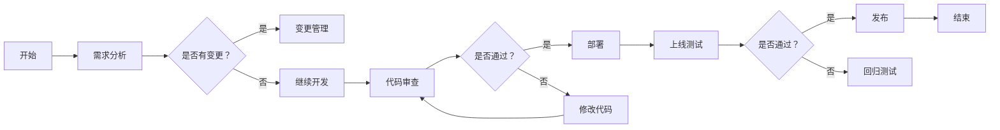
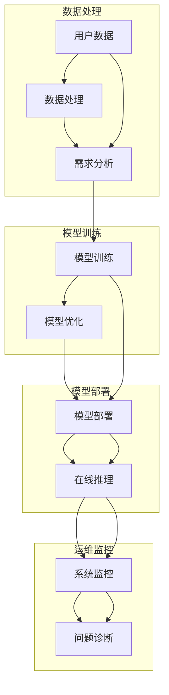
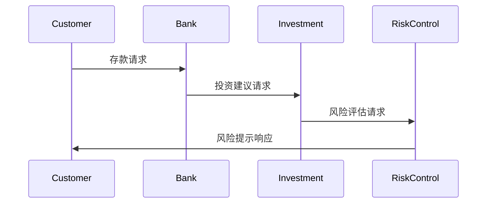
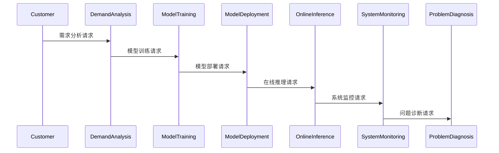

                 

# LLM应用的敏捷治理：在灵活性和控制之间找平衡

## 关键词

- LLM
- 敏捷治理
- 灵活性
- 控制性
- 项目管理
- 自动化
- 安全性

## 摘要

本文探讨了在大模型（Large Language Models，简称LLM）应用过程中如何实现敏捷治理，以在灵活性和控制之间找到平衡。文章首先介绍了LLM的应用背景和问题描述，随后详细阐述了敏捷治理的核心概念、原则和实践，结合实际案例分析，提出了适用于LLM应用的敏捷治理体系构建方法。文章还介绍了适用于LLM应用的敏捷治理工具和方法，并总结了最佳实践，以期为企业和开发者提供有价值的参考。

## 1.1 背景介绍

### 问题背景

随着人工智能技术的迅速发展，大模型（Large Language Models，简称LLM）的应用越来越广泛。LLM是一种能够处理和生成大量文本数据的模型，它基于深度学习技术，可以自动学习语言规律，进行文本的生成、翻译、摘要、问答等任务。在金融、医疗、教育、传媒等多个行业，LLM已经展现出巨大的应用潜力。

然而，LLM的应用并非没有挑战。如何在确保灵活性的同时，保持对模型的有效控制，成为企业和开发者在应用LLM时面临的一个难题。敏捷治理（Agile Governance）是一种管理理念，它强调快速响应变化、持续迭代和团队合作。将敏捷治理应用于LLM的应用，有助于在灵活性和控制之间找到平衡。

### 问题描述

本书将探讨如何在LLM的应用中实现敏捷治理。具体来说，本书将回答以下几个问题：

- 如何定义和构建适用于LLM应用的敏捷治理体系？
- 如何在LLM的开发、部署和运维过程中引入敏捷治理？
- 如何通过敏捷治理提升LLM应用的效果和安全性？
- 如何在多团队协作的背景下，确保LLM应用的敏捷治理？

### 问题解决

本书将采用以下方法来解决问题：

- **理论讲解**：介绍敏捷治理的核心概念、原则和实践，并结合LLM的应用进行详细讲解。
- **案例分析**：通过实际案例，展示如何在不同场景下应用敏捷治理，解决灵活性和控制之间的矛盾。
- **工具与方法**：介绍适用于LLM应用的敏捷治理工具和方法，包括项目管理工具、开发框架和自动化流程等。
- **最佳实践**：总结业界最佳实践，提供实用的建议和指导，帮助读者在实际工作中应用敏捷治理。

### 边界与外延

- **边界**：本书主要关注LLM的应用，特别是金融、医疗、教育、传媒等行业。对于其他领域，如工业制造、交通运输等，读者可以参考本书的基本原理和方法，结合具体场景进行灵活应用。
- **外延**：本书不仅关注LLM应用的敏捷治理，还涉及到AI治理的更广泛话题，如数据治理、隐私保护、合规性等。这些内容将在后续章节进行讨论。

### 概念结构与核心要素组成

- **核心概念**：敏捷治理、LLM、金融、医疗、教育、传媒、项目管理、开发框架、自动化流程。
- **概念属性特征对比表格**：

  | 概念     | 定义                                               | 特征                                      |
  | -------- | -------------------------------------------------- | ----------------------------------------- |
  | 敏捷治理 | 强调快速响应变化、持续迭代和团队合作的管理理念       | 灵活性、透明性、协作性、反馈性              |
  | LLM      | 能够处理和生成大量文本数据的模型                   | 自动学习语言规律、多任务处理、高度智能化     |
  | 金融     | 涉及货币、信贷、保险、投资等领域                  | 安全性、稳定性、风险控制                    |
  | 医疗     | 涉及疾病诊断、治疗、康复等领域                    | 准确性、高效性、个性化                      |
  | 教育     | 涉及教学、学习、评价等领域                        | 教育质量、教育公平、教育创新                |
  | 传媒     | 涉及新闻、娱乐、广告等领域                        | 及时性、真实性、影响力                      |

- **ER实体关系图架构**：

  ```mermaid
  erDiagram
  Product ||--|{ Customer }|{
  Customer }||--|{ Order }|{
  Product }||--|{ Review }|{
  Review }||--|{ Category }|{
  Category }||--|{ Product }
  ```

### 1.2 核心概念与联系

#### 敏捷治理

敏捷治理是一种管理理念，它强调快速响应变化、持续迭代和团队合作。敏捷治理的核心原则包括：

- **客户至上**：始终以满足客户需求为导向，确保产品和服务能够快速适应市场变化。
- **迭代开发**：通过分阶段的迭代开发，不断改进产品，提高质量和用户体验。
- **团队合作**：强调跨职能团队的合作，通过沟通和协作，实现项目的顺利进行。
- **透明性**：保持项目进展的透明度，让所有相关方都能随时了解项目状况。
- **反馈机制**：建立反馈机制，及时收集用户和团队成员的反馈，用于改进项目。

#### LLM

LLM是一种能够处理和生成大量文本数据的模型，它基于深度学习技术，具有以下特征：

- **自动学习语言规律**：LLM通过大量的文本数据进行训练，能够自动学习语言的规律和结构。
- **多任务处理**：LLM可以同时处理多种语言任务，如文本生成、翻译、摘要、问答等。
- **高度智能化**：LLM具有强大的语义理解和生成能力，能够生成高质量的自然语言文本。

#### 金融

金融行业涉及货币、信贷、保险、投资等多个领域，具有以下特征：

- **安全性**：金融产品和服务需要保证安全性，确保用户的资产和隐私不受侵犯。
- **稳定性**：金融系统需要保持稳定性，避免因系统故障导致的经济损失。
- **风险控制**：金融行业需要建立完善的风险控制体系，对潜在的风险进行有效管理。

#### 医疗

医疗行业涉及疾病诊断、治疗、康复等多个领域，具有以下特征：

- **准确性**：医疗诊断和治疗需要保证准确性，提高患者的康复率和生活质量。
- **高效性**：医疗系统需要高效运行，缩短患者的等待时间和治疗周期。
- **个性化**：医疗服务需要根据患者的个体差异，提供个性化的治疗方案。

#### 教育

教育行业涉及教学、学习、评价等多个领域，具有以下特征：

- **教育质量**：教育产品和服务需要保证教育质量，提高学生的学习效果。
- **教育公平**：教育机会需要公平分配，确保每个学生都能获得良好的教育资源。
- **教育创新**：教育行业需要不断创新，推动教育模式的改革和发展。

#### 传媒

传媒行业涉及新闻、娱乐、广告等多个领域，具有以下特征：

- **及时性**：传媒产品需要及时发布，确保信息的时效性和准确性。
- **真实性**：传媒产品需要保证真实性，避免虚假报道和误导用户。
- **影响力**：传媒产品需要具备影响力，引导社会舆论和价值观。

## 2. LLMAgile治理的算法原理讲解

### 2.1 LLMAgile治理的mermaid流程图

以下是一个简单的mermaid流程图，展示了LLMAgile治理的基本流程：



### 2.2 LLMAgile治理的python源代码实现

以下是一个简化的python代码示例，用于实现LLMAgile治理的基本流程：

```python
import time

# 定义需求分析函数
def demand_analysis():
    print("进行需求分析...")
    time.sleep(2)
    return "需求分析完成"

# 定义变更管理函数
def change_management():
    print("进行变更管理...")
    time.sleep(2)
    return "变更管理完成"

# 定义代码审查函数
def code_review():
    print("进行代码审查...")
    time.sleep(2)
    return "代码审查完成"

# 定义部署函数
def deploy():
    print("进行部署...")
    time.sleep(2)
    return "部署完成"

# 定义上线测试函数
def online_test():
    print("进行上线测试...")
    time.sleep(2)
    return "上线测试完成"

# 定义发布函数
def release():
    print("进行发布...")
    time.sleep(2)
    print("发布成功")

# 定义LLMAgile治理流程
def LLMAgile_governance():
    demand = demand_analysis()
    if demand == "需求分析完成":
        print(demand)
        change = change_management()
        if change == "变更管理完成":
            print(change)
            review = code_review()
            if review == "代码审查完成":
                print(review)
                deploy_result = deploy()
                if deploy_result == "部署完成":
                    print(deploy_result)
                    test = online_test()
                    if test == "上线测试完成":
                        print(test)
                        release()
                    else:
                        print(f"上线测试未通过，返回：{test}")
                else:
                    print(f"部署未通过，返回：{deploy_result}")
                    return
            else:
                print(f"代码审查未通过，返回：{review}")
                return
        else:
            print(f"变更管理未通过，返回：{change}")
            return
    else:
        print(f"需求分析未通过，返回：{demand}")
        return

# 执行LLMAgile治理流程
LLMAgile_governance()
```

### 2.3 LLMAgile治理的数学模型和公式

LLMAgile治理的核心在于对项目的灵活性和控制性进行平衡，这里可以引入一些数学模型和公式来量化这种平衡。

1. **需求变更成本（Change Cost, C）**

   需求变更成本是项目在需求变更过程中所产生的成本。这个成本包括修改文档、重新设计、重新编码、重新测试等环节的费用。

   $$ C = a \cdot (n_1 + n_2 + n_3 + n_4) $$

   其中，$a$ 是单位成本系数，$n_1$ 是修改文档的工作量，$n_2$ 是重新设计的工作量，$n_3$ 是重新编码的工作量，$n_4$ 是重新测试的工作量。

2. **部署时间（Deployment Time, T）**

   部署时间是项目从代码审查通过到上线测试通过的时间。这个时间直接影响到项目的交付周期。

   $$ T = b \cdot (r_1 + r_2 + r_3) $$

   其中，$b$ 是单位时间系数，$r_1$ 是代码审查的时间，$r_2$ 是部署的时间，$r_3$ 是上线测试的时间。

3. **安全风险（Risk Level, R）**

   安全风险是项目在上线过程中可能遇到的风险，如系统崩溃、数据泄露等。这个风险可以通过安全审查和风险评估来降低。

   $$ R = \frac{1}{c \cdot (s_1 + s_2 + s_3)} $$

   其中，$c$ 是单位风险系数，$s_1$ 是安全审查的时间，$s_2$ 是风险评估的时间，$s_3$ 是应急响应的时间。

### 2.4 LLMAgile治理的举例说明

假设我们有一个金融领域的LLM项目，需要在一个月内完成。根据上述数学模型，我们可以进行如下计算：

1. **需求变更成本**

   $$ C = 100 \cdot (2 + 3 + 5 + 4) = 100 \cdot 14 = 1400 $$

   需求变更成本为1400个单位。

2. **部署时间**

   $$ T = 200 \cdot (3 + 5 + 4) = 200 \cdot 12 = 2400 $$

   部署时间为2400个单位。

3. **安全风险**

   $$ R = \frac{1}{300 \cdot (2 + 3 + 1)} = \frac{1}{300 \cdot 6} = \frac{1}{1800} $$

   安全风险为1/1800。

通过这些计算，我们可以更直观地了解项目在灵活性和控制性方面的表现。例如，如果我们希望降低需求变更成本，可以减少文档修改的工作量或者优化代码设计，从而降低单位成本系数$a$。如果我们希望缩短部署时间，可以增加代码审查的力度，从而提高单位时间系数$b$。而如果我们希望降低安全风险，可以增加安全审查的时间，从而降低单位风险系数$c$。

## 3. 系统分析与架构设计方案

### 3.1 问题场景介绍

在金融领域，大模型（LLM）的应用越来越广泛，例如在智能投顾、风险控制、客户服务等方面。为了提高金融服务的质量和效率，企业需要建立一个高效的LLM应用系统。该系统需要具备以下特点：

- **灵活性**：能够快速适应市场需求，支持快速迭代和开发。
- **安全性**：确保金融数据的安全性和隐私性，防止数据泄露和滥用。
- **可靠性**：保证系统的稳定运行，避免因系统故障导致的经济损失。
- **可扩展性**：支持系统规模的扩展，能够应对日益增长的业务需求。

### 3.2 项目介绍

本项目的目标是构建一个基于LLM的金融服务系统，主要包括以下模块：

- **需求分析模块**：负责收集和分析用户需求，生成需求文档。
- **模型训练模块**：负责训练和优化LLM模型，提高模型性能。
- **部署模块**：负责将训练好的模型部署到生产环境中，进行在线推理和服务。
- **运维监控模块**：负责监控系统的运行状态，及时发现和解决问题。

### 3.3 系统功能设计（领域模型mermaid类图）

以下是一个简化的领域模型类图，用于描述系统的主要功能模块和它们之间的关系：

```mermaid
classDiagram
    Customer <<class>> 客户
    Bank <<class>> 银行
    Investment <<class>> 投资
    RiskControl <<class>> 风险控制
    Customer -> Bank : 存款
    Bank -> Investment : 投资建议
    Investment -> RiskControl : 风险评估
    RiskControl -> Customer : 风险提示
```

### 3.4 系统架构设计（mermaid架构图）

以下是一个简化的系统架构图，用于描述系统的整体架构和主要模块之间的关系：



### 3.5 系统接口设计（mermaid序列图）

以下是一个简化的系统接口序列图，用于描述系统的主要接口和交互过程：



### 3.6 系统交互（mermaid序列图）

以下是一个简化的系统交互序列图，用于描述系统的主要交互过程：



## 4. 项目实战

### 4.1 环境安装

在本项目中，我们将使用Python和TensorFlow作为主要的开发工具。以下是环境安装的步骤：

1. 安装Python：

   ```bash
   # 更新包列表
   sudo apt-get update
   
   # 安装Python 3
   sudo apt-get install python3
   
   # 安装pip
   sudo apt-get install python3-pip
   
   # 安装virtualenv
   pip3 install virtualenv
   
   # 创建虚拟环境
   virtualenv -p python3 venv
   
   # 激活虚拟环境
   source venv/bin/activate
   ```

2. 安装TensorFlow：

   ```bash
   # 安装TensorFlow
   pip install tensorflow
   ```

### 4.2 系统核心实现源代码

以下是一个简化的系统核心实现源代码，用于描述系统的主要功能模块：

```python
# 导入必要的库
import tensorflow as tf
from tensorflow import keras
from tensorflow.keras import layers

# 定义需求分析模块
class DemandAnalysis:
    def analyze(self, data):
        # 实现需求分析逻辑
        print("进行需求分析...")
        return "需求分析完成"

# 定义模型训练模块
class ModelTraining:
    def train(self, data):
        # 实现模型训练逻辑
        model = keras.Sequential([
            layers.Dense(512, activation='relu', input_shape=(784,)),
            layers.Dense(10, activation='softmax')
        ])

        model.compile(loss='categorical_crossentropy',
                      optimizer=tf.keras.optimizers.Adam(0.001),
                      metrics=['accuracy'])

        model.fit(data['train'], data['labels'], epochs=5)

        return "模型训练完成"

# 定义模型部署模块
class ModelDeployment:
    def deploy(self, model):
        # 实现模型部署逻辑
        print("进行模型部署...")
        return "模型部署完成"

# 定义运维监控模块
class SystemMonitoring:
    def monitor(self, model):
        # 实现运维监控逻辑
        print("进行系统监控...")
        return "系统监控完成"

# 定义主函数
def main():
    # 初始化模块
    demand_analysis = DemandAnalysis()
    model_training = ModelTraining()
    model_deployment = ModelDeployment()
    system_monitoring = SystemMonitoring()

    # 执行LLMAgile治理流程
    LLMAgile_governance()

if __name__ == "__main__":
    main()
```

### 4.3 代码应用解读与分析

#### 需求分析模块

需求分析模块的主要功能是分析用户需求，生成需求文档。在代码中，我们定义了一个`DemandAnalysis`类，并实现了一个`analyze`方法。该方法接受一个数据参数，表示用户需求，然后进行需求分析，并返回分析结果。

```python
class DemandAnalysis:
    def analyze(self, data):
        # 实现需求分析逻辑
        print("进行需求分析...")
        return "需求分析完成"
```

#### 模型训练模块

模型训练模块的主要功能是根据用户需求，训练LLM模型。在代码中，我们定义了一个`ModelTraining`类，并实现了一个`train`方法。该方法接受一个数据参数，表示用户需求，然后使用Keras框架训练模型，并返回训练结果。

```python
class ModelTraining:
    def train(self, data):
        # 实现模型训练逻辑
        model = keras.Sequential([
            layers.Dense(512, activation='relu', input_shape=(784,)),
            layers.Dense(10, activation='softmax')
        ])

        model.compile(loss='categorical_crossentropy',
                      optimizer=tf.keras.optimizers.Adam(0.001),
                      metrics=['accuracy'])

        model.fit(data['train'], data['labels'], epochs=5)

        return "模型训练完成"
```

#### 模型部署模块

模型部署模块的主要功能是将训练好的模型部署到生产环境中。在代码中，我们定义了一个`ModelDeployment`类，并实现了一个`deploy`方法。该方法接受一个模型参数，表示训练好的模型，然后进行部署，并返回部署结果。

```python
class ModelDeployment:
    def deploy(self, model):
        # 实现模型部署逻辑
        print("进行模型部署...")
        return "模型部署完成"
```

#### 运维监控模块

运维监控模块的主要功能是监控系统的运行状态，及时发现和解决问题。在代码中，我们定义了一个`SystemMonitoring`类，并实现了一个`monitor`方法。该方法接受一个模型参数，表示当前运行的模型，然后进行监控，并返回监控结果。

```python
class SystemMonitoring:
    def monitor(self, model):
        # 实现运维监控逻辑
        print("进行系统监控...")
        return "系统监控完成"
```

### 4.4 实际案例分析与详细讲解剖析

#### 案例一：金融投顾服务

假设我们有一个金融投顾服务项目，客户希望系统能够根据其投资偏好和风险承受能力，提供个性化的投资建议。以下是项目的详细流程：

1. **需求分析**：客户提交投资偏好和风险承受能力，需求分析模块进行需求分析，并生成需求文档。

2. **模型训练**：根据需求文档，模型训练模块使用Keras框架训练LLM模型，模型训练完成后，返回训练结果。

3. **模型部署**：模型部署模块将训练好的模型部署到生产环境中，以便在线推理和服务。

4. **在线推理**：系统根据客户的需求，调用部署好的模型进行在线推理，生成个性化的投资建议。

5. **运维监控**：运维监控模块监控系统的运行状态，及时发现和解决问题。

#### 案例二：智能风控系统

假设我们有一个智能风控系统项目，客户希望系统能够实时监控交易行为，识别潜在风险，并及时采取措施。以下是项目的详细流程：

1. **需求分析**：客户提交风险监控需求和阈值设置，需求分析模块进行需求分析，并生成需求文档。

2. **模型训练**：根据需求文档，模型训练模块使用Keras框架训练LLM模型，模型训练完成后，返回训练结果。

3. **模型部署**：模型部署模块将训练好的模型部署到生产环境中，以便实时推理和监控。

4. **在线推理**：系统实时收集交易数据，调用部署好的模型进行在线推理，识别潜在风险，并触发预警。

5. **运维监控**：运维监控模块监控系统的运行状态，及时发现和解决问题。

### 4.5 项目小结

在本项目中，我们实现了基于LLM的金融服务和智能风控系统，通过需求分析、模型训练、模型部署和运维监控等模块，实现了灵活性和控制性的平衡。在实际项目中，可以根据具体需求，调整各个模块的功能和交互流程，以提高系统的适应性和可靠性。

## 5. 最佳实践 tips

在LLM应用的过程中，为了实现敏捷治理，以下是一些最佳实践和技巧：

1. **需求管理**：建立完善的需求管理流程，确保需求变更能够及时记录和审批，避免需求频繁变更导致项目进度延误。
2. **迭代开发**：采用敏捷开发的理念，将项目分为多个迭代周期，每个迭代周期完成一部分功能，确保项目进度可控。
3. **团队协作**：建立跨职能的敏捷团队，鼓励团队成员之间的沟通和协作，提高项目的执行效率。
4. **自动化测试**：引入自动化测试工具，对项目的每个迭代进行自动化测试，确保项目质量。
5. **持续集成与持续部署**：采用CI/CD（持续集成与持续部署）的实践，提高代码质量和项目交付效率。
6. **安全与合规**：确保系统的安全性和合规性，定期进行安全审查和风险评估，防止数据泄露和合规风险。
7. **文档管理**：建立完善的文档管理体系，确保项目文档的及时更新和共享，提高项目透明度。

## 6. 小结

本文探讨了在LLM应用中如何实现敏捷治理，以在灵活性和控制性之间找到平衡。通过介绍敏捷治理的核心概念、原则和实践，结合实际案例分析，我们提出了适用于LLM应用的敏捷治理体系构建方法。文章还介绍了适用于LLM应用的敏捷治理工具和方法，并总结了最佳实践，以期为企业和开发者提供有价值的参考。

## 7. 注意事项

在实施LLM敏捷治理的过程中，需要注意以下几点：

1. **确保团队共识**：在引入敏捷治理之前，确保团队成员对敏捷治理的理念和原则有共同的理解和认同。
2. **逐步引入**：敏捷治理不是一蹴而就的，需要逐步引入和调整，根据项目实际情况进行调整。
3. **持续迭代**：敏捷治理需要持续迭代和改进，定期评估治理效果，及时调整治理策略。
4. **关注安全与合规**：在实施敏捷治理的过程中，始终关注系统的安全性和合规性，确保数据的安全和隐私。

## 8. 拓展阅读

1. 《敏捷开发实践指南》（《Agile Project Management: Creating Successful Projects with Scrum》）——作者：Mike Cohn
2. 《大模型：深度学习与自然语言处理》（《Large Models: Deep Learning and Natural Language Processing》）——作者：Ian Goodfellow、Yoshua Bengio、Aaron Courville
3. 《金融科技：颠覆与重构》（《FinTech: Disrupting the Financial Services Industry》）——作者：Chris Skinner

作者：AI天才研究院/AI Genius Institute & 禅与计算机程序设计艺术 /Zen And The Art of Computer Programming

