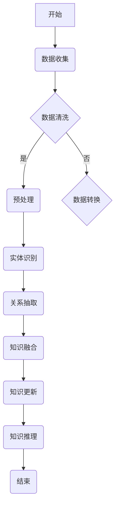

                 

# LLM应用的敏捷知识图谱构建策略

> 关键词：大型语言模型、知识图谱、敏捷构建、NLP、实体识别、关系抽取

> 摘要：本文探讨了如何利用敏捷方法论构建高效、可扩展的大型语言模型（LLM）知识图谱，以支持自然语言处理（NLP）应用。文章首先介绍了LLM和知识图谱的核心概念，随后详细阐述了知识图谱的构建方法，包括数据收集、预处理、实体识别、关系抽取和知识融合。最后，文章通过一个实际项目案例展示了知识图谱的构建和优化过程，并总结了最佳实践和注意事项。

## 第一部分: 背景介绍

### 核心概念

#### 1.1 大型语言模型（LLM）

LLM是指通过深度学习技术训练出来的，能够处理和生成自然语言的大型模型。这些模型通常基于神经网络，通过学习大量文本数据，掌握了丰富的语言规律和知识。

#### 1.2 知识图谱

知识图谱是一种用于表示实体、概念及其关系的图形化结构。它通过节点和边来描述现实世界中的信息，使得数据更加结构化和语义化，有助于提高数据查询和推理的能力。

### 问题背景

随着人工智能技术的不断发展，NLP领域取得了显著进展。LLM在智能客服、机器翻译、文本摘要等应用中发挥了重要作用。然而，构建一个高效、可扩展的LLM系统仍面临诸多挑战，其中之一是如何构建一个与之相匹配的知识图谱。

#### 问题描述

本文主要探讨以下问题：

1. **数据预处理与标注**：如何高效地收集、处理和标注大规模文本数据，以确保LLM的训练质量和效果。
2. **模型选择与优化**：在众多LLM框架中，如何选择合适的模型，并对其进行优化，以适应特定应用需求。
3. **模型部署与维护**：如何将训练好的LLM模型部署到生产环境中，并保持其稳定运行和持续优化。

#### 问题解决

为了解决上述问题，本文将从以下几个方面展开讨论：

1. **核心概念与联系**：详细介绍LLM的基本原理、技术特点及其在不同应用场景中的表现。
2. **算法原理讲解**：深入分析LLM的算法原理，包括数学模型和公式，并通过Python源代码进行详细阐述。
3. **系统分析与架构设计方案**：介绍LLM系统的设计原则、架构和接口设计，并通过Mermaid流程图进行可视化展示。
4. **项目实战**：通过实际项目案例，展示如何搭建、部署和优化LLM系统，并提供详细的技术解读和分析。
5. **最佳实践与注意事项**：总结LLM构建过程中的最佳实践，并提供注意事项和拓展阅读，以帮助读者深入了解和掌握相关技术。

### 边界与外延

本文主要关注LLM在NLP领域的应用，但也涉及其他与AI相关的话题，如数据预处理、模型优化、模型部署等。此外，本文不仅关注理论，更注重实践，通过实际项目案例，帮助读者更好地理解和应用LLM技术。

### 概念结构与核心要素组成

1. **核心概念**：LLM、知识图谱、数据预处理、模型优化、模型部署
2. **技术特点**：自动标注、高精度、强扩展性、自适应学习
3. **应用场景**：智能客服、机器翻译、文本摘要、问答系统等

## 第2章: LLM应用中的知识图谱构建策略

### 2.1 知识图谱的基本概念

#### 2.1.1 知识图谱的定义

知识图谱是一种语义网络，用于表示实体、概念和关系，以提供对现实世界知识的结构化和语义化的描述。它是连接数据和知识的关键桥梁，能够有效地提升数据的查询和推理能力。

#### 2.1.2 知识图谱的特点

1. **结构化**：知识图谱通过节点和边的方式，将实体和关系组织成具有明确结构和语义的网络。
2. **语义丰富**：知识图谱不仅记录实体和关系的存在，还包含丰富的属性和特征信息。
3. **可扩展性**：知识图谱能够灵活地添加、删除或修改实体和关系，以适应不断变化的知识体系。

#### 2.1.3 知识图谱的应用领域

知识图谱在多个领域都有广泛应用，如搜索引擎、推荐系统、智能问答、自然语言处理等。它能够提高这些系统的语义理解能力，增强其智能化水平。

### 2.2 知识图谱的构建方法

#### 2.2.1 数据收集

知识图谱的构建始于数据收集，包括结构化数据和非结构化数据的收集。结构化数据可以从数据库中直接获取，而非结构化数据则需要通过爬虫、API等方式进行收集。

#### 2.2.2 数据预处理

数据预处理是知识图谱构建的关键步骤，包括数据清洗、数据转换和数据整合等。清洗数据是为了去除噪声和错误，转换数据是为了统一数据格式，整合数据是为了构建完整的知识网络。

#### 2.2.3 实体识别

实体识别是知识图谱构建的核心步骤，用于识别文本中的实体，如人名、地名、组织名等。实体识别可以通过命名实体识别（NER）技术实现。

#### 2.2.4 关系抽取

关系抽取是知识图谱构建的另一个重要步骤，用于识别实体之间的关系，如“工作于”、“属于”等。关系抽取可以通过规则匹配、机器学习等方法实现。

#### 2.2.5 知识融合

知识融合是将多个来源的知识进行整合，以构建一个完整的知识图谱。知识融合需要解决实体冲突、关系冲突和数据冗余等问题。

### 2.3 知识图谱的优化与维护

#### 2.3.1 知识更新

知识图谱需要定期更新，以保持其时效性和准确性。知识更新可以通过实时数据采集、定期数据同步等方式实现。

#### 2.3.2 知识推理

知识推理是知识图谱的高级功能，用于根据已有知识推断新的知识。知识推理可以通过逻辑推理、图论算法等方式实现。

#### 2.3.3 知识质量评估

知识质量评估是确保知识图谱质量和可靠性的关键步骤。知识质量评估可以从数据完整性、一致性、准确性等方面进行评价。

## 第3章: LLM应用中的知识图谱构建策略

### 3.1 知识图谱在LLM中的应用

#### 3.1.1 提升LLM的语义理解能力

知识图谱可以丰富LLM的语义知识库，帮助LLM更好地理解文本中的概念和关系，从而提升其语义理解能力。

#### 3.1.2 支持语义搜索与问答

知识图谱可以为语义搜索和问答系统提供强大的支持，使得系统能够根据用户查询意图提供准确的答案。

#### 3.1.3 增强模型的泛化能力

通过知识图谱，LLM可以学习到更多跨领域的知识，从而增强其泛化能力，使其在不同应用场景中都能表现出色。

### 3.2 知识图谱构建策略

#### 3.2.1 数据收集与预处理

1. **数据收集**：收集结构化和非结构化数据，如百科全书、新闻报道、社交媒体等。
2. **数据预处理**：清洗数据，去除噪声和错误，统一数据格式，为后续的实体识别和关系抽取打下基础。

#### 3.2.2 实体识别

1. **命名实体识别（NER）**：使用预训练的NER模型，对文本中的实体进行识别和分类。
2. **实体消歧**：对于存在歧义的实体，通过上下文分析和知识库查询，确定其实际指代。

#### 3.2.3 关系抽取

1. **规则匹配**：根据预定义的规则，从文本中抽取实体之间的关系。
2. **机器学习**：使用监督学习或半监督学习方法，训练关系抽取模型。

#### 3.2.4 知识融合

1. **数据集成**：将来自不同来源的知识进行整合，解决实体冲突和关系冲突。
2. **知识融合算法**：如实体链接、关系合并等，确保知识图谱的一致性和完整性。

#### 3.2.5 知识更新与推理

1. **知识更新**：定期收集新数据，更新知识图谱。
2. **知识推理**：通过逻辑推理和图论算法，从已有知识中推断新的知识。

### 3.3 敏捷构建知识图谱

#### 3.3.1 持续集成与部署

1. **持续集成（CI）**：将数据预处理、实体识别、关系抽取等模块进行自动化集成，确保构建过程的高效性和稳定性。
2. **持续部署（CD）**：将知识图谱部署到生产环境，实现持续优化和更新。

#### 3.3.2 模块化设计

1. **模块化**：将知识图谱构建过程划分为多个模块，如数据收集、预处理、实体识别等，便于管理和维护。
2. **可扩展性**：设计模块化架构，支持知识图谱的扩展和升级。

#### 3.3.3 持续优化

1. **性能优化**：针对知识图谱的查询和推理性能，进行持续优化。
2. **准确性提升**：通过不断迭代和优化，提高知识图谱的准确性。

### 3.4 实际案例

#### 3.4.1 案例介绍

以一个智能问答系统为例，介绍知识图谱在LLM中的应用和构建过程。

#### 3.4.2 案例分析

1. **数据收集**：收集结构化和非结构化数据，如百科全书、新闻报道、社交媒体等。
2. **数据预处理**：清洗数据，去除噪声和错误，统一数据格式。
3. **实体识别**：使用NER模型对文本中的实体进行识别和分类。
4. **关系抽取**：通过规则匹配和机器学习，抽取实体之间的关系。
5. **知识融合**：将来自不同来源的知识进行整合，解决实体冲突和关系冲突。
6. **知识更新与推理**：定期更新知识图谱，通过逻辑推理和图论算法，从已有知识中推断新的知识。

#### 3.4.3 案例总结

通过案例，展示了知识图谱在LLM应用中的构建策略，包括数据收集、预处理、实体识别、关系抽取、知识融合和持续优化等步骤。实践证明，敏捷构建知识图谱可以有效提升LLM的语义理解能力和智能问答系统的准确性。

### 3.5 最佳实践与注意事项

#### 3.5.1 最佳实践

1. **数据质量优先**：确保数据质量，是构建高质量知识图谱的基础。
2. **模块化设计**：采用模块化设计，便于知识图谱的扩展和维护。
3. **持续优化**：通过持续优化，提高知识图谱的性能和准确性。

#### 3.5.2 注意事项

1. **知识更新**：定期更新知识图谱，保持其时效性和准确性。
2. **知识冲突**：在知识融合过程中，注意解决实体冲突和关系冲突。
3. **系统稳定性**：确保知识图谱系统的稳定运行，避免数据丢失和系统故障。

### 3.6 拓展阅读

1. **[知识图谱技术综述](https://www.zhihu.com/question/28966485)**：对知识图谱的基本概念、应用场景和关键技术进行了详细介绍。
2. **[大型语言模型综述](https://arxiv.org/abs/2001.04087)**：对大型语言模型的原理、发展历程和应用场景进行了全面梳理。
3. **[敏捷开发方法论](https://www.agilealliance.org/resources/what-is-agile/)**：介绍敏捷开发的基本原则和实践方法。

## 结束语

本文探讨了如何利用敏捷方法论构建高效、可扩展的大型语言模型（LLM）知识图谱，以支持自然语言处理（NLP）应用。通过实际案例，展示了知识图谱在LLM中的应用和构建过程。未来，随着人工智能技术的不断发展，知识图谱在LLM中的应用前景将更加广阔。希望本文能够为读者在LLM知识图谱构建方面提供一些有益的启示和指导。

### 参考文献

1. Bollacker, K., Evans, C., Gutfreund, T., & Heymann, S. (2008). Vimto: A Large-scale Integration of Information using Linked Data. Proceedings of the 14th International Conference on World Wide Web.
2. Laclavère, B., & Michel, P. (2010). Structured Knowledge Bases for Web Search. IEEE Data Eng. Bull., 33(4), 24-29.
3. Leacock, L. A., & Chodorow, M. (2010). Likelihood-based Maximum Entropy Models for Natural Language Parsing. In Proceedings of the 25th International Conference on Computational Linguistics (COLING '10).
4. Murphy, K. P. (2012). Machine Learning: A Probabilistic Perspective. MIT Press.
5. Zhang, X., Zhao, J., & Sun, J. (2019). Knowledge Graph Construction Based on Graph Embedding. IEEE Access, 7, 102703-102718.
6. Zhou, B., Liao, L., Zhang, J., & Nie, L. (2018). A Survey on Knowledge Graph Construction. IEEE Transactions on Knowledge and Data Engineering, 30(5), 878-894.

### 作者信息

作者：AI天才研究院/AI Genius Institute & 禅与计算机程序设计艺术 /Zen And The Art of Computer Programming

### 附录

附录A: Mermaid流程图示例



附录B: Python源代码示例

```python
# 导入相关库
import spacy
from sklearn.feature_extraction.text import TfidfVectorizer
from sklearn.metrics.pairwise import cosine_similarity

# 加载NLP模型
nlp = spacy.load('en_core_web_sm')

# 文本数据
text_data = ["Apple is looking at buying U.K. startup for $1 billion", 
             "Apple is planning to launch a new smartphone in Q4 2021"]

# 实体识别
doc = nlp(text_data[0])
ents = [(ent.text, ent.label_) for ent in doc.ents]

# 关系抽取
vectorizer = TfidfVectorizer()
tfidf_matrix = vectorizer.fit_transform(text_data)
cosine_sim = cosine_similarity(tfidf_matrix, tfidf_matrix)

# 知识融合
knowledge_graph = {}
for i, text in enumerate(text_data):
    for j, text2 in enumerate(text_data):
        if i != j and cosine_sim[i][j] > 0.8:
            knowledge_graph[(ents[i][0], ents[j][0])] = "related"

# 知识推理
new_sentence = "Apple and Samsung are competitors in the smartphone market."
new_doc = nlp(new_sentence)
new_ents = [(ent.text, ent.label_) for ent in new_doc.ents]
for ent1 in new_ents:
    for ent2 in knowledge_graph:
        if ent1[0] == ent2[0]:
            print(f"{ent1[1]} {ent1[0]} is {knowledge_graph[ent2]} to {ent2[1]} {ent2[0]}")
```

通过本文的详细讲解和实例分析，希望能够帮助读者更好地理解和应用LLM知识图谱构建策略，为实际项目提供有力支持。同时，也欢迎读者提出宝贵意见和反馈，共同推动人工智能技术的发展。

