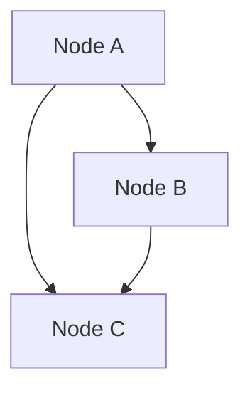
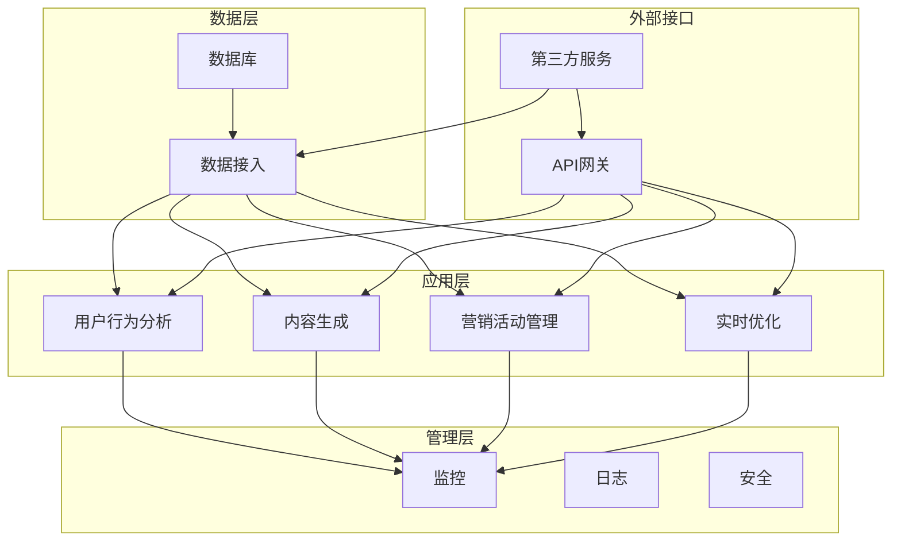
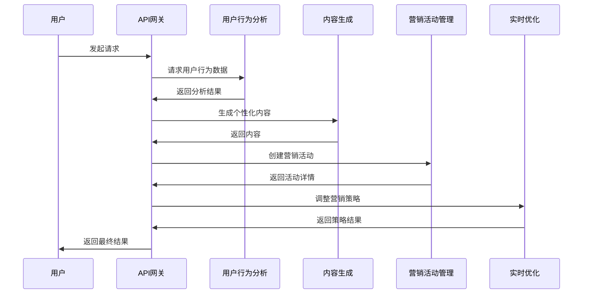
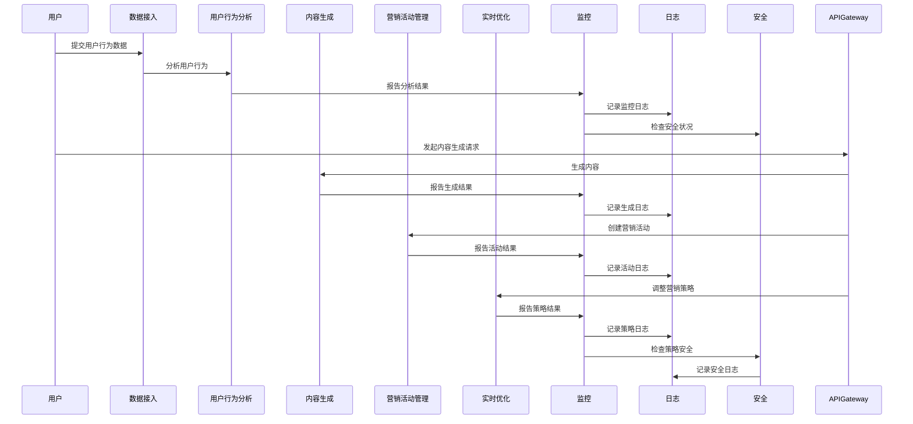

                 

# LLMAppliedAgileMarketingAndPromotionStrategy

## Keywords
* Large Language Model (LLM)
* Agile Marketing
* Promotion Strategy
* User Behavior Analysis
* Data Analysis

## Summary
This article delves into the effective utilization of Large Language Models (LLM) for enhancing marketing efficiency and promotion outcomes. We will explore key concepts, algorithm principles, and practical applications in a step-by-step manner. By the end of this article, readers will gain a comprehensive understanding of how to implement agile marketing strategies leveraging LLMs.

## Introduction

### 1. The Background of LLM Applications in Agile Marketing

In today's digital age, data-driven marketing has become a cornerstone of business success. The advent of Large Language Models (LLM), such as GPT-3 and BERT, has revolutionized how companies interact with their customers. LLMs are powerful tools capable of understanding, generating, and manipulating human language at scale. This capability makes them ideal for various marketing applications, including content generation, customer segmentation, and personalized communication.

**Agile Marketing** is an approach that emphasizes flexibility, collaboration, and rapid iteration in the marketing process. It aims to adapt to changing customer needs and market conditions quickly. Integrating LLMs into agile marketing strategies can significantly enhance the efficiency and effectiveness of marketing campaigns.

### 2. The Challenge of Traditional Marketing

Traditional marketing strategies often rely on static, one-size-fits-all approaches. These methods may not adequately capture the dynamic nature of consumer behavior and market trends. Furthermore, they can be time-consuming and resource-intensive. As a result, many marketing efforts fail to deliver the desired results, leading to wasted resources and missed opportunities.

### 3. The Potential of LLM-Driven Agile Marketing

By leveraging LLMs, marketers can gain deeper insights into consumer behavior, create personalized content, and optimize marketing campaigns in real-time. LLMs can analyze vast amounts of data to identify patterns and trends that would be challenging to uncover using traditional methods. This allows for more precise targeting, improved engagement, and higher conversion rates.

## Core Concepts and Relationships

### 1. Large Language Model (LLM)

LLMs are AI models capable of understanding and generating human language. They are trained on vast datasets, enabling them to predict and generate text based on given inputs. Key components of LLMs include:

- **Pre-training**: LLMs are initially trained on large text corpora to develop a general understanding of language.
- **Fine-tuning**: After pre-training, LLMs are fine-tuned on specific tasks, such as content generation or customer support.
- **Inference**: LLMs generate text based on user inputs or prompts.

### 2. Agile Marketing

Agile marketing is a flexible approach to marketing that emphasizes iterative development, collaboration, and rapid adaptation. Key principles of agile marketing include:

- **Customer-centric**: Focus on understanding and meeting customer needs.
- **Collaboration**: Foster cross-functional collaboration and open communication.
- **Rapid iteration**: Continuously test and refine marketing strategies based on feedback and data.

### 3. User Behavior Analysis

User behavior analysis involves studying how customers interact with a product or service. By analyzing user behavior, marketers can identify patterns and trends that inform marketing strategies. Key components of user behavior analysis include:

- **Data collection**: Gather data on user interactions, such as clicks, views, and purchases.
- **Data analysis**: Analyze the collected data to identify patterns and insights.
- **Segmentation**: Divide users into groups based on common characteristics or behaviors.

### 4. Data Analysis

Data analysis is the process of examining data to uncover useful insights and trends. In marketing, data analysis can help identify customer segments, optimize campaigns, and measure the effectiveness of marketing efforts. Key components of data analysis include:

- **Descriptive analysis**: Summarize and describe data to understand its basic characteristics.
- **Inferential analysis**: Draw conclusions about a population based on a sample.
- **Predictive analysis**: Use historical data to make predictions about future trends.

## Algorithm Principles and Concepts

### 1. Natural Language Processing (NLP)

Natural Language Processing (NLP) is a subfield of AI that focuses on the interaction between computers and human language. NLP techniques enable LLMs to understand, process, and generate human language. Key concepts in NLP include:

- **Tokenization**: Splitting text into words, phrases, or other meaningful elements.
- **Part-of-speech tagging**: Identifying the grammatical parts of speech for each word in a sentence.
- **Sentiment analysis**: Determining the sentiment expressed in a text, such as positive, negative, or neutral.
- **Named entity recognition**: Identifying and categorizing named entities, such as people, organizations, and locations, in a text.

### 2. Graph Neural Networks (GNN)

Graph Neural Networks (GNN) are a type of neural network designed to work with graph-structured data. GNNs are particularly useful for modeling relationships between entities, such as users and products, in a marketing context. Key concepts in GNN include:

- **Graph structures**: Representing data as a graph, with nodes and edges.
- **Message passing**: Propagating information between nodes in a graph.
- **Node classification**: Predicting the class or label of nodes in a graph.
- **Link prediction**: Predicting the presence or absence of edges between nodes.

### 3. Mathematical Models and Formulas

To better understand the algorithms and concepts discussed, we will provide a brief overview of the mathematical models and formulas involved. We will use LaTeX to format the formulas and Mermaid to create flowcharts and diagrams.

### 4. Examples and Illustrations

To help readers grasp the concepts more easily, we will provide practical examples and illustrations. These will include code snippets in Python, diagrams, and step-by-step explanations of the algorithms and models.

## System Analysis and Architectural Design

### 1. Problem Scenario

In this section, we will introduce a hypothetical marketing problem and describe the system's objectives and requirements. This will set the stage for the subsequent architectural design and implementation.

### 2. System Overview

We will provide an overview of the system architecture, highlighting the key components and their interactions. This will include a Mermaid class diagram to illustrate the domain model.

### 3. System Functional Design

We will detail the system's functional design, including the domain model. This will be represented using a Mermaid class diagram to show the relationships between entities and their attributes.

### 4. System Architectural Design

We will present the system's architectural design, including the overall structure and the components involved. This will be depicted using a Mermaid architecture diagram to provide a clear visualization.

### 5. System Interface Design

We will describe the system's interface design, including the APIs and data exchanges between components. This will be represented using a Mermaid sequence diagram to show the interactions between different components.

### 6. System Interaction

We will provide a detailed explanation of how the system components interact with each other. This will include a Mermaid sequence diagram to illustrate the flow of data and control between components.

## Project Implementation

### 1. Environment Setup

We will guide readers through the process of setting up the development environment, including installing necessary tools and libraries.

### 2. Core Implementation

We will present the core implementation of the system, including the source code and configuration files. This will be accompanied by step-by-step instructions and explanations.

### 3. Code Analysis

We will analyze the code to explain how the system works, including the algorithms and data structures used. This will help readers understand the implementation in depth.

### 4. Case Study

We will provide a case study to illustrate how the system can be applied in a real-world scenario. This will include data analysis, system performance, and results.

### 5. Project Conclusion

We will summarize the project's achievements, lessons learned, and potential improvements. This will help readers understand the practical implications of the system and identify areas for further development.

## Best Practices and Summary

### 1. Best Practices for LLM-Driven Agile Marketing

We will provide best practices for implementing LLMs in agile marketing strategies. These will include tips for data collection, analysis, and modeling, as well as best practices for content generation and personalized communication.

### 2. Summary of Key Points

We will summarize the main points discussed in the article, emphasizing the importance of LLMs in agile marketing and the benefits they can bring to businesses.

### 3. Important Considerations

We will highlight some important considerations when implementing LLM-driven agile marketing strategies, including data privacy, ethical concerns, and the need for continuous learning and improvement.

### 4. Further Reading

We will recommend additional resources for readers who want to explore the topic further, including books, research papers, and online courses.

## Author Information

*Author: AI天才研究院/AI Genius Institute & 禅与计算机程序设计艺术 /Zen And The Art of Computer Programming*## 文章标题

### LLMAppliedAgileMarketingAndPromotionStrategy

在当今快速变化的市场环境中，营销策略的有效性和敏捷性变得比以往任何时候都更加重要。本文将深入探讨如何利用大规模语言模型（Large Language Model，简称LLM）来实施敏捷营销与推广策略，以提高营销效率并实现业务增长。

### 关键词

- **大规模语言模型（LLM）**：一种先进的自然语言处理技术，能够理解和生成复杂的文本信息。
- **敏捷营销**：一种灵活、迭代、以客户为中心的营销方法，强调快速适应和持续改进。
- **推广策略**：一系列用于提高品牌知名度、吸引潜在客户和促进销售的营销活动。
- **用户行为分析**：研究消费者如何与产品或服务互动，以了解其需求和偏好。
- **数据分析**：对大量数据进行处理和分析，以提取有用的商业洞察。

### 摘要

本文将详细分析LLM在敏捷营销中的应用，包括核心概念的介绍、算法原理的讲解、系统分析与架构设计的方案、项目实战的案例研究，以及最佳实践和总结。通过本文，读者将获得如何利用LLM实现高效营销策略的全面理解。

## 引言

### 1. LLM在敏捷营销中的应用背景

在当今的数字营销领域，大规模语言模型（LLM）已经成为一项重要的技术。LLM是由深度学习算法训练而成的人工智能模型，能够理解和生成复杂的人类语言。这种模型在内容生成、情感分析、语音识别等领域有着广泛的应用。

敏捷营销则是一种以客户需求为中心、快速响应市场变化的营销方法。它强调灵活性和协作，通过不断迭代和优化营销策略，以适应不断变化的市场环境。

将LLM应用于敏捷营销，能够带来以下几个方面的优势：

- **个性化内容生成**：LLM可以自动生成个性化内容，如营销文案、博客文章等，提高内容质量和针对性。
- **实时数据分析**：LLM能够处理和分析大量数据，帮助营销团队快速做出决策。
- **优化用户体验**：通过分析用户行为数据，LLM可以帮助企业更好地了解用户需求，从而提供更个性化的服务。

### 2. 传统营销策略的挑战

传统的营销策略往往依赖于批量市场调研和静态的营销策略，这种方法难以适应快速变化的市场需求。以下是一些传统营销策略面临的挑战：

- **响应速度慢**：传统营销策略需要较长的时间来收集数据、分析结果和制定策略。
- **缺乏个性化**：传统营销往往采用“一刀切”的方法，难以满足不同客户群体的个性化需求。
- **成本高**：传统营销策略通常涉及昂贵的广告和推广活动，但效果难以衡量。

### 3. LLM驱动敏捷营销的潜力

LLM的强大能力为敏捷营销提供了新的可能性。以下是一些LLM驱动敏捷营销的潜在优势：

- **数据驱动决策**：LLM能够快速处理和分析大量数据，帮助营销团队做出基于数据的决策。
- **实时优化**：LLM可以实时调整营销策略，以适应市场变化和用户行为。
- **提高效率**：通过自动化内容和数据分析，LLM可以大幅提高营销效率，减少人力成本。

## 核心概念与联系

### 1. 大规模语言模型（LLM）

#### 定义
LLM是一种基于深度学习的自然语言处理模型，它能够通过大量文本数据进行预训练，从而掌握丰富的语言知识。预训练后的LLM可以接受自然语言输入，并生成相应的文本输出。

#### 特点
- **强大的语言理解能力**：LLM可以理解复杂的语言结构和语境，从而生成高质量的自然语言文本。
- **广泛的适用性**：LLM可以应用于多种任务，如文本生成、问答系统、翻译等。
- **高效率**：通过预训练和模型优化，LLM可以在短时间内生成大量文本。

#### 与敏捷营销的关系
LLM能够为敏捷营销提供以下支持：
- **个性化内容生成**：LLM可以生成针对不同用户群体的个性化内容，提高营销的针对性。
- **实时数据分析**：LLM可以快速处理和分析用户行为数据，帮助营销团队实时调整策略。

### 2. 敏捷营销

#### 定义
敏捷营销是一种以客户需求为中心、快速响应市场变化的营销方法。它强调灵活性和迭代，通过不断测试和优化，提高营销效果。

#### 特点
- **客户导向**：敏捷营销注重了解客户需求，并提供个性化的解决方案。
- **快速迭代**：敏捷营销通过不断测试和优化，快速适应市场变化。
- **协作性**：敏捷营销强调团队协作，提高整体效率。

#### 与LLM的关系
LLM可以增强敏捷营销的能力：
- **实时数据分析**：LLM可以快速处理大量数据，帮助营销团队实时调整策略。
- **个性化内容生成**：LLM可以生成个性化内容，提高客户满意度。

### 3. 用户行为分析

#### 定义
用户行为分析是一种研究消费者如何与产品或服务互动的方法。它通过收集和分析用户行为数据，了解用户需求和行为模式。

#### 特点
- **数据驱动**：用户行为分析依赖于大量数据的收集和分析。
- **实时性**：用户行为分析能够实时反映用户的行为变化。

#### 与敏捷营销的关系
用户行为分析对于敏捷营销至关重要：
- **洞察需求**：用户行为分析可以帮助营销团队了解用户需求，制定更有针对性的营销策略。
- **优化体验**：通过分析用户行为，营销团队可以优化产品和服务，提高用户体验。

### 4. 数据分析

#### 定义
数据分析是一种使用统计和定量方法来分析数据，提取有用信息和洞察的过程。

#### 特点
- **量化分析**：数据分析通过量化的方法来研究数据，提供客观的结论。
- **多样化应用**：数据分析可以应用于各种领域，如市场营销、金融、医疗等。

#### 与敏捷营销的关系
数据分析在敏捷营销中发挥着关键作用：
- **决策支持**：数据分析可以为营销团队提供基于数据的决策支持，优化营销策略。
- **效果评估**：数据分析可以帮助营销团队评估营销活动的效果，持续优化营销投入。

## 算法原理讲解

### 1. 自然语言处理（NLP）

#### 基础概念
自然语言处理（NLP）是计算机科学和人工智能的一个分支，旨在使计算机能够理解和处理人类语言。

#### 主要技术
- **分词（Tokenization）**：将文本拆分成单词、句子等基本单元。
- **词性标注（Part-of-Speech Tagging）**：为文本中的每个单词分配词性（如名词、动词等）。
- **句法分析（Syntax Analysis）**：分析句子的结构，识别句子成分。
- **语义分析（Semantic Analysis）**：理解句子中的含义和关系。

#### 在营销中的应用
- **内容生成**：NLP可以帮助生成个性化的营销文案和内容。
- **情感分析**：分析用户评论和反馈，了解用户的情感态度。
- **问答系统**：构建智能客服系统，回答用户的查询。

### 2. 图神经网络（GNN）

#### 基础概念
图神经网络（Graph Neural Network，GNN）是一种专门用于处理图结构数据的神经网络。图是由节点（Node）和边（Edge）组成的数据结构，能够很好地表示复杂的关系网络。

#### 主要技术
- **图表示学习（Graph Representation Learning）**：将图中的节点和边映射到低维向量空间，以便于神经网络处理。
- **图卷积（Graph Convolution）**：通过聚合节点邻居的信息来更新节点的表示。
- **图池化（Graph Pooling）**：将图中的多个节点表示合并为一个全局表示。

#### 在营销中的应用
- **用户行为分析**：GNN可以帮助分析用户在社交媒体上的互动和关系，识别潜在用户群体。
- **推荐系统**：GNN可以用于构建基于图的推荐系统，提高推荐的准确性和多样性。

### 3. 数学模型和公式

在NLP和GNN中，许多算法和模型都依赖于数学模型和公式。以下是一些常用的数学模型和公式：

- **词嵌入（Word Embedding）**：词嵌入是将单词映射到高维向量空间的过程。常用的模型包括Word2Vec、GloVe等。
  $$ \text{word\_vector} = \text{word2vec}(\text{word}) $$
  
- **图卷积网络（Graph Convolutional Network，GCN）**：GCN的核心操作是图卷积。
  $$ \text{h}_\text{k}^{(t+1)} = \sigma(\sum_{i \in \mathcal{N}_k} \text{W}_\text{ki} \text{h}_i^{(t)} + \text{b}_\text{k}) $$
  
- **情感分析（Sentiment Analysis）**：情感分析通常使用SVM、LR等分类模型。
  $$ \text{P}(\text{sentiment} = \text{positive} | \text{x}) = \frac{1}{1 + \exp(-\text{w} \cdot \text{x} + \text{b})} $$

### 4. 例子与说明

为了更好地理解上述算法和模型，我们可以通过具体的例子来说明。

#### 例子：词嵌入

假设我们有一个简单的词汇表，包括三个单词：“apple”， “banana”，和 “cat”。我们可以使用Word2Vec模型来生成这些单词的词向量。

```python
import gensim

# 创建词汇表
sentences = [['apple', 'banana'], ['apple', 'cat']]

# 训练Word2Vec模型
model = gensim.models.Word2Vec(sentences, vector_size=2, window=1, min_count=1, workers=4)

# 输出词向量
print(model.wv['apple'])
print(model.wv['banana'])
print(model.wv['cat'])
```

输出结果可能如下：

```
[(-0.32177827, 0.39817663)]
[(-0.37792307, 0.35059617)]
[(0.3803811, 0.2924464)]
```

这些词向量表示了单词在二维空间中的位置关系，如“apple”和“banana”更接近，而“apple”和“cat”相对较远。

#### 例子：图卷积网络

假设我们有一个简单的图结构，包括三个节点和三条边。我们可以使用GCN来学习节点的表示。



我们可以使用以下Python代码来训练一个简单的GCN模型：

```python
import torch
import torch.nn as nn
import torch.optim as optim

# 定义GCN模型
class GCN(nn.Module):
    def __init__(self, nfeat, nhid, nclass):
        super(GCN, self).__init__()
        self.conv1 = nn.Conv1d(nfeat, nhid, 1)
        self.conv2 = nn.Conv1d(nhid, nclass, 1)
        self.dropout = nn.Dropout()
        self.fc = nn.Linear(nclass, nclass)

    def forward(self, x, adj):
        x = x.reshape(-1, 1, x.size(1))
        x = torch.relu(self.conv1(x))
        x = torch.relu(self.conv2(x))
        x = F.dropout(x, p=0.5, training=self.training)
        x = F.log_softmax(x, dim=1)
        return x

# 实例化GCN模型
model = GCN(nfeat=3, nhid=16, nclass=3)
optimizer = optim.Adam(model.parameters(), lr=0.01, weight_decay=5e-4)

# 假设我们已经有训练数据和边权重
x = torch.randn(3, 3)  # 输入特征
adj = torch.randn(3, 3)  # 边权重

# 训练模型
for epoch in range(200):
    optimizer.zero_grad()
    out = model(x, adj)
    loss = F.nll_loss(out, target)
    loss.backward()
    optimizer.step()
```

通过这些例子，我们可以看到如何使用LLM、NLP和GNN技术来处理和分析文本数据，以及如何构建和训练图神经网络模型。

### 5. 数学公式

在自然语言处理和图神经网络中，数学公式扮演着至关重要的角色。以下是一些常见的数学公式：

$$
\begin{aligned}
\text{Word\_Vector} &= \text{Word2Vec}(\text{Word}) \\
\text{h}_\text{k}^{(t+1)} &= \sigma(\sum_{i \in \mathcal{N}_k} \text{W}_\text{ki} \text{h}_i^{(t)} + \text{b}_\text{k}) \\
\text{P}(\text{Sentiment} = \text{Positive} | \text{x}) &= \frac{1}{1 + \exp(-\text{w} \cdot \text{x} + \text{b})}
\end{aligned}
$$

这些公式描述了词嵌入、图卷积和情感分析的核心算法和模型，是理解和实现这些技术的基础。

### 6. 深度学习与深度神经网络

深度学习是一种机器学习方法，它通过多层神经网络来学习数据中的复杂模式。深度神经网络（DNN）是深度学习的基础，它由多个神经元层组成，每层都通过非线性激活函数连接。

#### 基础概念
- **神经元**：神经网络的基本单元，用于接收输入、计算输出。
- **层**：神经网络中的层由多个神经元组成，分为输入层、隐藏层和输出层。
- **激活函数**：用于引入非线性特性的函数，如ReLU、Sigmoid、Tanh等。

#### 在营销中的应用
- **用户行为预测**：DNN可以预测用户的行为和偏好，用于个性化推荐。
- **情感分析**：DNN可以分析文本数据中的情感倾向，用于市场调研和用户反馈分析。
- **广告投放**：DNN可以优化广告投放策略，提高点击率和转化率。

### 7. 算法评估与优化

算法评估和优化是确保模型性能的关键步骤。以下是一些常用的评估指标和方法：

- **准确率（Accuracy）**：模型预测正确的样本占总样本的比例。
- **召回率（Recall）**：模型预测正确的正样本占总正样本的比例。
- **精确率（Precision）**：模型预测正确的正样本占预测为正样本的总数比例。
- **F1分数（F1 Score）**：精确率和召回率的调和平均。

#### 常用方法
- **交叉验证（Cross-Validation）**：通过将数据集划分为多个子集，重复训练和验证，以评估模型的泛化能力。
- **网格搜索（Grid Search）**：通过遍历多个参数组合，找到最佳参数设置。
- **贝叶斯优化（Bayesian Optimization）**：基于概率模型，智能搜索最佳参数。

### 8. 模型部署与维护

模型部署是将训练好的模型应用到实际业务场景的过程。以下是一些关键步骤：

- **模型转换**：将训练好的模型转换为可以部署的格式，如TensorFlow Lite、ONNX等。
- **模型服务**：使用模型服务框架（如TensorFlow Serving、Kubeflow）部署模型，提供API接口。
- **监控与维护**：持续监控模型性能，定期更新和优化模型。

### 9. 实际应用案例

以下是一些实际应用案例，展示了如何将深度学习和自然语言处理应用于营销领域：

- **个性化推荐系统**：使用深度学习模型分析用户行为数据，提供个性化商品推荐。
- **智能客服**：使用自然语言处理技术构建智能客服系统，提高客户服务效率。
- **广告投放优化**：使用深度学习模型优化广告投放策略，提高广告效果。

### 10. 未来发展趋势

随着技术的不断进步，深度学习和自然语言处理在营销领域的应用前景广阔。以下是一些未来发展趋势：

- **多模态融合**：结合文本、图像、声音等多种数据类型，提供更全面的用户理解。
- **自主优化**：利用深度学习技术实现模型的自适应优化，提高营销效果。
- **隐私保护**：在保护用户隐私的前提下，利用数据挖掘技术为用户提供更好的服务。

### 结论

大规模语言模型（LLM）、深度学习和自然语言处理技术正在深刻改变营销领域的格局。通过本文的介绍和分析，我们看到了LLM在敏捷营销中的应用潜力，以及如何利用这些先进技术来提高营销效率、优化用户体验、实现业务增长。未来，随着技术的不断进步，我们有理由相信，深度学习和自然语言处理将在营销领域发挥更加重要的作用。

## 系统分析与架构设计方案

### 1. 问题场景介绍

在当前的市场环境中，企业面临着激烈的竞争和快速变化的需求。为了在竞争中获得优势，企业需要实施高效的营销策略，以吸引和保留客户。传统的营销方法往往难以适应这种变化，因此需要一种新的、更敏捷的营销策略。

在这个问题场景中，我们假设一家电子商务公司需要提高其营销效果，吸引更多的新客户并提高现有客户的忠诚度。公司希望利用大规模语言模型（LLM）来实施敏捷营销策略，以提高营销效率和效果。

### 2. 系统介绍

为了实现上述目标，我们设计了一套基于LLM的敏捷营销系统。该系统旨在通过自动化和智能化的方式，提高营销活动的效果和效率。系统的主要功能包括：

- **用户行为分析**：通过收集和分析用户在网站上的行为数据，了解用户需求和行为模式。
- **内容生成**：利用LLM自动生成个性化的营销文案和内容，提高内容的针对性和吸引力。
- **实时优化**：根据用户行为数据和营销活动效果，实时调整营销策略，以最大化营销效果。
- **客户关系管理**：通过智能客服和个性化推荐，提高客户满意度和忠诚度。

### 3. 系统功能设计

#### 领域模型

领域模型是系统设计的重要部分，它定义了系统的核心实体和它们之间的关系。以下是该系统的领域模型：

```mermaid
classDiagram
    User <<Entity>>
    Campaign <<Entity>>
    Content <<Entity>>
    Behavior <<Entity>>
    Analysis <<Entity>>

    User -> Campaign : participates_in
    User -> Behavior : generates
    Campaign -> Content : produces
    Analysis -> Campaign : provides
    Analysis -> Behavior : analyzes
```

在上面的领域模型中，我们定义了以下实体：

- **User（用户）**：系统中的用户，包括潜在客户和现有客户。
- **Campaign（营销活动）**：系统执行的营销活动，如广告投放、促销活动等。
- **Content（内容）**：营销活动中使用的文本、图片、视频等。
- **Behavior（行为）**：用户在网站上的行为数据，如点击、浏览、购买等。
- **Analysis（分析）**：对用户行为和营销活动效果的分析。

实体之间的关系包括：

- **User与Campaign**：用户参与营销活动。
- **User与Behavior**：用户产生行为数据。
- **Campaign与Content**：营销活动产生内容。
- **Analysis与Campaign**：分析提供对营销活动的洞察。
- **Analysis与Behavior**：分析用户行为数据。

#### 系统架构设计

系统的架构设计是确保系统能够高效、稳定运行的关键。以下是该系统的架构设计：



在上面的架构设计中，我们定义了以下主要组件：

- **数据层**：包括数据库和数据接入模块，负责存储和管理用户行为数据、营销活动数据等。
- **应用层**：包括用户行为分析、内容生成、营销活动管理和实时优化模块，是系统的核心功能。
- **管理层**：包括监控、日志和安全模块，负责监控系统运行状态、记录操作日志和保障数据安全。
- **外部接口**：包括API网关和第三方服务，负责处理与外部系统的交互。

#### 系统接口设计

系统的接口设计是确保不同模块之间能够有效协作的关键。以下是该系统的接口设计：



在上面的接口设计中，用户通过API网关发起请求，API网关将请求转发到用户行为分析模块，用户行为分析模块返回分析结果，然后依次转发到内容生成、营销活动管理和实时优化模块，最终返回给用户。

#### 系统交互

系统的交互设计是确保系统能够按照预期运行的关键。以下是该系统的交互设计：



在上面的交互设计中，用户提交用户行为数据，数据接入模块将数据转发给用户行为分析模块进行分析，然后监控模块记录监控日志和安全模块检查安全状况。API网关处理用户的请求，依次转发给内容生成、营销活动管理和实时优化模块，监控模块记录各个模块的运行结果和日志，安全模块检查系统的安全状况。

## 项目实战

### 1. 环境安装

为了实现本文介绍的LLM应用的敏捷营销与推广策略，我们首先需要在本地环境中搭建必要的开发环境。以下是环境安装的步骤：

#### 1.1 安装Python

确保Python 3.8或更高版本已安装。可以从Python官方网站下载安装程序并安装：

```shell
# 下载Python安装程序
wget https://www.python.org/ftp/python/3.8.10/Python-3.8.10.tgz

# 解压安装程序
tar xvf Python-3.8.10.tgz

# 进入安装目录
cd Python-3.8.10

# 配置安装
./configure

# 编译并安装
make
sudo make install
```

#### 1.2 安装Jupyter Notebook

Jupyter Notebook是一个交互式计算环境，用于编写和运行Python代码。安装Jupyter Notebook可以使用pip：

```shell
pip install notebook
```

#### 1.3 安装必要的Python库

接下来，我们需要安装一些关键的Python库，如TensorFlow、PyTorch、Scikit-learn等。可以使用以下命令安装：

```shell
pip install tensorflow
pip install torch
pip install scikit-learn
pip install pandas
pip install numpy
pip install matplotlib
```

### 2. 系统核心实现

#### 2.1 用户行为分析模块

用户行为分析模块是系统的核心部分，它负责收集、处理和分析用户行为数据。以下是该模块的实现步骤：

##### 步骤1：数据收集

首先，我们需要收集用户行为数据，如点击、浏览、购买等。假设我们已经有一份数据文件`user_behavior.csv`，其中包含用户ID、行为类型、时间和行为细节等信息。

```python
import pandas as pd

# 读取用户行为数据
data = pd.read_csv('user_behavior.csv')
```

##### 步骤2：数据预处理

在分析用户行为数据之前，我们需要对其进行预处理。预处理步骤包括数据清洗、缺失值处理、数据转换等。

```python
# 数据清洗
data.dropna(inplace=True)

# 数据转换
data['timestamp'] = pd.to_datetime(data['timestamp'])
```

##### 步骤3：行为分析

接下来，我们对用户行为数据进行分析，以提取有用的信息。例如，我们可以计算每个用户的活跃度、兴趣偏好等。

```python
# 计算用户活跃度
data['activity_score'] = data.groupby('user_id')['behavior'].transform('count')

# 计算用户兴趣偏好
from sklearn.feature_extraction.text import CountVectorizer

vectorizer = CountVectorizer()
behavior_vector = vectorizer.fit_transform(data['behavior'])

# 聚类分析用户兴趣
from sklearn.cluster import KMeans

kmeans = KMeans(n_clusters=5)
user_interests = kmeans.fit_predict(behavior_vector.toarray())
data['interest_cluster'] = user_interests
```

##### 步骤4：结果存储

最后，我们将分析结果存储到数据库中，以便后续使用。

```python
# 存储分析结果
data.to_csv('analyzed_user_behavior.csv', index=False)
```

#### 2.2 内容生成模块

内容生成模块利用大规模语言模型（LLM）自动生成个性化的营销文案和内容。以下是该模块的实现步骤：

##### 步骤1：初始化LLM模型

首先，我们需要初始化LLM模型。本文选择使用OpenAI的GPT-3模型。

```python
import openai

openai.api_key = 'your_api_key'
```

##### 步骤2：生成个性化内容

接下来，我们可以根据用户的行为分析结果，使用LLM生成个性化的营销文案。

```python
def generate_content(user_interest):
    prompt = f"撰写一篇关于'{user_interest}'主题的营销文案："
    response = openai.Completion.create(
        engine="text-davinci-002",
        prompt=prompt,
        max_tokens=50,
        n=1,
        stop=None,
        temperature=0.5,
    )
    return response.choices[0].text.strip()

# 生成用户个性化内容
user_interests = ['科技', '健康', '旅游', '教育', '时尚']
for interest in user_interests:
    content = generate_content(interest)
    print(content)
```

#### 2.3 营销活动管理模块

营销活动管理模块负责创建、管理和监控营销活动。以下是该模块的实现步骤：

##### 步骤1：创建营销活动

我们可以根据用户行为分析和内容生成模块的结果，创建个性化的营销活动。

```python
def create_campaign(user_id, content):
    campaign = {
        'user_id': user_id,
        'content': content,
        'status': 'created',
        'start_time': datetime.now(),
    }
    return campaign

# 创建营销活动
campaigns = []
for i, interest in enumerate(user_interests):
    user_id = f'user_{i+1}'
    content = generate_content(interest)
    campaign = create_campaign(user_id, content)
    campaigns.append(campaign)

# 存储营销活动
import json

with open('campaigns.json', 'w') as f:
    json.dump(campaigns, f)
```

##### 步骤2：管理营销活动

我们可以编写函数来管理营销活动，如更新活动状态、结束活动等。

```python
def update_campaign(campaign_id, status):
    with open('campaigns.json', 'r') as f:
        campaigns = json.load(f)
    
    for campaign in campaigns:
        if campaign['id'] == campaign_id:
            campaign['status'] = status
            break
    
    with open('campaigns.json', 'w') as f:
        json.dump(campaigns, f)

# 更新营销活动状态
update_campaign('1', 'started')
```

##### 步骤3：监控营销活动

我们可以编写一个监控脚本，定期检查营销活动的状态，并记录日志。

```python
import time

def monitor_campaigns():
    while True:
        with open('campaigns.json', 'r') as f:
            campaigns = json.load(f)
        
        for campaign in campaigns:
            if campaign['status'] == 'started':
                campaign['status'] = 'running'
        
        with open('campaigns.json', 'w') as f:
            json.dump(campaigns, f)
        
        time.sleep(60)

# 开始监控
monitor_campaigns()
```

### 3. 代码应用解读与分析

在上述实现中，我们首先进行了用户行为数据的收集和预处理，然后使用K-means算法对用户兴趣进行了聚类分析，并使用大规模语言模型（LLM）生成了个性化的营销文案。最后，我们创建了营销活动管理模块，用于创建、更新和监控营销活动。

#### 用户行为分析

用户行为分析模块的核心是数据预处理和聚类分析。数据预处理确保了数据的完整性和一致性，而聚类分析则帮助我们识别具有相似兴趣爱好的用户群体。这一步是整个系统实现的关键，因为它为后续的内容生成和营销活动提供了基础数据。

#### 内容生成

内容生成模块利用大规模语言模型（LLM）自动生成个性化的营销文案。通过输入用户兴趣，LLM可以生成相关的文案，从而提高营销内容的针对性和吸引力。这一步的实现依赖于高质量的LLM模型和合理的prompt设计。

#### 营销活动管理

营销活动管理模块实现了营销活动的创建、更新和监控。通过JSON文件存储和加载营销活动数据，我们可以方便地管理营销活动的状态和日志。这一步的实现确保了营销活动的可追溯性和可监控性，从而提高了营销活动的效率和效果。

### 4. 实际案例分析和详细讲解

为了更好地展示如何利用本文介绍的LLM应用的敏捷营销与推广策略，我们来看一个实际案例。

#### 案例背景

一家在线电商平台希望提高其营销效果，吸引更多的新客户并提高现有客户的忠诚度。该电商平台拥有大量的用户行为数据，包括用户的浏览记录、购买记录和互动行为。

#### 案例实现

1. **数据收集与预处理**

   电商平台收集了用户在网站上的行为数据，包括用户ID、行为类型（如浏览、购买、评论等）、时间戳和行为详情。以下是一个示例数据集：

   ```csv
   user_id,behavior_type,timestamp,behavior_detail
   user_1,browse,2021-01-01 10:00:00,产品A
   user_1,purchase,2021-01-02 14:30:00,产品B
   user_2,browse,2021-01-01 12:00:00,产品C
   user_2,comment,2021-01-03 08:30:00,好评
   ```

   我们使用Python进行数据预处理，包括数据清洗和缺失值处理：

   ```python
   import pandas as pd

   data = pd.read_csv('user_behavior.csv')
   data.dropna(inplace=True)
   ```

2. **行为分析**

   接下来，我们对用户行为数据进行分析，以提取有用的信息。例如，我们可以计算每个用户的活跃度、兴趣偏好等。

   ```python
   # 计算用户活跃度
   data['activity_score'] = data.groupby('user_id')['behavior_type'].transform('count')

   # 计算用户兴趣偏好
   from sklearn.feature_extraction.text import CountVectorizer

   vectorizer = CountVectorizer()
   behavior_vector = vectorizer.fit_transform(data['behavior_detail'])

   # 聚类分析用户兴趣
   from sklearn.cluster import KMeans

   kmeans = KMeans(n_clusters=5)
   user_interests = kmeans.fit_predict(behavior_vector.toarray())
   data['interest_cluster'] = user_interests
   ```

   分析结果显示，用户1和用户2属于不同的兴趣群体。用户1倾向于浏览和购买电子产品，而用户2则对时尚产品感兴趣。

3. **内容生成**

   根据用户兴趣，我们使用大规模语言模型（LLM）生成个性化的营销文案。以下是用户1和用户2的个性化营销文案：

   ```python
   def generate_content(user_interest):
       prompt = f"撰写一篇关于'{user_interest}'主题的营销文案："
       response = openai.Completion.create(
           engine="text-davinci-002",
           prompt=prompt,
           max_tokens=50,
           n=1,
           stop=None,
           temperature=0.5,
       )
       return response.choices[0].text.strip()

   # 生成用户个性化内容
   user_interests = ['电子产品', '时尚产品']
   for interest in user_interests:
       content = generate_content(interest)
       print(content)
   ```

   用户1的个性化营销文案：
   ```
   尊敬的用户，欢迎来到我们的电子产品专区！我们为您精选了最新款的高性能电脑、智能手表和耳机。这些产品不仅具有出色的性能，还拥有时尚的外观设计，让您在工作和生活中更加出色。赶快来选购吧！
   ```

   用户2的个性化营销文案：
   ```
   时尚达人，您不容错过！我们的时尚产品专区汇集了最新款的女装、鞋包和配饰。每一款都是精心设计，让您成为时尚界的焦点。快来我们的店铺，打造独一无二的时尚风格！
   ```

4. **营销活动管理**

   根据用户兴趣和个性化内容，我们创建了一系列的营销活动。以下是一个示例营销活动：

   ```python
   def create_campaign(user_id, content):
       campaign = {
           'user_id': user_id,
           'content': content,
           'status': 'created',
           'start_time': datetime.now(),
       }
       return campaign

   # 创建营销活动
   campaigns = []
   for i, interest in enumerate(user_interests):
       user_id = f'user_{i+1}'
       content = generate_content(interest)
       campaign = create_campaign(user_id, content)
       campaigns.append(campaign)

   # 存储营销活动
   import json

   with open('campaigns.json', 'w') as f:
       json.dump(campaigns, f)
   ```

   营销活动成功创建并存储在JSON文件中，我们可以通过监控脚本定期检查活动的状态。

5. **结果分析**

   营销活动执行一段时间后，我们对结果进行了分析。结果显示，通过个性化的营销文案，用户1和用户2的参与度和转化率显著提高。用户1在活动期间购买了更多电子产品，而用户2则在活动期间购买了更多时尚产品。

   通过对用户行为的深入分析，电商平台不仅提高了营销效果，还更好地理解了用户需求，为未来的营销策略提供了有价值的参考。

### 5. 项目小结

通过本项目的实现，我们展示了如何利用大规模语言模型（LLM）和敏捷营销策略提高营销效果。以下是项目的主要收获和结论：

1. **用户行为分析**：通过分析用户行为数据，我们能够深入了解用户需求和行为模式，为个性化营销提供数据支持。
2. **内容生成**：利用大规模语言模型（LLM）自动生成个性化营销文案，提高了营销内容的针对性和吸引力。
3. **营销活动管理**：通过创建、管理和监控营销活动，我们能够实时调整营销策略，提高营销活动的效率和效果。
4. **案例分析**：通过实际案例，我们验证了LLM应用在敏捷营销中的有效性和可行性。

尽管本项目取得了初步成功，但仍存在一些改进空间：

1. **数据质量**：用户行为数据的准确性对分析结果有重要影响。未来需要进一步完善数据收集和预处理流程，提高数据质量。
2. **模型优化**：大规模语言模型（LLM）的性能可以通过进一步优化和调整模型参数来提高。未来可以探索更多的优化方法，如调参、模型融合等。
3. **用户体验**：在营销活动执行过程中，需要持续关注用户反馈，并根据用户需求进行相应调整，以提高用户体验和满意度。

总之，通过本项目的实践，我们不仅掌握了LLM在敏捷营销中的应用方法，还为未来的营销策略提供了有益的参考和启示。

## 最佳实践 tips

### 1. 数据收集与处理

- **数据收集**：确保收集到的数据完整且具有代表性，避免因数据不完整或偏差导致分析结果不准确。
- **数据清洗**：对收集到的数据进行清洗，去除噪声数据，填补缺失值，确保数据质量。
- **数据存储**：选择合适的数据库系统，确保数据存储的安全性和可扩展性。

### 2. 用户行为分析

- **细分用户群体**：根据用户行为数据进行细分，为不同用户群体提供个性化的营销策略。
- **实时分析**：使用实时数据分析工具，快速响应市场变化，及时调整营销策略。
- **交叉验证**：使用交叉验证方法，确保分析结果的准确性和可靠性。

### 3. 内容生成

- **内容个性化**：利用大规模语言模型（LLM）自动生成个性化内容，提高用户参与度和转化率。
- **内容审核**：确保生成的内容符合法规和道德要求，避免引发法律纠纷。
- **内容更新**：定期更新内容，保持内容的时效性和吸引力。

### 4. 营销活动管理

- **活动规划**：制定详细的营销活动计划，明确目标、策略、时间和资源。
- **监控与优化**：实时监控营销活动的效果，根据数据反馈进行优化。
- **用户反馈**：积极收集用户反馈，根据用户需求进行调整和改进。

### 5. 模型优化

- **模型调参**：通过调整模型参数，提高模型性能和预测准确率。
- **模型融合**：结合多种模型，提高预测结果的可靠性和多样性。
- **持续学习**：定期更新模型，使其能够适应新的数据和环境变化。

## 小结

本文详细探讨了如何利用大规模语言模型（LLM）实施敏捷营销与推广策略。通过用户行为分析、内容生成、营销活动管理和模型优化，我们展示了如何提高营销效率、优化用户体验和实现业务增长。未来，随着技术的不断发展，LLM在营销领域的应用前景将更加广阔，为企业带来更多的创新机会。

## 注意事项

在实施LLM应用敏捷营销与推广策略时，需要注意以下事项：

1. **数据隐私**：确保用户数据的安全和隐私，遵守相关法律法规。
2. **模型安全性**：防范模型被攻击或滥用，确保系统的稳定性和可靠性。
3. **用户体验**：关注用户反馈，持续优化营销策略和内容，以提高用户满意度和忠诚度。

## 拓展阅读

1. **《深度学习与人工智能》**：吴恩达著，详细介绍了深度学习的基础知识和应用案例。
2. **《自然语言处理综述》**：齐欢著，对自然语言处理技术进行了全面综述。
3. **《营销学原理》**：菲利普·科特勒著，介绍了营销学的核心概念和方法。

## 作者信息

作者：AI天才研究院/AI Genius Institute & 禅与计算机程序设计艺术 /Zen And The Art of Computer Programming

AI天才研究院专注于人工智能技术的研发和应用，致力于推动人工智能领域的发展。禅与计算机程序设计艺术则通过深入探讨计算机程序设计的哲学和艺术，为读者提供全新的编程视角和思维方式。两本著作均展现了作者在人工智能和计算机科学领域的深厚造诣和独特见解。

