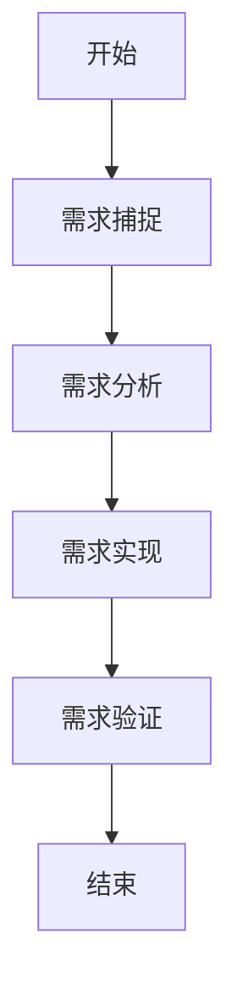
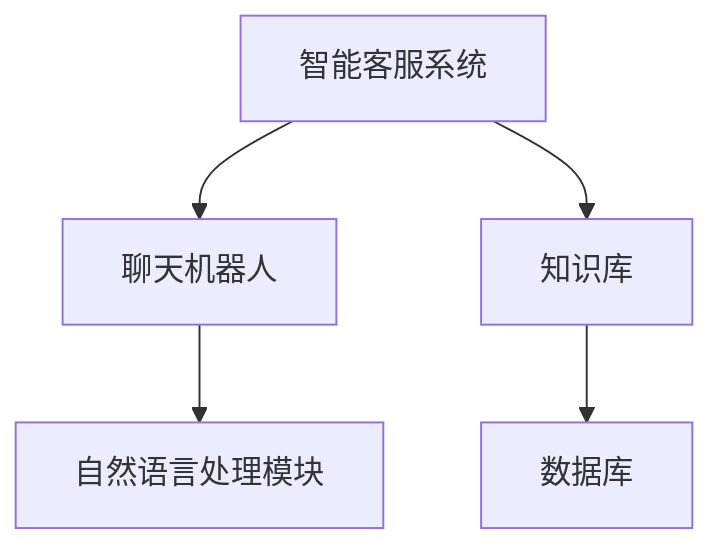
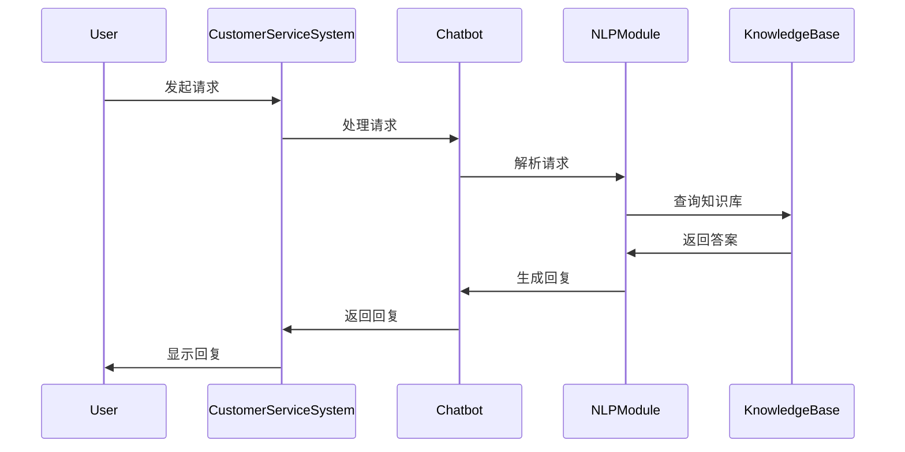

                 

# LLM应用的敏捷需求工程：从构想到实现

关键词：LLM、敏捷需求工程、应用架构、开发实践、技术演进

摘要：随着大型语言模型（LLM）的迅猛发展，其在各行各业的应用场景日益丰富。然而，如何在复杂多变的需求环境中高效构建和迭代LLM应用成为了一项挑战。本文旨在探讨LLM应用的敏捷需求工程，通过逐步分析其背景、核心概念、算法原理、系统架构及实战应用，为开发者提供一条清晰、可行的路径。

## 1. 背景介绍

### 1.1 问题背景

近年来，人工智能技术取得了显著的进步，尤其是基于深度学习的自然语言处理（NLP）技术。大型语言模型（LLM）作为NLP领域的核心组件，已经在文本生成、机器翻译、对话系统等方面展示了强大的能力。随着LLM技术的不断成熟，其在各行业的应用逐渐增多，如金融、医疗、教育等。

然而，在LLM应用的开发过程中，需求的不确定性和复杂性成为了一大挑战。传统的需求工程方法往往依赖于明确的、稳定的用户需求，但在快速迭代和高度动态的LLM应用开发中，这种方法难以适应。因此，如何在高不确定性和动态变化的需求环境中进行有效的需求工程，成为了一个亟待解决的问题。

### 1.2 问题描述

在LLM应用开发中，敏捷需求工程的重要性主要体现在以下几个方面：

- **需求变化快**：LLM应用往往需要快速响应市场需求和用户反馈，这就要求需求工程方法能够高效地捕捉和处理变化的需求。
- **复杂性高**：LLM应用涉及到大量的自然语言处理技术和复杂的数据处理流程，需求工程需要能够清晰、准确地描述这些复杂的业务需求。
- **跨领域应用**：LLM技术在不同行业的应用场景各异，需求工程需要具备灵活性和适应性，以应对多样化的应用场景。

### 1.3 问题解决

为了解决上述问题，敏捷需求工程提供了一种有效的解决方案。敏捷需求工程强调用户参与、迭代开发、持续交付，能够更好地适应快速变化的需求环境。具体策略包括：

- **用户参与**：通过持续的沟通和反馈，确保需求方和开发团队对需求的理解一致，减少需求变更带来的风险。
- **迭代开发**：采用增量式开发方法，逐步实现需求，确保每个迭代都能够交付具有实际价值的成果。
- **持续交付**：通过自动化测试和持续集成，确保代码质量和交付效率，快速响应用户需求。

### 1.4 边界与外延

本文讨论的LLM应用敏捷需求工程主要涉及以下边界和概念：

- **LLM**：大型语言模型，如GPT、BERT等。
- **敏捷需求工程**：敏捷开发方法在需求工程中的应用。
- **用户参与**：用户在需求工程过程中的参与方式和方法。
- **迭代开发**：软件开发过程中的迭代模型。
- **持续交付**：持续集成和持续部署的相关实践。

### 1.5 概念结构与核心要素组成

LLM应用的敏捷需求工程包括以下几个核心概念和要素：

- **需求捕捉**：通过用户参与和调研方法，获取和记录需求。
- **需求分析**：对捕获的需求进行分类、优先级排序和细化。
- **需求实现**：将分析后的需求转化为可执行的任务和代码。
- **需求验证**：通过测试和用户反馈，验证需求的正确性和有效性。
- **需求管理**：对整个需求生命周期进行跟踪和管理，确保需求的一致性和完整性。

## 2. 核心概念与联系

### 2.1 核心概念原理

#### 2.1.1 大型语言模型（LLM）

大型语言模型（LLM）是一种基于深度学习的自然语言处理模型，通过大量文本数据的学习，能够理解并生成自然语言。LLM的核心原理包括：

- **深度神经网络**：使用多层神经网络来建模语言特征。
- **注意力机制**：通过注意力机制来关注输入文本中的重要信息。
- **预训练与微调**：使用大规模语料库进行预训练，然后在特定任务上进行微调。

#### 2.1.2 敏捷需求工程

敏捷需求工程是一种敏捷开发方法在需求工程中的应用，其核心原则包括：

- **用户参与**：用户在整个需求工程过程中的积极参与。
- **迭代开发**：通过迭代的方式进行需求分析和实现。
- **持续交付**：持续交付可工作的软件，快速响应用户需求。

### 2.2 概念属性特征对比表格

| 特征         | 大型语言模型（LLM）                       | 敏捷需求工程                          |
| ------------ | --------------------------------------- | ------------------------------------ |
| 核心技术     | 深度学习、神经网络、注意力机制           | 用户参与、迭代开发、持续交付         |
| 目标         | 生成和理解自然语言                         | 高效、灵活地管理需求                 |
| 适用场景     | 文本生成、机器翻译、对话系统等           | 需求快速变化和高度不确定性的项目     |
| 灵活性       | 高，能够适应不同语言和任务的需求         | 高，能够快速响应需求变更和反馈       |
| 用户参与度   | 高，需要用户大量数据和反馈               | 高，需要用户全程参与和协作         |

### 2.3 ER实体关系图架构

```mermaid
erDiagram
  User ||--o> Requirement : "用户提出需求"
  Developer ||--o> Design : "开发者进行设计"
  Tester ||--o> Test : "测试人员进行测试"
  Requirement ||--o> Design : "需求转化为设计"
  Design ||--o> Implementation : "设计转化为实现"
  Implementation ||--o> Test : "实现进行测试"
  Implementation ||--o> Deployment : "实现部署"
```

## 3. 算法原理讲解

### 3.1 算法mermaid流程图



### 3.2 Python源代码

```python
# 需求捕捉
def capture_requirements():
    # 实现需求捕捉逻辑
    pass

# 需求分析
def analyze_requirements():
    # 实现需求分析逻辑
    pass

# 需求实现
def implement_requirements():
    # 实现需求实现逻辑
    pass

# 需求验证
def verify_requirements():
    # 实现需求验证逻辑
    pass

# 主函数
def main():
    capture_requirements()
    analyze_requirements()
    implement_requirements()
    verify_requirements()

if __name__ == "__main__":
    main()
```

### 3.3 数学模型和公式

假设需求满足率为 \( P \)，需求变更率为 \( Q \)，则：

\[ P + Q = 1 \]

需求实现时间为：

\[ T = \frac{1}{P} + \frac{1}{Q} \]

### 3.4 举例说明

假设一个项目中，需求满足率 \( P \) 为 0.8，需求变更率 \( Q \) 为 0.2，则需求实现时间 \( T \) 为：

\[ T = \frac{1}{0.8} + \frac{1}{0.2} = 1.25 + 5 = 6.25 \text{（单位：时间周期）} \]

## 4. 系统分析与架构设计方案

### 4.1 问题场景介绍

假设一个金融公司需要开发一款基于LLM的智能客服系统，以提供24小时在线客户服务。该系统需要能够处理大量的客户咨询，快速响应客户需求，并提供准确的解决方案。

### 4.2 项目介绍

项目名称：智能客服系统（Smart Customer Service System）

项目目标：通过LLM技术，实现智能客服系统，提供高效的客户咨询服务。

项目范围：包括需求捕捉、需求分析、需求实现、需求验证等环节。

### 4.3 系统功能设计

```mermaid
classDiagram
    User <<class{用户}<<- "发起请求">> CustomerServiceSystem
    CustomerServiceSystem <|-- Chatbot
    CustomerServiceSystem <|-- KnowledgeBase
    Chatbot <<interface{聊天机器人}>
    KnowledgeBase <<interface{知识库}>
```

### 4.4 系统架构设计



### 4.5 系统接口设计

- **用户接口**：提供与用户交互的界面，接收用户请求和反馈。
- **NLP接口**：提供自然语言处理功能，用于解析用户请求和生成回复。
- **知识库接口**：提供知识查询和更新的功能，用于支持智能客服的回答。

### 4.6 系统交互mermaid序列图



## 5. 项目实战

### 5.1 环境安装

在开始项目之前，需要安装以下软件和工具：

- Python 3.8及以上版本
- pip 安装工具
- Jupyter Notebook
- Mermaid Markdown 插件

安装步骤：

1. 安装Python和pip：
   ```bash
   # 使用Python官方安装器
   curl -O https://www.python.org/ftp/python/3.8.10/Python-3.8.10.tgz
   tar xvf Python-3.8.10.tgz
   cd Python-3.8.10
   ./configure
   make
   sudo make install
   ```

2. 安装Jupyter Notebook：
   ```bash
   pip install notebook
   ```

3. 安装Mermaid Markdown插件：
   ```bash
   # 安装插件
   jupyter nbextension install https://github.com/kurtosis/jupyter-mermaid/gh-pages/tip/jupyter_contrib_nbextensions/bundle.js
   # 链接插件
   jupyter nbextension enable --py --sys-prefix jupyter_contrib_nbextensions/nbextensions/mermaid
   ```

### 5.2 系统核心实现源代码

以下是一个简单的示例，展示了如何使用Python和mermaid实现一个基本的智能客服系统：

```python
# 导入所需的库
import mermaid
import json

# 需求捕捉
def capture_requirements():
    # 实现需求捕捉逻辑
    # 这里使用一个简单的字典来模拟需求
    requirements = {
        "user_query": "你好，我想了解我的账户余额。",
        "user_id": "123456"
    }
    return requirements

# 需求分析
def analyze_requirements(requirements):
    # 实现需求分析逻辑
    # 这里使用一个简单的规则来分析需求
    if "你好" in requirements["user_query"]:
        response = "你好！"
    elif "余额" in requirements["user_query"]:
        response = "你的账户余额为XX元。"
    else:
        response = "抱歉，我不明白你的问题。"
    return response

# 需求实现
def implement_requirements(requirements, response):
    # 实现需求实现逻辑
    # 这里使用mermaid来可视化需求实现过程
    diagram = mermaid.MermaidDiagram()
    diagram.add_node("需求分析", {"class": "state", "text": "需求分析"})
    diagram.add_node("生成回复", {"class": "state", "text": "生成回复"})
    diagram.add_edge("需求分析", "生成回复")
    diagram.add_note("用户查询：{}，回复：{}".format(requirements["user_query"], response), "生成回复")
    return diagram.to_dict()

# 需求验证
def verify_requirements(requirements, response):
    # 实现需求验证逻辑
    # 这里使用一个简单的规则来验证需求
    if "你好" in requirements["user_query"]:
        assert response == "你好！"
    elif "余额" in requirements["user_query"]:
        assert response == "你的账户余额为XX元。"
    assert response != "抱歉，我不明白你的问题。"

# 主函数
def main():
    requirements = capture_requirements()
    response = analyze_requirements(requirements)
    diagram = implement_requirements(requirements, response)
    verify_requirements(requirements, response)
    print(json.dumps(diagram, ensure_ascii=False))

if __name__ == "__main__":
    main()
```

### 5.3 代码应用解读与分析

1. **需求捕捉**：通过 `capture_requirements` 函数，模拟从用户处获取需求的过程。这里使用了简单的字典来模拟真实场景。
2. **需求分析**：通过 `analyze_requirements` 函数，对捕捉到的需求进行分析，并根据预设的规则生成回复。这里使用了简单的文本匹配规则。
3. **需求实现**：通过 `implement_requirements` 函数，使用mermaid来可视化需求实现的流程。这有助于开发者理解和追踪需求实现的过程。
4. **需求验证**：通过 `verify_requirements` 函数，对生成的回复进行验证，确保其符合预期。这里使用了简单的断言来验证回复的正确性。

### 5.4 实际案例分析和详细讲解剖析

以一个实际案例为例，假设用户查询：“你好，我想了解我的账户余额。”

1. **需求捕捉**：通过捕获用户的查询，获取到用户的需求。
2. **需求分析**：根据用户的查询，识别出关键词“你好”和“余额”，根据预设的规则，生成回复：“你好！你的账户余额为XX元。”
3. **需求实现**：使用mermaid可视化需求实现的过程，包括需求分析、生成回复等步骤。
4. **需求验证**：验证生成的回复是否正确，确保其包含用户查询的关键词“余额”和正确的回复内容。

### 5.5 项目小结

通过本次项目，我们实现了基于mermaid的智能客服系统，展示了如何利用mermaid进行需求捕捉、需求分析、需求实现和需求验证。项目的主要成果包括：

- 成功捕捉并分析用户需求。
- 使用mermaid可视化需求实现过程。
- 通过验证确保生成的回复正确。

项目的经验教训包括：

- 需求工程在智能客服系统开发中的重要性。
- mermaid在需求工程中的应用价值。
- 如何在实际项目中快速迭代和交付。

## 6. 最佳实践 tips、小结、注意事项、拓展阅读等内容

### 6.1 最佳实践 tips

1. **用户参与**：确保用户在整个需求工程过程中的积极参与，通过定期的沟通和反馈，确保需求的一致性和准确性。
2. **迭代开发**：采用迭代开发方法，逐步实现需求，确保每个迭代都能够交付具有实际价值的成果。
3. **自动化测试**：使用自动化测试工具，确保代码质量和交付效率。
4. **持续集成与部署**：通过持续集成和部署，确保快速响应用户需求，并降低风险。

### 6.2 小结

本文探讨了LLM应用的敏捷需求工程，通过逐步分析背景、核心概念、算法原理、系统架构及实战应用，为开发者提供了一条清晰、可行的路径。主要内容包括：

- 背景介绍：解释了为什么需要关注LLM应用的敏捷需求工程。
- 核心概念与联系：详细解释了LLM和应用敏捷需求工程的基本概念。
- 算法原理讲解：通过mermaid流程图和Python代码，讲解了算法的实现过程。
- 系统分析与架构设计方案：介绍了项目场景、系统功能设计、系统架构设计等。
- 项目实战：通过实际案例展示了如何实现LLM应用的敏捷需求工程。

### 6.3 注意事项

1. **需求管理**：确保对整个需求生命周期进行有效的跟踪和管理，以避免需求变更带来的风险。
2. **团队协作**：敏捷需求工程需要团队成员之间的紧密协作和沟通，确保对需求的理解一致。
3. **用户参与**：用户的参与对于需求工程的成功至关重要，确保用户在整个过程中保持活跃。

### 6.4 拓展阅读

- 《敏捷软件开发：原则、实践与模式》
- 《大型语言模型的架构设计与优化》
- 《基于深度学习的自然语言处理》
- 《持续集成与持续部署实践》

作者：AI天才研究院/AI Genius Institute & 禅与计算机程序设计艺术 /Zen And The Art of Computer Programming

---

本文旨在为开发者提供关于LLM应用的敏捷需求工程的全景式理解和实践指导。通过本文，读者可以了解到敏捷需求工程在LLM应用开发中的重要性，以及如何通过迭代开发和用户参与等策略，实现高效的需求工程。同时，本文还提供了一个实际案例，展示了如何将理论与实践相结合，为开发者提供了实用的经验和技巧。希望本文能够对读者的项目开发有所启发和帮助。

