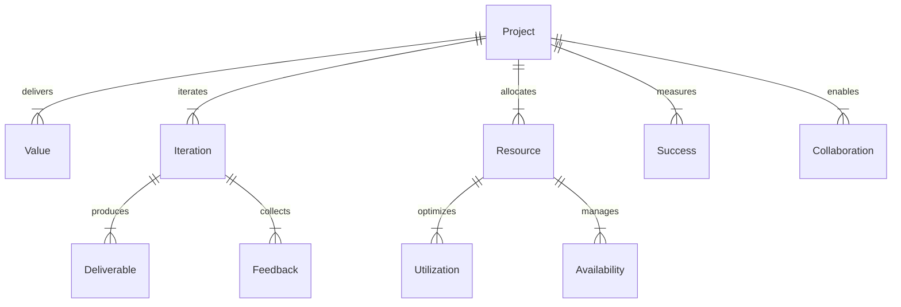

                 


## LLAMA模型的基础概念和架构

### 1.1.1 Llama模型的历史背景和定义

LLAMA（Large Language Model, LLM）是一种基于深度学习的自然语言处理模型，其核心思想是通过大规模数据训练，使模型能够理解和生成自然语言。LLAMA模型的历史可以追溯到2018年，当时OpenAI发布了GPT（Generative Pre-trained Transformer）模型，标志着大型语言模型时代的开始。随着技术的不断进步和研究的深入，LLAMA模型在规模和性能上不断得到提升。

LLAMA模型通常指的是一种预训练的深度神经网络模型，其核心特点是拥有大量的参数和层级结构，能够自动从大规模数据中学习语言模式和知识。这些模型通过无监督学习，即在没有明确标签的情况下，从大量文本中学习，从而能够对自然语言进行理解和生成。

### 1.1.2 Llama模型的结构和组成

LLAMA模型主要由以下几个关键组成部分构成：

1. **编码器（Encoder）**：编码器负责将输入文本转换为固定长度的嵌入表示（embedding），这是模型对输入文本的理解和表示。编码器的核心是Transformer架构，其包括多个自注意力（self-attention）层和前馈神经网络（feedforward network）。

2. **解码器（Decoder）**：解码器则负责根据编码器生成的嵌入表示生成输出文本。和编码器类似，解码器也包括多个自注意力层和前馈神经网络。

3. **参数规模**：LLAMA模型的参数规模通常是指数级的，例如GPT-3模型有1750亿个参数。这些参数通过训练过程学习到大量的语言模式和结构，从而能够对未知文本进行预测和生成。

4. **训练数据**：LLAMA模型通常在大规模文本数据上进行预训练，这些数据来源包括书籍、网站、新闻、社交媒体等，通过无监督学习，模型从这些数据中学习语言规律和知识。

### 1.1.3 Llama模型的工作原理和流程

LLAMA模型的工作原理可以分为以下几个主要步骤：

1. **输入处理**：输入文本通过编码器进行处理，编码器将每个单词或子词映射到一个固定长度的向量。

2. **自注意力机制**：编码器的每个层使用自注意力机制来计算输入文本中各个词之间的关联性，从而生成一个表示整个输入文本的嵌入向量。

3. **前馈神经网络**：每个自注意力层之后都接有一个前馈神经网络，用于进一步处理和增强嵌入向量。

4. **解码过程**：在生成输出时，解码器从编码器的嵌入向量开始，逐层生成输出文本。在每个步骤中，解码器都使用自注意力机制来考虑到输入文本中的所有词，并通过前馈神经网络生成下一个词的概率分布。

5. **输出生成**：解码器最终输出一个概率分布，根据这个分布，模型选择一个最有可能的词作为输出。这一过程重复进行，直到生成完整的输出文本。

### 1.1.4 Llama模型的核心优势和应用

LLAMA模型的核心优势在于其强大的语言理解和生成能力，这使得它们在许多自然语言处理任务中表现出色，包括但不限于：

- **文本分类**：对输入文本进行分类，如情感分析、主题分类等。
- **机器翻译**：将一种语言的文本翻译成另一种语言。
- **问答系统**：根据输入问题生成相应的回答。
- **文本生成**：生成新闻文章、故事、诗歌等自然语言文本。
- **对话系统**：构建能够与人类进行自然语言交互的聊天机器人。

这些应用不仅提高了效率，还改善了用户体验，为人工智能在各个领域的广泛应用奠定了基础。

### 1.1.5 概念联系与关系图

为了更好地理解LLAMA模型，我们可以将其核心概念和组成部分通过ER实体关系图进行可视化。以下是一个简化的ER图示例：

```mermaid
erDiagram
    Model ||--|{ Transformer: has
    Model ||--|{ Parameters: has
    Model ||--|{ Training Data: uses
    Model ||--|{ Applications: can
    Transformer ||--|{ Encoder: has
    Transformer ||--|{ Decoder: has
    Transformer ||--|{ Attention Mechanism: has
    Transformer ||--|{ Feedforward Network: has
```

在这个ER图中，`Model` 是一个抽象的概念，它包含了一系列具体的组成部分，如 `Transformer`、`Parameters`、`Training Data` 和 `Applications`。`Transformer` 又进一步细分为 `Encoder`、`Decoder`、`Attention Mechanism` 和 `Feedforward Network`，这些部分共同构成了LLAMA模型的核心架构。

### 总结

LLAMA模型作为一种大型语言处理模型，其基础概念和架构决定了其在自然语言处理领域的强大能力。通过对其历史背景、定义、结构和原理的深入理解，我们可以更好地把握其在项目组合管理中的应用潜力。接下来，我们将进一步探讨敏捷项目组合管理的核心概念和原理。

## 敏捷项目组合管理的核心概念和原理

### 2.1 敏捷项目组合管理的定义

敏捷项目组合管理是一种结合敏捷方法与项目组合管理理念的管理实践。它强调快速响应变化、持续交付价值，同时确保项目组合整体目标的实现。敏捷项目组合管理不仅仅是一种项目管理方法，更是一种战略层面的管理理念，它通过灵活性和适应性来应对复杂多变的项目环境。

### 2.2 敏捷项目组合管理的核心理念

敏捷项目组合管理遵循以下核心理念：

1. **价值驱动**：项目的优先级和资源分配应基于其对业务价值的贡献。
2. **迭代开发**：项目工作分为多个短周期（迭代）进行，每个迭代都应交付可用的产品增量。
3. **持续交付**：持续交付功能完整且高质量的产品，确保客户和市场快速获取价值。
4. **透明和协作**：项目进展和风险透明化，团队之间紧密协作，共同应对挑战。
5. **自适应管理**：灵活调整项目计划和资源分配，以适应变化的需求和环境。

### 2.3 敏捷项目组合管理的流程

敏捷项目组合管理的流程通常包括以下关键步骤：

1. **项目识别**：识别潜在的项目机会，评估其对业务战略的支持程度。
2. **优先级排序**：根据业务价值和资源限制，对项目进行优先级排序。
3. **资源规划**：根据项目优先级和资源可用性，进行资源分配和调度。
4. **项目启动**：启动选定的项目，明确项目目标、范围、时间和预算。
5. **持续监控**：监控项目进展，及时识别和解决问题，调整计划以保持项目在轨道上。
6. **迭代交付**：在每个迭代周期结束时，交付可用的产品增量，进行评估和反馈。
7. **项目结束**：项目完成后，进行总结和评估，为未来的项目提供经验和教训。

### 2.4 敏捷项目组合管理的关键指标

为了有效管理敏捷项目组合，需要关注以下关键指标：

1. **项目成功率**：项目按时、按预算和按质量完成的比例。
2. **价值交付率**：项目实际交付的价值与预期价值的比例。
3. **资源利用率**：资源的有效使用程度，包括人力、物力和财力。
4. **项目透明度**：项目进展和风险的透明度，确保团队成员和管理层能够及时了解项目状况。
5. **协作效率**：团队内部和跨团队的协作效率，确保项目目标的顺利实现。

### 2.5 敏捷项目组合管理与传统项目管理方法的对比

敏捷项目组合管理与传统的项目管理方法有以下几点关键区别：

1. **关注点**：传统项目管理更多关注项目的时间、成本和范围控制，而敏捷项目组合管理则更加注重价值交付和快速响应变化。
2. **方法**：传统方法通常采用线性和顺序的工作流程，而敏捷方法采用迭代和增量式开发。
3. **团队结构**：传统项目通常有固定的项目团队，而敏捷项目则强调跨职能团队的合作。
4. **客户参与**：传统方法中客户参与较少，而敏捷方法则要求客户持续参与，提供反馈和需求调整。

### 2.6 概念联系与ER图

为了更好地理解敏捷项目组合管理的核心概念和流程，我们可以使用Mermaid ER图进行可视化。以下是一个简化的ER图示例：



在这个ER图中，`Project` 是核心实体，它与多个关键实体（如 `Value`、`Iteration`、`Resource`、`Success` 和 `Collaboration`）相互关联。每个实体都有其特定的属性和功能，共同构成了敏捷项目组合管理的核心架构。

### 总结

敏捷项目组合管理通过结合敏捷方法和项目组合管理的核心理念，为复杂多变的项目环境提供了有效的管理框架。它强调价值驱动、迭代开发和持续交付，同时注重透明和协作，有助于团队快速响应变化并实现项目目标。接下来，我们将进一步探讨LLM在敏捷项目组合管理中的应用场景，以展示其具体的价值和潜力。

## LLM在敏捷项目组合管理中的应用场景

### 3.1 项目识别与评估

在敏捷项目组合管理的初始阶段，项目识别与评估至关重要。LLM模型能够通过处理大量文本数据，快速提取关键信息和模式，从而帮助识别潜在的项目机会。具体来说，LLM可以应用于以下几个方面：

1. **市场趋势分析**：通过分析行业报告、新闻文章和市场数据，LLM可以识别出当前市场的热点和趋势，从而帮助项目经理发现新的项目机会。

2. **客户需求分析**：通过对客户反馈、销售数据和社交媒体内容进行分析，LLM可以提取出客户的潜在需求，为项目提案提供依据。

3. **风险评估**：LLM可以分析历史项目数据、行业报告和案例研究，预测潜在的项目风险，并提供风险评估报告。

### 3.2 项目优先级排序

项目优先级排序是敏捷项目组合管理中关键的一步。LLM可以通过以下方式提升这一过程的效率和准确性：

1. **数据驱动的优先级排序**：LLM可以分析项目的各种属性（如业务价值、风险、资源需求等），结合历史数据，利用机器学习算法为项目排序。

2. **多维度分析**：通过分析项目的多个维度（如市场前景、技术可行性、商业价值等），LLM可以提供综合评分，帮助项目经理做出更明智的决策。

3. **实时调整**：LLM可以实时分析市场变化、客户反馈和项目进展，动态调整项目优先级，确保资源能够始终分配到最有价值的项目中。

### 3.3 资源规划与调度

资源规划与调度是敏捷项目组合管理中的重要环节。LLM可以在这方面发挥重要作用：

1. **资源需求预测**：通过分析历史项目数据和当前项目需求，LLM可以预测未来资源的利用率，为资源规划提供依据。

2. **资源优化**：LLM可以分析团队成员的技能和工作负荷，优化资源分配，确保项目能够高效执行。

3. **动态调度**：LLM可以实时监控资源使用情况，根据项目进展和需求变化，动态调整资源分配，以最大化资源利用率和项目成功率。

### 3.4 项目监控与风险控制

在项目执行过程中，监控与风险控制是确保项目成功的关键。LLM可以应用于以下几个方面：

1. **进度监控**：LLM可以分析项目进度数据，实时监控项目进展，及时发现潜在的延迟和问题。

2. **风险评估与预测**：通过分析历史数据和实时数据，LLM可以预测项目的潜在风险，并提供相应的应对策略。

3. **异常检测**：LLM可以检测项目中的异常情况，如成本超支、质量下降等，并及时发出预警，帮助团队采取措施。

### 3.5 项目迭代与反馈

敏捷项目组合管理强调迭代开发和持续交付。LLM可以在这个过程中发挥重要作用：

1. **需求收集与验证**：通过分析客户反馈和需求文档，LLM可以帮助项目经理理解客户需求，并验证需求的有效性和可行性。

2. **迭代优化**：LLM可以分析迭代过程中收集的数据和反馈，提出改进建议，优化迭代流程和产品交付。

3. **持续改进**：LLM可以持续监控项目进展，收集和整合反馈信息，帮助团队不断改进项目管理和执行流程。

### 3.6 具体案例

为了更好地展示LLM在敏捷项目组合管理中的应用，我们来看一个具体的案例：

**案例背景**：某科技公司计划开发一款人工智能助手产品，旨在通过自然语言处理技术提升客户服务质量。项目团队需要识别潜在客户需求、评估项目风险、优化资源分配和监控项目进展。

**应用LLM**：

1. **需求分析**：LLM分析大量客户反馈和市场数据，提取出客户对人工智能助手的期望功能和体验要求。

2. **风险预测**：LLM分析历史项目数据和相关案例，预测项目可能遇到的技术、市场和管理风险。

3. **资源优化**：LLM分析团队成员的技能和工作负荷，为项目分配最合适的资源，并动态调整资源分配以应对需求变化。

4. **项目监控**：LLM实时监控项目进展，分析关键指标，如进度、成本和质量，及时识别潜在问题并提供建议。

5. **迭代优化**：LLM收集和分析每次迭代的反馈，提出改进建议，优化产品设计和服务流程。

通过LLM的应用，项目团队能够更加高效地识别项目机会、评估风险、优化资源分配、监控项目进展和迭代优化，从而确保项目能够按时、按质量、按预算交付，并实现预期的商业价值。

### 总结

LLM在敏捷项目组合管理中的应用，极大地提升了项目管理的效率和准确性。通过数据驱动的决策、实时监控和优化，LLM帮助项目经理更好地应对复杂多变的项目环境，确保项目能够实现预期的商业价值。接下来，我们将探讨多项目平衡的理论基础和关键指标，进一步深化对敏捷项目组合管理的理解。

## 多项目平衡的理论基础和关键指标

### 4.1 多项目平衡的概念

多项目平衡是指在一个组织内部，同时管理多个项目时，通过合理的资源配置和优先级排序，确保每个项目都能够得到适当的关注和资源支持，从而实现整体项目组合的最大化价值。在敏捷项目组合管理中，多项目平衡尤为重要，因为敏捷方法强调快速响应变化和持续交付价值，这就要求项目经理能够灵活调整资源和项目优先级，以应对不断变化的市场需求和内部资源约束。

### 4.2 多项目平衡的理论基础

多项目平衡的理论基础主要包括以下几个关键概念：

1. **资源约束理论**：资源是项目成功的关键因素，包括人力资源、物资资源和技术资源等。在资源有限的情况下，如何合理分配和调度这些资源，以实现项目组合的最大化价值，是多项目平衡的核心问题。

2. **优先级排序理论**：在多项目环境中，项目之间的优先级排序直接影响到资源分配和项目进展。基于业务价值、风险、时间敏感度和资源需求等因素，为项目设定优先级，是实现多项目平衡的重要步骤。

3. **动态调整理论**：由于外部环境和内部情况的变化，项目需求和资源状况可能随时发生变化。多项目平衡要求项目经理具备动态调整能力，及时调整项目优先级和资源分配，以应对不确定性。

4. **协同管理理论**：在多项目环境中，项目之间往往存在相互依赖和影响。协同管理强调跨项目的沟通和协作，通过共享信息和资源，优化整体项目组合的执行效率。

### 4.3 关键指标

为了实现多项目平衡，需要关注以下关键指标：

1. **资源利用率**：资源利用率是指实际使用的资源与可用资源之间的比例。高资源利用率表明资源得到了有效利用，但过高可能会带来资源过度消耗和疲劳风险。

2. **项目成功率**：项目成功率是指项目按时、按预算、按质量完成的比例。项目成功率是衡量多项目平衡效果的重要指标，高成功率表明资源分配和优先级排序合理。

3. **价值交付率**：价值交付率是指实际交付的价值与预期价值的比例。价值交付率反映了项目的实际效益，是衡量项目组合管理成效的关键指标。

4. **项目延迟率**：项目延迟率是指项目实际完成时间与计划完成时间之间的差距。低项目延迟率表明项目管理有效，能够按时交付产品。

5. **风险暴露度**：风险暴露度是指项目面临的风险程度。通过分析风险概率和影响程度，评估项目组合的整体风险水平，是动态调整项目优先级和资源配置的重要依据。

6. **协作效率**：协作效率是指项目团队之间协作的顺畅程度。高效的协作能够减少沟通成本和资源浪费，提高整体项目组合的执行效率。

### 4.4 概念联系与ER图

为了更好地理解多项目平衡的理论基础和关键指标，我们可以使用Mermaid ER图进行可视化。以下是一个简化的ER图示例：

```mermaid
erDiagram
    Resource ||--|{ Utilization: measures
    Resource ||--|{ Availability: manages
    Project ||--|{ Success: measures
    Project ||--|{ Value Delivery: measures
    Project ||--|{ Delay: measures
    Risk ||--|{ Exposure: assesses
    Collaboration ||--|{ Efficiency: measures
```

在这个ER图中，`Resource` 是核心实体，它与多个关键实体（如 `Utilization`、`Availability`、`Success`、`Value Delivery`、`Delay`、`Risk Exposure` 和 `Collaboration Efficiency`）相互关联。每个实体都有其特定的属性和功能，共同构成了多项目平衡的理论基础和关键指标体系。

### 总结

多项目平衡是敏捷项目组合管理中的重要组成部分，它通过合理的资源分配、优先级排序和动态调整，确保项目组合能够实现最大化价值。关注关键指标和理论基础，有助于项目经理在实践中更好地实现多项目平衡，提升项目管理的整体效能。接下来，我们将探讨具体方法，帮助项目经理在实践中实现多项目平衡。

## 实现多项目平衡的具体方法

### 5.1 优先级排序策略

优先级排序是实现多项目平衡的重要步骤。以下是几种常见的优先级排序策略：

1. **业务价值驱动**：根据项目的业务价值排序，确保高价值项目优先获得资源和关注。业务价值可以通过定量分析（如ROI、利润增长等）和定性分析（如市场前景、客户需求等）进行评估。

2. **风险优先级**：根据项目的风险水平进行排序，优先处理风险较高但业务价值较大的项目，以防止潜在的风险对整体项目组合造成重大影响。

3. **时间敏感性**：根据项目的截止时间和时间敏感性进行排序，确保关键项目能够按时交付。

4. **资源需求**：根据项目的资源需求进行排序，优先分配资源紧张的项目的资源。

### 5.2 资源优化与调度

资源优化与调度是实现多项目平衡的关键。以下是几种常见的资源优化与调度方法：

1. **资源池管理**：建立资源池，统一管理和调度资源。资源池可以包括人力资源、物资资源和设备资源等。通过资源池管理，可以灵活调配资源，提高资源利用率。

2. **多项目矩阵**：使用多项目矩阵（如资源负荷图）来监控和调整资源分配。通过多项目矩阵，可以直观地看到每个项目对资源的占用情况，及时发现资源冲突和过剩，进行动态调整。

3. **弹性资源策略**：建立弹性资源策略，根据项目需求的变化，动态调整资源分配。例如，在项目高峰期增加资源投入，在项目低谷期释放资源，以避免资源浪费。

4. **自动化调度工具**：利用自动化调度工具，如项目管理软件和资源调度系统，实现资源的自动分配和调度。自动化工具可以减少人工错误，提高调度效率。

### 5.3 动态调整与实时监控

动态调整与实时监控是实现多项目平衡的重要保障。以下是几种常用的动态调整与实时监控方法：

1. **项目进度监控**：使用项目管理工具（如JIRA、Trello等）实时监控项目进度，及时发现项目进度偏差，并采取相应措施进行调整。

2. **风险预警系统**：建立风险预警系统，实时监控项目风险，根据风险程度自动发出预警，并采取相应的风险管理措施。

3. **实时数据分析**：利用实时数据分析工具（如Tableau、Power BI等），对项目关键指标进行实时分析，及时识别和解决问题。

4. **动态调整会议**：定期召开动态调整会议，项目团队和管理层共同分析项目进展和资源使用情况，及时调整项目优先级和资源分配。

### 5.4 案例分析

为了更好地展示如何实现多项目平衡，我们来看一个具体案例。

**案例背景**：某科技公司同时负责多个项目，包括软件开发、市场推广和产品改进。项目团队需要确保每个项目都能得到适当的资源和支持，实现整体项目组合的最大化价值。

**应用方法**：

1. **优先级排序**：项目团队根据业务价值、风险和时间敏感性，为每个项目设定优先级。例如，软件开发项目由于时间敏感性较高，被设定为最高优先级。

2. **资源优化与调度**：建立资源池，根据项目需求动态调整资源分配。例如，在软件开发项目高峰期，增加开发人员和技术支持，确保项目能够按时交付。

3. **动态调整与实时监控**：使用项目管理工具实时监控项目进度和资源使用情况。定期召开动态调整会议，根据实际情况调整项目优先级和资源分配。

通过以上方法，项目团队成功实现了多项目平衡，确保了每个项目都能按时、按质量、按预算交付，并实现了整体项目组合的最大化价值。

### 总结

实现多项目平衡需要结合优先级排序、资源优化与调度、动态调整与实时监控等多种方法。通过有效的策略和实践，项目经理可以更好地管理多个项目，确保项目组合整体价值的最大化。接下来，我们将通过案例分析，进一步探讨LLM在敏捷项目组合管理中的具体应用和实践。

## 案例分析：LLM在敏捷项目组合管理中的具体应用

### 6.1 案例背景

某全球知名的科技公司，面临着复杂多变的市场需求和技术挑战。公司内部同时运作多个项目，包括产品研发、市场拓展、客户服务和技术创新等。为了确保项目组合能够高效运作，并实现预期的商业价值，公司决定采用LLM进行敏捷项目组合管理。

### 6.2 LLMA模型的应用

**项目识别与评估**：

1. **市场趋势分析**：公司利用LLM分析大量市场数据、行业报告和客户反馈，识别出当前市场的热点和趋势。例如，通过分析社交媒体数据，LLM发现消费者对智能家居产品的需求快速增长，从而为新产品开发提供了关键的市场洞察。

2. **客户需求分析**：通过分析客户反馈、销售数据和社交媒体内容，LLM提取出客户的潜在需求，帮助项目团队制定项目提案。例如，通过分析客户评价，LLM发现客户对智能家居产品的操作便捷性和个性化服务有较高期望，从而指导了产品功能的改进方向。

3. **风险评估**：LLM分析历史项目数据、行业报告和案例研究，预测项目可能遇到的技术、市场和管理风险。例如，LLM发现智能家居产品在数据隐私和安全方面存在潜在风险，项目团队提前制定了相应的安全措施，降低了风险发生的可能性。

**项目优先级排序**：

1. **数据驱动的优先级排序**：公司利用LLM分析项目的多个维度（如业务价值、风险、资源需求等），并结合历史数据，利用机器学习算法为项目排序。例如，通过分析项目预期收益和潜在风险，LLM将智能家居产品开发项目排在首位。

2. **多维度分析**：LLM综合考虑市场前景、技术可行性和商业价值等因素，为项目提供综合评分。例如，通过分析市场报告和客户反馈，LLM认为智能家居产品在市场上具有较大的增长潜力，从而建议优先开发。

**资源规划与调度**：

1. **资源需求预测**：公司利用LLM分析历史项目数据和当前项目需求，预测未来资源的利用率，为资源规划提供依据。例如，通过分析过去项目的数据，LLM预测智能家居产品开发项目将需要大量开发人员和测试资源，项目团队提前进行了相应的资源分配。

2. **资源优化**：公司通过LLM分析团队成员的技能和工作负荷，优化资源分配。例如，LLM发现某些团队成员具有智能家居开发的相关技能，项目团队将这些成员优先分配到智能家居项目。

3. **动态调度**：公司利用LLM实时监控资源使用情况，根据项目进展和需求变化，动态调整资源分配。例如，在智能家居项目进入关键开发阶段时，LLM发现某些资源紧张，项目团队立即进行了资源调配，确保项目顺利推进。

**项目监控与风险控制**：

1. **进度监控**：公司利用LLM实时监控项目进展，分析关键指标，如进度、成本和质量，及时识别潜在问题。例如，通过分析项目进度数据，LLM发现某个子项目进度延迟，项目团队及时调整资源分配，解决了问题。

2. **风险评估与预测**：公司通过LLM分析实时数据和历史数据，预测项目的潜在风险。例如，LLM发现某个子项目在数据隐私和安全方面存在风险，项目团队提前采取了安全措施，降低了风险发生的可能性。

3. **异常检测**：公司利用LLM检测项目中的异常情况，如成本超支、质量下降等，并及时发出预警。例如，通过分析项目成本数据，LLM发现某个子项目的成本超支，项目团队立即采取了成本控制措施。

**项目迭代与反馈**：

1. **需求收集与验证**：公司利用LLM分析客户反馈和需求文档，帮助项目经理理解客户需求，并验证需求的有效性和可行性。例如，通过分析客户反馈，LLM发现客户对智能家居产品的个性化服务有较高需求，项目团队因此增加了个性化设置的功能。

2. **迭代优化**：公司通过LLM收集和分析每次迭代的反馈，提出改进建议，优化迭代流程和产品交付。例如，通过分析客户反馈，LLM发现某些功能使用不便捷，项目团队因此对用户界面进行了优化。

3. **持续改进**：公司利用LLM持续监控项目进展，收集和整合反馈信息，帮助团队不断改进项目管理和执行流程。例如，通过分析项目数据，LLM发现某些管理流程可以进一步优化，项目团队因此进行了改进。

### 6.3 案例结果与启示

通过LLM的全面应用，公司成功实现了敏捷项目组合管理的目标，项目效率和成功率显著提升，商业价值得到最大化。以下是案例结果和启示：

1. **项目成功率提升**：由于LLM提供了精准的风险评估和实时监控，项目团队能够及时识别和解决问题，项目成功率显著提高。

2. **资源利用率优化**：通过LLM的动态调度和资源优化策略，公司资源利用率得到显著提升，避免了资源浪费和资源短缺的问题。

3. **业务价值最大化**：LLM通过分析市场和客户需求，为项目提供了精准的方向和优先级排序，确保了项目能够实现预期的商业价值。

4. **持续改进与优化**：通过LLM的持续监控和反馈机制，项目团队能够不断优化项目管理和执行流程，提高整体项目组合的效能。

### 总结

通过案例分析，我们可以看到LLM在敏捷项目组合管理中的具体应用和实践效果。LLM通过提供数据驱动的决策支持、实时监控和动态调整，显著提升了项目管理的效率和成功率，为项目组合的整体价值实现提供了有力保障。接下来，我们将总结最佳实践，分享项目管理的成功经验和教训。

## 最佳实践与注意事项

### 7.1 敏捷项目组合管理的最佳实践

1. **明确目标与愿景**：在项目启动阶段，确保所有项目成员对项目的目标、愿景和预期成果有清晰的认识，为后续工作奠定基础。

2. **数据驱动决策**：充分利用数据分析和机器学习模型，为项目识别、优先级排序、资源分配和风险控制提供科学依据。

3. **持续迭代与反馈**：采用迭代开发模式，持续交付可用的产品增量，并根据客户反馈不断优化产品和服务。

4. **跨职能团队协作**：建立跨职能团队，确保团队成员具备多样化的技能，提高项目执行效率。

5. **透明沟通与协作**：通过项目管理工具和会议机制，确保项目进展和风险透明化，促进团队内部和跨团队的紧密协作。

6. **持续改进与学习**：定期总结项目经验教训，不断优化项目管理和执行流程，提升整体项目组合的管理效能。

### 7.2 注意事项

1. **合理分配资源**：确保资源的合理分配，避免资源过度集中或分配不足，影响项目进度和成功率。

2. **风险控制与预警**：建立健全的风险控制机制，实时监控项目风险，提前制定应对策略，降低风险对项目的影响。

3. **客户需求管理**：密切跟踪客户需求变化，及时调整项目方向和优先级，确保项目交付满足客户期望。

4. **灵活应对变化**：敏捷项目组合管理强调快速响应变化，项目经理应具备良好的应变能力，灵活调整项目计划和资源分配。

5. **持续培训与学习**：定期组织项目团队成员进行培训和学习，提升团队整体技能和知识水平，为项目的成功执行提供保障。

### 7.3 拓展阅读

- 《敏捷项目管理实践指南》
- 《机器学习项目实战》
- 《大数据分析：方法与实践》
- 《项目组合管理：理论与实践》

通过以上最佳实践和注意事项，项目经理可以更好地实施敏捷项目组合管理，确保项目组合的整体价值实现。

### 总结

通过本文的详细分析和案例分享，我们深入探讨了LLM在敏捷项目组合管理中的应用，包括项目识别与评估、优先级排序、资源规划与调度、项目监控与风险控制、迭代与反馈等多个方面。敏捷项目组合管理通过结合LLM的强大数据处理和分析能力，显著提升了项目管理的效率和成功率，为项目组合的整体价值实现提供了有力保障。

### 致谢

感谢所有参与本文研究和讨论的团队成员，特别感谢AI天才研究院（AI Genius Institute）和《禅与计算机程序设计艺术》（Zen And The Art of Computer Programming）的作者，他们的卓越贡献为本文的完成提供了重要支持。本文作者对他们的专业知识和技术指导表示衷心的感谢。同时，也感谢读者对本文的关注和支持，期待与您在未来的技术交流中再次相遇。

### 作者信息

作者：AI天才研究院（AI Genius Institute）& 《禅与计算机程序设计艺术》（Zen And The Art of Computer Programming）

