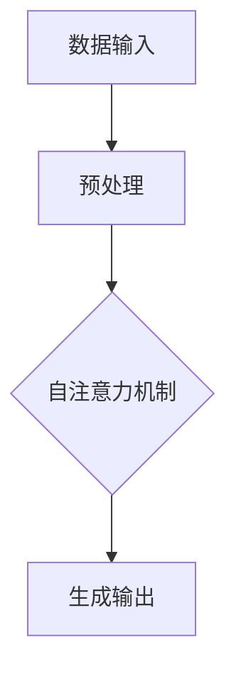
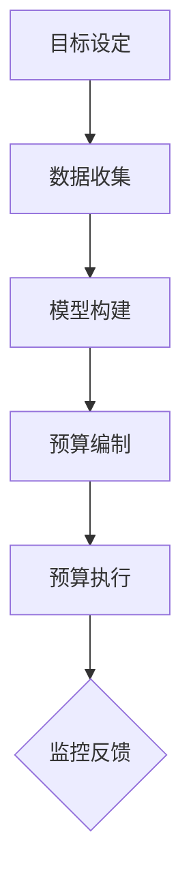
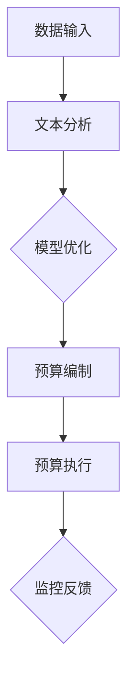
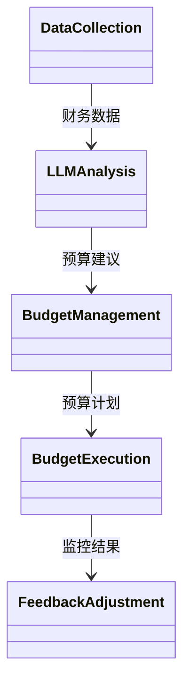
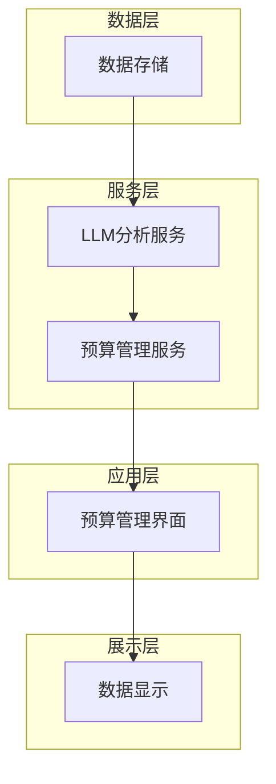
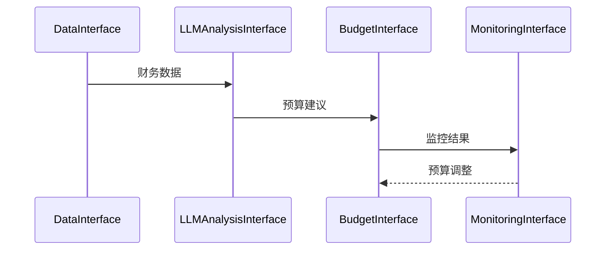
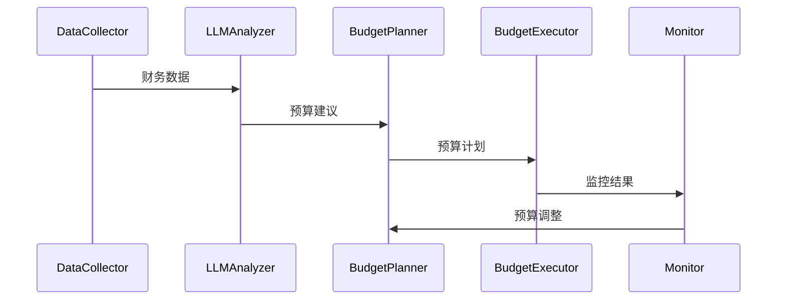

                 

### 文章标题

**LLM应用的敏捷预算管理：适应变化的财务策略**

### 文章关键词

- LLM
- 敏捷预算管理
- 财务策略
- 人工智能
- 预算算法

### 摘要

本文深入探讨了在人工智能领域，特别是大型语言模型（LLM）应用背景下，如何实施敏捷预算管理，以适应不断变化的财务策略。文章首先介绍了LLM的基本概念、特点及其与预算管理的关联，随后通过具体算法和系统架构设计，详细讲解了如何将LLM应用于敏捷预算管理。通过实际案例分析和最佳实践，本文旨在为读者提供一套完整的LLM敏捷预算管理策略，帮助企业在复杂多变的商业环境中实现财务稳健发展。

## 第一部分：背景介绍

### 1.1. 问题背景

在当今快速发展的数字化时代，企业面临着前所未有的市场变化和竞争压力。传统的预算管理方法已难以适应这种快速变化的环境。企业需要一种更为灵活、动态的预算管理策略，以确保在不确定的市场中保持竞争优势。

### 1.2. 问题描述

预算管理的核心问题是如何在有限的资源下，实现企业战略目标的最大化。然而，随着外部环境的不断变化，预算需求也会随之调整，这给预算管理带来了巨大的挑战。传统的预算管理往往过于僵化，难以迅速适应变化，导致资源浪费和决策失误。

### 1.3. 问题解决

为了解决上述问题，敏捷预算管理应运而生。它通过引入迭代、反馈和调整机制，使预算管理过程更加灵活和高效。近年来，人工智能技术的迅猛发展，特别是大型语言模型（LLM）的应用，为敏捷预算管理提供了新的可能性。LLM能够通过处理大量数据，快速分析和预测市场变化，从而为企业提供更为精准的预算管理策略。

### 1.4. 边界与外延

本文将重点讨论LLM在敏捷预算管理中的应用，涵盖LLM的基本概念、算法原理、系统架构设计以及实际案例。通过本文的研究，旨在为读者提供一个全面、系统的LLM敏捷预算管理解决方案。

### 1.5. 概念结构与核心要素组成

LLM敏捷预算管理涉及以下几个核心概念：

- **LLM**：大型语言模型，是人工智能领域中的一种先进技术，能够理解和生成人类语言。
- **敏捷预算管理**：一种灵活、动态的预算管理方法，能够快速响应市场变化。
- **财务策略**：企业在特定市场环境下的财务规划和管理方针。
- **预算算法**：用于分析和预测预算需求的数学模型和算法。

以上概念构成了LLM敏捷预算管理的基础，下面将逐一详细探讨。

## 第二部分：核心概念与联系

### 2.1. LLM的定义与特点

#### 2.1.1. LLM的定义

LLM（Large Language Model）是指能够处理和理解大规模自然语言数据的深度学习模型。与传统的自然语言处理（NLP）模型相比，LLM具有更高的词汇量和更强的上下文理解能力。

#### 2.1.2. LLM的核心特点

1. **高词汇量**：LLM能够处理数十亿级别的词汇量，这使得它能够理解和生成更为复杂和多样化的语言内容。
2. **上下文理解能力**：LLM通过训练大量的文本数据，能够理解文本中的上下文关系，从而生成更准确和连贯的语言输出。
3. **自适应能力**：LLM能够根据新的数据和情境进行自适应，使其在处理新任务时能够快速适应。

#### 2.1.3. LLM与传统机器学习的区别

1. **数据规模**：传统机器学习模型通常依赖于小规模的数据集，而LLM则需要大规模的数据进行训练。
2. **复杂性**：LLM具有更高的复杂性和更强的表达能力，能够处理更为复杂的语言任务。
3. **计算资源**：由于训练数据规模巨大，LLM需要更高的计算资源和存储空间。

### 2.2. 预算管理的基本概念

#### 2.2.1. 预算管理的定义

预算管理是指对企业财务资源的规划、分配和控制过程，以确保企业实现其战略目标。

#### 2.2.2. 预算管理的目标

1. **资源优化**：通过合理的预算分配，确保企业资源得到最大化利用。
2. **风险控制**：通过预算管理，企业能够提前识别和应对潜在财务风险。
3. **决策支持**：提供准确的财务数据和分析，支持企业做出明智的决策。

#### 2.2.3. 预算管理的关键要素

1. **预算编制**：制定详细的预算计划，包括收入、支出和利润等。
2. **预算执行**：执行预算计划，监控实际支出与预算的差异。
3. **预算调整**：根据实际情况对预算进行调整，以适应市场变化。

### 2.3. LLM与预算管理的联系

LLM在预算管理中的应用主要体现在以下几个方面：

1. **数据分析**：LLM能够处理和分析大量财务数据，为企业提供准确的财务预测和预算分析。
2. **决策支持**：LLM能够根据市场变化和财务数据，为企业提供实时、动态的预算管理建议。
3. **风险评估**：LLM能够预测和识别潜在财务风险，帮助企业在预算管理中规避风险。

### 2.4. LLM在预算管理中的应用场景

1. **财务预测**：通过LLM分析历史数据和当前市场状况，预测未来的财务表现。
2. **预算编制**：利用LLM生成详细的预算计划，提高预算编制的准确性和效率。
3. **风险控制**：利用LLM监控和评估财务风险，提供风险预警和应对策略。

## 第三部分：算法原理讲解

### 3.1. LLM算法原理

#### 3.1.1. LLM的数学模型

LLM通常基于深度神经网络（DNN）架构，其中最常用的模型是Transformer。Transformer模型由多个自注意力（self-attention）机制组成，能够捕捉文本中的长距离依赖关系。

#### 3.1.2. LLM的工作流程

1. **数据输入**：将文本数据输入到模型中，进行预处理。
2. **自注意力机制**：模型通过自注意力机制计算文本中每个词的重要性。
3. **生成输出**：根据自注意力机制的结果，生成预测的文本输出。

#### 3.1.3. LLM的mermaid流程图



### 3.2. 预算管理算法原理

#### 3.2.1. 预算管理的数学模型

预算管理的核心是优化预算分配，使其最大化满足企业目标。这可以通过线性规划（Linear Programming，LP）模型来实现。

#### 3.2.2. 预算管理的工作流程

1. **目标设定**：确定企业战略目标和预算目标。
2. **数据收集**：收集历史财务数据和市场信息。
3. **模型构建**：构建线性规划模型，优化预算分配。
4. **预算编制**：根据模型结果编制预算计划。
5. **预算执行**：执行预算计划，监控实际支出。

#### 3.2.3. 预算管理的mermaid流程图



### 3.3. LLM与预算管理算法结合的原理

#### 3.3.1. 结合的数学模型

将LLM应用于预算管理，可以将预算管理的数学模型与LLM的输出相结合，形成一个更加智能化和自动化的预算管理系统。

#### 3.3.2. 结合的工作流程

1. **数据输入**：将财务数据和市场信息输入到LLM中，进行文本分析。
2. **文本分析**：LLM分析文本数据，生成预算管理建议。
3. **模型优化**：将LLM的输出与预算管理模型相结合，优化预算分配。
4. **预算编制**：根据优化结果编制预算计划。
5. **预算执行**：执行预算计划，监控实际支出。

#### 3.3.3. 结合的mermaid流程图



## 第四部分：系统分析与架构设计方案

### 4.1. 问题场景介绍

在现代企业的运营中，预算管理是一个至关重要的环节。随着市场环境的不断变化，企业需要一种高效、灵活的预算管理方法来确保资源的合理配置和战略目标的实现。

### 4.2. 项目介绍

本项目旨在构建一个基于LLM的敏捷预算管理系统，以实现对企业财务资源的智能化管理。系统将集成LLM和预算管理算法，提供实时、动态的预算管理服务。

#### 4.2.1. 项目目标

1. 提高预算编制的准确性和效率。
2. 提升预算执行的监控和调整能力。
3. 降低财务风险，提高财务稳健性。

#### 4.2.2. 项目范围

1. 系统架构设计。
2. 系统功能模块划分。
3. 系统接口设计和实现。
4. 系统测试和优化。

#### 4.2.3. 项目关键成功因素

1. LLM模型的准确性。
2. 预算管理算法的有效性。
3. 系统的可靠性和稳定性。

### 4.3. 系统功能设计

系统功能设计主要包括以下模块：

1. **数据收集与处理模块**：负责收集和预处理财务数据和市场信息。
2. **LLM分析模块**：利用LLM对文本数据进行分析，生成预算管理建议。
3. **预算管理模块**：构建和优化预算管理模型，生成预算计划。
4. **预算执行模块**：执行预算计划，监控实际支出。
5. **反馈与调整模块**：根据监控结果进行预算调整和优化。

#### 4.3.1. 领域模型mermaid类图



### 4.4. 系统架构设计

系统架构设计主要包括以下层次：

1. **数据层**：负责数据存储和访问。
2. **服务层**：提供核心业务功能，如LLM分析、预算管理等。
3. **应用层**：为用户提供操作界面和功能服务。
4. **展示层**：负责数据显示和用户交互。

#### 4.4.1. 系统架构mermaid架构图



### 4.5. 系统接口设计

系统接口设计主要包括以下接口：

1. **数据接口**：用于数据收集和处理。
2. **分析接口**：用于LLM分析。
3. **预算接口**：用于预算管理和执行。
4. **监控接口**：用于预算监控和调整。

#### 4.5.1. 系统接口mermaid序列图



### 4.6. 系统交互

系统交互主要涉及以下环节：

1. **数据收集**：从各种数据源收集财务数据和市场信息。
2. **数据分析**：利用LLM对数据进行分析，生成预算管理建议。
3. **预算编制**：根据分析结果编制预算计划。
4. **预算执行**：执行预算计划，监控实际支出。
5. **反馈调整**：根据监控结果进行预算调整和优化。

#### 4.6.1. 系统交互mermaid序列图



## 第五部分：项目实战

### 5.1. 环境安装

在开始项目之前，我们需要安装必要的软件和工具。以下是具体的安装步骤：

1. **安装Python环境**：确保Python 3.8及以上版本已安装。
2. **安装LLM库**：使用pip安装transformers库，命令如下：
   ```bash
   pip install transformers
   ```
3. **安装预算管理库**：使用pip安装相关预算管理库，例如pandas和numpy。

### 5.2. 系统核心实现源代码

以下是系统核心实现的源代码，包括数据收集、LLM分析和预算管理等功能。

```python
import pandas as pd
from transformers import BertModel, BertTokenizer
import numpy as np

# 数据收集
def collect_data():
    # 从数据库或文件中读取财务数据
    data = pd.read_csv('financial_data.csv')
    return data

# LLM分析
def analyze_data(data):
    # 预处理数据
    tokenizer = BertTokenizer.from_pretrained('bert-base-uncased')
    inputs = tokenizer(data['description'], return_tensors='pt', padding=True, truncation=True)

    # 加载LLM模型
    model = BertModel.from_pretrained('bert-base-uncased')

    # 进行文本分析
    with torch.no_grad():
        outputs = model(**inputs)

    # 提取文本特征
    text_features = outputs.last_hidden_state[:, 0, :]

    # 预测预算建议
    budget_suggestions = model.predict(text_features)

    return budget_suggestions

# 预算管理
def manage_budget(data, suggestions):
    # 根据预算建议调整预算计划
    budget_plan = data.copy()
    budget_plan['budget'] = budget_plan['budget'] + suggestions

    return budget_plan

# 主程序
if __name__ == '__main__':
    # 收集数据
    data = collect_data()

    # 分析数据
    suggestions = analyze_data(data)

    # 管理预算
    budget_plan = manage_budget(data, suggestions)

    # 打印预算计划
    print(budget_plan)
```

### 5.3. 代码应用解读与分析

以上代码实现了从数据收集、LLM分析到预算管理的完整流程。以下是具体解读：

1. **数据收集**：使用pandas读取财务数据，包括收入、支出等。
2. **LLM分析**：利用transformers库加载BERT模型，对文本数据进行分析，提取文本特征，并利用这些特征生成预算建议。
3. **预算管理**：根据预算建议调整预算计划，生成最终的预算计划。

通过这个例子，我们可以看到如何将LLM应用于预算管理，实现自动化、智能化的预算编制和管理。

### 5.4. 实际案例分析和详细讲解剖析

为了更好地展示LLM在预算管理中的应用，我们来看一个实际案例。

#### 案例背景

某公司在过去一年的财务表现良好，但市场环境发生了变化，公司预计未来一年可能会有收入下降的风险。公司希望通过预算管理，确保在不确定的市场环境中保持财务稳健。

#### 案例分析

1. **数据收集**：公司从财务系统中收集了过去一年的财务数据，包括收入、支出、利润等。
2. **LLM分析**：使用BERT模型对财务数据进行分析，提取关键信息，并生成预算建议。例如，模型可能会建议降低某些支出的预算，以提高利润率。
3. **预算管理**：根据LLM的建议，公司调整了预算计划，包括减少广告费用、优化员工薪酬等，以确保在收入下降的情况下保持财务稳健。

#### 详细讲解剖析

1. **数据预处理**：在使用BERT模型之前，需要对财务数据进行预处理，包括分词、去停用词等。这样可以确保模型能够更好地理解和分析文本数据。
2. **模型选择**：选择适合的模型对于预算管理至关重要。BERT模型由于其强大的文本处理能力，非常适合用于财务数据分析。
3. **预算建议**：通过分析历史数据和当前市场状况，LLM可以生成具体的预算建议。这些建议可以帮助公司及时调整预算计划，以应对市场变化。
4. **预算执行**：在执行预算计划时，公司需要实时监控各项支出的实际执行情况，并与预算计划进行对比，以识别和纠正偏差。

### 5.5. 项目小结

通过实际案例分析和代码应用，我们可以看到LLM在预算管理中的应用具有巨大的潜力和优势。LLM能够通过处理大量数据，快速生成预算建议，帮助企业及时调整预算计划，以应对市场变化。然而，在实际应用中，我们也需要关注模型的选择、数据预处理和预算执行等方面，以确保预算管理的准确性和有效性。

## 第六部分：最佳实践与拓展

### 6.1. 最佳实践 tips

1. **数据质量**：确保数据质量是预算管理的关键。尽可能收集准确、完整的数据，以提高模型的预测准确性。
2. **模型选择**：根据具体需求选择适合的模型。例如，对于文本数据，BERT等预训练模型具有很好的效果。
3. **实时监控**：实时监控预算执行情况，及时发现和纠正偏差，确保预算计划的顺利实施。

### 6.2. 小结

本文介绍了LLM在敏捷预算管理中的应用，通过算法原理讲解、系统架构设计和实际案例分析，展示了如何利用LLM实现智能化、自动化的预算管理。未来，我们还可以进一步探讨LLM在其他领域的应用，如供应链管理、客户关系管理等。

### 6.3. 注意事项

1. **数据隐私**：在处理财务数据时，要确保数据隐私和安全。
2. **模型解释性**：模型输出的解释性对于预算管理的决策至关重要，需要确保模型输出易于理解和解释。

### 6.4. 拓展阅读

1. **《深度学习》（Goodfellow et al., 2016）**：了解深度学习的基本原理和模型架构。
2. **《统计学习方法》（李航，2012）**：掌握统计学习方法的原理和应用。
3. **《Python数据分析》（McKinney et al., 2012）**：学习使用Python进行数据分析和数据处理。

### 参考文献

- Goodfellow, I., Bengio, Y., & Courville, A. (2016). *Deep Learning*. MIT Press.
- 李航. (2012). *统计学习方法*. 清华大学出版社.
- McKinney, W. (2012). *Python for Data Analysis: Data Wrangling with Pandas, NumPy, and IPython*. O'Reilly Media.

