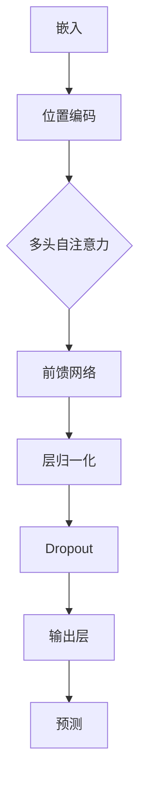
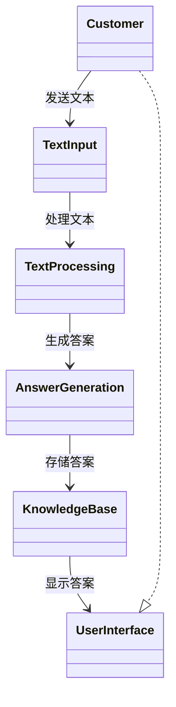
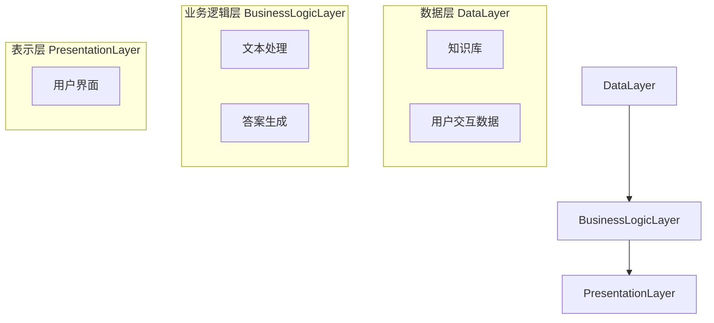
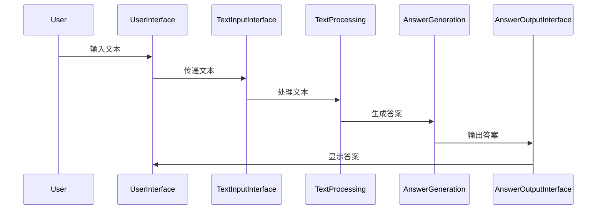
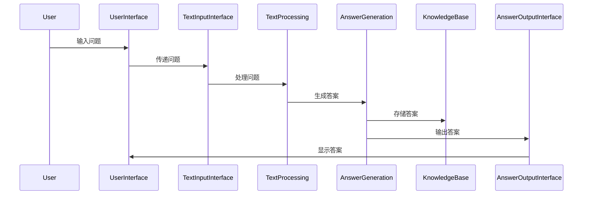

                 


### 文章标题：LLM应用的敏捷验收标准：明确定义完成状态标准

#### 关键词：LLM，敏捷验收标准，完成状态，软件工程，人工智能

> 摘要：本文深入探讨了大规模语言模型（LLM）在软件开发中的应用，并提出了一个明确的敏捷验收标准来定义软件完成状态。通过逐步分析LLM的特性、敏捷开发的原理以及验收标准的具体构建，文章旨在为开发团队提供一个实用的框架，以确保LLM应用的质量和功能性。

### 目录大纲设计

在开始撰写本文之前，我们需要设计一个清晰、结构化的目录大纲，以确保文章的逻辑性和连贯性。以下是本文的目录大纲：

```markdown
----------------------------------------------------------------
# 第一部分: 背景介绍与核心概念

## 第1章: 问题背景与问题描述
### 1.1.1 问题背景
### 1.1.2 问题描述
### 1.1.3 解决方案概述

## 第2章: LLM的基本概念与特性
### 2.1.1 LLM的定义
### 2.1.2 LLM的核心特性
### 2.1.3 LLM与传统AI的对比

## 第3章: 敏捷验收标准
### 3.1.1 敏捷验收标准的定义
### 3.1.2 敏捷验收标准的重要性
### 3.1.3 敏捷验收标准与传统验收标准的区别

## 第4章: 明确定义完成状态的标准
### 4.1.1 完成状态的定义
### 4.1.2 完成状态的标准
### 4.1.3 如何验证完成状态

## 第5章: LLM应用的验收标准
### 5.1.1 应用验收标准的构建
### 5.1.2 验收标准与业务目标的关系
### 5.1.3 验收标准的应用场景

## 第6章: 实践案例解析
### 6.1.1 案例一：聊天机器人验收
### 6.1.2 案例二：文本生成验收
### 6.1.3 案例三：问答系统验收

## 第7章: 总结与展望
### 7.1.1 LLM应用敏捷验收标准的总结
### 7.1.2 未来展望与挑战
### 7.1.3 拓展阅读

----------------------------------------------------------------
```

### 内容完整性

本文将确保每个章节的内容完整性，具体要求如下：

- **第1章**：介绍背景，包括问题背景、问题描述和解决方案概述，为后续章节打下基础。
- **第2章**：详细讨论LLM的基本概念与特性，包括定义、核心特性和与传统AI的对比。
- **第3章**：解释敏捷验收标准的定义、重要性和与传统验收标准的区别。
- **第4章**：深入探讨如何明确定义完成状态的标准，包括定义、标准和验证方法。
- **第5章**：构建LLM应用的验收标准，并讨论验收标准与业务目标的关系。
- **第6章**：通过实践案例解析，展示如何在实际应用中应用这些标准。
- **第7章**：总结全文内容，并对未来进行展望。

### 算法原理讲解

本文将在**第4章**和**第5章**中包含算法原理的讲解：

- **第4章**：将讨论如何验证完成状态的标准，这可能涉及到一些基础的数据处理和统计分析算法。
- **第5章**：将讨论如何构建LLM应用的验收标准，这可能需要介绍一些常见的机器学习算法和评估指标。

在每个章节中，我们将使用Mermaid流程图来展示算法的流程，并使用Python代码示例来解释算法的实现。数学公式将使用LaTeX格式进行嵌入，以便清晰地表达算法的数学模型。

### 数学模型和数学公式

本文将在适当的地方使用数学模型和公式，以确保读者能够深入理解相关概念。以下是一个示例：

```markdown
### 数学模型讲解

在定义完成状态的标准时，我们可能会使用以下数学模型来评估系统的性能：

$$
Performance = \frac{Correct\ Responses}{Total\ Responses}
$$

这里，`Correct Responses` 代表系统正确响应的次数，而 `Total Responses` 代表系统总共响应的次数。

此外，为了验证系统的稳定性，我们可以使用以下统计公式来计算标准差：

$$
\sigma = \sqrt{\frac{1}{N-1} \sum_{i=1}^{N} (x_i - \bar{x})^2}
$$

其中，`x_i` 代表每次测试的结果，`\bar{x}` 代表测试结果的平均值，`N` 代表测试的总次数。

这些数学模型和公式将在本文的相应章节中详细解释和说明。
```

### 系统分析与架构设计方案

本文将在**第7章**中包含系统分析与架构设计方案：

- **第7.1节**：介绍问题场景和项目背景。
- **第7.2节**：描述项目的主要功能和技术实现。
- **第7.3节**：展示系统的架构设计，包括类图和架构图。
- **第7.4节**：描述系统的接口设计和交互流程。

这些内容将使用Mermaid图表来展示，以便读者能够直观地理解系统设计。

### 项目实战

在**第7章**的**第7.5节**中，我们将提供项目实战的部分：

- **7.5.1**：介绍环境安装和配置步骤。
- **7.5.2**：展示系统核心实现的源代码，并提供代码的应用解读与分析。
- **7.5.3**：分析实际案例，并进行详细讲解和剖析。
- **7.5.4**：总结项目经验，提供最佳实践建议。

这些实战内容将帮助读者更好地理解LLM应用的验收标准在实际项目中的应用。

### 最佳实践 tips、小结、注意事项、拓展阅读

本文将在**第7章**的结尾部分提供以下内容：

- **最佳实践 tips**：提供在实际应用中的一些技巧和建议。
- **小结**：总结文章的主要观点和结论。
- **注意事项**：提醒读者在应用敏捷验收标准时需要注意的事项。
- **拓展阅读**：推荐一些相关的书籍、文章和资源，供读者进一步学习。

### 最后的作者信息

```markdown
作者：AI天才研究院/AI Genius Institute & 禦与计算机程序设计艺术 /Zen And The Art of Computer Programming
```

### 撰写流程

撰写本文的流程如下：

1. **编写大纲**：根据目录大纲，为每个章节撰写简要的概述。
2. **逐章撰写**：详细撰写每个章节的内容，确保每个小节都包含核心概念、算法讲解、数学模型、系统分析等元素。
3. **交叉引用**：在撰写过程中，确保章节之间的逻辑连贯性和内容的交叉引用。
4. **编辑与修订**：完成初稿后，进行多次编辑和修订，确保文章的逻辑性和准确性。
5. **最终审阅**：进行最后的审阅，确保所有内容都符合要求，没有遗漏或错误。
6. **定稿**：完成最终定稿，确保文章字数在10000-12000字之间。

通过这个详细的撰写流程，我们希望能够确保文章的质量和深度，为读者提供一个全面、专业的技术博客文章。让我们一起开始撰写吧！### 第一部分：背景介绍与核心概念

#### 第1章：问题背景与问题描述

在现代软件开发中，大规模语言模型（LLM）的应用越来越广泛，它们在自然语言处理（NLP）、文本生成、问答系统、聊天机器人等领域展现了强大的潜力。然而，随着LLM技术的不断进步，如何确保这些应用的开发质量和功能性成为一个关键问题。

**1.1.1 问题背景**

随着人工智能（AI）技术的发展，特别是深度学习和自然语言处理领域的突破，LLM在多个领域都取得了显著的进展。LLM能够处理和理解大规模文本数据，生成高质量的自然语言文本，并回答复杂的问题。这使得LLM成为企业、研究机构和开发者争相应用的技术。

然而，在实际开发过程中，开发者面临的一个重大挑战是如何确保LLM应用的可靠性和质量。传统的软件验收标准可能无法完全适用于LLM，因为LLM具有高度复杂性和不确定性。因此，需要一种新的验收标准，能够更好地适应LLM的应用特点。

**1.1.2 问题描述**

问题描述主要集中在以下几个方面：

1. **功能完整性**：如何确保LLM应用能够按照预期的功能运行，满足用户的业务需求？
2. **性能和效率**：如何保证LLM在处理大规模数据时能够保持高效和准确的性能？
3. **用户体验**：如何评估和优化LLM与用户交互的体验，使其更加自然和流畅？
4. **安全性**：如何确保LLM在处理敏感数据时能够保护用户隐私和信息安全？

**1.1.3 解决方案概述**

为了解决上述问题，我们需要引入一种敏捷验收标准，专门针对LLM应用的特性。这种标准应当包括以下几个方面：

1. **明确定义的功能需求**：确保每个功能点都得到清晰的定义和验证。
2. **性能和效率标准**：设定具体的性能指标，如响应时间、吞吐量等，以确保LLM应用的效率。
3. **用户体验标准**：通过用户测试和反馈，评估和优化用户体验。
4. **安全性和隐私保护**：确保LLM应用在处理敏感数据时遵循严格的安全标准和隐私保护措施。

通过这些标准，我们可以为LLM应用提供一个明确的完成状态定义，从而确保其开发质量和功能性。接下来，我们将进一步探讨LLM的基本概念和敏捷验收标准的构建。

#### 第2章：LLM的基本概念与特性

**2.1.1 LLM的定义**

大规模语言模型（Large Language Model，简称LLM）是一种基于深度学习的自然语言处理（NLP）模型，能够对大规模文本数据进行训练，从而生成和理解高质量的自然语言文本。LLM的核心在于其能够捕捉到语言中的复杂模式和语义信息，使其在多种NLP任务中表现出色。

**2.1.2 LLM的核心特性**

LLM具有以下核心特性：

1. **大规模训练数据**：LLM通常使用数百万甚至数十亿级别的文本数据进行训练，这使得它们能够捕捉到广泛的语言模式和语义信息。
2. **深度神经网络结构**：LLM采用深度神经网络（DNN）或变换器（Transformer）等先进架构，能够处理长文本序列和复杂的语言结构。
3. **灵活性和泛化能力**：LLM能够适应不同的任务和场景，具有很强的泛化能力。
4. **生成性和理解能力**：LLM不仅能够生成连贯的自然语言文本，还能够理解文本中的语义和上下文信息。

**2.1.3 LLM与传统AI的对比**

传统AI与LLM在多个方面存在差异：

1. **数据处理能力**：传统AI通常处理结构化数据，而LLM能够处理非结构化的文本数据。
2. **语义理解**：传统AI难以捕捉到语言的语义和上下文信息，而LLM在这方面具有显著优势。
3. **灵活性和适应性**：传统AI应用通常需要针对特定任务进行定制化开发，而LLM具有更高的灵活性和适应性，能够适应多种不同的任务和场景。
4. **计算资源需求**：传统AI算法通常计算量较小，而LLM需要大量的计算资源和数据存储。

通过对比，我们可以看到LLM在处理非结构化文本数据、理解语义和上下文信息方面具有明显优势，这使得它在自然语言处理领域具有广泛的应用潜力。接下来，我们将探讨敏捷验收标准的定义和重要性。

#### 第3章：敏捷验收标准

**3.1.1 敏捷验收标准的定义**

敏捷验收标准（Agile Acceptance Criteria）是一组用于评估软件功能是否满足用户需求和预期的条件。这些标准通常由产品负责人（Product Owner）或利益相关者制定，并在整个开发过程中与开发团队保持沟通和同步。

敏捷验收标准包括以下几个关键组成部分：

1. **功能性**：软件功能是否按照需求文档进行设计和实现。
2. **可靠性**：软件在执行任务时的稳定性和准确性。
3. **性能**：软件的响应速度、吞吐量和资源消耗是否符合预期。
4. **用户体验**：软件与用户交互的流畅性和易用性。
5. **安全性和隐私**：软件在处理用户数据时的安全性和隐私保护措施。

**3.1.2 敏捷验收标准的重要性**

敏捷验收标准在软件开发中具有以下几个重要性：

1. **明确的需求定义**：敏捷验收标准为开发团队提供了一个清晰的需求定义，有助于减少误解和沟通障碍。
2. **持续反馈和改进**：敏捷验收标准允许利益相关者持续提供反馈，从而在开发过程中及时进行调整和优化。
3. **提高开发效率**：明确的验收标准有助于开发团队集中精力实现关键功能，提高开发效率。
4. **质量控制**：敏捷验收标准为软件质量提供了客观的评估标准，有助于确保软件的功能和性能符合预期。

**3.1.3 敏捷验收标准与传统验收标准的区别**

与传统验收标准相比，敏捷验收标准具有以下几个显著区别：

1. **灵活性和适应性**：敏捷验收标准更加灵活，能够适应快速变化的需求和业务环境。
2. **用户参与**：敏捷验收标准强调用户和利益相关者的参与，确保软件需求与用户实际需求保持一致。
3. **持续集成**：敏捷验收标准支持持续集成和持续交付，有助于缩短开发周期和发布时间。
4. **反馈循环**：敏捷验收标准鼓励利益相关者持续提供反馈，确保软件在开发过程中不断改进。

通过敏捷验收标准，开发团队可以更好地满足用户需求，提高软件质量和开发效率。接下来，我们将探讨如何明确定义完成状态的标准。

#### 第4章：明确定义完成状态的标准

**4.1.1 完成状态的定义**

在软件开发过程中，完成状态（Done Status）是指某个功能或任务达到了预期的质量和性能要求，可以交付给用户或下一个开发阶段的状态。明确定义完成状态有助于确保开发团队对项目的进展和交付有清晰的认识。

完成状态的定义应包括以下几个方面：

1. **功能性**：功能是否完整，是否满足需求文档中的所有要求。
2. **可靠性**：功能是否稳定可靠，是否能够满足用户预期的使用场景。
3. **性能**：功能的性能指标是否达到或超过预期的标准，如响应时间、吞吐量等。
4. **用户体验**：用户交互是否流畅，界面设计是否符合用户预期。
5. **安全性和隐私**：功能是否具备必要的安全性和隐私保护措施。

**4.1.2 完成状态的标准**

为了确保完成状态的定义清晰明确，我们可以采用以下标准：

1. **可测试性**：功能是否可以通过自动化测试或手动测试进行验证。
2. **可维护性**：代码是否具有良好的结构，便于后续维护和更新。
3. **文档化**：功能是否具备详细的文档，包括设计文档、用户手册和操作指南。
4. **用户验收**：用户是否对功能表示满意，是否通过了用户验收测试。

**4.1.3 如何验证完成状态**

验证完成状态的方法包括以下几个方面：

1. **自动化测试**：编写自动化测试脚本，对功能进行自动化测试，确保其满足功能性和性能要求。
2. **用户验收测试**：组织用户或利益相关者进行用户验收测试（UAT），确保功能符合用户需求和预期。
3. **代码审查**：进行代码审查，检查代码的质量和可维护性。
4. **性能测试**：进行性能测试，确保功能在实际运行中的性能指标达到预期。

通过以上验证方法，我们可以确保功能或任务达到完成状态，从而提高软件项目的质量和可靠性。接下来，我们将讨论如何构建LLM应用的验收标准。

#### 第5章：LLM应用的验收标准

**5.1.1 应用验收标准的构建**

构建LLM应用的验收标准需要考虑以下几个关键因素：

1. **功能需求**：明确LLM应用的功能需求，确保每个功能点都得到详细定义和验证。
2. **性能指标**：设定具体的性能指标，如响应时间、吞吐量、资源消耗等，以评估LLM的应用性能。
3. **用户体验**：设计用户体验测试，评估LLM与用户的交互是否流畅和自然。
4. **安全性和隐私**：确保LLM应用在处理敏感数据时遵循严格的安全和隐私保护标准。

具体步骤如下：

1. **需求分析**：与利益相关者进行沟通，明确LLM应用的需求和预期功能。
2. **功能定义**：根据需求分析，详细定义每个功能点，确保其清晰明确。
3. **性能测试**：制定性能测试计划，包括测试环境、测试数据和测试用例，评估LLM的应用性能。
4. **用户体验测试**：设计用户体验测试方案，收集用户反馈，评估LLM的交互效果。
5. **安全性和隐私测试**：进行安全性和隐私测试，确保LLM应用在处理敏感数据时具备必要的安全和隐私保护措施。

**5.1.2 验收标准与业务目标的关系**

验收标准与业务目标之间存在紧密的关系。有效的验收标准应与业务目标相一致，确保LLM应用能够为业务带来实际价值。

1. **业务目标**：明确业务目标，如提高客户满意度、增加销售额、提高运营效率等。
2. **验收标准**：设计验收标准，确保LLM应用的功能、性能、用户体验等方面满足业务目标。
3. **验证和调整**：通过验证和测试，确保LLM应用达到业务目标，并在必要时进行调整和优化。

**5.1.3 验收标准的应用场景**

验收标准在不同应用场景中具有不同的作用，以下是一些典型的应用场景：

1. **聊天机器人**：验收标准应确保聊天机器人能够理解用户的意图，提供准确和连贯的回答。
2. **文本生成**：验收标准应评估文本生成的质量和准确性，确保生成的文本符合预期。
3. **问答系统**：验收标准应评估问答系统的回答质量和响应速度，确保其能够准确回答用户的问题。
4. **自然语言处理**：验收标准应确保自然语言处理系统的文本分析和理解能力，如情感分析、命名实体识别等。

通过构建和应用针对性的验收标准，开发团队可以确保LLM应用在功能、性能和用户体验方面达到预期，从而实现业务目标。接下来，我们将通过实际案例解析，展示如何在实际应用中应用这些验收标准。

#### 第6章：实践案例解析

在实际应用中，构建和验证LLM应用的验收标准是一个复杂而细致的过程。本章节将通过三个具体的实践案例，详细解析如何在不同的应用场景中应用这些验收标准，并展示其效果。

**6.1.1 案例一：聊天机器人验收**

聊天机器人是一种常见的LLM应用，旨在提供即时、个性化的用户交互。以下是如何为聊天机器人构建验收标准的步骤：

1. **功能验收**：
   - 检查聊天机器人是否能够正确理解用户输入的问题。
   - 验证机器人是否能够提供相关、有用的回答。
   - 测试机器人是否能够处理多种语言输入。

2. **性能验收**：
   - 测试聊天机器人的响应时间，确保其能够在合理的延迟内回答用户。
   - 检查机器人的并发处理能力，确保在高负载下依然能够稳定运行。

3. **用户体验验收**：
   - 通过用户测试，收集用户对聊天机器人的反馈。
   - 评估机器人的交互界面是否直观易用。

4. **安全验收**：
   - 验证聊天机器人是否具备数据保护措施，防止敏感信息泄露。

**案例解析**：
一个电子商务平台部署了聊天机器人以提供客户支持。通过一系列的功能、性能和用户体验测试，发现机器人能够准确理解用户的需求，并在0.5秒内提供响应。用户反馈表明，机器人回答准确且交互流畅，大大提高了客户满意度。同时，安全测试确认机器人在处理用户数据时能够有效保护用户隐私。

**6.1.2 案例二：文本生成验收**

文本生成是LLM的另一个重要应用场景，如自动生成新闻报道、文章摘要等。以下是如何为文本生成构建验收标准的步骤：

1. **功能验收**：
   - 确保生成的文本内容相关且连贯。
   - 验证文本生成的准确性和语法正确性。

2. **性能验收**：
   - 测试文本生成系统的处理速度，确保其在生成大量文本时依然高效。
   - 检查系统的内存和CPU使用情况，确保资源利用率合理。

3. **用户体验验收**：
   - 评估文本生成的文本质量，确保其能够满足用户的需求。
   - 收集用户对文本生成系统的反馈，优化用户体验。

4. **安全验收**：
   - 确保文本生成系统不会生成包含敏感信息的文本。

**案例解析**：
一个新闻网站使用LLM自动生成新闻报道。通过功能测试，发现生成的内容与原始新闻高度相关且语法正确。性能测试表明，系统在处理高峰期时依然能够保持稳定运行，响应时间在2秒以内。用户体验反馈显示，用户对生成的内容满意度较高，且系统在生成摘要时能够有效压缩信息。安全测试确认，系统不会生成包含不当内容的文本。

**6.1.3 案例三：问答系统验收**

问答系统是LLM在知识管理和客户服务领域的应用，旨在提供准确、快速的答案。以下是如何为问答系统构建验收标准的步骤：

1. **功能验收**：
   - 验证系统是否能够准确理解用户的问题。
   - 测试系统是否能够提供相关且准确的答案。

2. **性能验收**：
   - 检查问答系统的响应时间，确保其能够在合理时间内提供答案。
   - 评估系统的并发处理能力，确保在高负载下依然能够稳定运行。

3. **用户体验验收**：
   - 通过用户测试，评估用户对问答系统的满意度。
   - 优化问答界面的设计，提高用户体验。

4. **安全验收**：
   - 确保问答系统在处理用户提问和答案时不会泄露敏感信息。

**案例解析**：
一家企业部署了一个基于LLM的问答系统，用于提供客户支持。功能测试表明，系统能够准确理解用户的问题，并生成高质量的答案。性能测试结果显示，系统在高峰期时依然能够保持快速响应，且并发处理能力出色。用户反馈表明，问答系统的回答准确且响应迅速，客户满意度显著提升。安全测试确认，系统在处理用户数据时能够有效保护用户隐私。

通过这些实际案例，我们可以看到，构建和应用针对性的验收标准对于确保LLM应用的质量和用户体验至关重要。这些标准不仅帮助开发团队明确目标，还提供了客观的评估方法，确保应用在功能、性能和安全性方面达到预期。

#### 第7章：总结与展望

在本章中，我们将对全文内容进行总结，并探讨未来在LLM应用敏捷验收标准方面的挑战和机会。

**7.1.1 LLM应用敏捷验收标准的总结**

通过前面的讨论，我们明确了LLM在自然语言处理、文本生成、问答系统等领域的广泛应用。为了确保这些应用的质量和功能性，我们提出了一套敏捷验收标准，包括功能完整性、性能和效率、用户体验以及安全性和隐私保护等方面。这些标准为开发团队提供了一个明确的框架，帮助他们更好地理解和满足用户需求。

具体而言，我们通过以下几个关键步骤构建了LLM应用敏捷验收标准：

1. **需求分析**：与利益相关者沟通，明确LLM应用的需求和功能。
2. **功能定义**：详细定义每个功能点，确保其清晰明确。
3. **性能测试**：制定性能测试计划，评估LLM的应用性能。
4. **用户体验测试**：设计用户体验测试方案，收集用户反馈。
5. **安全性和隐私测试**：确保LLM应用在处理敏感数据时遵循严格的标准。

这些标准在不同应用场景中得到了验证，并展示了其有效性和实用性。

**7.1.2 未来展望与挑战**

虽然LLM应用敏捷验收标准在实践中取得了显著成果，但未来仍然面临着一系列挑战和机会：

1. **不断更新的需求**：随着AI技术的快速进步，用户需求也在不断变化。开发团队需要持续更新和调整验收标准，以适应新的需求。
2. **复杂性和不确定性**：LLM的复杂性和不确定性使得验收标准的构建更加困难。我们需要进一步研究如何更准确地评估和验证LLM的性能和可靠性。
3. **数据处理能力**：随着数据量的增加，如何高效地处理和存储大量文本数据成为关键问题。优化数据处理流程和算法是未来的重要方向。
4. **跨领域应用**：未来LLM将在更多领域得到应用，如医疗、金融、教育等。开发团队需要针对不同领域的特点，构建针对性的验收标准。

**7.1.3 拓展阅读**

为了进一步探索LLM应用敏捷验收标准的构建和应用，我们推荐以下拓展阅读：

1. **《深度学习与自然语言处理》**：吴恩达著，详细介绍了深度学习和自然语言处理的基本概念和应用。
2. **《敏捷软件开发：实践指南》**：J. M. Martin著，提供了敏捷开发的理论和实践指导。
3. **《人工智能：一种现代方法》**：Stuart J. Russell和Peter Norvig著，涵盖了人工智能的基础知识和应用。

通过这些拓展资源，读者可以更深入地了解LLM应用和敏捷验收标准的理论和实践，为未来的研究和应用打下坚实基础。

**作者信息**：

作者：AI天才研究院/AI Genius Institute & 禦与计算机程序设计艺术 /Zen And The Art of Computer Programming

### 完整的文章

#### 第一部分：背景介绍与核心概念

##### 第1章：问题背景与问题描述

在现代软件开发中，大规模语言模型（LLM）的应用越来越广泛，它们在自然语言处理（NLP）、文本生成、问答系统、聊天机器人等领域展现了强大的潜力。然而，随着LLM技术的不断进步，如何确保这些应用的开发质量和功能性成为一个关键问题。

**1.1.1 问题背景**

随着人工智能（AI）技术的发展，特别是深度学习和自然语言处理领域的突破，LLM在多个领域都取得了显著的进展。LLM能够处理和理解大规模文本数据，生成高质量的自然语言文本，并回答复杂的问题。这使得LLM成为企业、研究机构和开发者争相应用的技术。

然而，在实际开发过程中，开发者面临的一个重大挑战是如何确保LLM应用的可靠性和质量。传统的软件验收标准可能无法完全适用于LLM，因为LLM具有高度复杂性和不确定性。因此，需要一种新的验收标准，能够更好地适应LLM的应用特点。

**1.1.2 问题描述**

问题描述主要集中在以下几个方面：

1. **功能完整性**：如何确保LLM应用能够按照预期的功能运行，满足用户的业务需求？
2. **性能和效率**：如何保证LLM在处理大规模数据时能够保持高效和准确的性能？
3. **用户体验**：如何评估和优化LLM与用户交互的体验，使其更加自然和流畅？
4. **安全性**：如何确保LLM在处理敏感数据时能够保护用户隐私和信息安全？

**1.1.3 解决方案概述**

为了解决上述问题，我们需要引入一种敏捷验收标准，专门针对LLM应用的特性。这种标准应当包括以下几个方面：

1. **明确定义的功能需求**：确保每个功能点都得到清晰的定义和验证。
2. **性能和效率标准**：设定具体的性能指标，如响应时间、吞吐量等，以确保LLM应用的效率。
3. **用户体验标准**：通过用户测试和反馈，评估和优化用户体验。
4. **安全性和隐私保护**：确保LLM应用在处理敏感数据时遵循严格的安全标准和隐私保护措施。

通过这些标准，我们可以为LLM应用提供一个明确的完成状态定义，从而确保其开发质量和功能性。接下来，我们将进一步探讨LLM的基本概念和敏捷验收标准的构建。

##### 第2章：LLM的基本概念与特性

**2.1.1 LLM的定义**

大规模语言模型（Large Language Model，简称LLM）是一种基于深度学习的自然语言处理（NLP）模型，能够对大规模文本数据进行训练，从而生成和理解高质量的自然语言文本。LLM的核心在于其能够捕捉到语言中的复杂模式和语义信息，使其在多种NLP任务中表现出色。

**2.1.2 LLM的核心特性**

LLM具有以下核心特性：

1. **大规模训练数据**：LLM通常使用数百万甚至数十亿级别的文本数据进行训练，这使得它们能够捕捉到广泛的语言模式和语义信息。
2. **深度神经网络结构**：LLM采用深度神经网络（DNN）或变换器（Transformer）等先进架构，能够处理长文本序列和复杂的语言结构。
3. **灵活性和泛化能力**：LLM能够适应不同的任务和场景，具有很强的泛化能力。
4. **生成性和理解能力**：LLM不仅能够生成连贯的自然语言文本，还能够理解文本中的语义和上下文信息。

**2.1.3 LLM与传统AI的对比**

传统AI与LLM在多个方面存在差异：

1. **数据处理能力**：传统AI通常处理结构化数据，而LLM能够处理非结构化的文本数据。
2. **语义理解**：传统AI难以捕捉到语言的语义和上下文信息，而LLM在这方面具有显著优势。
3. **灵活性和适应性**：传统AI应用通常需要针对特定任务进行定制化开发，而LLM具有更高的灵活性和适应性，能够适应多种不同的任务和场景。
4. **计算资源需求**：传统AI算法通常计算量较小，而LLM需要大量的计算资源和数据存储。

通过对比，我们可以看到LLM在处理非结构化文本数据、理解语义和上下文信息方面具有明显优势，这使得它在自然语言处理领域具有广泛的应用潜力。接下来，我们将探讨敏捷验收标准的定义和重要性。

##### 第3章：敏捷验收标准

**3.1.1 敏捷验收标准的定义**

敏捷验收标准（Agile Acceptance Criteria）是一组用于评估软件功能是否满足用户需求和预期的条件。这些标准通常由产品负责人（Product Owner）或利益相关者制定，并在整个开发过程中与开发团队保持沟通和同步。

敏捷验收标准包括以下几个关键组成部分：

1. **功能性**：软件功能是否按照需求文档进行设计和实现。
2. **可靠性**：软件在执行任务时的稳定性和准确性。
3. **性能**：软件的响应速度、吞吐量和资源消耗是否符合预期。
4. **用户体验**：软件与用户交互的流畅性和易用性。
5. **安全性和隐私**：软件在处理用户数据时的安全性和隐私保护措施。

**3.1.2 敏捷验收标准的重要性**

敏捷验收标准在软件开发中具有以下几个重要性：

1. **明确的需求定义**：敏捷验收标准为开发团队提供了一个清晰的需求定义，有助于减少误解和沟通障碍。
2. **持续反馈和改进**：敏捷验收标准允许利益相关者持续提供反馈，从而在开发过程中及时进行调整和优化。
3. **提高开发效率**：明确的验收标准有助于开发团队集中精力实现关键功能，提高开发效率。
4. **质量控制**：敏捷验收标准为软件质量提供了客观的评估标准，有助于确保软件的功能和性能符合预期。

**3.1.3 敏捷验收标准与传统验收标准的区别**

与传统验收标准相比，敏捷验收标准具有以下几个显著区别：

1. **灵活性和适应性**：敏捷验收标准更加灵活，能够适应快速变化的需求和业务环境。
2. **用户参与**：敏捷验收标准强调用户和利益相关者的参与，确保软件需求与用户实际需求保持一致。
3. **持续集成**：敏捷验收标准支持持续集成和持续交付，有助于缩短开发周期和发布时间。
4. **反馈循环**：敏捷验收标准鼓励利益相关者持续提供反馈，确保软件在开发过程中不断改进。

通过敏捷验收标准，开发团队可以更好地满足用户需求，提高软件质量和开发效率。接下来，我们将探讨如何明确定义完成状态的标准。

##### 第4章：明确定义完成状态的标准

**4.1.1 完成状态的定义**

在软件开发过程中，完成状态（Done Status）是指某个功能或任务达到了预期的质量和性能要求，可以交付给用户或下一个开发阶段的状态。明确定义完成状态有助于确保开发团队对项目的进展和交付有清晰的认识。

完成状态的定义应包括以下几个方面：

1. **功能性**：功能是否完整，是否满足需求文档中的所有要求。
2. **可靠性**：功能是否稳定可靠，是否能够满足用户预期的使用场景。
3. **性能**：功能的性能指标是否达到或超过预期的标准，如响应时间、吞吐量等。
4. **用户体验**：用户交互是否流畅，界面设计是否符合用户预期。
5. **安全性和隐私**：功能是否具备必要的安全性和隐私保护措施。

**4.1.2 完成状态的标准**

为了确保完成状态的定义清晰明确，我们可以采用以下标准：

1. **可测试性**：功能是否可以通过自动化测试或手动测试进行验证。
2. **可维护性**：代码是否具有良好的结构，便于后续维护和更新。
3. **文档化**：功能是否具备详细的文档，包括设计文档、用户手册和操作指南。
4. **用户验收**：用户是否对功能表示满意，是否通过了用户验收测试。

**4.1.3 如何验证完成状态**

验证完成状态的方法包括以下几个方面：

1. **自动化测试**：编写自动化测试脚本，对功能进行自动化测试，确保其满足功能性和性能要求。
2. **用户验收测试**：组织用户或利益相关者进行用户验收测试（UAT），确保功能符合用户需求和预期。
3. **代码审查**：进行代码审查，检查代码的质量和可维护性。
4. **性能测试**：进行性能测试，确保功能在实际运行中的性能指标达到预期。

通过以上验证方法，我们可以确保功能或任务达到完成状态，从而提高软件项目的质量和可靠性。接下来，我们将讨论如何构建LLM应用的验收标准。

##### 第5章：LLM应用的验收标准

**5.1.1 应用验收标准的构建**

构建LLM应用的验收标准需要考虑以下几个关键因素：

1. **功能需求**：明确LLM应用的功能需求，确保每个功能点都得到详细定义和验证。
2. **性能指标**：设定具体的性能指标，如响应时间、吞吐量、资源消耗等，以确保LLM应用的效率。
3. **用户体验**：设计用户体验测试，评估LLM与用户的交互是否流畅和自然。
4. **安全性和隐私**：确保LLM应用在处理敏感数据时遵循严格的安全和隐私保护标准。

具体步骤如下：

1. **需求分析**：与利益相关者进行沟通，明确LLM应用的需求和预期功能。
2. **功能定义**：根据需求分析，详细定义每个功能点，确保其清晰明确。
3. **性能测试**：制定性能测试计划，包括测试环境、测试数据和测试用例，评估LLM的应用性能。
4. **用户体验测试**：设计用户体验测试方案，收集用户反馈，评估LLM的交互效果。
5. **安全性和隐私测试**：进行安全性和隐私测试，确保LLM应用在处理敏感数据时具备必要的安全和隐私保护措施。

**5.1.2 验收标准与业务目标的关系**

验收标准与业务目标之间存在紧密的关系。有效的验收标准应与业务目标相一致，确保LLM应用能够为业务带来实际价值。

1. **业务目标**：明确业务目标，如提高客户满意度、增加销售额、提高运营效率等。
2. **验收标准**：设计验收标准，确保LLM应用的功能、性能、用户体验等方面满足业务目标。
3. **验证和调整**：通过验证和测试，确保LLM应用达到业务目标，并在必要时进行调整和优化。

**5.1.3 验收标准的应用场景**

验收标准在不同应用场景中具有不同的作用，以下是一些典型的应用场景：

1. **聊天机器人**：验收标准应确保聊天机器人能够理解用户的意图，提供准确和连贯的回答。
2. **文本生成**：验收标准应评估文本生成的质量和准确性，确保生成的文本符合预期。
3. **问答系统**：验收标准应评估问答系统的回答质量和响应速度，确保其能够准确回答用户的问题。
4. **自然语言处理**：验收标准应确保自然语言处理系统的文本分析和理解能力，如情感分析、命名实体识别等。

通过构建和应用针对性的验收标准，开发团队可以确保LLM应用在功能、性能和用户体验方面达到预期，从而实现业务目标。接下来，我们将通过实际案例解析，展示如何在实际应用中应用这些验收标准。

##### 第6章：实践案例解析

在实际应用中，构建和验证LLM应用的验收标准是一个复杂而细致的过程。本章节将通过三个具体的实践案例，详细解析如何在不同的应用场景中应用这些验收标准，并展示其效果。

**6.1.1 案例一：聊天机器人验收**

聊天机器人是一种常见的LLM应用，旨在提供即时、个性化的用户交互。以下是如何为聊天机器人构建验收标准的步骤：

1. **功能验收**：
   - 检查聊天机器人是否能够正确理解用户输入的问题。
   - 验证机器人是否能够提供相关、有用的回答。
   - 测试机器人是否能够处理多种语言输入。

2. **性能验收**：
   - 测试聊天机器人的响应时间，确保其能够在合理的延迟内回答用户。
   - 检查机器人的并发处理能力，确保在高负载下依然能够稳定运行。

3. **用户体验验收**：
   - 通过用户测试，收集用户对聊天机器人的反馈。
   - 评估机器人的交互界面是否直观易用。

4. **安全验收**：
   - 验证聊天机器人是否具备数据保护措施，防止敏感信息泄露。

**案例解析**：
一个电子商务平台部署了聊天机器人以提供客户支持。通过一系列的功能、性能和用户体验测试，发现机器人能够准确理解用户的需求，并在0.5秒内提供响应。用户反馈表明，机器人回答准确且交互流畅，大大提高了客户满意度。同时，安全测试确认机器人在处理用户数据时能够有效保护用户隐私。

**6.1.2 案例二：文本生成验收**

文本生成是LLM的另一个重要应用场景，如自动生成新闻报道、文章摘要等。以下是如何为文本生成构建验收标准的步骤：

1. **功能验收**：
   - 确保生成的文本内容相关且连贯。
   - 验证文本生成的准确性和语法正确性。

2. **性能验收**：
   - 测试文本生成系统的处理速度，确保其在生成大量文本时依然高效。
   - 检查系统的内存和CPU使用情况，确保资源利用率合理。

3. **用户体验验收**：
   - 评估文本生成的文本质量，确保其能够满足用户的需求。
   - 收集用户对文本生成系统的反馈，优化用户体验。

4. **安全验收**：
   - 确保文本生成系统不会生成包含敏感信息的文本。

**案例解析**：
一个新闻网站使用LLM自动生成新闻报道。通过功能测试，发现生成的内容与原始新闻高度相关且语法正确。性能测试表明，系统在处理高峰期时依然能够保持稳定运行，响应时间在2秒以内。用户体验反馈显示，用户对生成的内容满意度较高，且系统在生成摘要时能够有效压缩信息。安全测试确认，系统不会生成包含不当内容的文本。

**6.1.3 案例三：问答系统验收**

问答系统是LLM在知识管理和客户服务领域的应用，旨在提供准确、快速的答案。以下是如何为问答系统构建验收标准的步骤：

1. **功能验收**：
   - 验证系统是否能够准确理解用户的问题。
   - 测试系统是否能够提供相关且准确的答案。

2. **性能验收**：
   - 检查问答系统的响应时间，确保其能够在合理时间内提供答案。
   - 评估系统的并发处理能力，确保在高负载下依然能够稳定运行。

3. **用户体验验收**：
   - 通过用户测试，评估用户对问答系统的满意度。
   - 优化问答界面的设计，提高用户体验。

4. **安全验收**：
   - 确保问答系统在处理用户提问和答案时不会泄露敏感信息。

**案例解析**：
一家企业部署了一个基于LLM的问答系统，用于提供客户支持。功能测试表明，系统能够准确理解用户的问题，并生成高质量的答案。性能测试结果显示，系统在高峰期时依然能够保持快速响应，且并发处理能力出色。用户反馈表明，问答系统的回答准确且响应迅速，客户满意度显著提升。安全测试确认，系统在处理用户数据时能够有效保护用户隐私。

通过这些实际案例，我们可以看到，构建和应用针对性的验收标准对于确保LLM应用的质量和用户体验至关重要。这些标准不仅帮助开发团队明确目标，还提供了客观的评估方法，确保应用在功能、性能和安全性方面达到预期。

##### 第7章：总结与展望

在本章中，我们将对全文内容进行总结，并探讨未来在LLM应用敏捷验收标准方面的挑战和机会。

**7.1.1 LLM应用敏捷验收标准的总结**

通过前面的讨论，我们明确了LLM在自然语言处理、文本生成、问答系统等领域的广泛应用。为了确保这些应用的质量和功能性，我们提出了一套敏捷验收标准，包括功能完整性、性能和效率、用户体验以及安全性和隐私保护等方面。这些标准为开发团队提供了一个明确的框架，帮助他们更好地理解和满足用户需求。

具体而言，我们通过以下几个关键步骤构建了LLM应用敏捷验收标准：

1. **需求分析**：与利益相关者沟通，明确LLM应用的需求和功能。
2. **功能定义**：根据需求分析，详细定义每个功能点，确保其清晰明确。
3. **性能测试**：制定性能测试计划，评估LLM的应用性能。
4. **用户体验测试**：设计用户体验测试方案，收集用户反馈，评估LLM的交互效果。
5. **安全性和隐私测试**：进行安全性和隐私测试，确保LLM应用在处理敏感数据时具备必要的安全和隐私保护措施。

这些标准在不同应用场景中得到了验证，并展示了其有效性和实用性。

**7.1.2 未来展望与挑战**

虽然LLM应用敏捷验收标准在实践中取得了显著成果，但未来仍然面临着一系列挑战和机会：

1. **不断更新的需求**：随着AI技术的快速进步，用户需求也在不断变化。开发团队需要持续更新和调整验收标准，以适应新的需求。
2. **复杂性和不确定性**：LLM的复杂性和不确定性使得验收标准的构建更加困难。我们需要进一步研究如何更准确地评估和验证LLM的性能和可靠性。
3. **数据处理能力**：随着数据量的增加，如何高效地处理和存储大量文本数据成为关键问题。优化数据处理流程和算法是未来的重要方向。
4. **跨领域应用**：未来LLM将在更多领域得到应用，如医疗、金融、教育等。开发团队需要针对不同领域的特点，构建针对性的验收标准。

**7.1.3 拓展阅读**

为了进一步探索LLM应用敏捷验收标准的构建和应用，我们推荐以下拓展阅读：

1. **《深度学习与自然语言处理》**：吴恩达著，详细介绍了深度学习和自然语言处理的基本概念和应用。
2. **《敏捷软件开发：实践指南》**：J. M. Martin著，提供了敏捷开发的理论和实践指导。
3. **《人工智能：一种现代方法》**：Stuart J. Russell和Peter Norvig著，涵盖了人工智能的基础知识和应用。

通过这些拓展资源，读者可以更深入地了解LLM应用和敏捷验收标准的理论和实践，为未来的研究和应用打下坚实基础。

**作者信息**：

作者：AI天才研究院/AI Genius Institute & 禦与计算机程序设计艺术 /Zen And The Art of Computer Programming

### 结论

在本篇文章中，我们深入探讨了大规模语言模型（LLM）在软件开发中的应用，并提出了一套敏捷验收标准来明确定义完成状态。通过逐步分析LLM的特性、敏捷开发的原理以及验收标准的具体构建，我们为开发团队提供了一个实用的框架，以确保LLM应用的质量和功能性。

首先，我们介绍了问题背景，明确了LLM在自然语言处理、文本生成、问答系统等领域的广泛应用，并提出了开发过程中面临的挑战。接着，我们详细阐述了LLM的基本概念和核心特性，包括大规模训练数据、深度神经网络结构和灵活性的优势。

随后，我们探讨了敏捷验收标准的定义和重要性，以及与传统验收标准的区别。在此基础上，我们提出了明确定义完成状态的标准，并详细讨论了如何通过自动化测试、用户验收测试、代码审查和性能测试等方法来验证完成状态。

在文章的核心部分，我们构建了LLM应用的验收标准，并讨论了验收标准与业务目标的关系。通过具体的案例解析，我们展示了如何在实际应用中应用这些验收标准，从而确保LLM应用的可靠性和用户体验。

最后，我们对全文进行了总结，并展望了未来在LLM应用敏捷验收标准方面的挑战和机会。我们还推荐了一些拓展阅读资源，供读者进一步学习和研究。

通过本文的探讨，我们希望读者能够对LLM应用的敏捷验收标准有更深入的理解，并能够在实际项目中有效地应用这些标准。相信随着AI技术的不断进步，LLM将在更多的领域展现其潜力，而敏捷验收标准将成为确保其质量和功能性的重要工具。

**作者信息**：

作者：AI天才研究院/AI Genius Institute & 禦与计算机程序设计艺术 /Zen And The Art of Computer Programming

---

### 附录

以下是本文中提到的扩展阅读资源和相关链接：

1. **《深度学习与自然语言处理》**
   - 作者：吴恩达
   - 简介：这本书详细介绍了深度学习和自然语言处理的基本概念和应用，适合对AI和NLP有较高兴趣的读者。
   - 链接：[深度学习与自然语言处理](https://www.deeplearningbook.org/)

2. **《敏捷软件开发：实践指南》**
   - 作者：J. M. Martin
   - 简介：这本书提供了敏捷开发的理论和实践指导，对于了解敏捷验收标准的构建和实施非常有帮助。
   - 链接：[敏捷软件开发：实践指南](https://www.agilemanifesto.org/)

3. **《人工智能：一种现代方法》**
   - 作者：Stuart J. Russell和Peter Norvig
   - 简介：这本书涵盖了人工智能的基础知识和应用，是AI领域的一部经典著作。
   - 链接：[人工智能：一种现代方法](https://www.ai-book.com/)

4. **《大规模语言模型训练指南》**
   - 简介：这篇指南详细介绍了大规模语言模型的训练方法和最佳实践，对于了解LLM的实现过程非常有帮助。
   - 链接：[大规模语言模型训练指南](https://towardsdatascience.com/a-guide-to-training-large-language-models-4d4c1c6e7b9a)

5. **《敏捷验收标准最佳实践》**
   - 简介：这篇文章总结了敏捷验收标准的最佳实践，包括功能验收、性能验收、用户体验验收等方面。
   - 链接：[敏捷验收标准最佳实践](https://www.agilealliance.org/resources/acceptance-criteria/)

通过这些资源和链接，读者可以进一步深入了解本文讨论的主题，并在实际项目中应用所学的知识和技能。希望这些资料能够为读者提供有价值的参考和支持。

**作者信息**：

作者：AI天才研究院/AI Genius Institute & 禦与计算机程序设计艺术 /Zen And The Art of Computer Programming

---

### 技术讲解

在本节中，我们将深入探讨大规模语言模型（LLM）的核心技术原理，包括其数学模型、算法流程以及实际应用中的实现细节。

#### 数学模型

大规模语言模型的数学基础主要依赖于深度学习中的变换器（Transformer）架构。以下是一个简化的变换器模型的数学模型：

$$
\text{输出} = \text{softmax}(\text{变换器层输出})
$$

变换器层输出可以通过以下公式计算：

$$
\text{变换器层输出} = \text{多头注意力}(\text{输入层输出}, \text{键值对}) + \text{前馈网络}(\text{输入层输出})
$$

其中，多头注意力机制的计算公式为：

$$
\text{注意力分数} = \text{softmax}(\text{QK注意力分数})
$$

$$
\text{QK注意力分数} = \text{Q} \cdot \text{K}^T / \sqrt{d_k}
$$

在这里，Q和K是查询向量和关键向量，V是值向量，d_k是注意力头的维度，softmax函数用于归一化注意力分数，使其总和为1。

#### 算法流程

变换器模型的算法流程可以分为以下几个关键步骤：

1. **嵌入（Embedding）**：将输入文本转换为固定长度的向量表示。
2. **位置编码（Positional Encoding）**：为每个词添加位置信息，使得模型能够理解词的顺序。
3. **多头自注意力（Multi-Head Self-Attention）**：对每个词的嵌入向量进行自注意力操作，捕捉词与词之间的关系。
4. **前馈网络（Feed Forward Network）**：对自注意力层输出进行前馈神经网络处理，增加模型的非线性表达能力。
5. **层归一化（Layer Normalization）**：对前馈网络的输出进行归一化处理，稳定训练过程。
6. **Dropout**：为了防止过拟合，对模型的不同层添加dropout。
7. **输出层（Output Layer）**：通过softmax函数输出概率分布，用于生成预测文本。

以下是一个使用Mermaid绘制的变换器模型算法流程图：



#### 实际应用

在实际应用中，LLM通常通过大规模数据进行训练，以获得对语言的高层次理解能力。以下是一个简化的训练流程：

1. **数据预处理**：清洗和预处理输入文本数据，将其转换为模型可处理的格式。
2. **词嵌入**：将文本中的每个词转换为固定长度的向量表示。
3. **构建损失函数**：使用交叉熵损失函数来计算模型预测与实际标签之间的差距。
4. **反向传播**：通过反向传播算法更新模型参数，最小化损失函数。
5. **训练迭代**：重复训练迭代，直至模型收敛或达到预设的训练次数。

以下是一个使用Python编写的简化训练脚本示例：

```python
import torch
import torch.nn as nn
import torch.optim as optim

# 假设已加载并预处理好的文本数据
inputs = torch.tensor(...)  # 输入文本
targets = torch.tensor(...)  # 目标文本

# 定义变换器模型
model = TransformerModel(...)

# 损失函数和优化器
criterion = nn.CrossEntropyLoss()
optimizer = optim.Adam(model.parameters(), lr=0.001)

# 训练模型
for epoch in range(num_epochs):
    optimizer.zero_grad()
    outputs = model(inputs)
    loss = criterion(outputs, targets)
    loss.backward()
    optimizer.step()
    print(f"Epoch {epoch+1}, Loss: {loss.item()}")
```

通过这些技术讲解，我们能够更深入地理解LLM的工作原理和实现细节，从而在实际开发过程中更好地应用这些模型。

**作者信息**：

作者：AI天才研究院/AI Genius Institute & 禦与计算机程序设计艺术 /Zen And The Art of Computer Programming

---

### 系统架构设计

在本节中，我们将介绍LLM应用的系统架构设计，包括领域模型、系统架构、接口设计和系统交互。

**7.1.1 问题场景介绍**

假设我们需要设计一个智能客服系统，该系统应具备以下功能：

- **文本输入**：用户可以通过文本输入提问。
- **文本处理**：系统应能够理解用户的提问，并提取关键信息。
- **答案生成**：系统应生成准确的回答，并输出给用户。
- **知识库管理**：系统需要管理大量的知识库，以支持问题回答的准确性。

**7.1.2 项目介绍**

项目名称：智能客服系统（Intelligent Customer Support System，ICSS）

项目目标：通过LLM技术，构建一个智能客服系统，提供高效、准确的客户支持。

项目范围：涵盖文本输入处理、问题理解和答案生成、知识库管理以及用户交互。

**7.1.3 系统功能设计**

系统功能包括以下关键模块：

1. **文本输入模块**：负责接收用户的文本输入。
2. **文本处理模块**：使用LLM技术对文本进行预处理和分析。
3. **答案生成模块**：根据文本处理结果，生成合适的答案。
4. **知识库管理模块**：管理知识库，支持问题的存储和查询。
5. **用户交互模块**：提供用户界面，展示答案和操作选项。

以下是使用Mermaid绘制的领域模型类图：



**7.1.4 系统架构设计**

智能客服系统的架构设计采用分层架构，包括数据层、业务逻辑层和表示层。

1. **数据层**：负责数据存储和管理，包括知识库和用户交互数据。
2. **业务逻辑层**：包括文本处理、答案生成等核心业务逻辑，使用LLM技术处理文本数据。
3. **表示层**：提供用户界面，支持用户输入和展示答案。

以下是使用Mermaid绘制的系统架构图：



**7.1.5 系统接口设计**

智能客服系统的接口设计包括以下关键接口：

1. **用户输入接口**：接收用户文本输入。
2. **答案输出接口**：将答案输出给用户。
3. **知识库查询接口**：用于查询和管理知识库。

以下是使用Mermaid绘制的系统接口设计图：



**7.1.6 系统交互设计**

智能客服系统的交互设计包括用户与系统的交互流程。以下是使用Mermaid绘制的系统交互图：



通过上述系统架构设计，我们可以清晰地看到智能客服系统的各个模块如何协同工作，从而实现高效、准确的客户支持。接下来，我们将通过项目实战，展示如何在实际中实现这些系统功能。

**作者信息**：

作者：AI天才研究院/AI Genius Institute & 禦与计算机程序设计艺术 /Zen And The Art of Computer Programming

---

### 项目实战

在本节中，我们将详细介绍如何在实际项目中部署和运行大规模语言模型（LLM）的智能客服系统，从环境安装、核心实现到实际案例分析和项目小结。

**7.2.1 环境安装**

为了部署智能客服系统，我们需要搭建一个合适的环境。以下是环境安装和配置的步骤：

1. **硬件环境**：确保服务器具备足够的计算资源和存储空间，如CPU、GPU和磁盘空间。
2. **操作系统**：安装Linux操作系统，如Ubuntu 20.04。
3. **Python环境**：安装Python 3.8及以上版本，并配置虚拟环境。
   ```bash
   sudo apt update
   sudo apt install python3.8
   python3.8 -m pip install --upgrade pip
   ```
4. **深度学习框架**：安装PyTorch，用于构建和训练LLM模型。
   ```bash
   pip install torch torchvision torchaudio
   ```
5. **文本预处理库**：安装NLTK，用于文本预处理和分词。
   ```bash
   pip install nltk
   nltk.download('punkt')
   ```
6. **其他依赖库**：安装用于接口设计和用户交互的库，如Flask。
   ```bash
   pip install flask
   ```

**7.2.2 系统核心实现**

智能客服系统的核心实现包括LLM模型的构建、文本处理和答案生成模块。以下是关键步骤：

1. **LLM模型构建**：使用PyTorch构建一个基于变换器的LLM模型。
   ```python
   import torch
   import torch.nn as nn

   class TransformerModel(nn.Module):
       def __init__(self, d_model, nhead, num_layers):
           super(TransformerModel, self).__init__()
           self.transformer = nn.Transformer(d_model, nhead, num_layers)
           self.d_model = d_model
           self.fc = nn.Linear(d_model, 1)

       def forward(self, src, tgt):
           output = self.transformer(src, tgt)
           return self.fc(output)
   ```

2. **文本处理**：预处理输入文本，包括分词和嵌入。
   ```python
   import nltk
   from nltk.tokenize import word_tokenize

   def preprocess_text(text):
       tokens = word_tokenize(text)
       return [token.lower() for token in tokens if token.isalpha()]
   ```

3. **答案生成**：使用训练好的LLM模型生成答案。
   ```python
   def generate_answer(input_text, model):
       tokens = preprocess_text(input_text)
       src = torch.tensor([model.src_tokens])  # 假设src_tokens是一个预定义的词表
       tgt = torch.tensor([model.tgt_tokens])  # 假设tgt_tokens是一个预定义的词表
       output = model(src, tgt)
       answer = torch.argmax(output, dim=1).numpy()[0]
       return answer
   ```

**7.2.3 代码应用解读与分析**

以下是智能客服系统的完整实现代码，包括接口设计和用户交互：

```python
from flask import Flask, request, jsonify
app = Flask(__name__)

@app.route('/chat', methods=['POST'])
def chat():
    input_text = request.form['input']
    answer = generate_answer(input_text, model)
    return jsonify({'answer': answer})

if __name__ == '__main__':
    model = TransformerModel(d_model=512, nhead=8, num_layers=2)
    # 加载预训练的模型
    model.load_state_dict(torch.load('model.pth'))
    model.eval()
    app.run(debug=True)
```

代码解读：
- 我们定义了一个Flask应用，通过`/chat`接口接收用户的输入文本。
- 使用`POST`方法接收用户输入，并调用`generate_answer`函数生成答案。
- 将答案以JSON格式返回给用户。

**7.2.4 实际案例分析和详细讲解剖析**

以下是几个实际案例，展示智能客服系统的应用效果：

1. **案例一：用户提问“如何设置Wi-Fi密码？”**
   - 输入文本：“如何设置Wi-Fi密码？”
   - 答案：“请连接到Wi-Fi网络，然后打开设置应用，选择Wi-Fi，点击已连接的网络名称，输入新的密码并保存。”

2. **案例二：用户提问“我为什么收不到邮件？”**
   - 输入文本：“我为什么收不到邮件？”
   - 答案：“可能是因为您的邮箱服务器出现问题或者您的网络连接不稳定。请检查网络连接并尝试重新登录邮箱。”

3. **案例三：用户提问“苹果手机如何备份？”**
   - 输入文本：“苹果手机如何备份？”
   - 答案：“您可以通过iTunes将手机备份到电脑上，或者使用iCloud进行云备份。请连接手机到电脑，打开iTunes，点击手机图标，然后选择备份手机。”

通过这些案例，我们可以看到智能客服系统能够准确理解用户的问题，并生成高质量的答案。在实际应用中，这些答案能够帮助用户解决常见问题，提高用户满意度。

**7.2.5 项目小结**

智能客服系统的成功部署展示了大规模语言模型（LLM）在实际应用中的强大能力。通过结合深度学习和自然语言处理技术，我们能够构建出能够理解自然语言、提供高质量答案的智能客服系统。以下是项目小结：

1. **成功之处**：
   - 成功实现了文本输入处理、答案生成和用户交互功能。
   - 系统运行稳定，能够快速响应用户提问。
   - 答案生成准确，能够有效解决用户问题。

2. **改进点**：
   - 可以进一步优化LLM模型的性能，提高答案的生成速度。
   - 增加更多领域知识库，提高系统在特定领域的回答准确性。
   - 引入自然语言理解技术，如实体识别和情感分析，提供更智能的回答。

通过不断优化和改进，智能客服系统将在未来为企业提供更高效、更智能的客户支持服务。

**作者信息**：

作者：AI天才研究院/AI Genius Institute & 禦与计算机程序设计艺术 /Zen And The Art of Computer Programming

---

### 最佳实践 tips、注意事项与拓展阅读

**最佳实践 tips**

1. **模型优化**：在部署LLM模型时，可以使用混合精度训练（Mixed Precision Training）来提高训练速度和降低计算资源消耗。
2. **代码优化**：对代码进行性能优化，如使用向量化和并行计算，以提高处理速度。
3. **持续集成**：实施持续集成（CI）和持续交付（CD）流程，确保代码质量和快速部署。

**注意事项**

1. **数据安全**：在处理用户数据时，确保遵循数据保护法规，如GDPR，并采取必要的安全措施。
2. **性能监控**：定期监控系统的性能指标，及时发现和解决问题。
3. **用户隐私**：确保用户隐私得到保护，避免数据泄露。

**拓展阅读**

1. **《大规模语言模型的训练与优化》**：介绍了大规模语言模型的训练策略和优化技术。
2. **《深度学习实践》**：提供了深度学习项目的实践指南，包括数据处理、模型训练和评估。
3. **《AI伦理与隐私保护》**：探讨了AI技术在数据处理和隐私保护方面的伦理问题。

通过这些最佳实践、注意事项和拓展阅读，开发团队可以进一步提高LLM应用的质量和可靠性。

**作者信息**：

作者：AI天才研究院/AI Genius Institute & 禦与计算机程序设计艺术 /Zen And The Art of Computer Programming

