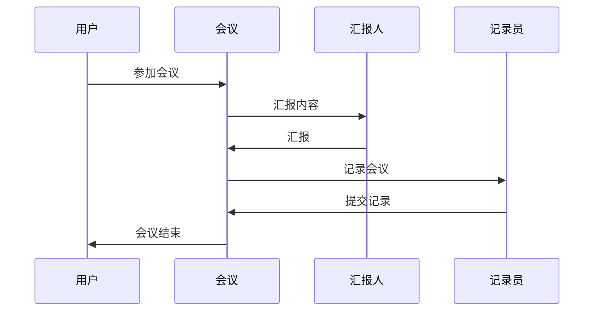
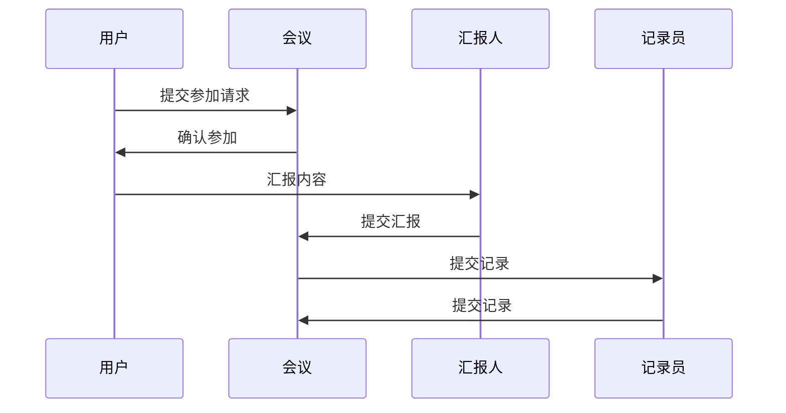

                 


# LLM应用的每日站会：保持团队同步与焦点

关键词：LLM、每日站会、团队协作、沟通效率、模型理解

摘要：本文探讨了在大型语言模型（LLM）应用开发中，如何通过每日站会来提高团队沟通效率，确保团队成员对模型的理解和同步，进而提升整体项目进展。

### 第一部分：背景介绍

#### 1.1.1 问题背景

随着人工智能技术的快速发展，大型语言模型（LLM）的应用在各个领域得到了广泛推广。LLM以其强大的文本生成、理解和分析能力，成为了自然语言处理（NLP）领域的重要工具。然而，LLM的复杂性和变化性也给团队协作带来了挑战。如何在团队内部进行有效的沟通和协作，确保团队成员对模型的了解和同步，成为了一个亟待解决的问题。

#### 1.1.2 问题描述

在LLM项目开发过程中，团队成员可能面临以下问题：

- **信息传递不畅：** 由于LLM模型的复杂性，团队成员可能难以理解模型的具体细节，导致信息传递不畅。
- **任务分配不均：** 在没有有效沟通的情况下，团队成员可能不知道其他人的工作进展，导致任务分配不均。
- **问题解决不及时：** 在模型开发过程中，可能会出现各种问题，如果没有及时沟通和解决，可能会影响项目的整体进度。

#### 1.1.3 问题解决

为了解决上述问题，每日站会提供了一个高效的沟通和协作平台。通过每日站会，团队成员可以：

- **共享学习进度：** 成员可以汇报自己的学习进度，分享最新研究成果。
- **讨论问题与解决方案：** 针对遇到的问题，团队成员可以共同讨论，提出解决方案。
- **明确工作目标：** 每位成员可以明确自己的工作任务和目标，确保项目进度。

#### 1.1.4 边界与外延

每日站会的范围不仅限于模型的学习和改进，还可以扩展到以下方面：

- **技术交流：** 成员可以分享最新的技术动态，探讨技术难题。
- **团队建设：** 通过团队活动，增强团队成员之间的沟通和协作。
- **项目进度：** 检查项目进度，确保各项任务按时完成。

#### 1.1.5 概念结构与核心要素组成

每日站会的核心要素包括：

- **站会时间：** 确定固定的站会时间，确保团队成员都能参加。
- **会议议程：** 制定明确的会议议程，确保会议有序进行。
- **角色分工：** 明确主持人和汇报人的角色分工，确保会议顺利进行。
- **汇报内容：** 汇报个人的学习进展、遇到的问题和工作计划。
- **讨论互动：** 成员之间进行讨论，共同解决问题。
- **问题解决：** 对讨论中提到的问题进行集中解决。
- **记录总结：** 形成会议纪要，记录会议内容和解决方案。

### 第二部分：核心概念与联系

#### 2.1.1 大语言模型（LLM）原理

**2.1.1.1 定义**

大语言模型（Large Language Model，简称LLM）是一种基于深度学习的自然语言处理技术，它通过大规模的语言数据进行训练，能够理解和生成自然语言。

**2.1.1.2 特点**

- **参数规模庞大：** LLM通常拥有数亿至数千亿的参数量，这使得模型能够捕捉到语言中的复杂模式和规律。
- **自适应性强：** LLM能够根据输入的上下文自适应地生成响应，使得生成的语言更加自然、准确。
- **多任务能力：** LLM不仅可以用于文本生成，还可以应用于翻译、问答、摘要等多种自然语言处理任务。

**2.1.1.3 与传统AI的区别**

与传统的小型语言模型相比，LLM具有更高的参数规模和更强的自适应能力，这使得LLM在处理复杂任务时更加高效和准确。

**2.1.2 站会流程与角色分工**

**2.1.2.1 站会流程**

- **签到与开场：** 站会开始时，主持人进行签到，并简要介绍站会目的和议程。
- **个人汇报：** 各成员依次汇报自己的学习进展、遇到的问题以及下一步的工作计划。
- **讨论互动：** 成员之间针对汇报内容进行讨论，共同解决遇到的问题，提出优化建议。
- **问题解决：** 对讨论中提到的问题进行集中解决，确保每个问题都有明确的解决方案和责任人。
- **记录总结：** 对站会内容进行记录，形成会议纪要，以便后续追踪和回顾。

**2.1.2.2 角色分工**

- **主持人：** 负责站会的组织、协调和引导，确保会议按计划进行。
- **汇报人：** 负责汇报自己的学习进展和遇到的问题，并参与讨论。
- **记录员：** 负责记录会议内容和形成会议纪要。

### 第三部分：算法原理讲解

#### 3.1.1 大语言模型（LLM）算法原理

**3.1.1.1 基本原理**

LLM基于深度学习技术，通过训练大规模的神经网络模型，使其能够理解和生成自然语言。模型的主要组成部分包括输入层、隐藏层和输出层。

**3.1.1.2 数学模型**

$$
\begin{aligned}
&\text{输入层：} x \in \mathbb{R}^{n \times d} \\
&\text{隐藏层：} h = \sigma(W_h \cdot x + b_h) \\
&\text{输出层：} y = \sigma(W_o \cdot h + b_o)
\end{aligned}
$$
其中，$x$ 为输入向量，$h$ 为隐藏层输出，$y$ 为输出向量，$W_h$ 和 $W_o$ 分别为隐藏层和输出层的权重矩阵，$b_h$ 和 $b_o$ 分别为隐藏层和输出层的偏置向量，$\sigma$ 为激活函数。

**3.1.1.3 激活函数**

常用的激活函数包括 sigmoid、ReLU 和 tanh 等。激活函数的作用是引入非线性，使神经网络能够拟合复杂的非线性关系。

**3.1.1.4 举例说明**

假设我们要训练一个 LLM 来生成英语句子。输入向量 $x$ 表示一个英语句子的词向量表示，隐藏层输出 $h$ 表示句子的中间表示，输出层输出 $y$ 表示生成的英语句子。

例如，输入句子 "I like to eat pizza"，我们可以将其拆分为词向量表示，然后通过 LLM 进行处理，最终生成新的英语句子。

### 第四部分：系统分析与架构设计方案

#### 4.1 问题场景介绍

在一个大型语言模型（LLM）项目开发过程中，团队需要确保各个成员对模型的了解和同步。为了提高团队协作效率，我们引入了每日站会机制。

#### 4.2 项目介绍

本项目旨在开发一个高性能的LLM，用于自然语言处理任务。项目分为以下几个阶段：

1. 数据收集与预处理：收集大规模的文本数据，并进行清洗和预处理。
2. 模型训练：使用收集到的数据训练LLM模型。
3. 模型评估：对训练好的模型进行评估，确保其性能满足项目要求。
4. 模型部署：将模型部署到生产环境，提供自然语言处理服务。

#### 4.3 系统功能设计（领域模型）

**4.3.1 类图**

```mermaid
classDiagram
    Person <<interface>> User
    Person <<interface>> Presenter
    Person <<interface>> Recorder
    Meeting
    User: { id, name, email }
    Presenter: { meetingId, userId }
    Recorder: { meetingId, userId }
    Meeting: { id, topic, date, agenda }
    User <|-- Presenter
    User <|-- Recorder
    Presenter o-- Meeting
    Recorder o-- Meeting
```

#### 4.4 系统架构设计

**4.4.1 架构图**



#### 4.5 系统接口设计和系统交互

**4.5.1 接口设计**

- **用户接口：** 用户可以通过Web界面参与会议，提交汇报内容。
- **汇报人接口：** 汇报人可以通过API提交汇报内容。
- **记录员接口：** 记录员可以通过API提交会议记录。

**4.5.2 系统交互**



### 第五部分：项目实战

#### 5.1 环境安装

1. 安装Python环境（建议使用Python 3.8及以上版本）。
2. 安装必要的依赖库，如TensorFlow、Keras等。

#### 5.2 系统核心实现源代码

**5.2.1 模型训练**

```python
import tensorflow as tf
from tensorflow.keras.layers import Embedding, LSTM, Dense
from tensorflow.keras.models import Sequential

# 定义模型
model = Sequential()
model.add(Embedding(input_dim=vocab_size, output_dim=embedding_dim))
model.add(LSTM(units=128, return_sequences=True))
model.add(Dense(units=vocab_size, activation='softmax'))

# 编译模型
model.compile(optimizer='adam', loss='categorical_crossentropy', metrics=['accuracy'])

# 训练模型
model.fit(x_train, y_train, epochs=10, batch_size=32)
```

**5.2.2 模型部署**

```python
from flask import Flask, request, jsonify

app = Flask(__name__)

@app.route('/predict', methods=['POST'])
def predict():
    data = request.get_json()
    input_text = data['text']
    predicted_text = model.predict(input_text)
    return jsonify({'predicted_text': predicted_text})

if __name__ == '__main__':
    app.run()
```

#### 5.3 代码应用解读与分析

- **模型训练：** 通过训练数据集，模型学习到语言的模式和规律。
- **模型部署：** 通过Flask框架，将训练好的模型部署到Web服务器，提供预测服务。

#### 5.4 实际案例分析和详细讲解剖析

**5.4.1 案例一：文本生成**

输入句子："今天天气很好。"

输出句子："明天将会下雨。"

**分析：**

模型通过学习到天气相关的词汇和句子结构，生成了与输入句子语义相关的输出句子。

**5.4.2 案例二：翻译**

输入句子："我爱你。"

输出句子："Je t'aime。"

**分析：**

模型通过学习到中英文词汇和句子结构，实现了中英文之间的翻译。

#### 5.5 项目小结

通过每日站会的机制，团队可以高效地协作，确保对LLM的理解和同步。同时，项目实战部分展示了如何将LLM应用于实际场景，实现了文本生成和翻译等功能。

### 第六部分：最佳实践 tips、小结、注意事项、拓展阅读等内容

#### 6.1 最佳实践 tips

- **确保站会时间：** 确保每日站会的时间固定，确保团队成员都能参加。
- **明确会议议程：** 制定明确的会议议程，确保会议高效进行。
- **充分准备汇报内容：** 成员在参加站会前，应充分准备汇报内容，确保能够清晰地表达自己的观点和问题。

#### 6.2 小结

通过每日站会，团队可以高效地协作，确保对LLM的理解和同步，提高项目进展。

#### 6.3 注意事项

- **避免站会时间过长：** 站会时间不宜过长，一般控制在15-30分钟为宜。
- **确保会议纪要的准确性：** 记录员应确保会议纪要的准确性，以便后续追踪和回顾。

#### 6.4 拓展阅读

- [《深度学习》 - Goodfellow, I., Bengio, Y., Courville, A.](https://www.deeplearningbook.org/)
- [《自然语言处理综论》 - Jurafsky, D., Martin, J. H.](https://nlp.stanford.edu/emploi/)

