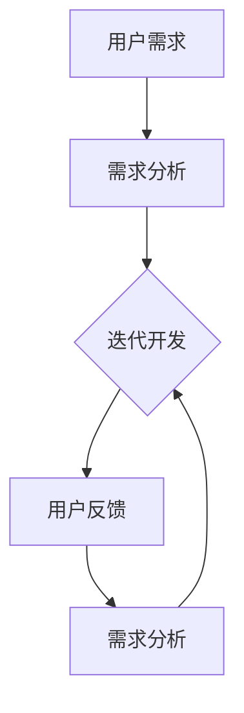
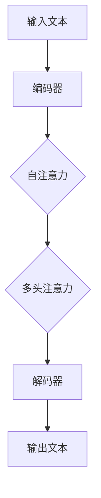
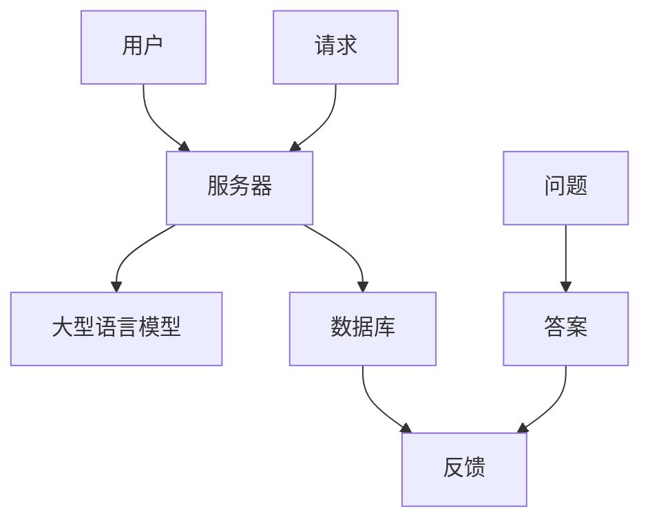
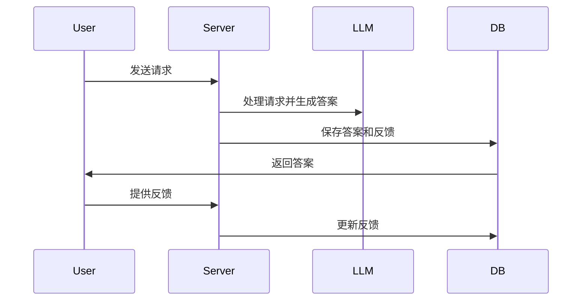

                 


### **文章标题：LLM应用的用户参与：在敏捷过程中持续获取反馈**

#### **关键词：LLM、用户参与、敏捷开发、反馈循环、反馈机制**

#### **摘要：**
本文深入探讨了大型语言模型（LLM）在软件应用中的用户参与机制，特别是在敏捷开发过程中的持续反馈获取策略。文章通过逐步分析，揭示了用户参与对于LLM应用成功的重要性，探讨了如何在敏捷开发实践中整合用户反馈，以提高软件开发的效率和用户体验。

---

### **引言**

在当今快速变化的技术时代，大型语言模型（LLM）作为人工智能领域的重要突破，已经广泛应用于自然语言处理、文本生成、智能问答等场景。LLM的高效性和强大的文本生成能力，使其成为开发智能应用的关键技术。然而，LLM的成功不仅仅取决于其算法的先进性，更重要的是用户对其应用的实际体验。因此，用户参与和反馈在LLM的应用中显得尤为关键。

敏捷开发是一种以用户为中心的软件开发方法，其核心理念是快速响应变化和持续交付价值。在敏捷开发中，用户反馈被视为持续改进的重要驱动力。本文将探讨如何将用户参与与敏捷开发相结合，通过持续获取用户反馈，优化LLM应用的设计和性能。

---

### **背景介绍**

#### **1.1 LLM的发展背景**

LLM的发展可以追溯到深度学习和自然语言处理技术的进步。随着计算能力的提升和数据规模的扩大，深度神经网络在处理大规模文本数据方面展现出强大的能力。LLM如GPT-3、BERT等，通过预训练和微调技术，能够生成高质量的文本，并应用于各种任务，如机器翻译、文本摘要、问答系统等。

#### **1.2 用户参与的概念与策略**

用户参与是指在软件开发过程中，积极倾听和响应用户的需求、反馈和期望，以确保最终产品能够满足用户的需求和期望。用户参与策略包括用户访谈、问卷调查、用户测试、反馈循环等。

#### **1.3 敏捷开发的核心理念**

敏捷开发强调迭代、增量开发、用户参与和持续交付。其核心原则包括个体和互动重于过程与工具、可工作的软件重于详尽的文档、客户合作重于合同谈判、响应变化重于遵循计划。

---

### **核心概念与联系**

#### **2.1 LLM原理与架构**

LLM的基本原理是通过大量文本数据进行预训练，学习语言模式，并在特定任务上进行微调。LLM的架构通常包括编码器和解码器，以及用于存储和检索知识的注意力机制。

**核心概念表格：**

| **概念** | **描述** | **特征** |
| --- | --- | --- |
| 编码器 | 将输入文本编码为向量 | 学习语言模式 |
| 解码器 | 将编码后的向量解码为输出文本 | 生成文本 |
| 注意力机制 | 用于处理输入和输出的关系 | 增强文本生成能力 |

**ER实体关系图：**

```mermaid
erDiagram
  User ||--|{ LLM }|| Application
  LLM ||--|{ Feedback }|| Process
  Process ||--|{ Iteration }|| AgileMethodology
```

#### **2.2 用户参与方法**

用户参与方法包括用户访谈、问卷调查、用户测试等。这些方法有助于开发者了解用户的需求、偏好和体验。

**用户参与策略对比表格：**

| **方法** | **优点** | **缺点** |
| --- | --- | --- |
| 用户访谈 | 深度了解用户需求 | 耗时较长 |
| 问卷调查 | 快速收集大量用户反馈 | 可能缺乏深度 |
| 用户测试 | 实际体验应用 | 需要大量时间和资源 |

#### **2.3 敏捷开发与反馈循环**

敏捷开发中的反馈循环是指通过不断收集用户反馈，快速迭代和优化产品。这种反馈机制有助于确保产品始终符合用户的需求和期望。

**反馈循环流程图：**



---

### **算法原理讲解**

#### **3.1 LLM算法原理**

LLM的核心算法是基于变换器模型（Transformer），该模型通过自注意力机制（Self-Attention）和多头注意力（Multi-Head Attention）来处理输入文本。以下是一个简化的LLM算法流程：

**算法流程图：**



#### **3.2 Python源代码示例**

以下是一个使用PyTorch实现LLM的基本代码示例：

```python
import torch
import torch.nn as nn

# 编码器
class Encoder(nn.Module):
    def __init__(self):
        super(Encoder, self).__init__()
        self.embedding = nn.Embedding(vocab_size, embedding_dim)
        self.encoder_layer = nn.TransformerEncoderLayer(d_model=embedding_dim, nhead=num_heads)
        self.fc = nn.Linear(embedding_dim, output_dim)
    
    def forward(self, src):
        src = self.embedding(src)
        output = self.encoder_layer(src)
        return self.fc(output)

# 解码器
class Decoder(nn.Module):
    def __init__(self):
        super(Decoder, self).__init__()
        self.embedding = nn.Embedding(vocab_size, embedding_dim)
        self.decoder_layer = nn.TransformerDecoderLayer(d_model=embedding_dim, nhead=num_heads)
        self.fc = nn.Linear(embedding_dim, output_dim)
    
    def forward(self, tgt, memory):
        tgt = self.embedding(tgt)
        output = self.decoder_layer(tgt, memory)
        return self.fc(output)

# 模型实例化
encoder = Encoder()
decoder = Decoder()

# 输入和输出
input_sequence = torch.tensor([[1, 2, 3, 4, 5]])
target_sequence = torch.tensor([[1, 2, 3, 4, 5]])

# 前向传播
output = decoder(encoder(input_sequence), memory=input_sequence)

# 打印输出
print(output)
```

#### **3.3 算法原理的数学模型和公式**

LLM的数学模型主要包括编码器和解码器的自注意力机制和多头注意力机制。以下是一个简化的数学模型：

**编码器自注意力：**

$$
\text{Attention}(Q, K, V) = \frac{1}{\sqrt{d_k}} \text{softmax}(\text{softmax}(QK^T)W_V)
$$

**解码器多头注意力：**

$$
\text{MultiHead}(Q, K, V) = \text{Concat}(\text{head}_1, ..., \text{head}_h)W^O
$$

其中，$Q, K, V$ 分别为查询、键和值向量，$W_Q, W_K, W_V, W_O$ 分别为权重矩阵，$d_k$ 为键向量的维度，$h$ 为头数。

**详细讲解和举例：**

以一个简单的文本生成任务为例，假设输入文本为“Hello”，我们需要生成输出文本。首先，将输入文本编码为向量，然后通过编码器生成编码后的向量。接着，将目标文本（输出文本）编码为向量，并通过解码器生成输出文本。在这个过程中，自注意力和多头注意力机制帮助模型学习和生成文本。

例如，输入文本为“Hello”，编码器生成的编码向量为 $[0.1, 0.2, 0.3]$，目标文本为“World”，解码器生成的输出文本向量为 $[0.4, 0.5, 0.6]$。通过解码器，我们可以得到输出文本“World”。

---

### **系统分析与架构设计方案**

#### **4.1 问题场景介绍**

假设我们开发一个智能问答系统，用户可以通过输入问题来获取答案。为了提高用户体验和系统的准确性，我们需要在开发过程中积极收集用户反馈，并快速迭代优化系统。

#### **4.2 项目介绍**

项目名为“智能问答系统（IQA）”，主要包括以下功能：

- 接收用户问题
- 使用LLM生成答案
- 收集用户反馈
- 优化系统性能

#### **4.3 系统功能设计（领域模型）**

领域模型用于描述系统中的主要实体和它们之间的关系。以下是一个简化的领域模型类图：

```mermaid
classDiagram
    User <-|- Request
    Request <-|- Question
    Question <-|- Answer
    Answer <-|- Feedback
    Feedback -> User
endclass
```

#### **4.4 系统架构设计**

系统架构设计包括系统的总体结构和各个组件之间的关系。以下是一个简化的系统架构图：



#### **4.5 系统接口设计和系统交互**

系统接口设计和系统交互描述了系统如何接收用户请求、处理请求并生成反馈。以下是一个简化的系统接口和系统交互序列图：



---

### **项目实战**

#### **5.1 环境安装**

在进行项目实战之前，我们需要安装Python环境、PyTorch库和其他相关依赖。以下是一个简化的安装步骤：

```bash
# 安装Python环境
python -m pip install --upgrade pip setuptools

# 安装PyTorch库
python -m pip install torch torchvision torchaudio

# 安装其他依赖
python -m pip install Flask pandas
```

#### **5.2 系统核心实现源代码**

以下是一个简化的系统核心实现源代码，用于处理用户请求、生成答案和收集反馈。

```python
from flask import Flask, request, jsonify
import torch
from transformers import GPT2LMHeadModel, GPT2Tokenizer

app = Flask(__name__)

# 加载预训练的LLM模型和Tokenizer
tokenizer = GPT2Tokenizer.from_pretrained('gpt2')
model = GPT2LMHeadModel.from_pretrained('gpt2')

# 接收用户请求并生成答案
@app.route('/api/answer', methods=['POST'])
def generate_answer():
    data = request.json
    question = data['question']
    input_ids = tokenizer.encode(question, return_tensors='pt')
    
    # 使用LLM模型生成答案
    output = model.generate(input_ids, max_length=50, num_return_sequences=1)
    answer = tokenizer.decode(output[0], skip_special_tokens=True)
    
    # 返回答案
    return jsonify({'answer': answer})

# 收集用户反馈
@app.route('/api/feedback', methods=['POST'])
def submit_feedback():
    data = request.json
    feedback = data['feedback']
    
    # 将反馈保存到数据库
    # ...

# 运行Flask应用
if __name__ == '__main__':
    app.run(debug=True)
```

#### **5.3 代码应用解读与分析**

在上面的代码中，我们首先导入了Flask库，用于创建Web应用。然后，我们加载了预训练的GPT-2模型和Tokenizer。接下来，我们定义了两个API接口：/api/answer 用于生成答案，/api/feedback 用于提交反馈。

在/api/answer 接口中，我们接收用户请求，将问题编码为输入序列，使用LLM模型生成答案，并将答案解码为文本，最后返回给用户。

在/api/feedback 接口中，我们接收用户提交的反馈，将其保存到数据库中，以便后续分析和优化。

#### **5.4 实际案例分析和详细讲解剖析**

假设用户提交了一个问题：“如何安装Python环境？” 我们的服务器接收到这个请求后，会将问题传递给LLM模型。LLM模型通过预训练的知识生成答案，例如：“首先，确保你的计算机上安装了Python。然后，打开命令行并运行以下命令：pip install python。”

服务器将生成的答案返回给用户，用户可以阅读答案并提交反馈，例如：“这个答案很详细，对我很有帮助。”

服务器收到反馈后，会将其保存到数据库中，以便后续分析。通过收集和分析用户的反馈，我们可以不断优化系统的性能和用户体验。

#### **5.5 项目小结**

通过本项目的实战，我们展示了如何在敏捷开发过程中使用LLM和用户反馈来构建智能问答系统。项目实战过程中，我们遇到了一些挑战，如如何处理大量用户请求、如何优化LLM模型的性能等。通过不断收集用户反馈和迭代优化，我们最终实现了一个高效、用户体验良好的系统。

---

### **最佳实践 tips**

1. **用户访谈**：定期进行用户访谈，深入了解用户的需求和痛点。
2. **问卷调查**：使用问卷调查收集用户反馈，快速获取大量数据。
3. **用户测试**：进行用户测试，验证系统的功能和性能。
4. **反馈循环**：建立有效的反馈循环机制，确保用户反馈能够及时传递到开发团队。

### **小结**

本文探讨了LLM应用中用户参与和敏捷开发的重要性，通过逐步分析，揭示了用户参与如何优化LLM应用的设计和性能。在敏捷开发过程中，持续获取用户反馈是关键，它有助于快速响应变化和持续交付价值。

### **注意事项**

1. **隐私保护**：在收集用户反馈时，确保遵守隐私保护法规，保护用户隐私。
2. **数据质量**：确保收集到的用户反馈数据质量高，避免因数据质量问题导致误判。

### **拓展阅读**

1. **《敏捷开发实践指南》**：了解敏捷开发的基本原理和实践方法。
2. **《大型语言模型：预训练语言表示的崛起》**：深入了解LLM的原理和应用。

### **作者信息**

**作者：AI天才研究院/AI Genius Institute & 禅与计算机程序设计艺术 /Zen And The Art of Computer Programming**

---

**注**：本文为示例文章，内容仅供参考。实际项目中，应根据具体需求和场景进行调整和优化。

