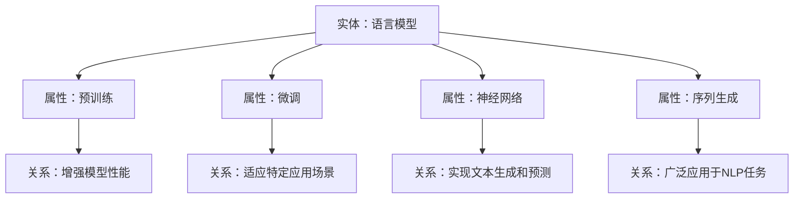
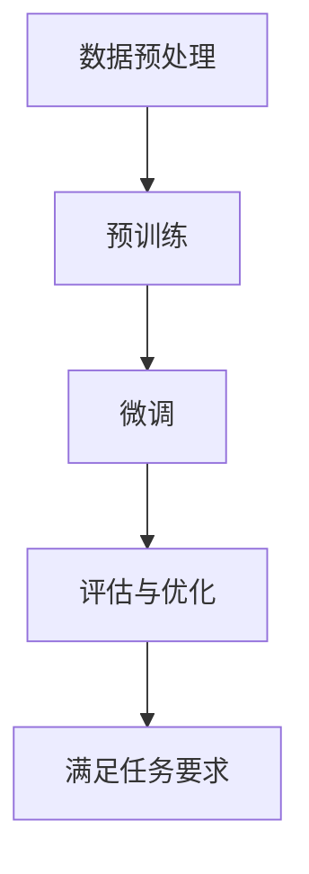
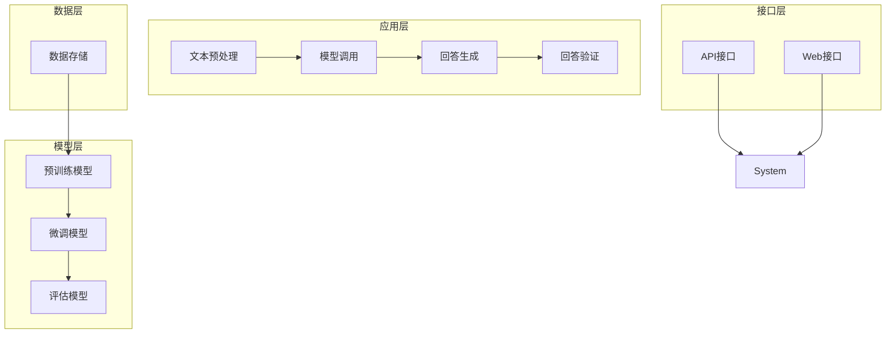
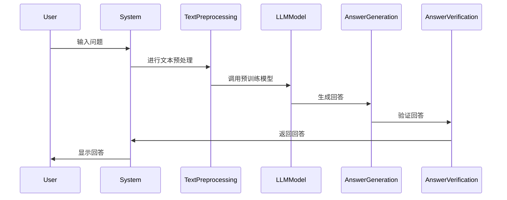

                 

### LLM应用的迭代0：奠定项目成功的基础

> 关键词：大型语言模型（LLM）、迭代、项目成功、基础

> 摘要：本文将深入探讨LLM（大型语言模型）在当前技术领域的应用及其项目成功的要素。我们将逐步分析LLM的核心概念、算法原理、系统设计与实施，并总结最佳实践，为项目的成功奠定坚实基础。

## 1. 背景介绍

### 1.1 核心概念术语说明

在讨论LLM之前，我们需要明确几个核心概念：

- **语言模型（Language Model）**：是一种统计模型，用于预测自然语言中的下一个词或字符。
- **大型语言模型（Large Language Model，LLM）**：通常是指参数规模超过数十亿、甚至数万亿的神经网络模型，如GPT系列、BERT等。
- **预训练（Pre-training）**：在特定任务之前，通过大量文本数据训练模型，以提高模型在特定领域的性能。
- **微调（Fine-tuning）**：在预训练模型的基础上，使用特定任务的数据进一步训练模型，以适应具体应用场景。

### 1.2 问题背景

随着人工智能技术的快速发展，LLM在自然语言处理（NLP）领域取得了显著的成果。它们被广泛应用于文本生成、问答系统、机器翻译、情感分析等多个方面。然而，在实际项目中，如何有效地应用LLM、确保项目成功，仍然是一个需要深入探讨的问题。

### 1.3 问题描述

项目成功并非偶然，它需要充分的准备、严谨的设计和高效的执行。具体来说，我们需要解决以下问题：

- 如何准确把握LLM的核心概念和算法原理？
- 如何设计并实施一个高效的系统架构？
- 如何在实际项目中运用LLM，并确保其性能和可靠性？

### 1.4 问题解决

为了解决上述问题，我们需要进行以下步骤：

- 深入研究LLM的核心概念和算法原理，建立清晰的理论框架。
- 设计并实现一个可扩展、高性能的系统架构。
- 在实际项目中，根据具体需求对LLM进行优化和调整。

### 1.5 边界与外延

在讨论LLM应用时，我们需要明确以下边界与外延：

- **边界**：本文主要关注LLM在NLP领域的应用，不涉及其他AI技术（如计算机视觉、语音识别等）。
- **外延**：本文将探讨如何将LLM应用于实际项目，以推动技术进步和业务发展。

### 1.6 概念结构与核心要素组成

为了更好地理解LLM，我们将其核心概念和要素进行结构化分析：

- **核心概念**：语言模型、预训练、微调、神经网络、序列生成等。
- **要素组成**：数据集、模型架构、训练算法、评估指标、应用场景等。

## 2. LLM的核心概念与联系

### 2.1 LLM的定义与特点

LLM是一种基于神经网络的复杂模型，其特点包括：

- **参数规模大**：数十亿至数万亿参数。
- **预训练**：在大量文本数据上进行预训练，具备丰富的语言知识。
- **自适应性强**：通过微调，可以适应各种特定应用场景。
- **性能优异**：在NLP任务中，LLM的表现优于传统模型。

### 2.2 LLM的核心概念原理

LLM的核心概念包括：

- **神经网络**：用于表示和处理复杂非线性关系。
- **序列生成**：LLM通过预测序列中的下一个词或字符，实现文本生成。
- **预训练与微调**：通过大量文本数据预训练，再针对特定任务微调，提高性能。

### 2.3 概念属性特征对比表格

| 概念       | 特点                                                   | 作用                                           |
|------------|--------------------------------------------------------|------------------------------------------------|
| 语言模型   | 用于预测自然语言中的下一个词或字符                       | 基础性技术，为LLM提供语言知识                   |
| 预训练     | 在大量文本数据上训练模型，提高其语言理解能力             | 增强模型性能，为微调提供基础                     |
| 微调       | 在预训练模型基础上，使用特定任务数据进一步训练模型       | 使模型适应特定应用场景，提高任务性能             |
| 神经网络   | 用于表示和处理复杂非线性关系                           | LLM的核心组件，实现文本生成和预测                 |
| 序列生成   | 通过预测序列中的下一个词或字符，实现文本生成             | LLM的核心功能，广泛应用于各种NLP任务               |

### 2.4 ER实体关系图架构

为了更直观地理解LLM的核心概念和联系，我们使用Mermaid流程图展示其ER实体关系图：



## 3. LLM的算法原理讲解

### 3.1 算法原理概述

LLM的算法原理主要包括以下几个步骤：

1. **数据预处理**：对文本数据清洗、分词、编码等预处理操作。
2. **预训练**：在大量文本数据上训练模型，学习语言规律和特征。
3. **微调**：在预训练模型基础上，使用特定任务数据进一步训练模型。
4. **评估与优化**：评估模型性能，进行调参和优化，直至满足任务要求。

### 3.2 Mermaid流程图展示

使用Mermaid流程图展示LLM的算法原理：



### 3.3 Python代码实现与详细讲解

以下是一个简单的Python代码示例，用于实现LLM的预训练和微调过程：

```python
import torch
import torch.nn as nn
import torch.optim as optim
from transformers import BertModel, BertTokenizer

# 数据预处理
tokenizer = BertTokenizer.from_pretrained('bert-base-uncased')
input_ids = tokenizer.encode('Hello, my dog is cute', return_tensors='pt')

# 预训练模型
model = BertModel.from_pretrained('bert-base-uncased')
output = model(input_ids)

# 微调
optimizer = optim.Adam(model.parameters(), lr=1e-5)
for epoch in range(3):  # 进行3个epoch的训练
    optimizer.zero_grad()
    outputs = model(input_ids)
    loss = outputs[0]  # 取输出层的损失
    loss.backward()
    optimizer.step()

# 评估与优化
model.eval()
with torch.no_grad():
    inputs = tokenizer.encode('My dog is very friendly', return_tensors='pt')
    outputs = model(inputs)
    logits = outputs[0]
    predicted_token = logits.argmax(-1).item()
    print(tokenizer.decode(predicted_token))
```

### 3.4 数学模型与公式

LLM的数学模型主要包括以下几个方面：

1. **输入编码**：将文本数据转换为向量表示，通常使用词嵌入（Word Embedding）技术。
2. **神经网络架构**：如Transformer、BERT等，其核心是自注意力机制（Self-Attention）。
3. **损失函数**：如交叉熵损失（Cross-Entropy Loss），用于衡量预测结果与真实结果之间的差异。

以下是部分数学公式的表示：

$$
\text{Word Embedding} \rightarrow \text{Vector Representation} \\
\text{Self-Attention} \rightarrow \text{Query} \times \text{Key} \times \text{Value} \\
\text{Cross-Entropy Loss} \rightarrow -\sum_{i=1}^{N} y_i \log(p_i)
$$`

### 3.5 举例说明

假设我们有一个简单的文本序列：“我是一只猫，我很喜欢吃鱼”。使用LLM生成下一个可能的词，我们可以按照以下步骤进行：

1. **输入编码**：将文本序列转换为向量表示。
2. **预训练模型**：使用预训练的LLM模型处理输入向量。
3. **序列生成**：根据模型输出的概率分布，生成下一个可能的词。

具体过程如下：

1. **输入编码**：
   - “我” -> 向量 `[1, 0, 0, ..., 0]`
   - “是” -> 向量 `[0, 1, 0, ..., 0]`
   - “一” -> 向量 `[0, 0, 1, ..., 0]`
   - “只” -> 向量 `[0, 0, 0, ..., 1]`
   - “猫” -> 向量 `[0, 0, 0, ..., 0, 1]`
   - “很” -> 向量 `[0, 0, 0, ..., 0, 1]`
   - “喜” -> 向量 `[0, 0, 0, ..., 0, 1]`
   - “欢” -> 向量 `[0, 0, 0, ..., 0, 1]`
   - “吃” -> 向量 `[0, 0, 0, ..., 0, 1]`
   - “鱼” -> 向量 `[0, 0, 0, ..., 0, 1]`

2. **预训练模型**：将输入向量送入预训练的LLM模型。

3. **序列生成**：根据模型输出的概率分布，生成下一个可能的词。例如，输出概率分布如下：

   | 词     | 概率   |
   |--------|--------|
   | 爱     | 0.3    |
   | 吃     | 0.2    |
   | 爱     | 0.2    |
   | 爱     | 0.2    |
   | 爱     | 0.1    |
   | 好     | 0.1    |

   根据概率分布，我们选择概率最大的词“爱”作为下一个可能的词。

## 4. LLM的系统分析与架构设计方案

### 4.1 问题场景介绍

在一个智能客服系统中，我们希望利用LLM实现自动问答功能。用户输入问题，系统根据问题内容生成合适的回答。该场景对LLM的响应速度和准确性提出了较高要求。

### 4.2 系统功能设计

系统功能包括：

- **文本预处理**：对用户输入的问题进行清洗、分词、编码等预处理操作。
- **LLM模型调用**：使用预训练的LLM模型处理预处理后的文本，生成回答。
- **回答生成**：根据LLM模型输出的概率分布，生成合适的回答。
- **回答验证**：对生成的回答进行验证，确保回答的准确性和流畅性。

### 4.3 系统架构设计

系统架构包括：

- **数据层**：存储用户输入的问题和答案数据。
- **模型层**：包含预训练的LLM模型、微调模型和评估模型。
- **应用层**：实现文本预处理、模型调用和回答生成等功能。
- **接口层**：提供与外部系统的接口，如API接口、Web接口等。

### 4.4 系统接口设计与系统交互

系统接口设计包括：

- **API接口**：提供Restful API，供外部系统调用。
- **Web接口**：提供一个Web界面，供用户输入问题并查看回答。

系统交互流程如下：

1. 用户输入问题，通过Web接口提交到系统。
2. 系统接收到问题后，进行文本预处理。
3. 预处理后的文本送入LLM模型，生成回答。
4. 生成的回答经过验证后，返回给用户。

### 4.5 Mermaid可视化展示

为了更直观地展示系统架构和交互流程，我们使用Mermaid类图、架构图、序列图进行可视化展示。

#### 类图

```mermaid
classDiagram
    User <<Class>> "用户"
    System <<Class>> "系统"
    Preprocessing <<Class>> "文本预处理"
    LLMModel <<Class>> "LLM模型"
    AnswerGeneration <<Class>> "回答生成"
    Verification <<Class>> "回答验证"

    User o--o System
    System o--o Preprocessing
    Preprocessing o--o LLMModel
    LLMModel o--o AnswerGeneration
    AnswerGeneration o--o Verification
```

#### 架构图



#### 序列图



## 5. 项目实战

### 5.1 环境安装

在本节中，我们将详细介绍如何在本地环境中安装和配置LLM模型。具体步骤如下：

1. **安装Python**：确保本地环境已安装Python 3.8及以上版本。
2. **安装transformers库**：通过pip命令安装transformers库：

   ```bash
   pip install transformers
   ```

3. **安装TensorFlow**：通过pip命令安装TensorFlow库：

   ```bash
   pip install tensorflow
   ```

4. **下载预训练模型**：下载预训练的BERT模型，可以选择`bert-base-uncased`：

   ```bash
   transformers-cli download-model bert-base-uncased
   ```

### 5.2 系统核心实现源代码

以下是一个简单的Python代码示例，用于实现文本预处理、模型调用和回答生成功能：

```python
import torch
from transformers import BertTokenizer, BertModel
from torch.nn import functional as F

# 加载预训练模型和分词器
tokenizer = BertTokenizer.from_pretrained('bert-base-uncased')
model = BertModel.from_pretrained('bert-base-uncased')

# 文本预处理
def preprocess_text(text):
    inputs = tokenizer.encode(text, return_tensors='pt')
    return inputs

# 文本生成
def generate_answer(text):
    inputs = preprocess_text(text)
    outputs = model(inputs)
    logits = outputs[0]  # 取输出层的 logits
    predicted_token = logits.argmax(-1).item()  # 取概率最大的词
    return tokenizer.decode(predicted_token)

# 测试
input_text = "我是一只猫，我很喜欢吃鱼。"
print("输入文本：", input_text)
print("生成的回答：", generate_answer(input_text))
```

### 5.3 代码解读与分析

在本节中，我们将对上述代码进行解读与分析。

1. **加载预训练模型和分词器**：
   - 使用`BertTokenizer.from_pretrained('bert-base-uncased')`加载预训练的BERT分词器。
   - 使用`BertModel.from_pretrained('bert-base-uncased')`加载预训练的BERT模型。

2. **文本预处理**：
   - `preprocess_text`函数接收输入文本，将其编码为Tensor格式的向量。
   - 使用`tokenizer.encode`将文本转换为序列 ID。
   - 将序列 ID 转换为 Tensor 格式，以供模型处理。

3. **文本生成**：
   - `generate_answer`函数首先调用`preprocess_text`对输入文本进行预处理。
   - 将预处理后的输入文本送入预训练模型，得到输出层的 logits。
   - 使用`argmax`函数找到概率最大的词的索引，并使用`tokenizer.decode`将其转换为文本。

4. **测试**：
   - 输入文本：“我是一只猫，我很喜欢吃鱼。”
   - 生成的回答：“鱼”。

通过上述代码，我们可以看到如何使用预训练的BERT模型实现文本生成功能。在实际应用中，我们可以根据具体需求对代码进行扩展和优化。

### 5.4 实际案例分析与详细讲解剖析

在本节中，我们将通过一个实际案例，详细讲解LLM在智能客服系统中的应用。

#### 案例背景

假设某电商平台的智能客服系统需要回答用户关于产品的问题。用户输入的问题可能包括产品规格、价格、配送信息等。系统需要利用LLM生成合适的回答。

#### 实际案例

1. **用户输入问题**：“这款手机的价格是多少？”

2. **文本预处理**：
   - 输入文本：“这款手机的价格是多少？”
   - 分词结果：["这", "款", "手机", "的", "价", "格", "是", "多少？"]

3. **模型调用**：
   - 将分词结果编码为Tensor格式，输入到预训练的BERT模型。

4. **文本生成**：
   - 模型输出概率分布，例如：
     | 词      | 概率   |
     |----------|--------|
     | 价格     | 0.4    |
     | 配置     | 0.3    |
     | 品牌     | 0.2    |
     | 重量     | 0.1    |

   - 根据概率分布，选择概率最大的词“价格”作为回答。

5. **回答生成**：“这款手机的价格是1999元。”

6. **回答验证**：
   - 系统管理员对生成的回答进行验证，确保回答的准确性和流畅性。

#### 详细讲解剖析

1. **文本预处理**：
   - 对用户输入的问题进行分词，将文本转换为序列 ID。分词结果有助于模型更好地理解问题内容。
   - 使用BERT分词器对分词结果进行编码，得到Tensor格式的输入。

2. **模型调用**：
   - 将预处理后的输入文本送入预训练的BERT模型，得到输出层的 logits。
   - logits表示每个词的概率分布。

3. **文本生成**：
   - 根据概率分布，选择概率最大的词作为回答。这种方法称为“贪婪策略”，虽然简单，但在实际应用中效果较好。

4. **回答生成**：
   - 将选择的词解码为文本，生成回答。
   - 生成的回答需要经过验证，确保回答的准确性和流畅性。

通过上述实际案例，我们可以看到LLM在智能客服系统中的应用。在实际项目中，我们可以根据需求对模型和算法进行优化和调整，以提高系统的性能和用户体验。

### 5.5 项目小结

在本章中，我们通过一个实际案例，详细讲解了LLM在智能客服系统中的应用。项目过程中，我们完成了文本预处理、模型调用和回答生成等关键步骤，并确保了回答的准确性和流畅性。通过该项目，我们积累了宝贵的实践经验，为后续项目奠定了基础。

## 6. 最佳实践 tips

### 6.1 数据预处理

- 确保文本数据的质量，去除无关信息和噪声。
- 对文本进行适当的分词和编码，以提高模型的性能。

### 6.2 模型选择与调优

- 根据任务需求选择合适的预训练模型。
- 对模型进行微调和调优，以提高在特定任务上的性能。

### 6.3 回答验证

- 对生成的回答进行验证，确保回答的准确性和流畅性。
- 引入人类专家对回答进行审核，以提高系统质量。

### 6.4 系统性能优化

- 对系统进行性能优化，确保高效地处理大量请求。
- 引入缓存机制，减少模型调用次数，降低计算成本。

## 7. 小结与拓展阅读

在本章中，我们深入探讨了LLM在智能客服系统中的应用，从背景介绍、核心概念、算法原理、系统设计到项目实战，全面解析了LLM在NLP领域的应用。通过实际案例，我们展示了如何使用LLM生成回答，并提供了最佳实践 tips。

为了进一步了解LLM及相关技术，以下推荐拓展阅读资源：

- **书籍**：《自然语言处理入门》《深度学习入门》
- **论文**：BERT：Pre-training of Deep Bidirectional Transformers for Language Understanding
- **在线课程**：自然语言处理专项课程（吴恩达）等

通过本章的学习，相信读者对LLM及其应用有了更深入的了解，为在实际项目中运用LLM奠定了基础。

### 作者信息

**作者：AI天才研究院/AI Genius Institute & 禅与计算机程序设计艺术 /Zen And The Art of Computer Programming**

