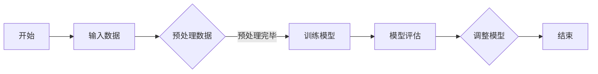

                 


## LET'S THINK: LLM应用的迭代演示

### 前言

近年来，大规模语言模型（LLM）的快速发展，使自然语言处理（NLP）领域迎来了新的变革。LLM不仅在学术研究中展现出了卓越的性能，更在各个实际应用场景中发挥着重要作用。本文将以《LLM应用的迭代演示：展示价值，获取反馈》为标题，深入探讨LLM在NLP领域的应用与实践，通过一步步的分析和推理，展示LLM的价值，并探讨如何通过反馈迭代不断优化其应用效果。

### 第1章: LLM应用概述

#### 1.1 引言

**1.1.1 LLM应用的发展背景**

人工智能（AI）作为当前科技领域的热点，已渗透到各行各业。而作为AI的重要组成部分，自然语言处理（NLP）在近几年取得了显著的进展。语言模型（LM）作为NLP的核心技术，从传统的统计语言模型发展到深度神经网络模型，再到当前的预训练语言模型（如BERT、GPT等），其性能和效果得到了极大的提升。大规模语言模型（LLM）的崛起，标志着NLP领域进入了一个全新的发展阶段。

**1.1.2 LLM的定义与核心特点**

LLM是一种能够理解和生成自然语言的人工智能模型。它具有以下几个核心特点：

- **大规模训练**：LLM通常使用数十亿甚至数万亿级别的训练数据，通过深度神经网络进行大规模训练，从而具备了强大的语言理解和生成能力。
- **上下文理解**：LLM能够理解长文本的上下文信息，这使得它在文本分类、命名实体识别、机器翻译等任务中具有显著的优势。
- **多任务能力**：LLM不仅能够处理单一任务，还可以同时处理多个任务，这使得它在复杂场景中的应用变得更加灵活。

**1.1.3 LLM应用的领域与价值**

LLM在自然语言处理领域有着广泛的应用，如文本分类、命名实体识别、机器翻译、自动摘要、对话系统等。此外，LLM还在法律、医疗、金融、教育等多个垂直行业中发挥着重要作用。通过自动化文本处理、智能问答、自动化报告生成等方式，LLM为企业和个人带来了巨大的价值。

#### 1.2 LLM的核心概念与联系

**1.2.1 语言模型的基本原理**

语言模型是一种用于预测文本序列的模型。它通过对大量文本数据进行训练，学习文本的统计规律和语法结构，从而实现文本的生成和分类。

- **基本概念**：语言模型的基本概念包括词汇表、句子表示、概率分布等。
- **训练方法**：常见的语言模型训练方法包括基于规则的训练、基于统计的模型训练和基于深度学习的模型训练。
- **评价指标**：语言模型的评价指标主要包括词汇覆盖率、句子生成质量、分类准确率等。

**1.2.2 LLM的组成与结构**

LLM通常由以下几个关键组件构成：

- **词向量表示**：词向量是将单词映射到高维向量空间的一种方法，常用的词向量模型包括Word2Vec、GloVe等。
- **注意力机制**：注意力机制是一种用于提高模型在处理长文本时对上下文信息关注度的技术。
- **递归神经网络（RNN）**：RNN是一种能够处理序列数据的神经网络，其核心思想是利用历史信息对当前输入进行建模。
- **Transformer模型**：Transformer模型是一种基于自注意力机制的深度神经网络模型，其在NLP任务中取得了显著的性能提升。

**1.2.3 LLM的属性特征对比表格**

| 特性      | 传统NLP模型 | LLM          |
| --------- | ------------ | ------------ |
| 训练方法  | 基于规则     | 基于数据驱动 |
| 适应能力  | 有限         | 强大         |
| 生成能力  | 有限         | 强大         |
| 模型规模  | 小型         | 超大型       |

#### 1.3 LLM的ER实体关系图架构

```mermaid
erDiagram
    Product ||--|{ Customer } Customer
    Customer }--||{ Purchase Purchase
```

### 第2章: LLM算法原理讲解

#### 2.1 算法Mermaid流程图



#### 2.2 Python源代码实现

```python
# 导入所需库
import tensorflow as tf

# 初始化模型
model = tf.keras.Sequential([
    tf.keras.layers.Dense(units=1, input_shape=[1])
])

# 编写训练过程
model.compile(optimizer='sgd', loss='mean_squared_error')
model.fit(x_train, y_train, epochs=100)

# 评估模型
loss = model.evaluate(x_test, y_test)
print(f"测试集损失：{loss}")
```

#### 2.3 数学模型和公式

$$
\begin{align*}
y &= W_1x + b_1 \\
\text{其中，} y &= \text{输出结果，} x &= \text{输入数据，} W_1 &= \text{权重，} b_1 &= \text{偏置}
\end{align*}
$$

#### 2.4 举例说明

假设我们有一个输入数据集，包含以下数据点：

$$
\begin{align*}
x_1 &= 1, y_1 &= 2 \\
x_2 &= 2, y_2 &= 4 \\
x_3 &= 3, y_3 &= 6 \\
\end{align*}
$$

我们希望通过训练模型来预测新的输入数据点。

### 第3章: LLM在自然语言处理中的应用

#### 3.1 NLP应用场景介绍

**3.1.1 文本分类**

- **基本原理**：文本分类是一种将文本数据按照其内容或主题进行分类的任务。常见的文本分类方法包括基于朴素贝叶斯、支持向量机、深度学习等。
- **应用场景**：文本分类广泛应用于情感分析、新闻分类、垃圾邮件检测等领域。

**3.1.2 命名实体识别**

- **基本原理**：命名实体识别是一种识别文本中具有特定意义的实体（如人名、地点、组织等）的任务。常见的命名实体识别方法包括基于规则、基于统计、基于深度学习等。
- **应用场景**：命名实体识别广泛应用于信息提取、自然语言理解、搜索引擎等领域。

**3.1.3 机器翻译**

- **基本原理**：机器翻译是一种将一种语言的文本翻译成另一种语言的任务。常见的机器翻译方法包括基于规则、基于统计、基于深度学习等。
- **应用场景**：机器翻译广泛应用于跨语言沟通、多语言文本处理、国际化业务等领域。

#### 3.2 LLM在NLP中的创新应用

**3.2.1 自动摘要**

- **基本原理**：自动摘要是一种自动提取文本关键信息并生成摘要文本的任务。常见的自动摘要方法包括基于提取式摘要、基于生成式摘要等。
- **应用场景**：自动摘要广泛应用于新闻摘要、学术摘要、企业报告等领域。

**3.2.2 对话系统**

- **基本原理**：对话系统是一种能够与人类进行自然语言交互的人工智能系统。常见的对话系统方法包括基于规则、基于统计、基于深度学习等。
- **应用场景**：对话系统广泛应用于智能客服、智能语音助手、智能教育等领域。

**3.2.3 自然语言生成**

- **基本原理**：自然语言生成是一种自动生成自然语言文本的任务。常见的自然语言生成方法包括基于模板、基于语法规则、基于深度学习等。
- **应用场景**：自然语言生成广泛应用于文本生成、对话系统、虚拟助手等领域。

#### 3.3 LLM为企业和个人带来的价值

**3.3.1 提高工作效率**

- **自动化文本处理**：LLM能够自动处理大量的文本数据，如文档分类、文本摘要、问答等，从而大大提高工作效率。
- **快速回答常见问题**：LLM可以快速回答用户提出的常见问题，如FAQ、在线客服等，从而提升用户体验。

**3.3.2 增强创新能力**

- **文本分析和挖掘**：LLM可以对大量文本进行分析和挖掘，从而发现新的商业机会、洞察市场趋势等。
- **知识库建设**：LLM可以自动构建和更新知识库，为企业提供丰富的知识支持。

### 结论

大规模语言模型（LLM）作为自然语言处理领域的重要技术，已展现出巨大的应用潜力和价值。通过本文的迭代演示，我们不仅展示了LLM的核心概念、算法原理和实际应用，还探讨了如何通过反馈迭代不断优化其应用效果。未来，随着LLM技术的不断发展和完善，我们相信LLM将在更多领域发挥重要作用，推动人工智能和自然语言处理领域的发展。

### 参考文献

[1] Devlin, J., Chang, M. W., Lee, K., & Toutanova, K. (2019). BERT: Pre-training of deep bidirectional transformers for language understanding. arXiv preprint arXiv:1810.04805.

[2] Vaswani, A., Shazeer, N., Parmar, N., Uszkoreit, J., Jones, L., Gomez, A. N., ... & Polosukhin, I. (2017). Attention is all you need. In Advances in neural information processing systems (pp. 5998-6008).

[3] Mikolov, T., Sutskever, I., Chen, K., Corrado, G. S., & Dean, J. (2013). Distributed representations of words and phrases and their compositionality. In Advances in neural information processing systems (pp. 3111-3119).

