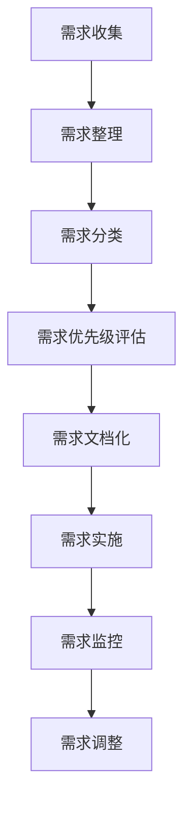

                 

### LLM应用的需求优先级：使用MoSCoW方法

> 关键词：LLM应用，需求优先级，MoSCoW方法，需求分析，项目实施

> 摘要：本文将深入探讨LLM（大型语言模型）应用的需求优先级问题，并介绍如何使用MoSCoW方法来有效地进行需求分析和项目实施。文章将从LLM应用的需求背景入手，详细阐述MoSCoW方法的基本原理及其在实际项目中的应用，最终提出对未来发展趋势的展望。

## 第一部分：背景介绍

### 1.1 LLM应用的需求优先级的重要性

**1.1.1 什么是LLM应用**

LLM（Large Language Model）是指大型语言模型，是人工智能领域的一种先进技术，能够在自然语言处理（NLP）任务中实现高水平的自动理解和生成。LLM的应用场景广泛，包括但不限于文本生成、机器翻译、问答系统、自动摘要等。

**1.1.2 需求优先级在LLM应用中的作用**

在LLM应用开发过程中，需求优先级的管理至关重要。优先级明确的需求有助于确保项目在有限的资源和时间内能够集中精力解决最关键的问题，提高项目的成功率和效率。

**1.1.3 MoSCoW方法简介**

MoSCoW方法是英国软件工程师Ken Schwaber和Jeff Sutherland在敏捷开发过程中提出的一种需求分类和优先级排序的方法。该方法将需求分为四类：必须（Must）、应该（Should）、可以（Could）、不会（Won't），通过这种分类和排序，可以有效地管理和优化项目需求。

## 第二部分：MoSCoW方法的基本原理

### 2.1 MoSCoW方法的起源

MoSCoW方法的起源可以追溯到1990年代初，当时Ken Schwaber和Jeff Sutherland在开发敏捷软件项目时，发现传统的需求分析方法无法很好地适应快速变化的软件开发环境。为了解决这个问题，他们提出了MoSCoW方法。

**2.1.1 MoSCoW方法的提出背景**

在传统的软件开发方法中，需求分析通常是在项目初期完成的，并且假设这些需求在整个项目周期内不会发生变化。然而，随着软件项目的复杂性和动态性的增加，这种假设变得越来越不现实。

**2.1.2 MoSCoW方法的定义**

MoSCoW方法是一种需求优先级排序方法，通过将需求分为四类，以便在项目规划和执行过程中进行优先级管理。这四类需求分别是：

- **必须（Must）**：这类需求是项目成功的基础，没有它们，项目就无法进行。
- **应该（Should）**：这类需求对项目的成功至关重要，但如果没有实现，项目仍然可以继续。
- **可以（Could）**：这类需求是可选的，但它们可以增强项目的功能或用户体验。
- **不会（Won't）**：这类需求在当前项目中不会实现，但可能会在未来的项目中考虑。

### 2.2 MoSCoW方法的四个类别

#### 2.2.1 必须需求评估

**定义与特征**：必须需求是项目不可或缺的部分，它们直接关系到项目的核心功能。

**实例说明**：在一个电商平台上，用户注册和登录功能就是必须需求。

#### 2.2.2 应该需求评估

**定义与特征**：应该需求对项目的成功有重要影响，但可以推迟实现。

**实例说明**：在一个电商平台上，用户评价和反馈功能就是应该需求。

#### 2.2.3 可以需求评估

**定义与特征**：可以需求是可选的，实现它们可以增强项目的功能或用户体验。

**实例说明**：在一个电商平台上，个性化推荐功能就是可以需求。

#### 2.2.4 不会需求评估

**定义与特征**：不会需求在当前项目中不会实现，但可能会在未来的项目中考虑。

**实例说明**：在一个电商平台上，虚拟试衣功能就是不会需求，因为技术实现难度大且市场需求不确定。

## 第三部分：应用MoSCoW方法的需求分析

### 3.1 需求收集与整理

**3.1.1 需求收集的方法**

需求收集是需求分析的第一步，常用的方法包括访谈、调查问卷、用户故事映射等。

**3.1.2 需求整理的步骤**

需求整理是将收集到的需求进行分类、排序和文档化的过程。步骤包括：

1. 将需求分为功能性和非功能性需求。
2. 使用MoSCoW方法对需求进行优先级排序。
3. 编写需求文档，包括需求描述、优先级、相关背景信息等。

### 3.2 需求优先级评估

**3.2.1 必须需求评估**

必须需求是项目的核心，必须确保在项目早期阶段就实现。

**3.2.2 应该需求评估**

应该需求是实现项目成功的补充，但如果没有实现，项目仍然可以继续。

**3.2.3 可以需求评估**

可以需求是项目的可选功能，根据项目资源和时间，可以适当延迟实现。

**3.2.4 不会需求评估**

不会需求在当前项目中不实现，但未来可能根据市场需求和技术进步进行调整。

## 第四部分：MoSCoW方法在实际项目中的应用

### 4.1 项目背景介绍

**4.1.1 项目概述**

假设我们要开发一个基于LLM的智能问答系统，目标是提供24/7的客户服务。

**4.1.2 项目目标**

项目目标包括：

1. 实现基础问答功能。
2. 提供高质量的问答结果。
3. 逐步引入个性化推荐功能。

### 4.2 应用MoSCoW方法的需求分析

**4.2.1 需求收集与整理**

通过访谈和用户故事映射，我们收集到了以下需求：

- 必须需求：用户注册、登录、基础问答功能。
- 应该需求：提供高质量的问答结果、用户评价和反馈功能。
- 可以需求：个性化推荐功能。
- 不会需求：虚拟现实客服功能。

**4.2.2 需求优先级评估**

根据MoSCoW方法，我们将需求进行优先级排序：

- **必须**：用户注册、登录、基础问答功能。
- **应该**：提供高质量的问答结果、用户评价和反馈功能。
- **可以**：个性化推荐功能。
- **不会**：虚拟现实客服功能。

### 4.3 项目实施与监控

**4.3.1 需求实施计划**

根据需求优先级，我们制定了实施计划：

1. 实现用户注册、登录和基础问答功能。
2. 优化问答结果质量，引入用户评价和反馈机制。
3. 研究个性化推荐技术的可行性。

**4.3.2 项目监控与调整**

在项目实施过程中，我们持续监控项目进度和需求实现情况，并根据实际情况进行调整。例如，如果用户反馈问答结果质量不佳，我们将优先调整相关算法和模型。

## 第五部分：MoSCoW方法的优化与挑战

### 5.1 MoSCoW方法的局限性

MoSCoW方法虽然简单易用，但也存在一定的局限性：

1. **主观性**：需求优先级的确定往往依赖于团队成员的主观判断。
2. **动态变化**：需求优先级可能会随着项目进展和市场变化而变化。

**5.1.1 方法应用的挑战**

在应用MoSCoW方法时，可能会面临以下挑战：

1. **需求变更管理**：如何平衡需求优先级与实际变更管理之间的关系。
2. **团队沟通**：如何确保团队成员对需求优先级的理解一致。

**5.1.2 方法改进的方向**

为了克服这些挑战，可以探索以下改进方向：

1. **引入更多的量化指标**：例如，基于项目目标和资源限制，对需求进行量化评估。
2. **定期回顾和调整**：定期回顾需求优先级，确保其与项目实际进展相符。

## 第六部分：未来展望

### 6.1 LLM应用的需求发展趋势

随着技术的进步和市场的变化，LLM应用的需求将呈现以下趋势：

1. **更智能的问答系统**：利用深度学习和自然语言处理技术，提供更加智能和个性化的问答服务。
2. **更广泛的应用场景**：从客服扩展到教育、医疗、金融等多个领域。

### 6.2 MoSCoW方法的发展方向

MoSCoW方法可以结合以下发展方向，以适应未来需求：

1. **智能化需求分析**：利用机器学习技术，自动进行需求优先级分析。
2. **动态需求调整**：引入自适应算法，实时调整需求优先级。

## 第七部分：总结与拓展

### 7.1 主要内容回顾

本文主要内容包括：

1. LLM应用的需求优先级概述。
2. MoSCoW方法的基本原理和应用。
3. MoSCoW方法在实际项目中的应用。
4. MoSCoW方法的优化与挑战。

### 7.2 最佳实践与建议

为了更好地应用MoSCoW方法，以下是一些最佳实践和推荐：

1. **确保团队共识**：在确定需求优先级时，确保团队成员达成共识。
2. **定期更新**：根据项目进展和市场变化，定期更新需求优先级。

### 7.3 拓展阅读与资源

1. **相关书籍**：《敏捷项目管理实践指南》、《敏捷开发：原则、模式与实践》。
2. **在线资源**：Scrum.org、Agile Alliance。
3. **社区讨论**：敏捷开发社区、Stack Overflow。

### 附录

**附录A：MoSCoW方法示例**

| 类别   | 需求描述                           | 优先级 |
| ------ | ---------------------------------- | ------ |
| 必须   | 用户注册和登录功能                 | 必须的 |
| 应该   | 提供高质量的问答结果               | 应该的 |
| 可以   | 个性化推荐功能                     | 可以的 |
| 不会   | 虚拟现实客服功能                   | 不会的 |

**附录B：需求分析流程图**

### 作者信息

作者：AI天才研究院/AI Genius Institute & 禅与计算机程序设计艺术 /Zen And The Art of Computer Programming

[End of Document]

