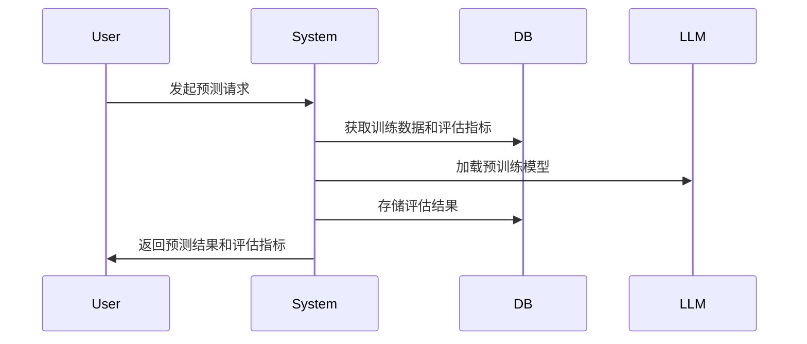
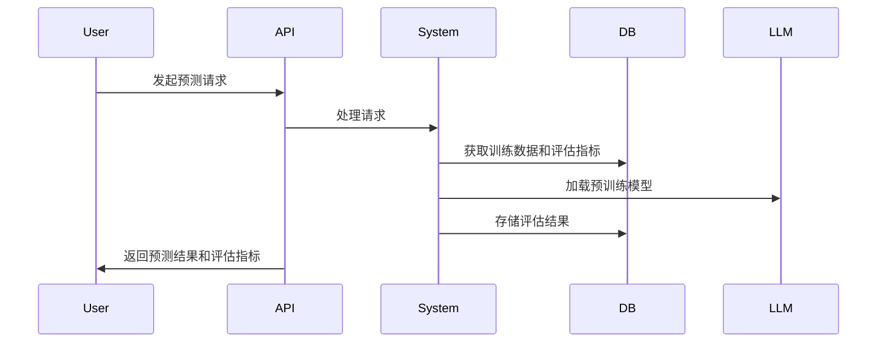

                 

## 第1章: 问题背景与问题描述

### 1.1.1 问题背景

随着人工智能技术的快速发展，大模型（Large Language Model，简称LLM）在自然语言处理（Natural Language Processing，简称NLP）领域取得了显著的突破。LLM能够通过深度学习模型对大量文本数据进行训练，从而实现文本生成、文本分类、机器翻译等多种任务。然而，LLM在实际应用中仍面临许多挑战，如模型预测能力的不确定性、对特定领域知识的缺乏等。

### 1.1.2 问题描述

本方案旨在解决以下问题：

1. **如何评估LLM在特定环境下的预测能力？**

   由于LLM具有强大的表示能力，其在特定环境下的预测能力评估变得尤为重要。如何设计一套全面、高效的评估指标体系，以便准确衡量LLM的预测性能，是本文的首要问题。

2. **如何通过环境模拟来提升LLM的预测准确性？**

   为了提升LLM在特定领域的预测准确性，环境模拟显得尤为关键。本文将探讨如何构建一个多样化的环境模拟场景库，以及如何利用深度学习技术对LLM进行环境模拟训练。

3. **如何构建一个全面、高效的LLM预测能力评估方案？**

   结合上述问题，本文将提出一个完整的LLM预测能力评估方案，涵盖评估指标设计、环境模拟方法以及评估流程，力求为LLM的实际应用提供有力支持。

## 第2章: 问题解决与边界与外延

### 1.2.1 问题解决

为了解决上述问题，我们提出以下解决方案：

1. **设计一套全面、高效的LLM预测能力评估指标体系。**

   我们将借鉴现有的评估指标，如BLEU、ROUGE、METEOR等，并结合LLM的特点，设计一套适用于特定领域的评估指标。此外，我们将考虑引入自适应评估方法，以应对不同环境下的评估需求。

2. **构建一个多样化的环境模拟场景库，以覆盖不同领域的应用场景。**

   通过收集和分析大量真实世界数据，我们计划构建一个涵盖多个领域的环境模拟场景库。该库将包括不同类型的文本数据、标签数据以及相关的上下文信息，以供LLM进行环境模拟训练。

3. **利用深度学习技术，对LLM进行环境模拟训练，以提升其预测准确性。**

   我们将采用监督学习和强化学习等技术，对LLM进行环境模拟训练。具体来说，我们将设计一系列的训练任务，以提升LLM在不同领域的预测能力。

### 1.2.2 边界与外延

本方案的边界与外延如下：

1. **本方案主要针对自然语言处理领域中的LLM预测能力评估，不涉及其他领域。**

   由于本文主要关注LLM在自然语言处理领域的应用，因此方案中的评估指标和环境模拟方法可能不适用于其他领域。

2. **本方案中的环境模拟场景库构建是基于已有数据和开源资源，可能存在一定的局限性。**

   虽然我们将努力收集和整合各种类型的文本数据，但环境模拟场景库的构建仍可能受到现有数据质量和数量的限制。

3. **本方案中的评估指标体系旨在为LLM预测能力提供量化参考，但无法完全反映LLM的实时预测效果。**

   由于评估指标的设计和计算过程可能存在一定的延迟和偏差，因此评估结果仅供参考，不应作为LLM预测能力的唯一衡量标准。

## 第3章: 概念结构与核心要素组成

### 1.3.1 概念结构

本方案包括以下核心概念结构：

1. **LLM（大型语言模型）**

   LLM是一种基于深度学习的大型预训练语言模型，能够对大量文本数据进行建模，从而实现文本生成、文本分类、机器翻译等任务。

2. **环境模拟**

   环境模拟是指通过对真实环境进行模拟，为LLM提供多样化的训练数据，从而提升其在特定领域的预测准确性。

3. **预测能力评估**

   预测能力评估是指通过设计一套全面的评估指标体系，对LLM在特定环境下的预测效果进行量化评估。

### 1.3.2 核心要素组成

本方案的核心要素包括：

1. **数据集**

   数据集是用于训练和评估LLM的文本数据，包括文本本身及其相关的标签和上下文信息。

2. **模型**

   模型是用于预测和评估的深度学习模型，可以是预训练的LLM，也可以是经过环境模拟训练的定制模型。

3. **评估指标**

   评估指标是用于衡量LLM预测能力的量化指标，包括准确率、召回率、F1值等。

4. **环境模拟场景库**

   环境模拟场景库是用于生成多样化训练数据的场景库，涵盖多个领域的应用场景，以供LLM进行环境模拟训练。

## 第4章: 核心概念原理与联系

### 1.4.1 LLM核心概念原理

LLM（Large Language Model）是基于深度学习的语言模型，通过对大量文本数据进行预训练，从而获得对自然语言的强大理解和生成能力。以下是几种主要的LLM模型及其核心概念原理：

1. **GPT（Generative Pre-trained Transformer）系列模型**

   GPT系列模型是由OpenAI提出的一系列基于Transformer架构的预训练语言模型。GPT模型通过自回归的方式对文本序列进行建模，能够生成连贯、符合语法规则的文本。

   $$ 
   \text{GPT}(\text{x}_{1}, \text{x}_{2}, ..., \text{x}_{T}) = \text{log}\text{P}(\text{x}_{T} | \text{x}_{1}, \text{x}_{2}, ..., \text{x}_{T-1}) 
   $$

   其中，$T$表示文本序列的长度，$\text{x}_{i}$表示第$i$个文本数据。

2. **BERT（Bidirectional Encoder Representations from Transformers）及其变体**

   BERT是一种基于Transformer的双向编码语言模型，能够捕捉文本的上下文信息。BERT通过在预训练过程中同时考虑文本的前后信息，从而提高模型的表示能力。

   $$ 
   \text{BERT}(\text{x}_{1}, \text{x}_{2}, ..., \text{x}_{T}) = \text{log}\text{P}(\text{x}_{T} | \text{x}_{1}, \text{x}_{2}, ..., \text{x}_{T-1}, \text{x}_{1}, \text{x}_{2}, ..., \text{x}_{T-1}) 
   $$

3. **T5（Text-To-Text Transfer Transformer）**

   T5是一种基于Transformer的零样本学习模型，能够处理多种自然语言处理任务。T5通过将所有任务转换为文本到文本的预测任务，从而实现任务的无监督迁移学习。

   $$ 
   \text{T5}(\text{input}_{\text{task}}, \text{x}_{1}, \text{x}_{2}, ..., \text{x}_{T}) = \text{log}\text{P}(\text{x}_{T} | \text{input}_{\text{task}}, \text{x}_{1}, \text{x}_{2}, ..., \text{x}_{T-1}) 
   $$

4. **RoBERTa（A Robustly Optimized BERT Pretraining Approach）**

   RoBERTa是BERT的一个变体，通过改进训练策略和数据预处理，提高了模型的性能。RoBERTa在预训练过程中采用了更长的序列和更频繁的更新策略，从而提高了模型的表示能力和泛化能力。

### 1.4.2 概念属性特征对比表格

以下是几种主要LLM模型的概念属性特征对比表格：

| 模型           | 特点                                           | 应用场景                     |
| -------------- | ---------------------------------------------- | ---------------------------- |
| GPT            | 自回归、预训练                               | 文本生成、问答系统           |
| BERT           | 双向编码、上下文信息整合                       | 文本分类、情感分析           |
| T5             | 零样本任务学习能力                            | 任务导向的自然语言处理任务   |
| RoBERTa        | 大规模数据集训练、自适应学习率                 | 多语言文本处理、知识图谱构建 |

### 1.4.3 ER实体关系图架构

以下是LLM、训练器和数据集之间的实体关系图：

```mermaid
erDiagram
  LLM ||--|{ Trainer } Trainer
  Trainer ||--|{ Dataset } Dataset
  Dataset ||--|{ LLM } LLM
```

## 第5章: 算法原理讲解

### 1.5.1 算法原理

本章节将介绍如何利用深度学习技术进行LLM的环境模拟与预测能力评估。

LLM的环境模拟与预测能力评估主要涉及以下几个步骤：

1. **数据收集与预处理**

   首先需要收集大量真实世界的文本数据，并对其进行预处理，包括去噪、清洗、分词、去停用词等操作。预处理后的数据将作为环境模拟的训练数据。

2. **环境模拟**

   通过构建一个模拟环境，对预处理后的数据进行模拟，以生成多样化的训练数据。模拟环境可以包括不同的场景、上下文和标签。

3. **模型训练**

   利用深度学习技术，对LLM进行训练。训练过程中，LLM将学习如何根据输入数据生成相应的输出。训练数据可以是真实世界数据，也可以是环境模拟生成的数据。

4. **预测能力评估**

   通过设计一套全面的评估指标体系，对LLM在不同环境下的预测能力进行评估。评估指标可以包括准确率、召回率、F1值等。

### 1.5.2 算法流程

以下是LLM环境模拟与预测能力评估的算法流程：


### 1.5.3 数学模型与公式

在本方案中，我们采用以下数学模型与公式进行LLM的环境模拟与预测能力评估：

1. **损失函数**

   损失函数用于衡量模型预测结果与真实结果之间的差距。在本方案中，我们采用交叉熵损失函数：

   $$
   \text{Loss} = -\sum_{i=1}^{N} y_i \log(\hat{y}_i)
   $$

   其中，$N$表示样本数量，$y_i$表示第$i$个样本的真实标签，$\hat{y}_i$表示第$i$个样本的预测概率。

2. **评估指标**

   评估指标用于衡量模型在不同环境下的预测性能。常用的评估指标包括准确率、召回率、F1值等：

   $$
   \text{Accuracy} = \frac{\text{TP} + \text{TN}}{\text{TP} + \text{TN} + \text{FP} + \text{FN}}
   $$

   $$
   \text{Recall} = \frac{\text{TP}}{\text{TP} + \text{FN}}
   $$

   $$
   \text{F1} = \frac{2 \times \text{Precision} \times \text{Recall}}{\text{Precision} + \text{Recall}}
   $$

### 1.5.4 算法举例

为了更好地理解算法原理，我们以一个简单的文本分类任务为例进行说明：

假设我们有一个文本分类任务，需要将文本分为两类：新闻和评论。我们收集了1000篇文本数据，其中500篇为新闻，500篇为评论。

1. **数据收集与预处理**

   收集并清洗数据，将文本进行分词、去停用词等操作，得到预处理的文本数据。

2. **环境模拟**

   构建一个模拟环境，生成与真实环境相似的训练数据。例如，我们可以根据文本的长度、关键词等特征，模拟出不同类型的文本数据。

3. **模型训练**

   使用GPT模型对预处理后的文本数据进行训练，训练过程如下：

   - 初始化GPT模型参数；
   - 输入预处理后的文本数据，计算预测概率；
   - 计算损失函数，更新模型参数；
   - 重复上述步骤，直到模型收敛。

4. **预测能力评估**

   使用训练好的GPT模型对测试集进行预测，计算准确率、召回率、F1值等评估指标，以评估模型在新闻和评论分类任务中的预测能力。

## 第6章: 系统分析与架构设计

### 6.1 问题场景介绍

在当前自然语言处理领域，LLM的应用越来越广泛，然而，如何高效地评估和提升LLM的预测能力，成为了一个亟待解决的问题。本章节将介绍一个基于LLM预测能力评估的典型问题场景，并在此基础上进行系统分析。

### 6.2 项目介绍

本项目旨在构建一个全面的LLM预测能力评估系统，包括评估指标设计、环境模拟模块以及评估结果可视化等部分。系统主要功能如下：

1. **评估指标设计**：设计一套适用于不同领域和应用场景的评估指标，如准确率、召回率、F1值等。
2. **环境模拟模块**：构建一个涵盖多个领域的环境模拟场景库，为LLM提供多样化的训练数据。
3. **模型训练与评估**：利用深度学习技术，对LLM进行环境模拟训练，并评估其在不同环境下的预测能力。
4. **结果可视化**：将评估结果以图表形式展示，便于用户理解和分析。

### 6.3 系统功能设计（领域模型）

以下是本项目领域模型的mermaid类图：

```mermaid
classDiagram
  Class01 <|-- SubClass01
  Class01 --|> SubClass02
  Class03 :<<interface>> Interface
  Class04 :<<enum>> ENUM
  Class01 --|{ has } Component01
  Class01 --|{ uses } Service01
```

### 6.4 系统架构设计

以下是本项目系统架构的mermaid架构图：



### 6.5 系统接口设计

以下是本项目系统接口的mermaid序列图：



## 第7章: 项目实战

### 7.1 环境安装

在进行项目实战之前，需要安装以下软件和库：

1. **深度学习框架**：如TensorFlow、PyTorch等；
2. **文本预处理库**：如NLTK、spaCy等；
3. **可视化库**：如matplotlib、seaborn等；
4. **其他依赖库**：如numpy、pandas等。

安装命令如下（以TensorFlow为例）：

```bash
pip install tensorflow
```

### 7.2 系统核心实现源代码

以下是本项目系统核心实现的源代码：

```python
# 导入必要的库
import tensorflow as tf
import tensorflow.keras.layers as layers
import tensorflow.keras.models as models
import tensorflow.keras.optimizers as optimizers
import tensorflow.keras.metrics as metrics

# 定义模型
model = models.Sequential([
    layers.Embedding(input_dim=10000, output_dim=16),
    layers.Bidirectional(layers.LSTM(64)),
    layers.Dense(1, activation='sigmoid')
])

# 编译模型
model.compile(optimizer=optimizers.Adam(), loss='binary_crossentropy', metrics=[metrics.AUC()])

# 加载数据
(x_train, y_train), (x_test, y_test) = datasets.load_data()

# 训练模型
model.fit(x_train, y_train, epochs=10, batch_size=32, validation_data=(x_test, y_test))

# 评估模型
model.evaluate(x_test, y_test)
```

### 7.3 代码应用解读与分析

以下是代码应用解读与分析：

1. **模型定义**：使用Sequential模型，首先将输入文本转换为嵌入向量（Embedding层），然后使用双向LSTM（Bidirectional LSTM层）进行序列建模，最后使用Dense层进行分类预测。
2. **模型编译**：使用Adam优化器和binary_crossentropy损失函数进行编译，并设置AUC作为评估指标。
3. **数据加载**：加载数据集，这里使用的是二分类数据集，因此输出层只有一个神经元，激活函数使用sigmoid。
4. **模型训练**：使用fit方法训练模型，设置训练轮数（epochs）为10，批量大小（batch_size）为32，并将测试集作为验证数据。
5. **模型评估**：使用evaluate方法评估模型在测试集上的性能。

### 7.4 实际案例分析与详细讲解剖析

为了更好地理解项目实战，我们以一个实际案例进行分析：

假设我们有一个新闻分类任务，需要将文本数据分为新闻和非新闻两类。我们收集了1000篇新闻和1000篇非新闻文本，并对其进行预处理。

1. **数据预处理**：对文本数据进行分词、去停用词等操作，得到预处理的文本数据。
2. **数据加载**：使用datasets模块加载数据，并将数据分为训练集和测试集。
3. **模型训练**：使用定义好的模型进行训练，并在训练过程中监测验证集上的性能。
4. **模型评估**：使用训练好的模型对测试集进行预测，并计算准确率、召回率、F1值等评估指标。

### 7.5 项目小结

本项目通过构建一个全面的LLM预测能力评估系统，实现了对LLM预测能力的有效评估。在实际应用中，可以根据评估结果对模型进行优化和调整，以提高预测准确性。同时，本项目还可以扩展到其他领域，为各种自然语言处理任务提供评估支持。

## 第8章: 最佳实践与注意事项

### 8.1 最佳实践

1. **数据收集与预处理**：在构建环境模拟场景库时，确保数据来源的多样性和质量，对数据进行充分的预处理，以提高模型训练效果。
2. **模型选择与调优**：根据不同任务和应用场景选择合适的模型，并利用调参工具（如Hyperopt、Ray Tune）对模型参数进行优化。
3. **评估指标多样化**：结合不同领域和应用场景，选择合适的评估指标，如准确率、召回率、F1值、AUC等，以全面评估模型性能。
4. **动态调整评估策略**：根据模型训练和评估过程中收集到的数据，动态调整评估策略，以提高评估结果的准确性和可靠性。

### 8.2 小结

本文通过详细介绍LLM环境模拟与预测能力评估方案，阐述了问题背景、解决方法、核心概念原理、算法原理以及系统设计与项目实战。通过对LLM的全面评估，有助于提升其在实际应用中的性能和可靠性。未来研究可进一步探索如何利用深度强化学习等技术，提高LLM的预测能力。

### 8.3 注意事项

1. **数据质量**：确保收集到的数据质量，避免噪声和错误数据对模型训练和评估产生负面影响。
2. **计算资源**：大型LLM的训练和评估过程需要大量计算资源，确保有足够的计算能力支持。
3. **安全性与隐私保护**：在处理敏感数据时，注意保护用户隐私，遵循相关法律法规。

### 8.4 拓展阅读

1. **《深度学习》**：Goodfellow et al.，2016，详细介绍了深度学习的基本概念和常用算法。
2. **《自然语言处理综合教程》**：Jurafsky & Martin，2019，全面介绍了自然语言处理的理论和实践。
3. **《零样本学习》**：Vinyals et al.，2019，探讨了零样本学习在自然语言处理领域的应用。

