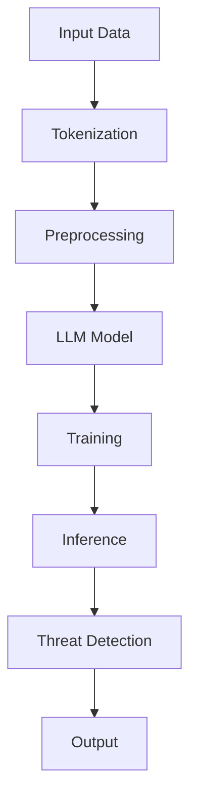

                 

### 文章标题

# LLM网络安全威胁检测能力评估

> 关键词：语言模型，网络安全，威胁检测，算法原理，系统架构

> 摘要：本文探讨了大型语言模型（LLM）在网络安全威胁检测领域的应用，分析了其检测能力，详细介绍了LLM的基本原理、算法实现、系统架构，并通过实际项目案例展示了其在威胁检测中的有效性和局限性。

### 目录大纲设计思路

在设计《LLM网络安全威胁检测能力评估》的目录大纲时，我们遵循了以下思路：

1. **背景介绍**：首先，介绍LLM在网络安全威胁检测领域的背景，以及为什么这一主题值得关注。
2. **核心概念与联系**：明确书中的核心概念，并使用表格和实体关系图（ER图）展示它们之间的关系。
3. **算法原理讲解**：详细讲解LLM算法的基本原理，包括其数学模型和公式。同时，使用mermaid流程图辅助说明。
4. **数学模型和数学公式**：使用LaTeX格式嵌入文中，确保公式的准确性。
5. **系统分析与架构设计**：介绍一个典型的LLM网络安全威胁检测系统的架构，使用mermaid类图、架构图和序列图进行展示。
6. **项目实战**：展示一个实际的LLM网络安全威胁检测项目，包括环境安装、系统核心实现和代码分析。
7. **最佳实践与总结**：提供一些最佳实践建议，并对全书进行小结。

### 目录大纲

**第一部分：背景与概念**

# 第1章: LLM网络安全威胁检测的背景与重要性

## 1.1 网络安全威胁的现状
### 1.1.1 网络安全威胁的演变
### 1.1.2 网络安全威胁的影响

## 1.2 LLM的发展及其在网络安全中的应用
### 1.2.1 LLM的定义与特性
### 1.2.2 LLM在网络安全检测中的优势

## 1.3 LLM网络安全威胁检测的研究现状与挑战
### 1.3.1 LLM在网络安全检测中的应用案例
### 1.3.2 LLM在网络安全检测中的挑战

**第二部分：核心概念与原理**

# 第2章: LLM网络安全威胁检测的核心概念

## 2.1 LLM的基本原理
### 2.1.1 语言模型的数学基础
### 2.1.2 Transformer模型与BERT模型
### 2.1.3 LLM的训练与优化

## 2.2 网络安全威胁检测的基本概念
### 2.2.1 威胁检测的分类
### 2.2.2 网络安全威胁的属性与特征

## 2.3 LLM在网络安全威胁检测中的应用
### 2.3.1 LLM的威胁检测流程
### 2.3.2 LLM的威胁检测效果评估

## 2.4 核心概念对比表格
| 概念             | 定义                                                         | 关系 |
|------------------|--------------------------------------------------------------|------|
| LLM              | 大型语言模型                                                 | -   |
| 网络安全威胁检测 | 使用技术手段识别网络中的潜在威胁                             | -   |
| Transformer模型  | 一种基于自注意力机制的神经网络架构，用于处理序列数据         | **-** |
| BERT模型         | 一种基于Transformer的预训练语言表示模型                       | **-** |

**第三部分：算法原理讲解**

# 第3章: LLM网络安全威胁检测算法原理

## 3.1 Transformer模型详解
### 3.1.1 自注意力机制
$$
\text{Attention}(Q, K, V) = \text{softmax}\left(\frac{QK^T}{\sqrt{d_k}}\right)V
$$
### 3.1.2 Encoder与Decoder结构
### 3.1.3 Transformer模型在威胁检测中的应用

## 3.2 BERT模型详解
### 3.2.1 预训练与微调
### 3.2.2 BERT的架构
### 3.2.3 BERT在威胁检测中的实现

## 3.3 LLM算法原理mermaid流程图

**第四部分：系统分析与架构设计**

# 第4章: LLM网络安全威胁检测系统分析与架构设计

## 4.1 问题场景介绍
### 4.1.1 网络安全威胁检测的挑战
### 4.1.2 LLM在解决这些挑战中的优势

## 4.2 项目介绍
### 4.2.1 项目背景
### 4.2.2 项目目标

## 4.3 系统功能设计
### 4.3.1 功能需求
### 4.3.2 领域模型mermaid类图

## 4.4 系统架构设计
### 4.4.1 系统架构
### 4.4.2 mermaid架构图

## 4.5 系统接口设计
### 4.5.1 系统接口规范
### 4.5.2 系统交互mermaid序列图

## 4.6 系统实现与代码分析
### 4.6.1 环境安装与配置
### 4.6.2 系统核心实现
### 4.6.3 代码分析

**第五部分：项目实战**

# 第5章: LLM网络安全威胁检测项目实战

## 5.1 实际案例分析与详细讲解
### 5.1.1 案例背景
### 5.1.2 案例分析
### 5.1.3 案例处理流程

## 5.2 项目小结
### 5.2.1 项目总结
### 5.2.2 项目经验与教训

**第六部分：最佳实践与总结**

# 第6章: LLM网络安全威胁检测最佳实践与总结

## 6.1 最佳实践
### 6.1.1 参数调优
### 6.1.2 数据预处理
### 6.1.3 模型优化

## 6.2 小结
### 6.2.1 LLM在网络安全威胁检测中的应用前景
### 6.2.2 挑战与展望
### 6.2.3 注意事项

## 6.3 拓展阅读
### 6.3.1 相关论文
### 6.3.2 开源代码与工具

### 结尾

> 作者：AI天才研究院/AI Genius Institute & 禅与计算机程序设计艺术 /Zen And The Art of Computer Programming

---

### 第一部分：背景与概念

#### 第1章: LLM网络安全威胁检测的背景与重要性

##### 1.1 网络安全威胁的现状

网络安全威胁是一个日益严重的问题，随着网络技术的不断发展和普及，网络安全威胁的形式和手段也在不断演变。从传统的病毒、木马到更复杂的网络攻击，如DDoS攻击、数据泄露、网络钓鱼等，网络安全威胁的种类和复杂性不断增加。

- **网络安全威胁的演变**：早期的网络安全威胁主要是以恶意软件为主，这些恶意软件通过感染计算机系统来窃取信息、破坏系统。随着网络技术的发展，网络安全威胁开始向网络层面蔓延，如DDoS攻击，通过对目标网络的持续攻击，导致网络瘫痪。同时，网络钓鱼攻击、数据泄露等新型威胁也不断涌现，对网络安全构成了严重的威胁。
- **网络安全威胁的影响**：网络安全威胁不仅会对企业造成财务损失，还会对用户的隐私和信息安全造成威胁。例如，数据泄露可能导致用户的个人信息被泄露，从而被不法分子利用进行欺诈活动。网络钓鱼攻击则可能导致用户陷入骗局，损失大量的金钱。

##### 1.2 LLM的发展及其在网络安全中的应用

大型语言模型（LLM）是一种基于深度学习的语言处理模型，其具有强大的文本生成和理解能力。随着LLM技术的不断发展，其在网络安全领域也展现出了巨大的潜力。

- **LLM的定义与特性**：LLM是一种基于神经网络的语言模型，其通过对大量文本数据的学习，能够生成与输入文本相关的新文本。LLM具有如下特性：首先，LLM具有强大的文本生成能力，能够生成高质量的自然语言文本；其次，LLM具有强大的文本理解能力，能够理解文本的语义和逻辑关系。
- **LLM在网络安全检测中的优势**：LLM在网络安全检测中的优势主要体现在以下几个方面：首先，LLM能够通过学习大量的网络安全数据，识别出潜在的威胁；其次，LLM能够自动生成威胁检测报告，提高检测效率；最后，LLM具有自适应能力，能够根据新的威胁模式进行调整，提高检测的准确性。

##### 1.3 LLM网络安全威胁检测的研究现状与挑战

尽管LLM在网络安全威胁检测中具有巨大的潜力，但目前的研究和应用仍面临一些挑战。

- **LLM在网络安全检测中的应用案例**：目前，LLM在网络安全检测中的应用案例主要包括：网络入侵检测、恶意软件检测、钓鱼邮件检测等。例如，谷歌的BERT模型被用于恶意软件检测，通过对恶意软件的代码进行分析，能够识别出潜在的威胁。此外，LLM还被用于钓鱼邮件检测，通过对邮件内容进行分析，能够识别出钓鱼邮件。
- **LLM在网络安全检测中的挑战**：LLM在网络安全检测中面临的挑战主要包括：首先，LLM的训练数据量大，需要大量的计算资源和时间；其次，LLM的模型复杂度高，需要高水平的编程技能和专业知识；最后，LLM的检测效果受到数据质量和模型参数的影响，需要不断优化。

#### 第2章: LLM网络安全威胁检测的核心概念

##### 2.1 LLM的基本原理

大型语言模型（LLM）是一种基于深度学习的语言处理模型，其通过学习大量的文本数据，能够生成与输入文本相关的新文本。LLM的基本原理包括以下几个方面：

- **语言模型的数学基础**：语言模型是基于概率论的，其通过计算输入文本的概率来生成输出文本。在语言模型中，常用的概率计算方法包括N-gram模型和神经网络模型。
- **Transformer模型与BERT模型**：Transformer模型和BERT模型是目前应用最广泛的LLM模型。Transformer模型是一种基于自注意力机制的神经网络模型，其能够有效地处理序列数据。BERT模型是一种基于Transformer的预训练语言表示模型，其通过预训练和微调，能够生成高质量的自然语言文本。
- **LLM的训练与优化**：LLM的训练过程包括数据预处理、模型训练和模型优化。在数据预处理阶段，需要对文本数据进行分词、去噪等处理；在模型训练阶段，需要通过反向传播算法来优化模型的参数；在模型优化阶段，需要通过调整模型参数来提高模型的性能。

##### 2.2 网络安全威胁检测的基本概念

网络安全威胁检测是指通过技术手段识别网络中的潜在威胁，其基本概念包括以下几个方面：

- **威胁检测的分类**：威胁检测可以分为静态威胁检测和动态威胁检测。静态威胁检测主要针对静态的恶意代码和恶意文件，如病毒扫描、恶意软件检测等；动态威胁检测主要针对动态的网络行为，如入侵检测、网络流量分析等。
- **网络安全威胁的属性与特征**：网络安全威胁具有以下属性和特征：首先，网络安全威胁具有隐蔽性，难以被直接察觉；其次，网络安全威胁具有破坏性，可能对网络系统和用户数据造成严重损失；最后，网络安全威胁具有变异性，其攻击手段和方式不断变化，难以被彻底防范。

##### 2.3 LLM在网络安全威胁检测中的应用

LLM在网络安全威胁检测中的应用主要包括以下几个方面：

- **LLM的威胁检测流程**：LLM的威胁检测流程包括数据收集、数据预处理、模型训练、模型评估和模型部署。在数据收集阶段，需要收集大量的网络安全数据；在数据预处理阶段，需要对数据进行清洗、去噪等处理；在模型训练阶段，需要通过反向传播算法来优化模型的参数；在模型评估阶段，需要通过交叉验证来评估模型的性能；在模型部署阶段，需要将模型部署到实际环境中进行威胁检测。
- **LLM的威胁检测效果评估**：LLM的威胁检测效果评估主要包括检测精度、检测速度和检测覆盖率等方面。检测精度是指模型能够正确识别威胁的概率；检测速度是指模型检测一份数据所需的时间；检测覆盖率是指模型能够检测到的威胁种类和数量的比例。

##### 2.4 核心概念对比表格

| 概念             | 定义                                                         | 关系 |
|------------------|--------------------------------------------------------------|------|
| LLM              | 大型语言模型                                                 | -   |
| 网络安全威胁检测 | 使用技术手段识别网络中的潜在威胁                             | -   |
| Transformer模型  | 一种基于自注意力机制的神经网络架构，用于处理序列数据         | **-** |
| BERT模型         | 一种基于Transformer的预训练语言表示模型                       | **-** |

通过以上核心概念的介绍，我们可以更好地理解LLM在网络安全威胁检测中的作用和原理。接下来，我们将进一步深入探讨LLM的算法原理，以便更好地理解其在网络安全威胁检测中的应用。

