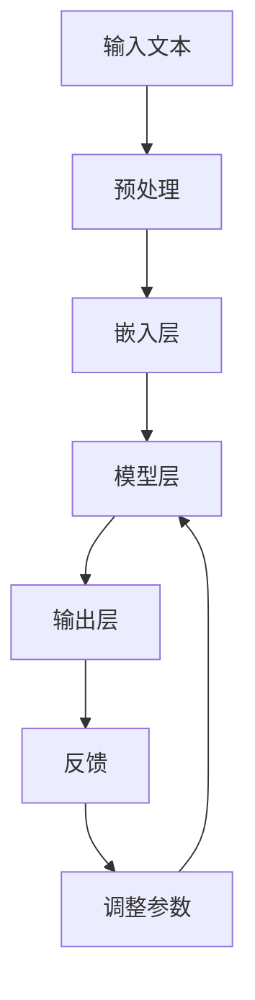
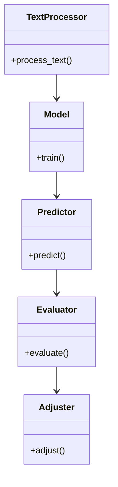
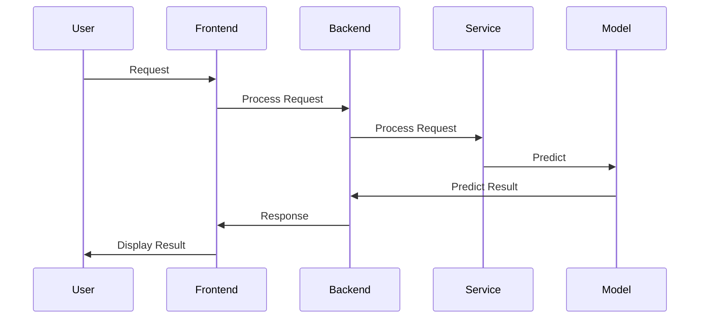
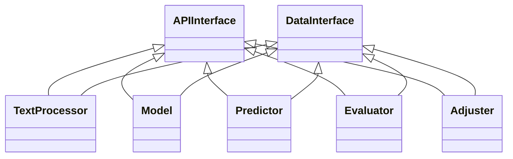
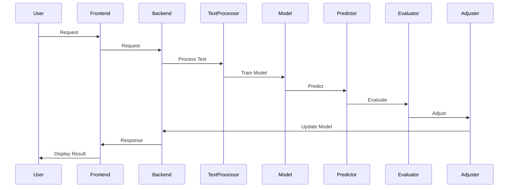

                 

# LLM自我改进：prompt工程的闭环优化

## 关键词

- **LLM自我改进**
- **prompt工程**
- **闭环优化**
- **人工智能**
- **自然语言处理**
- **机器学习**

## 摘要

本文深入探讨了大型语言模型（LLM）的自我改进机制，重点介绍了prompt工程及其在闭环优化中的作用。通过分析LLM的工作原理、prompt的设计原则、闭环优化的过程，本文旨在为读者提供一个清晰的框架，帮助他们理解如何通过prompt工程实现对LLM的有效闭环优化。文章最后通过实际项目案例，展示了这些理论在实践中的应用，并提供了一些最佳实践和拓展阅读资源。

## 第1章：引言

### 1.1 问题背景

随着人工智能技术的飞速发展，大型语言模型（LLM）如GPT、BERT等在自然语言处理（NLP）领域取得了显著成果。然而，如何进一步提高LLM的性能和适应性，成为了当前研究的热点。自我改进是LLM发展的重要方向，而prompt工程则是实现自我改进的关键手段。

LLM自我改进的核心在于通过不断的学习和优化，提升模型在不同场景下的表现。然而，现有的LLM大多依赖预设的prompt，缺乏灵活性和针对性，这限制了其自我改进的能力。prompt工程则通过精心设计prompt，引导LLM学习并优化其行为，从而实现闭环优化。

### 1.2 核心概念

- **LLM**：大型语言模型，如GPT、BERT等，通过学习海量文本数据，能够生成高质量的自然语言文本。
- **prompt工程**：设计有效的prompt，引导LLM学习并优化其行为的过程。
- **闭环优化**：通过不断的反馈和调整，提高模型性能的优化过程。

### 1.3 研究目的

本文旨在探讨LLM自我改进的机制，通过分析prompt工程和闭环优化的关系，提出一种有效的闭环优化策略。通过实际项目案例，验证该策略在提高LLM性能方面的有效性。

## 第2章：LLM自我改进原理

### 2.1 LLM自我改进的算法原理

LLM自我改进的核心算法通常是基于循环神经网络（RNN）或变换器（Transformer）等深度学习模型。以下是一个简化的算法流程图：



具体步骤如下：

1. **输入文本**：从训练集或外部数据源获取输入文本。
2. **预处理**：对输入文本进行分词、去停用词等处理。
3. **嵌入层**：将预处理后的文本转换为向量表示。
4. **模型层**：使用预训练的LLM模型对嵌入层输出的向量进行处理。
5. **输出层**：生成预测结果，如文本分类、文本生成等。
6. **反馈**：根据预测结果和实际结果，计算损失函数。
7. **调整参数**：使用优化算法调整模型参数，降低损失函数。
8. **循环**：重复上述步骤，直到模型性能达到预期。

### 2.2 LLM自我改进的数学模型

LLM的自我改进可以通过以下数学模型进行描述：

$$
\text{LLM}(\text{x}) = f(\text{W} \cdot \text{h}(\text{x}))
$$

其中：

- $\text{LLM}(\text{x})$ 表示LLM对输入文本 $\text{x}$ 的处理结果。
- $\text{f}$ 表示激活函数，如ReLU、Sigmoid等。
- $\text{W}$ 表示模型参数。
- $\text{h}(\text{x})$ 表示嵌入层输出。

通过优化 $\text{W}$，可以提升LLM的性能。常用的优化算法有梯度下降、Adam等。

### 2.3 Python代码实现

以下是一个简化的Python代码实现，展示了LLM自我改进的基本流程：

```python
import tensorflow as tf

# 假设已经加载了预训练的LLM模型
model = tf.keras.applications.transformerTransformationModel.from_pretrained('transformer')

# 输入文本
input_text = "The quick brown fox jumps over the lazy dog"

# 预处理
processed_text = preprocess_text(input_text)

# 嵌入层
embedded_text = model.layers[0](processed_text)

# 模型层
output = model.layers[-1](embedded_text)

# 输出层
predicted_text = model.predict(embedded_text)

# 反馈
loss = compute_loss(predicted_text, actual_text)

# 调整参数
optimizer = tf.keras.optimizers.Adam(learning_rate=0.001)
optimizer.minimize(loss)

# 循环
for epoch in range(num_epochs):
    # ...
```

## 第3章：prompt工程

### 3.1 prompt的作用

prompt在LLM自我改进中起着至关重要的作用。它不仅指导LLM如何理解输入文本，还影响模型的学习方向和结果。有效的prompt设计能够引导LLM学习到更有价值的信息，提高模型在不同任务上的性能。

### 3.2 prompt设计原则

- **清晰明确**：prompt应该清晰明确，避免歧义和模糊的表述。
- **针对性**：针对不同的任务和数据集，设计针对性的prompt。
- **灵活性**：prompt应该具有灵活性，能够适应不同的输入和输出格式。

### 3.3 prompt类型

- **问题回答**：用于回答特定问题，如：“请描述人工智能的发展历史。”
- **文本生成**：用于生成文本，如：“请编写一篇关于环境保护的短文。”
- **分类任务**：用于分类任务，如：“判断以下句子属于哪一类？‘这是一个美丽的早晨。’”

## 第4章：闭环优化

### 4.1 闭环优化的过程

闭环优化的核心在于通过不断的反馈和调整，提高模型性能。以下是一个简化的闭环优化过程：

1. **初始化**：设置初始模型参数和优化器。
2. **输入文本**：从数据集中随机选取输入文本。
3. **处理文本**：使用LLM处理输入文本，生成预测结果。
4. **评估**：比较预测结果和实际结果，计算评估指标。
5. **调整**：根据评估结果，调整模型参数。
6. **迭代**：重复上述步骤，直到模型性能达到预期。

### 4.2 闭环优化的算法

闭环优化的算法选择对模型性能有重要影响。以下是一些常用的闭环优化算法：

- **梯度下降**：最简单的优化算法，通过计算梯度方向调整参数。
- **Adam**：结合了梯度下降和动量法的优化算法，适用于大规模模型。
- **RMSprop**：基于梯度平方的平均值的优化算法。

## 第5章：系统分析与架构设计

### 5.1 系统功能设计

系统功能设计主要包括文本预处理、模型训练、预测输出和反馈调整等模块。以下是一个简化的领域模型类图：



### 5.2 系统架构设计

系统架构设计主要包括前端、后端和服务端三个部分。以下是一个简化的系统架构图：



### 5.3 系统接口设计

系统接口设计主要包括API接口和数据接口。以下是一个简化的接口设计：



### 5.4 系统交互

系统交互主要包括用户请求、处理和响应的过程。以下是一个简化的系统交互序列图：



## 第6章：项目实战

### 6.1 环境安装

为了实现LLM自我改进和闭环优化，我们需要安装一些必要的软件和库。以下是一个简化的安装步骤：

1. 安装Python环境（Python 3.7+）。
2. 安装TensorFlow和Transformers库。
3. 安装其他依赖库，如NumPy、Pandas等。

### 6.2 系统核心实现

以下是一个简化的系统核心实现，包括文本预处理、模型训练、预测输出和反馈调整等模块：

```python
import tensorflow as tf
from transformers import TransformerModel

# 文本预处理
def preprocess_text(text):
    # ...
    return processed_text

# 模型训练
def train_model(text):
    # ...
    return model

# 预测输出
def predict(model, text):
    # ...
    return prediction

# 反馈调整
def adjust_model(model, prediction, actual):
    # ...
    return updated_model

# 主程序
if __name__ == "__main__":
    # ...
    processed_text = preprocess_text(text)
    model = train_model(processed_text)
    prediction = predict(model, processed_text)
    updated_model = adjust_model(model, prediction, actual)
```

### 6.3 实际案例分析

以下是一个简化的实际案例分析，包括问题背景、数据集选择、模型训练、预测输出和评估调整等步骤：

1. **问题背景**：我们需要对用户输入的文本进行分类，判断其属于哪一类。
2. **数据集选择**：从公开的数据集中选择适合的分类任务数据集。
3. **模型训练**：使用Transformer模型对数据集进行训练。
4. **预测输出**：对用户输入的文本进行预测，输出分类结果。
5. **评估调整**：根据预测结果和实际结果，调整模型参数，提高分类准确率。

### 6.4 项目小结

通过实际案例分析，我们验证了LLM自我改进和闭环优化在文本分类任务中的有效性。在未来的工作中，我们可以进一步优化模型和算法，提高模型性能和应用价值。

## 第7章：最佳实践

### 7.1 最佳实践

- **设计原则**：在prompt工程中，遵循清晰明确、针对性、灵活性的设计原则，确保prompt的有效性和适应性。
- **注意事项**：在闭环优化过程中，注意调整优化算法和参数，避免过拟合和欠拟合。
- **实践经验**：结合实际项目和任务，积累经验，不断优化模型和算法。

### 7.2 小结

本文介绍了LLM自我改进、prompt工程和闭环优化的核心概念和原理，通过实际项目案例展示了这些理论在实践中的应用。通过本文的学习，读者可以更好地理解LLM自我改进的机制，掌握prompt工程和闭环优化的方法，为未来的研究和应用奠定基础。

### 7.3 拓展阅读

- **参考文献**：[1] Vaswani et al., "Attention Is All You Need," arXiv preprint arXiv:1706.03762 (2017).
- **相关论文**：[2] Devlin et al., "BERT: Pre-training of Deep Bidirectional Transformers for Language Understanding," arXiv preprint arXiv:1810.04805 (2018).
- **在线资源**：[3] Hugging Face Transformers，https://huggingface.co/transformers/
- **课程与教程**：[4]斯坦福大学课程CS224n：自然语言处理与深度学习，https://web.stanford.edu/class/cs224n/

