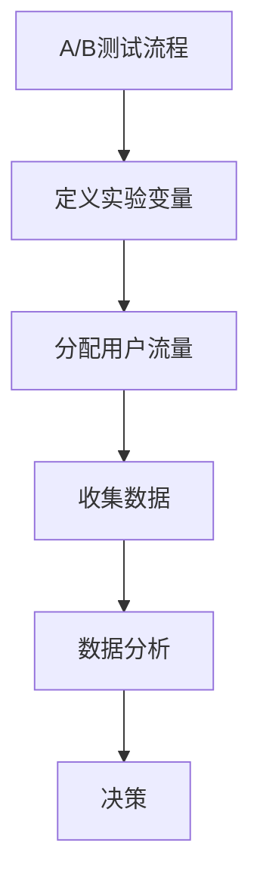

                 

## LET'S THINK STEP BY STEP: A/B测试在LLM评测中的实施策略

### 1. 背景介绍与核心概念

#### 问题背景

随着人工智能技术的飞速发展，语言模型（Language Model，简称LLM）在自然语言处理（Natural Language Processing，简称NLP）领域扮演了至关重要的角色。从早期的基础语言模型如Word2Vec和GloVe，到目前风靡全球的预训练模型如GPT-3和BERT，语言模型的应用范围不断扩大，从机器翻译、文本摘要到问答系统，无不被广泛采用。然而，随着模型的复杂性和参数量的增加，如何有效地评估和比较这些模型的性能成为一个重要且具挑战性的问题。

#### 问题概述

在AI语言模型评测中，主要面临的挑战包括评测标准的多样性和评测结果的可靠性。传统的评测方法往往依赖于人工设计的评测指标，如BLEU、ROUGE等，但这些指标往往不能全面反映模型在实际应用中的表现。此外，由于不同模型可能在不同的数据集上表现出不同的性能，如何确保评测的公平性和一致性也是一个亟待解决的问题。A/B测试作为一种常用的实验设计方法，可以在很大程度上解决上述问题。

#### 问题解决

A/B测试的基本原理是将用户流量分配到两个或多个不同的版本（A组和B组），通过对比不同版本的性能指标，来评估某个变化（如模型更新、算法调整等）对用户的影响。在LLM评测中，A/B测试可以帮助我们：

- 确保评测过程的公平性，避免人为偏见。
- 准确衡量模型更新或改进的效果，提高评测的可靠性。
- 发现潜在的问题和改进点，为模型优化提供指导。

#### 边界与外延

虽然A/B测试在AI语言模型评测中具有许多优势，但它也存在一些局限性。例如，A/B测试通常需要足够大的用户基础和足够长的实验时间，以确保结果的统计显著性。此外，A/B测试的结果可能会受到用户行为变化的影响，因此在实施过程中需要谨慎处理。

### 2. 核心概念与联系

#### AI语言模型的基本原理

AI语言模型是通过对大量文本数据的学习，来预测文本的下一个单词或短语。基本原理包括：

- **词嵌入**：将单词转换为向量表示。
- **神经网络**：使用神经网络模型（如RNN、LSTM、Transformer等）来处理和生成文本。
- **损失函数**：使用损失函数（如交叉熵损失）来衡量模型预测与实际结果之间的差距。

#### A/B测试的基本原理

A/B测试是一种常见的实验设计方法，它通过将用户流量分配到两个或多个不同的版本，来比较不同版本的性能指标。基本原理包括：

- **实验组（A组）**：接受新版本的用户。
- **对照组（B组）**：继续使用旧版本的用户。
- **性能指标**：衡量实验组和对照组在各个维度上的表现，如点击率、转化率、满意度等。

#### AI语言模型与A/B测试的联系

AI语言模型与A/B测试的结合，可以有效地解决语言模型评测中的问题。具体来说，A/B测试可以用于：

- **模型更新评估**：通过A/B测试，可以评估模型更新对用户的影响，确保更新带来的收益。
- **算法调整验证**：通过A/B测试，可以验证不同的算法调整对模型性能的影响，为模型优化提供依据。
- **多模型比较**：通过A/B测试，可以比较不同模型在不同数据集上的性能，为模型选择提供参考。

### 3. 算法原理讲解

#### A/B测试算法流程图

#### A/B测试算法原理

A/B测试的核心在于通过比较实验组和对照组的性能指标，来评估某个变化的效果。具体来说，A/B测试包括以下几个关键步骤：

1. **定义实验变量**：确定要测试的变量，如模型版本、算法调整等。
2. **分配用户流量**：将用户流量分配到实验组和对照组，确保两组用户的基线一致。
3. **收集数据**：在实验期间，收集两组用户的性能指标数据。
4. **数据分析**：使用统计方法（如t检验、卡方检验等）分析实验数据和对照组数据之间的差异。
5. **决策**：根据数据分析结果，做出是否采用新版本或调整算法的决策。

一个常用的A/B测试公式是p-value，它表示实验组效果指标高于对照组的概率。公式如下：

$$
\text{p-value} = \frac{R}{N}
$$

其中，\( R \) 是实验组中效果指标高于对照组的次数，\( N \) 是总实验次数。

#### 实际案例解析

假设我们有一个搜索引擎，要评估两个不同的搜索算法A和B。我们随机将用户分配到两个实验组，每个组包含1000名用户。在实验期间，我们收集了两组用户的点击率数据。实验结束后，我们得到了以下结果：

- **实验组A（算法A）**：点击率 = 20%
- **实验组B（算法B）**：点击率 = 22%

我们使用p-value来评估算法B相对于算法A的显著性。首先，我们计算\( R \)（实验组B点击率高于实验组A的次数），\( N \)（总实验次数）：

$$
R = 1000 \times (0.22 - 0.20) = 100
$$

$$
N = 1000 + 1000 = 2000
$$

然后，我们计算p-value：

$$
\text{p-value} = \frac{R}{N} = \frac{100}{2000} = 0.05
$$

由于p-value小于0.05，我们可以认为算法B在点击率方面显著优于算法A。因此，我们可能会选择采用算法B。

### 4. 实施前的准备工作

#### 定义实验变量

定义实验变量是A/B测试的第一步。我们需要明确要测试的变量，如模型版本、算法调整、用户界面变化等。同时，我们需要确保实验变量之间相互独立，以便准确评估每个变量的效果。

#### 分配用户流量

用户流量的分配是A/B测试的关键步骤。我们需要确保实验组和对照组的用户基础相似，以避免用户偏差。常用的流量分配方法包括随机分配和分层分配。随机分配可以消除随机性对实验结果的影响，而分层分配可以确保不同用户群体在实验组与对照组中均匀分布。

#### 设定实验时间

实验时间的设定对于A/B测试的成功至关重要。实验时间过短可能导致结果不准确，而过长则可能增加成本和用户流失。一般而言，实验时间的长度取决于业务目标、用户基数和实验指标的变化趋势。我们需要在实验初期进行监控，并根据数据调整实验时间。

### 5. 实施过程与监控

#### 数据收集与预处理

在实验过程中，我们需要收集实验组和对照组的用户行为数据，如点击率、转化率、满意度等。同时，我们需要对数据进行预处理，以确保数据的质量和一致性。

#### 数据分析

数据分析是A/B测试的核心步骤。我们需要使用统计方法（如t检验、卡方检验等）对实验数据进行分析，以评估实验组和对照组之间的差异。数据分析的结果将指导我们的决策，如是否采用新版本或调整算法。

#### 结果解读与决策

根据数据分析的结果，我们需要对实验结果进行解读和决策。如果实验组的效果显著优于对照组，我们可以选择采用新版本或调整算法。如果实验结果不显著，我们需要重新评估实验设计和实验变量，以便进行进一步的优化。

### 6. 实施中的挑战与解决方案

#### 用户偏差与选择偏差

用户偏差和选择偏差是A/B测试中常见的挑战。用户偏差可能由用户群体的不均匀分布或用户行为的变化引起，而选择偏差则可能由实验组与对照组的用户不同而产生。为了应对这些挑战，我们需要在实验设计阶段进行充分的用户调研和数据分析，以确保实验的公正性和有效性。

#### 数据量与样本量

数据量和样本量的大小直接影响A/B测试的结果。如果数据量不足或样本量太小，可能导致结果不准确或无法显著。为了确保实验结果的可靠性，我们需要根据业务目标和数据指标，合理设置数据量和样本量。

#### 时间效率与成本控制

A/B测试的实施通常需要耗费一定的时间和资源。为了提高时间效率和成本控制，我们可以采用以下策略：

- **自动化实验流程**：使用自动化工具来管理实验流程，减少人工干预。
- **分阶段实验**：将实验分为多个阶段，逐步扩大实验规模，以降低风险和成本。
- **资源优化**：合理分配资源，确保实验所需的计算能力和存储资源。

### 7. A/B测试在LLM评测中的应用

#### 多模型比较

在LLM评测中，A/B测试可以用于比较不同模型的性能。通过将用户流量分配到不同模型，我们可以评估每个模型的优劣，为模型选择提供参考。

#### 模型更新评估

在模型更新时，A/B测试可以帮助我们评估更新对用户的影响。通过对比更新前后的模型性能，我们可以判断更新是否带来了显著的改进。

#### 算法调整验证

在算法调整时，A/B测试可以用于验证不同算法的效果。通过比较实验组和对照组的数据，我们可以找到最优的算法调整方案。

### 8. 最佳实践与注意事项

#### 最佳实践

- **明确实验目标**：在实验设计阶段，明确实验的目标和预期结果，以确保实验的针对性和有效性。
- **合理分配流量**：在实验过程中，合理分配用户流量，避免用户偏差和选择偏差。
- **持续监控与调整**：在实验期间，持续监控实验数据和用户反馈，根据数据调整实验方案，以提高实验效果。
- **数据隐私保护**：在实验过程中，严格遵守数据隐私法规，保护用户的个人信息和隐私。

#### 注意事项

- **实验时间合理**：确保实验时间足够，以获得可靠的实验结果。
- **数据分析严谨**：使用合适的统计方法进行分析，确保实验结果的准确性。
- **用户反馈收集**：在实验结束后，收集用户反馈，以了解用户对新版本或算法的满意度。

### 9. 拓展阅读

- **《A/B测试实战》**：本书详细介绍了A/B测试的理论和实践，包括实验设计、数据分析、决策策略等。
- **《AI语言模型评测技术》**：本书介绍了AI语言模型评测的基本原理、常用指标和方法，以及A/B测试在其中的应用。
- **《机器学习实战》**：本书通过实际案例，介绍了机器学习的基本概念、算法和应用，有助于理解A/B测试在LLM评测中的应用。

### 10. 结论

A/B测试在LLM评测中具有重要的应用价值。通过合理设计和实施A/B测试，我们可以有效评估和比较不同模型的性能，为模型优化和更新提供依据。同时，A/B测试也需要在实验设计、数据分析、结果解读等方面进行严谨的处理，以确保实验结果的可靠性和有效性。让我们携手努力，充分利用A/B测试的优势，推动AI语言模型评测技术的发展。作者：AI天才研究院/AI Genius Institute & 禅与计算机程序设计艺术 /Zen And The Art of Computer Programming。

