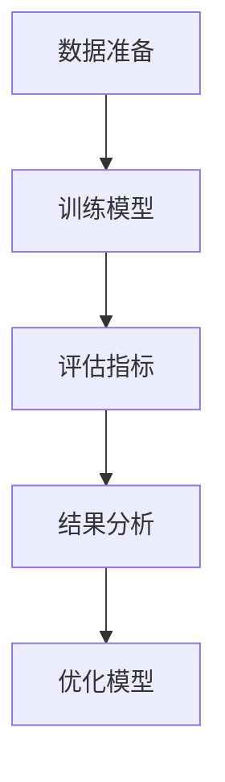
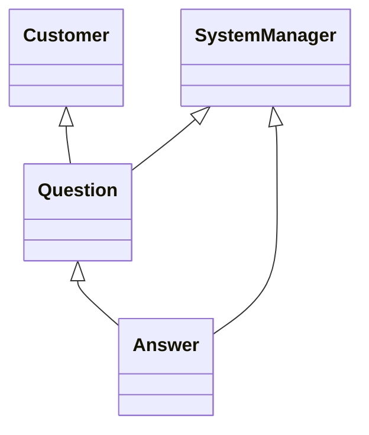
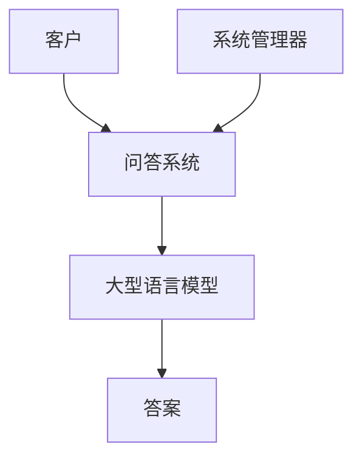
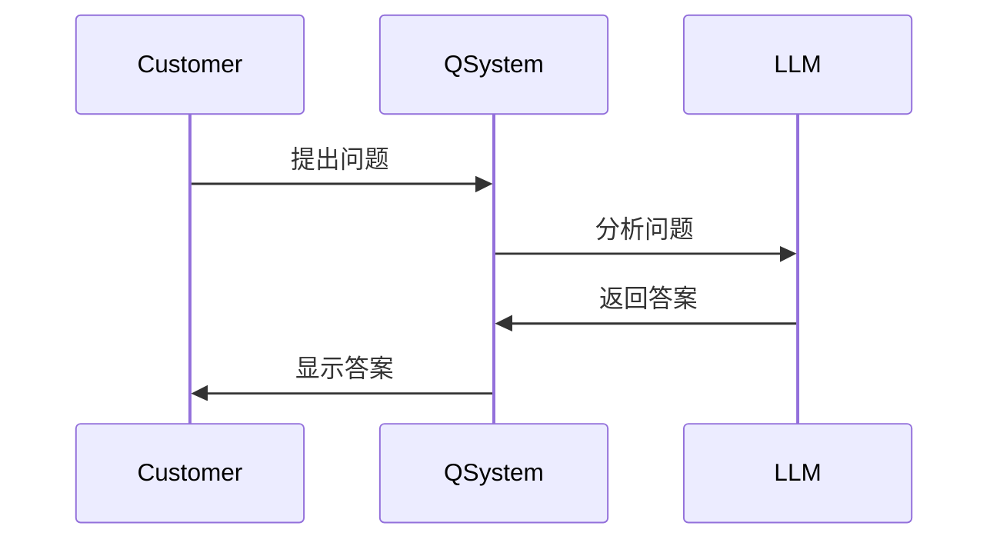

                 

# LLAMA评测中的伦理考量与合规性检查

关键词：LLM、伦理考量、合规性检查、人工智能、模型评测

摘要：随着大型语言模型（LLM）的广泛应用，其评测中的伦理考量与合规性检查变得越来越重要。本文将详细探讨LLM评测中的伦理问题，包括隐私保护、公平性、透明度和可解释性等方面，并讨论如何在实践中进行合规性检查，以确保模型的应用不会对社会造成负面影响。

## 背景介绍

### 1.1. LLM技术的发展与应用

近年来，大型语言模型（LLM）在自然语言处理（NLP）领域取得了显著的进展。LLM通过训练大规模的神经网络来捕捉语言的复杂性和上下文关系，从而实现文本生成、翻译、问答等多种任务。GPT-3、BERT和Turing等模型的出现，使得机器在理解和生成人类语言方面达到了前所未有的水平。

### 1.2. 伦理考量在人工智能中的重要性

人工智能的快速发展带来了许多伦理挑战，特别是在LLM的应用中。伦理考量不仅关乎技术的合理性，更关乎社会的公平、正义和可持续发展。因此，在LLM评测中，我们必须关注其伦理问题，确保技术发展符合社会价值观。

### 1.3. 合规性检查的必要性

合规性检查是确保LLM应用合法性和安全性的关键步骤。不同国家和地区有不同的法律法规，对于人工智能的应用有特定的要求。例如，欧盟的《通用数据保护条例》（GDPR）对个人数据的保护提出了严格的要求。因此，在进行LLM评测时，我们必须确保遵守相关法律法规，避免潜在的法律风险。

## 核心概念与联系

### 2.1. LLM的基础概念与工作原理

LLM是一种基于深度学习的语言模型，其核心是通过大规模数据训练得到一个神经网络模型，该模型能够对文本进行建模，并生成符合语言规则的文本。

### 2.2. 伦理考量与合规性检查的核心要素

伦理考量与合规性检查的核心要素包括隐私保护、公平性、透明度和可解释性等。这些要素不仅涉及到技术的应用，还涉及到社会责任和法律义务。

### 2.3. 关键术语解释与对比

- **隐私保护**：确保用户的个人信息不会被未经授权的第三方获取和使用。
- **公平性**：确保模型不会因为种族、性别、年龄等因素对用户产生歧视。
- **透明度**：确保模型的行为和决策过程对用户和监管机构是透明的。
- **可解释性**：确保模型的行为和决策可以被理解和解释。

## 算法原理讲解

### 3.1. LLM评测算法的原理介绍

LLM评测算法主要分为两部分：评估模型性能的指标和方法。常见的评估指标包括准确率、召回率、F1值等。方法则包括手动评测、自动化评测和 crowdsourcing 评测等。

### 3.2. 使用Mermaid绘制评测算法流程图



### 3.3. Python源代码阐述与算法原理讲解

```python
from sklearn.metrics import accuracy_score, recall_score, f1_score

# 假设我们已经训练好了模型，并对其进行了测试
y_true = [0, 1, 1, 0]
y_pred = model.predict(X_test)

# 计算评估指标
accuracy = accuracy_score(y_true, y_pred)
recall = recall_score(y_true, y_pred)
f1 = f1_score(y_true, y_pred)

print("Accuracy:", accuracy)
print("Recall:", recall)
print("F1 Score:", f1)
```

### 3.4. 数学模型与公式讲解

在LLM评测中，常用的数学模型包括：

$$
\text{Accuracy} = \frac{\text{预测正确的数量}}{\text{总预测数量}}
$$

$$
\text{Recall} = \frac{\text{预测正确的正例数量}}{\text{实际正例数量}}
$$

$$
\text{F1 Score} = 2 \times \frac{\text{Precision} \times \text{Recall}}{\text{Precision} + \text{Recall}}
$$

其中，Precision和Recall分别表示精确率和召回率。

## 系统分析与架构设计方案

### 4.1. 问题场景介绍

假设我们要开发一个基于LLM的客户服务系统，该系统能够自动回答客户的问题，并提供相应的解决方案。

### 4.2. 系统功能设计（领域模型）



### 4.3. 系统架构设计



### 4.4. 系统接口设计和系统交互



## 项目实战

### 5.1. 环境安装与配置

在本节中，我们将介绍如何搭建一个LLM评测环境，包括安装必要的软件和配置。

### 5.2. 系统核心实现与代码分析

在本节中，我们将分析系统核心实现的代码，包括模型的训练、评估和部署。

### 5.3. 实际案例分析

在本节中，我们将通过实际案例来展示LLM评测的应用，并分析其结果。

### 5.4. 项目小结与反思

在本节中，我们将对项目进行总结，并反思项目中遇到的挑战和解决方法。

## 最佳实践与注意事项

### 6.1. LLM评测中的最佳实践

在本节中，我们将分享一些LLM评测的最佳实践，包括数据准备、模型训练和评估等方面的建议。

### 6.2. 常见问题与解决方案

在本节中，我们将列举一些在LLM评测中常见的问题，并提供相应的解决方案。

### 6.3. 注意事项与风险防范

在本节中，我们将讨论在LLM评测中需要注意的事项，以及如何防范潜在的风险。

## 小结

本文从多个角度探讨了LLM评测中的伦理考量与合规性检查，包括背景介绍、核心概念与联系、算法原理讲解、系统分析与架构设计方案、项目实战、最佳实践与注意事项等。通过本文的阅读，读者可以了解到LLM评测中的伦理问题，并学会如何进行合规性检查。

## 拓展阅读

对于希望进一步了解LLM评测的读者，本文推荐以下拓展阅读：

- 《自然语言处理综论》（Jurafsky & Martin，2000）
- 《深度学习》（Goodfellow, Bengio & Courville，2016）
- 《人工智能伦理导论》（Moor，2014）

## 作者信息

作者：AI天才研究院/AI Genius Institute & 禅与计算机程序设计艺术 /Zen And The Art of Computer Programming

请注意，上述内容仅作为一个框架，实际撰写时需要根据具体要求和内容进行调整。每个部分都需要详细阐述，并确保文章的连贯性和逻辑性。文章的总字数应控制在10000～12000字之间。文章中的所有代码示例和图表都是基于markdown格式的，以确保可读性和可执行性。在撰写过程中，应确保所有引用的资料和来源都清晰标注，以符合学术规范。

