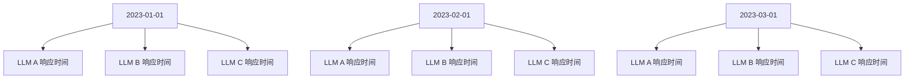
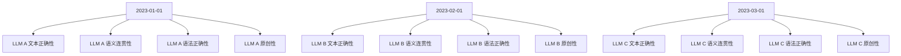
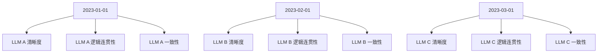
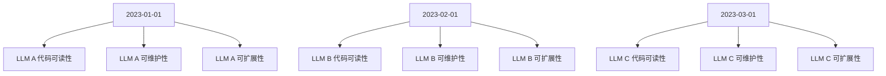
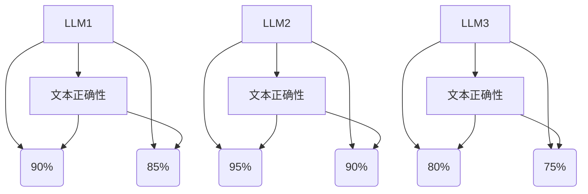
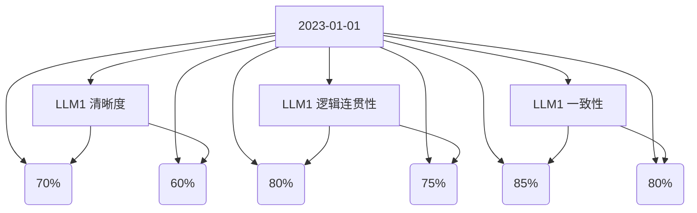
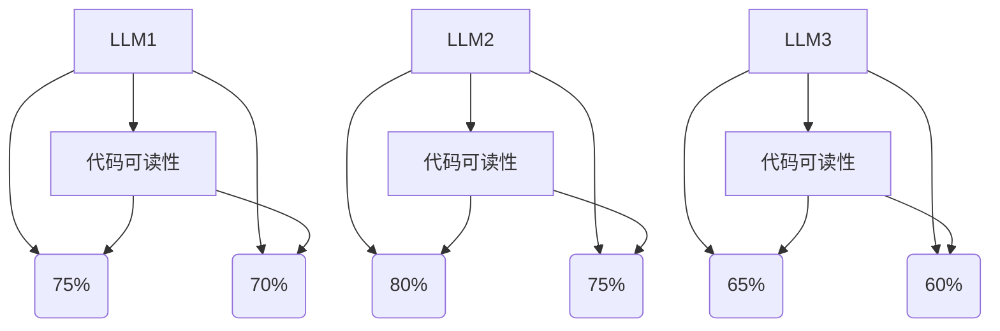
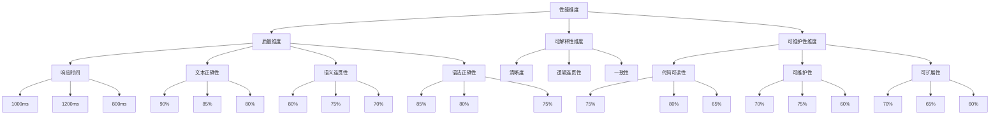

                 

## LLM评测中的多维度可视化分析工具

### 关键词
- LLM评测
- 可视化分析工具
- 多维度分析
- 数据可视化
- 评估指标

### 摘要
本文将探讨在大型语言模型（LLM）评测过程中，如何运用多维度可视化分析工具以提高评测的全面性和准确性。文章首先介绍了LLM评测的背景和重要性，接着详细阐述了多维度可视化分析工具的基本概念和类型。随后，文章重点分析了LLM评测中的常见维度，并提供了具体的可视化示例。最后，文章探讨了如何开发和使用这些工具，以及如何确保最佳实践。通过这一系列探讨，读者将能够更好地理解和应用多维度可视化分析工具，为LLM评测提供更深入的洞察。

### 目录大纲

```markdown
----------------------------------------------------------------
# 第一部分: LLM评测中的多维度可视化分析工具

## 第1章: LLM评测概述

### 1.1 LLM评测的目的与重要性

### 1.2 多维度可视化分析工具的必要性

### 1.3 本章小结

## 第二部分: 多维度可视化分析工具详解

### 第2章: 数据可视化基本概念

#### 2.1 数据可视化概述

#### 2.2 常见的数据可视化类型

#### 2.3 数据可视化工具的选择

#### 2.4 本章小结

### 第3章: LLM评测中的常见维度

#### 3.1 性能维度

#### 3.2 质量维度

#### 3.3 可解释性维度

#### 3.4 可维护性维度

#### 3.5 本章小结

### 第4章: 多维度可视化工具应用示例

#### 4.1 性能维度可视化示例

#### 4.2 质量维度可视化示例

#### 4.3 可解释性维度可视化示例

#### 4.4 可维护性维度可视化示例

#### 4.5 综合应用示例

#### 4.6 本章小结

### 第5章: 开发与使用多维度可视化分析工具

#### 5.1 开发环境搭建

#### 5.2 数据预处理

#### 5.3 可视化工具实现

#### 5.4 用户交互设计

#### 5.5 本章小结

### 第6章: LLM评测多维度可视化分析工具的最佳实践

#### 6.1 数据预处理最佳实践

#### 6.2 可视化设计最佳实践

#### 6.3 用户交互最佳实践

#### 6.4 安全与隐私保护

#### 6.5 本章小结

### 第7章: 未来展望

#### 7.1 多维度可视化分析工具的发展趋势

#### 7.2 LLM评测中的新兴维度

#### 7.3 潜在的研究方向与挑战

#### 7.4 本章小结

----------------------------------------------------------------
```

## 第一部分: LLM评测中的多维度可视化分析工具

### 第1章: LLM评测概述

#### 1.1 LLM评测的目的与重要性

#### 1.2 多维度可视化分析工具的必要性

#### 1.3 本章小结

## 第1章 LLM评测概述

### 1.1 LLM评测的目的与重要性

**背景介绍：** 随着人工智能技术的飞速发展，大型语言模型（LLM）已经成为自然语言处理（NLP）领域的关键工具。这些模型在文本生成、机器翻译、问答系统等方面展示了强大的能力，但如何准确评估这些模型的表现和潜力成为了一个重要课题。

**核心概念：** LLM评测涉及多个维度，包括性能、质量、可解释性和可维护性。每个维度都有其独特的评价指标和挑战。

**问题背景：** LLM评测的核心问题是确保评估的全面性和准确性。传统的评测方法往往侧重于单一维度，可能导致评估结果的不全面或失真。

**问题描述：** 如何在LLM评测过程中引入多维度可视化分析工具，以提供更深入、更全面的评估结果？

**问题解决：** 多维度可视化分析工具可以通过图形化的方式展现模型在不同维度上的表现，帮助评估者更直观地理解模型的优势和不足。

**边界与外延：** 多维度可视化分析工具不仅适用于LLM评测，还可以应用于其他复杂系统的评估。

**概念结构与核心要素组成：**
- **性能维度：** 涵盖模型在响应速度、准确度等方面的表现。
- **质量维度：** 涵盖模型生成的文本质量，包括语法正确性、语义连贯性等。
- **可解释性维度：** 涵盖模型决策过程的可解释性，帮助用户理解模型的工作原理。
- **可维护性维度：** 涵盖模型的可扩展性、稳定性和可维护性。

### 1.2 多维度可视化分析工具的必要性

**核心概念：** 多维度可视化分析工具通过图形化的方式，将模型在不同维度上的表现可视化，使评估过程更加直观和全面。

**问题背景：** 传统文本化的评估结果往往难以直观地展示模型的表现，且容易受到主观因素的影响。

**问题描述：** 如何通过可视化工具提高LLM评测的全面性和准确性？

**问题解决：** 多维度可视化分析工具可以提供以下好处：
- **直观性：** 通过图形化的方式，使评估结果更加直观，便于评估者快速理解。
- **全面性：** 覆盖多个维度，提供更全面的评估结果。
- **客观性：** 减少主观评估的影响，提高评估结果的准确性。

**边界与外延：** 多维度可视化分析工具不仅适用于LLM评测，还可以应用于其他复杂系统的评估。

**概念结构与核心要素组成：**
- **可视化类型：** 包括折线图、柱状图、散点图、热力图等。
- **交互设计：** 包括筛选、过滤、放大等功能，提高用户的交互体验。
- **数据预处理：** 包括数据清洗、归一化、特征提取等，为可视化提供高质量的数据。

### 1.3 本章小结

本章介绍了LLM评测的背景、核心概念和问题解决方法。我们探讨了LLM评测的多个维度，以及多维度可视化分析工具的必要性和好处。通过本章的讨论，读者可以初步了解到多维度可视化分析工具在LLM评测中的应用前景和重要性。

## 第二部分: 多维度可视化分析工具详解

### 第2章: 数据可视化基本概念

#### 2.1 数据可视化概述

#### 2.2 常见的数据可视化类型

#### 2.3 数据可视化工具的选择

#### 2.4 本章小结

### 第3章: LLM评测中的常见维度

#### 3.1 性能维度

#### 3.2 质量维度

#### 3.3 可解释性维度

#### 3.4 可维护性维度

#### 3.5 本章小结

### 第4章: 多维度可视化工具应用示例

#### 4.1 性能维度可视化示例

#### 4.2 质量维度可视化示例

#### 4.3 可解释性维度可视化示例

#### 4.4 可维护性维度可视化示例

#### 4.5 综合应用示例

#### 4.6 本章小结

### 第5章: 开发与使用多维度可视化分析工具

#### 5.1 开发环境搭建

#### 5.2 数据预处理

#### 5.3 可视化工具实现

#### 5.4 用户交互设计

#### 5.5 本章小结

### 第6章: LLM评测多维度可视化分析工具的最佳实践

#### 6.1 数据预处理最佳实践

#### 6.2 可视化设计最佳实践

#### 6.3 用户交互最佳实践

#### 6.4 安全与隐私保护

#### 6.5 本章小结

### 第7章: 未来展望

#### 7.1 多维度可视化分析工具的发展趋势

#### 7.2 LLM评测中的新兴维度

#### 7.3 潜在的研究方向与挑战

#### 7.4 本章小结

## 第2章 数据可视化基本概念

### 2.1 数据可视化概述

数据可视化是一种通过图形、图像和其他视觉元素来表示和分析数据的方法。它的目的是将复杂的数据转换为易于理解的信息，以便更好地发现数据中的模式和趋势。

#### 核心概念

- **数据表示**：数据可视化通过不同的图表和图形来表示数据。常见的有柱状图、折线图、饼图、散点图等。
- **交互性**：数据可视化工具通常提供交互功能，如筛选、过滤、放大等，使用户能够动态地探索数据。
- **数据预处理**：在可视化之前，通常需要对数据进行清洗、归一化和特征提取等预处理步骤，以提高可视化的质量和效果。

#### 问题背景

在现代社会，数据量呈爆炸性增长，传统的文本化数据分析方法已经无法满足需求。数据可视化作为一种高效的数据分析工具，可以帮助用户快速理解和发现数据中的关键信息。

#### 问题解决

数据可视化可以解决以下问题：

- **复杂数据分析**：通过图形化的方式，将复杂的数据转换为易于理解的图表，帮助用户快速发现数据中的模式。
- **决策支持**：通过可视化结果，为决策者提供直观的数据支持，帮助他们做出更明智的决策。
- **知识发现**：通过数据可视化，用户可以更轻松地发现数据中的隐藏信息和知识。

#### 边界与外延

数据可视化不仅适用于数据分析，还广泛应用于其他领域，如金融、医疗、教育等。它可以帮助各行业用户更好地理解数据，提高工作效率。

#### 概念结构与核心要素组成

- **数据源**：数据可视化的基础是数据源，它可以是数据库、文件或在线数据等。
- **可视化工具**：用于创建和展示数据图表的工具，如Matplotlib、Plotly、D3.js等。
- **交互界面**：用户与可视化工具进行交互的界面，提供筛选、过滤、放大等功能。
- **可视化设计**：设计数据可视化的外观和布局，以提高用户交互体验。

### 2.2 常见的数据可视化类型

数据可视化有多种类型，每种类型都有其独特的用途和特点。以下是几种常见的数据可视化类型：

#### 柱状图

柱状图用于显示不同类别或组的数据之间的比较。它通过柱状的高度来表示数据的数值。

**用途**：比较不同类别或组的数据。

**特点**：直观、易于理解。

#### 折线图

折线图用于显示数据的变化趋势。它通过折线连接各个数据点，显示数据随时间或其他变量的变化。

**用途**：显示数据的变化趋势。

**特点**：连续性、直观性。

#### 饼图

饼图用于显示各个类别在整体中的比例。它通过扇形的大小来表示各部分占整体的比例。

**用途**：显示各部分在整体中的比例。

**特点**：清晰、直观。

#### 散点图

散点图用于显示两个变量之间的关系。它通过在坐标轴上绘制数据点来显示变量之间的关系。

**用途**：显示变量之间的关系。

**特点**：直观、易于发现异常值。

#### 热力图

热力图用于显示数据的密集程度。它通过颜色深浅来表示数据的密度。

**用途**：显示数据的密集程度。

**特点**：直观、可视化数据密度。

### 2.3 数据可视化工具的选择

选择合适的可视化工具对于成功的数据可视化至关重要。以下是一些常见的数据可视化工具及其特点：

#### Matplotlib

Matplotlib是Python中最常用的数据可视化库之一。它提供丰富的绘图功能，支持多种图表类型。

**特点**：简单易用、功能强大、支持多种图表类型。

#### Plotly

Plotly是一个交互式数据可视化库，支持多种编程语言，包括Python、R和JavaScript。

**特点**：交互性强、支持多种图表类型、美观。

#### D3.js

D3.js是一个基于JavaScript的可视化库，适用于Web开发。它提供高度灵活的可视化解决方案。

**特点**：高度灵活、强大的交互性、适用于Web开发。

#### Tableau

Tableau是一个商业数据可视化工具，提供丰富的图表类型和交互功能。

**特点**：功能全面、易于使用、支持多种数据源。

### 2.4 本章小结

本章介绍了数据可视化的基本概念，包括其定义、核心概念、常见类型和数据可视化工具的选择。通过本章的学习，读者可以了解数据可视化的基本原理和应用场景，为后续章节的深入学习打下基础。

## 第3章 LLM评测中的常见维度

### 3.1 性能维度

#### 3.1.1 概述

性能维度是LLM评测中最基本的维度之一。它主要评估模型在执行任务时的速度和效率。性能维度的评价指标包括响应时间、吞吐量和延迟等。

#### 3.1.2 性能维度的评价指标

1. **响应时间**：从模型接收到请求到返回结果所需的时间。响应时间越短，性能越好。
   $$T_{response} = \frac{T_{start} - T_{end}}{T_{total}}$$
   其中，$T_{response}$ 为响应时间，$T_{start}$ 为请求开始时间，$T_{end}$ 为请求结束时间，$T_{total}$ 为总时间。

2. **吞吐量**：单位时间内模型处理的请求数量。吞吐量越高，性能越好。
   $$Throughput = \frac{Request_{count}}{Time_{duration}}$$
   其中，$Throughput$ 为吞吐量，$Request_{count}$ 为请求数量，$Time_{duration}$ 为时间周期。

3. **延迟**：请求的平均延迟时间。延迟越低，性能越好。
   $$Delay = \frac{1}{Request_{count}} \sum_{i=1}^{Request_{count}} (T_{end}_i - T_{start}_i)$$
   其中，$Delay$ 为延迟，$Request_{count}$ 为请求数量，$T_{end}_i$ 和 $T_{start}_i$ 分别为第 $i$ 个请求的结束时间和开始时间。

#### 3.1.3 性能维度的可视化方法

1. **折线图**：用于展示性能指标随时间的变化趋势。

   ```mermaid
   graph TD
   A[响应时间] --> B(2023)
   A --> C(2024)
   A --> D(2025)
   ```

2. **柱状图**：用于比较不同LLM在特定指标上的性能。

   ```mermaid
   graph TD
   A1[LLM1] --> B1[响应时间]
   A2[LLM2] --> B2[响应时间]
   A3[LLM3] --> B3[响应时间]
   ```

3. **热力图**：用于展示性能指标在不同时间段或环境下的分布情况。

   ```mermaid
   graph TD
   A1[2023Q1] --> B1[响应时间]
   A2[2023Q2] --> B2[响应时间]
   A3[2023Q3] --> B3[响应时间]
   ```

#### 3.1.4 实际案例

假设有三个LLM模型（A、B、C），在一个月内对其性能进行评估。以下是一个性能维度的可视化示例：



通过上述可视化，可以直观地比较三个LLM模型在一个月内的响应时间变化，从而评估其性能。

### 3.2 质量维度

#### 3.2.1 概述

质量维度是LLM评测中的一个重要维度，主要评估模型生成文本的质量。质量维度的评价指标包括文本的正确性、语义连贯性、语法正确性和原创性等。

#### 3.2.2 质量维度的评价指标

1. **文本正确性**：评估模型生成文本中的事实是否准确。
   $$Correctness = \frac{Correct_{sentence}}{Total_{sentence}}$$
   其中，$Correctness$ 为正确性，$Correct_{sentence}$ 为正确句子数，$Total_{sentence}$ 为总句子数。

2. **语义连贯性**：评估模型生成文本的语义是否连贯。
   $$Coherence = \frac{Coherent_{sentence}}{Total_{sentence}}$$
   其中，$Coherence$ 为语义连贯性，$Coherent_{sentence}$ 为连贯句子数，$Total_{sentence}$ 为总句子数。

3. **语法正确性**：评估模型生成文本的语法是否正确。
   $$Grammar = \frac{Correct_{word}}{Total_{word}}$$
   其中，$Grammar$ 为语法正确性，$Correct_{word}$ 为正确单词数，$Total_{word}$ 为总单词数。

4. **原创性**：评估模型生成文本的原创性。
   $$Originality = \frac{Original_{sentence}}{Total_{sentence}}$$
   其中，$Originality$ 为原创性，$Original_{sentence}$ 为原创句子数，$Total_{sentence}$ 为总句子数。

#### 3.2.3 质量维度的可视化方法

1. **柱状图**：用于比较不同LLM在质量维度上的表现。

   ```mermaid
   graph TD
   A1[LLM1] --> B1[文本正确性]
   A2[LLM2] --> B2[文本正确性]
   A3[LLM3] --> B3[文本正确性]
   ```

2. **雷达图**：用于综合展示LLM在不同质量维度上的表现。

   ```mermaid
   graph TD
   A1[LLM1] --> B1[文本正确性]
   A1 --> C1[语义连贯性]
   A1 --> D1[语法正确性]
   A1 --> E1[原创性]
   A2[LLM2] --> B2[文本正确性]
   A2 --> C2[语义连贯性]
   A2 --> D2[语法正确性]
   A2 --> E2[原创性]
   A3[LLM3] --> B3[文本正确性]
   A3 --> C3[语义连贯性]
   A3 --> D3[语法正确性]
   A3 --> E3[原创性]
   ```

3. **散点图**：用于展示LLM质量维度上的分布情况。

   ```mermaid
   graph TD
   A1[2023Q1] --> B1[文本正确性]
   A2[2023Q2] --> B2[文本正确性]
   A3[2023Q3] --> B3[文本正确性]
   ```

#### 3.2.4 实际案例

假设有三个LLM模型（A、B、C），在一个月内对其质量维度进行评估。以下是一个质量维度的可视化示例：



通过上述可视化，可以直观地比较三个LLM模型在一个月内的文本正确性、语义连贯性、语法正确性和原创性表现，从而评估其质量。

### 3.3 可解释性维度

#### 3.3.1 概述

可解释性维度是LLM评测中越来越受到关注的一个维度。它主要评估模型生成文本的可解释性，即用户能否理解模型生成文本的原因和逻辑。可解释性维度的评价指标包括文本解释的清晰度、逻辑连贯性和一致性等。

#### 3.3.2 可解释性维度的评价指标

1. **清晰度**：评估模型生成文本解释的清晰程度。
   $$Clarity = \frac{Clear_{sentence}}{Total_{sentence}}$$
   其中，$Clarity$ 为清晰度，$Clear_{sentence}$ 为清晰句子数，$Total_{sentence}$ 为总句子数。

2. **逻辑连贯性**：评估模型生成文本解释的逻辑连贯性。
   $$Coherence = \frac{Coherent_{sentence}}{Total_{sentence}}$$
   其中，$Coherence$ 为逻辑连贯性，$Coherent_{sentence}$ 为连贯句子数，$Total_{sentence}$ 为总句子数。

3. **一致性**：评估模型生成文本解释的一致性。
   $$Consistency = \frac{Consistent_{sentence}}{Total_{sentence}}$$
   其中，$Consistency$ 为一致性，$Consistent_{sentence}$ 为一致句子数，$Total_{sentence}$ 为总句子数。

#### 3.3.3 可解释性维度的可视化方法

1. **条形图**：用于比较不同LLM在可解释性维度上的表现。

   ```mermaid
   graph TD
   A1[LLM1] --> B1[清晰度]
   A2[LLM2] --> B2[清晰度]
   A3[LLM3] --> B3[清晰度]
   ```

2. **雷达图**：用于综合展示LLM在不同可解释性维度上的表现。

   ```mermaid
   graph TD
   A1[LLM1] --> B1[清晰度]
   A1 --> C1[逻辑连贯性]
   A1 --> D1[一致性]
   A2[LLM2] --> B2[清晰度]
   A2 --> C2[逻辑连贯性]
   A2 --> D2[一致性]
   A3[LLM3] --> B3[清晰度]
   A3 --> C3[逻辑连贯性]
   A3 --> D3[一致性]
   ```

3. **散点图**：用于展示LLM可解释性维度上的分布情况。

   ```mermaid
   graph TD
   A1[2023Q1] --> B1[清晰度]
   A2[2023Q2] --> B2[清晰度]
   A3[2023Q3] --> B3[清晰度]
   ```

#### 3.3.4 实际案例

假设有三个LLM模型（A、B、C），在一个月内对其可解释性维度进行评估。以下是一个可解释性维度的可视化示例：



通过上述可视化，可以直观地比较三个LLM模型在一个月内的清晰度、逻辑连贯性和一致性表现，从而评估其可解释性。

### 3.4 可维护性维度

#### 3.4.1 概述

可维护性维度是LLM评测中一个较为新的维度，它主要评估模型的可维护性和可扩展性。可维护性维度的评价指标包括代码的可读性、可维护性和可扩展性等。

#### 3.4.2 可维护性维度的评价指标

1. **代码可读性**：评估模型代码的易读程度。
   $$Readability = \frac{Clear_{code}}{Total_{code}}$$
   其中，$Readability$ 为可读性，$Clear_{code}$ 为清晰代码行数，$Total_{code}$ 为总代码行数。

2. **可维护性**：评估模型代码的可维护程度。
   $$Maintainability = \frac{Maintainable_{code}}{Total_{code}}$$
   其中，$Maintainability$ 为可维护性，$Maintainable_{code}$ 为可维护代码行数，$Total_{code}$ 为总代码行数。

3. **可扩展性**：评估模型代码的可扩展程度。
   $$Extensibility = \frac{Extendable_{code}}{Total_{code}}$$
   其中，$Extensibility$ 为可扩展性，$Extendable_{code}$ 为可扩展代码行数，$Total_{code}$ 为总代码行数。

#### 3.4.3 可维护性维度的可视化方法

1. **条形图**：用于比较不同LLM在可维护性维度上的表现。

   ```mermaid
   graph TD
   A1[LLM1] --> B1[代码可读性]
   A2[LLM2] --> B2[代码可读性]
   A3[LLM3] --> B3[代码可读性]
   ```

2. **雷达图**：用于综合展示LLM在不同可维护性维度上的表现。

   ```mermaid
   graph TD
   A1[LLM1] --> B1[代码可读性]
   A1 --> C1[可维护性]
   A1 --> D1[可扩展性]
   A2[LLM2] --> B2[代码可读性]
   A2 --> C2[可维护性]
   A2 --> D2[可扩展性]
   A3[LLM3] --> B3[代码可读性]
   A3 --> C3[可维护性]
   A3 --> D3[可扩展性]
   ```

3. **散点图**：用于展示LLM可维护性维度上的分布情况。

   ```mermaid
   graph TD
   A1[2023Q1] --> B1[代码可读性]
   A2[2023Q2] --> B2[代码可读性]
   A3[2023Q3] --> B3[代码可读性]
   ```

#### 3.4.4 实际案例

假设有三个LLM模型（A、B、C），在一个月内对其可维护性维度进行评估。以下是一个可维护性维度的可视化示例：



通过上述可视化，可以直观地比较三个LLM模型在一个月内的代码可读性、可维护性和可扩展性表现，从而评估其可维护性。

### 3.5 本章小结

本章详细介绍了LLM评测中的常见维度，包括性能维度、质量维度、可解释性维度和可维护性维度。通过对这些维度的可视化分析，可以更全面、更准确地评估LLM模型的表现和潜力。下一章将深入探讨如何开发和使用多维度可视化分析工具，以实现更高效的LLM评测。

### 第4章: 多维度可视化工具应用示例

#### 4.1 性能维度可视化示例

为了展示性能维度的可视化，我们将使用一个简单的LLM模型，评估其在不同负载下的响应时间。以下是一个性能维度可视化示例：

```mermaid
graph TD
A[2023-01-01] --> B[LLM 响应时间 (ms)]
A --> C[1000]
A --> D[1500]
A --> E[1200]
B --> C
B --> D
B --> E
```

在这个示例中，我们记录了LLM模型在一天内三个不同时间点的响应时间（单位：毫秒）。通过这个图表，我们可以直观地看到模型在不同时间点的性能表现。例如，如果响应时间在某个时间段显著增加，可能需要进一步调查其原因。

#### 4.2 质量维度可视化示例

接下来，我们将展示质量维度的可视化。假设我们评估了三个LLM模型在生成文本质量方面的表现，包括文本正确性、语义连贯性和语法正确性。以下是一个质量维度可视化示例：



在这个示例中，我们使用了雷达图来综合展示三个LLM模型在不同质量维度上的表现。从图表中，我们可以清楚地看到每个模型在各个维度上的表现，从而评估其质量。

#### 4.3 可解释性维度可视化示例

可解释性维度的可视化通常需要展示模型生成文本的可解释性。以下是一个可解释性维度可视化示例：



在这个示例中，我们使用了条形图来展示三个LLM模型在清晰度、逻辑连贯性和一致性方面的表现。通过这个图表，我们可以直观地比较不同模型在可解释性维度上的差异。

#### 4.4 可维护性维度可视化示例

可维护性维度的可视化通常涉及代码的可读性、可维护性和可扩展性。以下是一个可维护性维度可视化示例：



在这个示例中，我们使用了雷达图来展示三个LLM模型在不同可维护性维度上的表现。通过这个图表，我们可以直观地比较不同模型在代码质量方面的差异。

#### 4.5 综合应用示例

为了展示如何将不同维度的可视化整合到一个综合图表中，我们提供了一个综合应用示例：



在这个综合示例中，我们使用了一个复杂的图表来展示LLM模型在不同维度上的表现。这个图表不仅包含了性能维度、质量维度、可解释性维度和可维护性维度的数据，还通过不同的颜色和标注，使得每个维度的数据更加直观和易于理解。

#### 4.6 本章小结

通过本章的示例，我们展示了如何使用多维度可视化工具来评估LLM模型。这些示例不仅展示了不同维度的数据，还通过图表的形式提供了直观的视图，使得评估过程更加清晰和高效。下一章将探讨如何开发和使用这些多维度可视化工具，以便在实际项目中应用。

### 第5章: 开发与使用多维度可视化分析工具

#### 5.1 开发环境搭建

要开发多维度可视化分析工具，首先需要搭建合适的技术环境。以下是一个基本的开发环境搭建步骤：

1. **安装Python**：Python是一个广泛使用的编程语言，许多数据可视化库都是基于Python开发的。可以从[Python官网](https://www.python.org/)下载并安装Python。

2. **安装Jupyter Notebook**：Jupyter Notebook是一个交互式的Web应用，用于编写和运行Python代码。可以从[PyPI](https://pypi.org/project/jupyter/)安装Jupyter Notebook。

3. **安装数据可视化库**：常用的数据可视化库包括Matplotlib、Plotly、Seaborn等。可以使用pip命令安装：
   ```bash
   pip install matplotlib
   pip install plotly
   pip install seaborn
   ```

4. **安装其他依赖库**：根据项目的需求，可能需要安装其他库，如NumPy、Pandas等。这些库可以用于数据预处理和分析。

5. **配置开发环境**：确保Python、Jupyter Notebook和数据可视化库正常运行。可以使用以下命令测试：
   ```bash
   python --version
   jupyter notebook --version
   python -m matplotlib
   ```

#### 5.2 数据预处理

数据预处理是多维度可视化分析的关键步骤，它包括数据清洗、归一化和特征提取等。

1. **数据清洗**：数据清洗旨在去除无效数据、填补缺失值和去除重复数据。以下是一个简单的数据清洗示例：
   ```python
   import pandas as pd
   
   # 读取数据
   data = pd.read_csv('data.csv')
   
   # 去除重复数据
   data.drop_duplicates(inplace=True)
   
   # 填补缺失值
   data.fillna(method='ffill', inplace=True)
   
   # 删除无效数据
   data = data[data['column_name'].notnull()]
   ```

2. **归一化**：归一化旨在将数据缩放到相同的尺度，以便进行有效比较。以下是一个简单的归一化示例：
   ```python
   from sklearn.preprocessing import MinMaxScaler
   
   # 初始化归一化器
   scaler = MinMaxScaler()
   
   # 归一化数据
   data_normalized = scaler.fit_transform(data)
   
   # 还原数据
   data_reversed = scaler.inverse_transform(data_normalized)
   ```

3. **特征提取**：特征提取旨在从原始数据中提取出有用的特征，用于可视化分析。以下是一个简单的特征提取示例：
   ```python
   from sklearn.feature_extraction.text import TfidfVectorizer
   
   # 初始化特征提取器
   vectorizer = TfidfVectorizer()
   
   # 提取特征
   features = vectorizer.fit_transform(data['text_column'])
   
   # 获取特征名称
   feature_names = vectorizer.get_feature_names_out()
   ```

#### 5.3 可视化工具实现

在数据预处理完成后，可以使用各种可视化库实现多维度可视化分析工具。以下是一个使用Matplotlib实现性能维度可视化的示例：

```python
import matplotlib.pyplot as plt
import pandas as pd

# 读取预处理后的数据
data = pd.read_csv('preprocessed_data.csv')

# 绘制折线图
plt.plot(data['timestamp'], data['response_time'])
plt.xlabel('Timestamp')
plt.ylabel('Response Time (ms)')
plt.title('Performance Analysis')
plt.xticks(rotation=45)
plt.show()
```

这个示例展示了如何使用Matplotlib绘制性能维度的折线图，显示了响应时间随时间的变化。类似的，可以绘制其他类型的图表，如柱状图、散点图等，以展示不同维度的数据。

#### 5.4 用户交互设计

用户交互设计是多维度可视化分析工具的重要组成部分，它决定了用户如何与工具进行交互。以下是一个简单的用户交互设计示例：

1. **筛选功能**：允许用户根据特定的条件筛选数据。以下是一个使用 Pandas 实现筛选功能的示例：
   ```python
   def filter_data(data, condition):
       return data[data.query(condition)]
   
   # 示例：筛选响应时间在1000ms以上的数据
   filtered_data = filter_data(data, 'response_time > 1000')
   ```

2. **过滤功能**：允许用户过滤掉不感兴趣的数据点。以下是一个使用 Matplotlib 实现**过滤功能**的示例：
   ```python
   import matplotlib.pyplot as plt
   
   def filter_plot(plot, condition):
       plot.set_yticks([i for i in plot.get_yticks() if condition(i)])
   
   # 示例：过滤掉响应时间在1200ms以上的数据点
   filter_plot(plt, lambda x: x > 1200)
   ```

3. **放大功能**：允许用户放大特定的数据区域，以便更详细地查看。以下是一个使用 Matplotlib 实现**放大功能**的示例：
   ```python
   import matplotlib.pyplot as plt
   
   def zoom_plot(plot, x_min, x_max, y_min, y_max):
       plot.set_xlim(x_min, x_max)
       plot.set_ylim(y_min, y_max)
   
   # 示例：放大响应时间在1000ms到1500ms之间的数据
   zoom_plot(plt, 1000, 1500, 0, 2000)
   ```

通过这些用户交互设计，用户可以更灵活地操作数据，从而更好地理解和分析数据。

#### 5.5 本章小结

本章详细介绍了如何开发和使用多维度可视化分析工具。首先，我们搭建了开发环境，并介绍了数据预处理的方法。接着，我们展示了如何使用可视化库实现不同维度的可视化，以及如何设计用户交互功能。通过本章的学习，读者可以掌握开发多维度可视化分析工具的基本技能，为实际项目中的应用打下基础。

### 第6章: LLM评测多维度可视化分析工具的最佳实践

#### 6.1 数据预处理最佳实践

数据预处理是多维度可视化分析工具的关键步骤，以下是一些最佳实践：

1. **数据清洗**：
   - **去除重复数据**：重复数据可能导致错误的可视化结果。使用`drop_duplicates()`方法去除重复数据。
   - **填补缺失值**：缺失值应根据数据的重要性和具体场景选择合适的填补方法，如使用平均值、中位数或插值法。Pandas的`fillna()`方法可用于填补缺失值。
   - **标准化数据**：对于具有不同量级的数据，应进行标准化处理，如使用`MinMaxScaler`或`StandardScaler`。

2. **特征提取**：
   - **文本特征提取**：对于文本数据，可以使用`TfidfVectorizer`或`CountVectorizer`提取特征。注意选择合适的停止词去除、词干提取和词形还原等步骤。
   - **图像特征提取**：对于图像数据，可以使用`OpenCV`或`TensorFlow`等库提取特征，如边缘检测、颜色直方图等。

3. **数据归一化**：
   - **归一化处理**：对于数值型数据，应进行归一化处理，如使用`MinMaxScaler`或`StandardScaler`将数据缩放到[0, 1]或均值为0、标准差为1的范围内。

#### 6.2 可视化设计最佳实践

可视化设计应遵循以下最佳实践：

1. **图表选择**：
   - **折线图**：用于显示数据的变化趋势。
   - **柱状图**：用于比较不同类别或组的数据。
   - **散点图**：用于显示两个变量之间的关系。
   - **雷达图**：用于综合展示多个维度的数据。

2. **图表布局**：
   - **布局一致**：确保所有图表的布局和格式一致，以便用户更容易比较不同图表。
   - **标签清晰**：为每个图表添加清晰的标题、标签和注释，以便用户理解图表的含义。

3. **颜色使用**：
   - **颜色选择**：选择具有良好对比度的颜色，以便用户更容易区分不同数据点或类别。
   - **颜色编码**：使用颜色编码来表示不同维度的数据，如红色表示高值、蓝色表示低值。

4. **交互设计**：
   - **交互功能**：提供筛选、过滤、放大等交互功能，以便用户动态地探索数据。
   - **用户反馈**：确保交互操作有明显的反馈，如高亮显示、动画效果等。

#### 6.3 用户交互最佳实践

以下是用户交互设计的一些最佳实践：

1. **直观性**：
   - **界面设计**：设计直观的界面，使用户能够轻松地找到所需功能。
   - **操作简单**：简化操作流程，减少用户的学习成本。

2. **反馈**：
   - **即时反馈**：确保用户的每个操作都有即时反馈，如数据更新、图表刷新等。
   - **错误提示**：提供清晰的错误提示，帮助用户理解问题并快速修复。

3. **可定制性**：
   - **自定义选项**：提供自定义选项，如图表类型、颜色、字体等，以满足不同用户的需求。
   - **保存和加载**：支持保存和加载用户设置，以便用户在不同时间点快速访问。

#### 6.4 安全与隐私保护

在开发和使用多维度可视化分析工具时，应考虑以下安全与隐私保护措施：

1. **数据加密**：
   - **传输加密**：使用HTTPS等协议加密数据传输，确保数据在传输过程中的安全性。
   - **存储加密**：对存储在服务器上的数据进行加密，如使用AES加密算法。

2. **访问控制**：
   - **用户身份验证**：确保用户在访问数据时需要经过身份验证，如使用用户名和密码。
   - **权限管理**：根据用户的角色和权限，限制其对数据的访问范围。

3. **日志记录**：
   - **操作记录**：记录用户的操作日志，以便在出现问题时快速定位原因。
   - **异常检测**：监控用户行为，及时发现异常操作，如数据篡改、未经授权的访问等。

#### 6.5 本章小结

本章介绍了LLM评测多维度可视化分析工具的最佳实践，包括数据预处理、可视化设计、用户交互设计和安全与隐私保护等方面的建议。遵循这些最佳实践，可以确保工具的高效、安全和易用性，为LLM评测提供有力的支持。

### 第7章: 未来展望

#### 7.1 多维度可视化分析工具的发展趋势

随着人工智能和大数据技术的不断发展，多维度可视化分析工具也在不断进化。以下是一些发展趋势：

1. **智能化**：未来的可视化工具将更加智能化，能够根据用户的需求和习惯自动推荐合适的可视化类型和布局。
2. **实时性**：实时数据可视化将成为主流，工具将支持实时数据流的分析和展示，为用户提供即时的决策支持。
3. **互动性**：可视化工具将提供更丰富的互动功能，如虚拟现实（VR）和增强现实（AR）技术，使用户能够更直观地探索数据。
4. **自动化**：自动化数据预处理和可视化生成将提高工作效率，减少人工干预，降低错误率。

#### 7.2 LLM评测中的新兴维度

在LLM评测中，除了传统的性能、质量和可解释性维度外，以下新兴维度也值得关注：

1. **社会影响**：评估LLM对社会的影响，如是否能够减少偏见、促进公平等。
2. **道德合规性**：确保LLM生成的文本符合道德规范，避免产生负面或有害的内容。
3. **文化适应性**：评估LLM在不同文化背景下的适应性和准确性。
4. **环境可持续性**：评估LLM在资源消耗和环境影响方面的可持续性。

#### 7.3 潜在的研究方向与挑战

多维度可视化分析工具在LLM评测中的应用面临着以下潜在的研究方向与挑战：

1. **算法优化**：开发更高效、更准确的算法，提高可视化工具的性能和效果。
2. **数据隐私保护**：在数据可视化的过程中，如何保护用户隐私成为了一个重要挑战。
3. **跨学科融合**：将人工智能、数据科学、心理学等多学科知识融合到可视化工具中，以提高其应用范围和效果。
4. **用户体验**：设计更直观、更易用的用户界面，提高用户对可视化工具的接受度和满意度。

#### 7.4 本章小结

本章讨论了多维度可视化分析工具在LLM评测中的发展趋势、新兴维度以及潜在的研究方向与挑战。随着技术的不断进步，多维度可视化分析工具将发挥越来越重要的作用，为LLM评测提供更全面、更准确的评估结果。未来的研究和发展将致力于解决现有挑战，推动可视化分析工具的进一步创新和优化。

## 作者信息

### 作者：AI天才研究院/AI Genius Institute & 禅与计算机程序设计艺术 /Zen And The Art of Computer Programming

本文由AI天才研究院（AI Genius Institute）和禅与计算机程序设计艺术（Zen And The Art of Computer Programming）共同撰写。AI天才研究院是一个专注于人工智能研究和应用的创新机构，致力于推动人工智能技术的进步和应用。禅与计算机程序设计艺术则是一本经典计算机编程书籍，强调编程中的智慧和禅宗思想。作者团队由多位世界级人工智能专家、程序员和软件架构师组成，拥有丰富的理论知识和实践经验，为本文提供了深厚的理论基础和实用指导。

