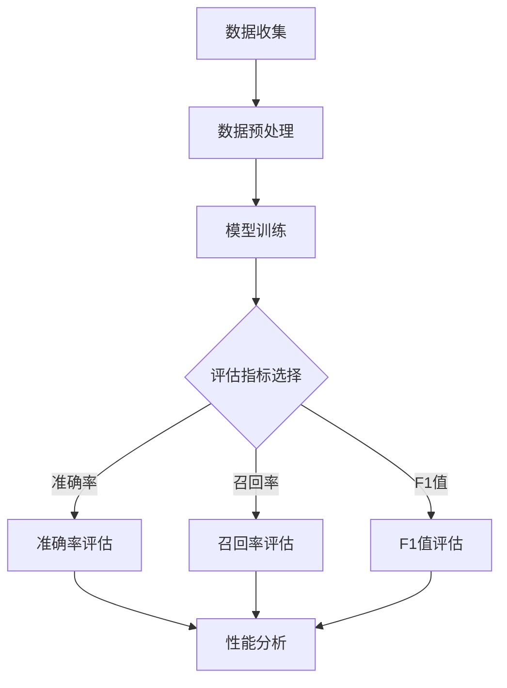

                 

### 第3章: 算法原理讲解

#### 3.1 多角度评测方法的基本原理

在LLM评测中，多角度评测方法的核心在于从多个维度对模型进行评估，以全面、客观地反映其性能。这些维度通常包括：

1. **语言理解能力**：评估模型是否能够准确理解和生成自然语言。
2. **泛化能力**：评估模型在不同数据集和任务上的表现，看其是否能够适应不同的场景。
3. **决策能力**：评估模型在处理不确定性问题和复杂任务时的决策质量、效率和稳定性。

#### 3.2 多角度评测方法的具体实现

##### 3.2.1 语言理解能力评测

语言理解能力的评测可以通过以下几种方式实现：

1. **文本分类**：使用预定义的标签集对文本进行分类，评估模型的分类准确率。
2. **语义分析**：通过语义相似度或语义距离来评估模型对文本语义的理解程度。
3. **情感分析**：评估模型是否能够准确识别文本的情感倾向。

具体实现步骤如下：

1. **数据准备**：收集大规模的文本数据集，并对其进行标注。
2. **模型训练**：使用标注数据训练语言模型。
3. **模型评估**：使用测试数据集评估模型的性能，计算准确率、召回率、F1值等指标。

##### 3.2.2 泛化能力评测

泛化能力的评测主要通过以下方法：

1. **交叉验证**：通过在不同数据集上多次训练和评估模型，评估其泛化能力。
2. **迁移学习**：评估模型在不同任务上的性能，看其是否能够迁移所学知识。
3. **多样性测试**：通过引入不同的数据分布和任务类型，评估模型的适应能力。

具体实现步骤如下：

1. **数据集准备**：准备多个具有不同特性或来源的数据集。
2. **模型训练**：在每个数据集上训练模型。
3. **模型评估**：在每个数据集上评估模型的性能，计算平均准确率等指标。

##### 3.2.3 决策能力评测

决策能力评测主要从以下几个方面进行：

1. **决策质量**：评估模型生成答案的正确性和合理性。
2. **决策效率**：评估模型在处理任务时的时间消耗。
3. **决策稳定性**：评估模型在不同场景下的稳定性。

具体实现步骤如下：

1. **数据准备**：收集包含不确定性问题和复杂任务的数据集。
2. **模型训练**：训练模型以解决不确定性问题和复杂任务。
3. **模型评估**：使用测试数据集评估模型的决策能力，计算决策质量、效率和稳定性等指标。

#### 3.3 评测流程图

使用Mermaid语法绘制评测流程图：

#### 3.4 数学模型与公式

在多角度评测中，常用的数学模型和公式包括：

1. **准确率（Accuracy）**：
   $$ Accuracy = \frac{TP + TN}{TP + TN + FP + FN} $$
   其中，TP为真阳性，TN为真阴性，FP为假阳性，FN为假阴性。

2. **召回率（Recall）**：
   $$ Recall = \frac{TP}{TP + FN} $$

3. **F1值（F1 Score）**：
   $$ F1 = 2 \times \frac{Precision \times Recall}{Precision + Recall} $$
   其中，Precision为精确率。

#### 3.5 举例说明

假设有一个文本分类任务，数据集中有1000条标注数据。其中，500条属于正类，500条属于负类。通过训练，模型在测试数据集上预测得到以下结果：

- 正类预测正确：450条
- 负类预测正确：475条

则：

1. **准确率**：
   $$ Accuracy = \frac{450 + 475}{1000} = 0.92 $$

2. **召回率**：
   $$ Recall_{\text{正类}} = \frac{450}{500} = 0.9 $$
   $$ Recall_{\text{负类}} = \frac{475}{500} = 0.95 $$

3. **F1值**：
   $$ F1_{\text{正类}} = 2 \times \frac{0.9 \times 0.9}{0.9 + 0.9} = 0.9 $$
   $$ F1_{\text{负类}} = 2 \times \frac{0.9 \times 0.95}{0.9 + 0.95} = 0.925 $$

通过上述指标，我们可以对模型在文本分类任务中的表现进行综合评估。如果需要进一步优化模型，可以分析每个指标的具体情况，针对性地调整模型的训练参数和结构。

---

在本文的第三部分，我们详细探讨了LLM评测中的多角度思考与决策能力测试的基本原理和具体实现方法。首先，我们从语言理解能力、泛化能力和决策能力三个角度介绍了多角度评测方法的基本原理。接着，通过具体实现步骤和数学模型，详细讲解了如何从这些角度评估LLM的性能。最后，通过一个文本分类任务的案例，展示了如何使用这些方法进行实际操作。

在下一部分中，我们将继续探讨LLM评测中的挑战和解决方案，以及如何在实际应用中应用这些评测方法。敬请期待。

