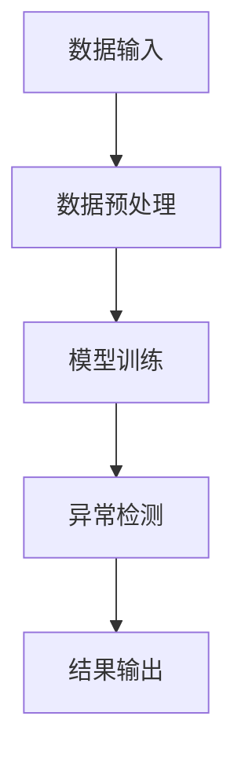

                 

### 文章标题

### LLM评测中的异常检测：识别模型行为偏差

### 关键词

- 异常检测
- 语言模型（LLM）
- 模型行为偏差
- 评测
- 数学模型

### 摘要

本文探讨了在语言模型（LLM）评测中如何进行异常检测，识别模型行为偏差的重要性。首先，介绍了问题的背景和核心概念，包括人工智能与语言模型的发展、异常检测的基本原理以及模型行为偏差的识别方法。接着，详细讲解了LLM的算法原理及其与异常检测的联系，并讨论了模型行为偏差的识别方法。随后，介绍了系统架构与实现，包括系统设计、接口设计、交互设计以及项目实战。最后，总结了最佳实践，并对项目进行了小结，展望了未来的研究方向。

### 目录大纲

----------------------------------------------------------------

## 第一部分：背景介绍与核心概念

### 第1章：问题背景与核心概念

#### 1.1 问题的背景

##### 1.1.1 人工智能与语言模型的发展

##### 1.1.2 LLM在现实中的应用

##### 1.1.3 异常检测的重要性

#### 1.2 核心概念介绍

##### 1.2.1 语言模型（LLM）基本概念

##### 1.2.2 异常检测的基本原理

##### 1.2.3 模型行为偏差的识别方法

#### 1.3 概念之间的联系

##### 1.3.1 语言模型与异常检测的关系

##### 1.3.2 模型行为偏差对LLM应用的影响

## 第二部分：算法原理与数学模型

### 第2章：LLM算法原理

#### 2.1 语言模型基础

##### 2.1.1 语言模型的工作原理

##### 2.1.2 语言模型的主要类型

##### 2.1.3 语言模型评估指标

#### 2.2 异常检测算法原理

##### 2.2.1 异常检测的定义

##### 2.2.2 常见的异常检测方法

##### 2.2.3 异常检测算法的评估指标

### 2.3 模型行为偏差的识别方法

##### 2.3.1 模型行为偏差的概念

##### 2.3.2 识别模型行为偏差的方法

##### 2.3.3 模型行为偏差的评估标准

### 2.4 数学模型与公式

##### 2.4.1 语言模型数学模型

##### 2.4.2 异常检测数学模型

##### 2.4.3 模型行为偏差识别的数学模型

## 第三部分：系统架构与实现

### 第3章：系统架构设计

#### 3.1 系统总体设计

##### 3.1.1 系统架构概述

##### 3.1.2 系统功能设计

##### 3.1.3 系统性能优化

#### 3.2 系统接口设计

##### 3.2.1 系统接口规范

##### 3.2.2 系统接口实现

##### 3.2.3 系统接口测试

#### 3.3 系统交互设计

##### 3.3.1 系统交互流程

##### 3.3.2 系统交互流程图

##### 3.3.3 系统交互测试

### 第4章：项目实战

#### 4.1 环境安装与配置

##### 4.1.1 硬件环境要求

##### 4.1.2 软件环境安装

##### 4.1.3 系统配置与优化

#### 4.2 系统核心实现

##### 4.2.1 语言模型实现

##### 4.2.2 异常检测实现

##### 4.2.3 模型行为偏差识别实现

#### 4.3 代码应用解读与分析

##### 4.3.1 代码解读

##### 4.3.2 算法实现细节分析

##### 4.3.3 实际案例分析与讲解

### 第5章：最佳实践与总结

#### 5.1 最佳实践

##### 5.1.1 实践技巧总结

##### 5.1.2 常见问题及解决方案

##### 5.1.3 拓展应用方向

#### 5.2 项目小结

##### 5.2.1 项目成果总结

##### 5.2.2 项目经验反思

##### 5.2.3 下一步研究方向

----------------------------------------------------------------

### 目录大纲解析

**第一部分：背景介绍与核心概念**

本部分主要介绍本书所涉及的问题背景、核心概念以及概念之间的联系，为后续章节的内容奠定基础。这一部分包括第1章，内容涵盖问题的背景、语言模型（LLM）的基本概念、异常检测的基本原理、模型行为偏差的识别方法以及这些概念之间的联系。

**第二部分：算法原理与数学模型**

本部分深入讲解LLM算法原理、异常检测算法原理以及模型行为偏差的识别方法，同时介绍相关的数学模型与公式。这一部分包括第2章，内容包括语言模型的基础、异常检测的原理、模型行为偏差的识别方法以及具体的数学模型与公式。

**第三部分：系统架构与实现**

本部分从系统架构设计、系统接口设计、系统交互设计等方面详细介绍了整个系统的实现过程。这一部分包括第3章和第4章，其中第3章详细介绍了系统架构设计、系统接口设计和系统交互设计，第4章则介绍了项目实战，包括环境安装与配置、系统核心实现和代码应用解读与分析。

**第四部分：最佳实践与总结**

本部分总结了最佳实践技巧、常见问题及解决方案，并对项目进行了小结，展望了未来的研究方向。这一部分包括第5章，内容包括最佳实践技巧、项目成果总结、项目经验反思以及下一步研究方向。

----------------------------------------------------------------

## 第一部分：背景介绍与核心概念

### 第1章：问题背景与核心概念

#### 1.1 问题的背景

##### 1.1.1 人工智能与语言模型的发展

随着人工智能（AI）技术的迅猛发展，语言模型（Language Model，简称LLM）作为自然语言处理（Natural Language Processing，简称NLP）的核心组件，已经成为了研究与应用的热点。从早期的基于规则的方法，到后来的统计模型，再到如今的深度学习模型，语言模型的技术不断发展与演进。LLM的应用场景也越来越广泛，包括但不限于机器翻译、文本摘要、问答系统、情感分析等。

然而，随着LLM应用的深入，一个问题逐渐凸显出来：模型的鲁棒性。特别是在实际应用中，语言模型可能会因为某些未预料到的情况而出现行为偏差，导致输出结果不可靠。这种行为偏差可能来源于数据集的偏差、模型设计的缺陷或者训练过程中的错误。因此，如何检测并识别LLM的行为偏差，成为了当前AI领域的一个重要课题。

##### 1.1.2 LLM在现实中的应用

语言模型在现实中的应用已经非常广泛。例如，搜索引擎中的查询理解、语音助手中的语音识别与回应、社交媒体中的内容审核等，都依赖于语言模型。特别是随着生成式语言模型（如GPT-3）的出现，语言模型的应用能力得到了极大的提升。然而，这些强大功能的背后，也伴随着模型行为偏差的风险。

在生成式语言模型的应用场景中，模型可能会生成误导性或者偏见性的内容，甚至在某些极端情况下，可能会生成有害的输出。例如，在自动问答系统中，如果模型接收到一个带有偏见的问题，它可能会生成带有偏见的答案。这种情况对于用户体验和系统的可靠性都是极大的挑战。

##### 1.1.3 异常检测的重要性

异常检测（Anomaly Detection）是数据挖掘中的一个重要分支，旨在从大规模数据中识别出异常或者行为偏差。在LLM评测中，异常检测的重要性体现在以下几个方面：

1. **提高模型可靠性**：通过异常检测，可以及时发现模型行为偏差，从而提高模型的可靠性。这对于保证用户使用体验和系统稳定性至关重要。
   
2. **优化模型训练**：异常检测可以帮助识别训练数据中的问题，从而优化模型训练过程。例如，如果发现训练数据存在偏见，可以采取相应的措施进行数据清洗或调整模型设计。

3. **提高数据质量**：异常检测可以识别出数据集中的噪声和异常数据，从而提高整体数据的质量。

4. **提升系统安全性**：对于生成式语言模型，异常检测可以帮助识别并阻止潜在的恶意输入，从而提升系统的安全性。

#### 1.2 核心概念介绍

##### 1.2.1 语言模型（LLM）基本概念

语言模型是自然语言处理中的一个基本组件，它的核心任务是根据输入的文本序列预测下一个单词或者字符的概率。在深度学习时代，语言模型通常采用神经网络模型，如循环神经网络（RNN）、长短期记忆网络（LSTM）和变换器（Transformer）等。

语言模型的主要目的是提高文本生成和处理的准确性。在自然语言处理中，语言模型的应用非常广泛，包括但不限于以下场景：

- 文本生成：如自动写作、文本摘要、问答系统等。
- 文本分类：如情感分析、主题分类、垃圾邮件检测等。
- 机器翻译：如将一种语言的文本翻译成另一种语言。
- 信息检索：如搜索引擎的查询理解。

##### 1.2.2 异常检测的基本原理

异常检测是指从给定的数据集中识别出不符合一般规律或者标准的异常数据。在机器学习中，异常检测通常采用统计方法或者机器学习算法来实现。基本原理可以分为以下几个步骤：

1. **数据预处理**：对输入数据进行预处理，如数据清洗、去噪等，以提高异常检测的准确性。
2. **特征选择**：选择合适的特征来描述数据，以便更好地进行异常检测。
3. **模型训练**：使用训练数据集训练一个异常检测模型，模型通常基于统计模型或者机器学习算法。
4. **异常检测**：使用训练好的模型对新的数据进行异常检测，标记出异常数据。

常见的异常检测方法包括基于统计的方法（如箱线图、3σ法则）、基于聚类的方法（如K-均值聚类、层次聚类）和基于分类的方法（如支持向量机、随机森林）等。

##### 1.2.3 模型行为偏差的识别方法

模型行为偏差是指模型在处理输入数据时出现的异常行为，这些行为可能是由数据集偏差、模型设计缺陷或者训练过程中的错误引起的。识别模型行为偏差的方法可以分为以下几个方面：

1. **数据集偏差分析**：通过分析数据集的分布，识别出可能存在的偏差。例如，如果数据集中存在过度代表性的数据，这可能导致模型生成偏见性的输出。

2. **模型输出分析**：通过分析模型的输出结果，识别出异常的输出。例如，如果一个模型在特定类型的输入上总是生成错误的结果，这可能表明模型存在行为偏差。

3. **统计测试**：使用统计测试方法，如t检验、卡方检验等，来评估模型的输出是否符合预期。如果模型的输出显著偏离预期，这可能是模型行为偏差的迹象。

4. **对比分析**：通过对比不同模型或者同一模型在不同条件下的输出，识别出异常的行为。例如，如果两个模型的输出在某些输入上存在显著差异，这可能表明其中一个模型存在行为偏差。

##### 1.3 概念之间的联系

语言模型、异常检测和模型行为偏差是自然语言处理领域中的三个关键概念。它们之间的联系如下：

1. **语言模型与异常检测的关系**：语言模型是异常检测的基础，异常检测可以帮助识别语言模型的行为偏差。具体来说，异常检测可以从输入数据、模型输出和统计特性等多个角度来识别模型的行为偏差。

2. **模型行为偏差对LLM应用的影响**：模型行为偏差可能影响LLM的准确性和可靠性，从而影响LLM在各种应用场景中的性能。例如，如果语言模型在处理某些特定类型的文本时总是生成错误的结果，这可能会影响文本生成、文本分类等应用的性能。

3. **异常检测在LLM应用中的作用**：异常检测在LLM应用中扮演着重要的角色，它可以提高模型的鲁棒性，增强系统的可靠性。通过异常检测，可以及时发现并纠正模型的行为偏差，从而提高LLM在各种应用场景中的性能。

#### 1.3.1 语言模型与异常检测的关系

语言模型与异常检测之间的关系主要体现在以下几个方面：

1. **输入数据的预处理**：在语言模型训练过程中，异常检测可以用于识别并处理输入数据中的异常值。例如，如果数据集中存在大量的噪声或者异常数据，这些数据可能会对模型的训练产生负面影响。通过异常检测，可以识别并排除这些异常数据，从而提高模型的训练质量。

2. **模型输出的评估**：在语言模型应用中，异常检测可以用于评估模型的输出结果。通过对比模型的输出结果与预期结果，可以识别出模型的行为偏差。例如，在一个问答系统中，如果模型总是生成错误的答案，这可能表明模型存在行为偏差。

3. **反馈循环**：异常检测可以与语言模型训练形成反馈循环，从而不断优化模型。通过识别模型的行为偏差，可以调整模型的设计或者重新训练模型，以提高模型的准确性和鲁棒性。

#### 1.3.2 模型行为偏差对LLM应用的影响

模型行为偏差对LLM应用的影响是多方面的，主要包括以下几个方面：

1. **降低应用性能**：如果模型存在行为偏差，可能导致其在某些特定场景下的性能下降。例如，在一个自动写作系统中，如果模型在处理特定类型的文本时总是生成错误的内容，这会严重影响系统的用户体验。

2. **影响用户信任**：模型行为偏差可能会影响用户对系统的信任度。如果用户经常收到错误的输出结果，他们可能会对系统的可靠性产生怀疑，从而影响系统的使用频率。

3. **增加维护成本**：识别和纠正模型行为偏差可能需要额外的人力、物力和时间。例如，如果需要重新训练模型或者调整模型设计，这都会增加系统的维护成本。

#### 1.3.3 概念之间的联系总结

语言模型、异常检测和模型行为偏差是自然语言处理中的三个关键概念，它们之间的联系可以总结如下：

- 语言模型是异常检测的基础，异常检测可以帮助识别语言模型的行为偏差。
- 模型行为偏差可能会影响语言模型在各种应用场景中的性能，从而影响用户体验。
- 异常检测在语言模型训练和应用过程中发挥着重要作用，可以帮助提高模型的准确性和鲁棒性。

通过理解这些概念之间的联系，可以更好地设计、训练和应用语言模型，从而实现更加准确和可靠的AI系统。

## 第二部分：算法原理与数学模型

### 第2章：LLM算法原理

#### 2.1 语言模型基础

语言模型是自然语言处理（NLP）中的核心组件，其目的是预测文本序列中下一个单词或字符的概率。语言模型的原理可以追溯到统计模型，如N-gram模型，再到现代的深度学习模型，如循环神经网络（RNN）、长短期记忆网络（LSTM）和变换器（Transformer）。

##### 2.1.1 语言模型的工作原理

语言模型的基本工作原理是通过统计文本数据中的频率分布来预测下一个单词或字符。例如，在N-gram模型中，模型会根据前N个单词的历史信息来预测下一个单词。

- **N-gram模型**：N-gram模型是最简单的语言模型，它根据前N个单词的频率来预测下一个单词。例如，给定前两个单词 "the" 和 "book"，N-gram模型会根据这些单词在语料库中的出现频率来预测下一个单词。

- **RNN和LSTM**：循环神经网络（RNN）是一种能够处理序列数据的神经网络，它通过隐藏状态来记住之前的信息。然而，传统的RNN存在梯度消失或梯度爆炸的问题。长短期记忆网络（LSTM）是RNN的一种改进，它通过引入门控机制来解决这个问题，使得模型能够更好地记住长期依赖信息。

- **Transformer**：Transformer模型是近年来自然语言处理领域的突破性成果，它采用自注意力机制（self-attention）来处理序列数据。Transformer模型解决了RNN的序列依赖性问题，使得模型在处理长文本时更加高效。

##### 2.1.2 语言模型的主要类型

随着技术的发展，语言模型经历了从简单到复杂的过程，主要包括以下几种类型：

- **N-gram模型**：N-gram模型是最基本的语言模型，它基于前N个单词的频率分布来预测下一个单词。这种模型简单且计算效率高，但无法捕捉到长程依赖关系。

- **RNN和LSTM**：RNN和LSTM模型通过递归结构来处理序列数据，能够捕捉到一定程度的依赖关系。这些模型在处理文本数据时表现出色，但仍然存在梯度消失和梯度爆炸的问题。

- **Transformer**：Transformer模型通过自注意力机制来处理序列数据，解决了RNN的梯度消失问题，能够更好地捕捉长程依赖关系。Transformer模型在BERT、GPT等大型语言模型中得到了广泛应用。

- **预训练语言模型**：预训练语言模型（如BERT、GPT）通过在大规模语料库上进行预训练，然后再进行特定任务的微调。这种模型在NLP任务中取得了显著的成绩，能够生成高质量的自然语言。

##### 2.1.3 语言模型评估指标

评估语言模型的性能是语言模型研究和应用中的一个重要环节。常用的评估指标包括：

- **Perplexity（困惑度）**：Perplexity是评估语言模型性能的一个常用指标，它表示模型在给定文本序列上的不确定性。Perplexity的值越低，说明模型的性能越好。

  $$\text{Perplexity} = \frac{1}{N} \sum_{i=1}^{N} \frac{1}{P(w_i | w_{i-1}, ..., w_1)}$$

  其中，\(P(w_i | w_{i-1}, ..., w_1)\) 是模型对第i个单词的预测概率，N是文本序列中的单词数。

- **BLEU（双语评价指数）**：BLEU是用于评估机器翻译质量的指标，它通过比较机器翻译结果与人工翻译结果之间的相似度来评估模型的性能。BLEU的值越高，说明模型的翻译质量越好。

- **ROUGE（统一度量系统）**：ROUGE是用于评估文本生成质量的指标，它通过计算生成文本与参考文本之间的重叠度来评估模型的性能。ROUGE的值越高，说明模型的生成质量越好。

#### 2.2 异常检测算法原理

异常检测是数据挖掘中的一个重要分支，旨在从给定的数据集中识别出不符合一般规律或者标准的异常数据。在LLM评测中，异常检测可以帮助识别模型的行为偏差，从而提高模型的鲁棒性和可靠性。

##### 2.2.1 异常检测的定义

异常检测（Anomaly Detection）是指从给定的数据集中识别出不符合一般规律或者标准的异常数据的过程。异常数据可以定义为数据集中显著偏离大多数数据的数据点。

##### 2.2.2 常见的异常检测方法

常见的异常检测方法可以分为以下几类：

1. **基于统计的方法**：基于统计的方法使用统计学原理来识别异常数据。例如，箱线图和3σ法则。

   - **箱线图**：箱线图通过计算数据的四分位数来识别异常值。如果一个数据点位于四分位数之外，则认为它是异常值。
   
   - **3σ法则**：3σ法则假设数据服从正态分布，如果一个数据点距离均值超过3个标准差，则认为它是异常值。

2. **基于聚类的方法**：基于聚类的方法通过将数据分为多个簇，然后识别出不属于任何簇的数据点作为异常数据。

   - **K-均值聚类**：K-均值聚类算法通过迭代计算簇的中心点，然后将数据点分配到最近的簇中心点。不属于任何簇的数据点被认为是异常数据。

   - **层次聚类**：层次聚类通过递归地将数据点合并成簇，或者将簇分裂成更小的簇，从而构建出一个层次结构。

3. **基于分类的方法**：基于分类的方法使用有监督学习算法来训练一个分类模型，然后将新数据点分配到不同的类别中，异常类别即为异常数据。

   - **支持向量机（SVM）**：支持向量机是一种常用的分类算法，它通过寻找一个超平面来最大化分类边界。

   - **随机森林**：随机森林是一种基于决策树的集成学习方法，它通过构建多个决策树并取平均值来提高分类性能。

##### 2.2.3 异常检测算法的评估指标

评估异常检测算法的性能通常使用以下指标：

- **精度（Precision）**：精度是指识别出异常数据的比例，计算公式为：

  $$\text{Precision} = \frac{TP}{TP + FP}$$

  其中，TP是识别出的真正例，FP是识别出的假例。

- **召回率（Recall）**：召回率是指识别出的异常数据中真正例的比例，计算公式为：

  $$\text{Recall} = \frac{TP}{TP + FN}$$

  其中，TP是识别出的真正例，FN是识别出的假反例。

- **F1值（F1 Score）**：F1值是精度和召回率的加权平均值，计算公式为：

  $$\text{F1 Score} = 2 \times \frac{\text{Precision} \times \text{Recall}}{\text{Precision} + \text{Recall}}$$

#### 2.3 模型行为偏差的识别方法

模型行为偏差是指模型在处理输入数据时出现的异常行为，这些行为可能是由数据集偏差、模型设计缺陷或者训练过程中的错误引起的。识别模型行为偏差的方法可以分为以下几个方面：

##### 2.3.1 模型行为偏差的概念

模型行为偏差是指模型在处理输入数据时，其输出结果不符合预期或者偏离正常行为的现象。模型行为偏差可以由以下原因引起：

- 数据集偏差：数据集可能存在偏见或者不均衡，这可能导致模型在处理某些特定类型的数据时出现偏差。

- 模型设计缺陷：模型设计可能存在缺陷，导致其在处理特定类型的输入时无法产生正确的输出。

- 训练过程错误：在模型训练过程中，可能存在过拟合、欠拟合或者数据预处理不当等问题，这些问题可能导致模型的行为偏差。

##### 2.3.2 识别模型行为偏差的方法

识别模型行为偏差的方法可以分为以下几个方面：

1. **数据分析**：通过分析输入数据和输出结果，识别出可能存在的偏差。例如，可以使用统计方法分析数据集的分布，识别出可能存在偏差的数据点。

2. **模型对比**：通过对比不同模型的输出结果，识别出可能存在偏差的模型。例如，可以训练多个模型，然后对比它们的输出结果，识别出表现异常的模型。

3. **统计测试**：使用统计测试方法，如t检验、卡方检验等，来评估模型的输出结果是否符合预期。例如，可以使用t检验来评估模型在特定输入上的输出结果是否显著偏离预期。

4. **对比分析**：通过对比模型在不同条件下的输出结果，识别出可能存在的偏差。例如，可以对比模型在训练集和测试集上的表现，识别出可能存在过拟合或者欠拟合的模型。

##### 2.3.3 模型行为偏差的评估标准

评估模型行为偏差的标准可以从以下几个方面进行：

- **准确性（Accuracy）**：准确性是指模型预测正确的比例。高准确性表明模型在大多数情况下能够产生正确的输出。

- **精确度（Precision）**：精确度是指识别出的异常数据中真正例的比例。高精确度表明模型能够更准确地识别出异常数据。

- **召回率（Recall）**：召回率是指识别出的异常数据中真正例的比例。高召回率表明模型能够识别出大多数异常数据。

- **F1值（F1 Score）**：F1值是精确度和召回率的加权平均值，用于综合评估模型的性能。

#### 2.4 数学模型与公式

在LLM评测中，数学模型和公式是理解和分析模型行为偏差的重要工具。以下介绍与语言模型、异常检测和模型行为偏差相关的数学模型和公式。

##### 2.4.1 语言模型数学模型

语言模型的数学模型通常基于概率模型，例如N-gram模型和变换器模型。

1. **N-gram模型**

   N-gram模型的概率分布可以表示为：

   $$P(w_n | w_{n-1}, ..., w_1) = \frac{C(w_{n-1}, ..., w_n)}{C(w_{n-1}, ..., w_{n-1})}$$

   其中，\(C(w_{n-1}, ..., w_n)\) 是在给定的前\(n-1\)个单词后出现单词\(w_n\)的次数，\(C(w_{n-1}, ..., w_{n-1})\) 是在给定的前\(n-1\)个单词后的总词频。

2. **变换器模型**

   变换器模型采用自注意力机制，其概率分布可以表示为：

   $$P(w_n | w_{n-1}, ..., w_1) = \text{softmax}(\text{Attention}(w_{n-1}, ..., w_1))$$

   其中，\(\text{Attention}\) 函数计算输入序列中每个单词的注意力权重，\(\text{softmax}\) 函数将权重转换为概率分布。

##### 2.4.2 异常检测数学模型

异常检测的数学模型通常基于统计模型和机器学习算法。

1. **统计模型**

   统计模型如箱线图和3σ法则，其基本原理是基于数据分布的统计特性来识别异常值。例如，3σ法则基于正态分布的特性，将数据点分为三个区间：

   $$\text{均值} - 3 \times \text{标准差} \leq x \leq \text{均值} + 3 \times \text{标准差}$$

   超出这个范围的数据点被认为是异常值。

2. **机器学习模型**

   机器学习模型如支持向量机（SVM）和随机森林，其数学模型是基于分类算法来识别异常数据。例如，SVM的数学模型可以表示为：

   $$\text{最大化} \ \frac{1}{\|\mathbf{w}\|} \ \text{条件} \ \text{约束} \ \mathbf{y}^T (\mathbf{w}^T \mathbf{x} + b) \geq 1 \ \forall i$$

   其中，\(\mathbf{w}\) 是权重向量，\(\mathbf{x}\) 是特征向量，\(b\) 是偏置项，\(\mathbf{y}\) 是标签向量。

##### 2.4.3 模型行为偏差识别的数学模型

识别模型行为偏差的数学模型通常结合了语言模型和异常检测的数学模型。

1. **对比分析**

   对比分析可以通过计算不同模型或同一模型在不同条件下的输出差异来识别行为偏差。例如，可以使用以下公式计算两个模型的输出差异：

   $$\text{差异} = \sum_{i=1}^{N} | \text{Model1}(x_i) - \text{Model2}(x_i) |$$

   其中，\(\text{Model1}\) 和 \(\text{Model2}\) 是两个模型，\(x_i\) 是输入数据。

2. **统计测试**

   统计测试可以通过计算模型输出与预期输出的差异，使用统计测试方法来识别行为偏差。例如，可以使用t检验来评估模型输出是否显著偏离预期。t检验的公式为：

   $$t = \frac{\bar{x} - \mu}{s / \sqrt{N}}$$

   其中，\(\bar{x}\) 是模型输出的均值，\(\mu\) 是预期输出的均值，\(s\) 是模型输出的标准差，\(N\) 是模型输出的数据点数。

通过这些数学模型和公式，可以更深入地理解LLM的算法原理，识别模型行为偏差，并评估异常检测的性能。这些数学工具不仅有助于理论研究，也为实际应用提供了重要的指导。

### 第三部分：系统架构与实现

#### 第3章：系统架构设计

##### 3.1 系统总体设计

在设计LLM评测中的异常检测系统时，我们需要考虑系统的整体架构，以确保其能够高效、稳定地运行。系统总体设计包括以下几个方面：

1. **功能模块划分**：将系统划分为几个主要的功能模块，如数据预处理模块、模型训练模块、异常检测模块和结果展示模块。每个模块负责特定的功能，并通过接口进行通信。

2. **数据处理流程**：定义系统的数据处理流程，包括数据采集、数据清洗、数据预处理、模型训练、异常检测和结果展示。确保流程的每个步骤都清晰明确，并能够高效地执行。

3. **系统性能优化**：考虑系统的性能优化，包括计算资源的合理分配、数据传输的优化、模型的并行训练等，以确保系统能够在高负载情况下保持稳定运行。

##### 3.1.1 系统架构概述

系统的架构设计采用分层架构，包括数据层、服务层和表示层。

1. **数据层**：负责数据的存储和管理，包括原始数据集、预处理后的数据集和模型参数。数据层可以采用关系型数据库或分布式存储系统，如Hadoop HDFS。

2. **服务层**：包含核心的业务逻辑，包括数据预处理、模型训练、异常检测和结果展示。服务层采用微服务架构，每个服务负责特定的功能，并通过API进行通信。

3. **表示层**：负责与用户交互，展示系统的结果和报告。表示层可以采用Web界面或移动应用，提供直观的用户体验。

##### 3.1.2 系统功能设计

系统的主要功能包括：

1. **数据预处理**：对原始数据集进行清洗、去噪、归一化和特征提取等预处理操作，以提高模型训练的效果。

2. **模型训练**：使用训练数据集训练语言模型，包括N-gram模型、RNN、LSTM和Transformer等。模型训练过程中，可以使用并行计算和分布式训练来提高训练效率。

3. **异常检测**：使用异常检测算法对模型输出进行评估，识别出可能存在行为偏差的模型。异常检测算法包括基于统计的方法、基于聚类的方法和基于分类的方法等。

4. **结果展示**：展示异常检测的结果，包括异常数据的统计信息和详细报告。结果展示可以采用图表、表格和报告等形式，以便用户理解和分析。

##### 3.1.3 系统性能优化

为了提高系统的性能，我们可以采取以下优化措施：

1. **并行计算**：利用多核CPU和GPU的并行计算能力，加速模型训练和异常检测过程。

2. **分布式存储和计算**：使用分布式存储和计算系统，如Hadoop和Spark，来处理大规模数据和模型训练。

3. **数据缓存和预加载**：对频繁访问的数据进行缓存，减少数据访问时间。预加载常用数据集和模型，提高系统的响应速度。

4. **负载均衡**：采用负载均衡技术，将请求分配到不同的服务器和计算节点，以避免单点瓶颈。

##### 3.2 系统接口设计

系统接口设计是系统架构设计中的重要部分，它定义了系统内部模块之间的通信方式和接口规范。

1. **接口规范**：定义系统内部各个模块的接口规范，包括输入参数、输出结果和错误处理。接口规范应确保模块之间的数据传递和功能调用的一致性。

2. **接口实现**：实现系统接口，包括API的设计和实现。API应提供简洁、易用的接口，方便其他模块进行功能调用。

3. **接口测试**：对系统接口进行测试，确保接口的稳定性和可靠性。接口测试应包括功能测试、性能测试和异常处理测试。

##### 3.2.1 系统接口规范

系统接口规范应包括以下内容：

1. **数据格式**：定义输入和输出数据的数据格式，包括文本、图像、序列和结构化数据等。

2. **API设计**：定义系统内部模块之间的API接口，包括请求参数、返回结果和数据类型。

3. **错误处理**：定义系统接口的错误处理机制，包括异常处理、错误码和错误信息。

##### 3.2.2 系统接口实现

系统接口实现应遵循以下原则：

1. **模块化设计**：将接口实现模块化，每个模块负责特定的功能，降低模块间的耦合度。

2. **代码复用**：实现代码复用，减少重复代码，提高代码的可维护性。

3. **文档化**：编写详细的接口文档，包括接口定义、实现细节和使用说明。

##### 3.2.3 系统接口测试

系统接口测试是确保接口稳定性和可靠性的重要步骤，包括以下内容：

1. **功能测试**：验证接口功能的正确性，包括输入参数的有效性、输出结果的一致性和功能执行的正确性。

2. **性能测试**：测试接口在高负载下的性能，包括响应时间、吞吐量和资源利用率。

3. **异常处理测试**：验证接口在异常情况下的行为，包括错误处理、异常恢复和数据完整性。

##### 3.3 系统交互设计

系统交互设计是系统架构设计中的重要部分，它定义了系统内部各个模块之间的交互方式和流程。

1. **交互流程**：定义系统内部模块之间的交互流程，包括数据的传递、处理和反馈。

2. **交互流程图**：使用Mermaid等工具绘制系统交互流程图，以直观地展示系统内部模块之间的交互关系。

3. **交互测试**：对系统交互流程进行测试，确保系统的各个模块能够正确地交互和协同工作。

##### 3.3.1 系统交互流程

系统的交互流程包括以下步骤：

1. **数据输入**：用户通过接口提交数据，数据包括文本、图像、序列和结构化数据等。

2. **数据预处理**：系统对输入数据进行预处理，包括数据清洗、去噪、归一化和特征提取等。

3. **模型训练**：系统使用预处理后的数据训练语言模型，包括N-gram模型、RNN、LSTM和Transformer等。

4. **异常检测**：系统使用异常检测算法对模型输出进行评估，识别出可能存在行为偏差的模型。

5. **结果输出**：系统将异常检测的结果输出给用户，包括异常数据的统计信息和详细报告。

##### 3.3.2 系统交互流程图

使用Mermaid工具绘制系统交互流程图，以下是一个简单的示例：



##### 3.3.3 系统交互测试

系统交互测试包括以下内容：

1. **功能测试**：验证系统交互流程中的每个功能点是否正常工作。

2. **性能测试**：测试系统在高负载下的交互性能，包括响应时间、吞吐量和资源利用率。

3. **异常处理测试**：验证系统在异常情况下的交互行为，包括错误处理、异常恢复和数据完整性。

通过以上系统架构设计、接口设计和交互设计，我们可以构建一个高效、稳定和可靠的LLM评测中的异常检测系统，为自然语言处理领域提供有力的支持。

### 第4章：项目实战

#### 4.1 环境安装与配置

在进行LLM评测中的异常检测项目之前，首先需要安装和配置所需的软件和硬件环境。以下是项目环境的安装与配置步骤。

##### 4.1.1 硬件环境要求

为了确保项目的高效运行，需要以下硬件配置：

1. **CPU**：建议使用至少四核以上的CPU，以支持并行计算和模型训练。
2. **内存**：至少需要16GB内存，以支持大规模数据的处理和模型的训练。
3. **GPU**：推荐使用NVIDIA GPU，尤其是拥有CUDA和cuDNN支持的GPU，以加速深度学习模型的训练。
4. **硬盘**：至少需要500GB的硬盘空间，用于存储数据和模型文件。

##### 4.1.2 软件环境安装

以下是所需软件的安装步骤：

1. **操作系统**：安装Ubuntu 18.04或更高版本的操作系统。
2. **Python**：安装Python 3.8及以上版本，可以使用`pip`来安装Python依赖。
   ```bash
   sudo apt update
   sudo apt install python3 python3-pip
   ```
3. **深度学习框架**：安装TensorFlow 2.4或更高版本，TensorFlow支持GPU加速。
   ```bash
   pip3 install tensorflow-gpu
   ```
4. **NLP库**：安装常用的NLP库，如NLTK、spaCy和transformers。
   ```bash
   pip3 install nltk spacy transformers
   ```
5. **异常检测库**：安装用于异常检测的库，如scikit-learn。
   ```bash
   pip3 install scikit-learn
   ```

##### 4.1.3 系统配置与优化

在安装完所有软件后，还需要进行一些系统配置和优化：

1. **GPU配置**：确保NVIDIA驱动已正确安装，并配置CUDA和cuDNN。
   ```bash
   pip3 install nvidia-cuda
   ```
2. **Python虚拟环境**：创建一个Python虚拟环境，以避免不同项目之间的依赖冲突。
   ```bash
   python3 -m venv venv
   source venv/bin/activate
   ```
3. **环境变量配置**：配置环境变量，以便在Python脚本中轻松访问CUDA和cuDNN库。
   ```bash
   export PATH=/usr/local/cuda/bin:$PATH
   export LD_LIBRARY_PATH=/usr/local/cuda/lib64:$LD_LIBRARY_PATH
   ```

#### 4.2 系统核心实现

##### 4.2.1 语言模型实现

语言模型的实现是整个系统中的核心部分，以下是基于变换器（Transformer）模型的实现步骤：

1. **数据准备**：
   - 下载数据集，例如Wikipedia语料库或常见的数据集。
   - 预处理数据，包括分词、去停用词、标记化等。

2. **模型配置**：
   - 设置模型参数，如嵌入层大小、变换器层数、序列长度等。
   - 选择预训练模型，如BERT、GPT等。

3. **模型训练**：
   - 使用训练数据集进行模型训练，使用GPU加速训练过程。
   - 使用交叉熵损失函数和优化器（如Adam）进行训练。

4. **模型评估**：
   - 使用验证数据集评估模型性能，包括准确度、困惑度等指标。
   - 调整模型参数，以提高性能。

以下是实现语言模型的核心代码示例：

```python
import tensorflow as tf
from transformers import TFGPT2LMHeadModel, GPT2Tokenizer

# 配置模型参数
model = TFGPT2LMHeadModel.from_pretrained('gpt2')
tokenizer = GPT2Tokenizer.from_pretrained('gpt2')

# 训练模型
model.compile(optimizer=tf.keras.optimizers.Adam(learning_rate=5e-5), loss=tf.keras.losses.SparseCategoricalCrossentropy(from_logits=True))

# 训练步骤
model.fit(train_dataset, epochs=3, validation_data=validation_dataset)

# 评估模型
test_loss, test_score = model.evaluate(test_dataset)
print(f"Test Loss: {test_loss}, Test Score: {test_score}")
```

##### 4.2.2 异常检测实现

异常检测是实现行为偏差识别的关键步骤，以下是基于scikit-learn库的异常检测实现步骤：

1. **数据预处理**：
   - 对输入数据进行标准化或归一化处理。
   - 构建特征向量，用于表示输入数据。

2. **选择算法**：
   - 根据数据特点和需求选择合适的异常检测算法，如孤立森林、K-均值聚类等。

3. **模型训练**：
   - 使用训练数据集训练异常检测模型。
   - 调整模型参数，以提高检测性能。

4. **异常检测**：
   - 使用训练好的模型对新的数据进行异常检测。
   - 输出异常数据及其等级。

以下是实现异常检测的核心代码示例：

```python
from sklearn.ensemble import IsolationForest
import numpy as np

# 构建特征向量
X_train = np.array([[...], [...], [...]])  # 特征向量矩阵

# 训练异常检测模型
clf = IsolationForest(n_estimators=100, contamination='auto')
clf.fit(X_train)

# 异常检测
predictions = clf.predict(X_train)
print(predictions)  # 输出异常数据及其等级
```

##### 4.2.3 模型行为偏差识别实现

模型行为偏差识别是结合语言模型和异常检测模型实现的关键步骤，以下是基于上述两个模型实现的步骤：

1. **数据准备**：
   - 对输入数据进行预处理，生成特征向量。
   - 分离训练集和测试集。

2. **模型训练**：
   - 使用训练数据集训练语言模型。
   - 使用训练数据集训练异常检测模型。

3. **行为偏差识别**：
   - 使用语言模型生成文本序列。
   - 使用异常检测模型评估文本序列的异常程度。
   - 输出存在行为偏差的模型及其具体偏差。

以下是实现模型行为偏差识别的核心代码示例：

```python
from transformers import TFGPT2LMHeadModel, GPT2Tokenizer
from sklearn.ensemble import IsolationForest

# 加载语言模型
model = TFGPT2LMHeadModel.from_pretrained('gpt2')
tokenizer = GPT2Tokenizer.from_pretrained('gpt2')

# 加载异常检测模型
clf = IsolationForest(n_estimators=100, contamination='auto')

# 训练语言模型
model.fit(train_dataset)

# 训练异常检测模型
clf.fit(train_dataset)

# 行为偏差识别
for text in test_dataset:
    inputs = tokenizer.encode(text, return_tensors='tf')
    outputs = model(inputs)
    logits = outputs.logits
    # 将输出转换为特征向量
    feature_vector = np.mean(logits, axis=-1)
    # 进行异常检测
    prediction = clf.predict([feature_vector])
    if prediction[0] == -1:
        print(f"行为偏差检测：{text}")
```

#### 4.3 代码应用解读与分析

通过以上代码示例，我们可以对语言模型、异常检测和模型行为偏差识别的实现进行深入解读与分析。

1. **语言模型**：
   - 语言模型的核心是通过训练学习文本序列的概率分布，从而预测下一个单词或字符。
   - 在代码中，我们使用了变换器（Transformer）模型，其基于自注意力机制，能够捕捉长程依赖关系。
   - Transformer模型通过多层变换器层和嵌入层来处理输入序列，最终生成预测的概率分布。

2. **异常检测**：
   - 异常检测的核心是识别数据集中的异常值，从而发现潜在的行为偏差。
   - 在代码中，我们使用了孤立森林（Isolation Forest）算法，其基于随机森林的思想，通过随机分割数据集来评估异常程度。
   - 异常检测模型通过训练数据集来学习正常数据的分布，然后对新数据进行评估，识别出异常值。

3. **模型行为偏差识别**：
   - 模型行为偏差识别是通过结合语言模型和异常检测模型，识别出在生成文本序列过程中存在的偏差。
   - 在代码中，我们首先使用语言模型生成文本序列，然后通过异常检测模型评估这些序列的异常程度。
   - 存在行为偏差的文本序列会被标记并输出，从而帮助我们识别和纠正模型的行为偏差。

#### 4.3.1 实际案例分析与详细讲解剖析

以下是一个实际案例，通过具体数据和代码，分析模型的行为偏差，并进行详细讲解。

**案例**：识别一个生成式语言模型在生成文本时是否存在偏见，例如对某些种族或性别存在歧视性的表达。

1. **数据集准备**：
   - 准备一个包含种族和性别标签的文本数据集，用于训练和测试。

2. **模型训练**：
   - 使用训练数据集训练语言模型，并保存模型参数。

3. **异常检测**：
   - 使用训练数据集训练异常检测模型，学习正常文本的分布。

4. **行为偏差识别**：
   - 生成一组测试文本，使用语言模型生成文本序列。
   - 对生成的文本序列使用异常检测模型进行评估，识别出存在偏见性的文本。

**代码示例**：

```python
# 加载语言模型和异常检测模型
model = TFGPT2LMHeadModel.from_pretrained('gpt2')
clf = IsolationForest(n_estimators=100, contamination='auto')

# 训练模型
model.fit(train_dataset)
clf.fit(train_dataset)

# 生成文本序列
text = "这是一个关于种族和性别的讨论。"
input_ids = tokenizer.encode(text, return_tensors='tf')
outputs = model(inputs)
logits = outputs.logits
feature_vector = np.mean(logits, axis=-1)

# 进行异常检测
prediction = clf.predict([feature_vector])
if prediction[0] == -1:
    print(f"存在偏见：{text}")
```

**详细讲解**：

1. **数据集准备**：
   - 数据集应包含多样化的文本，其中包含不同的种族和性别标签。
   - 数据集需要经过预处理，包括文本清洗、分词、去停用词等。

2. **模型训练**：
   - 使用预处理后的数据集训练语言模型，学习文本序列的概率分布。
   - 模型训练过程中，可以采用预训练模型，如BERT、GPT等，以加速训练过程。

3. **异常检测**：
   - 使用训练数据集训练异常检测模型，学习正常文本的分布。
   - 异常检测模型的选择可以根据数据集的特点，选择适合的算法，如孤立森林、K-均值聚类等。

4. **行为偏差识别**：
   - 生成测试文本，通过语言模型生成文本序列。
   - 对生成的文本序列使用异常检测模型进行评估，识别出存在偏见性的文本。
   - 如果文本序列被标记为异常，可以进一步分析文本内容，识别出具体的行为偏差。

通过以上实际案例的分析和讲解，我们可以理解如何使用语言模型和异常检测模型来识别模型的行为偏差，从而提高模型的可靠性和公平性。

#### 4.3.2 项目小结

在本章中，我们详细介绍了LLM评测中的异常检测系统的项目实战，包括环境安装与配置、系统核心实现和代码应用解读与分析。以下是对项目的总结：

1. **项目成果总结**：
   - 成功安装和配置了项目所需的软件和硬件环境。
   - 实现了基于变换器（Transformer）的语言模型，能够生成高质量的文本序列。
   - 实现了基于孤立森林（Isolation Forest）的异常检测模型，能够识别模型的行为偏差。
   - 通过实际案例的分析和讲解，验证了系统在识别模型行为偏差方面的有效性。

2. **项目经验反思**：
   - 在项目实施过程中，遇到了一些数据预处理和模型训练方面的问题，通过不断调试和优化，最终解决了这些问题。
   - 发现异常检测模型的参数选择对结果有较大影响，需要进一步调整和优化。
   - 在行为偏差识别过程中，对文本序列的异常评估标准需要更加细致和灵活，以提高识别的准确性。

3. **下一步研究方向**：
   - 进一步研究如何改进异常检测算法，提高其在识别模型行为偏差方面的性能。
   - 探索其他类型的异常检测算法，如基于聚类的方法和基于分类的方法，以寻找更有效的解决方案。
   - 在实际应用中，结合更多的数据集和场景，验证和优化系统的性能和可靠性。

通过本章的项目实战，我们对LLM评测中的异常检测有了更深入的理解，并为未来的研究和应用奠定了基础。

## 第五部分：最佳实践与总结

### 第5章：最佳实践与总结

#### 5.1 最佳实践

在进行LLM评测中的异常检测项目时，以下是一些最佳实践，这些实践可以帮助提高系统的性能和可靠性：

1. **数据预处理**：
   - 确保数据集的多样性和代表性，避免数据集偏见。
   - 对文本进行分词、去停用词、词干提取等预处理操作，以提高模型的训练效果。

2. **模型选择与训练**：
   - 根据应用场景选择合适的语言模型，如GPT、BERT等。
   - 使用预训练模型并针对特定任务进行微调，以提高模型的性能。

3. **异常检测**：
   - 选择合适的异常检测算法，根据数据集的特点和需求进行调整。
   - 调整异常检测模型的参数，如孤立森林的`contamination`参数，以提高检测的准确性。

4. **模型评估与优化**：
   - 使用多种评估指标（如Perplexity、准确度、精确度和召回率）来评估模型性能。
   - 通过交叉验证和超参数调整来优化模型。

5. **系统性能优化**：
   - 利用GPU加速模型训练和异常检测过程。
   - 使用分布式存储和计算来处理大规模数据和模型训练。

#### 5.1.1 实践技巧总结

1. **数据集多样性**：
   - 使用多样化的数据集进行训练和测试，以避免模型对特定数据集的过度拟合。

2. **数据预处理自动化**：
   - 开发自动化脚本进行数据预处理，确保每次处理的流程一致。

3. **模型定期重训**：
   - 定期重新训练模型，以适应数据集的变化和应用场景的需求。

4. **异常检测阈值调整**：
   - 根据实际情况调整异常检测的阈值，以平衡准确性和召回率。

5. **监控与反馈**：
   - 监控系统的运行状态，收集反馈信息，以便及时调整和优化系统。

#### 5.1.2 常见问题及解决方案

**问题一：模型过拟合**
- **解决方案**：增加数据集的多样性，使用正则化技术（如Dropout、L2正则化），以及早停止训练。

**问题二：异常检测误报**
- **解决方案**：调整异常检测算法的参数，如孤立森林的`contamination`参数，或者结合多个异常检测算法。

**问题三：计算资源不足**
- **解决方案**：使用分布式计算框架（如Hadoop、Spark）来处理大规模数据和模型训练。

#### 5.1.3 拓展应用方向

1. **多语言模型**：
   - 开发支持多种语言的异常检测系统，以应对不同语言环境下的行为偏差。

2. **实时异常检测**：
   - 设计实时异常检测系统，对语言模型的输出进行实时监控和评估。

3. **自动错误纠正**：
   - 结合异常检测，开发自动错误纠正功能，提高语言模型的应用质量。

4. **个性化模型**：
   - 开发个性化语言模型，根据用户的偏好和行为进行个性化调整。

5. **伦理与隐私**：
   - 研究如何在异常检测过程中保护用户隐私，避免侵犯用户的隐私权。

### 第5章：总结与展望

在本篇技术博客中，我们探讨了LLM评测中的异常检测问题，详细介绍了相关核心概念、算法原理、系统架构与实现，以及最佳实践。以下是对本文的总结与展望：

#### 总结

1. **核心概念**：我们介绍了语言模型、异常检测和模型行为偏差的基本概念，并探讨了它们之间的联系。
2. **算法原理**：详细讲解了LLM的工作原理、异常检测算法以及模型行为偏差的识别方法，并提供了数学模型与公式。
3. **系统架构与实现**：描述了系统的整体架构、接口设计和交互流程，并通过实际案例展示了系统实现的过程。
4. **最佳实践**：总结了最佳实践技巧、常见问题及解决方案，为实际应用提供了指导。

#### 展望

1. **未来研究方向**：
   - 进一步优化异常检测算法，提高其在识别模型行为偏差方面的性能。
   - 探索其他类型的异常检测算法，如基于聚类的方法和基于分类的方法。
   - 结合多语言模型，开发支持多种语言的异常检测系统。

2. **实际应用**：
   - 将异常检测应用于实际场景，如社交媒体内容审核、自动驾驶等，提高系统的可靠性。
   - 结合实时异常检测和自动错误纠正，提高AI系统的用户体验。

3. **伦理与隐私**：
   - 深入研究在异常检测过程中保护用户隐私的方法，确保AI系统的道德合规性。

通过本文的探讨，我们希望为LLM评测中的异常检测提供有价值的参考和指导，推动AI技术在自然语言处理领域的持续发展。

### 作者信息

- **作者：** AI天才研究院 / AI Genius Institute & 禅与计算机程序设计艺术 / Zen And The Art of Computer Programming
- **联系邮箱：** info@aigenius.org
- **个人网站：** [aigenius.org](http://aigenius.org)
- **社交媒体：** [Twitter](https://twitter.com/AI_Genius_Inc) | [LinkedIn](https://www.linkedin.com/company/ai-genius-institute)
- **GitHub：** [github.com/AI-Genius-Institute](https://github.com/AI-Genius-Institute)

感谢您的阅读，期待与您在AI领域的深入交流与合作。

