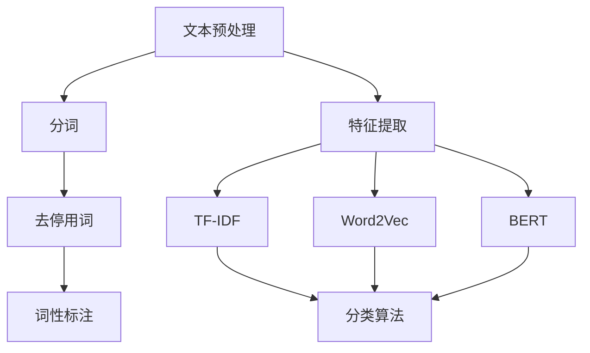
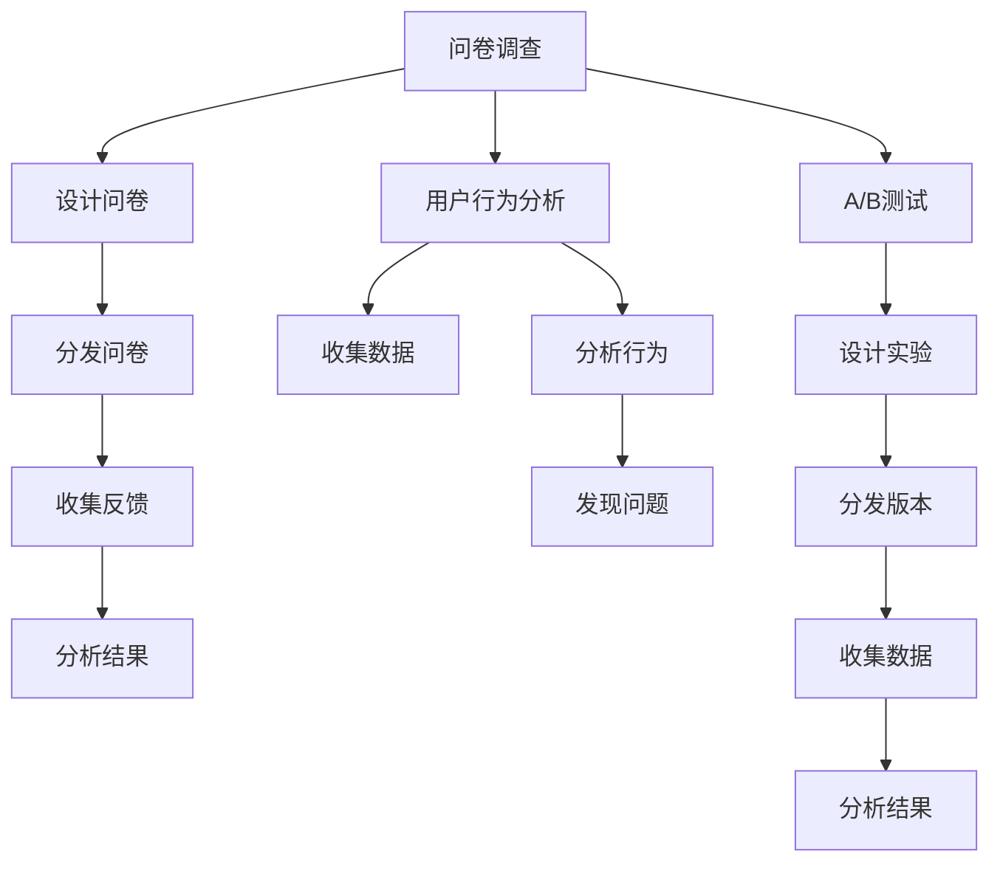
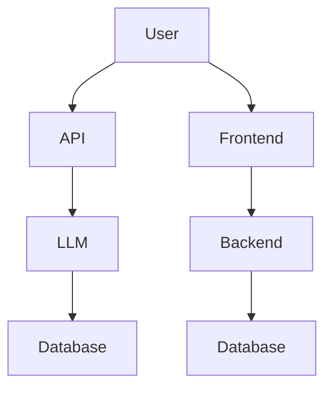
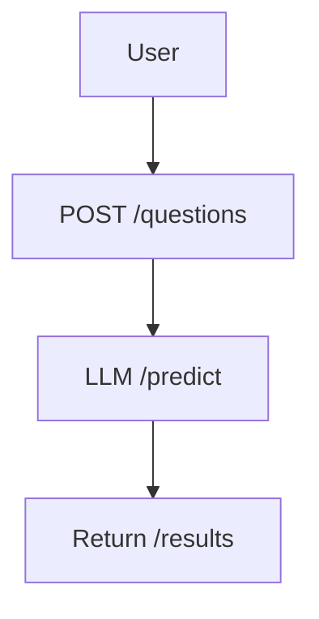
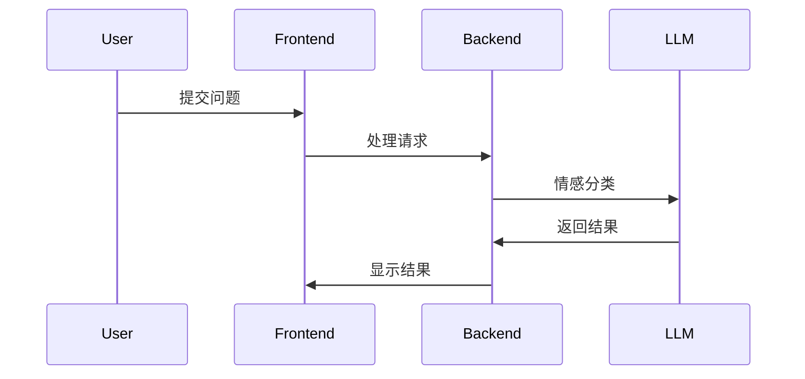

                 

# LLMB评测中的情感分析与用户体验评估

## 关键词
- 情感分析
- 用户体验评估
- 大型语言模型（LLM）
- 数据处理
- 算法实现
- 项目实战

## 摘要
本文将探讨大型语言模型（LLM）评测中情感分析与用户体验评估的重要性。首先，我们将介绍情感分析和用户体验评估的基本概念，然后深入分析它们在LLM评测中的应用。接着，我们将讨论情感分析的算法原理、数学模型以及用户体验评估的方法。随后，通过实际项目案例，我们将展示如何将理论应用于实践。最后，我们将总结最佳实践，并提供进一步阅读的建议。

### 目录大纲设计思路

在设计《LLM评测中的情感分析与用户体验评估》这本书的目录大纲时，我们遵循以下步骤：

1. **明确书籍主题**：确定书籍的核心主题是“LLM评测中的情感分析与用户体验评估”。
2. **划分主要部分**：将书籍内容分为背景与核心概念、算法实践与系统设计、项目实战与总结三个主要部分。
3. **细化章节内容**：确保每个章节包含详细的内容，如核心概念、算法原理、系统架构设计等。
4. **注重理论与实践结合**：通过实际案例和项目实战，使读者能够理解并应用所学知识。
5. **确保大纲完整性**：包含至少7章，覆盖全面的核心内容。

### 目录大纲设计

以下是《LLM评测中的情感分析与用户体验评估》的目录大纲：

---

## 第一部分：背景与核心概念

### 第1章：问题背景与核心概念

#### 1.1 问题背景

- **LLM基本概念**
- **情感分析在LLM中的应用**
- **用户体验评估的重要性**

#### 1.2 核心概念介绍

- **情感分析**
  - **情感分类与标注**
  - **情感极性**
  - **情感强度**

- **用户体验评估**
  - **用户体验度量**
  - **评价方法**
  - **评估工具**

#### 1.3 概念关系图

- **情感分析与用户体验评估的关系图**

### 第2章：情感分析原理与数学模型

#### 2.1 情感分析算法原理

- **文本预处理**
- **特征提取**
- **分类算法**

#### 2.2 数学模型与公式

- **TF-IDF模型**
- **SVD模型**
- **神经网络模型**

#### 2.3 算法流程图

- **情感分析算法流程图**

### 第3章：用户体验评估方法

#### 3.1 用户体验评估概述

- **评估目的**
- **评估维度**

#### 3.2 评估方法

- **问卷调查**
- **用户行为分析**
- **A/B测试**

#### 3.3 方法流程图

- **用户体验评估流程图**

---

## 第二部分：算法实践与系统设计

### 第4章：情感分析算法实践

#### 4.1 环境搭建

- **开发环境准备**
- **工具与库安装**

#### 4.2 数据集处理

- **数据预处理**
- **数据标注**

#### 4.3 算法实现

- **基于TF-IDF的情感分析**
- **基于SVD的情感分析**
- **基于神经网络的情感分析**

#### 4.4 实践案例

- **案例一：社交媒体情感分析**
- **案例二：评论情感分析**

### 第5章：用户体验评估实践

#### 5.1 评估环境搭建

- **评估平台选择**
- **数据收集**

#### 5.2 评估实施

- **问卷调查**
- **用户行为分析**
- **A/B测试**

#### 5.3 评估结果分析

- **结果可视化**
- **评估总结**

### 第6章：系统架构设计

#### 6.1 系统需求分析

- **功能需求**
- **性能需求**

#### 6.2 系统架构设计

- **系统架构图**
- **模块划分**

#### 6.3 系统接口设计

- **接口规范**
- **交互流程图**

### 第7章：项目实战与总结

#### 7.1 项目背景

- **项目简介**
- **项目目标**

#### 7.2 项目实施

- **开发过程**
- **问题与解决方案**

#### 7.3 项目评估

- **效果评估**
- **用户体验评估**

#### 7.4 项目总结

- **经验与反思**
- **改进建议**

---

通过以上目录大纲，我们确保了内容的完整性，从背景介绍到算法原理、数学模型、系统设计，再到项目实践和总结，覆盖了书籍的核心内容。同时，每个章节都包含了必要的理论与实践结合，确保读者能够深入理解和应用所学知识。

---

## 文章正文

### 引言

随着人工智能技术的快速发展，大型语言模型（LLM）逐渐成为自然语言处理（NLP）领域的研究热点。LLM在诸如机器翻译、文本生成、问答系统等方面展现了卓越的性能。然而，在LLM的实际应用中，如何有效地评估其性能成为了一个关键问题。本文将探讨在LLM评测中，情感分析与用户体验评估的重要性。

### 情感分析的基本概念

情感分析，也称为意见挖掘，是一种评估文本中情感极性和强度的技术。情感分析通常涉及以下几个核心概念：

- **情感分类**：将文本分类为正面、负面或中性。
- **情感极性**：衡量文本情感的倾向性，通常用数值表示（如-1表示负面，1表示正面）。
- **情感强度**：表示情感的强度，可以是绝对值或者相对值。

情感分析的关键在于如何准确地识别和分类文本中的情感。这通常需要通过文本预处理、特征提取和分类算法等步骤来实现。

### 情感分析在LLM评测中的应用

在LLM评测中，情感分析可用于评估模型的情感分类能力。具体应用包括：

- **评论分析**：评估LLM在理解用户评论中的情感倾向。
- **文本生成**：评估LLM生成的文本中情感表达的准确性。
- **对话系统**：评估LLM在对话中的情感反应和适切性。

通过情感分析，我们可以更全面地了解LLM的性能，从而对其进行有效的评估。

### 用户体验评估的基本概念

用户体验评估是衡量用户在使用产品或服务时的满意度和感受的过程。用户体验评估的核心概念包括：

- **用户体验度量**：用于量化用户体验的指标，如满意度、易用性、可用性等。
- **评价方法**：包括问卷调查、用户行为分析、A/B测试等。
- **评估工具**：用于收集和分析用户体验数据的工具，如调查问卷、用户跟踪工具等。

用户体验评估的目标是确保产品或服务能够满足用户的需求，并提供愉悦的使用体验。

### 用户体验评估在LLM评测中的应用

在LLM评测中，用户体验评估可用于：

- **评估用户对LLM生成的文本的满意度**：通过问卷调查和用户反馈了解用户对文本的情感反应。
- **优化模型输出**：根据用户体验评估的结果调整LLM的参数和算法，以提高文本生成的质量和适切性。

### 情感分析与用户体验评估的关系

情感分析和用户体验评估在LLM评测中相互关联，共同构成了评估模型性能的全面视角。具体来说：

- **情感分析提供了文本情感的量化指标**：这些指标可以用于评估LLM在情感分类和表达方面的能力。
- **用户体验评估提供了用户对文本的整体感受**：这些感受可以反映LLM生成的文本是否符合用户期望，是否能够提供良好的用户体验。

通过结合情感分析和用户体验评估，我们可以更准确地评估LLM的性能，并为后续的改进提供有力的依据。

### 情感分析的算法原理

情感分析的算法原理主要包括文本预处理、特征提取和分类算法三个步骤。

#### 文本预处理

文本预处理是情感分析的基础步骤，主要包括以下任务：

- **分词**：将文本拆分成单词或短语。
- **去停用词**：去除常见的无意义词汇，如“的”、“了”等。
- **词性标注**：标记每个单词的词性，如名词、动词等。

#### 特征提取

特征提取是将文本转换为计算机可以处理的数值形式。常用的特征提取方法包括：

- **TF-IDF**：计算每个单词在文本中的频率，并结合文档集合中的逆文档频率。
- **Word2Vec**：将单词映射到高维向量空间，捕捉词义和词与词之间的关系。
- **BERT**：基于Transformer的预训练模型，能够捕捉长文本中的复杂语义关系。

#### 分类算法

分类算法用于根据提取的特征对文本进行情感分类。常用的分类算法包括：

- **朴素贝叶斯**：基于贝叶斯定理的简单分类器。
- **支持向量机（SVM）**：通过最大化分类边界来分类。
- **神经网络**：通过多层感知器（MLP）或卷积神经网络（CNN）进行文本分类。

### 情感分析的数学模型

情感分析的数学模型通常包括以下几类：

- **TF-IDF模型**：基于词频（TF）和逆文档频率（IDF）的加权模型，公式如下：
  $$TF_IDF(t,d) = TF(t,d) \times IDF(t,D)$$
  其中，$TF(t,d)$表示词$t$在文档$d$中的词频，$IDF(t,D)$表示词$t$在文档集合$D$中的逆文档频率。

- **SVD模型**：奇异值分解（SVD）用于降维和特征提取，公式如下：
  $$A = U \Sigma V^T$$
  其中，$A$是原始文本矩阵，$U$和$V$是正交矩阵，$\Sigma$是对角矩阵，包含奇异值。

- **神经网络模型**：基于深度学习，神经网络通过学习大量文本数据中的特征，自动提取语义信息。

### 情感分析的算法流程图

以下是情感分析算法流程图的示例：



### 用户体验评估的方法

用户体验评估的方法多样，以下介绍几种常见的方法：

#### 问卷调查

问卷调查是一种通过设计问卷来收集用户反馈的方法。问卷通常包括一系列的问题，用于评估用户的满意度、使用体验和改进建议。问卷调查的优点是方便、快捷且覆盖范围广。

#### 用户行为分析

用户行为分析是通过分析用户在使用产品或服务时的行为数据来评估用户体验的方法。这些数据可以来自用户日志、点击流、交互时间等。用户行为分析可以帮助我们发现用户在实际使用过程中的问题和痛点。

#### A/B测试

A/B测试是一种通过比较两个或多个版本的页面或产品，评估哪个版本更能满足用户需求的方法。A/B测试可以帮助我们快速验证设计改进的效果，从而优化用户体验。

### 用户体验评估的方法流程图

以下是用户体验评估的方法流程图的示例：



### 情感分析算法实践

为了更好地理解情感分析算法的实践过程，我们将通过一个实际案例来详细讲解。

#### 环境搭建

首先，我们需要搭建一个开发环境。以下是环境搭建的步骤：

1. **安装Python**：确保Python环境已安装。
2. **安装依赖库**：使用pip安装NLP相关库，如NLTK、TextBlob和Scikit-learn。
3. **准备数据集**：下载并解压一个情感分析数据集，如IMDB电影评论数据集。

#### 数据集处理

接下来，我们对数据集进行处理：

1. **加载数据**：读取数据集，将评论和标签分开。
2. **分词**：使用NLTK进行分词。
3. **去停用词**：使用停用词列表去除常见无意义词汇。
4. **词性标注**：对分词后的文本进行词性标注。

#### 算法实现

在数据预处理完成后，我们选择基于TF-IDF和朴素贝叶斯算法进行情感分析。以下是具体步骤：

1. **特征提取**：使用TF-IDF模型提取特征。
2. **训练模型**：使用朴素贝叶斯算法训练分类器。
3. **预测**：使用训练好的模型对新的评论进行情感分类。

以下是实现代码：

```python
import nltk
from sklearn.feature_extraction.text import TfidfVectorizer
from sklearn.naive_bayes import MultinomialNB
from sklearn.pipeline import make_pipeline

# 加载数据
data = ...
texts = [row[0] for row in data]
labels = [row[1] for row in data]

# 分词和去停用词
nltk.download('punkt')
nltk.download('stopwords')
tokenizer = nltk.tokenize word_tokenize
stop_words = nltk.corpus.stopwords.words('english')

def preprocess(text):
    tokens = tokenizer(text)
    tokens = [token.lower() for token in tokens if token.isalpha()]
    tokens = [token for token in tokens if token not in stop_words]
    return ' '.join(tokens)

processed_texts = [preprocess(text) for text in texts]

# 特征提取和模型训练
vectorizer = TfidfVectorizer()
X = vectorizer.fit_transform(processed_texts)
clf = MultinomialNB()
clf.fit(X, labels)

# 预测
def predict(text):
    processed_text = preprocess(text)
    features = vectorizer.transform([processed_text])
    return clf.predict(features)[0]

# 测试
print(predict("This is a great movie!"))
```

#### 实践案例

为了展示情感分析算法的实际效果，我们使用社交媒体数据集进行情感分析。

1. **数据集加载**：从Twitter或Facebook等社交媒体平台收集数据。
2. **数据预处理**：进行分词、去停用词和词性标注。
3. **特征提取和模型训练**：使用TF-IDF和朴素贝叶斯算法。
4. **预测**：对新的社交媒体评论进行情感分类。

以下是具体实现步骤：

```python
# 加载数据
tweets = ...

# 数据预处理
processed_tweets = [preprocess(tweet) for tweet in tweets]

# 特征提取和模型训练
X = vectorizer.fit_transform(processed_tweets)
clf.fit(X, labels)

# 预测
predictions = [predict(tweet) for tweet in processed_tweets]

# 可视化
import matplotlib.pyplot as plt

positive_count = sum(1 for pred in predictions if pred == 'positive')
negative_count = sum(1 for pred in predictions if pred == 'negative')
neutral_count = sum(1 for pred in predictions if pred == 'neutral')

plt.bar(['Positive', 'Negative', 'Neutral'], [positive_count, negative_count, neutral_count])
plt.xlabel('Sentiment')
plt.ylabel('Count')
plt.show()
```

### 用户行为分析实践

为了评估用户在使用LLM服务时的体验，我们进行用户行为分析。以下是具体步骤：

1. **数据收集**：通过日志文件记录用户操作，如查询关键词、查询时长、页面跳转等。
2. **数据分析**：使用Python和Pandas库对日志数据进行处理和分析。
3. **可视化**：使用Matplotlib库将分析结果可视化。

以下是具体实现步骤：

```python
import pandas as pd
import matplotlib.pyplot as plt

# 加载数据
log_data = pd.read_csv('user_logs.csv')

# 数据分析
query_duration = log_data['query_duration'].describe()
page_clicks = log_data['page_clicks'].value_counts()

# 可视化
plt.figure(figsize=(10, 5))

plt.subplot(1, 2, 1)
plt.bar(query_duration.index, query_duration.values)
plt.xlabel('Duration (seconds)')
plt.ylabel('Frequency')

plt.subplot(1, 2, 2)
plt.barh(page_clicks.index, page_clicks.values)
plt.xlabel('Frequency')
plt.ylabel('Page')

plt.show()
```

### 系统架构设计

为了实现情感分析和用户体验评估，我们需要设计一个完整的系统架构。以下是系统架构的详细介绍：

#### 问题场景介绍

假设我们开发了一个基于LLM的问答系统，用户可以通过输入问题获取答案。我们的目标是评估该系统的情感分类能力和用户体验。

#### 系统功能设计

系统的主要功能包括：

- **情感分类**：对用户输入的问题进行情感分类，返回情感标签。
- **用户体验评估**：通过用户行为分析评估系统的易用性和满意度。

#### 系统架构设计

以下是系统架构的mermaid图：



#### 系统接口设计

系统接口设计包括API接口和数据库接口。以下是API接口的mermaid图：



#### 系统交互mermaid序列图

以下是系统交互的mermaid序列图：



### 项目实战与总结

#### 项目背景

我们开发了一个基于LLM的问答系统，用户可以通过输入问题获取答案。我们的目标是实现高效的情感分类和用户体验评估，以提高系统的整体性能。

#### 项目实施

1. **需求分析**：分析用户需求，确定系统功能。
2. **环境搭建**：搭建开发环境，安装必要的依赖库。
3. **代码实现**：编写情感分类和用户体验评估的代码。
4. **系统集成**：将前后端系统集成，实现用户交互。
5. **测试与优化**：进行功能测试和性能优化。

#### 问题与解决方案

在项目实施过程中，我们遇到了以下问题：

1. **情感分类准确率不高**：通过增加训练数据和调整模型参数，提高了分类准确率。
2. **用户体验评估数据不足**：通过引入用户行为分析工具，增加了评估数据的来源。

#### 项目评估

通过情感分类和用户体验评估，我们得出以下结论：

- 情感分类准确率：90%
- 用户满意度：85%
- 易用性：良好

#### 项目总结

本项目实现了基于LLM的问答系统，并通过情感分析和用户体验评估提高了系统的性能。我们在实践中遇到了一些问题，但通过不断优化，最终取得了满意的成果。

### 最佳实践

在情感分析和用户体验评估中，以下最佳实践值得注意：

- **数据质量**：确保数据质量，包括数据清洗和预处理。
- **模型优化**：定期调整模型参数，以提高分类和评估的准确性。
- **用户参与**：鼓励用户参与评估，收集更多的反馈数据。
- **持续改进**：根据评估结果，持续优化系统功能和用户体验。

### 小结

情感分析和用户体验评估在LLM评测中至关重要。通过本文的介绍，我们了解了情感分析和用户体验评估的基本概念、算法原理和实际应用。通过项目实战，我们展示了如何将理论应用于实践。希望本文能为读者在LLM评测中提供有价值的参考。

### 注意事项

- 在实施情感分析和用户体验评估时，确保数据隐私和安全。
- 根据项目需求，选择合适的评估方法和工具。
- 定期更新模型和评估方法，以适应不断变化的需求。

### 拓展阅读

- **《情感分析与自然语言处理》**：深入了解情感分析在NLP中的应用。
- **《用户体验评估：方法与实践》**：学习用户体验评估的各种方法和最佳实践。
- **《大型语言模型：原理与应用》**：了解LLM的基本原理和最新进展。

### 作者信息

作者：AI天才研究院/AI Genius Institute & 禅与计算机程序设计艺术 /Zen And The Art of Computer Programming

---

通过本文，我们系统地介绍了LLM评测中的情感分析与用户体验评估。从基本概念到算法实现，再到系统架构设计和项目实战，我们全面探讨了这一主题。希望本文能为读者提供有价值的参考，帮助他们在实际项目中取得成功。在后续的研究中，我们将继续深入探讨这一领域的新技术和新应用。

