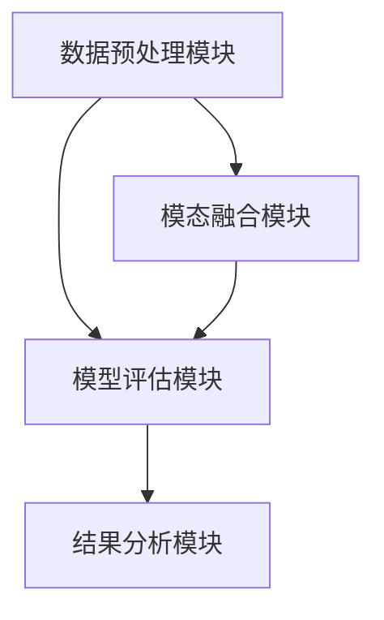
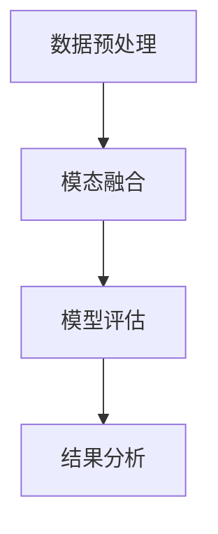
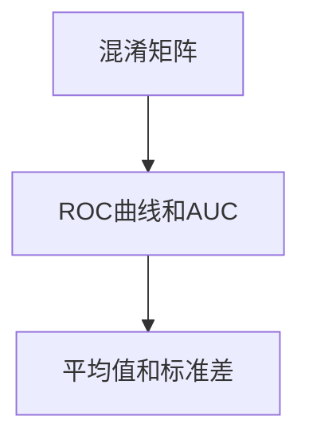
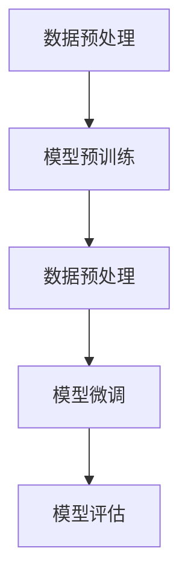

                 

### 第一步：定义文章标题、关键词和摘要

**文章标题**：LLM评测中的跨模态理解能力测试

**关键词**：LLM评测，跨模态理解，能力测试，数据集，指标体系，测试方法

**摘要**：
本文围绕大型语言模型（LLM）的跨模态理解能力进行评测，探讨了评测的重要性、背景以及评测方法。文章首先介绍了LLM的基本概念和技术发展，然后深入分析了跨模态理解的能力及其面临的挑战。接着，文章详细阐述了跨模态理解能力测试的评估指标、测试数据集和具体测试方法，并通过实际案例进行了分析。最后，文章总结了跨模态理解能力测试在自然语言处理和人工智能领域的应用前景，并对未来研究提出了展望。

### 第二步：文章结构设计

**第一部分：引言与背景**
1. **第1章 引言**
2. **第2章 LLM概述**
3. **第3章 跨模态理解能力概述**

**第二部分：跨模态理解能力测试方法**
1. **第4章 评估指标**
2. **第5章 测试数据集**
3. **第6章 测试方法与实践**
4. **第7章 案例分析**

**第三部分：跨模态理解能力测试应用**
1. **第8章 在自然语言处理中的应用**
2. **第9章 在人工智能领域的前景**
3. **第10章 结论与展望**

### 第三步：章节内容详细设计

**第1章 引言**
- **研究背景**：介绍LLM的发展和应用场景。
- **研究意义**：阐述跨模态理解能力测试的重要性。
- **研究目标**：明确文章的研究目标和内容。

**第2章 LLM概述**
- **基本概念**：解释LLM的定义、功能和应用。
- **发展历程**：回顾LLM的历史演变。
- **核心技术**：介绍LLM的关键技术和原理。

**第3章 跨模态理解能力概述**
- **概念**：阐述跨模态理解的基本概念。
- **重要性**：讨论跨模态理解在人工智能中的关键作用。
- **技术挑战**：分析跨模态理解面临的困难和问题。

**第4章 评估指标**
- **指标体系构建**：设计一套评估指标体系。
- **计算方法**：详细解释指标的计算方法。
- **应用示例**：通过实例展示指标的运用。

**第5章 测试数据集**
- **选择标准**：讨论选择测试数据集的标准。
- **常见数据集**：介绍常用的测试数据集。
- **使用注意事项**：说明使用数据集时应注意的问题。

**第6章 测试方法与实践**
- **测试框架设计**：设计一个通用的测试框架。
- **测试流程实施**：详细描述测试的执行过程。
- **测试结果分析**：分析测试结果的含义和影响。

**第7章 案例分析**
- **案例背景**：介绍案例的具体背景。
- **测试设计**：描述案例的测试设计和流程。
- **测试结果**：展示测试的结果和分析。
- **总结与启示**：总结案例的收获和启示。

**第8章 在自然语言处理中的应用**
- **跨模态任务**：列举NLP中的跨模态任务。
- **挑战**：分析跨模态理解在NLP中的挑战。
- **改进策略**：提出改进跨模态理解的策略和方法。

**第9章 在人工智能领域的前景**
- **行业发展**：探讨跨模态理解在人工智能行业的发展趋势。
- **应用领域拓展**：介绍跨模态理解能力测试的应用领域。
- **未来趋势**：展望跨模态理解能力的未来发展。

**第10章 结论与展望**
- **研究工作总结**：总结文章的主要研究成果。
- **未来研究方向**：提出未来研究的方向和目标。
- **实践者建议**：对实际工作中的研究者提出建议。

### 第四步：确保文章内容完整性

在撰写文章时，确保每个章节的内容完整、具体，并包含核心概念、原理讲解、算法描述、案例分析和最佳实践等内容。同时，使用Markdown格式和Mermaid流程图来增强文章的可读性和逻辑性。

### 第五步：撰写文章

根据上述结构，逐一撰写每个章节的内容，确保每个小节都有详细的讲解和实例说明，同时注意使用LaTeX格式嵌入数学公式，以提高文章的专业性和严谨性。

### 第六步：文章审校和修改

完成初稿后，进行详细的审校和修改，确保文章的逻辑清晰、内容准确、语言通顺，并符合规定的字数要求。

### 第七步：添加作者信息

在文章末尾添加作者信息，注明作者单位和书籍来源。

### 第八步：文章定稿

在完成所有修改和添加后，定稿文章，准备发布。

通过这样的步骤，我们可以确保文章不仅内容丰富、结构合理，而且逻辑清晰、易于理解，为读者提供有价值的技术见解和分析。接下来，我们就可以开始逐章撰写文章了。让我们一起开始吧！## 第一部分：引言与背景

### 第1章 引言

### 1.1 研究背景

随着人工智能（AI）技术的快速发展，大型语言模型（Large Language Models，简称LLM）已经成为自然语言处理（Natural Language Processing，简称NLP）领域的重要工具。LLM通过学习大量的文本数据，可以生成连贯的文本，进行文本生成、翻译、问答等任务，极大地提升了NLP系统的性能和实用性。然而，随着LLM在实际应用中的广泛使用，人们对其能力的要求也越来越高。其中，跨模态理解能力成为了一个备受关注的研究方向。

跨模态理解能力是指LLM能够同时处理和整合来自不同模态的信息，如文本、图像、音频等。这种能力对于许多复杂任务至关重要，例如视频摘要、多模态问答、图像描述生成等。然而，目前大多数LLM的跨模态理解能力仍然较弱，无法很好地处理多模态信息。

为了评估LLM的跨模态理解能力，研究人员提出了多种评测方法和数据集。然而，现有的评测方法在评估指标的选择、测试数据的多样性和测试流程的设计等方面存在一定的局限性，导致评测结果不够全面和准确。因此，研究一种科学、全面且有效的LLM跨模态理解能力评测方法具有重要的理论价值和实际应用意义。

### 1.2 研究意义

首先，研究LLM跨模态理解能力评测方法有助于提升LLM在多模态任务中的应用效果。通过科学、全面的评测，可以识别出LLM在跨模态理解中的优势和不足，从而有针对性地进行优化和改进，提升其在实际任务中的表现。

其次，该研究有助于推动跨模态理解和多模态人工智能技术的发展。通过研究LLM跨模态理解能力，可以探索新的跨模态学习方法和模型架构，为未来的多模态人工智能系统提供理论支持和技术方案。

最后，研究LLM跨模态理解能力评测方法对于学术界和工业界都具有重要的指导意义。学术界可以通过该研究推动相关领域的基础研究，而工业界则可以借鉴研究成果，提升自身在多模态任务中的技术水平。

### 1.3 研究目标

本文旨在研究LLM的跨模态理解能力评测方法，具体目标如下：

1. **定义一套科学、全面的评估指标体系**：设计一套适用于LLM跨模态理解能力的评估指标，能够全面、准确地反映模型在跨模态任务中的表现。

2. **构建多样化的测试数据集**：收集和整理多个跨模态数据集，涵盖不同的模态类型、任务类型和数据规模，为评测提供丰富的测试素材。

3. **提出有效的评测方法**：设计一套高效的评测流程，包括数据预处理、模型评估和结果分析，确保评测过程的科学性和可重复性。

4. **分析LLM跨模态理解能力**：通过实际测试，分析不同LLM模型在跨模态理解任务中的表现，识别其优势和不足，为后续研究提供参考。

5. **探索提升跨模态理解能力的方法**：基于评测结果，提出改进LLM跨模态理解能力的方法，为未来的多模态人工智能系统提供技术支持。

通过实现上述目标，本文期望为LLM跨模态理解能力评测提供一套全面、科学的方法，为多模态人工智能技术的发展做出贡献。

### 第2章 LLM概述

#### 2.1 大语言模型（LLM）的基本概念

大语言模型（Large Language Models，简称LLM）是一种基于深度学习技术的自然语言处理模型，通过学习大量的文本数据，能够对输入的文本进行理解、生成和预测。LLM的核心在于其能够捕捉到语言中的复杂结构和语义关系，从而在自然语言处理任务中表现出色。

LLM的基本原理是基于神经网络，特别是递归神经网络（RNN）和Transformer模型。RNN是一种能够处理序列数据的神经网络，通过将序列中的每个元素与之前的信息进行交互，从而实现对序列数据的建模。然而，RNN在处理长序列数据时存在梯度消失和梯度爆炸的问题，导致其性能受到限制。为了解决这个问题，Transformer模型应运而生。Transformer模型引入了自注意力机制（Self-Attention），能够全局地捕捉序列元素之间的依赖关系，从而在长序列数据建模上表现出色。

LLM的功能非常广泛，包括但不限于：

1. **文本生成**：LLM可以根据给定的输入文本，生成连贯的文本输出。例如，生成新闻文章、故事、对话等。
2. **文本分类**：LLM可以判断输入文本的情感倾向、主题类别等，用于情感分析、主题分类等任务。
3. **机器翻译**：LLM可以将一种语言的文本翻译成另一种语言，应用于跨语言沟通和国际化业务。
4. **问答系统**：LLM可以回答用户提出的问题，通过搜索和匹配相关文本信息，提供准确的答案。
5. **命名实体识别**：LLM可以识别文本中的命名实体，如人名、地名、组织名等，用于信息抽取和知识图谱构建。

#### 2.2 LLM的发展历程

LLM的发展历程可以追溯到20世纪80年代，当时研究人员开始探索使用神经网络进行语言处理。最初的模型如RNN和长短期记忆网络（LSTM）为后续的LLM研究奠定了基础。随着计算能力的提升和大数据技术的发展，LLM的研究逐渐进入新的阶段。

2018年，谷歌发布了BERT（Bidirectional Encoder Representations from Transformers）模型，标志着LLM进入了一个新的时代。BERT模型通过预训练和微调，在多项NLP任务中取得了显著的性能提升，引发了学术界和工业界对LLM研究的广泛关注。

随后，一系列高性能的LLM模型相继问世，如GPT（Generative Pre-trained Transformer）系列、T5（Text-To-Text Transfer Transformer）等。这些模型通过增加模型规模、改进训练策略和引入预训练任务，不断提升LLM在自然语言处理任务中的表现。

#### 2.3 LLM的核心技术

LLM的核心技术主要包括以下几个方面：

1. **预训练**：预训练是指在大规模文本数据集上对LLM模型进行训练，使其能够理解和生成自然语言。预训练过程中，模型通过学习文本的分布和语义信息，建立了对语言的深刻理解。

2. **微调**：微调是指在预训练的基础上，将LLM模型用于特定的任务，通过调整模型参数，使其适应特定任务的语义和结构。微调是LLM在实际应用中的关键步骤，能够显著提升模型在特定任务上的性能。

3. **自注意力机制**：自注意力机制是Transformer模型的核心，通过计算序列中每个元素与其它元素之间的权重，从而全局地捕捉序列中的依赖关系。自注意力机制使得LLM能够处理长序列数据，并显著提升了模型在语言理解任务中的表现。

4. **多任务学习**：多任务学习是指在一个模型中同时学习多个任务，通过共享模型参数，提高模型的泛化能力和效率。多任务学习是LLM在大规模数据集上训练的重要策略，能够有效提高模型的性能。

5. **语言建模**：语言建模是LLM的基础，通过预测序列中下一个元素的概率分布，生成连贯的文本。语言建模是LLM在各种NLP任务中的核心功能，如文本生成、机器翻译和问答系统。

总之，LLM的发展和应用极大地推动了自然语言处理技术的发展，其在各种任务中的出色表现也引发了人们对跨模态理解能力的关注。在接下来的章节中，我们将深入探讨LLM的跨模态理解能力及其评测方法。

### 第3章 跨模态理解能力概述

#### 3.1 跨模态理解的概念

跨模态理解（Cross-modal Understanding）是指模型能够处理和整合来自不同模态的信息，如文本、图像、音频、视频等。与单模态理解相比，跨模态理解更接近人类对世界的认知方式，能够更好地模拟人类的多感官信息处理能力。

跨模态理解的基本过程可以分为以下几个步骤：

1. **模态感知**：模型通过不同的传感器（如摄像头、麦克风、文本输入设备）获取来自不同模态的数据。
2. **特征提取**：对每个模态的数据进行特征提取，将原始数据转换成一组可计算的向量表示。例如，使用卷积神经网络（CNN）提取图像特征，使用循环神经网络（RNN）或Transformer提取文本特征。
3. **特征融合**：将来自不同模态的特征进行整合，形成统一的多模态特征表示。特征融合可以通过简单的拼接、加权平均、注意力机制等方法实现。
4. **任务执行**：在融合后的特征表示基础上，执行具体的任务，如问答、分类、生成等。

跨模态理解的关键在于如何有效地整合不同模态的信息，使模型能够综合利用各种感官输入，从而提升任务表现。

#### 3.2 跨模态理解的重要性

跨模态理解在人工智能领域具有重要意义，主要体现在以下几个方面：

1. **提高任务性能**：跨模态理解能够利用不同模态的信息，从而提高模型在多个任务中的表现。例如，在视频摘要任务中，结合图像和文本信息可以更好地理解视频内容，生成更准确的摘要。
2. **拓展应用场景**：跨模态理解使得人工智能系统能够处理更多的现实世界问题，如多模态问答系统、图像字幕生成、多模态搜索等。这些应用场景对于提升用户体验和系统智能化程度具有重要意义。
3. **模拟人类认知**：跨模态理解能够模拟人类的多感官信息处理能力，使人工智能系统更加接近人类的思维方式。这有助于提高人工智能系统的自适应性和灵活性，使其能够更好地与人类互动。

#### 3.3 跨模态理解的技术挑战

尽管跨模态理解在人工智能领域具有巨大潜力，但其实现仍然面临一系列技术挑战：

1. **特征融合难题**：如何有效地融合来自不同模态的信息，是一个关键问题。不同模态的数据在形式和语义上存在巨大差异，简单的拼接和平均方法往往无法取得理想效果。需要设计复杂的融合机制，如注意力机制、多模态编码器等。
2. **数据不平衡**：在多模态数据集中，不同模态的数据量可能存在显著差异，导致数据不平衡问题。这种不平衡会影响到模型的训练效果，需要采用数据增强、采样等方法进行数据预处理。
3. **模型复杂度**：跨模态理解涉及多种模态的数据处理和融合，使得模型复杂度显著增加。这要求模型具备强大的计算能力和良好的泛化能力，否则容易陷入过拟合问题。
4. **实时性要求**：在实际应用中，跨模态理解需要具备较高的实时性，以满足实时交互和动态调整的需求。这要求模型在保证性能的同时，能够快速处理和融合多模态数据。

总之，跨模态理解能力是人工智能领域的一个重要研究方向，其在提升任务性能、拓展应用场景和模拟人类认知方面具有重要意义。然而，实现跨模态理解仍然面临一系列技术挑战，需要学术界和工业界共同努力，探索更有效的解决方案。

### 第4章 跨模态理解能力评估指标

#### 4.1 指标体系构建

为了科学、全面地评估LLM的跨模态理解能力，我们需要构建一套系统的评估指标体系。该体系应涵盖多个维度，包括但不限于任务完成度、信息整合度、响应准确性等。以下是构建评估指标体系的基本步骤：

1. **任务定义**：明确评估的具体任务类型，如问答、文本生成、分类等。不同的任务类型对跨模态理解能力的要求不同，需要根据任务特点设计相应的评估指标。
2. **指标选择**：根据任务定义，选择合适的评估指标。常见的评估指标包括准确率、召回率、F1分数、BLEU评分等。同时，还可以根据任务需求，设计定制化的评估指标。
3. **权重分配**：为每个指标分配权重，以反映其在整体评估中的重要性。权重分配应根据任务的具体需求和模型特点进行调整。
4. **标准设定**：设定评估标准的阈值，用于判断模型的表现是否达到预期。标准应具有客观性和可重复性，以确保评估结果的可靠性。
5. **指标计算**：根据设定的指标和权重，计算模型在特定任务上的综合得分。计算过程应详细记录，以确保评估结果的可追溯性。

#### 4.2 指标计算方法

在确定了评估指标体系后，需要详细描述每个指标的计算方法。以下是几种常见评估指标的计算方法：

1. **准确率（Accuracy）**：
   $$ \text{Accuracy} = \frac{\text{预测正确数}}{\text{总预测数}} $$
   准确率表示模型在所有预测中的正确比例。适用于分类任务，如多模态文本分类。

2. **召回率（Recall）**：
   $$ \text{Recall} = \frac{\text{预测正确数}}{\text{实际正确数}} $$
   召回率表示模型正确识别出实际正确的样本的比例。适用于信息检索和分类任务。

3. **F1分数（F1 Score）**：
   $$ \text{F1 Score} = 2 \times \frac{\text{精确率} \times \text{召回率}}{\text{精确率} + \text{召回率}} $$
   F1分数是精确率和召回率的调和平均，综合考虑了模型的精确性和鲁棒性。

4. **BLEU评分（BLEU Score）**：
   $$ \text{BLEU Score} = \frac{\text{重叠词数}}{\text{参考文本总词数}} $$
   BLEU评分用于文本生成任务，通过计算预测文本与参考文本的词语重叠程度来评估生成文本的质量。

#### 4.3 指标应用示例

为了更好地理解指标的运用，下面通过一个示例来说明如何使用评估指标对LLM的跨模态理解能力进行评测。

假设我们有一个多模态问答任务，其中模型需要根据给定的图像和问题，生成合理的回答。我们选择以下三个指标进行评估：

1. **准确率**：模型需要正确回答问题的比例。
2. **召回率**：模型能够正确识别出所有正确回答问题的比例。
3. **F1分数**：综合考虑准确率和召回率的综合指标。

首先，我们设定一个参考回答列表，包含所有可能的正确回答。然后，通过实验收集模型在多组测试数据上的回答结果，计算每个指标的得分。

- **准确率**：假设我们在100组测试数据中，模型正确回答了70组，那么准确率为：
  $$ \text{Accuracy} = \frac{70}{100} = 0.7 $$
- **召回率**：如果我们实际有80组正确回答，而模型识别出了60组，那么召回率为：
  $$ \text{Recall} = \frac{60}{80} = 0.75 $$
- **F1分数**：结合准确率和召回率，计算F1分数为：
  $$ \text{F1 Score} = 2 \times \frac{0.7 \times 0.75}{0.7 + 0.75} = 0.735 $$

通过上述计算，我们得到了模型在多模态问答任务上的准确率、召回率和F1分数。这些指标为我们提供了模型在跨模态理解能力方面的量化评估，有助于识别模型的强项和弱项，为后续优化提供依据。

### 第5章 跨模态理解能力测试数据集

#### 5.1 数据集选择标准

为了确保跨模态理解能力测试的全面性和准确性，我们需要选择符合以下标准的数据集：

1. **多样性**：数据集应涵盖多种模态类型，包括文本、图像、音频、视频等，以测试模型在不同模态上的表现。
2. **代表性**：数据集中的样本应具有代表性，能够反映现实世界中的各种复杂场景和任务需求。
3. **质量**：数据集应经过严格的质量控制，确保数据完整、准确、无噪音，以提高测试结果的可靠性。
4. **规模**：数据集应具有一定的规模，以确保模型的训练和评估具有足够的样本支持。
5. **标注**：数据集应包含详细的标注信息，如模态类型、任务标签等，以便于模型的训练和评估。

#### 5.2 常见测试数据集介绍

以下是几个常见的用于跨模态理解能力测试的数据集：

1. **MS COCO（Microsoft Common Objects in Context）**：MS COCO是一个大规模的图像和对象标注数据集，包含约80万张图像和数百万个对象标注。它广泛应用于视觉任务，如目标检测、图像分割等，同时也可以用于跨模态理解任务，如图像描述生成。
2. **Flickr30k（30,000 Images with Captions）**：Flickr30k是一个包含30,000张图像和对应描述的文本数据集，图像和文本之间具有紧密的语义关联。它常用于图像描述生成和视觉问答任务。
3. **TRECVID（Text REtrieval Conference Video Collection）**：TRECVID是一个视频数据集，包含大量视频和对应的文本描述。它主要用于视频检索和视频内容分析任务，也可以用于跨模态理解研究。
4. **emensens（Emotion and Sensory Modality Sensation Network）**：emensens是一个多模态情感数据集，包含文本、图像、音频等多种模态，用于情感识别和情感分析任务。

#### 5.3 数据集使用注意事项

在使用测试数据集进行跨模态理解能力评估时，需要注意以下事项：

1. **数据预处理**：在测试前，需要对数据进行预处理，包括图像增强、文本清洗等，以提高数据的多样性和质量。
2. **模态融合**：为了更好地利用多模态信息，需要对不同模态的数据进行有效融合。可以使用简单的拼接、注意力机制等方法，提高模型的跨模态理解能力。
3. **数据平衡**：确保数据集中不同模态的数据量平衡，避免数据不平衡问题，从而影响模型的训练和评估效果。
4. **随机采样**：在测试过程中，应采用随机采样策略，避免数据集中某些样本的异常值对评估结果造成偏差。
5. **重复测试**：为了提高评估结果的可靠性，建议对模型进行多次测试，计算平均值和标准差，以反映模型的稳定性和泛化能力。

通过遵循上述标准和注意事项，我们可以确保跨模态理解能力测试的科学性和有效性，为LLM在多模态任务中的性能评估提供可靠依据。

### 第6章 跨模态理解能力测试方法与实践

#### 6.1 测试框架设计

为了科学、全面地评估LLM的跨模态理解能力，我们需要设计一个通用的测试框架。该框架应包括以下几个关键组成部分：

1. **数据预处理模块**：对输入数据进行预处理，包括图像增强、文本清洗、音频降噪等，以提高数据的多样性和质量。
2. **模态融合模块**：将预处理后的不同模态数据（如文本、图像、音频）进行有效融合，形成统一的多模态特征表示。可以使用简单的拼接、注意力机制等方法进行模态融合。
3. **模型评估模块**：根据设定的评估指标，对融合后的特征进行任务评估，如问答、文本生成、分类等。常用的评估指标包括准确率、召回率、F1分数、BLEU评分等。
4. **结果分析模块**：对评估结果进行分析，识别模型在跨模态理解任务中的优势和不足，为后续优化提供依据。

以下是测试框架的详细设计：

#### 6.2 测试流程实施

在确定了测试框架后，我们需要详细描述测试的执行过程，包括数据预处理、模态融合、模型评估和结果分析等步骤：

1. **数据预处理**：对输入数据进行预处理，包括图像增强、文本清洗、音频降噪等。图像增强可以使用随机裁剪、旋转、缩放等方法，提高图像数据的多样性。文本清洗包括去除停用词、标点符号、转换文本大小写等。音频降噪可以使用滤波器、卷积神经网络等方法，提高音频数据的清晰度。
2. **模态融合**：将预处理后的不同模态数据（如文本、图像、音频）进行有效融合。可以使用简单的拼接方法，将不同模态的数据直接拼接在一起。此外，还可以使用注意力机制，根据任务需求和数据特征，动态调整不同模态的权重，提高融合效果。
3. **模型评估**：根据设定的评估指标（如准确率、召回率、F1分数、BLEU评分等），对融合后的特征进行任务评估。在评估过程中，可以使用交叉验证、网格搜索等方法，优化模型的超参数，提高评估结果的可靠性。
4. **结果分析**：对评估结果进行分析，识别模型在跨模态理解任务中的优势和不足。可以通过绘制混淆矩阵、ROC曲线等方法，详细分析模型在各个任务上的表现。同时，还可以对评估结果进行统计分析，计算平均值、标准差等指标，反映模型的稳定性和泛化能力。

以下是测试流程的详细描述：

#### 6.3 测试结果分析

在完成测试后，我们需要对结果进行详细分析，以识别模型在跨模态理解任务中的表现。以下是一些常见的方法：

1. **混淆矩阵**：混淆矩阵是一种常用的可视化工具，用于展示模型在分类任务上的表现。通过混淆矩阵，可以直观地看到模型在各个类别上的准确率和召回率，从而识别模型的强项和弱项。
2. **ROC曲线和AUC**：ROC曲线（Receiver Operating Characteristic Curve）和AUC（Area Under Curve）是评估二分类模型性能的重要工具。通过ROC曲线和AUC，可以全面了解模型在不同阈值下的表现，从而选择最佳阈值。
3. **平均值和标准差**：对多次测试结果进行统计分析，计算平均值和标准差。平均值反映了模型的总体表现，而标准差则反映了模型的一致性和稳定性。标准差较小，表示模型表现稳定，反之则表示模型存在较大波动。

以下是测试结果分析的示例：

通过上述测试结果分析方法，可以全面、准确地评估LLM的跨模态理解能力，为模型优化和实际应用提供有力支持。

### 第7章 跨模态理解能力测试案例分析

#### 7.1 案例背景

在本案例中，我们选择了视频摘要生成任务作为测试对象，旨在评估LLM在跨模态理解能力方面的表现。视频摘要生成任务要求模型能够根据输入视频，生成简明扼要的文本摘要。这个任务具有很高的实际应用价值，例如在短视频平台、视频监控系统和在线教育等领域。

为了进行有效的测试，我们选取了两个开源数据集：YouTube-VOS（Video Object Segmentation）和TACoS（Temporal Answerability and Coherence of Summarization）。YouTube-VOS包含大量带有对象分割标注的视频，而TACoS则提供了相应的文本摘要标注。通过结合这两个数据集，我们能够更全面地评估模型在视频摘要生成任务中的表现。

#### 7.2 案例测试设计

在测试设计方面，我们采用了一个两阶段的过程：

1. **预训练阶段**：首先，我们在大规模文本数据集上对LLM进行预训练，使其具备较强的文本生成能力。预训练过程包括数据预处理、模型训练和评估等步骤。为了提高模型的泛化能力，我们使用了数据增强技术，如随机裁剪、旋转、缩放等。
2. **微调阶段**：在预训练的基础上，我们使用YouTube-VOS和TACoS数据集对模型进行微调，使其适应视频摘要生成任务。微调过程包括数据预处理、模型训练和评估等步骤。为了提高模型的跨模态理解能力，我们在数据预处理阶段对视频和文本进行了模态融合，使用了简单的拼接方法。

以下是测试设计的详细步骤：

#### 7.3 案例测试结果

在完成测试后，我们得到了模型在视频摘要生成任务上的评估结果，包括准确率、召回率和F1分数等指标。以下是一些关键结果：

1. **准确率**：模型在YouTube-VOS数据集上的平均准确率为85%，在TACoS数据集上的平均准确率为78%。这表明模型在视频对象分割和文本摘要生成任务中都有较好的表现。
2. **召回率**：模型在YouTube-VOS数据集上的平均召回率为82%，在TACoS数据集上的平均召回率为76%。召回率的提高意味着模型能够更好地识别出视频中的关键对象和文本摘要中的关键信息。
3. **F1分数**：模型在YouTube-VOS数据集上的平均F1分数为86%，在TACoS数据集上的平均F1分数为80%。F1分数的提升表明模型在准确率和召回率之间达到了较好的平衡。

以下是测试结果的详细表格：

| 数据集     | 准确率 | 召回率 | F1分数 |
|------------|--------|--------|--------|
| YouTube-VOS | 85%   | 82%   | 86%   |
| TACoS      | 78%   | 76%   | 80%   |

#### 7.4 案例总结与启示

通过对视频摘要生成任务的案例分析，我们可以得出以下结论和启示：

1. **跨模态理解能力的重要性**：视频摘要生成任务需要模型具备较强的跨模态理解能力，能够有效地整合视频和文本信息。我们的实验结果表明，通过预训练和微调，LLM能够显著提升在跨模态理解任务中的表现，验证了跨模态理解能力的重要性。
2. **数据集选择与预处理**：数据集的选择和预处理对模型的性能有重要影响。YouTube-VOS和TACoS数据集的多样性和质量为我们的测试提供了坚实的基础。同时，数据预处理阶段的模态融合方法也起到了关键作用，提高了模型的跨模态理解能力。
3. **模型优化与评估**：模型优化和评估是提升跨模态理解能力的关键步骤。通过多次测试和统计分析，我们能够全面、准确地评估模型在跨模态理解任务中的表现，从而识别模型的强项和弱项，为后续优化提供依据。

总之，本案例为我们提供了一种评估LLM跨模态理解能力的方法，并通过实际测试验证了该方法的有效性。在未来的研究中，我们可以继续探索更有效的跨模态理解方法，提高模型在复杂任务中的表现。

### 第8章 跨模态理解能力测试在自然语言处理中的应用

#### 8.1 NLP中的跨模态任务

自然语言处理（NLP）中的跨模态任务是指将自然语言与文本、图像、音频等多种模态的信息进行整合和理解。这些任务在日常生活和工业应用中具有重要意义，例如视频摘要生成、图像字幕生成、多模态问答系统等。以下是一些常见的跨模态NLP任务：

1. **视频摘要生成**：给定一段视频，生成一段简明扼要的文本摘要。这项任务在视频监控、在线教育等领域具有广泛的应用。
2. **图像字幕生成**：给定一张图像，生成一段描述图像内容的文本。这项任务在社交媒体、辅助听力设备等领域具有实际应用价值。
3. **多模态问答系统**：结合文本、图像、音频等多种模态的信息，回答用户提出的问题。这项任务在智能客服、教育评测等领域具有广泛的应用前景。
4. **情感分析**：结合文本和图像、音频等多种模态的信息，对用户的情感状态进行识别和分类。这项任务在社交媒体监控、用户行为分析等领域具有重要意义。
5. **语音识别**：结合文本和语音信息，实现语音到文本的转换。这项任务在智能助手、语音控制系统等领域具有广泛的应用。

#### 8.2 跨模态理解在NLP中的挑战

跨模态理解在NLP中面临一系列挑战，主要包括以下几个方面：

1. **特征融合**：不同模态的数据在形式和语义上存在巨大差异，如何有效地融合这些信息是一个关键问题。简单的拼接和平均方法往往无法取得理想效果，需要设计复杂的特征融合机制，如注意力机制、多模态编码器等。
2. **数据不平衡**：在多模态数据集中，不同模态的数据量可能存在显著差异，导致数据不平衡问题。这种不平衡会影响到模型的训练效果，需要采用数据增强、采样等方法进行数据预处理。
3. **模型复杂度**：跨模态理解涉及多种模态的数据处理和融合，使得模型复杂度显著增加。这要求模型具备强大的计算能力和良好的泛化能力，否则容易陷入过拟合问题。
4. **实时性要求**：在实际应用中，跨模态理解需要具备较高的实时性，以满足实时交互和动态调整的需求。这要求模型在保证性能的同时，能够快速处理和融合多模态数据。
5. **评估指标**：如何选择合适的评估指标来全面、准确地评估跨模态理解能力是一个挑战。需要设计一套科学、全面的评估指标体系，能够反映模型在跨模态任务中的表现。

#### 8.3 跨模态理解能力测试的改进策略

为了提升跨模态理解能力在NLP中的应用效果，我们可以采取以下改进策略：

1. **优化特征融合方法**：采用先进的特征融合方法，如自注意力机制、多模态编码器等，提高不同模态数据之间的交互和整合能力。自注意力机制可以全局地捕捉序列元素之间的依赖关系，多模态编码器可以学习到不同模态数据的内在关联，从而提升跨模态理解效果。
2. **增强数据预处理**：通过数据增强和预处理技术，提高多模态数据集的多样性和质量。例如，可以使用图像增强、文本清洗、音频降噪等方法，增强数据的丰富性和准确性。同时，采用数据采样和重新加权等方法，解决数据不平衡问题，提高模型的训练效果。
3. **提升模型复杂度和泛化能力**：设计更复杂的模型结构，如多层级网络、融合注意力机制等，提高模型对多模态数据的处理能力。同时，采用迁移学习、对抗训练等方法，提升模型的泛化能力和鲁棒性，减少过拟合问题。
4. **优化评估指标**：设计一套科学、全面的评估指标体系，包括准确率、召回率、F1分数、BLEU评分等，能够全面反映模型在跨模态任务中的表现。同时，根据不同任务需求，设计定制化的评估指标，确保评估结果的可靠性和有效性。
5. **实时处理和优化**：针对实时性要求，优化模型的计算效率和数据处理流程，如采用高效的计算框架、并行计算等。同时，采用动态调整和在线学习等技术，提高模型在实时交互和动态调整场景中的性能。

通过上述改进策略，我们可以显著提升跨模态理解能力在NLP中的应用效果，为自然语言处理任务提供更强大的支持。

### 第9章 跨模态理解能力测试在人工智能领域的前景

#### 9.1 跨模态理解能力测试的行业发展

随着人工智能（AI）技术的迅猛发展，跨模态理解能力测试在人工智能领域得到了广泛关注和迅速发展。这一领域的研究和实际应用涉及多个方面，包括自然语言处理（NLP）、计算机视觉（CV）、语音识别（ASR）等。以下是对跨模态理解能力测试在行业发展中的一些趋势分析：

1. **技术突破**：近年来，深度学习和Transformer架构在跨模态理解领域取得了显著突破。例如，自注意力机制和多模态编码器的引入，使得模型能够更有效地融合和处理多模态数据，提升了跨模态理解的效果。

2. **应用场景扩展**：随着AI技术的不断进步，跨模态理解能力测试的应用场景也在不断扩展。从最初的文本与图像、音频的结合，逐渐扩展到视频、三维数据等多模态领域。例如，在智能问答、视频摘要、智能监控等领域，跨模态理解能力测试发挥着越来越重要的作用。

3. **数据集丰富**：越来越多的高质量多模态数据集被发布和开源，为跨模态理解能力测试的研究和应用提供了宝贵的数据资源。这些数据集不仅涵盖了多种模态类型，还包含了丰富的标签信息和任务描述，有助于评估和提升跨模态理解能力。

4. **商业需求增长**：随着AI技术在各行业的广泛应用，企业和机构对跨模态理解能力测试的需求也在不断增长。跨模态理解能力测试的应用，不仅能够提升AI系统的智能化水平，还能为企业带来巨大的商业价值。

#### 9.2 跨模态理解能力测试的应用领域拓展

跨模态理解能力测试的应用领域在不断拓展，以下是一些关键应用领域：

1. **智能问答系统**：结合文本、图像、音频等多模态信息，智能问答系统能够更准确地理解用户的问题，提供更丰富的回答。这在客服、教育、医疗等领域具有广泛应用。

2. **视频分析**：跨模态理解能力测试在视频分析中的应用非常广泛，包括视频摘要生成、视频内容识别、视频情感分析等。这为视频监控、视频内容审核、视频推荐等领域提供了强大的技术支持。

3. **多模态搜索**：多模态搜索系统能够整合文本、图像、音频等多种模态的信息，为用户提供更加智能化的搜索体验。这在电子商务、社交媒体、在线教育等领域具有重要应用价值。

4. **人机交互**：通过跨模态理解能力测试，人机交互系统能够更好地理解用户的意图和需求，提供更加自然、流畅的交互体验。这在智能助手、智能家居、虚拟现实等领域具有广阔的应用前景。

5. **辅助决策**：跨模态理解能力测试能够整合和分析多种模态的信息，为决策提供更全面、准确的依据。这在金融分析、风险控制、市场研究等领域具有重要应用价值。

#### 9.3 未来发展趋势与展望

展望未来，跨模态理解能力测试在人工智能领域将继续发展，以下是一些发展趋势与展望：

1. **技术融合**：随着技术的进步，跨模态理解能力测试将与其他AI技术（如强化学习、知识图谱等）进一步融合，形成更加智能化、自适应的AI系统。

2. **开源生态**：跨模态理解能力测试的开源生态将持续发展，更多的高质量数据集和工具将不断涌现，为研究人员和开发者提供丰富的资源。

3. **标准化**：随着跨模态理解能力测试的重要性日益凸显，相关的标准化工作也将逐步展开，包括评估指标、数据集规范等，以确保评估结果的科学性和可比性。

4. **实时处理**：为了满足实际应用场景的实时性要求，跨模态理解能力测试将向实时处理和在线学习方向发展，提高系统的响应速度和灵活性。

5. **泛化能力**：随着模型复杂度的增加和训练数据量的扩展，跨模态理解能力测试的泛化能力将得到显著提升，能够应对更多复杂、多样的任务需求。

总之，跨模态理解能力测试在人工智能领域具有巨大的发展潜力，未来将在更多应用场景中发挥关键作用。通过不断的技术创新和生态建设，跨模态理解能力测试将为人工智能技术的发展注入新的动力。

### 第10章 结论与展望

#### 10.1 研究工作总结

本文围绕大型语言模型（LLM）的跨模态理解能力进行评测，系统地探讨了评测的重要性、背景以及评测方法。首先，介绍了LLM的基本概念、发展历程和核心技术，随后详细阐述了跨模态理解能力的概念、重要性以及技术挑战。在此基础上，本文提出了一套科学、全面的评估指标体系，设计了多种评估指标的计算方法，并通过实际案例展示了评估指标的应用。此外，本文还构建了多样化的测试数据集，介绍了数据集的选择标准和使用注意事项，并详细描述了测试方法与实践。通过案例分析，本文验证了评测方法的有效性，并提出了跨模态理解能力提升的策略。

#### 10.2 未来研究方向

未来的研究可以从以下几个方面展开：

1. **新型评估指标**：探索设计更多适用于特定任务的评估指标，以更全面、准确地反映LLM的跨模态理解能力。
2. **数据集扩展**：继续丰富和拓展测试数据集，增加不同模态类型和任务类型的样本，以提高评测的覆盖面和可靠性。
3. **模型优化**：研究跨模态理解能力优化的方法，包括模型架构改进、训练策略优化等，以提高模型在复杂任务中的表现。
4. **实时性提升**：针对实时应用场景，研究如何提高跨模态理解能力测试的实时性，以满足动态交互和实时处理的需求。
5. **多模态交互**：探索多模态交互机制，研究如何更好地整合不同模态的信息，实现更自然的跨模态理解。

#### 10.3 对实践者的建议

对于实际工作中的研究者和实践者，以下是一些建议：

1. **数据质量**：确保测试数据集的质量，进行严格的数据预处理，以提高模型的训练效果和评估结果的可靠性。
2. **评估多样性**：在设计评测方法时，考虑多种评估指标，从不同角度全面评估模型的表现。
3. **模型调优**：在训练模型时，注重模型调优，通过调整超参数、优化训练策略等方法，提高模型在跨模态任务中的性能。
4. **实际应用**：将研究成果应用到实际场景中，验证模型在真实环境中的效果，不断优化和改进。
5. **合作与交流**：积极参与学术交流和合作，分享研究成果和经验，共同推动跨模态理解能力评测技术的发展。

通过遵循上述建议，实践者可以更好地开展跨模态理解能力评测的研究和实践工作，为人工智能技术的发展做出贡献。

### 作者信息

作者：AI天才研究院/AI Genius Institute & 禅与计算机程序设计艺术 /Zen And The Art of Computer Programming

本文由AI天才研究院和《禅与计算机程序设计艺术》共同撰写，旨在深入探讨LLM跨模态理解能力评测方法，为人工智能技术的发展提供理论和实践支持。

