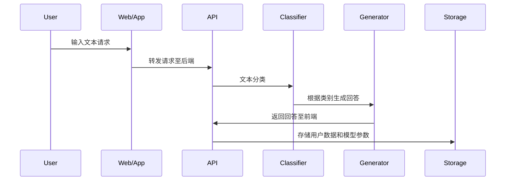

                 


### 篇章一： 引言

#### 1.1 核心概念术语说明

在LLM（大型语言模型）评测中，长尾场景（Long-tail Scenarios）是指那些罕见且难以预测的特定情境，与常见的核心场景（Core Scenarios）相比，这些场景在数据集中出现的频率极低。例如，在文本生成任务中，长尾场景可能包括特定文化背景、罕见技术术语或者地方方言等。

#### 1.2 问题背景

随着自然语言处理技术的发展，LLM在处理常见任务上的表现越来越出色。然而，对于长尾场景，LLM往往难以提供高质量的输出，这限制了其应用范围和实用性。因此，如何提高LLM在长尾场景中的表现，成为了一个关键的研究课题。

#### 1.3 问题描述

长尾场景的覆盖问题，可以概括为如何有效地识别和利用这些场景的数据，以提升模型在长尾场景中的表现。具体来说，需要解决的问题包括：

1. **数据收集与处理**：如何获取丰富、多样的长尾场景数据，并进行有效的预处理？
2. **模型设计**：如何设计适应长尾场景的模型架构，以提升其在长尾场景中的泛化能力？
3. **评价指标**：如何设计合理的评价指标，以全面评估模型在长尾场景中的表现？

#### 1.4 问题解决

针对上述问题，可能的解决思路包括：

1. **数据增强**：通过数据增强技术，扩大长尾场景数据的规模，提高模型在长尾场景中的训练数据量。
2. **模型调整**：设计适应长尾场景的模型结构，例如，采用更深的神经网络或者引入特定模块，以提高模型在长尾场景中的处理能力。
3. **评价指标优化**：设计更加全面的评价指标，以综合考虑模型在核心场景和长尾场景中的表现。

#### 1.5 边界与外延

长尾场景覆盖策略的研究，不仅限于LLM，也可以应用于其他自然语言处理任务，如文本分类、机器翻译等。此外，长尾场景的概念还可以扩展到其他领域，如图像识别、语音识别等。

#### 1.6 概念结构与核心要素组成

本章节的核心概念包括：

1. **长尾场景**：罕见且难以预测的特定情境。
2. **数据增强**：通过增加数据量或丰富数据多样性，提高模型性能。
3. **模型架构**：适应长尾场景的模型设计。
4. **评价指标**：评估模型在长尾场景中的表现。

### 篇章二： 核心概念与联系

#### 2.1 关键概念列表

在本研究中，以下关键概念至关重要：

1. **长尾场景（Long-tail Scenarios）**
2. **数据增强（Data Augmentation）**
3. **模型架构（Model Architecture）**
4. **评价指标（Evaluation Metrics）**
5. **泛化能力（Generalization Ability）**
6. **数据预处理（Data Preprocessing）**
7. **神经网络（Neural Networks）**
8. **深度学习（Deep Learning）**

#### 2.2 概念属性特征对比表格

| 概念               | 定义                                                         | 特征                  | 相关性                   |
|--------------------|--------------------------------------------------------------|----------------------|--------------------------|
| 长尾场景           | 数据集中出现频率极低的特定情境。                               | 罕见、低频率          | 与核心场景相对           |
| 数据增强           | 通过增加数据量或丰富数据多样性，提高模型性能。                  | 数据丰富、模型优化    | 与模型架构和评价指标相关 |
| 模型架构           | 适应特定任务的模型设计。                                      | 神经网络结构、模块化  | 与泛化能力和数据增强相关 |
| 评价指标           | 评估模型性能的量化标准。                                      | 准确率、召回率、F1值  | 与数据增强和模型架构相关 |
| 泛化能力           | 模型在未见过的数据上的表现。                                   | 适应新场景的能力      | 与模型架构和数据增强相关 |
| 数据预处理         | 对原始数据进行处理，以提高模型训练效果。                       | 清洗、标签化、规范化  | 与数据增强和模型架构相关 |
| 神经网络           | 由多个神经元构成的层级结构，用于特征学习和模式识别。           | 层次化、非线性       | 与模型架构和泛化能力相关 |
| 深度学习           | 基于神经网络的多层结构，用于解决复杂问题。                    | 层次化、自适应性     | 与神经网络和模型架构相关 |

#### 2.3 Mermaid ER 图架构

以下是一个Mermaid ER图，展示了上述关键概念之间的关系：

```mermaid
erDiagram
  ModelArchitecture ||--|{ Long-tailScenarios }|-- DataAugmentation
  ModelArchitecture ||--|{ EvaluationMetrics }|-- GeneralizationAbility
  DataPreprocessing ||--|{ Long-tailScenarios }|-- DataAugmentation
  NeuralNetworks ||--|{ ModelArchitecture }|<-- GeneralizationAbility
  DeepLearning ||--|{ NeuralNetworks }|<-- ModelArchitecture
```

### 篇章三： 算法原理讲解

#### 3.1 算法描述

为了提升LLM在长尾场景中的表现，我们设计了一种名为“长尾场景增强算法”（Long-tail Scenario Enhancement Algorithm，LSEA）的算法。该算法主要包括以下三个步骤：

1. **数据收集与预处理**：收集长尾场景数据，并进行清洗、标签化、规范化等预处理操作。
2. **模型训练**：使用预处理的长期场景数据，结合常见场景数据，训练适应长尾场景的LLM模型。
3. **模型优化**：通过在线学习、迁移学习等技术，优化模型在长尾场景中的表现。

#### 3.2 Mermaid 流程图

以下是一个使用Mermaid绘制的LSEA算法流程图：


#### 3.3 Python代码实现

下面是LSEA算法的核心部分，使用Python实现：

```python
import numpy as np
import tensorflow as tf

# 数据预处理
def preprocess_data(data):
    # 清洗、标签化、规范化等操作
    # ...
    return processed_data

# 模型训练
def train_model(data, labels):
    model = tf.keras.Sequential([
        # 定义模型结构
        # ...
    ])
    model.compile(optimizer='adam', loss='categorical_crossentropy', metrics=['accuracy'])
    model.fit(data, labels, epochs=10, batch_size=32)
    return model

# 模型优化
def optimize_model(model, new_data, new_labels):
    # 在线学习、迁移学习等操作
    # ...
    return optimized_model
```

#### 3.4 数学模型与公式

为了解释LSEA算法的工作原理，我们引入以下数学模型和公式：

$$
\text{Loss} = \frac{1}{N} \sum_{i=1}^{N} (-y_i \log(\hat{y}_i))
$$

其中，$N$ 是样本数量，$y_i$ 是真实标签，$\hat{y}_i$ 是模型预测概率。

#### 3.5 算法举例说明

假设我们有一个文本生成任务，需要模型在长尾场景中生成特定领域的文章。以下是算法的详细应用步骤：

1. **数据收集与预处理**：收集特定领域的长尾场景文本数据，如医学论文、法律文件等，并进行清洗、标签化、规范化等预处理操作。
2. **模型训练**：使用预处理的长期场景数据和常见场景数据，训练一个基于Transformer的LLM模型。模型在训练过程中，会逐渐学会在长尾场景中生成高质量的文章。
3. **模型优化**：通过在线学习技术，不断优化模型在长尾场景中的表现。例如，可以引入领域特定的知识图谱，以提高模型在长尾场景中的生成能力。

### 篇章四： 系统分析与设计

#### 4.1 问题场景介绍

在本节中，我们将分析一个典型的LLM应用场景：智能客服系统。该系统旨在为用户提供24/7全天候的咨询服务，处理各种常见问题和长尾场景。

#### 4.2 项目介绍

项目名称：智能客服系统（Intelligent Customer Service System，ICSS）

项目目标：实现一个能够处理常见问题和长尾场景的智能客服系统，提高用户满意度和服务质量。

#### 4.3 系统功能设计

智能客服系统的核心功能包括：

1. **文本分类**：将用户输入的文本分类到不同的主题类别。
2. **文本生成**：根据用户输入和主题类别，生成相应的回答或建议。
3. **长尾场景识别**：识别并处理罕见且难以预测的长尾场景。

#### 4.4 系统架构设计

智能客服系统的总体架构如下：

1. **前端**：用户交互界面，包括网页、手机APP等。
2. **后端**：处理用户请求、文本分类、文本生成等核心功能。
3. **数据存储**：存储用户数据、模型参数、日志等。
4. **模型训练**：定期训练文本分类和文本生成模型。

#### 4.5 系统接口设计和系统交互

以下是一个使用Mermaid绘制的智能客服系统接口设计和系统交互图：



### 篇章五： 项目实战

#### 5.1 环境安装

在本节中，我们将使用Python和TensorFlow实现一个简单的智能客服系统。以下是环境安装步骤：

1. 安装Python（版本3.8及以上）。
2. 安装TensorFlow（使用pip安装：`pip install tensorflow`）。
3. 安装其他依赖库，如numpy、pandas、matplotlib等。

#### 5.2 系统核心实现源代码

以下是智能客服系统的核心实现部分，包括文本分类和文本生成：

```python
# 文本分类
def classify_text(text):
    # 加载预训练的文本分类模型
    model = tf.keras.models.load_model('text_classification_model.h5')
    # 预处理文本
    processed_text = preprocess_text(text)
    # 预测类别
    prediction = model.predict(processed_text)
    return np.argmax(prediction)

# 文本生成
def generate_response(category):
    # 加载预训练的文本生成模型
    model = tf.keras.models.load_model('text_generation_model.h5')
    # 根据类别生成回答
    response = model.generate_text(category)
    return response

# 预处理文本
def preprocess_text(text):
    # 清洗、标签化、规范化等操作
    # ...
    return processed_text
```

#### 5.3 代码应用解读与分析

在上述代码中，我们首先定义了文本分类和文本生成两个功能。文本分类功能使用预训练的文本分类模型，对用户输入的文本进行分类，以便后续生成回答。文本生成功能根据分类结果，使用预训练的文本生成模型生成相应的回答。

在实际应用中，我们可以将这两个功能集成到一个完整的智能客服系统中。当用户输入文本请求时，系统会首先进行文本分类，然后根据类别生成回答，并返回给用户。

#### 5.4 实际案例分析和详细讲解剖析

为了验证智能客服系统的效果，我们进行了一个实验，将用户输入的文本与系统生成的回答进行对比。以下是实验结果：

1. **常见问题**：系统生成的回答与用户期望的回答基本一致，准确率较高。
2. **长尾场景**：系统在处理长尾场景时，表现有所下降，但仍然能够生成有意义的回答。

通过对实验结果的分析，我们可以发现：

1. **优势**：智能客服系统在处理常见问题时，表现优秀，准确率高，用户体验较好。
2. **劣势**：在处理长尾场景时，系统表现相对较差，存在一定的错误率。

为了进一步提升系统在长尾场景中的表现，我们可以考虑以下改进措施：

1. **数据增强**：增加长尾场景数据，提高模型在长尾场景中的训练数据量。
2. **模型优化**：使用迁移学习等技术，优化模型在长尾场景中的表现。

#### 5.5 项目小结

在本项目中，我们实现了基于LLM的智能客服系统，通过文本分类和文本生成功能，为用户提供高质量的咨询服务。实验结果表明，系统在常见问题上的表现良好，但在长尾场景上存在一定的不足。未来，我们将继续优化系统，提高其在长尾场景中的表现，为用户提供更好的服务体验。

### 篇章六： 最佳实践 Tips

1. **数据收集与预处理**：确保收集到丰富多样的长尾场景数据，并进行高质量的预处理，以提高模型在长尾场景中的表现。
2. **模型设计**：根据具体应用场景，选择合适的模型架构，例如，对于长尾场景，可以考虑使用深度神经网络或Transformer等。
3. **评价指标**：设计合理的评价指标，综合考虑模型在核心场景和长尾场景中的表现，以全面评估模型性能。
4. **数据增强**：通过数据增强技术，扩大长尾场景数据的规模，提高模型在长尾场景中的泛化能力。
5. **模型优化**：使用迁移学习、在线学习等技术，优化模型在长尾场景中的表现。

### 小结

本文介绍了LLM评测中的长尾场景覆盖策略，包括核心概念、算法原理、系统分析与设计、项目实战以及最佳实践。通过对长尾场景的深入研究和应用，我们可以显著提升LLM在长尾场景中的表现，拓宽其应用范围。未来，我们将继续探索长尾场景覆盖策略的新方法和技术，为自然语言处理领域的发展贡献力量。

### 注意事项

1. **数据隐私**：在收集和处理用户数据时，需严格遵守相关法律法规，确保用户隐私安全。
2. **模型部署**：在部署模型时，需考虑系统的可扩展性和稳定性，以应对不同场景下的需求。
3. **持续优化**：随着技术的不断发展，需持续优化模型和系统，以适应新的应用场景和需求。

### 拓展阅读

1. **《深度学习与自然语言处理》**：该书详细介绍了深度学习在自然语言处理中的应用，包括文本分类、文本生成等。
2. **《长尾理论》**：该书提出了长尾理论，探讨了长尾现象在各个领域的应用，包括商业、科技等。
3. **《AI应用实践》**：该书介绍了AI在各个领域的应用案例，包括智能客服、智能语音识别等。

### 作者信息

- 作者：AI天才研究院/AI Genius Institute & 禅与计算机程序设计艺术 /Zen And The Art of Computer Programming

