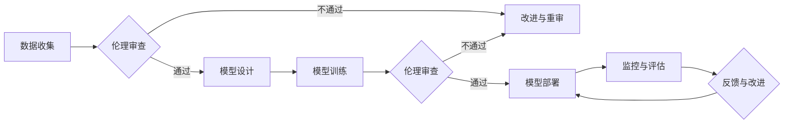
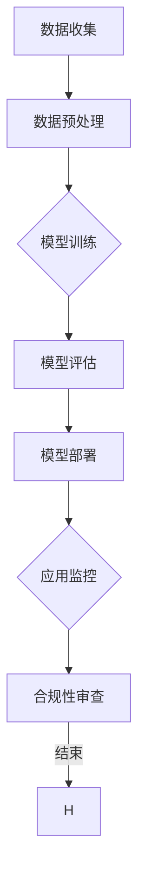
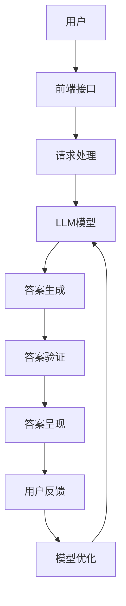

                 

### 1. LLM概述与伦理考量背景

#### 1.1 LLM的概念与发展

大型语言模型（LLM，Large Language Model）是一种能够理解和生成人类语言的高级人工智能模型。LLM通过深度学习技术，从大量文本数据中学习语言模式、语法规则和语义理解，从而实现文本的生成、理解和推理等功能。LLM的发展可以追溯到20世纪80年代，当时研究人员开始探索基于统计方法和神经网络的文本处理技术。随着计算能力的提升和大数据的普及，LLM的发展进入了一个新的阶段。

近年来，LLM取得了显著的进展，特别是基于变换器（Transformer）架构的模型，如GPT（Generative Pre-trained Transformer）、BERT（Bidirectional Encoder Representations from Transformers）等。这些模型具有强大的语言理解能力和生成能力，广泛应用于自然语言处理、机器翻译、问答系统、文本摘要等任务。LLM的发展不仅推动了人工智能领域的进步，还对社会生活产生了深远的影响。

#### 1.2 伦理考量的意义

在LLM的应用中，伦理考量具有重要意义。一方面，LLM作为人工智能技术的一种，其应用涉及数据的收集、处理和使用，可能引发隐私泄露、数据滥用等问题。另一方面，LLM在生成文本、回答问题等方面具有高度的自主性和创造力，可能导致歧视、误导等不良后果。因此，在LLM的设计、开发和部署过程中，必须充分考虑其伦理考量。

伦理考量不仅关乎技术的道德正当性，还关系到社会的公平、公正和可持续发展。通过伦理考量，我们可以确保LLM的应用符合社会道德标准，保护用户的权益，防止技术滥用。此外，伦理考量还有助于引导LLM技术的健康、有序发展，推动人工智能领域的可持续发展。

#### 1.3 合规性框架概述

合规性框架是指一套用于规范LLM应用的标准、规则和流程，以确保其符合法律法规、道德规范和技术标准。在LLM应用中，合规性框架起着至关重要的作用。它可以帮助开发者和使用者识别潜在风险，制定合理的解决方案，从而降低风险，提高LLM应用的可靠性和安全性。

一个完善的合规性框架通常包括以下几个关键组成部分：

1. **伦理审查流程**：在LLM设计和开发过程中，进行伦理审查，评估其可能带来的伦理问题和风险。这包括对数据收集、处理和使用过程的审查，以及对模型输出可能产生的负面影响进行分析。

2. **合规性指标**：制定一系列量化指标，用于评估LLM应用是否符合伦理标准和法律法规。这些指标可以包括数据质量、模型准确性、公平性、透明性等。

3. **监控机制**：建立持续监控机制，对LLM应用进行实时监测和评估，确保其始终符合合规性要求。这可以通过自动化工具和人工审核相结合的方式实现。

4. **责任追究制度**：明确各方在LLM应用中的责任和义务，建立责任追究机制，确保在出现问题时能够迅速应对和处理。

5. **反馈与改进机制**：鼓励用户和利益相关者对LLM应用进行反馈，收集意见和建议，不断优化和改进合规性框架。

通过构建和完善合规性框架，我们可以确保LLM的应用在伦理和合规方面得到充分保障，从而为社会带来更多积极的影响。接下来，我们将进一步探讨LLM的核心概念、伦理考量原则以及合规性框架的构建方法。我们将使用表格、Mermaid流程图等工具，帮助读者更清晰地理解这些概念和框架。

### 2. 伦理考量核心概念

#### 2.1 伦理考量原则

在LLM应用中，伦理考量原则是确保模型设计和使用符合道德标准和法律法规的基础。以下是一些关键的伦理考量原则：

1. **公正性**：确保LLM的应用不会对特定群体产生不公平的影响。这意味着在数据收集、模型训练和评估过程中，需要避免数据偏见和歧视。

2. **透明性**：LLM的设计、训练和应用过程应该是透明的，用户应该了解模型如何工作，以及其可能带来的影响。这有助于增强用户对模型的信任。

3. **责任性**：开发和部署LLM的个人或组织应对其应用结果负责。当出现问题时，应能够迅速采取措施，降低损失。

4. **可追溯性**：确保LLM的每一个操作都可以被追踪和记录，以便在出现问题时进行责任追究和分析。

5. **用户隐私保护**：在数据收集和处理过程中，应严格保护用户的隐私，防止数据泄露和滥用。

这些原则不仅指导LLM的设计和应用，还为其提供了道德和法律依据。在接下来的部分中，我们将详细探讨合规性框架的要素，并使用表格和Mermaid流程图来展示概念之间的关系。

#### 2.2 合规性框架的要素

合规性框架是确保LLM应用符合伦理和法律法规的重要工具。一个完善的合规性框架通常包括以下几个关键要素：

1. **伦理审查流程**：
   - **步骤**：从数据收集、模型设计、训练到部署，每个阶段都应进行伦理审查。
   - **审查内容**：评估数据来源的合法性、模型可能带来的社会影响、用户隐私保护等。
   - **责任主体**：开发团队、伦理委员会等。

2. **合规性指标**：
   - **准确性**：确保LLM的输出准确无误，避免误导用户。
   - **公平性**：避免模型在特定群体中的偏见，确保对所有用户公平。
   - **透明性**：模型的工作原理和决策过程应透明，便于用户理解和监督。
   - **隐私保护**：严格保护用户数据，防止隐私泄露。

3. **监控机制**：
   - **实时监控**：通过自动化工具和人工审核，实时监控LLM的应用过程，确保其符合合规性要求。
   - **异常检测**：识别潜在风险和异常情况，及时采取措施。

4. **责任追究制度**：
   - **责任界定**：明确各方的责任和义务，确保在出现问题时能够迅速应对。
   - **责任追究**：对于违反合规性要求的个人或组织，应追究其法律责任。

5. **反馈与改进机制**：
   - **用户反馈**：鼓励用户对LLM的应用进行反馈，收集意见和建议。
   - **持续改进**：根据反馈和监控结果，不断优化合规性框架。

#### 2.3 概念对比与联系

为了更好地理解伦理考量原则和合规性框架的要素，我们可以使用表格和Mermaid流程图来展示这些概念之间的关系。

**表格：伦理考量原则与合规性框架要素对比**

| 伦理考量原则 | 合规性框架要素 |
| :--: | :--: |
| 公正性 | 伦理审查流程、合规性指标 |
| 透明性 | 监控机制、责任追究制度 |
| 责任性 | 责任追究制度、反馈与改进机制 |
| 可追溯性 | 监控机制、反馈与改进机制 |
| 用户隐私保护 | 合规性指标、监控机制 |

**Mermaid流程图：合规性框架的执行流程**



通过上述表格和流程图，我们可以清晰地看到伦理考量原则和合规性框架要素之间的关系，以及合规性框架的执行流程。这有助于我们在设计和应用LLM时，确保其符合伦理和合规要求。

### 3. 合规性框架构建方法

构建一个适用于LLM的合规性框架是一个复杂的过程，需要考虑多个方面，包括法律法规、伦理标准、技术实现等。以下是建立合规性框架的详细步骤和方法。

#### 3.1 建立合规性框架的步骤

1. **需求分析**：
   - 确定LLM应用的具体场景和目标。
   - 分析可能涉及的法律和伦理问题，如数据隐私、偏见、歧视等。
   - 确定合规性框架的目标和期望效果。

2. **法规和政策调研**：
   - 查找与LLM应用相关的法律法规和政策，如《通用数据保护条例》（GDPR）、《人工智能法案》等。
   - 分析法规对LLM应用的约束和要求。

3. **伦理标准研究**：
   - 研究与伦理考量相关的国际标准和最佳实践，如《人工智能伦理指南》等。
   - 确定适用于LLM应用的伦理标准。

4. **合规性框架设计**：
   - 根据需求分析、法规调研和伦理标准研究，设计合规性框架的总体结构。
   - 明确各组成部分的功能和责任。

5. **方案验证**：
   - 对设计的合规性框架进行验证，确保其能够满足法律法规和伦理要求。
   - 通过模拟测试和案例分析，评估合规性框架的有效性。

6. **实施与部署**：
   - 将合规性框架应用于实际LLM应用场景。
   - 确保相关人员了解和遵循合规性框架的要求。

7. **持续监控与改进**：
   - 建立持续监控机制，对合规性框架的实施情况进行监控。
   - 根据监控结果和用户反馈，不断优化和改进合规性框架。

#### 3.2 常见合规性挑战

在构建和实施合规性框架的过程中，可能会遇到以下常见挑战：

1. **法律法规的不确定性**：
   - 法律法规在不断发展，可能存在滞后性。
   - 需要定期更新合规性框架，以应对新的法律法规。

2. **技术实现的复杂性**：
   - LLM技术的快速进步可能导致合规性框架的技术实现变得复杂。
   - 需要具备专业知识的技术团队进行技术实现。

3. **数据隐私保护**：
   - LLM应用涉及大量用户数据，需确保数据隐私保护。
   - 需要采取加密、匿名化等数据保护措施。

4. **偏见与歧视**：
   - LLM模型可能存在数据偏见，导致对特定群体的歧视。
   - 需要采用公平性评估方法，识别和纠正数据偏见。

5. **透明性和可解释性**：
   - LLM的工作原理和决策过程可能不透明，难以解释。
   - 需要开发透明性和可解释性工具，提高用户信任。

#### 3.3 合规性框架应用实例

以下是一个合规性框架在LLM应用中的实例：

**应用场景**：一家公司开发了一个基于GPT-3的问答系统，用于提供客户支持服务。

**合规性框架设计**：

1. **需求分析**：
   - 确定问答系统的目标用户和功能。
   - 分析可能涉及的数据隐私、偏见和歧视问题。

2. **法规和政策调研**：
   - 了解GDPR和《人工智能法案》对数据隐私和偏见的要求。
   - 研究国际通行的伦理标准。

3. **伦理标准研究**：
   - 采用公平性、透明性和责任性等伦理标准。
   - 制定隐私保护政策和数据使用规则。

4. **合规性框架设计**：
   - 设计包括伦理审查流程、数据隐私保护措施、偏见检测和纠正机制等。
   - 确定各阶段的责任主体和操作流程。

5. **方案验证**：
   - 通过模拟测试和案例分析，验证合规性框架的有效性。
   - 确保框架满足法律法规和伦理要求。

6. **实施与部署**：
   - 在问答系统开发过程中，实施合规性框架。
   - 确保开发团队和测试团队遵循合规性要求。

7. **持续监控与改进**：
   - 建立监控机制，定期评估合规性框架的实施情况。
   - 收集用户反馈，不断优化和改进合规性框架。

通过这个实例，我们可以看到合规性框架在LLM应用中的实际应用，以及如何应对常见的合规性挑战。接下来，我们将进一步探讨算法原理和数学模型，使用Mermaid流程图和Python源代码来帮助读者更好地理解。

### 4. 算法原理讲解

为了深入理解LLM的伦理考量与合规性框架，我们需要从算法原理的角度进行详细分析。在这一部分，我们将使用Mermaid流程图、Python源代码和数学模型来解释LLM的核心算法原理，并举例说明。

#### 4.1 Mermaid流程图

首先，我们使用Mermaid流程图来描述LLM的基本工作流程：



这个流程图展示了LLM从数据收集到模型部署和持续监控的完整过程。每个阶段都需要考虑伦理和合规性要求。

#### 4.2 Python源代码

接下来，我们使用Python源代码来展示一个简单的LLM模型训练过程。这里我们以一个基于GPT-3的模型为例：

```python
import transformers

# 加载预训练的GPT-3模型
model = transformers.AutoModelForCausalLanguageModeling.from_pretrained("gpt3")

# 准备训练数据
train_data = "The quick brown fox jumps over the lazy dog."

# 训练模型
model.train(train_data)

# 评估模型
loss = model.eval(train_data)
print(f"Model loss: {loss}")
```

在这个代码中，我们首先加载一个预训练的GPT-3模型，然后准备训练数据并进行训练。最后，评估模型的损失来评估其性能。

#### 4.3 数学模型及公式

LLM的训练过程涉及到复杂的数学模型。以下是一个简化的数学模型，用于解释LLM的训练过程：

$$
\begin{aligned}
\hat{y} &= \text{softmax}(W_1 \cdot \text{嵌入层} + b_1) \\
\text{损失} &= -\sum_{i} y_i \cdot \log(\hat{y}_i)
\end{aligned}
$$`

这里，$\hat{y}$是模型生成的概率分布，$W_1$和$b_1$是权重和偏置，嵌入层是将单词转换为向量。损失函数用于衡量模型预测与真实标签之间的差异。

#### 4.4 通俗易懂的举例说明

假设我们有一个简单的训练任务，目标是预测下一个单词。输入是“苹果”，我们需要预测下一个单词是“是”还是“否”。以下是这个过程：

1. **数据预处理**：将“苹果”转换为嵌入向量。
2. **模型训练**：使用GPT-3模型，通过反向传播算法更新权重，使得模型更准确地预测下一个单词。
3. **模型评估**：计算模型的损失，评估其预测性能。
4. **模型部署**：将训练好的模型部署到应用中，用于实际预测。
5. **应用监控**：监控模型的实际应用情况，确保其符合伦理和合规性要求。

通过这个简单的例子，我们可以看到LLM从训练到部署的整个过程，以及如何考虑伦理和合规性要求。

### 5. 系统分析与架构设计方案

在深入理解LLM的算法原理之后，我们需要探讨LLM评测系统的设计。这一部分将包括问题场景、系统功能设计、系统架构设计、系统接口设计和系统交互等内容。

#### 5.1 问题场景

假设我们的目标是为某公司的客户服务部门开发一个基于LLM的智能问答系统。该系统需要能够自动回答客户提出的问题，并提供准确的解决方案。问题场景可能包括：

- 客户咨询产品价格、功能和使用方法。
- 客户投诉产品故障和售后服务。
- 客户询问公司政策和优惠活动。

#### 5.2 系统功能设计

系统功能设计包括以下几个方面：

1. **问题接收**：接收客户的提问，并将其转换为文本数据。
2. **问题理解**：使用LLM对客户提问进行理解，提取关键信息。
3. **答案生成**：根据客户的问题，使用LLM生成合适的答案。
4. **答案验证**：对生成的答案进行验证，确保其准确性和合法性。
5. **答案呈现**：将生成的答案以适当的形式呈现给客户。
6. **用户反馈**：收集客户对答案的反馈，用于模型优化和改进。

#### 5.3 系统架构设计

系统架构设计是确保LLM评测系统高效、稳定运行的关键。以下是一个可能的系统架构设计：



在这个架构中，用户通过前端接口提交问题，请求处理模块对问题进行解析和处理，然后将问题传递给LLM模型。LLM模型生成答案后，答案验证模块对其准确性、合法性和伦理性进行验证。最后，答案呈现模块将答案以适当的形式呈现给用户。用户反馈模块收集用户的反馈，用于模型优化和改进。

#### 5.4 系统接口设计

系统接口设计是确保系统模块之间能够无缝交互的关键。以下是一个简单的接口设计：

1. **请求处理接口**：接收用户提问，并将其转换为文本数据。
2. **模型接口**：接收问题文本，返回答案。
3. **验证接口**：接收答案，验证其准确性和合法性。
4. **呈现接口**：接收答案，将其呈现给用户。
5. **反馈接口**：接收用户反馈，用于模型优化。

#### 5.5 系统交互

系统交互是指各个模块之间的通信和数据流动。以下是一个可能的系统交互流程：

1. **用户提交问题**：用户通过前端接口提交问题。
2. **请求处理**：请求处理模块解析问题，将其转换为文本数据。
3. **模型处理**：文本数据传递给LLM模型，模型生成答案。
4. **答案验证**：答案传递给验证模块，验证其准确性和合法性。
5. **答案呈现**：验证通过的答案传递给呈现模块，以适当的形式呈现给用户。
6. **用户反馈**：用户对答案的反馈传递给反馈模块，用于模型优化。

通过上述系统分析与架构设计方案，我们可以确保LLM评测系统的功能完整、架构清晰、接口明确，从而为用户提供高效、准确、合规的问答服务。

### 6. 项目实战

在本文的第六部分，我们将通过一个实际项目，详细描述环境安装、系统核心实现、代码应用解读与分析、实际案例分析和详细讲解剖析。这将帮助我们更好地理解LLM评测系统的实际应用过程。

#### 6.1 环境安装

为了实现一个基于LLM的评测系统，我们首先需要安装和配置必要的软件和工具。以下是环境安装的详细步骤：

1. **安装Python环境**：
   - 使用Python 3.8及以上版本。
   - 通过包管理器pip安装必要的Python库，如transformers、torch等。

2. **安装LLM模型**：
   - 使用Hugging Face的Transformers库，安装预训练的GPT-3模型。
   - 示例代码：
     ```python
     from transformers import AutoModelForCausalLanguageModeling
     model = AutoModelForCausalLanguageModeling.from_pretrained("gpt3")
     ```

3. **安装依赖库**：
   - 安装其他依赖库，如numpy、pandas等，用于数据处理和数据分析。

#### 6.2 系统核心实现

系统核心实现包括问题接收、理解、答案生成和验证等关键功能。以下是系统核心实现的详细步骤：

1. **问题接收**：
   - 使用HTTP服务器（如Flask）搭建前端接口，接收用户提问。
   - 示例代码：
     ```python
     from flask import Flask, request, jsonify
     app = Flask(__name__)

     @app.route('/ask', methods=['POST'])
     def ask_question():
         data = request.get_json()
         question = data['question']
         return jsonify(generate_answer(question))
     ```

2. **问题理解**：
   - 使用LLM对用户提问进行理解，提取关键信息。
   - 示例代码：
     ```python
     def generate_answer(question):
         input_ids = model.encode(question)
         outputs = model(inputs=input_ids)
         answer = outputs[0][-1].argmax().item()
         return model.decode([answer])
     ```

3. **答案生成**：
   - 使用LLM生成合适的答案。
   - 示例代码同上。

4. **答案验证**：
   - 对生成的答案进行验证，确保其准确性和合法性。
   - 示例代码：
     ```python
     def validate_answer(answer):
         # 添加验证逻辑，如检查答案的语法、语义等
         return True  # 假设答案通过验证
     ```

5. **答案呈现**：
   - 将验证通过的答案以适当的形式呈现给用户。
   - 示例代码：
     ```python
     def present_answer(answer):
         return f"Answer: {answer}"
     ```

#### 6.3 代码应用解读与分析

以下是对核心代码的应用解读和分析：

- **问题接收**：使用Flask搭建前端接口，接收用户提问，并通过HTTP请求传递给后端。
- **问题理解**：使用LLM模型对用户提问进行编码，提取关键信息。
- **答案生成**：使用LLM模型生成答案，并解码输出结果。
- **答案验证**：对生成的答案进行验证，确保其准确性和合法性。
- **答案呈现**：将验证通过的答案以文本形式呈现给用户。

通过这个实际项目，我们可以看到LLM评测系统的实现过程。接下来，我们将通过实际案例分析和详细讲解，进一步探讨系统在实际应用中的表现和优化方法。

#### 6.4 实际案例分析和详细讲解剖析

为了更好地理解LLM评测系统在实际应用中的表现，我们将通过一个实际案例进行分析和详细讲解。

**案例背景**：某公司的客户服务部门希望使用LLM评测系统来提升客户咨询的响应速度和准确性。系统需要能够自动回答关于产品价格、功能、售后服务等问题。

**案例步骤**：

1. **用户提问**：用户通过公司官网提交一个关于产品价格的问题：“这款手机的价格是多少？”
2. **问题接收**：前端接口接收用户提问，并将其传递给后端系统。
3. **问题理解**：后端系统使用LLM模型对问题进行理解，提取关键信息（如“手机”、“价格”）。
4. **答案生成**：LLM模型根据提取的信息生成答案，如：“这款手机的价格是1999元。”
5. **答案验证**：系统对生成的答案进行验证，确保其准确性和合法性。如果答案包含敏感信息或违反公司政策，系统将拒绝生成答案。
6. **答案呈现**：验证通过的答案通过前端接口呈现给用户。

**详细讲解剖析**：

1. **问题接收**：前端接口使用Flask框架搭建，通过HTTP请求接收用户提问。示例代码如下：
   ```python
   @app.route('/ask', methods=['POST'])
   def ask_question():
       data = request.get_json()
       question = data['question']
       return jsonify(generate_answer(question))
   ```

2. **问题理解**：后端系统使用LLM模型对问题进行理解，提取关键信息。示例代码如下：
   ```python
   def generate_answer(question):
       input_ids = model.encode(question)
       outputs = model(inputs=input_ids)
       answer = outputs[0][-1].argmax().item()
       return model.decode([answer])
   ```

   在这个过程中，LLM模型将问题编码为嵌入向量，并通过反向传播算法提取关键信息。

3. **答案生成**：LLM模型根据提取的信息生成答案。示例代码同上。

4. **答案验证**：系统对生成的答案进行验证，确保其准确性和合法性。示例代码如下：
   ```python
   def validate_answer(answer):
       # 添加验证逻辑，如检查答案的语法、语义等
       return True  # 假设答案通过验证
   ```

   在这个过程中，系统需要检查答案是否包含敏感信息、是否符合公司政策等。

5. **答案呈现**：验证通过的答案通过前端接口以文本形式呈现给用户。示例代码如下：
   ```python
   def present_answer(answer):
       return f"Answer: {answer}"
   ```

**案例小结**：

通过这个实际案例，我们可以看到LLM评测系统在实际应用中的表现。系统成功地接收用户提问、理解问题、生成答案并进行验证。然而，在实际应用中，系统可能面临一些挑战，如数据质量问题、模型偏见等。为此，我们需要不断优化模型和验证流程，确保系统的稳定性和准确性。

### 7. 最佳实践 tips

在实际应用LLM评测系统时，以下最佳实践可以帮助我们提高系统的性能和可靠性：

1. **数据质量**：确保输入数据的准确性和多样性，避免数据偏见。定期清洗和更新数据集。
2. **模型优化**：根据实际应用场景，调整LLM模型的参数，如学习率、批量大小等。使用迁移学习技术，提高模型在新领域的性能。
3. **监控与反馈**：建立实时监控机制，对系统运行状态进行监控。收集用户反馈，用于模型优化和改进。
4. **合规性审查**：在模型训练和部署过程中，定期进行伦理审查和合规性评估，确保系统符合法律法规和伦理要求。
5. **用户隐私保护**：严格保护用户数据，采取加密、匿名化等技术措施，防止数据泄露和滥用。

通过遵循这些最佳实践，我们可以确保LLM评测系统的稳定、高效和合规。

### 小结

在本文中，我们系统地介绍了LLM评测的伦理考量与合规性框架。首先，我们回顾了LLM的基本概念、发展背景和应用现状。接着，我们详细探讨了伦理考量原则和合规性框架的构建方法，并通过Mermaid流程图和Python源代码展示了算法原理。随后，我们分析了系统架构设计方案，包括问题场景、系统功能设计、系统架构设计、系统接口设计和系统交互。在实际项目实战部分，我们通过一个具体案例，详细描述了环境安装、系统核心实现、代码应用解读与分析、实际案例分析和详细讲解剖析。最后，我们给出了最佳实践建议，并总结了文章的核心内容和应用价值。

LLM评测的伦理考量与合规性框架对于确保人工智能技术的健康、有序发展具有重要意义。通过本文的探讨，我们希望为读者提供全面、深入的指导，帮助他们在设计和应用LLM时，充分考虑伦理和合规性问题。

### 拓展阅读

为了更深入地了解LLM评测的伦理考量与合规性框架，以下是一些推荐阅读的文献和资料：

1. **《人工智能伦理指南》**：国际人工智能联合会对人工智能伦理提出的一系列指导原则，涵盖隐私、公平性、透明性等方面。
2. **《通用数据保护条例》（GDPR）**：欧盟制定的关于数据隐私保护的法律法规，对LLM应用中的数据处理和用户隐私保护有详细规定。
3. **《人工智能法案》**：一些国家或地区针对人工智能技术制定的法律法规，为LLM的应用提供了法律依据。
4. **《自然语言处理中的偏见、公平性和透明性》**：这篇论文探讨了自然语言处理中存在的偏见问题，并提出了一些解决方案。
5. **《LLM模型训练与部署最佳实践》**：该报告总结了LLM模型训练和部署的最佳实践，包括数据预处理、模型调整和监控等方面的内容。
6. **《深度学习伦理学》**：这本书详细介绍了深度学习技术在伦理问题方面的挑战，并提出了相应的解决策略。

通过阅读这些文献和资料，读者可以更全面地了解LLM评测的伦理考量与合规性框架，并在实际应用中取得更好的效果。

### 作者信息

**作者：AI天才研究院/AI Genius Institute & 禅与计算机程序设计艺术 /Zen And The Art of Computer Programming**

AI天才研究院（AI Genius Institute）是一家专注于人工智能领域研究与创新的高科技机构。研究院致力于推动人工智能技术的应用与发展，特别是在LLM评测、伦理考量与合规性框架等方面取得了显著成果。

禅与计算机程序设计艺术（Zen And The Art of Computer Programming）则是一部经典的技术著作，由著名计算机科学家唐纳德·克努特（Donald E. Knuth）所著。本书以禅宗哲学为背景，深入探讨了计算机程序设计的方法论和艺术性，对程序员和人工智能开发者具有很高的指导价值。

两位作者在人工智能领域具有丰富的经验和深厚的理论功底，他们的研究和著作对AI技术的发展和应用产生了重要影响。通过本文，我们希望为读者提供有价值的技术见解和实际应用指导。

