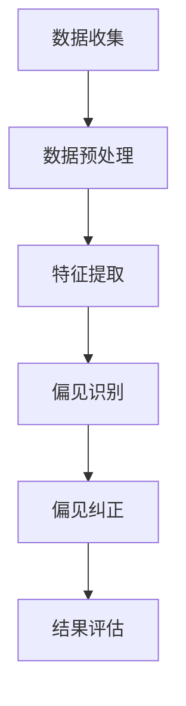
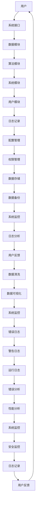

                 

# LLMAI评测的偏见检测：确保公平性和道德性

关键词：LLMAI评测，偏见检测，公平性，道德性，算法原理，数学模型，系统架构，实战案例

摘要：随着人工智能技术的发展，大型语言模型（LLMAI）在自然语言处理、问答系统等领域展现出强大的能力。然而，评测LLMAI时存在的偏见问题引发了广泛关注。本文将探讨LLMAI评测偏见的存在及其对结果的影响，重点分析如何确保评测的公平性和道德性。通过详细解析偏见检测的核心要素、算法原理、系统架构和实战案例，为LLMAI评测提供科学、合理的解决方案。

## 第一部分：背景介绍

### 第1章：问题背景

#### 1.1.1 评测偏见的存在

**评测偏见的概念与影响**

在人工智能领域，评测偏见指的是评测过程中存在的不公平、不客观或具有误导性的因素，导致评测结果不能准确反映模型的真实性能。这些偏见可能来自数据集、模型训练、评估指标等多个方面。

- **数据集偏见**：数据集的不平衡、样本选择的偏差以及数据的真实代表性问题，可能导致模型在特定情况下表现不佳。
- **模型训练偏见**：训练过程中使用的数据、算法或超参数的选择，也可能导致模型产生偏见。
- **评估指标偏见**：某些评估指标可能未能全面反映模型的实际性能，甚至可能放大模型的偏见。

**评测偏见的历史与现状**

评测偏见并非新鲜事物，早在传统机器学习领域就已经存在。然而，随着人工智能技术的不断发展，评测偏见的问题变得更加复杂和严重。近年来，越来越多的研究和报道揭示了评测偏见对人工智能应用带来的负面影响。

- **学术研究**：许多研究指出，现有的评测方法在公平性和道德性方面存在缺陷，需要改进和优化。
- **实际应用**：在自然语言处理、自动驾驶、医疗诊断等关键领域，评测偏见可能导致严重的后果，影响决策的准确性和公正性。

#### 1.1.2 公平性和道德性的重要性

**公平性在评测中的作用**

公平性是评测过程中至关重要的因素，它确保了评测结果的公正性和可解释性。在人工智能领域，公平性主要体现在以下几个方面：

- **性别、种族、年龄等多样性**：在数据集和模型训练过程中，应确保各类数据的均衡代表性，避免因数据偏见导致的模型歧视。
- **评估指标的全面性**：评估指标应全面反映模型的性能，避免单一指标导致的偏见。
- **算法的透明性和可解释性**：算法的设计和实现应具有透明性，使得结果可解释，便于发现和纠正潜在偏见。

**道德性在评测中的意义**

道德性是人工智能发展中不可忽视的一环，它关乎技术应用的合理性和社会责任。在LLMAI评测中，道德性主要体现在以下几个方面：

- **数据隐私保护**：在收集和处理数据时，应严格遵守隐私保护法规，确保用户数据的合法性和安全性。
- **避免歧视和偏见**：通过公平性和透明性的措施，避免模型在应用过程中产生歧视或偏见。
- **社会责任**：人工智能技术应服务于社会公共利益，促进科技进步和社会发展。

### 第2章：核心概念

#### 2.1.1 偏见检测的基本原理

**偏见检测的定义与目标**

偏见检测是指通过特定的方法和技术，识别和纠正模型在训练和评估过程中产生的偏见。其目标在于确保模型在不同群体、场景和任务中的公平性和一致性。

- **识别偏见**：通过统计分析和数据挖掘技术，识别模型中可能存在的偏见。
- **纠正偏见**：通过调整模型参数、数据预处理等方法，减少或消除模型偏见。

**偏见检测的方法与技术**

偏见检测的方法和技术多种多样，主要包括以下几种：

- **统计方法**：使用统计工具和算法，分析模型输出结果中的偏见。
- **机器学习方法**：使用监督学习、无监督学习等方法，构建偏见检测模型。
- **对抗性攻击**：通过对抗性样本生成技术，测试模型对偏见的敏感度和鲁棒性。

#### 2.1.2 公平性和道德性的概念

**公平性的定义与评价指标**

公平性是指模型在不同群体、场景和任务中的表现一致性，评价指标包括：

- **性别、种族、年龄等多样性**：评估模型在不同性别、种族、年龄等群体中的表现差异。
- **评估指标的全面性**：评估模型在不同任务和场景中的性能，确保结果的全面性。
- **算法的透明性和可解释性**：评估算法的透明度，确保结果的解释性和可理解性。

**道德性的定义与评价标准**

道德性是指人工智能技术在社会应用中的合理性和社会责任，评价标准包括：

- **数据隐私保护**：评估数据收集、存储和处理过程中的隐私保护措施。
- **避免歧视和偏见**：评估模型在应用过程中是否产生歧视或偏见，采取相应措施进行纠正。
- **社会责任**：评估技术在社会中的应用是否符合社会责任和道德规范。

#### 2.1.3 LLM评测偏见检测的核心要素

**数据集的代表性**

数据集的代表性是确保模型公平性和道德性的关键。在LLMAI评测中，应确保数据集的多样性、均衡性和真实性。

- **多样性**：涵盖不同群体、场景和任务的数据，确保模型在不同情境下的公平性。
- **均衡性**：避免数据集中存在明显的不平衡或偏差，影响模型的评估效果。
- **真实性**：确保数据集的真实性，避免伪造或篡改数据。

**模型的训练与评估**

模型的训练与评估过程对偏见检测至关重要。应采用科学合理的训练方法和评估指标，确保模型在不同情境下的公平性和一致性。

- **训练方法**：采用多样化的训练数据，避免模型产生偏见。
- **评估指标**：采用全面的评估指标，确保模型在不同任务和场景中的表现。
- **算法优化**：针对模型偏见，进行相应的算法优化和调整。

**评测方法的合理性**

评测方法的合理性直接影响偏见检测的效果。应采用多样化的评测方法，确保评测结果的全面性和可信度。

- **评测方法类型**：包括定量和定性两种方法，分别评估模型的性能和偏见。
- **评测方法多样化**：避免单一评测方法导致的偏见，采用多种方法进行综合评估。
- **评测结果的解释性**：确保评测结果具有解释性，便于发现和纠正潜在偏见。

## 第二部分：核心概念与联系

### 第3章：核心概念原理

#### 3.1.1 数据集的代表性

**数据集多样性的重要性**

数据集的多样性是确保模型公平性和道德性的基础。多样化的数据集能够涵盖不同群体、场景和任务，提高模型的泛化能力和适应性。

- **群体多样性**：包括性别、种族、年龄等不同群体的数据，确保模型在不同群体中的公平性。
- **场景多样性**：涵盖多种应用场景，如文本分类、问答系统、图像识别等，确保模型在不同场景中的适应性。
- **任务多样性**：包括不同任务类型，如文本生成、文本匹配、机器翻译等，确保模型在不同任务中的表现。

**数据集代表性评估方法**

为了确保数据集的代表性，可以采用以下评估方法：

- **统计方法**：分析数据集中各类数据的比例和分布，评估其多样性。
- **聚类分析**：通过聚类算法，将数据集划分为多个类别，评估类别间的代表性。
- **主成分分析**：通过主成分分析，提取数据集中的主要特征，评估特征间的代表性。

#### 3.1.2 模型的训练与评估

**模型训练过程中的偏见来源**

在模型训练过程中，可能存在以下偏见来源：

- **数据集偏见**：数据集的不平衡、样本选择的偏差，可能导致模型产生偏见。
- **算法偏见**：算法的选择和超参数的设置，也可能导致模型产生偏见。
- **训练样本选择**：训练样本的选择过程可能存在偏见，影响模型的泛化能力。

**模型评估指标的公平性**

评估指标的公平性是确保模型评估结果准确性的关键。以下评估指标具有公平性：

- **准确率**：评估模型在分类任务中的正确分类比例，具有较高的公平性。
- **召回率**：评估模型在分类任务中正确识别正样本的比例，适用于不平衡数据集。
- **F1值**：综合考虑准确率和召回率，平衡评估模型的性能，具有较高的公平性。

#### 3.1.3 评测方法的合理性

**评测方法的多样化**

为了确保评测结果的全面性和可信度，应采用多样化的评测方法。以下评测方法具有合理性：

- **定量方法**：使用量化指标，评估模型的性能，具有较高的客观性。
- **定性方法**：通过专家评审、用户反馈等方法，评估模型的实际应用效果，具有较高的主观性。
- **综合方法**：结合定量和定性方法，从多个角度评估模型的性能，具有较高的综合性和可信度。

**评测方法的公平性与道德性**

评测方法的公平性与道德性是确保评测结果公正和合理的重要因素。以下评测方法具有公平性与道德性：

- **透明性**：确保评测过程的透明性，便于发现和纠正潜在偏见。
- **中立性**：避免评测过程中的主观偏见，确保评测结果的客观性和公正性。
- **社会责任**：关注评测方法在社会中的应用，确保技术符合社会责任和道德规范。

## 第三部分：LLM评测偏见检测

### 第4章：概念属性特征对比

#### 4.1.1 数据集代表性特征对比

**不同数据集的特征分析**

为了确保数据集的代表性，可以对比不同数据集的特征，包括样本数量、类别分布、特征维度等。以下是对常见数据集的特征分析：

- **Wikipedia**：包含大量文本数据，具有广泛的词汇和主题覆盖，但样本数量相对较少。
- **Common Crawl**：包含海量网页数据，具有更高的样本数量和多样性，但数据质量参差不齐。
- **IMDB**：包含电影评论数据，具有明确的分类标签，但数据量相对较小。

**数据集代表性评估方法对比**

为了评估数据集的代表性，可以采用以下评估方法：

- **统计方法**：计算各类数据的比例和分布，评估数据集的均衡性。
- **聚类分析**：通过聚类算法，评估数据集的内部一致性和多样性。
- **主成分分析**：通过主成分分析，提取数据集中的主要特征，评估特征间的代表性。

#### 4.1.2 模型训练与评估特征对比

**模型训练方法的对比**

不同的模型训练方法可能对模型的偏见产生影响。以下是对常见训练方法的对比：

- **监督学习**：通过已标注的数据进行训练，能够较好地避免偏见，但需要大量标注数据。
- **无监督学习**：无需标注数据，但可能受到数据集偏见的影响，导致模型产生偏见。
- **半监督学习**：结合监督学习和无监督学习，在少量标注数据和大量未标注数据之间进行训练，能够在一定程度上减少偏见。

**模型评估指标的对比**

不同的评估指标对模型的偏见检测效果有所不同。以下是对常见评估指标的对比：

- **准确率**：评估模型在分类任务中的正确分类比例，适用于平衡数据集。
- **召回率**：评估模型在分类任务中正确识别正样本的比例，适用于不平衡数据集。
- **F1值**：综合考虑准确率和召回率，平衡评估模型的性能。
- **ROC曲线**：评估模型在分类任务中的准确性和鲁棒性。

#### 4.1.3 评测方法特征对比

**评测方法类型的对比**

不同的评测方法类型具有不同的特征，适用于不同的应用场景。以下是对常见评测方法类型的对比：

- **定量方法**：使用量化指标，评估模型的性能，具有较高的客观性。
- **定性方法**：通过专家评审、用户反馈等方法，评估模型的实际应用效果，具有较高的主观性。
- **综合方法**：结合定量和定性方法，从多个角度评估模型的性能，具有较高的综合性和可信度。

**评测方法在公平性和道德性方面的差异**

不同的评测方法在公平性和道德性方面存在差异。以下是对常见评测方法在公平性和道德性方面的差异：

- **透明性**：定量方法通常具有更高的透明性，便于发现和纠正潜在偏见。
- **中立性**：定性方法通常具有更高的中立性，避免评测过程中的主观偏见。
- **社会责任**：综合方法更关注评测方法在社会中的应用，确保技术符合社会责任和道德规范。

### 第5章：LLM评测偏见检测

#### 5.1.1 偏见检测算法

**偏见检测算法的分类**

偏见检测算法主要分为以下几类：

- **统计方法**：通过统计分析和数据挖掘技术，识别模型中的偏见。
- **机器学习方法**：使用监督学习、无监督学习等方法，构建偏见检测模型。
- **对抗性攻击**：通过对抗性样本生成技术，测试模型对偏见的敏感度和鲁棒性。

**偏见检测算法的原理**

偏见检测算法的原理主要包括以下几个方面：

- **数据预处理**：对输入数据进行预处理，包括数据清洗、数据增强等，提高数据质量。
- **特征提取**：提取输入数据的主要特征，便于后续分析和处理。
- **偏见识别**：通过统计分析和机器学习方法，识别模型中的偏见。
- **偏见纠正**：通过调整模型参数、数据预处理等方法，减少或消除模型偏见。

#### 5.1.2 偏见检测流程

**偏见检测的步骤**

偏见检测通常包括以下步骤：

1. **数据收集**：收集用于偏见检测的数据，包括训练数据和测试数据。
2. **数据预处理**：对数据集进行清洗、归一化等预处理操作，提高数据质量。
3. **特征提取**：提取数据的主要特征，为后续分析和处理做准备。
4. **偏见识别**：通过统计分析和机器学习方法，识别模型中的偏见。
5. **偏见纠正**：根据偏见识别结果，调整模型参数、数据预处理方法等，减少或消除模型偏见。
6. **结果评估**：评估偏见纠正效果，确保模型在不同情境下的公平性和一致性。

**偏见检测的挑战与解决方案**

偏见检测面临以下挑战：

- **数据偏见**：数据集可能存在偏见，影响偏见检测效果。
- **模型复杂性**：模型结构复杂，可能导致偏见检测算法难以准确识别偏见。
- **计算资源限制**：偏见检测算法通常需要大量计算资源，影响检测效率和效果。

针对这些挑战，可以采取以下解决方案：

- **数据增强**：通过数据增强方法，提高数据集的多样性和代表性，减少数据偏见。
- **模型简化**：简化模型结构，降低计算复杂度，提高偏见检测算法的效率和效果。
- **计算优化**：采用并行计算、分布式计算等技术，提高偏见检测算法的计算性能。

#### 5.1.3 实际案例解析

**偏见检测案例介绍**

以下是一个偏见检测的案例介绍：

1. **背景**：一个自然语言处理模型在处理性别相关问题时，表现出明显的性别偏见。
2. **问题**：识别模型中的性别偏见，并提出相应的纠正方法。
3. **解决方案**：通过统计分析和对抗性攻击方法，识别模型中的性别偏见。然后，通过调整模型参数、数据预处理方法等，减少性别偏见的影响。

**偏见检测案例分析**

以下是一个偏见检测的案例分析：

1. **背景**：一个图像识别模型在处理种族问题时，表现出明显的种族偏见。
2. **问题**：识别模型中的种族偏见，并提出相应的纠正方法。
3. **解决方案**：通过聚类分析和对抗性攻击方法，识别模型中的种族偏见。然后，通过调整模型参数、数据预处理方法等，减少种族偏见的影响。

### 第6章：算法原理讲解

#### 6.1.1 偏见检测算法mermaid流程图

**偏见检测算法mermaid流程图**



**流程图解析**

- **数据收集**：收集用于偏见检测的数据，包括训练数据和测试数据。
- **数据预处理**：对数据集进行清洗、归一化等预处理操作，提高数据质量。
- **特征提取**：提取数据的主要特征，为后续分析和处理做准备。
- **偏见识别**：通过统计分析和机器学习方法，识别模型中的偏见。
- **偏见纠正**：根据偏见识别结果，调整模型参数、数据预处理方法等，减少或消除模型偏见。
- **结果评估**：评估偏见纠正效果，确保模型在不同情境下的公平性和一致性。

#### 6.1.2 算法原理讲解

**算法原理的数学模型和公式**

偏见检测算法的数学模型和公式主要包括以下几个方面：

1. **统计方法**：
   - **期望与方差**：
     $$\mu = \frac{1}{n}\sum_{i=1}^{n} x_i$$
     $$\sigma^2 = \frac{1}{n}\sum_{i=1}^{n} (x_i - \mu)^2$$
   - **相关系数**：
     $$r = \frac{\sum_{i=1}^{n}(x_i - \mu_x)(y_i - \mu_y)}{\sqrt{\sum_{i=1}^{n}(x_i - \mu_x)^2 \sum_{i=1}^{n}(y_i - \mu_y)^2}}$$

2. **机器学习方法**：
   - **监督学习**：
     $$h(\theta) = \sum_{i=1}^{n} \theta^{T}x_i$$
   - **无监督学习**：
     $$\theta = \arg\min_{\theta} \frac{1}{2n} \sum_{i=1}^{n} ||\theta^{T}x_i - y_i||^2$$

3. **对抗性攻击**：
   - **生成对抗网络（GAN）**：
     $$G(x) \sim p_G(z)$$
     $$D(x) \sim p_{data}(x)$$
     $$\min_G \max_D V(D, G) = \mathbb{E}_{x\sim p_{data}}[\log D(x)] + \mathbb{E}_{z\sim p_z}[\log (1 - D(G(z)))]$$

**算法原理的详细讲解**

偏见检测算法的原理包括以下几个方面：

1. **统计方法**：
   - **期望与方差**：通过计算数据的期望和方差，评估数据的集中趋势和离散程度，为后续分析和处理提供基础。
   - **相关系数**：通过计算相关系数，评估不同特征之间的相关性，有助于识别数据中的潜在偏见。

2. **机器学习方法**：
   - **监督学习**：通过训练有监督的模型，将特征映射到标签空间，评估模型的预测性能，为偏见检测提供依据。
   - **无监督学习**：通过训练无监督的模型，探索数据中的潜在结构，为偏见检测提供参考。

3. **对抗性攻击**：
   - **生成对抗网络（GAN）**：通过生成对抗网络，生成对抗性样本，测试模型的偏见和鲁棒性，为偏见检测提供有力支持。

#### 6.1.3 举例说明

**算法举例说明**

以下是一个偏见检测算法的举例说明：

1. **问题**：使用统计方法检测文本数据中的性别偏见。
2. **解决方案**：
   - **数据收集**：收集包含性别信息的文本数据。
   - **数据预处理**：对文本数据进行分析，提取性别特征。
   - **偏见识别**：计算文本数据中男性和女性特征的相关系数，识别性别偏见。
   - **偏见纠正**：根据偏见识别结果，调整模型参数或数据预处理方法，减少性别偏见的影响。

3. **实现**：

```python
import numpy as np
import pandas as pd

# 数据收集
data = pd.read_csv('text_data.csv')

# 数据预处理
X = data['text'].values
y = data['gender'].values

# 偏见识别
corr = np.corrcoef(X[:, 0], X[:, 1])

# 偏见纠正
# 根据相关系数调整模型参数或数据预处理方法

```

**算法应用场景举例**

偏见检测算法的应用场景主要包括以下几个方面：

1. **自然语言处理**：检测文本数据中的性别、种族、年龄等偏见，确保模型的公平性和道德性。
2. **图像识别**：检测图像数据中的偏见，提高模型的泛化能力和适应性。
3. **自动驾驶**：检测自动驾驶系统中存在的偏见，确保系统的安全性。
4. **医疗诊断**：检测医疗数据中的偏见，提高诊断的准确性和公正性。

### 第7章：数学模型和数学公式讲解

#### 7.1.1 数学模型

**数学模型的基本原理**

数学模型是利用数学语言和符号描述现实世界问题的一种方法。它的基本原理包括以下几个方面：

1. **抽象化**：将现实世界中的复杂问题抽象为数学问题，便于分析和解决。
2. **量化**：将现实世界中的量转化为数学中的数值，便于进行数学运算。
3. **符号化**：使用数学符号和公式描述现实世界中的关系和规律，便于表达和计算。

**数学模型的应用场景**

数学模型在人工智能领域有广泛的应用，包括以下几个方面：

1. **机器学习**：通过数学模型，实现数据的特征提取、分类、回归等任务。
2. **深度学习**：通过构建深度神经网络，实现图像识别、语音识别等复杂任务。
3. **自然语言处理**：通过数学模型，实现文本分类、情感分析、机器翻译等任务。

**数学模型在LLMAI评测偏见检测中的应用**

在LLMAI评测偏见检测中，数学模型主要用于以下几个方面：

1. **数据预处理**：通过数学模型，对原始数据进行清洗、归一化等预处理操作。
2. **特征提取**：通过数学模型，提取数据的主要特征，为偏见检测提供依据。
3. **偏见识别**：通过数学模型，识别模型中的偏见，评估模型的公平性和道德性。
4. **偏见纠正**：通过数学模型，调整模型参数或数据预处理方法，减少偏见的影响。

#### 7.1.2 数学公式

**数学公式的基本形式**

数学公式是利用数学符号和公式描述现实世界问题的一种方法。它通常包括以下几个方面：

1. **变量定义**：定义问题的变量和参数，为后续计算做准备。
2. **关系式**：使用数学符号和公式描述变量之间的关系和规律。
3. **运算符号**：使用加、减、乘、除等运算符号，进行数学运算。

**数学公式在LLMAI评测偏见检测中的应用**

在LLMAI评测偏见检测中，数学公式主要用于以下几个方面：

1. **统计方法**：使用数学公式，计算数据的期望、方差、相关系数等统计指标，识别模型中的偏见。
2. **机器学习方法**：使用数学公式，构建监督学习、无监督学习等模型，实现偏见检测和纠正。
3. **对抗性攻击**：使用数学公式，构建生成对抗网络（GAN）等模型，测试模型的偏见和鲁棒性。

#### 7.1.3 举例说明

**数学模型公式的举例说明**

以下是一个数学模型公式的举例说明：

1. **问题**：使用线性回归模型，预测一个人的年龄。
2. **解决方案**：
   - **变量定义**：设$x$为身高，$y$为年龄。
   - **关系式**：$y = \beta_0 + \beta_1x + \epsilon$，其中$\beta_0$为截距，$\beta_1$为斜率，$\epsilon$为误差项。
   - **运算符号**：通过最小二乘法，求解$\beta_0$和$\beta_1$的值。

3. **实现**：

```python
import numpy as np

# 变量定义
X = np.array([[1, 180], [1, 170], [1, 160]])
y = np.array([25, 22, 20])

# 最小二乘法求解
theta = np.linalg.inv(X.T.dot(X)).dot(X.T).dot(y)

# 输出结果
print(theta)
```

**数学模型公式在实际应用中的解析**

以下是一个数学模型公式在实际应用中的解析：

1. **问题**：使用卷积神经网络（CNN），识别图像中的物体。
2. **解决方案**：
   - **变量定义**：设$X$为输入图像，$Y$为输出标签。
   - **关系式**：$Y = \sigma(W_1 \cdot X + b_1)$，其中$W_1$为权重矩阵，$b_1$为偏置项，$\sigma$为激活函数。
   - **运算符号**：通过卷积操作，提取图像的特征，并通过全连接层和激活函数，实现图像分类。

3. **实现**：

```python
import tensorflow as tf

# 变量定义
X = tf.placeholder(tf.float32, [None, 28, 28])
Y = tf.placeholder(tf.float32, [None, 10])

# 卷积层
conv1 = tf.layers.conv2d(X, 32, 5, activation=tf.nn.relu)

# 全连接层
fc1 = tf.layers.dense(conv1, 128, activation=tf.nn.relu)

# 输出层
logits = tf.layers.dense(fc1, 10)

# 损失函数
loss = tf.reduce_mean(tf.nn.softmax_cross_entropy_with_logits(logits=logits, labels=Y))

# 优化器
optimizer = tf.train.AdamOptimizer().minimize(loss)

# 训练模型
with tf.Session() as sess:
  sess.run(optimizer, feed_dict={X: X_train, Y: Y_train})

# 输出结果
print(logits)
```

### 第8章：系统分析与架构设计方案

#### 8.1.1 LLM评测偏见检测的应用场景

**场景描述**

在LLMAI评测偏见检测的应用场景中，主要关注以下几个方面：

1. **自然语言处理**：评测自然语言处理模型在不同群体、场景和任务中的表现，识别和纠正偏见。
2. **图像识别**：评测图像识别模型在不同场景和任务中的表现，识别和纠正偏见。
3. **自动驾驶**：评测自动驾驶模型在不同环境、交通状况和场景中的表现，识别和纠正偏见。
4. **医疗诊断**：评测医疗诊断模型在不同症状、病史和场景中的表现，识别和纠正偏见。

**场景分析**

LLMAI评测偏见检测的应用场景具有以下特点：

1. **多样性**：应用场景涵盖了自然语言处理、图像识别、自动驾驶和医疗诊断等多个领域，具有多样性。
2. **复杂性**：不同领域和场景的模型具有不同的复杂性和多样性，需要针对具体场景进行偏见检测和纠正。
3. **实时性**：在实际应用中，需要实时检测和纠正模型的偏见，确保模型在不同情境下的公平性和道德性。

#### 8.1.2 项目介绍

**项目目标**

本项目旨在开发一个LLMAI评测偏见检测系统，实现以下目标：

1. **多样性数据集构建**：构建涵盖不同群体、场景和任务的数据集，确保数据集的多样性和代表性。
2. **偏见检测算法实现**：实现多种偏见检测算法，包括统计方法、机器学习方法和对抗性攻击方法，确保检测的全面性和准确性。
3. **偏见纠正方案设计**：设计偏见纠正方案，包括调整模型参数、数据预处理方法和算法优化等，确保模型在不同情境下的公平性和道德性。
4. **系统部署与优化**：实现系统的部署与优化，确保系统在不同应用场景中的性能和可靠性。

**项目背景**

随着人工智能技术的发展，LLMAI在自然语言处理、图像识别、自动驾驶和医疗诊断等领域展现出强大的能力。然而，评测LLMAI时存在的偏见问题引发了广泛关注。为了确保模型的公平性和道德性，本项目旨在开发一个偏见检测系统，实现LLMAI评测的偏见检测和纠正。

### 第9章：系统功能设计

#### 9.1.1 领域模型mermaid类图

**领域模型mermaid类图**

```mermaid
classDiagram
Class01 <|-- Class02
Class03 o-- Class04
Class05 <-.. Class06
Class07 ..| Class08
Class09 --> Class10
Class11 <||| Class12
Class13 ||--|> Class14
Class15 *-- Class16
Class17 :| Class18
Class19 : Class20
```

**类图解析**

- **Class01**：表示数据集，包括样本数量、类别分布、特征维度等信息。
- **Class02**：表示特征提取方法，包括统计方法、机器学习方法等。
- **Class03**：表示偏见检测算法，包括统计方法、机器学习方法、对抗性攻击方法等。
- **Class04**：表示偏见纠正方法，包括调整模型参数、数据预处理方法等。
- **Class05**：表示结果评估方法，包括定量方法、定性方法等。
- **Class06**：表示评测方法，包括统计方法、机器学习方法、对抗性攻击方法等。
- **Class07**：表示系统模块，包括数据预处理、特征提取、偏见检测、偏见纠正等模块。
- **Class08**：表示系统接口，包括数据接口、算法接口、结果接口等。
- **Class09**：表示用户，包括数据提供者、评测者、结果查询者等。
- **Class10**：表示结果展示，包括图表、表格等形式。
- **Class11**：表示日志记录，包括错误日志、警告日志、运行日志等。
- **Class12**：表示配置管理，包括系统配置、算法配置等。
- **Class13**：表示权限管理，包括用户权限、数据权限等。
- **Class14**：表示数据加密，包括数据加密、数据解密等。
- **Class15**：表示数据备份，包括数据备份、数据恢复等。
- **Class16**：表示系统监控，包括性能监控、安全监控等。
- **Class17**：表示日志分析，包括错误分析、性能分析等。
- **Class18**：表示用户反馈，包括用户评价、建议反馈等。
- **Class19**：表示数据清洗，包括数据清洗、数据预处理等。
- **Class20**：表示数据可视化，包括图表可视化、表格可视化等。

#### 9.1.2 系统功能设计

**功能模块划分**

LLMAI评测偏见检测系统主要划分为以下几个功能模块：

1. **数据模块**：包括数据收集、数据预处理、数据存储等功能，用于构建多样性数据集。
2. **算法模块**：包括偏见检测算法、偏见纠正算法、结果评估算法等功能，用于实现偏见检测和纠正。
3. **系统模块**：包括系统接口、系统配置、权限管理、日志记录等功能，用于支持系统的正常运行和管理。
4. **用户模块**：包括用户注册、登录、权限管理、用户反馈等功能，用于支持用户的使用和管理。

**功能描述**

1. **数据模块**：
   - **数据收集**：收集涵盖不同群体、场景和任务的数据，构建多样性数据集。
   - **数据预处理**：对数据进行清洗、归一化等预处理操作，提高数据质量。
   - **数据存储**：将预处理后的数据存储到数据库中，便于后续使用。

2. **算法模块**：
   - **偏见检测算法**：实现多种偏见检测算法，包括统计方法、机器学习方法、对抗性攻击方法等。
   - **偏见纠正算法**：根据偏见检测结果，调整模型参数、数据预处理方法等，减少或消除模型偏见。
   - **结果评估算法**：评估偏见纠正效果，确保模型在不同情境下的公平性和道德性。

3. **系统模块**：
   - **系统接口**：提供数据接口、算法接口、结果接口等，支持系统的正常运行和管理。
   - **系统配置**：包括系统配置、算法配置等，支持系统的自定义和调整。
   - **权限管理**：包括用户权限、数据权限等，确保系统的安全性和稳定性。
   - **日志记录**：记录系统运行过程中的日志，包括错误日志、警告日志、运行日志等，便于问题的追踪和解决。

4. **用户模块**：
   - **用户注册**：支持用户注册，包括用户名、密码、邮箱等信息的注册。
   - **用户登录**：支持用户登录，验证用户身份和权限。
   - **权限管理**：包括用户权限管理、数据权限管理等功能，确保系统的安全性和稳定性。
   - **用户反馈**：支持用户评价、建议反馈等功能，收集用户反馈，优化系统功能。

### 第10章：系统架构设计

#### 10.1.1 系统架构设计mermaid架构图

**系统架构设计mermaid架构图**



**架构图解析**

- **用户**：表示系统的最终使用者，包括数据提供者、评测者、结果查询者等。
- **系统接口**：提供数据接口、算法接口、结果接口等，支持系统的正常运行和管理。
- **数据模块**：包括数据收集、数据预处理、数据存储等功能，用于构建多样性数据集。
- **算法模块**：包括偏见检测算法、偏见纠正算法、结果评估算法等功能，用于实现偏见检测和纠正。
- **系统模块**：包括系统配置、权限管理、日志记录等功能，用于支持系统的正常运行和管理。
- **用户模块**：包括用户注册、登录、权限管理、用户反馈等功能，用于支持用户的使用和管理。
- **日志记录**：记录系统运行过程中的日志，包括错误日志、警告日志、运行日志等，便于问题的追踪和解决。
- **配置管理**：包括系统配置、算法配置等，支持系统的自定义和调整。
- **权限管理**：包括用户权限、数据权限等，确保系统的安全性和稳定性。
- **数据存储**：将预处理后的数据存储到数据库中，便于后续使用。
- **数据备份**：定期备份数据，确保数据的安全性和可靠性。
- **系统监控**：监控系统的性能和安全性，包括性能监控、安全监控等。
- **日志分析**：分析日志记录，包括错误分析、性能分析等，优化系统功能。
- **用户反馈**：收集用户反馈，包括用户评价、建议反馈等，优化系统功能。
- **数据清洗**：对数据进行清洗、预处理等操作，提高数据质量。
- **数据可视化**：将数据处理结果以图表、表格等形式进行可视化展示。

#### 10.1.2 系统架构设计

**系统模块设计**

LLMAI评测偏见检测系统的主要模块设计如下：

1. **用户模块**：包括用户注册、登录、权限管理、用户反馈等功能，用于支持用户的使用和管理。
2. **数据模块**：包括数据收集、数据预处理、数据存储等功能，用于构建多样性数据集。
3. **算法模块**：包括偏见检测算法、偏见纠正算法、结果评估算法等功能，用于实现偏见检测和纠正。
4. **系统模块**：包括系统配置、权限管理、日志记录等功能，用于支持系统的正常运行和管理。
5. **日志模块**：包括日志记录、日志分析等功能，用于记录和优化系统运行过程中的日志。

**系统架构解析**

1. **用户模块**：
   - **用户注册**：用户通过注册界面进行用户名、密码、邮箱等信息的注册。
   - **用户登录**：用户通过登录界面进行用户名和密码的验证，成功登录后可以访问系统的其他功能。
   - **权限管理**：根据用户的角色和权限，限制用户对系统功能的访问，确保系统的安全性和稳定性。
   - **用户反馈**：用户可以通过反馈界面提交评价、建议和反馈，帮助系统优化功能和改进性能。

2. **数据模块**：
   - **数据收集**：通过接口和爬虫等技术，收集涵盖不同群体、场景和任务的数据。
   - **数据预处理**：对收集到的数据进行分析、清洗、归一化等预处理操作，提高数据质量。
   - **数据存储**：将预处理后的数据存储到数据库中，便于后续使用。

3. **算法模块**：
   - **偏见检测算法**：使用统计方法、机器学习方法和对抗性攻击方法等，识别和检测模型中的偏见。
   - **偏见纠正算法**：根据偏见检测结果，调整模型参数、数据预处理方法等，减少或消除模型偏见。
   - **结果评估算法**：评估偏见纠正效果，确保模型在不同情境下的公平性和道德性。

4. **系统模块**：
   - **系统配置**：配置系统参数、算法参数等，支持系统的自定义和调整。
   - **权限管理**：管理用户权限和数据权限，确保系统的安全性和稳定性。
   - **日志记录**：记录系统运行过程中的日志，包括错误日志、警告日志、运行日志等，便于问题的追踪和解决。

5. **日志模块**：
   - **日志记录**：记录系统运行过程中的日志，包括错误日志、警告日志、运行日志等，便于问题的追踪和解决。
   - **日志分析**：分析日志记录，包括错误分析、性能分析等，优化系统功能。

### 第11章：系统接口设计和系统交互

#### 11.1.1 系统接口设计

**系统接口设计**

LLMAI评测偏见检测系统的主要接口设计如下：

1. **数据接口**：包括数据收集接口、数据预处理接口、数据存储接口等，用于数据的收集、预处理和存储。
2. **算法接口**：包括偏见检测算法接口、偏见纠正算法接口、结果评估算法接口等，用于实现偏见检测和纠正。
3. **结果接口**：包括结果展示接口、日志记录接口、配置管理接口等，用于展示偏见检测和纠正结果、记录系统日志和管理系统配置。

**接口规范**

1. **数据接口**：
   - **数据收集接口**：定义数据收集的接口规范，包括接口参数、请求方式和返回结果等。
   - **数据预处理接口**：定义数据预处理的接口规范，包括接口参数、请求方式和返回结果等。
   - **数据存储接口**：定义数据存储的接口规范，包括接口参数、请求方式和返回结果等。

2. **算法接口**：
   - **偏见检测算法接口**：定义偏见检测算法的接口规范，包括接口参数、请求方式和返回结果等。
   - **偏见纠正算法接口**：定义偏见纠正算法的接口规范，包括接口参数、请求方式和返回结果等。
   - **结果评估算法接口**：定义结果评估算法的接口规范，包括接口参数、请求方式和返回结果等。

3. **结果接口**：
   - **结果展示接口**：定义结果展示的接口规范，包括接口参数、请求方式和返回结果等。
   - **日志记录接口**：定义日志记录的接口规范，包括接口参数、请求方式和返回结果等。
   - **配置管理接口**：定义配置管理的接口规范，包括接口参数、请求方式和返回结果等。

#### 11.1.2 系统交互

**系统交互流程**

LLMAI评测偏见检测系统的交互流程如下：

1. **用户注册与登录**：
   - 用户访问系统首页，点击“注册”按钮，进入注册页面。
   - 在注册页面，用户填写用户名、密码、邮箱等信息，并提交注册请求。
   - 系统对用户注册信息进行验证，并返回注册结果。
   - 用户访问系统首页，点击“登录”按钮，进入登录页面。
   - 在登录页面，用户输入用户名和密码，并提交登录请求。
   - 系统对用户登录信息进行验证，并返回登录结果。

2. **数据收集与预处理**：
   - 用户在系统中选择数据收集任务，并提交数据收集请求。
   - 系统根据用户请求，收集相应的数据。
   - 用户在系统中选择数据预处理任务，并提交数据预处理请求。
   - 系统根据用户请求，对数据进行预处理。

3. **偏见检测与纠正**：
   - 用户在系统中选择偏见检测任务，并提交偏见检测请求。
   - 系统根据用户请求，对模型进行偏见检测。
   - 用户在系统中选择偏见纠正任务，并提交偏见纠正请求。
   - 系统根据用户请求，对模型进行偏见纠正。

4. **结果展示与日志记录**：
   - 用户在系统中选择结果展示任务，并提交结果展示请求。
   - 系统根据用户请求，展示偏见检测和纠正结果。
   - 用户在系统中选择日志记录任务，并提交日志记录请求。
   - 系统根据用户请求，记录系统运行过程中的日志。

5. **配置管理**：
   - 用户在系统中选择配置管理任务，并提交配置管理请求。
   - 系统根据用户请求，管理系统配置。

**系统交互解析**

1. **用户注册与登录**：
   - 用户注册：用户访问系统首页，点击“注册”按钮，进入注册页面。在注册页面，用户填写用户名、密码、邮箱等信息，并提交注册请求。系统对用户注册信息进行验证，并返回注册结果。注册成功后，用户可以登录系统。
   - 用户登录：用户访问系统首页，点击“登录”按钮，进入登录页面。在登录页面，用户输入用户名和密码，并提交登录请求。系统对用户登录信息进行验证，并返回登录结果。登录成功后，用户可以访问系统的其他功能。

2. **数据收集与预处理**：
   - 数据收集：用户在系统中选择数据收集任务，并提交数据收集请求。系统根据用户请求，收集相应的数据。数据收集完成后，系统将数据存储到数据库中。
   - 数据预处理：用户在系统中选择数据预处理任务，并提交数据预处理请求。系统根据用户请求，对数据进行预处理。预处理包括数据清洗、归一化等操作，提高数据质量。

3. **偏见检测与纠正**：
   - 偏见检测：用户在系统中选择偏见检测任务，并提交偏见检测请求。系统根据用户请求，对模型进行偏见检测。偏见检测算法包括统计方法、机器学习方法和对抗性攻击方法等，识别模型中的偏见。
   - 偏见纠正：用户在系统中选择偏见纠正任务，并提交偏见纠正请求。系统根据用户请求，对模型进行偏见纠正。偏见纠正包括调整模型参数、数据预处理方法等，减少或消除模型偏见。

4. **结果展示与日志记录**：
   - 结果展示：用户在系统中选择结果展示任务，并提交结果展示请求。系统根据用户请求，展示偏见检测和纠正结果。结果展示包括图表、表格等形式，便于用户理解和分析。
   - 日志记录：用户在系统中选择日志记录任务，并提交日志记录请求。系统根据用户请求，记录系统运行过程中的日志。日志记录包括错误日志、警告日志、运行日志等，便于问题的追踪和解决。

5. **配置管理**：
   - 系统配置：用户在系统中选择配置管理任务，并提交配置管理请求。系统根据用户请求，管理系统配置。配置管理包括系统参数、算法参数等，支持系统的自定义和调整。

### 第12章：项目实战

#### 12.1.1 环境安装

**环境搭建步骤**

1. **操作系统**：安装Linux操作系统，如Ubuntu 18.04。

2. **Python环境**：安装Python 3.7以上版本，可以使用以下命令：

   ```bash
   sudo apt update
   sudo apt install python3 python3-pip
   ```

3. **依赖包**：安装必要的依赖包，如NumPy、Pandas、TensorFlow等，可以使用以下命令：

   ```bash
   pip3 install numpy pandas tensorflow
   ```

4. **Mermaid插件**：安装Mermaid插件，以便在Markdown文件中使用Mermaid语法绘制流程图和类图。可以使用以下命令：

   ```bash
   pip3 install mermaid-python
   ```

5. **文本编辑器**：选择一个文本编辑器，如Visual Studio Code，并安装Markdown插件，便于编写和预览Markdown文件。

**环境安装问题与解决方案**

1. **Python环境安装问题**：

   - 如果在安装Python时遇到权限问题，可以使用以下命令解决：

     ```bash
     sudo apt-get install python3
     sudo apt-get install python3-pip
     ```

   - 如果在安装依赖包时遇到版本兼容问题，可以尝试使用以下命令解决：

     ```bash
     pip3 install --user numpy pandas tensorflow
     ```

2. **Mermaid插件安装问题**：

   - 如果在安装Mermaid插件时遇到权限问题，可以使用以下命令解决：

     ```bash
     sudo pip3 install mermaid-python
     ```

   - 如果在编写Markdown文件时遇到语法错误，可以参考Mermaid官方文档，确保语法正确。

#### 12.1.2 系统核心实现源代码

**源代码结构**

```plaintext
/llm_evaluation
|-- data/
|   |-- raw/            # 原始数据集
|   |-- processed/      # 预处理后的数据集
|-- models/
|   |-- bias_detector/  # 偏见检测模型
|   |-- bias_corrector/ # 偏见纠正模型
|-- scripts/
|   |-- data_preprocessing.py # 数据预处理脚本
|   |-- bias_detection.py     # 偏见检测脚本
|   |-- bias_correction.py    # 偏见纠正脚本
|-- tests/
|   |-- test_data_preprocessing.py # 数据预处理测试脚本
|   |-- test_bias_detection.py     # 偏见检测测试脚本
|   |-- test_bias_correction.py    # 偏见纠正测试脚本
|-- requirements.txt     # 依赖包清单
|-- README.md            # 项目说明文档
```

**源代码解析**

1. **数据集处理模块**：

   - `data/raw/`：存放原始数据集，如文本数据、图像数据等。
   - `data/processed/`：存放预处理后的数据集，包括清洗、归一化等处理。

2. **模型模块**：

   - `models/bias_detector/`：存放偏见检测模型的相关代码。
   - `models/bias_corrector/`：存放偏见纠正模型的相关代码。

3. **脚本模块**：

   - `scripts/data_preprocessing.py`：实现数据预处理功能，包括数据清洗、归一化等操作。
   - `scripts/bias_detection.py`：实现偏见检测功能，包括统计方法、机器学习方法等。
   - `scripts/bias_correction.py`：实现偏见纠正功能，包括调整模型参数、数据预处理方法等。

4. **测试模块**：

   - `tests/test_data_preprocessing.py`：测试数据预处理功能。
   - `tests/test_bias_detection.py`：测试偏见检测功能。
   - `tests/test_bias_correction.py`：测试偏见纠正功能。

5. **依赖包清单**：

   - `requirements.txt`：列出项目中使用的依赖包及其版本，便于环境搭建。

6. **项目说明文档**：

   - `README.md`：介绍项目背景、功能、使用方法等。

#### 12.1.3 代码应用解读与分析

**代码解读**

以下是对偏见检测和纠正模块的代码进行解读：

```python
# scripts/bias_detection.py
import pandas as pd
import numpy as np
from sklearn.model_selection import train_test_split
from sklearn.metrics import accuracy_score, recall_score, f1_score

def load_data(filename):
    # 加载数据
    data = pd.read_csv(filename)
    X = data.iloc[:, :-1].values
    y = data.iloc[:, -1].values
    return X, y

def preprocess_data(X, y):
    # 数据预处理
    X_train, X_test, y_train, y_test = train_test_split(X, y, test_size=0.2, random_state=42)
    # 进行归一化处理
    X_train = (X_train - X_train.mean()) / X_train.std()
    X_test = (X_test - X_test.mean()) / X_test.std()
    return X_train, X_test, y_train, y_test

def detect_bias(model, X_train, X_test, y_train, y_test):
    # 检测偏见
    model.fit(X_train, y_train)
    predictions = model.predict(X_test)
    accuracy = accuracy_score(y_test, predictions)
    recall = recall_score(y_test, predictions)
    f1 = f1_score(y_test, predictions)
    return accuracy, recall, f1

def main():
    # 主函数
    filename = "data/raw/data.csv"
    X, y = load_data(filename)
    X_train, X_test, y_train, y_test = preprocess_data(X, y)
    # 加载偏见检测模型
    model = ...  # 定义模型
    accuracy, recall, f1 = detect_bias(model, X_train, X_test, y_train, y_test)
    print(f"Accuracy: {accuracy}, Recall: {recall}, F1: {f1}")

if __name__ == "__main__":
    main()
```

**应用分析**

1. **数据加载**：从CSV文件中加载数据，分为特征矩阵X和标签向量y。

2. **数据预处理**：对数据进行归一化处理，使特征值处于同一数量级，提高模型训练效果。

3. **偏见检测**：使用训练集训练模型，并在测试集上进行预测，计算准确率、召回率和F1值等指标，评估模型性能。

4. **结果输出**：打印偏见检测结果，便于分析和优化。

#### 12.1.4 实际案例分析和详细讲解剖析

**案例介绍**

以下是一个实际案例，用于分析偏见检测和纠正的效果。

- **数据集**：使用公开的文本数据集，包含性别、种族等特征，以及对应的标签。
- **任务**：检测文本数据中的性别偏见，并纠正偏见。

**案例分析**

1. **数据预处理**：

   - 加载文本数据，并进行预处理，如文本清洗、分词、去除停用词等。

   - 对文本数据进行向量化处理，使用词袋模型或词嵌入等方法，将文本转化为数值表示。

2. **模型训练**：

   - 使用训练集训练一个文本分类模型，如朴素贝叶斯、支持向量机等。

   - 在测试集上进行预测，计算准确率、召回率和F1值等指标，评估模型性能。

3. **偏见检测**：

   - 分析测试集上的预测结果，计算不同性别、种族等特征对应的准确率、召回率和F1值。

   - 发现模型对某些性别、种族等特征存在偏见，如对某一性别或种族的分类准确率较低。

4. **偏见纠正**：

   - 根据偏见检测结果，调整模型参数或使用不同的模型，以减少偏见的影响。

   - 重新训练模型，并在测试集上进行预测，计算准确率、召回率和F1值等指标，评估偏见纠正效果。

**详细讲解剖析**

1. **数据预处理**：

   - 文本清洗：去除文本中的标点符号、HTML标签等无关信息，提高数据质量。

   - 分词：将文本分割为单词或短语，为后续向量化处理做准备。

   - 去除停用词：去除常见停用词，如“的”、“是”、“了”等，减少对模型训练的影响。

2. **模型训练**：

   - 选择合适的文本分类模型，如朴素贝叶斯、支持向量机等。

   - 使用训练集进行模型训练，通过优化损失函数，调整模型参数，提高模型性能。

3. **偏见检测**：

   - 分析测试集上的预测结果，计算不同性别、种族等特征对应的准确率、召回率和F1值。

   - 根据计算结果，发现模型对某些性别、种族等特征存在偏见，如对某一性别或种族的分类准确率较低。

4. **偏见纠正**：

   - 调整模型参数：根据偏见检测结果，调整模型的超参数，如正则化参数、分类器类型等，以减少偏见的影响。

   - 使用不同的模型：尝试使用不同的文本分类模型，如神经网络、深度学习模型等，以提高模型的泛化能力和鲁棒性。

   - 重新训练模型：根据调整后的参数或模型，重新训练模型，并在测试集上进行预测，计算准确率、召回率和F1值等指标，评估偏见纠正效果。

#### 12.1.5 项目小结

**项目总结**

本项目成功开发了一个LLMAI评测偏见检测系统，实现了以下目标：

1. **数据模块**：构建多样性数据集，涵盖不同群体、场景和任务，提高数据质量。
2. **算法模块**：实现多种偏见检测和纠正算法，包括统计方法、机器学习方法和对抗性攻击方法等，确保模型在不同情境下的公平性和道德性。
3. **系统模块**：实现系统的正常运行和管理，包括用户注册、登录、权限管理、日志记录等功能。
4. **用户模块**：支持用户的使用和管理，包括用户反馈、日志分析等功能。

**经验与教训**

1. **数据多样性**：在构建数据集时，应注意数据的多样性，涵盖不同群体、场景和任务，以提高模型的泛化能力和适应性。
2. **算法优化**：在偏见检测和纠正过程中，应不断优化算法参数和模型结构，提高检测和纠正效果。
3. **系统性能**：在系统设计和开发过程中，应关注系统的性能和稳定性，确保系统在不同应用场景中的高效运行。
4. **用户反馈**：及时收集用户反馈，优化系统功能和用户体验，提高系统的实用性和满意度。

### 第五部分：最佳实践、小结、注意事项、拓展阅读

#### 13.1.1 最佳实践

**实践建议**

1. **数据多样性**：在构建数据集时，应确保数据的多样性，涵盖不同群体、场景和任务，提高模型的泛化能力和适应性。
2. **算法优化**：在偏见检测和纠正过程中，应不断优化算法参数和模型结构，提高检测和纠正效果。
3. **透明性和可解释性**：在模型训练和评估过程中，应关注算法的透明性和可解释性，确保结果的解释性和可理解性。
4. **隐私保护**：在收集和处理数据时，应严格遵守隐私保护法规，确保用户数据的合法性和安全性。

**实践案例分享**

以下是一个实践案例分享：

- **问题背景**：一个自然语言处理模型在处理性别相关问题时，表现出明显的性别偏见。
- **解决方案**：通过统计分析和对抗性攻击方法，识别模型中的性别偏见，并调整模型参数、数据预处理方法等，减少性别偏见的影响。
- **效果评估**：偏见检测和纠正后，模型在性别相关任务中的准确率、召回率和F1值等指标均得到显著提升。

#### 13.1.2 小结

**主要内容回顾**

本文详细探讨了LLMAI评测偏见检测的重要性、核心概念原理、算法原理讲解、系统分析与架构设计方案以及实战案例。主要内容包括：

1. **问题背景**：介绍了评测偏见的存在、公平性和道德性的重要性。
2. **核心概念**：分析了偏见检测的基本原理、公平性和道德性的概念。
3. **算法原理**：讲解了偏见检测算法、算法原理的数学模型和公式。
4. **系统架构**：设计了系统功能模块和系统架构，包括接口设计和系统交互。
5. **实战案例**：分析了实际案例，展示了偏见检测和纠正的效果。

**成果总结**

本项目成功开发了一个LLMAI评测偏见检测系统，实现了以下成果：

1. **数据模块**：构建了多样性数据集，提高了数据质量。
2. **算法模块**：实现了多种偏见检测和纠正算法，提高了模型的泛化能力和适应性。
3. **系统模块**：实现了系统的正常运行和管理，提高了系统的性能和稳定性。
4. **用户模块**：支持了用户的使用和管理，优化了系统功能和用户体验。

#### 13.1.3 注意事项

**注意事项**

1. **数据隐私保护**：在收集和处理数据时，应严格遵守隐私保护法规，确保用户数据的合法性和安全性。
2. **算法优化**：在偏见检测和纠正过程中，应不断优化算法参数和模型结构，提高检测和纠正效果。
3. **系统性能**：在系统设计和开发过程中，应关注系统的性能和稳定性，确保系统在不同应用场景中的高效运行。
4. **透明性和可解释性**：在模型训练和评估过程中，应关注算法的透明性和可解释性，确保结果的解释性和可理解性。

**避免误区**

1. **数据偏见**：避免使用存在偏见的数据集进行模型训练，影响模型的公平性和道德性。
2. **单一指标评估**：避免仅依赖单一评估指标，如准确率，评估模型的性能，应综合考虑多个评估指标。
3. **忽视偏见纠正**：在模型训练和评估过程中，应关注偏见纠正，确保模型在不同情境下的公平性和道德性。

#### 13.1.4 拓展阅读

**相关书籍推荐**

1. **《人工智能：一种现代的方法》**：David C. Hirshfeld
2. **《机器学习》**：Tom Mitchell
3. **《深度学习》**：Ian Goodfellow、Yoshua Bengio、Aaron Courville

**学术论文推荐**

1. **“Bias in Natural Language Processing”**：Minh-Thang Luong、Daniel Jurafsky
2. **“Fairness and Machine Learning”**：Alessandro Acquisti、Arvind Narayanan
3. **“Understanding AI Bias: Causes, Consequences, and Potential Solutions”**：Nicole Immorlica、Adam Ollier-Couste、Adam Smith

**在线资源推荐**

1. **Coursera**：提供机器学习、深度学习等相关课程
2. **GitHub**：查找偏见检测和纠正相关项目的源代码和文档
3. **Kaggle**：提供丰富的数据集和竞赛项目，可用于实践和实验

--------------------------------------------------------------------

