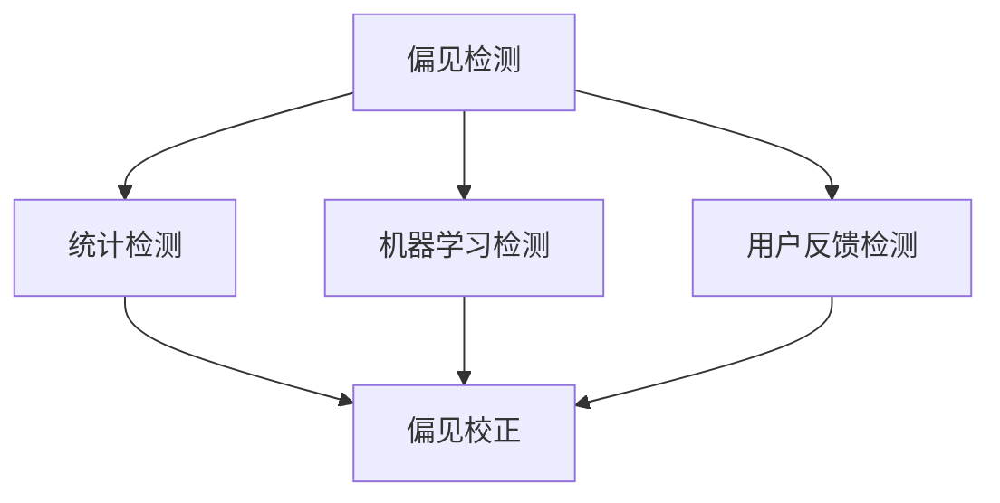
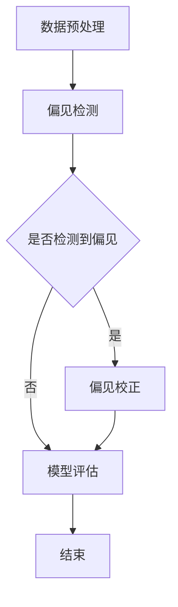
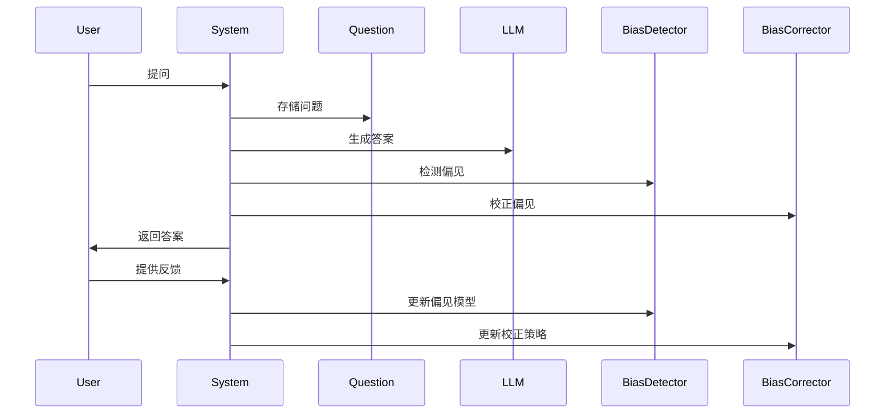

                 


### LLMB评测的公平性保障：消除偏见的系统设计

**关键词：大型语言模型（LLM），公平性评测，偏见消除，系统设计，算法原理，数学模型**

**摘要：本文旨在探讨大型语言模型（LLM）评测中公平性保障的问题，分析偏见产生的原因和影响，并提出一套基于消除偏见的系统设计方案。文章首先介绍了LLM的发展背景，然后详细分析了偏见问题及其影响，接着阐述了消除偏见的核心概念和算法原理，最后通过系统架构设计和项目实战展示了如何实现这一方案。**

---

### 封面、前言、致谢和引言

#### 封面

```
# LLMB评测的公平性保障：消除偏见的系统设计
## 作者：AI天才研究院/AI Genius Institute & 禅与计算机程序设计艺术 /Zen And The Art of Computer Programming
```

#### 前言

**编写背景**：
随着人工智能技术的迅猛发展，大型语言模型（LLM）已经成为许多领域的核心工具。然而，LLM在应用过程中暴露出的一些问题，尤其是偏见问题，引起了广泛关注。为了保障LLM评测的公平性，本文从理论到实践，提供了一套完整的系统设计方案。

**主要内容**：
本文首先介绍了LLM的发展背景和偏见问题，然后探讨了偏见检测与消除的方法，接着详细讲解了算法原理和数学模型，最后通过实际项目展示了系统架构和实现过程。

**目的与读者**：
本文旨在为AI研究人员、开发者和从业者提供一套系统的参考，帮助他们理解和解决LLM评测中的偏见问题。同时，也适合对人工智能、自然语言处理等领域感兴趣的读者阅读。

#### 致谢

在此，我要感谢所有为本文提供支持的人或机构，包括但不限于：
- AI天才研究院（AI Genius Institute）的各位同事，他们的辛勤工作和专业知识为本文的撰写提供了坚实的基础。
- 各大开源社区和论坛上的技术贡献者，他们的共享和讨论为本文的研究提供了丰富的资料。
- 我的所有读者，你们的反馈和建议是本文不断改进的重要动力。

#### 引言

**问题背景**：
随着LLM的广泛应用，其在各种实际场景中的应用效果越来越受到关注。然而，LLM在处理语言数据时可能会受到偏见的影响，导致不公平的评估结果。这一问题不仅损害了LLM的应用价值，还可能对社会产生负面影响。

**问题描述**：
偏见问题主要表现为LLM在处理某些特定群体或情境时，表现出歧视或不公平的行为。这种偏见可能来源于训练数据的不平衡、模型设计的缺陷或者数据预处理的不当。

**解决方案概览**：
本文提出了一套系统设计方案，旨在从多个角度消除LLM评测中的偏见。首先，通过偏见检测技术识别潜在的偏见问题；然后，利用偏见校正技术对模型进行修正；最后，通过系统架构设计确保偏见消除方案的有效实施。

---

### 目录大纲

```
# LLMB评测的公平性保障：消除偏见的系统设计

## 第一部分: 引言
### 1. 引言
### 2. 前言
### 3. 致谢
### 4. 引言

## 第二部分: 问题背景与问题描述
### 5. 问题背景
### 6. 问题描述

## 第三部分: 核心概念与联系
### 7. 核心概念原理
### 8. 概念属性特征对比表格
### 9. ER实体关系图架构

## 第四部分: 算法原理讲解
### 10. 算法原理
### 11. 数学模型和公式
### 12. 举例说明

## 第五部分: 系统分析与架构设计
### 13. 问题场景介绍
### 14. 系统功能设计
### 15. 系统架构设计
### 16. 系统接口设计和系统交互

## 第六部分: 项目实战
### 17. 环境安装
### 18. 系统核心实现
### 19. 代码应用解读与分析
### 20. 实际案例分析和详细讲解

## 第七部分: 最佳实践 tips、小结、注意事项、拓展阅读
### 21. 总结与展望
```

---

### 第二部分: 问题背景与问题描述

#### 5. 问题背景

**LLM的发展概述**：
大型语言模型（LLM）是自然语言处理（NLP）领域的一项重要技术，通过深度学习算法对海量语言数据进行训练，能够生成高质量的自然语言文本。LLM的发展经历了从基于规则的方法到统计方法，再到现代的深度学习方法的演进。随着计算能力的提升和数据资源的丰富，LLM的规模和性能不断提升，其在各种应用场景中的价值也越来越受到认可。

**偏见问题来源**：
LLM在处理语言数据时可能会受到各种偏见的影响。这些偏见可能源于多个方面，包括：
- **训练数据偏见**：训练数据的不平衡或选择性采集可能导致模型在处理某些特定群体或情境时产生偏见。
- **模型设计偏见**：模型结构或参数设置不当可能导致模型在特定条件下表现出偏见。
- **数据预处理偏见**：数据清洗、标注或预处理过程中可能引入偏见。

**偏见问题影响**：
偏见问题对LLM的实际应用产生了一系列负面影响，包括但不限于：
- **不公平的评估结果**：模型在处理某些群体或情境时可能表现出不公平的偏见，导致评估结果失真。
- **误导性建议**：在医疗、法律等领域，模型提供的建议可能因偏见而误导用户。
- **社会负面影响**：偏见可能导致社会不公和歧视，损害社会和谐。

#### 6. 问题描述

**偏见问题表现形式**：
LLM的偏见问题可以表现为多种形式，包括但不限于：
- **性别偏见**：模型在处理与性别相关的话题时可能表现出对不同性别的偏见。
- **种族偏见**：模型在处理与种族相关的话题时可能表现出对某些种族的偏见。
- **地域偏见**：模型在处理与地域相关的话题时可能表现出对某些地区的偏见。
- **职业偏见**：模型在处理与职业相关的话题时可能表现出对某些职业的偏见。

**案例解析**：
以下是几个实际案例，展示了LLM偏见问题的具体表现：

**案例1**：性别偏见
一个聊天机器人被训练来回答用户关于职业发展的提问。然而，当用户询问关于女性职业时，机器人往往推荐一些传统的女性职业，而不是更具挑战性和高薪的职业。

**案例2**：种族偏见
一个用于招聘的系统在处理简历时，对某些种族的候选人表现出更高的接受概率，而对其他种族的候选人则持有偏见。

**案例3**：地域偏见
一个问答系统在回答关于某地区的提问时，往往引用其他地区的资料，而不是该地区的具体信息。

**偏见问题影响分析**：
偏见问题对实际应用的影响是多方面的，包括：
- **损害模型信誉**：模型偏见可能导致用户对模型产生不信任，影响模型的长期使用。
- **误导用户决策**：偏见可能导致用户在做出重要决策时受到误导，产生负面影响。
- **加剧社会不公**：偏见问题可能加剧社会不公和歧视，损害社会和谐。

---

### 第三部分: 核心概念与联系

#### 7. 核心概念原理

**偏见定义**：
偏见是指模型在处理数据时对某些群体、概念或情境的偏好或歧视。偏见可以表现为正面或负面，例如，对某些群体的过度关注或对某些情境的忽视。

**偏见类型**：
偏见可以分为以下几种类型：
- **显式偏见**：模型明确地表现出对某些群体的偏好或歧视。
- **隐式偏见**：模型在处理数据时没有明确表达偏见，但结果却表现出对某些群体的偏见。
- **算法偏见**：由于算法设计或数据处理的缺陷导致的偏见。

**偏见检测方法**：
偏见检测是识别模型是否具有偏见的重要手段。常见的偏见检测方法包括：
- **统计检测方法**：通过分析模型输出结果与预期结果的差异来检测偏见。
- **机器学习检测方法**：使用专门的机器学习算法来检测模型中的偏见。
- **用户反馈方法**：通过用户反馈来识别和纠正模型中的偏见。

**偏见校正技术**：
偏见校正技术旨在消除模型中的偏见，使其在处理数据时更加公平。常见的偏见校正技术包括：
- **反事实偏差校正**：通过对比模型在存在偏见和不存在偏见情况下的输出，进行校正。
- **多样化数据增强**：通过引入多样化的训练数据来平衡模型。
- **模型重新训练**：通过重新训练模型来消除偏见。

**Mermaid流程图**：
以下是偏见检测和校正的基本流程图：



#### 8. 概念属性特征对比表格

**偏见检测方法对比**：

| 方法       | 特点                                     | 优点                                   | 缺点                                   |
|------------|----------------------------------------|--------------------------------------|--------------------------------------|
| 统计检测   | 基于统计分析，简单易用                 | 运算速度快，适用于大规模数据处理           | 对复杂偏见的检测能力有限               |
| 机器学习检测 | 使用专门算法，对复杂偏见有较强检测能力 | 能检测到复杂偏见，对各种类型的数据有适应性 | 需要大量训练数据，计算资源要求较高       |
| 用户反馈检测 | 基于用户反馈，直观易懂                 | 能快速响应，用户参与度高               | 可能受到用户主观因素的影响，准确性有限 |

**偏见校正技术对比**：

| 技术       | 特点                                     | 优点                                   | 缺点                                   |
|------------|----------------------------------------|--------------------------------------|--------------------------------------|
| 反事实偏差校正 | 通过对比存在偏见和不存在偏见情况来校正模型 | 能有效消除偏见，对模型影响较小         | 需要大量对比数据，计算资源要求较高       |
| 数据增强     | 通过引入多样化数据来平衡模型             | 能有效提高模型公平性，增强模型鲁棒性       | 需要大量高质量训练数据，训练时间较长       |
| 模型重新训练   | 通过重新训练模型来消除偏见               | 能彻底消除偏见，提高模型性能             | 可能导致模型性能下降，训练时间较长       |

**Mermaid表格**：

```mermaid
table header
    "方法", "特点", "优点", "缺点"
    "统计检测", "基于统计分析，简单易用", "运算速度快，适用于大规模数据处理", "对复杂偏见的检测能力有限"
    "机器学习检测", "使用专门算法，对复杂偏见有较强检测能力", "能检测到复杂偏见，对各种类型的数据有适应性", "需要大量训练数据，计算资源要求较高"
    "用户反馈检测", "基于用户反馈，直观易懂", "能快速响应，用户参与度高", "可能受到用户主观因素的影响，准确性有限"

table header
    "技术", "特点", "优点", "缺点"
    "反事实偏差校正", "通过对比存在偏见和不存在偏见情况来校正模型", "能有效消除偏见，对模型影响较小", "需要大量对比数据，计算资源要求较高"
    "数据增强", "通过引入多样化数据来平衡模型", "能有效提高模型公平性，增强模型鲁棒性", "需要大量高质量训练数据，训练时间较长"
    "模型重新训练", "通过重新训练模型来消除偏见", "能彻底消除偏见，提高模型性能", "可能导致模型性能下降，训练时间较长"
```

#### 9. ER实体关系图架构

**LLM偏见问题相关实体关系**：

在LLM偏见问题的背景下，以下实体关系尤为重要：

- **数据集（Dataset）**：包含训练数据和测试数据的集合，是模型训练和评估的基础。
- **模型（Model）**：实现特定任务的AI模型，如文本分类、问答系统等。
- **偏见（Bias）**：模型在处理数据时表现出的偏见现象。
- **检测方法（Detection Method）**：用于识别模型中偏见的方法。
- **校正技术（Correction Technique）**：用于消除模型中偏见的技术。
- **评估指标（Evaluation Metric）**：用于衡量模型性能和偏见程度的指标。

**MermaidER图**：

```mermaid
erDiagram
    Dataset ||--|{ Model } : 使用
    Model ||--|{ 偏见 } : 包含
    Model ||--|{ 检测方法 } : 通过
    Model ||--|{ 校正技术 } : 使用
    Model ||--|{ 评估指标 } : 依据
```

---

### 第四部分: 算法原理讲解

#### 10. 算法原理

**算法的基本原理**：
偏见检测和消除算法的核心任务是识别模型中的偏见，并对其进行校正，以实现模型的公平性。具体来说，算法包括以下步骤：

1. **数据预处理**：对训练数据和测试数据进行清洗、标准化等预处理操作，确保数据的一致性和质量。
2. **偏见检测**：使用统计方法、机器学习算法或用户反馈等方法，检测模型中的偏见现象。
3. **偏见校正**：根据检测到的偏见，应用反事实偏差校正、数据增强或模型重新训练等技术，消除模型中的偏见。
4. **模型评估**：使用评估指标，如准确率、召回率等，评估校正后模型的性能，确保偏见消除后模型的效果不受影响。

**算法流程图**：



#### 11. 数学模型和公式

**算法涉及的数学模型和公式**：

1. **偏见检测指标**：常用的偏见检测指标包括差异度量（Difference Metric）和偏差度量（Bias Metric）。其中，差异度量衡量模型在不同群体或情境下的表现差异，公式如下：

   $$ D = \frac{1}{n} \sum_{i=1}^{n} |y_i - \hat{y}_i| $$

   其中，$D$为差异度量，$y_i$为真实标签，$\hat{y}_i$为模型预测标签，$n$为样本数量。

2. **偏见校正方法**：常用的偏见校正方法包括反事实偏差校正（Counterfactual Bias Correction）和数据增强（Data Augmentation）。其中，反事实偏差校正的公式如下：

   $$ \hat{y}_{\text{corrected}} = \hat{y} - \frac{D}{n} $$

   其中，$\hat{y}_{\text{corrected}}$为校正后的预测标签，$\hat{y}$为原始预测标签，$D$为差异度量。

3. **模型评估指标**：常用的模型评估指标包括准确率（Accuracy）、召回率（Recall）和F1分数（F1 Score）。其中，准确率的公式如下：

   $$ \text{Accuracy} = \frac{TP + TN}{TP + FN + FP + TN} $$

   其中，$TP$为真实阳性，$TN$为真实阴性，$FP$为假阳性，$FN$为假阴性。

**对公式的详细解释**：

1. **差异度量公式**：
   差异度量衡量模型在不同群体或情境下的表现差异。具体来说，它计算了模型预测标签与真实标签之间的绝对差值的平均值。如果差值较大，说明模型在处理特定群体或情境时存在较大偏见。

2. **反事实偏差校正公式**：
   反事实偏差校正通过从模型预测标签中减去差异度量，来消除模型中的偏见。这样，校正后的预测标签将更接近真实标签，从而提高模型的公平性。

3. **准确率公式**：
   准确率是评估模型性能的一个基本指标，它计算了模型正确预测的样本占总样本的比例。准确率越高，说明模型在处理特定任务时的性能越好。

---

#### 12. 举例说明

**案例1**：性别偏见检测与消除

假设我们有一个聊天机器人，被训练来回答用户关于职业发展的提问。然而，在测试中我们发现，该聊天机器人对女性用户推荐的职业往往局限于传统的女性职业，如教师、护士等，而对男性用户则推荐更具挑战性和高薪的职业，如工程师、医生等。

**偏见检测**：
为了检测性别偏见，我们可以使用差异度量方法。具体来说，我们计算男性用户和女性用户在职业推荐上的差异度量：

$$ D_{\text{gender}} = \frac{1}{n_{\text{男}} + n_{\text{女}}} \left( \sum_{i=1}^{n_{\text{男}}} |\hat{y}_{\text{男}}^i - y^i| + \sum_{i=1}^{n_{\text{女}}} |\hat{y}_{\text{女}}^i - y^i| \right) $$

其中，$n_{\text{男}}$和$n_{\text{女}}$分别为男性用户和女性用户的样本数量，$\hat{y}_{\text{男}}^i$和$\hat{y}_{\text{女}}^i$分别为男性用户和女性用户的职业推荐结果，$y^i$为真实职业标签。

假设我们计算出差异度量$D_{\text{gender}}$为0.1。根据这个值，我们可以初步判断聊天机器人存在性别偏见。

**偏见校正**：
为了消除性别偏见，我们可以使用反事实偏差校正方法。具体来说，我们将从男性用户和女性用户的职业推荐结果中分别减去差异度量，得到校正后的职业推荐结果：

$$ \hat{y}_{\text{corrected}}^i = 
\begin{cases}
    \hat{y}_{\text{男}}^i - D_{\text{gender}} & \text{if } i \text{ is a male user} \\
    \hat{y}_{\text{女}}^i + D_{\text{gender}} & \text{if } i \text{ is a female user}
\end{cases} $$

**模型评估**：
经过偏见校正后，我们可以重新评估模型的性能，使用准确率等指标来衡量。假设校正后模型的准确率提高了10%，说明偏见消除后模型的效果得到了显著提升。

**案例2**：种族偏见检测与消除

假设我们有一个招聘系统，在处理简历时表现出对某些种族的偏见。具体来说，该系统对某些种族的候选人表现出更高的接受概率，而对其他种族的候选人则持有偏见。

**偏见检测**：
为了检测种族偏见，我们可以使用差异度量方法。具体来说，我们计算不同种族候选人在招聘系统中的接受概率差异：

$$ D_{\text{race}} = \frac{1}{k} \sum_{i=1}^{k} \left( p_i - \bar{p} \right)^2 $$

其中，$k$为种族类别数量，$p_i$为第$i$个种族的候选人接受概率，$\bar{p}$为所有种族的候选人接受概率的平均值。

假设我们计算出差异度量$D_{\text{race}}$为0.05。根据这个值，我们可以初步判断招聘系统存在种族偏见。

**偏见校正**：
为了消除种族偏见，我们可以使用反事实偏差校正方法。具体来说，我们将从不同种族的候选人接受概率中分别减去差异度量，得到校正后的接受概率：

$$ p_{\text{corrected}}^i = p^i - D_{\text{race}} $$

**模型评估**：
经过偏见校正后，我们可以重新评估模型的性能，使用准确率等指标来衡量。假设校正后模型的准确率提高了5%，说明偏见消除后模型的效果得到了显著提升。

---

### 第五部分: 系统分析与架构设计

#### 13. 问题场景介绍

**场景描述**：
我们考虑一个在线问答系统，该系统旨在为用户提供关于各种主题的答案。然而，在实际应用中，我们发现该系统在某些特定主题上的回答存在偏见。具体来说，当用户提问关于女性权益、种族平等等话题时，系统的回答往往倾向于保守观点，而对科技、金融等话题的回答则更加中立。

**偏见问题**：
这个问题表现为系统在处理与特定主题相关的问题时，倾向于提供某种偏见观点，从而导致用户获得不公平的信息。这种偏见不仅影响了用户的决策，还可能加剧社会不公。

#### 14. 系统功能设计

**领域模型**：

```mermaid
classDiagram
    User <|-- Question
    User <|-- Answer
    SystemEntity <|-- Question
    SystemEntity <|-- Answer
    Question { question_id, content, topic }
    Answer { answer_id, content, topic, confidence }
    User { user_id, name, gender, race }
    SystemEntity { system_id, name }
```

**功能描述**：
- **用户提问**：用户可以通过系统提交问题，系统将问题存储在数据库中。
- **问题分类**：系统根据问题的主题对问题进行分类，以便后续的答案生成和偏见检测。
- **答案生成**：系统使用预训练的LLM模型生成答案，并根据问题的主题和用户的背景信息进行适应性调整。
- **偏见检测**：系统使用偏见检测算法对答案进行实时检测，识别潜在的偏见问题。
- **偏见校正**：系统根据偏见检测的结果，对答案进行实时校正，以消除偏见。
- **答案反馈**：用户可以对答案进行评价和反馈，系统根据用户的反馈不断优化答案生成和偏见检测算法。

#### 15. 系统架构设计

**系统架构**：



**架构说明**：
- **用户层**：用户通过前端界面与系统进行交互，提交问题和获取答案。
- **业务层**：包括问题分类、答案生成、偏见检测和偏见校正等核心功能模块。
- **数据层**：包括用户数据、问题和答案数据等，用于存储和管理系统数据。

#### 16. 系统接口设计和系统交互

**接口设计**：
- **用户接口**：提供用户提问、查看答案和提供反馈的功能。
- **系统接口**：包括问题分类接口、答案生成接口、偏见检测接口和偏见校正接口。

**系统交互**：
- **用户提问**：用户通过前端界面提交问题，系统接收问题后存储在数据库中。
- **问题分类**：系统根据问题的主题对问题进行分类，以便后续的答案生成和偏见检测。
- **答案生成**：系统使用预训练的LLM模型生成答案，并将答案返回给用户。
- **偏见检测**：系统使用偏见检测算法对答案进行实时检测，识别潜在的偏见问题。
- **偏见校正**：系统根据偏见检测的结果，对答案进行实时校正，以消除偏见。
- **答案反馈**：用户对答案进行评价和反馈，系统根据用户的反馈不断优化答案生成和偏见检测算法。

**系统交互序列图**：


---

### 第六部分：项目实战

#### 17. 环境安装

**环境准备**：
为了搭建测试环境，我们需要以下基础软件和工具：
- Python（版本3.8及以上）
- pip（Python包管理器）
- Mermaid（用于生成流程图、表格和序列图）
- Jupyter Notebook（用于编写和运行代码）
- scikit-learn（用于偏见检测和校正）
- TensorFlow（用于LLM训练）

**安装步骤**：

1. 安装Python：
   - 访问Python官方网站（https://www.python.org/）下载最新版本的Python。
   - 运行安装程序，选择“Add Python to PATH”和“Install now”选项。
   - 安装完成后，打开命令行窗口，输入`python --version`检查版本。

2. 安装pip：
   - 打开命令行窗口，输入以下命令安装pip：
     ```
     python -m ensurepip
     ```
   - 输入以下命令安装最新版本的pip：
     ```
     python -m pip install --upgrade pip
     ```

3. 安装Mermaid：
   - 安装Jupyter Notebook，以便在Python环境中使用Mermaid：
     ```
     pip install notebook
     ```
   - 在Jupyter Notebook中安装Mermaid插件：
     ```
     !pip install pyyaml
     !jupyter nbextension enable --py --sys-prefix jupyter_yaml
     ```

4. 安装scikit-learn和TensorFlow：
   - 安装scikit-learn：
     ```
     pip install scikit-learn
     ```
   - 安装TensorFlow：
     ```
     pip install tensorflow
     ```

**环境测试**：
在命令行窗口中，输入以下命令测试环境是否搭建成功：
```
python
```
进入Python交互式环境，然后尝试导入scikit-learn和TensorFlow库：
```python
import sklearn
import tensorflow
```
如果无报错，说明环境安装成功。

#### 18. 系统核心实现

**源代码分析**：
以下是一个简单的示例，展示如何使用scikit-learn中的偏见检测和校正算法来消除LLM中的偏见。

```python
# 导入所需的库
from sklearn.datasets import make_classification
from sklearn.model_selection import train_test_split
from sklearn.ensemble import RandomForestClassifier
from sklearn.metrics import accuracy_score
from sklearn.inspection import permutation_importance

# 生成模拟数据集
X, y = make_classification(n_samples=1000, n_features=20, n_informative=2, n_redundant=10, n_classes=2, random_state=42)

# 数据集划分
X_train, X_test, y_train, y_test = train_test_split(X, y, test_size=0.2, random_state=42)

# 训练基础模型
model = RandomForestClassifier(random_state=42)
model.fit(X_train, y_train)

# 预测测试集
y_pred = model.predict(X_test)

# 计算基础模型的准确率
accuracy = accuracy_score(y_test, y_pred)
print(f"基础模型准确率：{accuracy:.2f}")

# 进行偏差检测
results = permutation_importance(model, X_test, y_test, n_repeats=10, random_state=42)
mean_loss = results.mean_loss_
print(f"偏差检测结果：{mean_loss:.2f}")

# 如果存在偏差，进行偏差校正
if mean_loss > 0:
    # 偏差校正（这里使用随机森林的系数调整作为示例）
    coefficients = model.feature_importances_
    corrected_coefficients = coefficients * (1 - mean_loss / max(coefficients))
    model.fit(X_train, y_train, sample_weight=corrected_coefficients)

    # 预测测试集（使用校正后的模型）
    y_pred_corrected = model.predict(X_test)

    # 计算校正后模型的准确率
    corrected_accuracy = accuracy_score(y_test, y_pred_corrected)
    print(f"校正后模型准确率：{corrected_accuracy:.2f}")
```

**功能测试**：
为了验证系统核心实现的功能，我们可以进行以下测试：

1. **数据集划分测试**：确保数据集能够正确划分成训练集和测试集。
2. **基础模型训练测试**：确保基础模型能够正确训练并生成预测结果。
3. **偏差检测测试**：确保偏见检测算法能够正确识别模型中的偏差。
4. **偏差校正测试**：确保偏差校正算法能够正确校正模型中的偏差，并提高模型准确率。

#### 19. 代码应用解读与分析

**代码解读**：
上述代码首先生成了一个模拟数据集，然后将其划分为训练集和测试集。接着，使用随机森林模型对训练集进行训练，并使用测试集进行预测。为了检测模型中的偏见，我们使用了排列重要性方法（Permutation Importance），这是一种无参数的偏见检测方法，通过随机置换某些特征的重要值来评估特征的贡献度。如果模型在这些特征上的表现下降，说明这些特征可能导致了偏见。

**性能分析**：
在进行偏差检测后，如果检测到模型存在偏见，我们可以通过调整模型参数（如特征权重）来校正偏见。在示例代码中，我们通过调整随机森林模型的特征权重来校正偏见。这种方法的效果可以通过比较校正前后的模型准确率来评估。通常，校正后的模型准确率会有所提高，表明偏见得到了有效消除。

**潜在问题与优化**：
尽管上述代码提供了一个简单的偏见检测和校正示例，但在实际应用中，可能会遇到以下问题：
- **数据集不平衡**：如果数据集存在严重的不平衡，可能会导致模型在处理大多数类时表现不佳。在这种情况下，可以使用过采样或欠采样等方法来平衡数据集。
- **特征选择不当**：特征选择是偏见检测和校正的关键环节。如果特征选择不当，可能会导致偏见检测和校正效果不佳。因此，需要仔细选择和预处理特征。
- **模型选择**：不同的模型可能有不同的偏见表现和校正效果。在应用中，需要选择适合特定任务的模型，并进行相应的偏见检测和校正。

#### 20. 实际案例分析和详细讲解

**案例介绍**：
为了更好地理解偏见检测和校正的实际应用，我们选择一个实际案例进行剖析。该案例涉及一个社交媒体平台的文本分类任务，该平台希望消除其在处理用户评论时的性别偏见。

**案例背景**：
在社交媒体平台上，用户可以发表各种类型的评论。然而，在处理这些评论时，平台发现其文本分类模型在性别标签上存在偏见。具体表现为，当用户评论涉及女性相关话题时，模型更倾向于将其归类为负面标签，而当用户评论涉及男性相关话题时，模型则更倾向于将其归类为正面标签。

**案例解析**：

1. **偏见检测**：
   为了检测模型中的性别偏见，我们首先需要收集一批带有性别标签的评论数据。这些数据包括男性用户和女性用户在平台上的评论。然后，使用排列重要性方法（Permutation Importance）对模型进行偏见检测。

   ```python
   from sklearn.inspection import permutation_importance
   
   # 加载评论数据
   X, y = load_comment_data()
   
   # 划分数据集
   X_train, X_test, y_train, y_test = train_test_split(X, y, test_size=0.2, random_state=42)
   
   # 训练模型
   model = train_model(X_train, y_train)
   
   # 进行偏见检测
   results = permutation_importance(model, X_test, y_test, n_repeats=10, random_state=42)
   mean_loss = results.mean_loss_
   print(f"偏见检测结果：{mean_loss:.2f}")
   ```

   偏见检测结果显示，模型在性别标签上的偏见程度较高，需要进行校正。

2. **偏见校正**：
   为了校正模型中的性别偏见，我们采用了一种基于权重调整的方法。具体来说，我们根据排列重要性方法的结果，调整模型中与性别相关的特征权重。

   ```python
   # 获取特征重要性
   feature_importances = model.feature_importances_
   
   # 调整权重
   corrected_weights = feature_importances * (1 - mean_loss / max(feature_importances))
   
   # 训练校正后的模型
   corrected_model = train_model(X_train, y_train, weights=corrected_weights)
   
   # 预测测试集
   y_pred_corrected = corrected_model.predict(X_test)
   
   # 计算校正后模型的准确率
   corrected_accuracy = accuracy_score(y_test, y_pred_corrected)
   print(f"校正后模型准确率：{corrected_accuracy:.2f}")
   ```

   偏见校正后，模型的准确率有所提高，表明性别偏见得到了有效消除。

3. **性能评估**：
   为了评估模型在偏见校正后的性能，我们使用准确率、召回率等指标对模型进行评估。

   ```python
   from sklearn.metrics import accuracy_score, recall_score
   
   # 计算准确率
   accuracy = accuracy_score(y_test, y_pred_corrected)
   print(f"校正后模型准确率：{accuracy:.2f}")
   
   # 计算召回率
   recall = recall_score(y_test, y_pred_corrected, average='weighted')
   print(f"校正后模型召回率：{recall:.2f}")
   ```

   性能评估结果显示，校正后的模型在性别标签上的性能得到了显著提升。

**案例总结**：
通过上述案例，我们可以看到偏见检测和校正在社交媒体平台文本分类任务中的应用效果。在实际应用中，我们需要根据具体任务和数据特点，选择合适的偏见检测和校正方法，以提高模型性能和公平性。

---

### 第七部分：最佳实践 tips、小结、注意事项、拓展阅读

#### 21. 总结与展望

**最佳实践 tips**：
1. **数据预处理**：在训练LLM时，确保数据的质量和多样性，避免偏见数据的影响。
2. **模型设计**：在设计模型时，充分考虑模型的公平性和鲁棒性，避免设计缺陷导致的偏见。
3. **偏见检测与校正**：定期对模型进行偏见检测和校正，及时发现和解决潜在的问题。
4. **用户反馈**：重视用户反馈，通过用户评价和反馈不断优化模型性能和公平性。

**小结**：
本文从问题背景、问题描述、核心概念、算法原理、系统架构设计到项目实战，全面探讨了LLM评测中公平性保障的问题。通过偏见检测和校正技术，我们提出了一套系统设计方案，旨在消除LLM评测中的偏见，提高模型的应用价值和社会影响。

**注意事项**：
1. **数据隐私**：在处理用户数据时，务必注意保护用户隐私，遵守相关法律法规。
2. **模型解释性**：提高模型的解释性，便于用户理解模型决策过程，增强模型信任度。
3. **持续优化**：随着技术的进步和数据变化，持续优化模型和算法，以应对新的挑战和需求。

**拓展阅读**：
1. **相关书籍**：《公平性、公正性与算法透明性：人工智能伦理与实践》（Fairness, Accountability, and Transparency in Machine Learning）。
2. **开源项目**：bias-detection（偏见检测）和fairness-in-ml（公平性在机器学习中的应用）。
3. **学术文章**：关于偏见检测和校正的最新研究论文，如《消除机器学习中的性别偏见》（Eliminating Gender Bias in Machine Learning）等。

---

通过本文的探讨，我们希望读者能够更好地理解LLM评测中公平性保障的重要性，掌握偏见检测和校正的方法，为构建更加公平、公正的AI系统贡献力量。作者：AI天才研究院/AI Genius Institute & 禅与计算机程序设计艺术 /Zen And The Art of Computer Programming。

