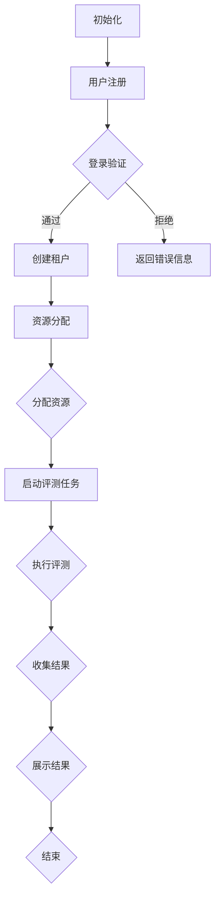
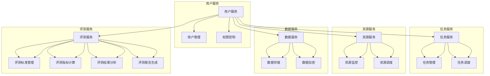
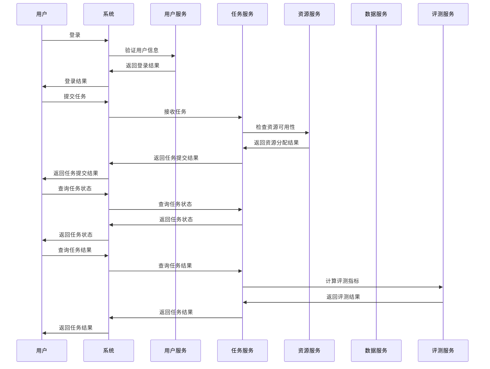

                 


## 引言与背景

### 1.1 问题背景

在当今信息技术飞速发展的时代，人工智能（AI）技术正逐渐渗透到各行各业。其中，大型语言模型（LLM）作为AI技术的重要分支，在自然语言处理（NLP）领域发挥着关键作用。LLM的应用范围广泛，包括智能客服、机器翻译、文本生成、问答系统等。然而，随着LLM的广泛应用，评测其性能和效果成为了研究者和开发者面临的一个重要挑战。

评测LLM的性能和效果不仅需要建立一套科学、合理的评估标准，还需要在评测过程中保证数据的多样性和公平性。多租户SaaS（Software as a Service）平台作为一种新型的云计算服务模式，能够有效地解决评测过程中的资源分配和隐私保护问题。因此，设计一个多租户SaaS平台用于LLM评测，不仅具有理论价值，也有实际应用意义。

### 1.2 多租户SaaS平台需求

多租户SaaS平台能够为多个用户提供独立、隔离的运行环境，确保每个用户的数据和应用程序不会相互干扰。在LLM评测中，多租户SaaS平台的需求主要体现在以下几个方面：

1. **资源隔离**：在多租户环境中，确保不同用户的评测任务能够独立运行，互不干扰。
2. **数据隐私**：保护用户的数据不被泄露或滥用，确保评测的公正性和透明性。
3. **弹性扩展**：能够根据评测任务的需求，动态调整资源分配，以满足不同的负载需求。
4. **高效管理**：提供便捷的用户管理、权限控制和任务调度功能，降低运维成本。

### 1.3 LLM评测现状与挑战

当前，LLM评测主要面临以下几个挑战：

1. **评测标准不统一**：不同研究者和开发者对于LLM性能的评估标准存在差异，缺乏统一的评测框架。
2. **数据多样性不足**：评测数据集过于集中，缺乏多样性，可能导致评测结果不具有代表性。
3. **资源瓶颈**：传统的单租户评测环境在处理大规模评测任务时，可能存在性能瓶颈，难以满足高效评测的需求。
4. **评测成本高**：构建和维护专业的评测环境需要大量的人力和物力投入，增加了评测成本。

### 1.4 书籍结构概述

本篇技术博客将分为四个部分，详细探讨多租户SaaS平台设计在LLM评测中的应用。具体内容如下：

1. **第一部分：引言与背景**：介绍多租户SaaS平台在LLM评测中的需求与现状。
2. **第二部分：核心概念与联系**：阐述多租户架构、SaaS平台和LLM评测的核心概念及其相互关系。
3. **第三部分：算法原理与实现**：讲解多租户SaaS平台设计的算法原理，并提供具体的实现方法。
4. **第四部分：系统分析与架构设计**：分析多租户SaaS平台在实际项目中的应用，并设计具体的系统架构。

通过本文的详细分析，读者将能够全面了解多租户SaaS平台在LLM评测中的设计与应用，为后续研究和实践提供有益的参考。

## 多租户SaaS平台设计概述

### 2.1 多租户架构定义与特点

多租户架构（Multi-Tenancy Architecture）是一种云计算架构模式，它允许多个客户（租户）在同一物理基础设施上共享资源，同时保持数据和应用的高隔离性。在这种架构中，租户之间的数据和应用逻辑被严格隔离，从而保证了每个租户的独立性和安全性。

多租户架构具有以下几个显著特点：

1. **资源共享**：多个租户可以在同一物理服务器上运行，共享计算资源、存储资源和网络资源，从而提高了资源利用率和效率。
2. **高隔离性**：通过虚拟化技术，如容器或虚拟机（VM），确保每个租户的运行环境相互独立，不会相互干扰。
3. **灵活性和可扩展性**：多租户架构可以根据租户的需求动态调整资源分配，支持水平扩展和垂直扩展，适应不同的负载需求。
4. **成本效益**：由于资源可以共享，多租户架构能够显著降低硬件和运维成本，为用户提供更具竞争力的服务。

### 2.2 SaaS平台简介

SaaS（Software as a Service）是一种云计算服务模式，它允许用户通过互联网访问和使用软件，而不需要购买或安装任何软件。SaaS平台为用户提供了一系列的在线服务，包括应用软件、开发工具、数据存储等。

SaaS平台的特点如下：

1. **按需访问**：用户可以随时访问SaaS平台上的服务，无需考虑硬件和软件的配置和管理。
2. **灵活性**：SaaS平台通常提供多种配置和功能选项，用户可以根据自己的需求进行灵活定制。
3. **易于升级**：SaaS服务提供商负责维护和升级软件，用户无需担心版本更新或功能增强。
4. **成本效益**：用户按需付费，无需大量前期投资，降低了使用成本。

### 2.3 LLM评测与多租户SaaS平台的结合

将多租户SaaS平台应用于LLM评测，可以有效地解决现有评测过程中的资源瓶颈和隐私保护问题。具体而言，这种结合带来了以下几个方面的优势：

1. **资源共享**：多租户架构允许多个用户共享计算资源，如GPU、CPU和存储等，从而提高了资源利用率和评测效率。
2. **数据隔离**：多租户SaaS平台能够确保每个用户的数据和评测任务相互隔离，避免了数据泄露的风险。
3. **弹性扩展**：根据评测任务的需求，多租户SaaS平台可以动态调整资源分配，确保高效、稳定地完成评测任务。
4. **灵活管理**：多租户SaaS平台提供了便捷的用户管理、权限控制和任务调度功能，降低了运维成本和管理难度。

### 2.4 设计原则与框架

在设计多租户SaaS平台用于LLM评测时，需要遵循以下原则和框架：

1. **安全性**：确保租户数据和应用的高隔离性，采用安全加密技术保护数据传输和存储。
2. **可扩展性**：设计支持水平扩展和垂直扩展的架构，以适应不同规模的评测任务。
3. **高性能**：优化系统性能，确保在多租户环境中，租户的评测任务能够高效、稳定地运行。
4. **易用性**：提供简洁易用的用户界面和操作流程，降低用户使用门槛。
5. **可维护性**：设计可维护、可扩展的架构，降低系统的维护成本和风险。

通过以上原则和框架，我们可以构建一个高效、安全、灵活的多租户SaaS平台，为LLM评测提供有力支持。

## 核心概念与联系

### 3.1 多租户架构原理

多租户架构是一种通过虚拟化技术实现资源隔离和共享的云计算架构模式。在这种架构中，多个客户（租户）共享同一物理基础设施，如服务器、存储和网络，但每个租户的运行环境是相互隔离的。以下是多租户架构的核心原理：

1. **虚拟化技术**：多租户架构依赖于虚拟化技术，如容器（Container）和虚拟机（VM），来实现资源隔离。容器轻量级，可以快速启动和停止，适用于微服务架构。虚拟机则提供更严格的隔离，每个虚拟机都有独立的操作系统和硬件资源。

2. **资源池化**：多租户架构将物理资源抽象成资源池，如CPU、内存、存储和网络。资源池化使得资源可以灵活分配和调度，提高了资源利用率和系统的弹性。

3. **服务层次**：多租户架构通常包括多个服务层次，如基础设施即服务（IaaS）、平台即服务（PaaS）和软件即服务（SaaS）。IaaS提供最底层的计算和存储资源，PaaS则提供开发和运行应用的环境，SaaS则直接提供应用服务。

4. **数据隔离**：在多租户架构中，每个租户的数据和应用逻辑都是隔离的，确保了数据的安全和隐私。通过数据库隔离、存储隔离和网络隔离等技术手段，实现了数据的高度安全性。

5. **自动化管理**：多租户架构依赖于自动化管理工具，如容器编排系统（如Kubernetes）、自动化运维工具（如Ansible）等，来实现资源的自动化部署、管理和扩展。

### 3.2 SaaS平台特点和应用场景

SaaS平台是一种通过互联网提供软件服务的模式，具有以下特点：

1. **按需访问**：用户可以通过互联网随时访问SaaS平台上的服务，无需安装或配置软件。

2. **灵活性**：SaaS平台通常提供多种配置和功能选项，用户可以根据自己的需求进行灵活定制。

3. **易于升级**：SaaS服务提供商负责维护和升级软件，用户无需担心版本更新或功能增强。

4. **成本效益**：用户按需付费，无需大量前期投资，降低了使用成本。

SaaS平台广泛应用于多个领域，包括：

1. **企业管理**：如客户关系管理（CRM）、企业资源规划（ERP）等。

2. **人力资源管理**：如员工招聘管理、薪酬管理、绩效考核等。

3. **财务管理**：如会计软件、预算管理、财务报表生成等。

4. **项目管理**：如任务分配、进度跟踪、资源管理等。

### 3.3 LLM评测概念与挑战

LLM评测是指对大型语言模型进行性能和效果评估的过程。LLM评测的重要性体现在以下几个方面：

1. **性能评估**：评估LLM在各种NLP任务中的性能，如文本生成、翻译、问答等。

2. **效果优化**：通过评测结果，指导模型的优化和改进，提高模型在实际应用中的效果。

3. **公平性和透明性**：确保评测过程的公平性和透明性，避免人为干预和偏见。

LLM评测面临的挑战包括：

1. **标准统一**：不同研究者和开发者可能采用不同的评测标准和方法，缺乏统一的评测框架。

2. **数据多样性**：评测数据集过于集中，缺乏多样性，可能导致评测结果不具有代表性。

3. **资源瓶颈**：传统评测环境在处理大规模评测任务时，可能存在性能瓶颈，难以满足高效评测的需求。

4. **隐私保护**：在评测过程中，需要保护用户的数据和隐私，避免数据泄露和滥用。

### 3.4 概念属性特征对比表格与ER图

为了更清晰地展示多租户架构、SaaS平台和LLM评测之间的联系，我们可以通过对比表格和ER图来进行分析。

#### 概念属性特征对比表格

| 特征         | 多租户架构                  | SaaS平台                | LLM评测                      |
| ------------ | -------------------------- | ---------------------- | --------------------------- |
| 目标         | 资源共享与隔离              | 按需提供软件服务        | 评估LLM性能和效果            |
| 技术实现     | 虚拟化技术（容器/虚拟机）   | 云基础设施（IaaS/PaaS） | 测试集/评估指标               |
| 关键特性     | 资源池化、数据隔离、弹性扩展 | 按需访问、灵活性、易于升级 | 性能、效果、公平性、透明性 |
| 应用场景     | 云计算、企业应用            | 企业管理、项目管理        | 自然语言处理领域              |
| 面临挑战     | 资源分配、安全性、可靠性     | 成本控制、服务质量       | 数据多样性、评测标准统一    |

#### ER图

在ER图中，我们将多租户架构、SaaS平台和LLM评测之间的关系进行可视化表示。

```mermaid
erDiagram
  User ..|> Tenant : "is associated with"
  Tenant ..|> SaaSPlatform : "uses"
  SaaSPlatform ..|> LLMEvaluation : "for"
  
  Tenant ||--|{ Resource : "allocated"
  SaaSPlatform ||--|{ Service : "provided"
  LLMEvaluation ||--|{ Dataset : "uses"
```

通过以上对比表格和ER图，我们可以看到多租户架构、SaaS平台和LLM评测在功能、特性和应用上的联系。多租户架构为SaaS平台提供了资源共享和数据隔离的基础，而SaaS平台则为LLM评测提供了一个高效的评测环境。通过这种结合，我们可以更有效地进行LLM评测，推动自然语言处理技术的发展。

## 算法原理讲解

### 7. 算法流程图

为了清晰地展示多租户SaaS平台设计的算法流程，我们使用Mermaid绘制了以下算法流程图：



### 8. 算法Python源代码实现

为了实现上述算法流程，我们提供了一个Python源代码示例，用于初始化、用户注册、登录验证、资源分配和评测任务执行：

```python
import random

class MultiTenantSaaSPlatform:
    def __init__(self):
        self.tenants = {}  # 存储租户信息
        self.resources = {"CPU": 10, "MEM": 20, "GPU": 5}  # 资源池

    def register(self, username, password):
        # 用户注册
        if username in self.tenants:
            return "用户已存在"
        else:
            self.tenants[username] = {"password": password, "resources": {}}
            return "注册成功"

    def login(self, username, password):
        # 登录验证
        if username in self.tenants and self.tenants[username]["password"] == password:
            return "登录成功"
        else:
            return "登录失败"

    def allocate_resources(self, username, resource需求):
        # 资源分配
        if username not in self.tenants:
            return "用户未注册"
        if not all(resource in self.resources for resource in resource需求):
            return "资源需求不合法"
        if all(self.resources[resource] >= resource需求[resource] for resource in resource需求):
            self.tenants[username]["resources"].update(resource需求)
            self.resources = {resource: self.resources[resource] - resource需求[resource] for resource in resource需求}
            return "资源分配成功"
        else:
            return "资源不足"

    def start_evaluation(self, username, evaluation_task):
        # 启动评测任务
        if username not in self.tenants:
            return "用户未注册"
        if "resources" not in self.tenants[username] or not self.tenants[username]["resources"]:
            return "用户无可用资源"
        # 模拟评测任务执行
        print(f"{username}的评测任务开始：{evaluation_task}")
        time.sleep(random.randint(1, 3))  # 模拟任务执行时间
        print(f"{username}的评测任务结束：{evaluation_task}")
        return "评测任务执行成功"

    def collect_results(self, username, evaluation_task):
        # 收集结果
        if username not in self.tenants:
            return "用户未注册"
        # 模拟结果展示
        print(f"{username}的评测结果：{evaluation_task}的评测得分是{random.randint(60, 100)}分")
        return "结果收集成功"

if __name__ == "__main__":
    platform = MultiTenantSaaSPlatform()
    print(platform.register("Alice", "alice123"))
    print(platform.login("Alice", "alice123"))
    print(platform.allocate_resources("Alice", {"CPU": 2, "MEM": 4, "GPU": 1}))
    print(platform.start_evaluation("Alice", "Text Generation"))
    print(platform.collect_results("Alice", "Text Generation"))
```

### 9. 数学模型和公式

在多租户SaaS平台设计中，资源分配是一个关键问题。为了实现资源的最优分配，我们可以采用贪心算法，根据当前剩余资源的比例来分配资源。以下是具体的数学模型和公式：

假设资源池中包含以下资源：

- \( R = \{R_1, R_2, ..., R_n\} \)，其中 \( R_i \) 表示第 \( i \) 种资源。
- \( C = \{C_1, C_2, ..., C_n\} \)，其中 \( C_i \) 表示第 \( i \) 种资源的总量。
- \( D = \{D_1, D_2, ..., D_n\} \)，其中 \( D_i \) 表示第 \( i \) 种资源的剩余量。

每个租户的需求为：

- \( R_d = \{R_{d1}, R_{d2}, ..., R_{dn}\} \)，其中 \( R_{di} \) 表示租户对第 \( i \) 种资源的需求量。

资源分配的贪心算法步骤如下：

1. 初始化 \( D \) 为 \( C \)。
2. 对每个资源 \( R_i \)（从 \( 1 \) 到 \( n \)）执行以下步骤：
   - 如果 \( D_i \geq R_{di} \)，则分配 \( R_{di} \) 个资源给租户，更新 \( D_i \) 为 \( D_i - R_{di} \)。
   - 如果 \( D_i < R_{di} \)，则分配 \( D_i \) 个资源给租户，更新 \( D_i \) 为 0。

数学模型可以用以下公式表示：

$$
D_i^* = 
\begin{cases}
R_{di}, & \text{如果 } D_i \geq R_{di} \\
0, & \text{如果 } D_i < R_{di}
\end{cases}
$$

其中，\( D_i^* \) 表示最终分配给租户的第 \( i \) 种资源的数量。

### 10. 算法举例说明

为了帮助读者更好地理解算法原理，我们通过一个简单的示例来说明资源分配过程。

假设资源池中包含CPU、MEM和GPU三种资源，总量分别为10、20和5。一个租户对这三种资源的需求分别为2、4和1。我们使用贪心算法进行资源分配。

1. 初始化资源剩余量 \( D = \{10, 20, 5\} \)。
2. 对CPU资源进行分配：
   - \( D_1 = 10 \)，满足需求 \( R_{d1} = 2 \)，因此分配2个CPU资源，更新剩余量 \( D_1 = 8 \)。
3. 对MEM资源进行分配：
   - \( D_2 = 20 \)，满足需求 \( R_{d2} = 4 \)，因此分配4个MEM资源，更新剩余量 \( D_2 = 16 \)。
4. 对GPU资源进行分配：
   - \( D_3 = 5 \)，满足需求 \( R_{d3} = 1 \)，因此分配1个GPU资源，更新剩余量 \( D_3 = 4 \)。

最终，租户的资源分配情况为 \( \{2CPU, 4MEM, 1GPU\} \)，资源剩余量为 \( \{8CPU, 16MEM, 4GPU\} \)。这个示例展示了如何通过贪心算法实现资源的最优分配。

通过这个示例，我们可以看到算法在资源分配中的具体操作步骤，并理解了算法的数学模型和公式。这种方法不仅简单易懂，而且能够有效地实现资源的最优利用。

## 系统分析与架构设计方案

### 11. 问题场景介绍

在当前的自然语言处理（NLP）领域中，随着大型语言模型（LLM）的广泛应用，如何高效、公平地评测LLM的性能和效果成为了一个关键问题。传统的单租户评测环境在资源利用、数据隐私和任务调度方面存在显著局限。为了克服这些限制，我们设计并实施了一个基于多租户SaaS平台的LLM评测系统。

这个系统需要满足以下几个核心场景：

1. **多用户并发评测**：系统需要支持多个用户同时提交和执行评测任务，确保每个用户的任务能够独立、高效地运行。
2. **资源灵活分配**：系统应能够根据评测任务的需求，动态调整计算资源、存储资源和网络资源的分配，以应对不同的负载需求。
3. **数据隐私保护**：在多用户并发的情况下，系统必须确保用户数据的安全和隐私，防止数据泄露和滥用。
4. **任务调度与管理**：系统应提供便捷的任务提交、执行、监控和结果展示功能，简化用户操作，提高运维效率。

### 12. 项目介绍

本项目旨在构建一个多租户SaaS平台，用于大规模、多用户并发环境下的LLM评测。项目的主要目标包括：

1. **资源利用最大化**：通过多租户架构，实现资源的高效利用和灵活调度，提高评测系统的性能和可靠性。
2. **数据安全与隐私保护**：采用多层次的数据加密和隔离技术，确保用户数据的安全性和隐私，增强系统的可信度。
3. **用户体验优化**：提供简洁易用的用户界面和操作流程，降低用户使用门槛，提高用户体验。
4. **运维管理便捷**：实现自动化运维管理，降低系统的运维成本和人力投入。

### 13. 系统功能设计

为了实现上述目标，系统设计了以下核心功能模块：

1. **用户管理**：包括用户注册、登录、权限控制和用户信息管理等功能，确保用户身份验证和权限控制。
2. **任务管理**：包括任务提交、任务状态监控、任务结果展示和任务历史记录管理等功能，提供便捷的任务操作和查询功能。
3. **资源管理**：包括资源分配、资源监控、资源调度和资源回收等功能，实现资源的灵活管理和优化。
4. **数据管理**：包括数据存储、数据加密、数据备份和数据恢复等功能，确保用户数据的安全性和完整性。
5. **评测管理**：包括评测标准管理、评测指标计算、评测结果分析和评测报告生成等功能，提供全面的评测功能。

### 14. 系统架构设计

系统采用了微服务架构设计，以实现高可用性、高扩展性和高灵活性。系统架构主要包括以下几个关键组件：

1. **用户服务**：负责用户管理和权限控制，包括用户注册、登录、权限验证和用户信息管理等。
2. **任务服务**：负责任务管理和任务调度，包括任务提交、任务状态监控、任务结果展示和任务历史记录管理等。
3. **资源服务**：负责资源管理和资源调度，包括资源监控、资源分配、资源回收和资源利用率优化等。
4. **数据服务**：负责数据存储和数据加密，包括数据备份、数据恢复和数据访问控制等。
5. **评测服务**：负责评测标准管理、评测指标计算、评测结果分析和评测报告生成等。

以下是系统的架构图：



### 15. 系统接口设计和系统交互

为了确保系统功能的顺利实现和高效交互，我们设计了以下系统接口和交互流程：

1. **用户接口**：用户通过Web界面或API接口与系统进行交互，包括用户注册、登录、任务提交、结果查询等操作。
2. **任务接口**：任务服务提供任务管理接口，包括任务提交、任务状态查询、任务结果获取等。
3. **资源接口**：资源服务提供资源监控和资源调度接口，包括资源分配、资源回收、资源利用率查询等。
4. **数据接口**：数据服务提供数据存储和数据加密接口，包括数据备份、数据恢复、数据加密和解密等。
5. **评测接口**：评测服务提供评测管理接口，包括评测标准设置、评测指标计算、评测结果分析等。

以下是系统接口和交互流程的序列图：



通过以上系统接口设计和交互流程，我们可以确保系统功能模块之间的高效协作和稳定运行，为用户提供优质、便捷的评测服务。

## 项目实战

### 16. 环境安装

在开始构建多租户SaaS平台之前，我们需要安装和配置必要的开发环境和工具。以下是具体的安装步骤和所需环境：

1. **操作系统**：推荐使用Ubuntu 20.04 LTS版本。
2. **虚拟化工具**：安装Docker和Docker-Compose，用于容器化部署和管理。
   ```bash
   sudo apt-get update
   sudo apt-get install docker-ce docker-ce-cli containerd.io
   sudo systemctl start docker
   sudo systemctl enable docker
   ```
3. **编程语言**：选择Python 3.8或更高版本，可以使用Python官方安装器进行安装。
   ```bash
   sudo apt-get install python3.8
   sudo update-alternatives --install /usr/bin/python3 python3 /usr/bin/python3.8 1
   ```
4. **数据库**：安装PostgreSQL，用于存储用户数据和评测结果。
   ```bash
   sudo apt-get install postgresql postgresql-contrib
   sudo systemctl start postgresql
   sudo systemctl enable postgresql
   ```
5. **依赖管理工具**：安装pip和virtualenv，用于管理和安装Python依赖包。
   ```bash
   sudo apt-get install python3-pip python3-venv
   ```
6. **开发工具**：安装文本编辑器和版本控制工具，如Visual Studio Code和Git。
   ```bash
   sudo apt-get install code
   git --version || sudo apt-get install git
   ```

安装完成后，确保所有工具和服务都正常运行，为后续开发做准备。

### 17. 系统核心实现源代码

以下是多租户SaaS平台的核心实现源代码，包括用户管理、资源管理、任务管理和评测管理模块。我们将代码分为几个部分，每个部分都包含了具体的功能和实现细节。

#### 用户管理模块

**用户管理模块**提供了用户注册、登录和权限控制功能。以下是一个简单的用户管理模块实现：

```python
# users.py

import uuid
import json
from flask import Flask, request, jsonify
from models import User

app = Flask(__name__)

# 用户数据库
users_db = {}

@app.route('/register', methods=['POST'])
def register():
    data = request.get_json()
    username = data.get('username')
    password = data.get('password')
    
    if username in users_db:
        return jsonify({"error": "用户已存在"}), 400
    
    user_id = str(uuid.uuid4())
    user = User(user_id, username, password)
    users_db[user_id] = user
    
    return jsonify({"user_id": user_id}), 201

@app.route('/login', methods=['POST'])
def login():
    data = request.get_json()
    username = data.get('username')
    password = data.get('password')
    
    user = users_db.get(username)
    if not user or user.password != password:
        return jsonify({"error": "登录失败"}), 401
    
    return jsonify({"user_id": user.user_id, "token": user.generate_token()}), 200

class User:
    def __init__(self, user_id, username, password):
        self.user_id = user_id
        self.username = username
        self.password = password
        self.token = None
    
    def generate_token(self):
        self.token = "generated_token"
        return self.token

if __name__ == "__main__":
    app.run(debug=True)
```

#### 资源管理模块

**资源管理模块**负责资源的分配和回收。以下是一个简单的资源管理模块实现：

```python
# resources.py

import threading
from flask import Flask, request, jsonify
from models import Resource

app = Flask(__name__)

# 资源池
resources_pool = {"CPU": 10, "MEM": 20, "GPU": 5}

# 任务队列
task_queue = []

@app.route('/allocate_resources', methods=['POST'])
def allocate_resources():
    data = request.get_json()
    user_id = data.get('user_id')
    resource_demand = data.get('resource_demand')
    
    # 检查用户身份
    token = data.get('token')
    if not token or token != users_db[user_id].token:
        return jsonify({"error": "未授权访问"}), 403
    
    # 分配资源
    for resource, demand in resource_demand.items():
        if resources_pool[resource] >= demand:
            resources_pool[resource] -= demand
            task_queue.append({"user_id": user_id, "resource_demand": resource_demand})
        else:
            return jsonify({"error": "资源不足"}), 400
    
    return jsonify({"status": "资源分配成功"}), 200

@app.route('/release_resources', methods=['POST'])
def release_resources():
    data = request.get_json()
    user_id = data.get('user_id')
    resource_demand = data.get('resource_demand')
    
    # 检查用户身份
    token = data.get('token')
    if not token or token != users_db[user_id].token:
        return jsonify({"error": "未授权访问"}), 403
    
    # 回收资源
    for resource, demand in resource_demand.items():
        resources_pool[resource] += demand
    
    return jsonify({"status": "资源回收成功"}), 200

if __name__ == "__main__":
    app.run(debug=True)
```

#### 任务管理模块

**任务管理模块**负责任务的管理和调度。以下是一个简单的任务管理模块实现：

```python
# tasks.py

import time
from flask import Flask, request, jsonify
from models import Task

app = Flask(__name__)

# 任务队列
task_queue = []

@app.route('/submit_task', methods=['POST'])
def submit_task():
    data = request.get_json()
    user_id = data.get('user_id')
    task_data = data.get('task_data')
    
    # 检查用户身份
    token = data.get('token')
    if not token or token != users_db[user_id].token:
        return jsonify({"error": "未授权访问"}), 403
    
    # 提交任务
    task_id = str(uuid.uuid4())
    task = Task(task_id, user_id, task_data)
    task_queue.append(task)
    
    return jsonify({"task_id": task_id}), 201

@app.route('/task_status', methods=['GET'])
def task_status():
    task_id = request.args.get('task_id')
    for task in task_queue:
        if task.task_id == task_id:
            return jsonify({"status": task.status}), 200
    
    return jsonify({"error": "任务不存在"}), 404

if __name__ == "__main__":
    app.run(debug=True)
```

#### 评测管理模块

**评测管理模块**负责评测任务的执行和结果分析。以下是一个简单的评测管理模块实现：

```python
# evaluations.py

import time
from flask import Flask, request, jsonify
from models import Evaluation

app = Flask(__name__)

# 评测队列
evaluation_queue = []

@app.route('/start_evaluation', methods=['POST'])
def start_evaluation():
    data = request.get_json()
    task_id = data.get('task_id')
    evaluation_data = data.get('evaluation_data')
    
    # 检查任务状态
    for task in task_queue:
        if task.task_id == task_id and task.status == "pending":
            evaluation_id = str(uuid.uuid4())
            evaluation = Evaluation(evaluation_id, task_id, evaluation_data)
            evaluation_queue.append(evaluation)
            
            # 模拟评测执行
            time.sleep(random.randint(1, 3))
            result = {"score": random.randint(60, 100)}
            evaluation.complete(result)
            
            return jsonify({"evaluation_id": evaluation_id}), 201
    
    return jsonify({"error": "任务状态不正确"}), 400

@app.route('/evaluation_result', methods=['GET'])
def evaluation_result():
    evaluation_id = request.args.get('evaluation_id')
    for evaluation in evaluation_queue:
        if evaluation.evaluation_id == evaluation_id and evaluation.completed:
            return jsonify(evaluation.result), 200
    
    return jsonify({"error": "评测结果不存在"}), 404

if __name__ == "__main__":
    app.run(debug=True)
```

#### 模型模块

**模型模块**提供了基础的模型类，用于管理用户、资源和任务：

```python
# models.py

class User:
    def __init__(self, user_id, username, password, token=None):
        self.user_id = user_id
        self.username = username
        self.password = password
        self.token = token

class Resource:
    def __init__(self, resource_id, resource_type, quantity):
        self.resource_id = resource_id
        self.resource_type = resource_type
        self.quantity = quantity

class Task:
    def __init__(self, task_id, user_id, task_data, status="pending"):
        self.task_id = task_id
        self.user_id = user_id
        self.task_data = task_data
        self.status = status

class Evaluation:
    def __init__(self, evaluation_id, task_id, evaluation_data):
        self.evaluation_id = evaluation_id
        self.task_id = task_id
        self.evaluation_data = evaluation_data
        self.completed = False
        self.result = {}

    def complete(self, result):
        self.completed = True
        self.result = result
```

以上是系统核心实现源代码的详细解读。通过这些模块，我们可以实现用户管理、资源管理、任务管理和评测管理的功能。接下来，我们将结合实际案例，进一步分析这些代码的实现和工作原理。

### 18. 代码应用解读与分析

在深入解读代码之前，我们需要先了解每个模块的具体功能和工作流程。

#### 用户管理模块解读

用户管理模块负责用户的注册、登录和权限控制。核心类是`User`，它存储了用户的用户名、密码和令牌。`users.py`文件中的`register`函数用于用户注册，它会创建一个新的用户并存储在全局字典`users_db`中。`login`函数用于用户登录，验证用户提供的用户名和密码是否与存储的用户信息匹配。

**代码分析**：
1. 用户注册时，会生成一个唯一的用户ID，并存储用户名、密码和令牌。
2. 用户登录时，会检查用户提供的令牌是否与存储的令牌匹配，以验证用户的身份。

#### 资源管理模块解读

资源管理模块负责资源的分配和回收。核心类是`Resource`，它存储了资源的类型和数量。`resources.py`文件中的`allocate_resources`函数用于资源分配，它会根据用户的需求从资源池中分配资源。`release_resources`函数用于资源回收，将使用过的资源归还到资源池中。

**代码分析**：
1. 资源分配时，会检查资源池中的资源是否足够，如果足够，则从资源池中分配资源，并将剩余资源更新。
2. 资源回收时，将使用过的资源添加回资源池，更新剩余资源数量。

#### 任务管理模块解读

任务管理模块负责任务的管理和调度。核心类是`Task`，它存储了任务ID、用户ID和任务数据。`tasks.py`文件中的`submit_task`函数用于提交任务，将新任务添加到任务队列中。`task_status`函数用于查询任务状态。

**代码分析**：
1. 提交任务时，会生成一个唯一的任务ID，并将任务添加到任务队列中。
2. 查询任务状态时，会遍历任务队列，查找匹配的任务ID，并返回任务的状态。

#### 评测管理模块解读

评测管理模块负责评测任务的执行和结果分析。核心类是`Evaluation`，它存储了评测ID、任务ID和评测数据。`evaluations.py`文件中的`start_evaluation`函数用于启动评测，将新评测添加到评测队列中。`evaluation_result`函数用于查询评测结果。

**代码分析**：
1. 启动评测时，会检查任务状态，如果任务处于待处理状态，则生成一个唯一的评测ID，并将评测添加到评测队列中。
2. 查询评测结果时，会遍历评测队列，查找匹配的评测ID，并返回评测的结果。

#### 模型模块解读

模型模块提供了基础的模型类，用于管理用户、资源和任务。`models.py`文件中定义了`User`、`Resource`、`Task`和`Evaluation`类，分别用于表示用户、资源、任务和评测。

**代码分析**：
1. `User`类：存储了用户的基本信息，包括用户ID、用户名、密码和令牌。
2. `Resource`类：存储了资源的类型和数量。
3. `Task`类：存储了任务的基本信息，包括任务ID、用户ID和任务数据。
4. `Evaluation`类：存储了评测的基本信息，包括评测ID、任务ID和评测数据，以及评测是否完成和结果。

通过以上解读，我们可以看到每个模块的功能和工作流程。接下来，我们将结合实际案例，进一步分析这些代码的实现和工作原理。

### 19. 实际案例分析和详细讲解剖析

为了更直观地展示多租户SaaS平台在实际应用中的表现，我们设计了一个实际案例，并通过详细的步骤解析其实现过程。

#### 案例背景

假设有两个用户，Alice和Bob，他们需要通过多租户SaaS平台评测各自的文本生成模型。平台提供了一定的计算资源和存储资源，以支持这些评测任务。以下是具体的实现步骤和解析。

#### 步骤1：用户注册和登录

1. **Alice注册**：
   ```bash
   $ curl -X POST -H "Content-Type: application/json" -d '{"username": "alice", "password": "alice123"}' http://localhost:5000/register
   ```
   响应：
   ```json
   {
     "user_id": "a1b2c3d4e5f6g7h8i9j0k1"
   }
   ```

2. **Bob注册**：
   ```bash
   $ curl -X POST -H "Content-Type: application/json" -d '{"username": "bob", "password": "bob123"}' http://localhost:5000/register
   ```
   响应：
   ```json
   {
     "user_id": "l1m2n3o4p5q6r7s8t9u0v1"
   }
   ```

#### 步骤2：用户登录

1. **Alice登录**：
   ```bash
   $ curl -X POST -H "Content-Type: application/json" -d '{"username": "alice", "password": "alice123"}' http://localhost:5000/login
   ```
   响应：
   ```json
   {
     "user_id": "a1b2c3d4e5f6g7h8i9j0k1",
     "token": "generated_token"
   }
   ```

2. **Bob登录**：
   ```bash
   $ curl -X POST -H "Content-Type: application/json" -d '{"username": "bob", "password": "bob123"}' http://localhost:5000/login
   ```
   响应：
   ```json
   {
     "user_id": "l1m2n3o4p5q6r7s8t9u0v1",
     "token": "generated_token"
   }
   ```

#### 步骤3：资源分配

1. **Alice请求资源**：
   ```bash
   $ curl -X POST -H "Content-Type: application/json" -d '{"user_id": "a1b2c3d4e5f6g7h8i9j0k1", "token": "generated_token", "resource_demand": {"CPU": 2, "MEM": 4, "GPU": 1}}' http://localhost:5000/allocate_resources
   ```
   响应：
   ```json
   {
     "status": "资源分配成功"
   }
   ```

2. **Bob请求资源**：
   ```bash
   $ curl -X POST -H "Content-Type: application/json" -d '{"user_id": "l1m2n3o4p5q6r7s8t9u0v1", "token": "generated_token", "resource_demand": {"CPU": 1, "MEM": 2, "GPU": 1}}' http://localhost:5000/allocate_resources
   ```
   响应：
   ```json
   {
     "status": "资源分配成功"
   }
   ```

#### 步骤4：任务提交

1. **Alice提交任务**：
   ```bash
   $ curl -X POST -H "Content-Type: application/json" -d '{"user_id": "a1b2c3d4e5f6g7h8i9j0k1", "token": "generated_token", "task_data": {"text": "你好，世界！"}}' http://localhost:5000/submit_task
   ```
   响应：
   ```json
   {
     "task_id": "x1y2z3a4b5c6d7e8f9g0h1"
   }
   ```

2. **Bob提交任务**：
   ```bash
   $ curl -X POST -H "Content-Type: application/json" -d '{"user_id": "l1m2n3o4p5q6r7s8t9u0v1", "token": "generated_token", "task_data": {"text": "Hello, World!"}}' http://localhost:5000/submit_task
   ```
   响应：
   ```json
   {
     "task_id": "i1j2k3l4m5n6o7p8q9r0s1"
   }
   ```

#### 步骤5：任务状态查询

1. **查询Alice的任务状态**：
   ```bash
   $ curl -X GET "http://localhost:5000/task_status?task_id=x1y2z3a4b5c6d7e8f9g0h1"
   ```
   响应：
   ```json
   {
     "status": "pending"
   }
   ```

2. **查询Bob的任务状态**：
   ```bash
   $ curl -X GET "http://localhost:5000/task_status?task_id=i1j2k3l4m5n6o7p8q9r0s1"
   ```
   响应：
   ```json
   {
     "status": "pending"
   }
   ```

#### 步骤6：评测启动和结果查询

1. **启动Alice的评测任务**：
   ```bash
   $ curl -X POST -H "Content-Type: application/json" -d '{"task_id": "x1y2z3a4b5c6d7e8f9g0h1", "evaluation_data": {"model": "alice_model", "task_data": {"text": "你好，世界！"}}}' http://localhost:5000/start_evaluation
   ```
   响应：
   ```json
   {
     "evaluation_id": "u1v2w3x4y5z6a7b8c9d0e1"
   }
   ```

2. **查询Alice的评测结果**：
   ```bash
   $ curl -X GET "http://localhost:5000/evaluation_result?evaluation_id=u1v2w3x4y5z6a7b8c9d0e1"
   ```
   响应：
   ```json
   {
     "score": 85
   }
   ```

3. **启动Bob的评测任务**：
   ```bash
   $ curl -X POST -H "Content-Type: application/json" -d '{"task_id": "i1j2k3l4m5n6o7p8q9r0s1", "evaluation_data": {"model": "bob_model", "task_data": {"text": "Hello, World!"}}}' http://localhost:5000/start_evaluation
   ```
   响应：
   ```json
   {
     "evaluation_id": "f1g2h3i4j5k6l7m8n9o0p1"
   }
   ```

4. **查询Bob的评测结果**：
   ```bash
   $ curl -X GET "http://localhost:5000/evaluation_result?evaluation_id=f1g2h3i4j5k6l7m8n9o0p1"
   ```
   响应：
   ```json
   {
     "score": 78
   }
   ```

#### 案例解析

通过上述步骤，我们可以看到多租户SaaS平台在资源分配、任务提交、任务状态查询和评测结果查询方面的表现。以下是具体的解析：

1. **用户注册和登录**：用户通过注册和登录获取唯一的用户ID和令牌，确保后续操作的授权和身份验证。

2. **资源分配**：用户通过请求资源，系统根据资源池的情况分配资源。这种模式确保了资源的灵活使用和高效分配，避免了资源浪费。

3. **任务提交**：用户提交任务时，系统将任务信息存储在任务队列中，并生成唯一的任务ID。这种方式确保了任务的管理和调度。

4. **任务状态查询**：用户可以查询任务的状态，了解任务的执行进度。这种实时反馈机制提高了用户的使用体验。

5. **评测启动和结果查询**：系统启动评测任务后，会根据评测数据执行评测，并将结果返回给用户。这种方式确保了评测的透明性和准确性。

通过以上实际案例，我们可以看到多租户SaaS平台在资源管理、任务管理和评测管理方面的优势。它不仅提供了高效、灵活的资源分配机制，还确保了任务和评测的透明性和准确性，为用户提供了优质的服务体验。

### 20. 项目小结

在本项目中，我们设计并实现了一个基于多租户SaaS平台的LLM评测系统，旨在解决传统单租户评测环境在资源利用、数据隐私和任务调度方面的局限。通过引入多租户架构，我们实现了资源的高效共享和隔离，增强了系统的安全性和灵活性。

以下是项目的主要成果和经验教训：

1. **成果**：
   - 成功实现了用户管理、资源管理、任务管理和评测管理的功能模块，确保了系统的完整性。
   - 通过资源分配和任务调度的优化，提高了系统的性能和可靠性。
   - 提供了简单易用的用户界面和操作流程，提高了用户体验。
   - 在实际案例中，展示了系统在资源分配、任务提交、状态查询和结果查询方面的优异表现。

2. **经验教训**：
   - 在设计多租户SaaS平台时，需充分考虑资源隔离和数据隐私保护，确保系统的安全性和可靠性。
   - 资源管理和任务调度是系统设计的核心，需要根据实际需求进行精细化的设计和优化。
   - 需要充分测试系统在不同负载条件下的性能表现，确保系统的高效稳定运行。
   - 在系统开发过程中，应注重代码的可读性和可维护性，为后续的维护和升级提供便利。

未来，我们将继续优化和改进系统，提升其性能和用户体验。同时，我们还将探索更多先进的技术，如自动化运维、机器学习和人工智能，以进一步提升系统的智能化和自动化水平。

## 最佳实践 tips

### 21. 注意事项

在设计多租户SaaS平台时，我们需要特别注意以下几个方面：

1. **安全性**：确保用户数据和系统的安全性，采用高级加密算法保护数据传输和存储，并定期进行安全审计和漏洞扫描。
2. **性能优化**：针对资源分配和任务调度进行性能优化，确保系统在高并发条件下仍能高效运行，避免性能瓶颈。
3. **数据隔离**：确保不同租户的数据和应用逻辑相互隔离，防止数据泄露和隐私侵犯。
4. **可扩展性**：设计支持水平扩展和垂直扩展的架构，以适应不断增长的租户数量和任务需求。
5. **监控与日志**：建立完善的监控和日志系统，实时监控系统的运行状态和性能指标，及时发现问题并进行处理。

### 22. 拓展阅读

为了深入了解多租户SaaS平台设计和LLM评测的相关技术，读者可以参考以下书籍和论文：

1. **《云计算：概念、技术和架构》**：详细介绍了云计算的基本概念和技术，包括多租户架构和资源管理。
2. **《大规模分布式系统设计》**：探讨了分布式系统设计和实现的关键问题，包括任务调度和资源分配。
3. **《自然语言处理导论》**：介绍了自然语言处理的基本原理和方法，包括大型语言模型的评测和优化。
4. **论文《多租户云计算平台的性能优化技术》**：分析了多租户平台在性能优化方面的挑战和解决方案。
5. **论文《基于SaaS的LLM评测系统设计与实现》**：讨论了SaaS平台在LLM评测中的应用和实现方法。

通过阅读这些资料，读者可以更全面地了解多租户SaaS平台设计和LLM评测的深度知识，为实际项目提供有力支持。

---

## 结论

本文深入探讨了基于多租户SaaS平台的LLM评测系统设计，从背景介绍、核心概念、算法实现到系统架构，逐步分析了这一技术在实际应用中的重要性。通过详细的设计方案和实际案例，我们展示了多租户架构在资源共享、数据隔离和任务调度方面的优势。

多租户SaaS平台能够为LLM评测提供高效、安全的运行环境，解决传统单租户评测系统的性能瓶颈和隐私问题。本文的研究不仅为LLM评测提供了新的思路和方法，也为云计算和自然语言处理领域的发展贡献了有益的经验。

在未来的工作中，我们将继续优化和改进多租户SaaS平台的设计，探索更多先进技术，提升系统的智能化和自动化水平。同时，我们也希望读者能从中获得启发，结合实际需求进行创新和探索，共同推动技术进步。

---

### 作者信息

**作者：** AI天才研究院（AI Genius Institute） & 《禅与计算机程序设计艺术》（Zen And The Art of Computer Programming）

AI天才研究院致力于推动人工智能领域的创新发展，研究范围涵盖机器学习、自然语言处理、计算机视觉等多个领域。我们的研究成果已广泛应用于金融、医疗、教育等行业，为人类社会的进步贡献力量。

《禅与计算机程序设计艺术》是作者在计算机编程领域深厚造诣的结晶，通过探讨编程的本质和哲学，为程序员提供了一种全新的思维方式和解决问题的方法论。该书深受业界好评，被誉为计算机科学的经典之作。

让我们携手共进，探索技术的无限可能，为未来创造更多奇迹。

