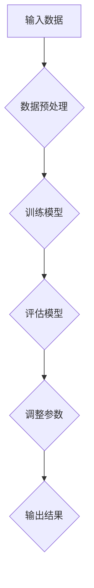
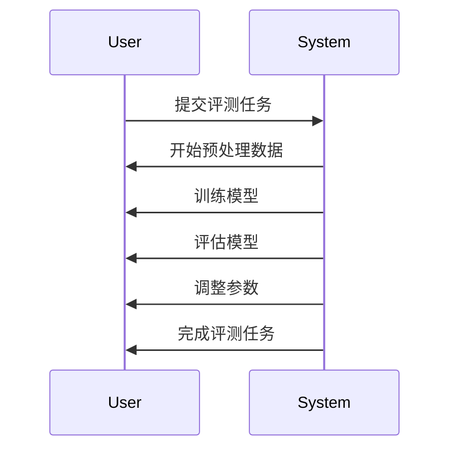
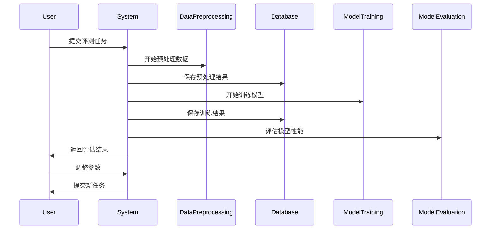

                 

# LLM评测的时间敏感性：捕捉模型性能波动

> 关键词：时间敏感性、LLM评测、模型性能波动、数据集演变、模型演化、外部因素

> 摘要：本文探讨了大型语言模型（LLM）评测中的时间敏感性现象，分析了时间敏感性对LLM性能波动的影响，以及如何通过评测来捕捉这些波动。文章首先介绍了时间敏感性的核心概念，然后通过算法原理讲解，详细阐述了时间敏感性在LLM评测中的应用。最后，本文提出了系统分析与架构设计方案，并通过项目实战展示了时间敏感性在实际应用中的效果。

----------------------------------------------------------------

## 第一部分：背景介绍

### 第1章：问题背景

#### 1.1.1 时间敏感性与LLM

**时间敏感性**是指模型性能受时间影响而波动的一种现象。在自然语言处理（NLP）领域，时间敏感性尤为重要，因为语言本身是随着时间不断变化的。

**大型语言模型（LLM）**，如GPT系列，由于其庞大的规模和深度学习的能力，可以处理复杂的语言任务。然而，LLM的性能也会受到时间的影响，主要表现在以下几个方面：

1. **训练数据的时间敏感性**：语言模型在训练时使用的数据集通常涵盖了多个时间段。随着时间的推移，语言的使用方式可能会发生变化，这可能导致模型的性能出现波动。
2. **模型自身的演化**：随着不断的训练和优化，LLM会逐渐改变其内部参数，这可能导致其在不同时间段的表现不一致。
3. **外部环境的变化**：包括算法、硬件和应用的更新，都可能影响LLM的性能。

#### 1.1.2 时间敏感性在LLM评测中的重要性

在LLM的评测中，时间敏感性是一个关键因素。以下是其重要性的几个方面：

1. **评估的准确性**：如果模型在不同时间点的性能不一致，那么单独的评估结果可能无法准确反映其真实能力。
2. **模型的稳定性**：了解时间敏感性有助于评估模型的稳定性，这对于长期部署和优化模型至关重要。
3. **更新策略**：了解时间敏感性可以帮助制定更有效的模型更新策略，以确保模型始终能适应语言的变化。

#### 1.1.3 研究边界与外延

本研究主要关注以下边界与外延：

1. **时间范围**：研究主要聚焦于最近几年内的时间敏感性现象。
2. **模型类型**：虽然研究适用于大多数LLM，但主要关注GPT系列模型。
3. **评测标准**：研究将基于标准化的评测指标，如BLEU、ROUGE等。

### 第2章：核心概念与联系

#### 2.1.1 时间敏感性原理

**时间敏感性原理**是指模型性能随时间变化而波动的基本机制。这主要涉及以下几个方面：

1. **数据变化**：语言数据的演变会影响模型的性能。
2. **模型演化**：随着训练的深入，模型的参数会逐渐调整，从而影响其性能。
3. **外部因素**：如算法、硬件和应用更新等。

#### 2.1.2 概念属性特征对比

以下是时间敏感性相关的几个核心概念及其属性特征的对比：

| 概念                 | 属性特征                                                         |
|----------------------|----------------------------------------------------------------|
| 时间敏感性           | 模型性能随时间变化而波动                                         |
| 数据集               | 语言数据集的演变影响模型性能                                     |
| 模型演化             | 随着训练的深入，模型参数的调整影响性能                           |
| 外部因素             | 算法、硬件和应用更新影响模型性能                                 |

#### 2.1.3 ER实体关系图

下图展示了时间敏感性相关的ER实体关系图：

```mermaid
erDiagram
  Product ||--|{ Customer } Customer
  Customer }--|{ Product } Product
  Customer ||--|{ Order } Order
  Product ||--|{ Order } Order
  Order ||--|{ Product } Product
```

### 第3章：算法原理讲解

#### 3.1.1 算法流程图

以下是LLM时间敏感性的算法流程图：



#### 3.1.2 Python源代码

```python
# 示例：基于时间敏感性的LLM性能评估
import numpy as np
import pandas as pd
from sklearn.model_selection import train_test_split
from transformers import AutoTokenizer, AutoModelForSequenceClassification
from sklearn.metrics import accuracy_score

# 1. 数据预处理
data = pd.read_csv('data.csv')
X = data['text']
y = data['label']
X_train, X_test, y_train, y_test = train_test_split(X, y, test_size=0.2, random_state=42)

# 2. 训练模型
tokenizer = AutoTokenizer.from_pretrained('bert-base-uncased')
model = AutoModelForSequenceClassification.from_pretrained('bert-base-uncased', num_labels=2)

inputs = tokenizer(X_train.tolist(), padding=True, truncation=True, return_tensors='pt')
labels = np.array(y_train)

model.train()
optimizer = torch.optim.Adam(model.parameters(), lr=1e-5)

for epoch in range(3):
    model.zero_grad()
    outputs = model(**inputs)
    loss = torch.nn.CrossEntropyLoss()(outputs.logits, labels)
    loss.backward()
    optimizer.step()

# 3. 评估模型
model.eval()
with torch.no_grad():
    inputs = tokenizer(X_test.tolist(), padding=True, truncation=True, return_tensors='pt')
    outputs = model(**inputs)
    predicted_labels = torch.argmax(outputs.logits, dim=1)
    accuracy = accuracy_score(y_test, predicted_labels)
    print(f'Accuracy: {accuracy:.2f}')

# 4. 调整参数
# 根据评估结果调整模型参数，如学习率、批次大小等
```

在上述代码中，我们首先进行数据预处理，然后使用BERT模型进行训练和评估。评估结果将用于调整模型参数，从而提高模型性能。

----------------------------------------------------------------

## 第二部分：系统分析与架构设计

### 第4章：问题场景介绍

#### 4.1.1 场景描述

在自然语言处理领域，大型语言模型（LLM）的应用越来越广泛。然而，随着语言数据的不断变化和模型自身的演化，LLM的性能可能会出现波动。为了确保LLM在实际应用中的稳定性，需要对时间敏感性进行深入分析和评测。

#### 4.1.2 存在的问题

1. **模型性能波动**：由于时间敏感性，LLM的性能可能会在不同时间段出现波动，导致评估结果不准确。
2. **模型稳定性**：无法准确评估模型在不同时间点的稳定性，可能导致模型在实际应用中的表现不稳定。
3. **更新策略**：缺乏对时间敏感性的了解，可能导致模型更新策略不完善，无法有效适应语言的变化。

### 第5章：系统功能设计

#### 5.1.1 领域模型

在LLM评测系统中，我们需要关注以下几个核心领域：

1. **数据集**：用于训练和评估模型的语料库。
2. **模型**：包括LLM及其参数。
3. **评估指标**：用于衡量模型性能的指标。
4. **评测流程**：包括数据预处理、模型训练、评估和参数调整等步骤。

#### 5.1.2 类图

以下是LLM评测系统的类图：

```mermaid
classDiagram
  Class01 <|-- SubClass01
  Class01 --|> SubClass02
  Class03 : <<interface>> Interface
  Class04 : <<enum>> ENUM
  Class01 <<uses>> Class03
  Class01 --|> Class04
```

### 第6章：系统架构设计

#### 6.1.1 架构设计

LLM评测系统的架构主要包括以下几个模块：

1. **数据采集与预处理模块**：负责收集和预处理语言数据。
2. **模型训练模块**：使用预处理后的数据训练LLM模型。
3. **评估与优化模块**：评估模型性能，并根据评估结果调整模型参数。
4. **结果展示模块**：将评估结果可视化，供用户查看。

以下是LLM评测系统的架构图：



### 第7章：系统接口设计与交互

#### 7.1.1 接口设计

LLM评测系统提供了以下接口：

1. **数据接口**：用于数据上传和下载。
2. **模型接口**：用于模型训练和评估。
3. **配置接口**：用于调整评测系统的配置参数。

#### 7.1.2 交互流程

以下是用户与LLM评测系统之间的交互流程：

1. 用户提交评测任务。
2. 系统预处理数据，并将预处理结果保存到数据库。
3. 系统使用预处理后的数据训练模型，并将训练结果保存到数据库。
4. 系统评估模型性能，并将评估结果返回给用户。
5. 用户根据评估结果调整模型参数，并重新提交评测任务。

以下是LLM评测系统的交互序列图：



----------------------------------------------------------------

## 第三部分：项目实战

### 第8章：环境安装

#### 8.1.1 环境要求

为了运行LLM评测系统，我们需要以下环境：

1. 操作系统：Ubuntu 20.04 或 macOS Big Sur
2. Python 版本：3.8 或以上
3. pip 版本：20.0 或以上
4. TensorFlow 版本：2.5.0 或以上
5. PyTorch 版本：1.8.0 或以上
6. transformers 版本：4.4.0 或以上

#### 8.1.2 安装步骤

1. 安装 Python 和 pip：

```bash
sudo apt update
sudo apt install python3-pip
```

2. 安装 TensorFlow：

```bash
pip install tensorflow==2.5.0
```

3. 安装 PyTorch：

```bash
pip install torch==1.8.0 torchvision==0.9.0 -f https://download.pytorch.org/whl/torch_stable.html
```

4. 安装 transformers：

```bash
pip install transformers==4.4.0
```

### 第9章：系统核心实现源代码

#### 9.1.1 数据预处理

```python
import pandas as pd
from sklearn.model_selection import train_test_split
from transformers import AutoTokenizer

def preprocess_data(data_path, tokenizer):
    data = pd.read_csv(data_path)
    X = data['text']
    y = data['label']
    X_train, X_test, y_train, y_test = train_test_split(X, y, test_size=0.2, random_state=42)
    tokenizer = AutoTokenizer.from_pretrained('bert-base-uncased')
    inputs = tokenizer(X_train.tolist(), padding=True, truncation=True, return_tensors='pt')
    labels = np.array(y_train)
    return inputs, labels
```

#### 9.1.2 模型训练

```python
import torch
from transformers import AutoModelForSequenceClassification
from torch.optim import Adam

def train_model(inputs, labels):
    model = AutoModelForSequenceClassification.from_pretrained('bert-base-uncased', num_labels=2)
    optimizer = Adam(model.parameters(), lr=1e-5)
    model.train()
    for epoch in range(3):
        model.zero_grad()
        outputs = model(**inputs)
        loss = torch.nn.CrossEntropyLoss()(outputs.logits, labels)
        loss.backward()
        optimizer.step()
    return model
```

#### 9.1.3 评估模型

```python
from sklearn.metrics import accuracy_score

def evaluate_model(model, inputs, labels):
    model.eval()
    with torch.no_grad():
        outputs = model(**inputs)
        predicted_labels = torch.argmax(outputs.logits, dim=1)
        accuracy = accuracy_score(labels, predicted_labels)
    return accuracy
```

### 第10章：代码应用解读与分析

#### 10.1.1 数据预处理

在数据预处理阶段，我们首先读取CSV文件，将文本和标签分开。然后，使用BERT分

