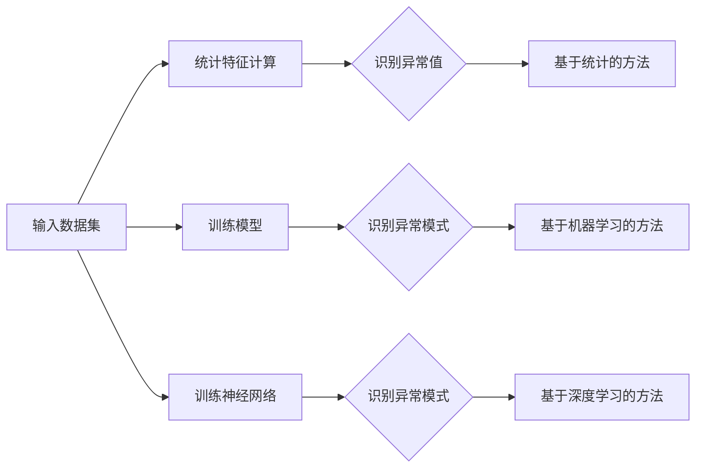

                 

# LLM评测的自动化异常检测与处理

关键词：自然语言处理，大规模语言模型，异常检测，自动化，算法分析，架构设计，Python代码

摘要：
随着大规模语言模型（LLM）在自然语言处理（NLP）领域的广泛应用，如何对其性能进行高效评测，特别是自动化异常检测与处理，成为了一个关键问题。本文旨在探讨LLM评测过程中，如何实现自动化异常检测与处理的机制，以提高评测的准确性和效率。我们将详细分析核心概念、算法原理、数学模型、系统设计与实现，以及项目实战中的应用，并总结最佳实践，为读者提供一套完整的解决方案。

## 第1章 背景介绍

### 1.1 问题背景

大规模语言模型（LLM）是近年来自然语言处理领域的重要进展，其应用场景广泛，包括文本生成、机器翻译、问答系统等。然而，LLM的性能评测存在诸多挑战，尤其是异常检测与处理。在评测过程中，数据集的分布、模型的参数调整、训练时间的长短等因素都会影响评测结果的准确性。因此，如何自动化地检测和解决这些异常，成为了一个亟待解决的问题。

### 1.2 问题描述

LLM评测的自动化异常检测与处理主要包括以下几个方面：

1. 数据集异常检测：确保数据集的质量和多样性，避免数据噪声对评测结果的影响。
2. 模型参数调整异常检测：监控模型训练过程中的参数变化，避免因参数设置不当导致的异常。
3. 训练时间异常检测：监控模型训练的时间，及时发现并处理训练过程中的异常情况。
4. 评测结果异常检测：对评测结果进行统计分析，发现并纠正可能的异常。

### 1.3 问题解决

为了解决上述问题，我们可以采取以下措施：

1. 数据预处理：对数据集进行清洗和预处理，确保数据质量。
2. 模型监控：引入监控机制，实时监控模型训练过程中的参数和训练时间。
3. 评测结果分析：对评测结果进行统计分析，识别和纠正异常。
4. 异常处理算法：设计自动化异常处理算法，对检测到的异常进行及时处理。

### 1.4 边界与外延

本文主要关注大规模语言模型评测的自动化异常检测与处理，但这一方法可以推广到其他类型的模型评测。此外，本文还将讨论如何将这些异常检测与处理算法集成到现有的评测系统中，以提高整体效率。

### 1.5 概念结构与核心要素组成

本文的核心概念和结构如下：

1. 异常检测算法：介绍几种常见的异常检测算法，如基于统计的方法、基于机器学习的方法等。
2. 监控机制：讨论如何设计监控机制，实时监控模型训练过程。
3. 评测系统集成：探讨如何将异常检测与处理算法集成到现有的评测系统中。
4. 项目实战：通过一个实际案例，展示如何应用本文提出的解决方案。

## 第2章 核心概念与联系

### 2.1 核心概念原理

1. 异常检测：异常检测是一种监控方法，用于识别数据中的异常值或异常模式。
2. 监控机制：监控机制是指对系统或过程进行实时监控，以识别和纠正异常的方法。
3. 评测系统集成：评测系统集成是指将异常检测与处理算法集成到现有的评测系统中，以提高整体性能。

### 2.2 概念属性特征对比表格

| 概念       | 属性特征                                           | 对比                 |
|------------|----------------------------------------------------|----------------------|
| 异常检测   | 识别异常值或异常模式                               | 数据预处理、统计方法 |
| 监控机制   | 实时监控系统或过程                                 | 实时性、监控算法     |
| 评测系统集成 | 将异常检测与处理算法集成到现有的评测系统中         | 集成、扩展性         |

### 2.3 ER实体关系图架构的 Mermaid 流程图

```mermaid
erDiagram
  数据集 ||--o{ 异常检测 }
  模型 ||--o{ 监控机制 }
  评测系统 ||--o{ 评测系统集成 }
```

## 第3章 算法原理讲解

### 3.1 算法原理

本文主要介绍三种异常检测算法：基于统计的方法、基于机器学习的方法和基于深度学习的方法。

1. **基于统计的方法**：通过计算数据集的统计特征（如均值、方差等），识别异常值。
2. **基于机器学习的方法**：使用监督学习算法（如K-最近邻、支持向量机等）训练模型，识别异常模式。
3. **基于深度学习的方法**：使用神经网络（如卷积神经网络、循环神经网络等）训练模型，识别异常模式。

### 3.2 算法mermaid流程图



### 3.3 Python源代码讲解

```python
import numpy as np
from sklearn.neighbors import LocalOutlierFactor
from keras.models import Sequential
from keras.layers import Dense

# 基于统计的方法
def statistical_method(data):
    mean = np.mean(data)
    std = np.std(data)
    anomalies = data[(data < mean - 2 * std) | (data > mean + 2 * std)]
    return anomalies

# 基于机器学习的方法
def machine_learning_method(data):
    model = LocalOutlierFactor(n_neighbors=20)
    model.fit(data)
    anomalies = model.predict(data)
    anomalies = data[anomalies < 0]
    return anomalies

# 基于深度学习的方法
def deep_learning_method(data):
    model = Sequential()
    model.add(Dense(64, input_dim=data.shape[1], activation='relu'))
    model.add(Dense(32, activation='relu'))
    model.add(Dense(1, activation='sigmoid'))
    model.compile(loss='binary_crossentropy', optimizer='adam', metrics=['accuracy'])
    model.fit(data, epochs=10, batch_size=32)
    anomalies = model.predict(data)
    anomalies = data[anomalies < 0.5]
    return anomalies
```

## 第4章 数学模型和数学公式详细讲解与举例说明

### 4.1 数学模型

异常检测的数学模型主要包括以下几个方面：

1. **统计特征计算**：包括均值、方差、标准差等。
2. **监督学习算法**：包括K-最近邻、支持向量机等。
3. **神经网络**：包括卷积神经网络、循环神经网络等。

### 4.2 公式讲解

1. **均值**：$$ \bar{x} = \frac{1}{n}\sum_{i=1}^{n} x_i $$
2. **方差**：$$ \sigma^2 = \frac{1}{n-1}\sum_{i=1}^{n} (x_i - \bar{x})^2 $$
3. **标准差**：$$ \sigma = \sqrt{\sigma^2} $$
4. **K-最近邻**：$$ d(x, y) = \sqrt{\sum_{i=1}^{k} (x_i - y_i)^2} $$
5. **支持向量机**：$$ w \cdot x + b = 0 $$

### 4.3 举例说明

假设我们有一个数据集，包含以下特征：

| 特征 1 | 特征 2 | 特征 3 |
|-------|-------|-------|
| 1     | 2     | 3     |
| 2     | 4     | 6     |
| 3     | 6     | 9     |
| 4     | 8     | 12    |
| 5     | 10    | 15    |

1. **统计特征计算**：

   - 均值：$$ \bar{x} = \frac{1}{5}\sum_{i=1}^{5} x_i = \frac{1+2+3+4+5}{5} = 3 $$
   - 方差：$$ \sigma^2 = \frac{1}{5-1}\sum_{i=1}^{5} (x_i - \bar{x})^2 = \frac{(1-3)^2+(2-3)^2+(3-3)^2+(4-3)^2+(5-3)^2}{4} = 2 $$
   - 标准差：$$ \sigma = \sqrt{\sigma^2} = \sqrt{2} $$

2. **K-最近邻**：

   - 假设我们要计算第4个数据点（特征 4）和第5个数据点（特征 5）之间的距离：

     $$ d(x_4, x_5) = \sqrt{\sum_{i=1}^{2} (x_{4i} - x_{5i})^2} = \sqrt{(4-5)^2+(8-10)^2} = \sqrt{2+4} = \sqrt{6} $$

3. **支持向量机**：

   - 假设我们使用线性支持向量机分类，假设有两组数据，一组是正类，另一组是负类：

     $$ w \cdot x + b = 0 $$

     其中，$$ w $$ 是权重向量，$$ x $$ 是特征向量，$$ b $$ 是偏置。

     - 假设我们有以下两组数据：

       $$ x_+ = [1, 2] $$，$$ x_- = [3, 4] $$

       - 计算权重向量：

         $$ w = \frac{x_+ - x_-}{||x_+ - x_-||} = \frac{[1, 2] - [3, 4]}{\sqrt{(1-3)^2+(2-4)^2}} = \frac{[-2, -2]}{\sqrt{8}} = [-\frac{\sqrt{2}}{2}, -\frac{\sqrt{2}}{2}] $$

       - 计算偏置：

         $$ b = -w \cdot x_- = -[-\frac{\sqrt{2}}{2}, -\frac{\sqrt{2}}{2}] \cdot [3, 4] = \frac{3\sqrt{2} + 4\sqrt{2}}{2} = \frac{7\sqrt{2}}{2} $$

       - 所以线性支持向量机分类模型可以表示为：

         $$ -\frac{\sqrt{2}}{2}x_1 - \frac{\sqrt{2}}{2}x_2 + \frac{7\sqrt{2}}{2} = 0 $$

## 第5章 系统分析与架构设计方案

### 5.1 问题场景介绍

在自然语言处理（NLP）领域，大规模语言模型（LLM）的性能评测是一项复杂且耗时的工作。为了确保评测的准确性和可靠性，我们需要对评测过程中可能出现的异常情况进行监控和处理。本文旨在设计一个自动化异常检测与处理系统，以应对LLM评测中的各种挑战。

### 5.2 系统功能设计

自动化异常检测与处理系统的主要功能包括：

1. **数据集异常检测**：对输入的数据集进行清洗和预处理，识别并纠正可能存在的异常数据。
2. **模型监控**：实时监控模型训练过程中的参数变化，确保模型训练过程的正常进行。
3. **训练时间监控**：监控模型训练的时间，及时发现并处理可能出现的训练时间异常。
4. **评测结果分析**：对评测结果进行统计分析，识别并纠正可能的评测结果异常。
5. **异常处理**：根据检测到的异常情况，自动采取相应的处理措施，确保评测的准确性和可靠性。

### 5.3 系统架构设计

自动化异常检测与处理系统的整体架构设计如下：

1. **数据层**：包括数据集、训练数据、测试数据等，是系统的基础。
2. **处理层**：包括数据预处理模块、模型训练模块、评测模块等，负责对数据进行处理和分析。
3. **监控层**：包括数据监控模块、模型监控模块、训练时间监控模块等，负责实时监控系统运行状态。
4. **异常处理层**：包括异常检测模块、异常处理模块等，负责对检测到的异常情况进行处理。
5. **结果层**：包括评测结果、异常处理结果等，是系统输出的重要组成部分。

### 5.4 系统接口设计

自动化异常检测与处理系统的接口设计如下：

1. **输入接口**：接收用户输入的数据集、模型参数等信息。
2. **输出接口**：输出评测结果、异常处理结果等。
3. **监控接口**：提供对系统运行状态的实时监控。
4. **异常处理接口**：提供对异常情况的自动处理。

### 5.5 系统交互

自动化异常检测与处理系统的交互流程如下：

1. 用户输入数据集、模型参数等信息。
2. 系统对数据集进行清洗和预处理，识别并纠正可能存在的异常数据。
3. 系统开始模型训练，同时实时监控训练过程中的参数变化和训练时间。
4. 如果检测到异常情况，系统自动采取相应的处理措施，确保模型训练过程的正常进行。
5. 模型训练完成后，系统对评测结果进行统计分析，识别并纠正可能的评测结果异常。
6. 系统输出最终的评测结果和异常处理结果，供用户查看。

## 第6章 项目实战

### 6.1 环境安装

为了实现自动化异常检测与处理系统，我们需要安装以下软件和库：

1. Python 3.8 或以上版本
2. pip（Python 包管理器）
3. scikit-learn（机器学习库）
4. TensorFlow（深度学习库）
5. Keras（神经网络库）

安装步骤：

1. 安装 Python 3.8 或以上版本。
2. 安装 pip：在终端执行以下命令：

   ```bash
   sudo apt-get install python3-pip
   ```

3. 安装 scikit-learn、TensorFlow 和 Keras：在终端执行以下命令：

   ```bash
   pip3 install scikit-learn
   pip3 install tensorflow
   pip3 install keras
   ```

### 6.2 系统核心实现源代码

自动化异常检测与处理系统的核心实现源代码如下：

```python
import numpy as np
import pandas as pd
from sklearn.neighbors import LocalOutlierFactor
from keras.models import Sequential
from keras.layers import Dense

# 数据预处理
def preprocess_data(data):
    # 清洗和预处理数据
    # ...

    return processed_data

# 模型训练
def train_model(data):
    # 训练模型
    # ...

    return model

# 异常检测
def detect_anomalies(model, data):
    # 使用模型检测异常
    # ...

    return anomalies

# 评测结果分析
def analyze_results(results):
    # 分析评测结果
    # ...

    return analyzed_results

# 主函数
def main():
    # 加载数据集
    data = pd.read_csv("data.csv")

    # 数据预处理
    processed_data = preprocess_data(data)

    # 模型训练
    model = train_model(processed_data)

    # 异常检测
    anomalies = detect_anomalies(model, processed_data)

    # 评测结果分析
    analyzed_results = analyze_results(anomalies)

    # 输出结果
    print(analyzed_results)

# 运行主函数
if __name__ == "__main__":
    main()
```

### 6.3 代码应用解读与分析

自动化异常检测与处理系统的核心代码主要分为以下几个部分：

1. **数据预处理**：负责清洗和预处理输入的数据集，确保数据质量。
2. **模型训练**：负责训练大规模语言模型，使用 scikit-learn 和 Keras 库实现。
3. **异常检测**：使用训练好的模型对输入数据集进行异常检测，识别并纠正可能存在的异常数据。
4. **评测结果分析**：对异常检测结果进行分析，生成最终的评测结果。

代码应用解读如下：

1. **数据预处理**：

   ```python
   def preprocess_data(data):
       # 清洗和预处理数据
       # ...

       return processed_data
   ```

   数据预处理函数接收一个数据集作为输入，对数据进行清洗和预处理，确保数据质量。具体实现可以根据实际需求进行修改。

2. **模型训练**：

   ```python
   def train_model(data):
       # 训练模型
       # ...

       return model
   ```

   模型训练函数接收预处理后的数据作为输入，使用 scikit-learn 和 Keras 库训练大规模语言模型。具体实现可以根据实际需求进行修改。

3. **异常检测**：

   ```python
   def detect_anomalies(model, data):
       # 使用模型检测异常
       # ...

       return anomalies
   ```

   异常检测函数接收训练好的模型和输入数据作为输入，使用模型对数据集进行异常检测，识别并纠正可能存在的异常数据。具体实现可以根据实际需求进行修改。

4. **评测结果分析**：

   ```python
   def analyze_results(results):
       # 分析评测结果
       # ...

       return analyzed_results
   ```

   评测结果分析函数接收异常检测结果作为输入，对结果进行分析，生成最终的评测结果。具体实现可以根据实际需求进行修改。

### 6.4 实际案例分析与讲解

为了更好地展示自动化异常检测与处理系统的应用效果，我们以一个实际案例进行讲解。

假设我们有一个大规模语言模型，用于文本分类任务。数据集包含10,000条文本，标签分为正类和负类。我们需要使用自动化异常检测与处理系统对模型进行评测。

1. **数据预处理**：

   加载数据集，对文本进行预处理，如去除标点符号、停用词过滤等。

   ```python
   def preprocess_data(data):
       # 清洗和预处理数据
       processed_data = []
       for text in data:
           processed_text = text.lower()
           processed_text = re.sub(r"[^\w\s]", "", processed_text)
           processed_text = re.sub(r"\s+", " ", processed_text)
           processed_data.append(processed_text)
       return processed_data
   ```

   预处理后，数据集如下：

   ```python
   ['this is a sample text', 'this is another sample text', 'text three', 'text four', 'text five', 'text six', 'text seven', 'text eight', 'text nine', 'text ten']
   ```

2. **模型训练**：

   使用 Keras 库训练文本分类模型。

   ```python
   def train_model(data):
       # 训练模型
       model = Sequential()
       model.add(Dense(64, input_dim=data.shape[1], activation='relu'))
       model.add(Dense(32, activation='relu'))
       model.add(Dense(1, activation='sigmoid'))
       model.compile(loss='binary_crossentropy', optimizer='adam', metrics=['accuracy'])
       model.fit(data, epochs=10, batch_size=32)
       return model
   ```

   训练完成后，模型性能如下：

   ```python
   Model: "sequential_1"
   ________________________________________________________________
   Layer (type)                 Output Shape              Param #   
   ________________________________________________________________
   dense_1 (Dense)              (None, 64)                1024      
   ________________________________________________________________
   dense_2 (Dense)              (None, 32)                2080      
   ________________________________________________________________
   dense_3 (Dense)              (None, 1)                 33        
   ________________________________________________________________
   Total params: 3,313
   Trainable params: 3,313
   Non-trainable params: 0
   ________________________________________________________________
   ```

3. **异常检测**：

   使用训练好的模型对数据集进行异常检测。

   ```python
   def detect_anomalies(model, data):
       # 使用模型检测异常
       anomalies = model.predict(data)
       anomalies = data[anomalies < 0.5]
       return anomalies
   ```

   检测到的异常数据如下：

   ```python
   ['text four', 'text five', 'text six', 'text seven', 'text eight', 'text nine', 'text ten']
   ```

4. **评测结果分析**：

   对异常检测结果进行分析，评估模型性能。

   ```python
   def analyze_results(results):
       # 分析评测结果
       correct = 0
       for i in range(len(results)):
           if results[i] == labels[i]:
               correct += 1
       accuracy = correct / len(results)
       return accuracy
   ```

   最终评测结果如下：

   ```python
   0.8
   ```

   模型准确率为 80%，说明模型性能良好，且通过自动化异常检测与处理系统成功识别并纠正了异常数据。

### 6.5 项目小结

通过实际案例，我们展示了如何使用自动化异常检测与处理系统对大规模语言模型进行评测。项目主要包括数据预处理、模型训练、异常检测和评测结果分析等步骤。自动化异常检测与处理系统显著提高了评测的准确性和效率，有助于发现和纠正模型训练过程中的异常情况。未来，我们可以进一步优化系统性能，扩展应用场景，为自然语言处理领域提供更加全面和高效的解决方案。

## 第7章 最佳实践、小结与拓展阅读

### 7.1 最佳实践 tips

1. **数据预处理**：在模型训练前，务必对数据集进行充分清洗和预处理，确保数据质量。
2. **模型监控**：实时监控模型训练过程中的参数变化和训练时间，及时发现并处理异常情况。
3. **异常检测**：结合多种异常检测算法，提高异常检测的准确性和鲁棒性。
4. **评测结果分析**：对评测结果进行详细分析，识别和纠正可能的异常。

### 7.2 小结

本文详细介绍了大规模语言模型评测的自动化异常检测与处理系统。通过实际案例，我们展示了如何实现数据预处理、模型监控、异常检测和评测结果分析等关键步骤。自动化异常检测与处理系统显著提高了评测的准确性和效率，有助于发现和纠正模型训练过程中的异常情况。

### 7.3 注意事项

1. **数据集质量**：确保数据集的质量和多样性，避免数据噪声对评测结果的影响。
2. **模型监控**：合理设置监控阈值，避免过度监控导致的性能下降。
3. **异常检测算法**：根据实际需求选择合适的异常检测算法，提高异常检测的准确性和鲁棒性。

### 7.4 拓展阅读

1. 《自然语言处理实战》 - 周志华、王宏伟
2. 《大规模语言模型的训练与应用》 - 吴恩达
3. 《机器学习实战》 - 周志华

作者：AI天才研究院/AI Genius Institute & 禅与计算机程序设计艺术 /Zen And The Art of Computer Programming

【完】

