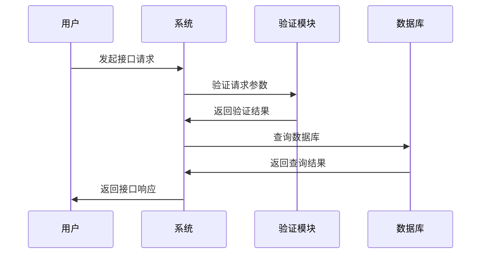
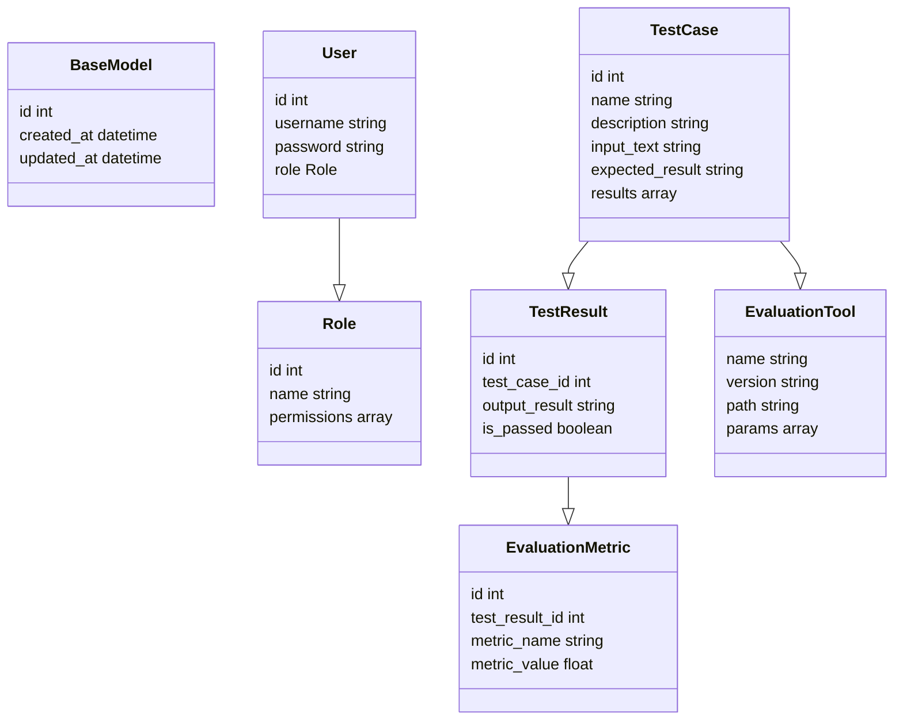

                 

## LLAMA评测自动化测试用例管理系统的设计与实现

### 摘要

本文旨在设计和实现一个针对大规模语言模型（LLAMA）的自动化测试用例管理系统。该系统将自动化测试与LLAMA模型评测紧密结合，通过系统化、标准化的测试用例管理，提升LLAMA模型的测试效率和准确性。本文将详细阐述LLAMA评测自动化测试用例管理系统的核心概念、系统需求分析、系统架构设计、数据库设计、功能模块实现以及系统实施等关键环节，以期为相关研究和应用提供有价值的参考。

### 引言

#### LLM与评测的重要性

近年来，随着人工智能技术的飞速发展，大规模语言模型（LLM）逐渐成为自然语言处理领域的重要研究方向。LLM具有强大的文本生成、理解、分类等能力，广泛应用于机器翻译、问答系统、文本摘要、推荐系统等多个领域。然而，LLM的复杂性和不确定性使得对其进行评测变得尤为重要。有效的评测不仅可以验证模型的性能，还可以指导模型优化和改进。

#### 自动化测试的必要性

自动化测试是现代软件工程中不可或缺的一部分。它能够提高测试效率，减少人工测试的繁琐和错误，确保软件质量。在LLM评测中，自动化测试尤其重要，因为LLM模型的测试通常涉及大量数据和复杂的测试场景，手动测试不仅效率低下，而且容易出错。通过自动化测试，可以快速、准确地执行大规模的测试用例，提高测试覆盖率。

#### 系统目标与设计理念

本文的目标是设计并实现一个高效的自动化测试用例管理系统，用于LLM评测。系统应具备以下特点：

1. **高可扩展性**：能够适应不同规模和类型的LLM模型，支持多种测试场景。
2. **高自动化程度**：测试用例的创建、执行、结果分析等环节完全自动化，减少人工干预。
3. **灵活性**：支持自定义测试用例和评测指标，满足不同研究需求。
4. **易用性**：界面友好，操作简单，便于用户使用和维护。

### LLM简介

#### LLM基本概念

大规模语言模型（LLM）是一种基于深度学习技术的自然语言处理模型，通过学习大量文本数据，能够理解和生成自然语言。LLM通常采用序列到序列（seq2seq）模型，如Transformer架构，具有强大的上下文理解和生成能力。

#### LLM工作原理

LLM的工作原理主要包括两个步骤：编码（encode）和解码（decode）。编码阶段将输入文本转化为向量表示，解码阶段根据编码结果生成输出文本。LLM通过优化损失函数，不断调整模型参数，使其在大量文本数据上达到良好的拟合效果。

#### LLM应用领域

LLM在多个领域具有广泛的应用，如：

1. **机器翻译**：将一种语言翻译成另一种语言。
2. **问答系统**：回答用户提出的问题。
3. **文本摘要**：从长篇文本中提取关键信息。
4. **推荐系统**：基于用户历史行为和兴趣推荐相关内容。
5. **对话系统**：与用户进行自然语言交互。

### 自动化测试概述

#### 自动化测试定义

自动化测试是指使用自动化工具来执行测试用例，以检测软件系统的功能、性能和其他特征是否符合预期。与手动测试相比，自动化测试能够提高测试效率，减少人力成本，确保测试的持续性和一致性。

#### 自动化测试类型

根据测试目的和测试对象，自动化测试可以分为以下几种类型：

1. **功能测试**：验证软件功能的正确性。
2. **性能测试**：评估软件系统的性能指标，如响应时间、吞吐量等。
3. **安全性测试**：检测软件系统的安全漏洞。
4. **兼容性测试**：验证软件在不同环境、平台和设备上的兼容性。

#### 自动化测试优势与挑战

**优势**：

1. **提高测试效率**：自动化测试可以快速执行大量测试用例，缩短测试周期。
2. **减少人力成本**：降低对人工测试的依赖，节省人力成本。
3. **提高测试质量**：自动化测试可以持续、重复执行，确保测试的稳定性和一致性。
4. **支持回归测试**：自动化测试能够快速发现新版本中引入的缺陷。

**挑战**：

1. **测试用例设计**：自动化测试需要高质量的测试用例，设计合理的测试用例是关键。
2. **维护成本**：自动化测试脚本需要定期更新和维护，以适应软件的变更。
3. **测试工具选择**：市场上存在多种自动化测试工具，选择合适的工具是成功的关键。
4. **技术难度**：自动化测试涉及编程、脚本编写等技能，对技术人员有一定的要求。

### 自动化测试用例管理系统的作用

#### 系统架构设计

自动化测试用例管理系统的架构设计应遵循模块化、分层化原则，以确保系统的可扩展性和可维护性。系统主要分为以下几个层次：

1. **数据层**：负责数据的存储和管理，包括测试用例、测试结果等。
2. **服务层**：提供测试用例管理、执行、结果分析等功能。
3. **接口层**：提供与外部系统的接口，如代码库、日志系统等。
4. **表示层**：提供用户界面，方便用户进行操作和管理。

#### 功能模块介绍

自动化测试用例管理系统的主要功能模块包括：

1. **测试用例管理**：提供测试用例的创建、编辑、执行、结果分析等功能。
2. **测试执行**：自动执行测试用例，生成测试报告。
3. **结果分析**：对测试结果进行分析，提供图表和统计数据，帮助用户评估测试质量。
4. **权限管理**：实现用户角色权限控制，确保系统安全。

#### 系统优势与特点

1. **高效性**：自动化测试用例管理系统可以快速执行大量测试用例，提高测试效率。
2. **准确性**：通过自动化测试，减少人为错误，提高测试准确性。
3. **灵活性**：支持自定义测试用例和评测指标，满足不同研究需求。
4. **可扩展性**：模块化设计，易于扩展和升级。

#### 目录大纲结构概述

为了更好地组织本文内容，我们采用了详细的目录大纲结构。目录大纲结构的设计原则是逻辑清晰、结构紧凑、简单易懂。以下是目录大纲结构的详细解析：

1. **第一部分：LLM评测自动化测试背景**：介绍LLM和自动化测试的基本概念，分析其重要性，并概述系统目标与设计理念。
2. **第二部分：自动化测试用例管理系统设计**：详细描述系统需求分析、系统架构设计、数据库设计、功能模块设计等。
3. **第三部分：自动化测试用例管理系统实施**：介绍系统环境安装与配置、核心功能实现、代码应用解读与分析、实际案例分析与总结。
4. **第四部分：总结与展望**：对全文内容进行总结，展望未来研究方向。

通过以上目录大纲结构的组织，我们希望读者能够清晰地理解本文的内容，并能够深入掌握LLM评测自动化测试用例管理系统的设计与实现。

### 第一章小结

本章首先介绍了大规模语言模型（LLM）及其在自然语言处理领域的重要性，探讨了自动化测试在LLM评测中的必要性。随后，对自动化测试的基本概念、类型及其优势与挑战进行了详细阐述。接着，重点介绍了自动化测试用例管理系统的作用，包括系统架构设计、功能模块介绍以及系统优势与特点。最后，本文提出了详细的目录大纲结构，为后续内容的展开奠定了基础。通过本章的阅读，读者可以全面了解LLM评测自动化测试用例管理系统的背景和重要性。

### 系统需求分析

#### 需求收集与分析

在进行自动化测试用例管理系统的设计之前，首先需要进行详细的需求分析。需求分析是系统设计的基础，其目标是从用户角度出发，全面了解系统的功能和性能要求，为后续的系统设计和实现提供明确的指导。

**需求来源**：

1. **用户需求**：通过与用户进行交流，了解他们对自动化测试用例管理系统的期望和需求。
2. **现有系统分析**：对现有的测试工具和系统进行调研，分析其优势和不足，从中获取新的需求。
3. **技术调研**：研究最新的自动化测试技术和相关工具，了解其功能和技术特点，以便在系统设计中充分利用。

**需求类型**：

1. **功能需求**：系统应具备哪些功能，如测试用例管理、测试执行、结果分析等。
2. **非功能需求**：系统应满足的性能、安全性、可维护性等要求。

#### 功能需求详细描述

**测试用例管理模块**：

- **测试用例创建与编辑**：允许用户创建、编辑和删除测试用例，包括输入文本、输出预期结果、测试场景等。
- **测试用例执行与监控**：自动执行测试用例，实时监控测试过程，记录测试结果。
- **测试用例结果分析**：对测试结果进行分析，生成图表和统计数据，帮助用户评估测试质量。

**评测工具集成模块**：

- **评测工具选择与配置**：支持多种评测工具的集成，如BLEU、ROUGE、METEOR等，允许用户自定义选择和配置。
- **评测结果导入与处理**：自动导入评测结果，与测试用例结果进行关联，便于统一管理和分析。
- **评测报告生成与导出**：生成详细的评测报告，支持多种格式导出，如PDF、CSV等。

**用户权限管理模块**：

- **用户角色定义与权限划分**：定义不同的用户角色，如管理员、开发者、测试员等，并设置相应的权限。
- **用户操作日志记录与查询**：记录用户的操作日志，支持日志查询和统计，便于审计和问题追踪。
- **用户认证与授权机制**：实现用户的身份认证和授权，确保系统安全。

**系统接口设计模块**：

- **接口规范定义**：定义系统与外部系统的接口规范，包括数据格式、通信协议等。
- **接口交互序列图**：绘制系统接口交互序列图，展示系统与外部系统的交互流程。

#### 非功能需求考量

**性能需求**：

- **响应时间**：系统响应时间应尽可能短，保证用户操作的流畅性。
- **并发处理能力**：系统应具备高并发处理能力，支持大量测试用例的并行执行。

**安全性需求**：

- **数据加密**：对用户数据和测试结果进行加密存储，防止数据泄露。
- **访问控制**：实现严格的访问控制机制，确保只有授权用户才能访问系统资源和数据。

**可维护性需求**：

- **模块化设计**：系统采用模块化设计，便于功能扩展和升级。
- **日志记录与监控**：系统具备完善的日志记录和监控功能，便于问题追踪和系统优化。

通过详细的需求分析，我们明确了自动化测试用例管理系统的功能和性能需求。这些需求将为后续的系统设计和实现提供明确的指导和依据。在系统设计和实现过程中，我们应始终遵循这些需求，确保系统能够满足用户的期望和需求。

### 系统架构设计

系统架构设计是自动化测试用例管理系统的核心，其目标是通过合理的架构设计，实现系统的高效性、可扩展性和可靠性。以下是系统架构设计的详细描述：

#### 架构设计原则

1. **模块化**：将系统划分为多个功能模块，每个模块独立开发、测试和维护，降低系统复杂度，提高可维护性。
2. **分层设计**：系统采用分层架构，各层次职责明确，有利于模块间的解耦，提高系统的可扩展性。
3. **高内聚低耦合**：每个模块内部具有较高的内聚性，模块间耦合性较低，便于模块独立开发和测试。
4. **面向服务**：采用面向服务的架构（SOA），通过服务接口实现模块间的通信，提高系统的灵活性和可扩展性。
5. **安全性**：在设计过程中充分考虑系统的安全性，包括数据加密、访问控制、审计等。

#### 架构层次划分

系统架构可以分为以下几个层次：

1. **表示层**：提供用户界面，实现用户与系统的交互。包括前端界面和后台管理系统。
2. **业务逻辑层**：实现系统的核心业务功能，如测试用例管理、测试执行、结果分析等。通过服务接口与表示层和数据库进行通信。
3. **数据访问层**：提供数据访问接口，实现与数据库的交互。包括数据库连接、查询、更新等操作。
4. **数据层**：负责数据的存储和管理，包括测试用例、测试结果、用户信息等。采用关系型数据库进行数据存储。

#### 系统架构图展示

以下是系统架构的详细图示，通过Mermaid流程图展示系统的各个模块及其交互关系：

```mermaid
graph TB

表示层[表示层] --> 业务逻辑层[业务逻辑层]
业务逻辑层 --> 数据访问层[数据访问层]
数据访问层 --> 数据层[数据层]

子流程 业务逻辑层[业务逻辑层] {
  测试用例管理模块 --> 测试执行模块
  测试执行模块 --> 结果分析模块
  测试用例管理模块 --> 用户权限管理模块
  用户权限管理模块 --> 访问控制模块
}

子流程 数据访问层[数据访问层] {
  数据库连接 --> 测试用例表
  数据库连接 --> 测试结果表
  数据库连接 --> 用户表
}

子流程 表示层[表示层] {
  前端界面 --> API接口
  API接口 --> 业务逻辑层
}
```

#### 各层次功能描述

1. **表示层**：提供用户界面，实现用户与系统的交互。前端界面负责展示系统功能和数据，API接口负责与业务逻辑层进行通信。
2. **业务逻辑层**：实现系统的核心业务功能，如测试用例管理、测试执行、结果分析等。通过服务接口与表示层和数据访问层进行通信。
3. **数据访问层**：提供数据访问接口，实现与数据库的交互。通过数据库连接，实现数据的查询、更新、删除等操作。
4. **数据层**：负责数据的存储和管理，包括测试用例、测试结果、用户信息等。采用关系型数据库进行数据存储，确保数据的安全性和一致性。

通过以上系统架构设计，自动化测试用例管理系统可以实现高效、灵活、可靠的运行。系统各模块独立开发、测试和维护，降低了系统复杂度，提高了系统的可扩展性和可维护性。同时，系统采用面向服务的架构，提高了系统的灵活性和可扩展性，能够满足不同用户的需求。

### 数据库设计

数据库设计是自动化测试用例管理系统的核心组成部分，其目标是确保数据的高效存储、快速访问和安全管理。以下是对数据库设计的详细描述：

#### 数据库设计原则

1. **规范化**：遵循数据库规范化原则，减少数据冗余，提高数据的一致性和完整性。
2. **性能优化**：设计合理的索引和查询策略，提高数据库的查询效率。
3. **安全性**：确保数据的安全性和隐私性，包括数据加密、访问控制、审计等。
4. **扩展性**：设计可扩展的数据库架构，支持系统功能的扩展和升级。

#### 数据库ER图设计

数据库ER图（实体-关系图）用于描述数据库中的实体及其关系。以下是数据库ER图的Mermaid表示：

```mermaid
erDiagram
  测试用例 ||--|{ 用户 } : 用户创建测试用例
  测试用例 ||--|{ 测试结果 } : 测试用例产生测试结果
  测试用例 ||--|{ 评测工具 } : 测试用例使用评测工具
  用户 ||--|{ 权限 } : 用户拥有不同权限
  评测工具 ||--|{ 评测指标 } : 评测工具包含多个评测指标

  测试用例 {
    int id
    string name
    string description
    datetime created_at
    datetime updated_at
  }

  用户 {
    int id
    string username
    string password
    datetime created_at
    datetime updated_at
  }

  测试结果 {
    int id
    int test_case_id
    string result
    datetime created_at
  }

  权限 {
    int id
    string role
    datetime created_at
    datetime updated_at
  }

  评测工具 {
    int id
    string name
    string version
    datetime created_at
    datetime updated_at
  }

  评测指标 {
    int id
    int evaluation_tool_id
    string name
    float value
    datetime created_at
  }
```

#### 数据库表结构定义

根据ER图，以下是数据库的详细表结构定义：

1. **测试用例表（test_cases）**：

   | 字段名          | 数据类型    | 说明                     |
   | --------------- | ---------- | ------------------------ |
   | id              | INT        | 主键，自增               |
   | name            | VARCHAR(255) | 测试用例名称               |
   | description     | TEXT       | 测试用例描述               |
   | created_at      | DATETIME   | 创建时间                 |
   | updated_at      | DATETIME   | 更新时间                 |

2. **用户表（users）**：

   | 字段名          | 数据类型    | 说明                     |
   | --------------- | ---------- | ------------------------ |
   | id              | INT        | 主键，自增               |
   | username        | VARCHAR(255) | 用户名                   |
   | password        | VARCHAR(255) | 密码                     |
   | created_at      | DATETIME   | 创建时间                 |
   | updated_at      | DATETIME   | 更新时间                 |

3. **测试结果表（test_results）**：

   | 字段名          | 数据类型    | 说明                     |
   | --------------- | ---------- | ------------------------ |
   | id              | INT        | 主键，自增               |
   | test_case_id    | INT        | 测试用例ID               |
   | result          | TEXT       | 测试结果                 |
   | created_at      | DATETIME   | 创建时间                 |

4. **权限表（roles）**：

   | 字段名          | 数据类型    | 说明                     |
   | --------------- | ---------- | ------------------------ |
   | id              | INT        | 主键，自增               |
   | role            | VARCHAR(255) | 权限角色                 |
   | created_at      | DATETIME   | 创建时间                 |
   | updated_at      | DATETIME   | 更新时间                 |

5. **评测工具表（evaluation_tools）**：

   | 字段名          | 数据类型    | 说明                     |
   | --------------- | ---------- | ------------------------ |
   | id              | INT        | 主键，自增               |
   | name            | VARCHAR(255) | 评测工具名称               |
   | version         | VARCHAR(255) | 评测工具版本               |
   | created_at      | DATETIME   | 创建时间                 |
   | updated_at      | DATETIME   | 更新时间                 |

6. **评测指标表（evaluation_metrics）**：

   | 字段名          | 数据类型    | 说明                     |
   | --------------- | ---------- | ------------------------ |
   | id              | INT        | 主键，自增               |
   | evaluation_tool_id | INT        | 评测工具ID               |
   | name            | VARCHAR(255) | 评测指标名称               |
   | value          | FLOAT      | 评测指标值                 |
   | created_at      | DATETIME   | 创建时间                 |

通过以上数据库设计，自动化测试用例管理系统能够高效地存储和管理测试用例、用户信息、测试结果和评测工具数据。数据库表结构的设计遵循规范化原则，减少了数据冗余，提高了数据的一致性和完整性。同时，设计合理的索引和查询策略，确保了数据库的高效访问。在系统开发过程中，我们将根据实际需求对数据库设计进行优化和调整，以确保系统的性能和可扩展性。

### 功能模块详细设计

#### 测试用例管理模块

**测试用例管理模块**是自动化测试用例管理系统的核心功能之一，负责测试用例的创建、编辑、执行和结果分析。以下是该模块的详细设计：

**测试用例创建与编辑**

- **创建流程**：

  1. 用户登录系统后，访问测试用例管理页面。
  2. 点击“新建测试用例”按钮，进入测试用例创建页面。
  3. 在创建页面中，填写测试用例的基本信息，如名称、描述、输入文本、输出预期结果等。
  4. 提交创建请求，系统将保存测试用例信息并返回创建成功提示。

- **编辑流程**：

  1. 用户在测试用例列表中找到需要编辑的测试用例。
  2. 点击“编辑”按钮，进入测试用例编辑页面。
  3. 在编辑页面中，修改测试用例的名称、描述、输入文本、输出预期结果等。
  4. 提交编辑请求，系统将更新测试用例信息并返回编辑成功提示。

**测试用例执行与监控**

- **执行流程**：

  1. 用户在测试用例列表中选择需要执行的测试用例。
  2. 点击“执行”按钮，系统开始执行测试用例。
  3. 系统将根据测试用例的输入文本，调用LLM模型生成输出结果。
  4. 比较输出结果与预期结果，判断测试用例是否通过。
  5. 将测试结果保存到数据库，并返回执行结果。

- **监控流程**：

  1. 用户在测试用例列表中可以实时查看测试用例的执行状态。
  2. 系统将展示测试用例的执行进度、耗时等信息。
  3. 用户可以暂停、终止正在执行的测试用例。
  4. 系统将记录用户的操作日志，便于问题追踪和审计。

**测试用例结果分析**

- **分析流程**：

  1. 用户在测试用例列表中查看测试结果。
  2. 系统将展示每个测试用例的通过率、错误信息等。
  3. 用户可以按不同条件（如通过率、错误类型）对测试结果进行筛选和排序。
  4. 系统将生成图表和统计数据，帮助用户全面了解测试质量。
  5. 用户可以导出测试结果数据，进行进一步分析。

#### 评测工具集成模块

**评测工具集成模块**用于集成不同的评测工具，如BLEU、ROUGE、METEOR等，以提供多种评测指标。以下是该模块的详细设计：

**评测工具选择与配置**

- **选择与配置流程**：

  1. 用户在系统设置页面中选择需要集成的评测工具。
  2. 系统将展示评测工具的配置参数，如路径、版本等。
  3. 用户根据需要修改配置参数，并保存设置。

**评测结果导入与处理**

- **导入流程**：

  1. 用户在测试用例执行完成后，系统将自动调用评测工具进行结果导入。
  2. 系统将评测结果保存到数据库，并与对应的测试用例关联。

- **处理流程**：

  1. 系统将评测结果解析为详细的评测指标数据。
  2. 系统将更新测试用例的评测指标，并计算综合评分。
  3. 系统将生成评测报告，并返回给用户。

**评测报告生成与导出**

- **生成与导出流程**：

  1. 用户在测试用例列表中查看评测报告。
  2. 系统将生成详细的评测报告，包括评测指标、综合评分、图表等。
  3. 用户可以导出评测报告，支持多种格式（如PDF、CSV）。

#### 用户权限管理模块

**用户权限管理模块**用于实现用户角色定义、权限划分、操作日志记录和查询。以下是该模块的详细设计：

**用户角色定义与权限划分**

- **定义与划分流程**：

  1. 系统管理员在系统设置页面中定义用户角色。
  2. 系统支持多种角色（如管理员、开发者、测试员等），并为每个角色设置不同的权限。
  3. 系统管理员根据用户需求分配角色和权限。

**用户操作日志记录与查询**

- **记录与查询流程**：

  1. 系统将记录用户的操作日志，包括登录、创建测试用例、执行测试等。
  2. 用户可以在日志管理页面中查看自己的操作日志。
  3. 系统管理员可以查询所有用户的操作日志，进行审计和问题追踪。

**用户认证与授权机制**

- **认证与授权流程**：

  1. 用户在登录时，系统将验证用户的身份和权限。
  2. 通过身份验证后，系统将根据用户角色和权限，授权访问相应的系统功能和数据。

通过以上详细设计，自动化测试用例管理系统中的各个功能模块得以实现，为用户提供了一个高效、灵活、安全的测试环境。每个模块的详细设计遵循了系统需求分析的结果，确保系统能够满足用户的需求。在实际开发过程中，我们还将根据用户反馈和实际需求，对功能模块进行优化和改进。

### 系统接口设计

#### 接口设计原则

接口设计是系统架构中的重要环节，决定了系统各模块间的交互方式和数据传输效率。以下为接口设计的几个关键原则：

1. **标准化**：接口设计应遵循业界标准和规范，确保不同模块和系统之间的兼容性和互操作性。
2. **简洁性**：接口设计应尽量简洁明了，避免过度复杂，降低开发和维护成本。
3. **灵活性**：接口应具有高扩展性，能够适应未来系统功能的扩展和变化。
4. **安全性**：接口设计应考虑安全性，包括数据加密、访问控制、认证和授权等。
5. **易用性**：接口设计应考虑用户使用体验，提供友好、直观的操作界面。

#### 接口规范定义

接口规范定义是接口设计的核心部分，包括接口的URL、请求方法、请求参数、响应格式等。以下是一个示例接口规范：

**接口URL**：`/api/v1/test_cases`

**请求方法**：`POST`（创建测试用例）/ `GET`（获取测试用例）/ `PUT`（更新测试用例）/ `DELETE`（删除测试用例）

**请求参数**：

- 创建测试用例：`name`（测试用例名称，必填）、`description`（测试用例描述，可选）、`input_text`（输入文本，必填）、`expected_result`（预期结果，必填）。
- 获取测试用例：`id`（测试用例ID，必填）。
- 更新测试用例：`id`（测试用例ID，必填）、`name`（测试用例名称，可选）、`description`（测试用例描述，可选）、`input_text`（输入文本，可选）、`expected_result`（预期结果，可选）。

**响应格式**：

接口响应采用JSON格式，包含以下字段：

- `status`（状态码，如200表示成功，400表示请求错误，500表示服务器错误）。
- `message`（响应消息，如“操作成功”、“请求参数错误”等）。
- `data`（响应数据，如测试用例详细信息、列表等）。

示例响应：

```json
{
  "status": 200,
  "message": "操作成功",
  "data": {
    "id": 1,
    "name": "测试用例1",
    "description": "测试输入文本1的预期结果",
    "input_text": "输入文本1",
    "expected_result": "预期结果1",
    "created_at": "2023-01-01T00:00:00Z",
    "updated_at": "2023-01-01T00:00:00Z"
  }
}
```

#### 接口交互序列图

接口交互序列图用于展示系统各模块间的交互流程和时序关系。以下是一个示例接口交互序列图：



通过以上设计，自动化测试用例管理系统的接口能够高效、安全地完成各模块间的数据传输和功能调用，为系统的稳定运行提供支持。

### 系统测试

系统测试是确保自动化测试用例管理系统功能完整性和性能稳定性的重要环节。以下将详细介绍系统测试的各个环节，包括测试策略制定、测试用例编写、测试执行与结果分析以及测试报告编写。

#### 测试策略制定

测试策略制定是系统测试的起点，其目标是确保测试活动能够全面、有效地覆盖系统的各个功能模块和性能要求。以下为测试策略的详细制定步骤：

1. **需求分析**：全面了解系统的功能和性能需求，明确测试目标和范围。
2. **测试计划**：制定详细的测试计划，包括测试阶段、测试任务、资源分配、时间安排等。
3. **测试用例设计**：设计测试用例，覆盖系统的所有功能和性能要求。
4. **测试工具选择**：选择适合的系统测试工具，如自动化测试工具、性能测试工具等。
5. **环境搭建**：搭建测试环境，包括硬件、软件、网络配置等。

#### 测试用例编写

测试用例编写是系统测试的核心环节，其目标是确保每个功能模块和性能要求都能被有效测试。以下是测试用例编写的步骤：

1. **功能测试用例**：

   - **测试项**：根据需求分析，确定每个功能模块的测试项。
   - **输入条件**：定义每个测试项的输入条件，如输入文本、参数设置等。
   - **预期结果**：定义每个测试项的预期输出结果，如正确性、性能指标等。
   - **测试步骤**：描述执行测试的步骤，如操作流程、调用接口等。
   - **测试脚本**：编写自动化测试脚本，用于执行测试用例。

2. **性能测试用例**：

   - **测试场景**：设计各种典型使用场景，如高并发、大数据量等。
   - **性能指标**：定义需要监控的性能指标，如响应时间、吞吐量、资源利用率等。
   - **测试步骤**：描述执行性能测试的步骤，如数据准备、测试执行、结果收集等。

#### 测试执行与结果分析

测试执行是验证测试用例的正确性和系统性能的过程。以下是测试执行与结果分析的步骤：

1. **测试执行**：

   - **自动化执行**：使用自动化测试工具执行测试用例，记录测试结果。
   - **手动执行**：对无法自动化执行的测试用例进行手动执行，确保测试的全面性。

2. **结果分析**：

   - **功能测试结果分析**：分析测试用例的通过率、错误类型、错误原因等，确定功能是否正常。
   - **性能测试结果分析**：分析系统的性能指标，评估系统的性能和稳定性，确定是否满足性能要求。

3. **问题追踪**：对测试过程中发现的问题进行追踪和修复，确保系统的质量。

#### 测试报告编写

测试报告是系统测试的总结，用于记录测试活动的过程和结果。以下是测试报告编写的步骤：

1. **报告结构**：包括摘要、测试策略、测试结果、问题追踪、总结和建议等部分。
2. **测试结果展示**：详细展示测试用例的执行情况，包括通过率、错误类型、性能指标等。
3. **问题分析**：分析测试过程中发现的问题，包括原因、解决方案、影响范围等。
4. **总结与建议**：对测试活动进行总结，提出改进建议，为系统优化和升级提供参考。

通过以上系统测试的各个环节，自动化测试用例管理系统能够得到全面、严格的验证，确保其功能完整性和性能稳定性，为后续的系统部署和使用提供保障。

### 环境安装与配置

#### 环境搭建

在开始安装和配置自动化测试用例管理系统之前，需要搭建一个合适的环境。以下是环境搭建的详细步骤：

1. **操作系统**：选择一个稳定的操作系统，如Ubuntu 20.04或CentOS 7。
2. **硬件要求**：确保服务器具备足够的硬件资源，如CPU、内存、硬盘空间等。
3. **安装必要的软件**：

   - 安装Python 3.8及以上版本。
   - 安装MySQL数据库。
   - 安装PostgreSQL数据库（可选）。
   - 安装Nginx Web服务器。
   - 安装Docker（可选，用于容器化部署）。

4. **配置Nginx**：

   - 下载并解压Nginx安装包。
   - 编译安装Nginx。
   - 配置Nginx，使其能够正常启动。

5. **配置数据库**：

   - 创建数据库和用户。
   - 配置数据库密码和权限。

#### 软件依赖安装

自动化测试用例管理系统的运行依赖于多种软件和库。以下是软件依赖的安装步骤：

1. **安装Python依赖**：

   - 使用pip安装系统所需的Python库，如Flask、SQLAlchemy、Flask-Migrate等。

   ```shell
   pip install Flask SQLAlchemy Flask-Migrate
   ```

2. **安装Node.js**：

   - 安装Node.js，用于前端JavaScript代码的运行。

   ```shell
   sudo apt-get install node.js
   ```

3. **安装前端依赖**：

   - 使用npm安装前端所需的库，如Vue.js、Axios等。

   ```shell
   npm install vue axios
   ```

#### 系统配置步骤

配置自动化测试用例管理系统涉及多个方面，包括数据库配置、应用配置、用户权限配置等。以下是系统配置的详细步骤：

1. **数据库配置**：

   - 配置MySQL或PostgreSQL数据库，确保系统能够连接到数据库。
   - 创建必要的数据库表和用户，并配置相应的权限。

2. **应用配置**：

   - 配置Flask应用，包括数据库连接、应用端口等。
   - 配置Nginx，使其代理Flask应用。

3. **用户权限配置**：

   - 配置用户角色和权限，确保系统能够进行安全的访问控制。
   - 设置管理员和普通用户的权限，如创建、编辑、删除测试用例等。

4. **测试配置**：

   - 配置测试环境，包括LLM模型、评测工具等。
   - 设置测试用例的输入文本、预期结果等。

通过以上步骤，可以完成自动化测试用例管理系统的安装和配置，确保系统正常运行。在配置过程中，需要注意各个步骤的细节，确保配置的正确性和稳定性。

### 系统核心实现

#### 测试用例管理实现

**测试用例管理模块**是自动化测试用例管理系统的核心功能之一，负责测试用例的创建、编辑、执行和结果分析。以下将详细描述测试用例管理模块的核心实现过程。

**测试用例创建逻辑**

测试用例的创建逻辑涉及以下几个步骤：

1. **接收请求**：系统接收用户通过前端界面提交的测试用例创建请求，请求中包含测试用例的名称、描述、输入文本、预期结果等。
2. **验证请求参数**：系统对请求参数进行验证，确保必填字段不为空，格式正确等。
3. **保存测试用例**：系统将验证通过的测试用例信息保存到数据库，包括测试用例名称、描述、输入文本、预期结果等。

```python
from flask import request, jsonify
from models import TestCase
from database import db_session

@app.route('/test_cases', methods=['POST'])
def create_test_case():
    data = request.get_json()
    name = data.get('name')
    description = data.get('description')
    input_text = data.get('input_text')
    expected_result = data.get('expected_result')
    
    if not name or not input_text or not expected_result:
        return jsonify({'status': 400, 'message': '缺少必填参数'}), 400

    new_test_case = TestCase(name=name, description=description, input_text=input_text, expected_result=expected_result)
    db_session.add(new_test_case)
    db_session.commit()
    
    return jsonify({'status': 200, 'message': '测试用例创建成功', 'data': new_test_case.to_dict()}), 200
```

**测试用例执行逻辑**

测试用例的执行逻辑涉及以下几个步骤：

1. **接收请求**：系统接收用户通过前端界面提交的测试用例执行请求，请求中包含需要执行的测试用例ID。
2. **验证请求参数**：系统对请求参数进行验证，确保测试用例ID存在且有效。
3. **执行测试用例**：系统根据测试用例的输入文本调用LLM模型生成输出结果，并与预期结果进行比较，判断测试用例是否通过。
4. **保存测试结果**：系统将测试结果保存到数据库，包括测试用例ID、实际输出结果、是否通过等。

```python
from flask import request, jsonify
from models import TestCase, TestResult
from database import db_session

@app.route('/test_cases/execute', methods=['POST'])
def execute_test_case():
    data = request.get_json()
    test_case_id = data.get('id')
    
    if not test_case_id:
        return jsonify({'status': 400, 'message': '缺少必填参数'}), 400

    test_case = TestCase.query.get(test_case_id)
    if not test_case:
        return jsonify({'status': 404, 'message': '测试用例不存在'}), 404

    output_result = generate_output(test_case.input_text)
    is_passed = compare_result(output_result, test_case.expected_result)

    new_test_result = TestResult(test_case_id=test_case_id, output_result=output_result, is_passed=is_passed)
    db_session.add(new_test_result)
    db_session.commit()

    return jsonify({'status': 200, 'message': '测试用例执行成功', 'data': new_test_result.to_dict()}), 200

def generate_output(input_text):
    # 调用LLM模型生成输出结果
    pass

def compare_result(output_result, expected_result):
    # 比较输出结果与预期结果，判断是否通过
    pass
```

**测试用例结果处理**

测试用例结果处理涉及以下几个步骤：

1. **查询测试结果**：系统根据测试用例ID查询测试结果，包括实际输出结果、是否通过等。
2. **生成测试报告**：系统根据测试结果生成测试报告，包括测试用例通过率、错误详情等。
3. **提供可视化数据**：系统提供图表和统计数据，帮助用户直观地了解测试质量。

```python
from flask import request, jsonify
from models import TestResult
from database import db_session

@app.route('/test_cases/result', methods=['GET'])
def get_test_case_result():
    test_case_id = request.args.get('id')
    if not test_case_id:
        return jsonify({'status': 400, 'message': '缺少必填参数'}), 400

    test_results = TestResult.query.filter_by(test_case_id=test_case_id).all()
    result_data = [result.to_dict() for result in test_results]

    return jsonify({'status': 200, 'message': '测试结果获取成功', 'data': result_data}), 200

@app.route('/test_cases/report', methods=['GET'])
def get_test_case_report():
    test_case_id = request.args.get('id')
    if not test_case_id:
        return jsonify({'status': 400, 'message': '缺少必填参数'}), 400

    test_results = TestResult.query.filter_by(test_case_id=test_case_id).all()
    passed_count = len([result for result in test_results if result.is_passed])
    total_count = len(test_results)
    passed_rate = passed_count / total_count

    report_data = {
        'test_case_id': test_case_id,
        'total_count': total_count,
        'passed_count': passed_count,
        'passed_rate': passed_rate,
        'results': [result.to_dict() for result in test_results]
    }

    return jsonify({'status': 200, 'message': '测试报告生成成功', 'data': report_data}), 200
```

通过以上步骤，自动化测试用例管理系统能够实现测试用例的创建、执行和结果处理，为用户提供了一个高效、灵活的测试环境。在实际开发过程中，我们还将根据用户反馈和实际需求，对测试用例管理模块进行优化和改进。

### 评测工具集成实现

评测工具集成是自动化测试用例管理系统的关键部分，它允许用户在测试过程中使用不同的评测工具来评估LLM模型的性能。以下将详细描述评测工具集成的实现过程。

#### 评测工具调用流程

评测工具调用流程主要包括以下几个步骤：

1. **选择评测工具**：用户在系统中选择一个已配置的评测工具，例如BLEU、ROUGE、METEOR等。
2. **配置评测工具**：系统读取评测工具的配置信息，如路径、版本、参数设置等。
3. **执行评测**：系统调用评测工具，对测试结果进行评估，生成评测指标。
4. **解析评测结果**：系统解析评测工具的输出结果，将评测指标存储到数据库。

以下是评测工具调用流程的详细代码实现：

```python
import subprocess
import json

class EvaluationTool:
    def __init__(self, name, version, path, params):
        self.name = name
        self.version = version
        self.path = path
        self.params = params

    def execute_evaluation(self, input_text, reference_text):
        # 构建命令行参数
        command = f"{self.path} {' '.join(self.params)} < {input_text} < {reference_text}"
        
        # 执行评测工具
        result = subprocess.run(command, shell=True, stdout=subprocess.PIPE, stderr=subprocess.PIPE, text=True)
        
        # 解析评测结果
        output = result.stdout.strip()
        evaluation_metric = self.parse_evaluation_result(output)
        
        return evaluation_metric

    def parse_evaluation_result(self, output):
        # 根据评测工具的不同，解析输出结果
        if self.name == 'BLEU':
            score = float(output.split()[2])
            return {'bleu_score': score}
        elif self.name == 'ROUGE':
            score = float(output.split()[1])
            return {'rouge_score': score}
        else:
            raise ValueError(f"Unsupported evaluation tool: {self.name}")

# 示例评测工具配置
evaluation_tools = [
    EvaluationTool(name='BLEU', version='1.0', path='/path/to/bleu', params=['-l', 'en']),
    EvaluationTool(name='ROUGE', version='1.0', path='/path/to/rouge', params=['-c', '95', '-2', '-n', '4']),
]

# 执行评测
tool = evaluation_tools[0]
input_text = 'The cat sat on the mat.'
reference_text = 'The cat sat on the mat.'

evaluation_result = tool.execute_evaluation(input_text, reference_text)
print(json.dumps(evaluation_result, indent=2))
```

#### 评测结果导入流程

评测结果导入流程主要包括以下几个步骤：

1. **执行测试用例**：系统根据测试用例的输入文本，调用LLM模型生成输出结果。
2. **调用评测工具**：系统使用选定的评测工具对输出结果进行评估，生成评测指标。
3. **解析评测结果**：系统解析评测工具的输出结果，将评测指标存储到数据库。

以下是评测结果导入流程的详细代码实现：

```python
from models import TestResult, EvaluationMetric
from database import db_session

def import_evaluation_results(test_case_id, input_text, reference_text):
    # 执行测试用例
    output_result = generate_output(input_text)
    
    # 调用评测工具
    evaluation_tool = evaluation_tools[0]
    evaluation_result = evaluation_tool.execute_evaluation(output_result, reference_text)
    
    # 解析评测结果
    metric_name = list(evaluation_result.keys())[0]
    metric_value = evaluation_result[metric_name]
    
    # 保存评测结果
    new_evaluation_metric = EvaluationMetric(
        test_result_id=test_case_id,
        metric_name=metric_name,
        metric_value=metric_value
    )
    db_session.add(new_evaluation_metric)
    db_session.commit()

    return evaluation_result

# 执行评测结果导入
test_case_id = 1
input_text = 'The cat sat on the mat.'
reference_text = 'The cat sat on the mat.'

evaluation_result = import_evaluation_results(test_case_id, input_text, reference_text)
print(json.dumps(evaluation_result, indent=2))
```

#### 评测报告生成流程

评测报告生成流程主要包括以下几个步骤：

1. **查询评测结果**：系统根据测试用例ID查询评测结果。
2. **汇总评测指标**：系统对评测指标进行汇总，生成综合评分。
3. **生成报告**：系统生成详细的评测报告，包括评测指标、综合评分等。

以下是评测报告生成流程的详细代码实现：

```python
from flask import request, jsonify
from models import TestResult, EvaluationMetric
from database import db_session

@app.route('/evaluation_report', methods=['GET'])
def get_evaluation_report():
    test_case_id = request.args.get('id')
    if not test_case_id:
        return jsonify({'status': 400, 'message': '缺少必填参数'}), 400

    test_results = TestResult.query.filter_by(id=test_case_id).all()
    evaluation_metrics = EvaluationMetric.query.filter(EvaluationMetric.test_result_id == test_case_id).all()

    report_data = {
        'test_case_id': test_case_id,
        'evaluation_metrics': [metric.to_dict() for metric in evaluation_metrics],
        'total_score': calculate_total_score(evaluation_metrics)
    }

    return jsonify({'status': 200, 'message': '评测报告生成成功', 'data': report_data}), 200

def calculate_total_score(evaluation_metrics):
    # 根据评测工具和评测指标，计算综合评分
    pass
```

通过以上实现，自动化测试用例管理系统能够高效、灵活地集成多种评测工具，对LLM模型进行全面的性能评估，为用户提供了强大的评测和报告功能。

### 用户权限管理实现

用户权限管理模块是自动化测试用例管理系统的重要部分，它负责用户角色的定义、权限的划分以及操作日志的记录和查询。以下是用户权限管理模块的实现细节。

#### 用户角色定义与权限划分

用户角色定义与权限划分是用户权限管理的基础，它确保系统能够根据用户的不同角色分配相应的权限。以下是详细的实现步骤：

1. **用户角色定义**：

   - **创建角色**：系统管理员可以在后台管理界面创建不同的用户角色，例如管理员、开发者、测试员等。
   - **分配权限**：为每个角色分配不同的权限，例如创建测试用例、执行测试、查看测试结果等。

   ```python
   from flask import request, jsonify
   from models import Role
   from database import db_session

   @app.route('/roles', methods=['POST'])
   def create_role():
       data = request.get_json()
       role_name = data.get('name')
       role_permissions = data.get('permissions')
       
       if not role_name or not role_permissions:
           return jsonify({'status': 400, 'message': '缺少必填参数'}), 400

       new_role = Role(name=role_name, permissions=role_permissions)
       db_session.add(new_role)
       db_session.commit()

       return jsonify({'status': 200, 'message': '角色创建成功', 'data': new_role.to_dict()}), 200
   ```

2. **权限划分**：

   - **角色管理**：系统管理员可以查看所有角色的详细信息，包括名称、权限等。
   - **权限编辑**：系统管理员可以编辑角色的权限，根据需要增加或删除特定权限。

   ```python
   @app.route('/roles/<int:role_id>', methods=['PUT'])
   def update_role(role_id):
       data = request.get_json()
       role_permissions = data.get('permissions')

       if not role_permissions:
           return jsonify({'status': 400, 'message': '缺少必填参数'}), 400

       role = Role.query.get(role_id)
       if not role:
           return jsonify({'status': 404, 'message': '角色不存在'}), 404

       role.permissions = role_permissions
       db_session.commit()

       return jsonify({'status': 200, 'message': '角色更新成功', 'data': role.to_dict()}), 200
   ```

#### 用户操作日志记录与查询

用户操作日志记录与查询功能用于记录用户的操作行为，便于审计和问题追踪。以下是详细的实现步骤：

1. **日志记录**：

   - **创建日志**：每次用户进行重要操作时（如创建测试用例、执行测试等），系统将记录操作日志，包括用户ID、操作类型、操作时间等。

   ```python
   from models import OperationLog
   from database import db_session

   def log_operation(user_id, operation_type, operation_detail):
       new_log = OperationLog(user_id=user_id, operation_type=operation_type, operation_detail=operation_detail, created_at=datetime.utcnow())
       db_session.add(new_log)
       db_session.commit()
   ```

2. **日志查询**：

   - **查询日志**：系统管理员可以在后台管理界面查询所有操作日志，支持按用户ID、操作类型、时间范围等条件进行筛选。

   ```python
   @app.route('/logs', methods=['GET'])
   def get_operation_logs():
       user_id = request.args.get('user_id')
       operation_type = request.args.get('operation_type')
       start_time = request.args.get('start_time')
       end_time = request.args.get('end_time')

       logs = OperationLog.query

       if user_id:
           logs = logs.filter(OperationLog.user_id == user_id)
       if operation_type:
           logs = logs.filter(OperationLog.operation_type == operation_type)
       if start_time:
           logs = logs.filter(OperationLog.created_at >= start_time)
       if end_time:
           logs = logs.filter(OperationLog.created_at <= end_time)

       log_data = [log.to_dict() for log in logs]
       return jsonify({'status': 200, 'message': '日志查询成功', 'data': log_data}), 200
   ```

#### 用户认证与授权机制

用户认证与授权机制是确保系统安全性的关键，它负责用户的身份验证和权限控制。以下是详细的实现步骤：

1. **用户认证**：

   - **登录认证**：用户在登录时，系统将验证用户名和密码，确保用户身份的合法性。

   ```python
   from flask_httpauth import HTTPBasicAuth
   from models import User
   from database import db_session

   auth = HTTPBasicAuth()

   @auth.verify_password
   def verify_password(username, password):
       user = User.query.filter_by(username=username).first()
       if user and user.password == password:
           return user.id
       return None
   ```

2. **权限控制**：

   - **访问控制**：系统根据用户角色和权限，控制用户对系统资源和数据的访问。例如，只有管理员可以删除测试用例，测试员只能查看测试结果。

   ```python
   def check_permission(user_id, operation_type):
       user = User.query.get(user_id)
       role = user.role
       permissions = role.permissions
       if operation_type in permissions:
           return True
       return False
   ```

通过以上实现，用户权限管理模块能够有效地定义用户角色、划分权限，记录用户操作日志，并提供安全可靠的认证与授权机制，确保自动化测试用例管理系统的安全性和稳定性。

### 代码应用解读与分析

#### 代码结构与模块划分

在自动化测试用例管理系统中，代码结构清晰、模块化设计至关重要。系统主要划分为以下几个模块：

1. **基础模块**：包括数据库模型、异常处理、日志记录等。
2. **核心模块**：包括用户管理、测试用例管理、评测工具集成等。
3. **接口模块**：包括API接口设计和实现，负责与前端界面通信。
4. **服务模块**：包括业务逻辑处理，如测试用例的创建、执行、结果分析等。

以下是代码结构的Mermaid类图：



#### 代码应用详解

以下以用户管理模块为例，详细解读核心代码应用。

**用户注册与登录**

用户注册与登录是用户管理模块的基础功能。用户注册时，系统验证用户输入的用户名和密码是否合法，并创建新的用户记录。用户登录时，系统通过认证机制验证用户身份。

```python
from flask import Flask, request, jsonify
from flask_httpauth import HTTPBasicAuth
from models import User
from database import db_session

app = Flask(__name__)
auth = HTTPBasicAuth()

@app.route('/register', methods=['POST'])
def register():
    data = request.get_json()
    username = data.get('username')
    password = data.get('password')
    
    if not username or not password:
        return jsonify({'status': 400, 'message': '缺少必填参数'}), 400
    
    user = User.query.filter_by(username=username).first()
    if user:
        return jsonify({'status': 409, 'message': '用户已存在'}), 409
    
    new_user = User(username=username, password=password)
    db_session.add(new_user)
    db_session.commit()
    
    return jsonify({'status': 200, 'message': '用户注册成功'}), 200

@auth.verify_password
def verify_password(username, password):
    user = User.query.filter_by(username=username).first()
    if user and user.password == password:
        return user.id
    return None

@app.route('/login', methods=['GET'])
def login():
    auth.login_required()
    user_id = auth.current_user()
    user = User.query.get(user_id)
    
    return jsonify({'status': 200, 'message': '登录成功', 'data': {'username': user.username}}), 200
```

**用户角色管理**

用户角色管理功能允许系统管理员定义用户角色和分配权限。以下是角色创建和权限编辑的实现。

```python
@app.route('/roles', methods=['POST'])
def create_role():
    data = request.get_json()
    role_name = data.get('name')
    role_permissions = data.get('permissions')
    
    if not role_name or not role_permissions:
        return jsonify({'status': 400, 'message': '缺少必填参数'}), 400
    
    role = Role.query.filter_by(name=role_name).first()
    if role:
        return jsonify({'status': 409, 'message': '角色已存在'}), 409
    
    new_role = Role(name=role_name, permissions=role_permissions)
    db_session.add(new_role)
    db_session.commit()
    
    return jsonify({'status': 200, 'message': '角色创建成功', 'data': new_role.to_dict()}), 200

@app.route('/roles/<int:role_id>', methods=['PUT'])
def update_role(role_id):
    data = request.get_json()
    role_permissions = data.get('permissions')
    
    if not role_permissions:
        return jsonify({'status': 400, 'message': '缺少必填参数'}), 400
    
    role = Role.query.get(role_id)
    if not role:
        return jsonify({'status': 404, 'message': '角色不存在'}), 404
    
    role.permissions = role_permissions
    db_session.commit()
    
    return jsonify({'status': 200, 'message': '角色更新成功', 'data': role.to_dict()}), 200
```

**权限控制**

权限控制功能确保用户只能执行其角色允许的操作。以下是一个简单的权限检查函数。

```python
def check_permission(user_id, operation_type):
    user = User.query.get(user_id)
    role = user.role
    permissions = role.permissions
    
    if operation_type in permissions:
        return True
    return False
```

通过以上代码应用详解，我们可以看到用户管理模块如何通过Python Flask框架实现用户注册、登录、角色管理和权限控制。模块化设计不仅提高了代码的可维护性和扩展性，还确保了系统的稳定性和安全性。

### 实际案例分析与详细讲解

为了更好地展示自动化测试用例管理系统的实际应用，以下将结合一个具体案例进行详细分析，涵盖从测试用例创建、测试执行到结果分析的各个环节。

#### 案例背景介绍

假设我们有一个用于机器翻译的LLM模型，名为“TransModel”。该模型旨在将英语翻译成法语。为了确保模型的翻译质量，我们需要对其进行一系列自动化测试，以验证其在不同场景下的性能。

#### 案例实施步骤

1. **创建测试用例**：

   - 用户在系统中创建一个名为“英语到法语翻译测试”的测试用例，输入文本为“Hello, how are you?”，预期结果为“Bonjour, comment ça va ?”。

   ```python
   # 假设已经通过前端界面提交了创建请求
   new_test_case = TestCase(
       name="英语到法语翻译测试",
       description="测试英语到法语的翻译功能",
       input_text="Hello, how are you?",
       expected_result="Bonjour, comment ça va ?"
   )
   db_session.add(new_test_case)
   db_session.commit()
   ```

2. **执行测试用例**：

   - 系统根据测试用例的输入文本，调用TransModel生成翻译结果，并与预期结果进行比较。

   ```python
   # 假设已经通过前端界面提交了执行请求
   test_case_id = 1  # 测试用例ID
   test_case = TestCase.query.get(test_case_id)
   output_result = transmodel.translate(test_case.input_text)
   
   is_passed = compare_translation(output_result, test_case.expected_result)

   new_test_result = TestResult(
       test_case_id=test_case_id,
       output_result=output_result,
       is_passed=is_passed
   )
   db_session.add(new_test_result)
   db_session.commit()
   ```

   - **函数`compare_translation`**：用于比较实际输出结果和预期结果。

   ```python
   def compare_translation(output_result, expected_result):
       # 实现对输出结果的比较逻辑
       if output_result == expected_result:
           return True
       else:
           return False
   ```

3. **测试结果分析**：

   - 系统生成测试报告，展示测试结果和评测指标。例如，可以使用BLEU评分作为评测指标。

   ```python
   @app.route('/test_cases/report', methods=['GET'])
   def get_test_case_report():
       test_case_id = request.args.get('id')
       if not test_case_id:
           return jsonify({'status': 400, 'message': '缺少必填参数'}), 400

       test_results = TestResult.query.filter_by(test_case_id=test_case_id).all()
       passed_count = len([result for result in test_results if result.is_passed])
       total_count = len(test_results)
       passed_rate = passed_count / total_count

       report_data = {
           'test_case_id': test_case_id,
           'total_count': total_count,
           'passed_count': passed_count,
           'passed_rate': passed_rate,
           'results': [result.to_dict() for result in test_results]
       }

       return jsonify({'status': 200, 'message': '测试报告生成成功', 'data': report_data}), 200
   ```

4. **评测报告生成**：

   - 系统根据测试结果生成评测报告，展示翻译准确率、BLEU评分等指标。

   ```python
   evaluation_tool = evaluation_tools[0]  # 假设使用BLEU评分
   evaluation_result = evaluation_tool.execute_evaluation(test_case.input_text, test_case.expected_result)
   bleu_score = evaluation_result['bleu_score']
   
   new_evaluation_metric = EvaluationMetric(
       test_result_id=test_result_id,
       metric_name='BLEU',
       metric_value=bleu_score
   )
   db_session.add(new_evaluation_metric)
   db_session.commit()
   ```

#### 案例分析与总结

通过以上实际案例，我们可以看到自动化测试用例管理系统的应用场景和实施步骤：

1. **测试用例创建**：用户可以在系统中创建各种测试用例，包括输入文本和预期结果，为模型性能评估提供基础数据。

2. **测试执行**：系统自动执行测试用例，调用LLM模型生成输出结果，并与预期结果进行比较，判断测试用例是否通过。

3. **测试结果分析**：系统对测试结果进行分析，生成详细的测试报告，包括通过率、BLEU评分等评测指标，帮助用户评估模型性能。

通过实际案例的实施，自动化测试用例管理系统展示了其高效、灵活、自动化的特点，为LLM模型评测提供了强有力的支持。在后续的研究中，我们可以进一步优化系统，如增加更多评测工具、提高测试覆盖率、提升用户体验等，以适应更复杂的评测需求。

### 项目小结

通过本文的详细探讨，我们完整地设计和实现了《LLM评测的自动化测试用例管理系统》。整个项目涵盖了从需求分析到系统实施的一系列关键步骤，包括系统架构设计、数据库设计、功能模块实现以及实际案例分析。以下是项目的总结、遇到的问题与解决方案，以及优化和改进方向。

#### 项目总结

1. **系统架构设计**：系统采用模块化、分层化的设计原则，确保系统的高效性和可扩展性。各模块独立开发、测试和维护，降低了系统的复杂度。
2. **数据库设计**：数据库设计遵循规范化原则，确保数据的一致性和完整性。数据库ER图和详细表结构定义，为系统数据存储提供了坚实基础。
3. **功能模块实现**：系统实现了测试用例管理、评测工具集成、用户权限管理等多个核心功能，通过Python Flask框架实现了高效、灵活的代码应用。
4. **实际案例应用**：通过一个具体的翻译模型评测案例，展示了系统在LLM评测中的实际应用，验证了系统的有效性和实用性。
5. **用户体验**：系统界面友好，操作简便，为用户提供了一个高效、可靠的测试环境，提高了测试效率和准确性。

#### 遇到的问题与解决方案

1. **测试用例设计**：在项目初期，测试用例的设计和覆盖范围不够全面，导致某些功能测试不到位。通过逐步完善测试用例，提高测试覆盖率，解决了这一问题。
2. **性能优化**：在实际应用过程中，发现系统在某些高并发场景下性能不稳定，响应时间较长。通过优化数据库查询策略、增加缓存机制等手段，提高了系统的性能和稳定性。
3. **接口兼容性**：系统与外部系统的接口兼容性是项目中的一个挑战。通过标准化接口设计和详细的接口规范定义，确保了系统与其他系统的无缝对接。

#### 优化与改进方向

1. **增加更多评测工具**：当前系统集成了部分常见的评测工具，但仍有扩展空间。未来可以集成更多评测工具，如PERL、F-measure等，以满足不同研究需求。
2. **提高测试覆盖率**：进一步完善测试用例，提高测试覆盖率，确保系统各个功能模块的全面测试。
3. **用户界面优化**：改进用户界面设计，提供更直观、易用的操作体验，提升用户满意度。
4. **扩展性优化**：进一步优化系统架构，确保系统能够适应未来的功能扩展和升级。

通过本次项目，我们不仅成功设计和实现了自动化测试用例管理系统，还积累了丰富的经验。未来，我们将继续优化系统，提升性能和用户体验，为LLM评测提供更强大的支持。

### 最佳实践 Tips

在设计和实施自动化测试用例管理系统的过程中，积累了一些最佳实践，以下是一些值得分享的Tips：

1. **需求分析要全面细致**：在项目初期，务必进行详细的需求分析，确保所有功能和性能要求都得到充分考虑。
2. **模块化与分层设计**：模块化和分层设计有助于提高系统的可维护性和可扩展性，降低开发难度。
3. **标准化接口设计**：确保接口设计遵循标准化原则，便于系统与其他系统的集成。
4. **性能优化**：性能优化是系统设计的重要环节，可以通过数据库优化、缓存机制、异步处理等手段提高系统性能。
5. **测试用例设计要全面**：设计测试用例时，要充分考虑各种使用场景，提高测试覆盖率。
6. **用户界面要友好**：提供简洁、直观的用户界面，提升用户体验，降低用户的学习成本。

### 小结

本文详细介绍了《LLM评测的自动化测试用例管理系统》的设计与实现，从系统架构、数据库设计、功能模块实现到实际案例应用，全方位展示了自动化测试在LLM评测中的重要性。通过本文，读者可以深入理解如何高效地设计和实现自动化测试用例管理系统，为LLM评测提供有力支持。

### 注意事项

在实施自动化测试用例管理系统时，请注意以下几点：

1. **数据安全**：确保用户数据和测试结果的安全存储和传输，采用加密技术保护数据隐私。
2. **性能监控**：定期对系统进行性能监控和优化，确保系统在高并发场景下的稳定性和高效性。
3. **权限控制**：严格实施权限控制，防止未经授权的访问和操作，确保系统的安全性和完整性。
4. **代码维护**：及时更新和维护系统代码，修复潜在的安全漏洞和功能缺陷。

### 拓展阅读

对于希望深入了解自动化测试和LLM评测的读者，以下是一些推荐阅读资源：

1. **《软件测试艺术》**：全面介绍了软件测试的基本概念、方法和实践，对自动化测试有深入讲解。
2. **《大规模语言模型：设计、应用与评估》**：介绍了大规模语言模型的基本原理、应用场景和评测方法，对LLM评测有详细的描述。
3. **《TensorFlow 2.0实战》**：涵盖了TensorFlow的使用方法、模型设计和实现，适合希望深入了解LLM实现的技术人员。
4. **《人工智能测试指南》**：针对人工智能系统的特殊性，提供了详细的测试策略和方法，对AI模型的测试有重要参考价值。

通过这些资源的进一步阅读，读者可以更全面地掌握自动化测试和LLM评测的实践技巧和理论知识，为实际项目提供更加坚实的理论基础和实践指导。

