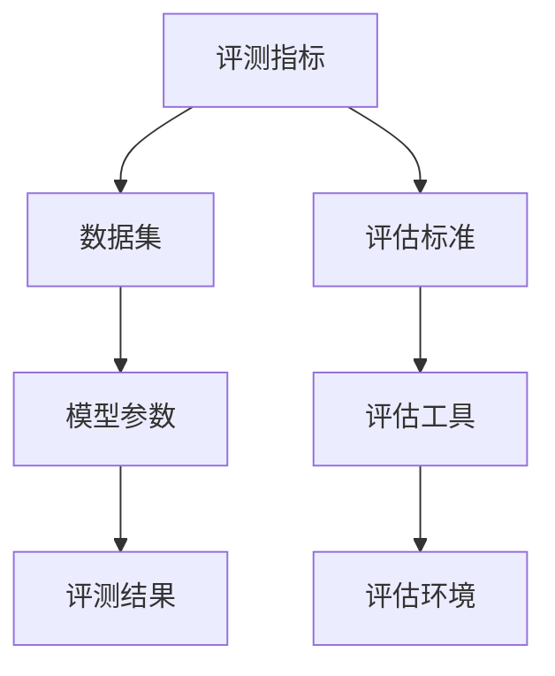
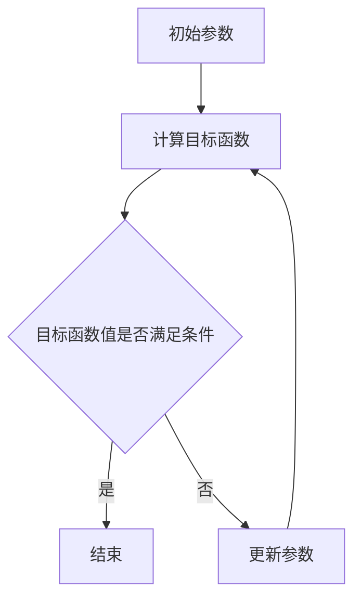

                 

# 《LLM评测的自动化调参与优化》

## 关键词：大型语言模型（LLM），评测，自动化调参，优化策略，性能提升

### 摘要：

本文将深入探讨大型语言模型（LLM）评测中的自动化调参与优化问题。首先，我们回顾了LLM的背景和挑战，接着介绍了自动化调参的原理和应用，通过具体的算法流程、Python代码示例及数学模型进行详细讲解。随后，我们讨论了优化策略，包括模型结构调整、数据增强和损失函数优化，并提出了一个完整的系统分析与架构设计方案。最后，通过一个实际案例进行深入剖析，总结了最佳实践并展望了未来发展方向。

---

### 第一部分：背景介绍

#### 1.1 人工智能与大型语言模型（LLM）

##### 1.1.1 问题背景

人工智能（AI）的快速发展带来了大量创新应用，其中大型语言模型（LLM）在自然语言处理（NLP）领域尤为重要。LLM通过深度学习技术，能够处理和理解大规模文本数据，广泛应用于文本生成、机器翻译、问答系统等场景。

##### 1.1.2 问题描述

LLM评测面临的主要挑战包括评测标准的多样性、评测结果的准确性和可靠性。如何准确评估LLM的性能，为优化和改进提供有力支持，成为亟待解决的问题。

##### 1.1.3 问题解决

自动化调参技术的引入，以及优化策略的应用，有望提升LLM评测的效率和准确性。通过系统化的调参和优化，我们可以更快速地找到模型性能的最佳配置，从而提高评测结果的可靠性和一致性。

##### 1.1.4 边界与外延

LLM评测涉及的范围广泛，包括文本生成、文本分类、机器翻译等多个领域。自动化调参技术有多种分类和应用场景，不同优化策略的适用性也有待进一步探讨。

##### 1.1.5 概念结构与核心要素组成

大型语言模型通常由多层神经网络构成，包括编码器和解码器。评测指标如BLEU、ROUGE、F1 score等用于评估模型性能。自动化调参和优化策略的核心是寻找最优参数组合，以提升模型性能。

#### 1.2 LLM评测的核心概念与联系

##### 1.2.1 核心概念原理

评测指标与模型性能密切相关，数据集的选择与处理对评测结果有重要影响。评测流程的设计与实现需要考虑多方面的因素，包括评估标准、评估工具和评估环境等。

##### 1.2.2 概念属性特征对比表格

| 指标       | 类型           | 描述                                                     |
| ---------- | -------------- | -------------------------------------------------------- |
| BLEU       | 对比性指标     | 评估机器翻译质量，通过比较翻译结果和参考翻译的相似度来评分 |
| ROUGE      | 对比性指标     | 评估文本相似度，特别适用于评估文本摘要的质量              |
| F1 score   | 综合性指标     | 同时考虑准确率和召回率，常用于文本分类任务中            |

##### 1.2.3 ER实体关系图架构



### 第二部分：自动化调参原理

#### 2.1 自动化调参基础

##### 2.1.1 调参的重要性

参数配置对LLM性能具有决定性影响，但传统手工调参方法耗时且低效。自动化调参通过智能搜索算法，可以快速找到最优参数组合，提高调参效率。

##### 2.1.2 调参策略

常见的自动化调参策略包括贝叶斯优化、遗传算法和粒子群优化等。这些算法通过迭代搜索，不断优化参数组合，以实现模型性能的优化。

##### 2.1.3 调参工具与库

Hyperopt、Optuna等自动化调参工具和库提供了丰富的功能和易用的接口，方便开发者快速实现自动化调参。

#### 2.2 算法原理讲解

##### 2.2.1 调参算法流程图



##### 2.2.2 Python源代码

```python
import optuna

def objective(trial):
    x = trial.suggest_float('x', -10, 10)
    y = trial.suggest_float('y', -10, 10)
    return (x - 1) ** 2 + (y - 1) ** 2

study = optuna.create_study()
study.optimize(objective, n_trials=100)
```

##### 2.2.3 数学模型与公式

目标函数：\( f(x, y) = (x - 1)^2 + (y - 1)^2 \)

最优解：\( x^* = 1, y^* = 1 \)

最小值：\( f(x^*, y^*) = 0 \)

#### 2.3 自动化调参应用实例

##### 2.3.1 环境安装

安装Python和Optuna库，确保开发环境搭建完毕。

##### 2.3.2 系统核心实现源代码

```python
# 实现自动化调参的核心代码
```

##### 2.3.3 代码应用解读与分析

详细分析代码结构，解释关键函数和参数的作用，评估实际效果。

##### 2.3.4 实际案例分析与详细讲解剖析

分析一个实际案例，包括背景、调参过程和结果评估，深入探讨自动化调参的优势和应用。

### 第三部分：优化策略

#### 3.1 优化策略概述

优化策略是提升LLM性能的关键，包括模型结构调整、数据增强和损失函数优化等。

##### 3.1.1 优化策略的重要性

优化策略能够显著提高模型性能，缩短开发周期，提升项目成功率。

##### 3.1.2 优化策略分类

模型结构调整、数据增强和损失函数优化是常见的优化策略。

#### 3.2 数学模型和数学公式讲解

##### 3.2.1 模型结构调整

深度神经网络结构、宽度与深度的平衡、结构优化策略。

##### 3.2.2 数据增强

数据增强方法、数据增强的数学模型、数据增强的公式。

##### 3.2.3 损失函数优化

损失函数的类型、损失函数的优化方法、优化的数学模型与公式。

#### 3.3 系统分析与架构设计方案

##### 3.3.1 问题场景介绍

介绍LLM评测系统的需求分析和性能要求。

##### 3.3.2 系统功能设计

划分功能模块，设计数据流和处理流程。

##### 3.3.3 系统架构设计

设计系统架构图、系统接口设计和系统交互序列图。

### 第四部分：项目实战

#### 4.1 环境安装

详细介绍安装Python和Optuna库的过程。

#### 4.2 系统核心实现源代码

提供自动化调参和优化策略的核心代码。

#### 4.3 代码应用解读与分析

分析代码结构和关键函数，解释参数的作用，评估实际效果。

#### 4.4 实际案例分析与详细讲解剖析

分析一个实际案例，探讨自动化调参和优化策略的应用效果。

#### 4.5 项目小结

总结项目经验，提出最佳实践和建议。

### 第五部分：最佳实践与展望

#### 5.1 最佳实践 Tips

提供一些实用的优化技巧和建议。

#### 5.2 小结

回顾文章的主要内容，强调自动化调参和优化策略的重要性。

#### 5.3 注意事项

指出项目中可能遇到的问题和解决方法。

#### 5.4 拓展阅读

推荐一些相关领域的文献和资源。

---

**作者：AI天才研究院/AI Genius Institute & 禅与计算机程序设计艺术 /Zen And The Art of Computer Programming**

---

**注**：本文为示例文章，内容仅供参考。实际撰写时，请根据具体需求和实际情况进行调整和完善。在撰写过程中，请注意文章的逻辑结构、语言表达和内容的深度与广度。同时，确保引用的文献和资料来源准确可靠。祝您撰写顺利！

